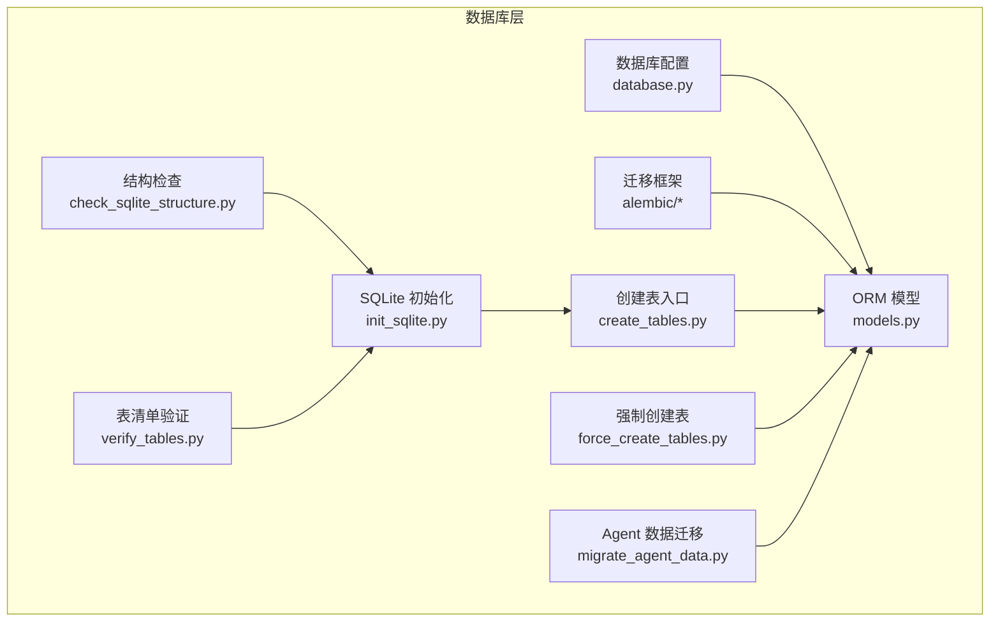
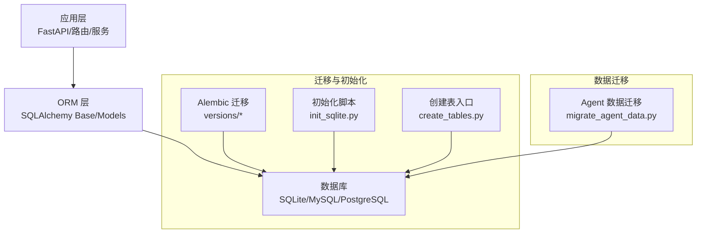
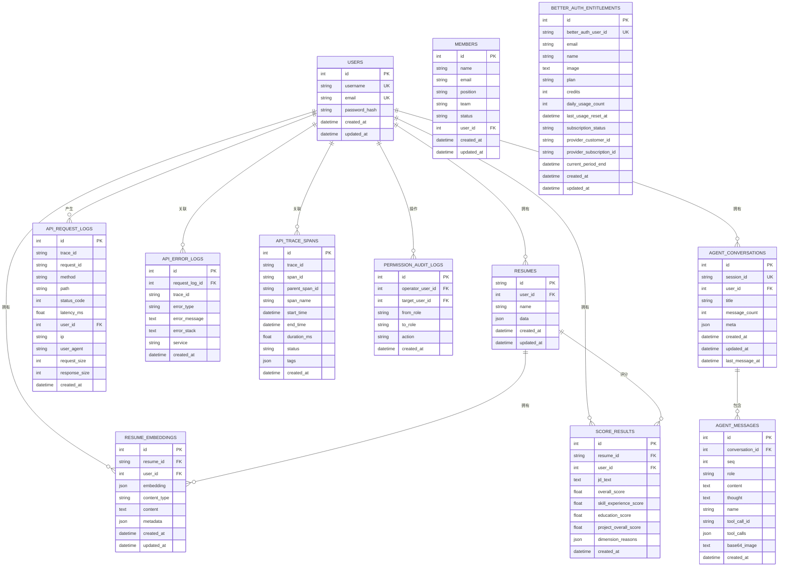
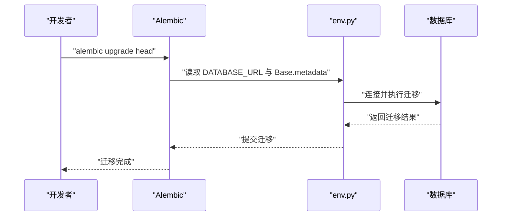
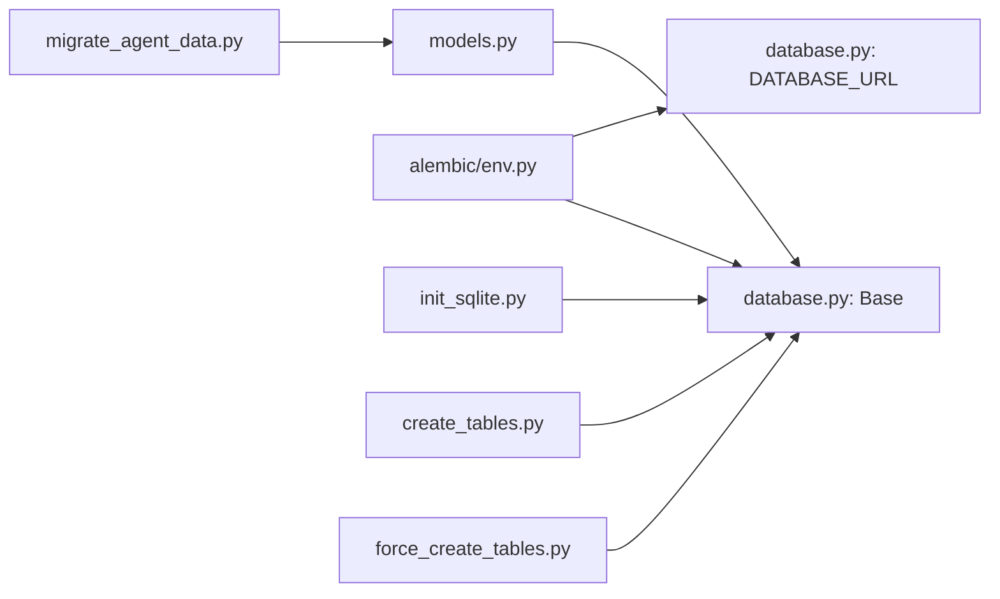

# 数据库设计

<cite>
**本文引用的文件**
- [backend/models.py](file://backend/models.py)
- [backend/database.py](file://backend/database.py)
- [backend/create_tables.py](file://backend/create_tables.py)
- [backend/init_sqlite.py](file://backend/init_sqlite.py)
- [backend/check_sqlite_structure.py](file://backend/check_sqlite_structure.py)
- [backend/verify_tables.py](file://backend/verify_tables.py)
- [backend/force_create_tables.py](file://backend/force_create_tables.py)
- [backend/alembic/env.py](file://backend/alembic/env.py)
- [backend/alembic.ini](file://backend/alembic.ini)
- [backend/alembic/versions/001_initial.py](file://backend/alembic/versions/001_initial.py)
- [backend/alembic/versions/010_add_agent_conversation_tables.py](file://backend/alembic/versions/010_add_agent_conversation_tables.py)
- [backend/alembic/versions/015_add_better_auth_entitlements.py](file://backend/alembic/versions/015_add_better_auth_entitlements.py)
- [backend/migrate_agent_data.py](file://backend/migrate_agent_data.py)
- [backend/resume_models.py](file://backend/resume_models.py)
</cite>

## 目录
1. [简介](#简介)
2. [项目结构](#项目结构)
3. [核心组件](#核心组件)
4. [架构总览](#架构总览)
5. [详细组件分析](#详细组件分析)
6. [依赖分析](#依赖分析)
7. [性能考量](#性能考量)
8. [故障排查指南](#故障排查指南)
9. [结论](#结论)
10. [附录](#附录)

## 简介
本文件系统性梳理 ResumeAgent 项目的数据库设计，覆盖实体关系设计、表结构定义、字段类型与约束、索引策略与查询优化、业务规则与完整性约束、数据库迁移机制与版本管理、备份策略、查询示例与性能优化建议、以及数据安全考虑。文档面向不同层次读者，既提供高层概览，也给出代码级映射与可视化图表。

## 项目结构
数据库相关代码主要集中在 backend 目录，围绕以下主题组织：
- ORM 模型与 Pydantic 数据模型：定义表结构、字段类型、约束与关系
- 数据库配置与连接池：支持 SQLite、MySQL、PostgreSQL
- 迁移与版本管理：基于 Alembic 的增量迁移
- 初始化与验证：创建表、检查结构、验证表清单
- 数据迁移：从本地 SQLite 迁移到远程 MySQL 的专用脚本

**图表来源**
- [backend/database.py:1-138](file://backend/database.py#L1-L138)
- [backend/models.py:111-372](file://backend/models.py#L111-L372)
- [backend/alembic/env.py:1-80](file://backend/alembic/env.py#L1-L80)
- [backend/init_sqlite.py:1-69](file://backend/init_sqlite.py#L1-L69)
- [backend/create_tables.py:1-22](file://backend/create_tables.py#L1-L22)
- [backend/force_create_tables.py:1-38](file://backend/force_create_tables.py#L1-L38)
- [backend/check_sqlite_structure.py:1-97](file://backend/check_sqlite_structure.py#L1-L97)
- [backend/verify_tables.py:1-33](file://backend/verify_tables.py#L1-L33)
- [backend/migrate_agent_data.py:1-369](file://backend/migrate_agent_data.py#L1-L369)

**章节来源**
- [backend/database.py:1-138](file://backend/database.py#L1-L138)
- [backend/models.py:111-372](file://backend/models.py#L111-L372)
- [backend/alembic/env.py:1-80](file://backend/alembic/env.py#L1-L80)
- [backend/init_sqlite.py:1-69](file://backend/init_sqlite.py#L1-L69)
- [backend/create_tables.py:1-22](file://backend/create_tables.py#L1-L22)
- [backend/force_create_tables.py:1-38](file://backend/force_create_tables.py#L1-L38)
- [backend/check_sqlite_structure.py:1-97](file://backend/check_sqlite_structure.py#L1-L97)
- [backend/verify_tables.py:1-33](file://backend/verify_tables.py#L1-L33)
- [backend/migrate_agent_data.py:1-369](file://backend/migrate_agent_data.py#L1-L369)

## 核心组件
- 数据库配置与连接池：集中于 database.py，支持从环境变量动态选择数据库类型（SQLite/MySQL/PostgreSQL），并配置连接池参数与超时
- ORM 模型：models.py 定义用户、简历、成员、API 日志、权限审计、Agent 对话与消息、向量嵌入、评分结果等表及关系
- 迁移框架：alembic/env.py 与 alembic.ini 提供迁移上下文与配置；版本脚本位于 alembic/versions/*.py
- 初始化与验证：init_sqlite.py、create_tables.py、force_create_tables.py、check_sqlite_structure.py、verify_tables.py
- 数据迁移：migrate_agent_data.py 支持从本地 SQLite 迁移 Agent 对话数据到远程 MySQL，并具备重试与去重逻辑

**章节来源**
- [backend/database.py:25-138](file://backend/database.py#L25-L138)
- [backend/models.py:111-372](file://backend/models.py#L111-L372)
- [backend/alembic/env.py:30-80](file://backend/alembic/env.py#L30-L80)
- [backend/alembic.ini:1-36](file://backend/alembic.ini#L1-L36)
- [backend/init_sqlite.py:15-69](file://backend/init_sqlite.py#L15-L69)
- [backend/create_tables.py:9-22](file://backend/create_tables.py#L9-L22)
- [backend/force_create_tables.py:7-38](file://backend/force_create_tables.py#L7-L38)
- [backend/check_sqlite_structure.py:1-97](file://backend/check_sqlite_structure.py#L1-L97)
- [backend/verify_tables.py:1-33](file://backend/verify_tables.py#L1-L33)
- [backend/migrate_agent_data.py:34-369](file://backend/migrate_agent_data.py#L34-L369)

## 架构总览
数据库层采用 SQLAlchemy ORM 映射，通过统一的 Base 元数据驱动表创建与迁移。支持多数据库后端，生产环境推荐 PostgreSQL，开发与演示可用 SQLite。迁移通过 Alembic 实现版本化演进，Agent 对话数据可从本地 SQLite 迁移至远程 MySQL。

**图表来源**
- [backend/database.py:90-138](file://backend/database.py#L90-L138)
- [backend/models.py:111-372](file://backend/models.py#L111-L372)
- [backend/alembic/env.py:30-80](file://backend/alembic/env.py#L30-L80)
- [backend/alembic/versions/001_initial.py:19-49](file://backend/alembic/versions/001_initial.py#L19-L49)
- [backend/alembic/versions/010_add_agent_conversation_tables.py:19-75](file://backend/alembic/versions/010_add_agent_conversation_tables.py#L19-L75)
- [backend/alembic/versions/015_add_better_auth_entitlements.py:18-92](file://backend/alembic/versions/015_add_better_auth_entitlements.py#L18-L92)
- [backend/init_sqlite.py:39-69](file://backend/init_sqlite.py#L39-L69)
- [backend/create_tables.py:14-22](file://backend/create_tables.py#L14-L22)
- [backend/migrate_agent_data.py:334-369](file://backend/migrate_agent_data.py#L334-L369)

## 详细组件分析

### 实体关系设计与表结构
- 用户（users）
  - 主键：自增整数
  - 唯一索引：username、email
  - 关系：一对多（用户拥有多个简历）
- 简历（resumes）
  - 主键：字符串（简历ID）
  - 外键：user_id → users.id（级联删除）
  - JSON 字段：data 存储完整简历结构
  - 索引：user_id、updated_at
- 成员（members）
  - 外键：user_id → users.id（SET NULL）
  - 状态字段：active 等
- 接口请求日志（api_request_logs）
  - 聚合指标：trace_id、request_id、method、path、latency_ms、status_code
  - 外键：user_id → users.id（SET NULL）
  - 索引：trace_id、request_id、path、user_id、created_at
- 接口错误日志（api_error_logs）
  - 外键：request_log_id → api_request_logs.id（SET NULL）
  - 索引：trace_id、created_at
- 接口链路 span（api_trace_spans）
  - 聚合指标：span_name、duration_ms、tags
  - 索引：trace_id、span_id、start_time、created_at
- 权限审计日志（permission_audit_logs）
  - 外键：operator_user_id、target_user_id → users.id（SET NULL）
  - 索引：operator_user_id、target_user_id、created_at
- Agent 会话（agent_conversations）
  - 唯一索引：session_id
  - 索引：user_id、updated_at、(user_id, updated_at)
- Agent 消息（agent_messages）
  - 外键：conversation_id → agent_conversations.id（级联删除）
  - 唯一约束：(conversation_id, seq)
  - 索引：conversation_id、tool_call_id
- 简历向量嵌入（resume_embeddings）
  - 外键：resume_id → resumes.id（级联删除）、user_id → users.id（级联删除）
  - JSON 字段：embedding、content、extra_metadata
  - 索引：resume_id、user_id、content_type、created_at
- 评分结果（score_results）
  - 外键：resume_id → resumes.id（级联删除）、user_id → users.id（级联删除）
  - 数值字段：overall_score、skill_experience_score、education_score、project_overall_score
  - JSON 字段：dimension_reasons
  - 索引：resume_id、user_id、created_at
- BetterAuth 权益（better_auth_entitlements）
  - 唯一索引：better_auth_user_id
  - 索引：email、plan、subscription_status、provider_customer_id、provider_subscription_id、updated_at

**图表来源**
- [backend/models.py:111-372](file://backend/models.py#L111-L372)
- [backend/alembic/versions/001_initial.py:19-49](file://backend/alembic/versions/001_initial.py#L19-L49)
- [backend/alembic/versions/010_add_agent_conversation_tables.py:19-75](file://backend/alembic/versions/010_add_agent_conversation_tables.py#L19-L75)
- [backend/alembic/versions/015_add_better_auth_entitlements.py:18-92](file://backend/alembic/versions/015_add_better_auth_entitlements.py#L18-L92)

**章节来源**
- [backend/models.py:111-372](file://backend/models.py#L111-L372)
- [backend/alembic/versions/001_initial.py:19-49](file://backend/alembic/versions/001_initial.py#L19-L49)
- [backend/alembic/versions/010_add_agent_conversation_tables.py:19-75](file://backend/alembic/versions/010_add_agent_conversation_tables.py#L19-L75)
- [backend/alembic/versions/015_add_better_auth_entitlements.py:18-92](file://backend/alembic/versions/015_add_better_auth_entitlements.py#L18-L92)

### 字段类型与约束
- 主键与自增：多数整数主键启用自增
- 唯一约束：用户名、邮箱、会话ID、BetterAuth 用户ID
- 外键约束：resumes.user_id、members.user_id、agent_messages.conversation_id、api_error_logs.request_log_id 等
- JSON 字段：resumes.data、api_trace_spans.tags、resume_embeddings.embedding/extra_metadata、score_results.dimension_reasons
- 时间戳：created_at、updated_at 使用服务器默认值与更新触发器
- 文本字段：长文本采用 Text 类型（如 content、error_message、jd_text）

**章节来源**
- [backend/models.py:111-372](file://backend/models.py#L111-L372)
- [backend/alembic/versions/001_initial.py:19-49](file://backend/alembic/versions/001_initial.py#L19-L49)
- [backend/alembic/versions/010_add_agent_conversation_tables.py:19-75](file://backend/alembic/versions/010_add_agent_conversation_tables.py#L19-L75)
- [backend/alembic/versions/015_add_better_auth_entitlements.py:18-92](file://backend/alembic/versions/015_add_better_auth_entitlements.py#L18-L92)

### 索引策略与查询优化
- 单列索引
  - users：username、email（唯一）
  - resumes：user_id、updated_at
  - agent_conversations：session_id（唯一）、user_id、updated_at、(user_id, updated_at)
  - agent_messages：conversation_id、tool_call_id
  - api_request_logs：trace_id、request_id、path、user_id、created_at
  - api_error_logs：trace_id、created_at
  - api_trace_spans：trace_id、span_id、start_time、created_at
  - permission_audit_logs：operator_user_id、target_user_id、created_at
  - better_auth_entitlements：better_auth_user_id、email、plan、subscription_status、provider_customer_id、provider_subscription_id、updated_at
- 复合索引
  - agent_conversations：(user_id, updated_at)
- 唯一约束
  - agent_messages：(conversation_id, seq)
- 查询优化建议
  - 使用 session_id 定位会话，结合 user_id+updated_at 过滤用户最新会话
  - 使用 trace_id、request_id 快速定位请求与错误
  - 对高频过滤字段（如 user_id、email、plan）建立索引
  - 合理使用 created_at 上的索引进行时间窗口扫描

**章节来源**
- [backend/models.py:111-372](file://backend/models.py#L111-L372)
- [backend/alembic/versions/010_add_agent_conversation_tables.py:32-40](file://backend/alembic/versions/010_add_agent_conversation_tables.py#L32-L40)
- [backend/alembic/versions/015_add_better_auth_entitlements.py:39-80](file://backend/alembic/versions/015_add_better_auth_entitlements.py#L39-L80)

### 业务规则与完整性约束
- 用户与简历：用户删除时，其简历按外键级联删除
- Agent 会话与消息：会话删除时，消息按外键级联删除；消息序列唯一保证顺序一致性
- 成员与用户：成员关联用户，断开时设为 NULL，避免硬性约束
- 权限审计：记录操作人与被操作人，便于审计追踪
- BetterAuth 权益：以 better_auth_user_id 唯一标识，便于跨系统对齐

**章节来源**
- [backend/models.py:111-372](file://backend/models.py#L111-L372)
- [backend/alembic/versions/010_add_agent_conversation_tables.py:55-57](file://backend/alembic/versions/010_add_agent_conversation_tables.py#L55-L57)

### 数据模型的业务规则与数据验证
- 简历结构：resume_models.py 定义了灵活的简历数据模型，所有字段均为可选，适配多样化的简历输入
- 结构化输出：配合 Inference/LLM 输出，将非结构化文本转为结构化简历对象
- 输入校验：Pydantic 模型在 API 层进行基础校验（类型、必填、枚举值）

**章节来源**
- [backend/resume_models.py:10-128](file://backend/resume_models.py#L10-L128)
- [backend/models.py:24-105](file://backend/models.py#L24-L105)

### 数据库迁移机制与版本管理
- 迁移入口：alembic/env.py 注入 DATABASE_URL 与 Base.metadata，支持在线/离线迁移
- 版本脚本：按功能演进拆分版本，如初始表、Agent 表、BetterAuth 权益表等
- 运行方式：通过 Alembic CLI 执行升级/降级，或在应用内调用 create_all 强制创建

**图表来源**
- [backend/alembic/env.py:34-80](file://backend/alembic/env.py#L34-L80)
- [backend/alembic.ini:1-36](file://backend/alembic.ini#L1-L36)

**章节来源**
- [backend/alembic/env.py:30-80](file://backend/alembic/env.py#L30-L80)
- [backend/alembic/versions/001_initial.py:19-49](file://backend/alembic/versions/001_initial.py#L19-L49)
- [backend/alembic/versions/010_add_agent_conversation_tables.py:19-75](file://backend/alembic/versions/010_add_agent_conversation_tables.py#L19-L75)
- [backend/alembic/versions/015_add_better_auth_entitlements.py:18-92](file://backend/alembic/versions/015_add_better_auth_entitlements.py#L18-L92)

### 数据备份策略
- SQLite：直接备份 .db 文件；建议在停机或只读期间进行
- MySQL/PostgreSQL：使用官方工具（mysqldump/pg_dump）定期导出
- 迁移与备份联动：迁移前先备份，失败时回滚；Agent 数据迁移前建议备份远程表

[本节为通用实践建议，无需特定文件引用]

### 查询示例（路径指引）
- 查看用户最新会话
  - 路径：[backend/alembic/versions/010_add_agent_conversation_tables.py:32-40](file://backend/alembic/versions/010_add_agent_conversation_tables.py#L32-L40)
- 按会话ID检索消息
  - 路径：[backend/alembic/versions/010_add_agent_conversation_tables.py:58-61](file://backend/alembic/versions/010_add_agent_conversation_tables.py#L58-L61)
- 查询某用户的简历
  - 路径：[backend/models.py:163-182](file://backend/models.py#L163-L182)
- 查询某用户的权限审计记录
  - 路径：[backend/models.py:253-265](file://backend/models.py#L253-L265)

**章节来源**
- [backend/alembic/versions/010_add_agent_conversation_tables.py:32-61](file://backend/alembic/versions/010_add_agent_conversation_tables.py#L32-L61)
- [backend/models.py:163-182](file://backend/models.py#L163-L182)
- [backend/models.py:253-265](file://backend/models.py#L253-L265)

### 性能优化建议
- 连接池参数：根据并发与延迟调整 pool_size、max_overflow、pool_recycle、pool_timeout
- 索引策略：针对高频过滤与排序字段建立索引；避免过度索引导致写入成本上升
- 查询模式：尽量使用复合索引覆盖常见查询；避免 SELECT *，仅取必要字段
- 数据类型：JSON 字段用于半结构化数据，避免频繁 JOIN；必要时拆分冗余字段
- PostgreSQL 向量：resume_embeddings 使用 JSON 存储向量，注意向量化服务与检索性能

**章节来源**
- [backend/database.py:78-112](file://backend/database.py#L78-L112)
- [backend/models.py:310-330](file://backend/models.py#L310-L330)

### 数据安全考虑
- 凭据管理：通过环境变量控制数据库连接，避免硬编码
- 连接超时与预检：在高延迟网络下启用 pool_pre_ping，降低陈旧连接风险
- 敏感字段：用户密码使用哈希存储；日志中避免泄露敏感信息
- 权限最小化：远程数据库连接使用受限账号；迁移脚本仅授予必要权限

**章节来源**
- [backend/database.py:25-112](file://backend/database.py#L25-L112)
- [backend/migrate_agent_data.py:39-41](file://backend/migrate_agent_data.py#L39-L41)

## 依赖分析
- 模块耦合
  - models.py 依赖 database.py 的 Base 与环境变量
  - alembic/env.py 依赖 database.py 的 Base 与 DATABASE_URL
  - 迁移脚本与初始化脚本均依赖 models.py 的表定义
- 外部依赖
  - SQLAlchemy ORM 与 Alembic
  - 连接器：mysql+pymysql、psycopg（根据环境变量自动切换）

**图表来源**
- [backend/models.py:18-22](file://backend/models.py#L18-L22)
- [backend/database.py:18-23](file://backend/database.py#L18-L23)
- [backend/alembic/env.py:30-41](file://backend/alembic/env.py#L30-L41)
- [backend/init_sqlite.py:13-13](file://backend/init_sqlite.py#L13-L13)
- [backend/create_tables.py:9-9](file://backend/create_tables.py#L9-L9)
- [backend/force_create_tables.py:8-9](file://backend/force_create_tables.py#L8-L9)
- [backend/migrate_agent_data.py:28-32](file://backend/migrate_agent_data.py#L28-L32)

**章节来源**
- [backend/models.py:18-22](file://backend/models.py#L18-L22)
- [backend/database.py:18-23](file://backend/database.py#L18-L23)
- [backend/alembic/env.py:30-41](file://backend/alembic/env.py#L30-L41)
- [backend/init_sqlite.py:13-13](file://backend/init_sqlite.py#L13-L13)
- [backend/create_tables.py:9-9](file://backend/create_tables.py#L9-L9)
- [backend/force_create_tables.py:8-9](file://backend/force_create_tables.py#L8-L9)
- [backend/migrate_agent_data.py:28-32](file://backend/migrate_agent_data.py#L28-L32)

## 性能考量
- 连接池参数
  - pool_pre_ping：在高延迟网络下建议开启，确保连接有效性
  - pool_recycle：避免连接老化导致的异常
  - pool_size/max_overflow：根据并发峰值调整，避免排队超时
- 索引与扫描
  - 为高频过滤字段建立索引，减少全表扫描
  - 时间范围查询利用 created_at 索引
- 写入优化
  - 批量插入与事务合并，减少往返
  - 避免在热路径上执行复杂 JOIN

[本节提供通用指导，无需特定文件引用]

## 故障排查指南
- 初始化失败
  - 检查 DATABASE_URL 是否正确（SQLite/MySQL/PostgreSQL）
  - 确认 .env 文件存在且包含必要变量
  - 参考：[backend/init_sqlite.py:20-69](file://backend/init_sqlite.py#L20-L69)、[backend/create_tables.py:14-22](file://backend/create_tables.py#L14-L22)
- 表结构缺失
  - 使用 Alembic 升级到最新版本
  - 或使用 create_all 强制创建
  - 参考：[backend/alembic/env.py:66-74](file://backend/alembic/env.py#L66-L74)、[backend/force_create_tables.py:18-38](file://backend/force_create_tables.py#L18-L38)
- SQLite 结构检查
  - 使用 check_sqlite_structure.py 检查表与索引
  - 参考：[backend/check_sqlite_structure.py:1-97](file://backend/check_sqlite_structure.py#L1-L97)
- 迁移 Agent 数据失败
  - 确认远程表已升级（alembic upgrade head）
  - 使用 dry-run 预演，再执行真实迁移
  - 参考：[backend/migrate_agent_data.py:100-122](file://backend/migrate_agent_data.py#L100-L122)

**章节来源**
- [backend/init_sqlite.py:20-69](file://backend/init_sqlite.py#L20-L69)
- [backend/create_tables.py:14-22](file://backend/create_tables.py#L14-L22)
- [backend/alembic/env.py:66-74](file://backend/alembic/env.py#L66-L74)
- [backend/force_create_tables.py:18-38](file://backend/force_create_tables.py#L18-L38)
- [backend/check_sqlite_structure.py:1-97](file://backend/check_sqlite_structure.py#L1-L97)
- [backend/migrate_agent_data.py:100-122](file://backend/migrate_agent_data.py#L100-L122)

## 结论
本数据库设计以 SQLAlchemy ORM 为核心，结合 Alembic 进行版本化演进，覆盖用户、简历、Agent 对话、日志与权益等核心业务域。通过合理的索引策略与连接池配置，满足开发与生产的多场景需求。迁移脚本与初始化工具提供了从 SQLite 到远程数据库的平滑过渡方案。建议在生产环境中优先使用 PostgreSQL，并持续完善索引与查询优化策略。

## 附录
- 环境变量与连接字符串
  - USE_POSTGRESQL：启用 PostgreSQL
  - POSTGRESQL_URL/DATABASE_URL：数据库连接串
  - DB_POOL_*：连接池参数
  - 参考：[backend/database.py:25-112](file://backend/database.py#L25-L112)
- 迁移配置
  - alembic.ini：日志与脚本位置
  - 参考：[backend/alembic.ini:1-36](file://backend/alembic.ini#L1-L36)

**章节来源**
- [backend/database.py:25-112](file://backend/database.py#L25-L112)
- [backend/alembic.ini:1-36](file://backend/alembic.ini#L1-L36)