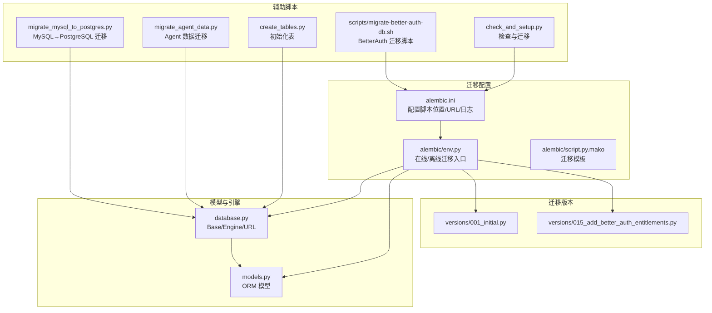
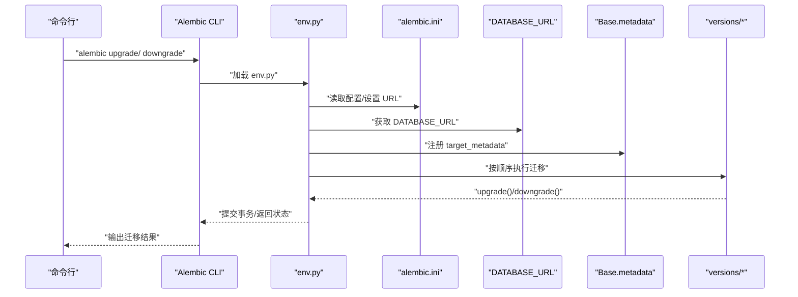
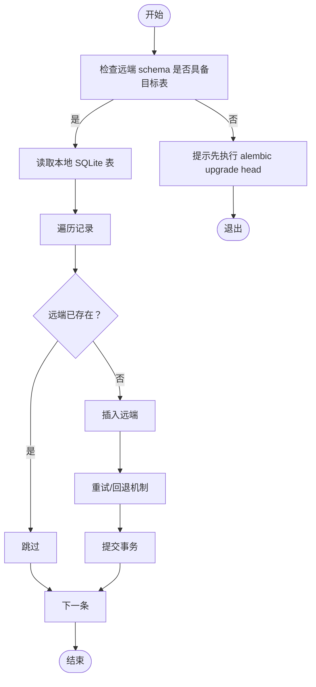
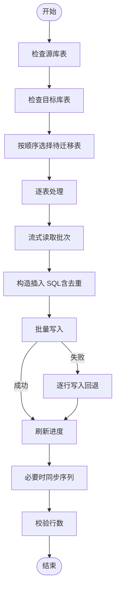
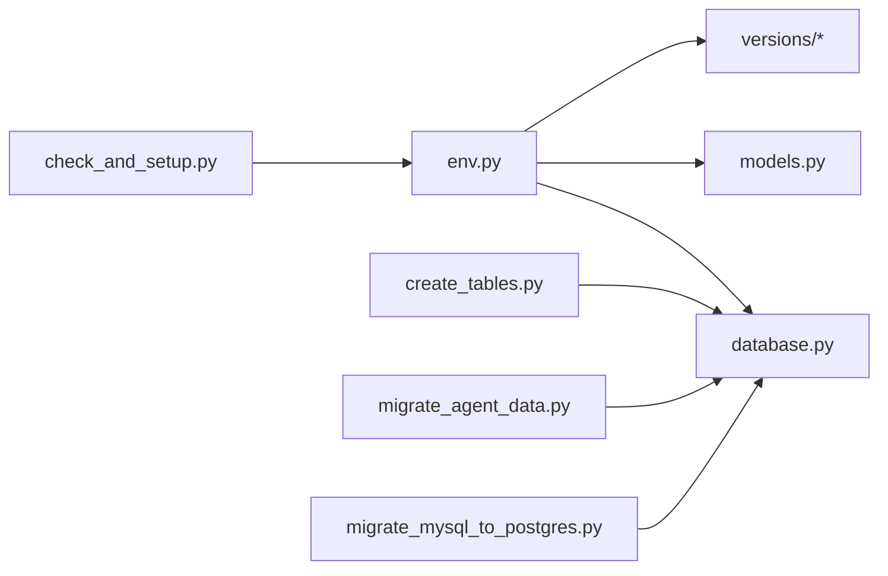

# 数据库迁移管理

<cite>
**本文引用的文件**
- [alembic.ini](file://backend/alembic.ini)
- [env.py](file://backend/alembic/env.py)
- [script.py.mako](file://backend/alembic/script.py.mako)
- [001_initial.py](file://backend/alembic/versions/001_initial.py)
- [015_add_better_auth_entitlements.py](file://backend/alembic/versions/015_add_better_auth_entitlements.py)
- [database.py](file://backend/database.py)
- [models.py](file://backend/models.py)
- [migrate_agent_data.py](file://backend/migrate_agent_data.py)
- [migrate_mysql_to_postgres.py](file://backend/migrate_mysql_to_postgres.py)
- [migrate-better-auth-db.sh](file://scripts/migrate-better-auth-db.sh)
- [check_and_setup.py](file://backend/check_and_setup.py)
- [create_tables.py](file://backend/create_tables.py)
</cite>

## 目录
1. [引言](#引言)
2. [项目结构](#项目结构)
3. [核心组件](#核心组件)
4. [架构总览](#架构总览)
5. [详细组件分析](#详细组件分析)
6. [依赖分析](#依赖分析)
7. [性能考虑](#性能考虑)
8. [故障排除指南](#故障排除指南)
9. [结论](#结论)
10. [附录](#附录)

## 引言
本文件面向数据库迁移管理，围绕 Alembic 迁移框架在本项目的落地实践进行系统化梳理，覆盖迁移文件的创建、版本管理、回滚策略、自动化流程与最佳实践，并结合项目中的数据迁移脚本与环境配置，给出从旧版本升级到新版本的步骤、迁移脚本编写规范与测试方法、常见场景处理方案以及生产环境迁移策略与风险控制建议。

## 项目结构
本项目采用 SQLAlchemy + Alembic 的标准迁移方案，数据库元数据由统一的 Base 定义，Alembic 通过 env.py 动态发现模型并生成迁移；同时提供独立的数据迁移脚本用于跨数据库或跨实例的数据迁移。

图示来源
- [alembic.ini:1-36](file://backend/alembic.ini#L1-L36)
- [env.py:1-80](file://backend/alembic/env.py#L1-L80)
- [script.py.mako:1-25](file://backend/alembic/script.py.mako#L1-L25)
- [001_initial.py:1-49](file://backend/alembic/versions/001_initial.py#L1-L49)
- [015_add_better_auth_entitlements.py:1-92](file://backend/alembic/versions/015_add_better_auth_entitlements.py#L1-L92)
- [database.py:1-138](file://backend/database.py#L1-L138)
- [models.py:1-372](file://backend/models.py#L1-L372)
- [check_and_setup.py:1-82](file://backend/check_and_setup.py#L1-L82)
- [create_tables.py:1-22](file://backend/create_tables.py#L1-L22)
- [migrate_agent_data.py:1-369](file://backend/migrate_agent_data.py#L1-L369)
- [migrate_mysql_to_postgres.py:1-346](file://backend/migrate_mysql_to_postgres.py#L1-L346)
- [migrate-better-auth-db.sh:1-31](file://scripts/migrate-better-auth-db.sh#L1-L31)

章节来源
- [alembic.ini:1-36](file://backend/alembic.ini#L1-L36)
- [env.py:1-80](file://backend/alembic/env.py#L1-L80)
- [script.py.mako:1-25](file://backend/alembic/script.py.mako#L1-L25)
- [database.py:1-138](file://backend/database.py#L1-L138)
- [models.py:1-372](file://backend/models.py#L1-L372)

## 核心组件
- Alembic 配置与入口
  - alembic.ini：定义脚本位置、SQLAlchemy URL、日志级别与格式。
  - env.py：动态将项目根目录加入 sys.path，读取 DATABASE_URL 并将 Base.metadata 注入 Alembic，支持在线/离线迁移。
  - script.py.mako：迁移文件模板，定义 upgrade()/downgrade()、revision 标识与导入区。
- 版本迁移文件
  - versions 下的迁移文件按顺序演进，例如初始迁移与 BetterAuth 权益表迁移，均遵循模板约定。
- 数据库与模型
  - database.py：统一的 DATABASE_URL 解析、连接池参数与 Base/Engine 定义。
  - models.py：ORM 模型定义，供 Alembic autogenerate 识别与生成迁移。
- 辅助迁移脚本
  - check_and_setup.py：集成检查与迁移流程。
  - create_tables.py：直接基于 Base 创建所有表（非迁移）。
  - migrate_agent_data.py：SQLite→远端数据库的 Agent 对话数据迁移。
  - migrate_mysql_to_postgres.py：MySQL→PostgreSQL 的结构与数据迁移。
  - scripts/migrate-better-auth-db.sh：BetterAuth 数据库迁移的受控执行脚本。

章节来源
- [alembic.ini:1-36](file://backend/alembic.ini#L1-L36)
- [env.py:1-80](file://backend/alembic/env.py#L1-L80)
- [script.py.mako:1-25](file://backend/alembic/script.py.mako#L1-L25)
- [001_initial.py:1-49](file://backend/alembic/versions/001_initial.py#L1-L49)
- [015_add_better_auth_entitlements.py:1-92](file://backend/alembic/versions/015_add_better_auth_entitlements.py#L1-L92)
- [database.py:1-138](file://backend/database.py#L1-L138)
- [models.py:1-372](file://backend/models.py#L1-L372)
- [check_and_setup.py:1-82](file://backend/check_and_setup.py#L1-L82)
- [create_tables.py:1-22](file://backend/create_tables.py#L1-L22)
- [migrate_agent_data.py:1-369](file://backend/migrate_agent_data.py#L1-L369)
- [migrate_mysql_to_postgres.py:1-346](file://backend/migrate_mysql_to_postgres.py#L1-L346)
- [migrate-better-auth-db.sh:1-31](file://scripts/migrate-better-auth-db.sh#L1-L31)

## 架构总览
下图展示 Alembic 在本项目中的工作流：env.py 作为入口，读取 DATABASE_URL，将 Base.metadata 传给 Alembic；迁移文件在 versions 目录中按顺序执行；同时提供在线/离线两种运行模式。

图示来源
- [env.py:1-80](file://backend/alembic/env.py#L1-L80)
- [alembic.ini:1-36](file://backend/alembic.ini#L1-L36)
- [database.py:1-138](file://backend/database.py#L1-L138)

## 详细组件分析

### Alembic 配置与模板
- 配置要点
  - script_location 指向 alembic 目录。
  - sqlalchemy.url 通过环境变量注入，便于不同环境切换。
  - 日志级别与格式可控，便于排障。
- 模板要点
  - 提供 upgrade()/downgrade() 占位，导入区可扩展。
  - revision/down_revision/branch_labels/depends_on 由 Alembic 自动生成。

章节来源
- [alembic.ini:1-36](file://backend/alembic.ini#L1-L36)
- [script.py.mako:1-25](file://backend/alembic/script.py.mako#L1-L25)

### 迁移入口与上下文
- 在线模式：通过 engine_from_config 与 context.configure 建立连接，开启事务执行迁移。
- 离线模式：直接使用配置中的 URL，以字面量绑定方式执行迁移。
- URL 注入：env.py 从 DATABASE_URL 动态设置 sqlalchemy.url，确保与应用一致。

章节来源
- [env.py:1-80](file://backend/alembic/env.py#L1-L80)
- [database.py:1-138](file://backend/database.py#L1-L138)

### 初始迁移与 BetterAuth 权益迁移
- 初始迁移
  - 创建 users/resumes 表及索引，演示基本表结构与索引创建/删除。
- BetterAuth 权益迁移
  - 新增 better_auth_entitlements 表，包含用户权益、订阅状态、计费指标等字段，并建立多个索引，体现复杂业务表的迁移模式。

章节来源
- [001_initial.py:1-49](file://backend/alembic/versions/001_initial.py#L1-L49)
- [015_add_better_auth_entitlements.py:1-92](file://backend/alembic/versions/015_add_better_auth_entitlements.py#L1-L92)

### 数据库与模型
- DATABASE_URL 解析逻辑
  - 支持 PostgreSQL/MySQL/SQLite 多种来源，自动修正驱动前缀，Railway 环境变量兼容。
  - 连接池参数可调，针对远程高延迟场景优化。
- Base/Engine/Session
  - 统一的 Base 与 Engine 定义，init_db 可直接创建所有表（非迁移路径）。

章节来源
- [database.py:1-138](file://backend/database.py#L1-L138)
- [models.py:1-372](file://backend/models.py#L1-L372)

### 辅助迁移脚本

#### Agent 数据迁移（SQLite→远端数据库）
- 功能概述
  - 从本地 SQLite 读取 agent_conversations/agent_messages，写入远端数据库。
  - 支持去重（按主键）、批量写入、指数回退重试、干跑模式。
- 关键流程
  - 校验远端 schema 是否存在目标表（否则提示先执行 alembic upgrade head）。
  - 逐表迁移，记录统计：processed/migrated/skipped/failed。
  - 支持自定义重试次数与延迟。

图示来源
- [migrate_agent_data.py:1-369](file://backend/migrate_agent_data.py#L1-L369)

章节来源
- [migrate_agent_data.py:1-369](file://backend/migrate_agent_data.py#L1-L369)

#### MySQL→PostgreSQL 数据迁移
- 功能概述
  - 按推荐顺序迁移表，支持仅迁移指定表、批量写入、ON CONFLICT DO NOTHING 去重、布尔类型兼容、序列同步。
- 关键流程
  - 解析表名与主键，构造插入 SQL。
  - 批量写入失败时回退逐行写入，保证尽可能完成迁移。
  - 校验源/目标表行数一致性。

图示来源
- [migrate_mysql_to_postgres.py:1-346](file://backend/migrate_mysql_to_postgres.py#L1-L346)

章节来源
- [migrate_mysql_to_postgres.py:1-346](file://backend/migrate_mysql_to_postgres.py#L1-L346)

#### BetterAuth 数据库迁移脚本
- 功能概述
  - 通过环境变量显式确认后执行 BetterAuth 数据库迁移与校验。
  - 依赖前端脚本（在 web 目录）执行迁移与检查。

章节来源
- [migrate-better-auth-db.sh:1-31](file://scripts/migrate-better-auth-db.sh#L1-L31)

### 自动化与初始化流程
- check_and_setup.py
  - 检查 MySQL 服务与数据库是否存在，若存在则执行 alembic upgrade head。
- create_tables.py
  - 直接基于 Base 创建所有表，适用于快速初始化或特定场景。

章节来源
- [check_and_setup.py:1-82](file://backend/check_and_setup.py#L1-L82)
- [create_tables.py:1-22](file://backend/create_tables.py#L1-L22)

## 依赖分析
- Alembic 与应用耦合点
  - env.py 从 database.py 读取 DATABASE_URL 与 Base.metadata，确保迁移与应用使用同一元数据与连接配置。
- 迁移文件依赖
  - versions 下的迁移文件彼此有序，down_revision 指向前一版本，形成线性演进链。
- 跨数据库迁移
  - migrate_mysql_to_postgres.py 与 migrate_agent_data.py 独立于 Alembic，直接使用 SQLAlchemy 引擎进行数据迁移。

图示来源
- [env.py:1-80](file://backend/alembic/env.py#L1-L80)
- [database.py:1-138](file://backend/database.py#L1-L138)
- [models.py:1-372](file://backend/models.py#L1-L372)
- [check_and_setup.py:1-82](file://backend/check_and_setup.py#L1-L82)
- [create_tables.py:1-22](file://backend/create_tables.py#L1-L22)
- [migrate_agent_data.py:1-369](file://backend/migrate_agent_data.py#L1-L369)
- [migrate_mysql_to_postgres.py:1-346](file://backend/migrate_mysql_to_postgres.py#L1-L346)

章节来源
- [env.py:1-80](file://backend/alembic/env.py#L1-L80)
- [database.py:1-138](file://backend/database.py#L1-L138)
- [models.py:1-372](file://backend/models.py#L1-L372)
- [check_and_setup.py:1-82](file://backend/check_and_setup.py#L1-L82)
- [create_tables.py:1-22](file://backend/create_tables.py#L1-L22)
- [migrate_agent_data.py:1-369](file://backend/migrate_agent_data.py#L1-L369)
- [migrate_mysql_to_postgres.py:1-346](file://backend/migrate_mysql_to_postgres.py#L1-L346)

## 性能考虑
- 连接池与超时
  - database.py 提供可调的 pool_pre_ping、pool_recycle、pool_size、max_overflow、pool_timeout 等参数，适配远程高延迟场景。
- 批量写入与回退
  - migrate_mysql_to_postgres.py 的批量写入失败时回退逐行写入，兼顾吞吐与稳定性。
- 序列同步
  - 迁移后同步序列，避免主键冲突，保障后续写入连续性。
- 迁移执行
  - 建议在低峰期执行大表迁移，配合批量大小与重试策略降低对线上服务的影响。

章节来源
- [database.py:1-138](file://backend/database.py#L1-L138)
- [migrate_mysql_to_postgres.py:1-346](file://backend/migrate_mysql_to_postgres.py#L1-L346)

## 故障排除指南
- 迁移前检查
  - 确认 DATABASE_URL 正确且可连通；在 env.py 中已将 DATABASE_URL 注入 Alembic。
  - 使用 check_and_setup.py 快速验证迁移前置条件。
- 常见问题定位
  - 远端缺少目标表：migrate_agent_data.py 会在检查阶段提示先执行 alembic upgrade head。
  - 权限不足：核对数据库用户权限与连接串。
  - 驱动/方言差异：migrate_mysql_to_postgres.py 已做标识符转义与布尔类型兼容处理。
- 回滚策略
  - 使用 downgrade() 逐步回滚至安全版本；建议在测试环境先行验证。
- 生产风险控制
  - 限制并发与窗口期；对大表迁移采用分批与停写策略；迁移前后进行完整性校验。

章节来源
- [env.py:1-80](file://backend/alembic/env.py#L1-L80)
- [migrate_agent_data.py:1-369](file://backend/migrate_agent_data.py#L1-L369)
- [check_and_setup.py:1-82](file://backend/check_and_setup.py#L1-L82)

## 结论
本项目以 Alembic 为核心，结合统一的 DATABASE_URL 与 Base 元数据，实现了可追溯、可回滚的数据库结构演进；同时提供了 Agent 数据迁移与 MySQL→PostgreSQL 的数据迁移脚本，覆盖多种实际场景。通过严格的配置注入、模板化迁移文件与受控的执行脚本，项目在开发与生产环境中均可实现稳健的迁移管理。

## 附录

### 迁移文件编写规范
- 使用 Alembic 模板 script.py.mako，保持 upgrade()/downgrade() 结构清晰。
- 明确 revision 与 down_revision，确保版本链正确。
- 在 downgrade 中尽量完整回滚，包括索引、约束与默认值。
- 对复杂表（如向量嵌入、对话消息）需考虑索引与唯一约束的回滚顺序。

章节来源
- [script.py.mako:1-25](file://backend/alembic/script.py.mako#L1-L25)
- [015_add_better_auth_entitlements.py:1-92](file://backend/alembic/versions/015_add_better_auth_entitlements.py#L1-L92)

### 迁移测试方法
- 单元测试
  - 使用内存 SQLite 与 StaticPool 快速创建最小化表结构，验证迁移后的元数据一致性。
- 端到端验证
  - 在隔离环境执行 alembic upgrade head，再运行应用层查询/写入，验证功能正常。
- 数据迁移验证
  - migrate_mysql_to_postgres.py 提供源/目标表行数对比，迁移完成后再次校验。

章节来源
- [migrate_mysql_to_postgres.py:1-346](file://backend/migrate_mysql_to_postgres.py#L1-L346)

### 从旧版本升级到新版本的步骤
- 准备工作
  - 确认 DATABASE_URL 与数据库服务可用。
  - 若涉及 BetterAuth，先执行 scripts/migrate-better-auth-db.sh（需显式确认）。
- 执行迁移
  - 使用 alembic upgrade head 升级到最新版本。
  - 如需回滚，使用 alembic downgrade -1 逐级回退。
- 数据迁移
  - 若存在历史数据迁移需求，使用 migrate_agent_data.py 或 migrate_mysql_to_postgres.py。

章节来源
- [migrate-better-auth-db.sh:1-31](file://scripts/migrate-better-auth-db.sh#L1-L31)
- [check_and_setup.py:1-82](file://backend/check_and_setup.py#L1-L82)
- [migrate_agent_data.py:1-369](file://backend/migrate_agent_data.py#L1-L369)
- [migrate_mysql_to_postgres.py:1-346](file://backend/migrate_mysql_to_postgres.py#L1-L346)

### 生产环境迁移策略与风险控制
- 策略
  - 低峰期执行；分批迁移；预热与回滚预案。
- 风险控制
  - 迁移前备份；迁移后校验；监控连接池与慢查询。
  - 对大表采用分批与停写窗口；对唯一约束冲突采用去重策略。

章节来源
- [database.py:1-138](file://backend/database.py#L1-L138)
- [migrate_mysql_to_postgres.py:1-346](file://backend/migrate_mysql_to_postgres.py#L1-L346)