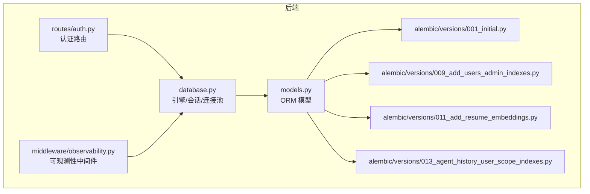
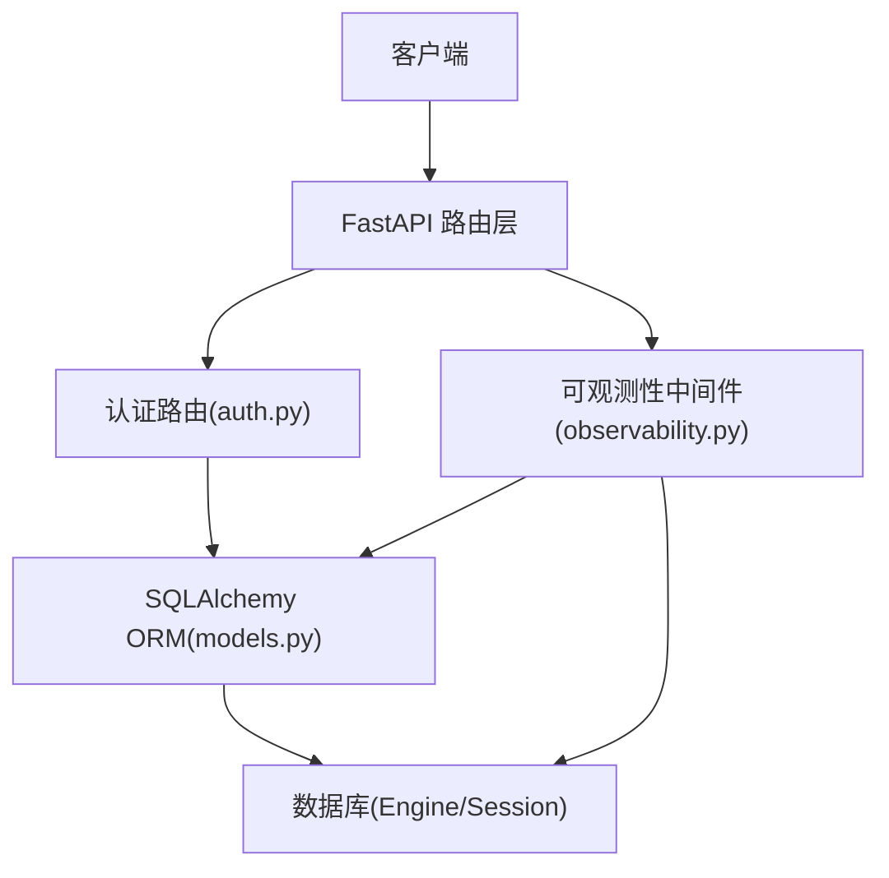
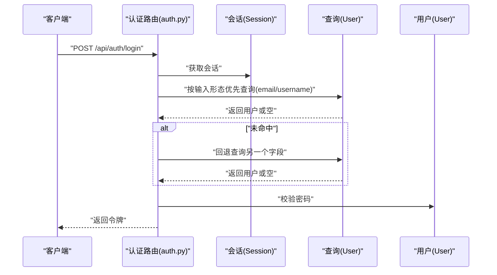
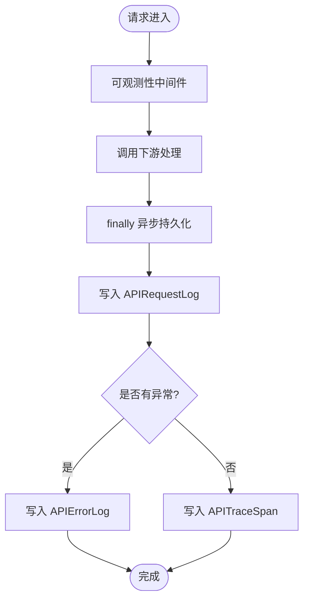
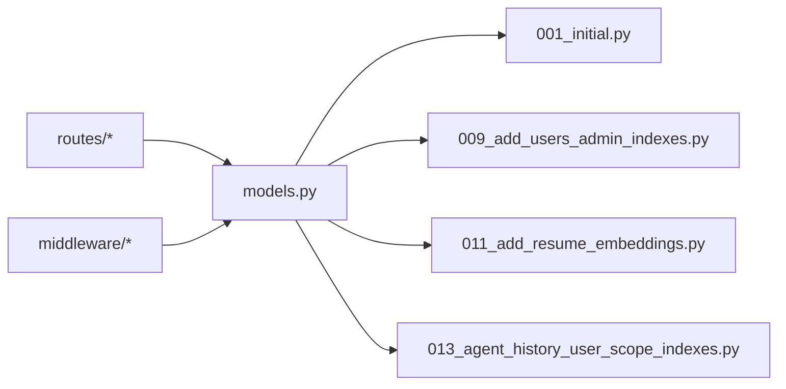

# 索引策略与查询优化

<cite>
**本文引用的文件**
- [models.py](file://backend/models.py)
- [database.py](file://backend/database.py)
- [001_initial.py](file://backend/alembic/versions/001_initial.py)
- [009_add_users_admin_indexes.py](file://backend/alembic/versions/009_add_users_admin_indexes.py)
- [011_add_resume_embeddings.py](file://backend/alembic/versions/011_add_resume_embeddings.py)
- [013_agent_history_user_scope_indexes.py](file://backend/alembic/versions/013_agent_history_user_scope_indexes.py)
- [auth.py](file://backend/routes/auth.py)
- [observability.py](file://backend/middleware/observability.py)
</cite>

## 目录
1. [简介](#简介)
2. [项目结构](#项目结构)
3. [核心组件](#核心组件)
4. [架构总览](#架构总览)
5. [详细组件分析](#详细组件分析)
6. [依赖分析](#依赖分析)
7. [性能考量](#性能考量)
8. [故障排查指南](#故障排查指南)
9. [结论](#结论)
10. [附录](#附录)

## 简介
本文件聚焦于 ResumeAgent 项目的数据库索引策略与查询优化，结合现有模型定义、迁移脚本与路由实现，系统阐述：
- 各表的索引设计原则：单列索引、复合索引、唯一索引的应用场景与收益
- 查询性能优化策略：WHERE 条件优化、JOIN 优化、排序优化
- 常见查询模式与对应的索引建议
- 慢查询分析方法与性能监控指标
- 具体的索引创建语句与查询优化实例（以路径形式呈现）

## 项目结构
后端采用 SQLAlchemy ORM + Alembic 迁移，数据库连接与会话管理集中于 database.py，模型定义位于 models.py，路由层在 routes/*，可观测性中间件在 middleware/*。

图示来源
- [database.py:1-138](file://backend/database.py#L1-L138)
- [models.py:111-372](file://backend/models.py#L111-L372)
- [auth.py:149-226](file://backend/routes/auth.py#L149-L226)
- [observability.py:19-191](file://backend/middleware/observability.py#L19-L191)
- [001_initial.py:19-41](file://backend/alembic/versions/001_initial.py#L19-L41)
- [009_add_users_admin_indexes.py:24-32](file://backend/alembic/versions/009_add_users_admin_indexes.py#L24-L32)
- [011_add_resume_embeddings.py:19-50](file://backend/alembic/versions/011_add_resume_embeddings.py#L19-L50)
- [013_agent_history_user_scope_indexes.py:18-24](file://backend/alembic/versions/013_agent_history_user_scope_indexes.py#L18-L24)

章节来源
- [database.py:1-138](file://backend/database.py#L1-L138)
- [models.py:111-372](file://backend/models.py#L111-L372)

## 核心组件
- 数据库引擎与连接池：统一配置连接参数、池大小与超时，支持 MySQL/PostgreSQL/SQLite
- ORM 模型：定义表结构、索引与关系，涵盖用户、简历、对话、日志、向量嵌入等
- 路由与查询：认证路由演示了单索引查询与条件分支，避免 OR 导致索引不稳定
- 可观测性：异步记录请求日志、错误日志与链路 span，支撑慢查询定位与性能分析

章节来源
- [database.py:69-138](file://backend/database.py#L69-L138)
- [models.py:111-372](file://backend/models.py#L111-L372)
- [auth.py:149-226](file://backend/routes/auth.py#L149-L226)
- [observability.py:19-191](file://backend/middleware/observability.py#L19-L191)

## 架构总览

图示来源
- [auth.py:149-226](file://backend/routes/auth.py#L149-L226)
- [observability.py:19-191](file://backend/middleware/observability.py#L19-L191)
- [models.py:111-372](file://backend/models.py#L111-L372)
- [database.py:69-138](file://backend/database.py#L69-L138)

## 详细组件分析

### 用户表（users）索引策略
- 单列索引
  - email：唯一索引，用于登录与去重
  - role：普通索引，支持按角色过滤
  - last_login_ip：普通索引，支持按来源 IP 过滤
  - updated_at：普通索引，支持按更新时间排序/范围查询
- 复合索引
  - role + updated_at：覆盖“按角色筛选 + 时间排序”的常见查询
- 设计原则
  - 唯一索引保证业务一致性（用户名/邮箱）
  - 普通索引服务于 WHERE/ORDER BY/JOIN 的过滤与排序
  - 复合索引平衡选择性与查询模式，避免过度冗余

章节来源
- [models.py:111-136](file://backend/models.py#L111-L136)
- [001_initial.py:20-28](file://backend/alembic/versions/001_initial.py#L20-L28)
- [009_add_users_admin_indexes.py:24-32](file://backend/alembic/versions/009_add_users_admin_indexes.py#L24-L32)

### 简历表（resumes）索引策略
- 单列索引
  - user_id：外键索引，支撑按用户查询简历列表
  - updated_at：时间索引，支撑按更新时间排序/分页
- 设计原则
  - 外键索引提升 JOIN 与删除级联效率
  - 时间索引支撑“最近更新”类查询

章节来源
- [models.py:163-182](file://backend/models.py#L163-L182)
- [001_initial.py:30-40](file://backend/alembic/versions/001_initial.py#L30-L40)

### Agent 对话表（agent_conversations）索引策略
- 复合索引
  - user_id + last_message_at + updated_at：覆盖“用户作用域 + 最近消息 + 更新时间”的查询模式，常用于会话列表与分页
- 设计原则
  - 复合索引优先放置选择性高的列，再放排序/范围列
  - 与业务查询模式高度契合，减少回表与临时排序

章节来源
- [models.py:267-281](file://backend/models.py#L267-L281)
- [013_agent_history_user_scope_indexes.py:18-24](file://backend/alembic/versions/013_agent_history_user_scope_indexes.py#L18-L24)

### 向量嵌入表（resume_embeddings）索引策略
- 单列索引
  - id、resume_id、user_id、content_type
- 复合索引
  - user_id + content_type：支撑“按用户 + 片段类型”检索
- 设计原则
  - 为后续 pgvector 向量相似度检索预留基础索引
  - 复合索引服务典型查询：用户 + 内容类型

章节来源
- [models.py:310-330](file://backend/models.py#L310-L330)
- [011_add_resume_embeddings.py:19-50](file://backend/alembic/versions/011_add_resume_embeddings.py#L19-L50)

### 认证登录查询优化（WHERE/JOIN/排序）
- WHERE 条件优化
  - 避免 OR 导致索引不稳定：根据输入形态优先尝试 email 或 username，再回退另一条件
  - 通过单条件查询充分利用 email/username 索引
- JOIN 优化
  - 简历与用户通过 user_id 外键关联，外键列建立索引，减少 JOIN 排序与回表
- 排序优化
  - 使用 updated_at 索引进行 ORDER BY，避免额外排序开销

图示来源
- [auth.py:149-226](file://backend/routes/auth.py#L149-L226)
- [models.py:111-136](file://backend/models.py#L111-L136)

章节来源
- [auth.py:149-226](file://backend/routes/auth.py#L149-L226)
- [models.py:111-182](file://backend/models.py#L111-L182)

### 常见查询模式与索引建议
- 模式一：按用户查询简历列表
  - 查询：SELECT ... FROM resumes WHERE user_id = ? ORDER BY updated_at DESC
  - 建议：user_id（单列索引）、updated_at（单列索引）
- 模式二：按角色筛选并按更新时间排序
  - 查询：SELECT ... FROM users WHERE role = ? ORDER BY updated_at DESC
  - 建议：role + updated_at（复合索引）
- 模式三：按用户与内容类型检索向量嵌入
  - 查询：SELECT ... FROM resume_embeddings WHERE user_id = ? AND content_type = ?
  - 建议：user_id + content_type（复合索引）
- 模式四：按用户查询对话会话列表
  - 查询：SELECT ... FROM agent_conversations WHERE user_id = ? ORDER BY last_message_at DESC, updated_at DESC
  - 建议：user_id + last_message_at + updated_at（复合索引）

章节来源
- [models.py:163-182](file://backend/models.py#L163-L182)
- [models.py:111-136](file://backend/models.py#L111-L136)
- [models.py:310-330](file://backend/models.py#L310-L330)
- [models.py:267-281](file://backend/models.py#L267-L281)
- [009_add_users_admin_indexes.py:24-32](file://backend/alembic/versions/009_add_users_admin_indexes.py#L24-L32)
- [011_add_resume_embeddings.py:45-50](file://backend/alembic/versions/011_add_resume_embeddings.py#L45-L50)
- [013_agent_history_user_scope_indexes.py:18-24](file://backend/alembic/versions/013_agent_history_user_scope_indexes.py#L18-L24)

### 慢查询分析与性能监控
- 指标采集
  - 请求日志：记录 trace_id、request_id、method、path、status_code、latency_ms、user_id、ip、ua、尺寸等
  - 错误日志：捕获异常类型、消息、堆栈，必要时与请求日志关联
  - 链路 span：记录 span 名称、开始/结束时间、耗时、状态与标签
- 异步落库
  - 观测中间件在 finally 阶段异步写入，避免阻塞主请求
- 分析流程
  - 通过 trace_id/ request_id 关联 APIRequestLog、APIErrorLog、APITraceSpan
  - 结合数据库 EXPLAIN/ANALYZE（MySQL/PostgreSQL）定位慢查询
  - 结合索引建议与查询模式评估是否需要新增索引或调整复合索引顺序

图示来源
- [observability.py:19-191](file://backend/middleware/observability.py#L19-L191)
- [models.py:200-251](file://backend/models.py#L200-L251)

章节来源
- [observability.py:19-191](file://backend/middleware/observability.py#L19-L191)
- [models.py:200-251](file://backend/models.py#L200-L251)

## 依赖分析
- 模型与迁移
  - models.py 定义表结构与索引，Alembic 迁移脚本创建对应索引
- 路由与模型
  - 路由层通过 SQLAlchemy ORM 查询，依赖模型定义的索引与关系
- 中间件与模型
  - 观测中间件写入日志与链路数据，依赖模型定义的表结构

图示来源
- [models.py:111-372](file://backend/models.py#L111-L372)
- [001_initial.py:19-41](file://backend/alembic/versions/001_initial.py#L19-L41)
- [009_add_users_admin_indexes.py:24-32](file://backend/alembic/versions/009_add_users_admin_indexes.py#L24-L32)
- [011_add_resume_embeddings.py:19-50](file://backend/alembic/versions/011_add_resume_embeddings.py#L19-L50)
- [013_agent_history_user_scope_indexes.py:18-24](file://backend/alembic/versions/013_agent_history_user_scope_indexes.py#L18-L24)

章节来源
- [models.py:111-372](file://backend/models.py#L111-L372)
- [001_initial.py:19-41](file://backend/alembic/versions/001_initial.py#L19-L41)
- [009_add_users_admin_indexes.py:24-32](file://backend/alembic/versions/009_add_users_admin_indexes.py#L24-L32)
- [011_add_resume_embeddings.py:19-50](file://backend/alembic/versions/011_add_resume_embeddings.py#L19-L50)
- [013_agent_history_user_scope_indexes.py:18-24](file://backend/alembic/versions/013_agent_history_user_scope_indexes.py#L18-L24)

## 性能考量
- 连接池与超时
  - 统一配置 pool_pre_ping、pool_recycle、pool_size、max_overflow、pool_timeout，适配远程高延迟场景
- 查询稳定性
  - 避免 OR 条件导致索引不稳定，优先单条件查询并回退
- 写入异步化
  - 观测中间件异步写日志，降低尾延迟
- 索引维护
  - 新增索引前评估查询模式与写入成本，避免冗余索引

章节来源
- [database.py:79-138](file://backend/database.py#L79-L138)
- [auth.py:162-190](file://backend/routes/auth.py#L162-L190)
- [observability.py:40-57](file://backend/middleware/observability.py#L40-L57)

## 故障排查指南
- 登录失败
  - 现象：账号或密码错误、数据库连接异常
  - 排查：确认 email/username 索引是否存在；检查连接池配置；查看可观测性日志中的 latency_ms 与错误类型
- 查询缓慢
  - 现象：接口响应时间长
  - 排查：通过 trace_id 关联 APIRequestLog 与 APITraceSpan，结合 EXPLAIN/ANALYZE 分析慢查询；评估是否需要新增索引或调整查询模式
- 写入异常
  - 现象：保存用户/日志失败
  - 排查：检查数据库连接与事务状态；确认连接池参数；查看 APIErrorLog 的错误堆栈

章节来源
- [auth.py:149-226](file://backend/routes/auth.py#L149-L226)
- [observability.py:79-151](file://backend/middleware/observability.py#L79-L151)
- [models.py:200-251](file://backend/models.py#L200-L251)

## 结论
- 索引设计应与业务查询模式紧密耦合：单列索引满足点查/过滤，复合索引覆盖“过滤 + 排序/范围”
- 查询优化的关键在于：避免 OR、优先单条件查询、合理利用外键索引与时间索引
- 通过可观测性中间件收集的指标，可系统化定位慢查询并验证索引优化效果
- 建议持续监控与迭代：随着查询模式演进，动态评估与调整索引策略

## 附录

### 索引创建语句（路径）
- 用户表（users）
  - email 唯一索引：[001_initial.py:28](file://backend/alembic/versions/001_initial.py#L28)
  - role 普通索引：[009_add_users_admin_indexes.py:26](file://backend/alembic/versions/009_add_users_admin_indexes.py#L26)
  - last_login_ip 普通索引：[009_add_users_admin_indexes.py:28](file://backend/alembic/versions/009_add_users_admin_indexes.py#L28)
  - updated_at 普通索引：[009_add_users_admin_indexes.py:30](file://backend/alembic/versions/009_add_users_admin_indexes.py#L30)
  - role + updated_at 复合索引：[009_add_users_admin_indexes.py:32](file://backend/alembic/versions/009_add_users_admin_indexes.py#L32)
- 简历表（resumes）
  - user_id 外键索引：[001_initial.py:39](file://backend/alembic/versions/001_initial.py#L39)
  - updated_at 索引：[001_initial.py:40](file://backend/alembic/versions/001_initial.py#L40)
- Agent 对话表（agent_conversations）
  - user_id + last_message_at + updated_at 复合索引：[013_agent_history_user_scope_indexes.py:20-24](file://backend/alembic/versions/013_agent_history_user_scope_indexes.py#L20-L24)
- 向量嵌入表（resume_embeddings）
  - user_id + content_type 复合索引：[011_add_resume_embeddings.py:46-50](file://backend/alembic/versions/011_add_resume_embeddings.py#L46-L50)

### 查询优化实例（路径）
- 登录查询（避免 OR，优先 email/username 单条件查询）：[auth.py:168-177](file://backend/routes/auth.py#L168-L177)
- 按用户查询简历列表（利用 user_id 与 updated_at 索引）：[001_initial.py:39-40](file://backend/alembic/versions/001_initial.py#L39-L40)
- 按角色筛选并排序（利用 role + updated_at 复合索引）：[009_add_users_admin_indexes.py:32](file://backend/alembic/versions/009_add_users_admin_indexes.py#L32)
- 按用户与内容类型检索嵌入（利用 user_id + content_type 复合索引）：[011_add_resume_embeddings.py:46-50](file://backend/alembic/versions/011_add_resume_embeddings.py#L46-L50)