# 表结构定义

<cite>
**本文引用的文件**
- [models.py](file://backend/models.py)
- [database.py](file://backend/database.py)
- [001_initial.py](file://backend/alembic/versions/001_initial.py)
- [002_add_reports_tables.py](file://backend/alembic/versions/002_add_reports_tables.py)
- [008_add_admin_console_tables.py](file://backend/alembic/versions/008_add_admin_console_tables.py)
- [010_add_agent_conversation_tables.py](file://backend/alembic/versions/010_add_agent_conversation_tables.py)
- [015_add_better_auth_entitlements.py](file://backend/alembic/versions/015_add_better_auth_entitlements.py)
- [create_tables.py](file://backend/create_tables.py)
- [verify_tables.py](file://backend/verify_tables.py)
</cite>

## 目录
1. [简介](#简介)
2. [项目结构](#项目结构)
3. [核心组件](#核心组件)
4. [架构总览](#架构总览)
5. [详细组件分析](#详细组件分析)
6. [依赖分析](#依赖分析)
7. [性能考虑](#性能考虑)
8. [故障排查指南](#故障排查指南)
9. [结论](#结论)
10. [附录](#附录)

## 简介
本文件系统性梳理 ResumeAgent 项目的数据库表结构，逐表说明字段定义、数据类型、约束条件、索引策略，并结合迁移脚本与 ORM 模型，解释 JSON 字段的使用场景、时间戳字段设计与自动更新机制。同时提供各表的 CREATE TABLE 示例与字段级说明，帮助开发者与运维人员准确理解与维护数据库。

## 项目结构
数据库层由以下关键部分组成：
- ORM 模型定义：集中于 backend/models.py，定义了用户、简历、成员、日志、对话、向量嵌入、评分结果等表的结构与关系。
- 数据库配置与会话：backend/database.py 提供数据库 URL 解析、连接池参数、引擎与会话工厂，以及初始化函数。
- 迁移脚本：backend/alembic/versions 下的多个版本脚本记录了表结构的演进，可用于对照理解字段变更与索引策略。
- 表创建与校验：backend/create_tables.py 用于一次性创建所有表；backend/verify_tables.py 用于 SQLite 场景下的结构核验。

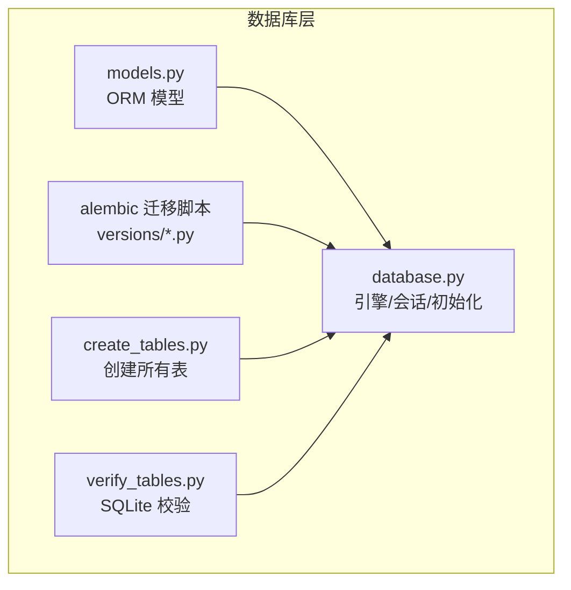

**图表来源**
- [database.py:1-138](file://backend/database.py#L1-L138)
- [models.py:111-372](file://backend/models.py#L111-L372)
- [001_initial.py:1-49](file://backend/alembic/versions/001_initial.py#L1-L49)
- [create_tables.py:1-22](file://backend/create_tables.py#L1-L22)
- [verify_tables.py:1-33](file://backend/verify_tables.py#L1-L33)

**章节来源**
- [database.py:1-138](file://backend/database.py#L1-L138)
- [models.py:111-372](file://backend/models.py#L111-L372)
- [001_initial.py:1-49](file://backend/alembic/versions/001_initial.py#L1-L49)
- [create_tables.py:1-22](file://backend/create_tables.py#L1-L22)
- [verify_tables.py:1-33](file://backend/verify_tables.py#L1-L33)

## 核心组件
本节概述数据库层的核心组件与职责：
- 数据库引擎与会话：负责连接池、超时、字符集与方言适配（MySQL/PostgreSQL/SQLite）。
- ORM 模型：定义表结构、主键/外键、唯一约束、默认值、索引与关系映射。
- 迁移脚本：记录表结构演进，确保不同环境的一致性。
- 表创建与校验：提供一键创建与 SQLite 校验工具。

**章节来源**
- [database.py:1-138](file://backend/database.py#L1-L138)
- [models.py:111-372](file://backend/models.py#L111-L372)

## 架构总览
数据库层围绕 ORM 模型与 Alembic 迁移脚本协同工作，支持多数据库后端（MySQL、PostgreSQL、SQLite）。ORM 模型通过 SQLAlchemy Declarative Base 映射到实际表，迁移脚本确保表结构随版本演进。

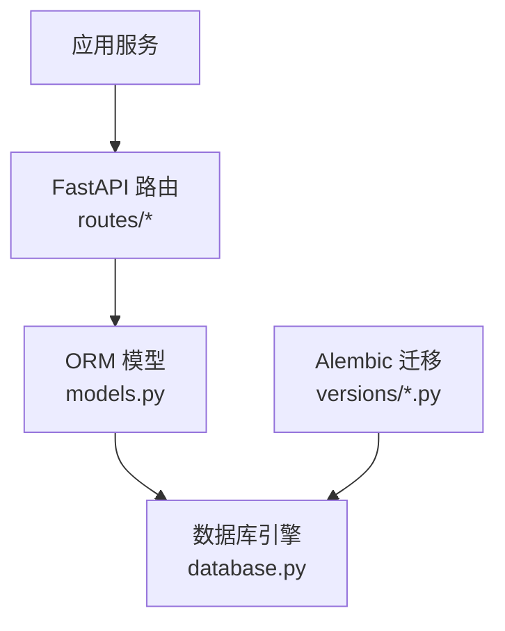

**图表来源**
- [models.py:111-372](file://backend/models.py#L111-L372)
- [database.py:90-138](file://backend/database.py#L90-L138)
- [001_initial.py:19-48](file://backend/alembic/versions/001_initial.py#L19-L48)

## 详细组件分析

### 用户表 users
- 作用：存储系统用户基本信息与鉴权凭据。
- 主键：id（自增整数）。
- 唯一约束：username、email。
- 时间戳：created_at、updated_at（服务器默认值与自动更新）。
- 其他字段：password_hash、last_login_ip、api_quota、role、pdf_download_count。
- 索引：email（唯一）、username、role、updated_at、last_login_ip。

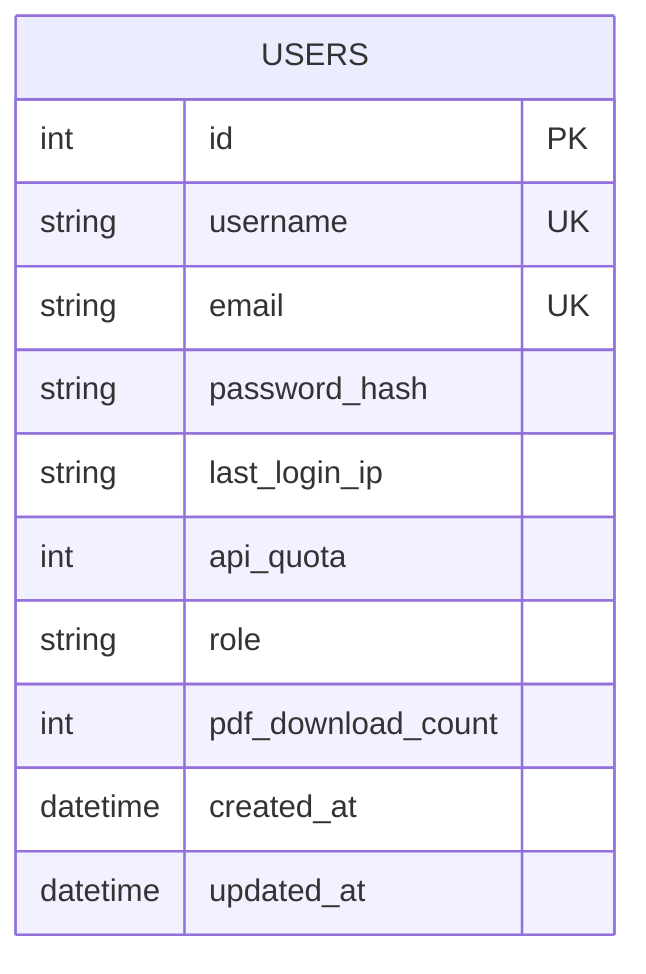

**图表来源**
- [models.py:111-136](file://backend/models.py#L111-L136)
- [001_initial.py:20-28](file://backend/alembic/versions/001_initial.py#L20-L28)

**章节来源**
- [models.py:111-136](file://backend/models.py#L111-L136)
- [001_initial.py:20-28](file://backend/alembic/versions/001_initial.py#L20-L28)

### 简历表 resumes
- 作用：存储用户的简历数据，完整 JSON 结构保存在 data 字段。
- 主键：id（字符串）。
- 外键：user_id → users.id（级联删除）。
- 时间戳：created_at、updated_at（服务器默认值与自动更新）。
- 索引：user_id、updated_at。

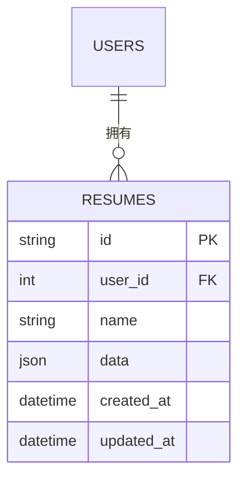

**图表来源**
- [models.py:163-181](file://backend/models.py#L163-L181)
- [001_initial.py:30-40](file://backend/alembic/versions/001_initial.py#L30-L40)

**章节来源**
- [models.py:163-181](file://backend/models.py#L163-L181)
- [001_initial.py:30-40](file://backend/alembic/versions/001_initial.py#L30-L40)

### 成员表 members
- 作用：平台内部成员信息，可关联用户表。
- 主键：id（自增整数）。
- 外键：user_id → users.id（SET NULL）。
- 默认值：status 默认为 active。
- 时间戳：created_at、updated_at（服务器默认值与自动更新）。
- 索引：email、user_id、status。

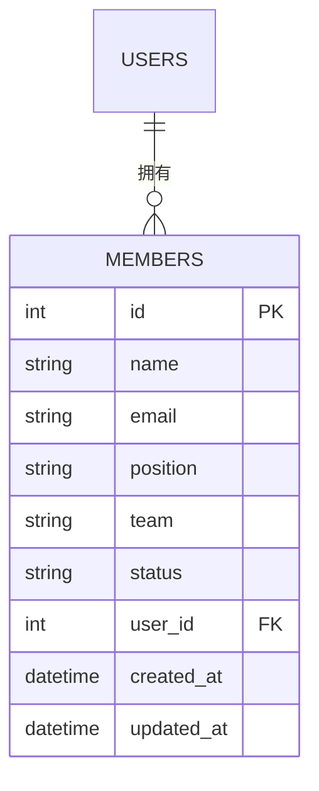

**图表来源**
- [models.py:184-198](file://backend/models.py#L184-L198)
- [008_add_admin_console_tables.py:19-32](file://backend/alembic/versions/008_add_admin_console_tables.py#L19-L32)

**章节来源**
- [models.py:184-198](file://backend/models.py#L184-L198)
- [008_add_admin_console_tables.py:19-32](file://backend/alembic/versions/008_add_admin_console_tables.py#L19-L32)

### 接口请求日志表 api_request_logs
- 作用：记录 API 请求的元数据与性能指标。
- 主键：id（自增整数）。
- 外键：user_id → users.id（SET NULL）。
- 默认值：latency_ms 默认 0。
- 时间戳：created_at（服务器默认值与索引）。
- 索引：trace_id、request_id、path、user_id、ip、created_at。

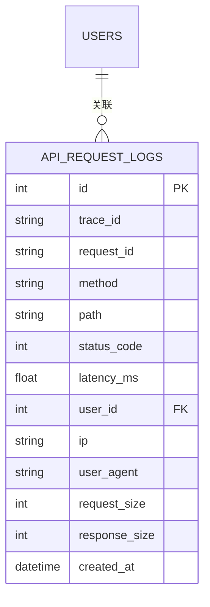

**图表来源**
- [models.py:200-218](file://backend/models.py#L200-L218)
- [008_add_admin_console_tables.py:34-56](file://backend/alembic/versions/008_add_admin_console_tables.py#L34-L56)

**章节来源**
- [models.py:200-218](file://backend/models.py#L200-L218)
- [008_add_admin_console_tables.py:34-56](file://backend/alembic/versions/008_add_admin_console_tables.py#L34-L56)

### 接口错误日志表 api_error_logs
- 作用：记录请求日志对应的错误详情。
- 主键：id（自增整数）。
- 外键：request_log_id → api_request_logs.id（SET NULL）。
- 时间戳：created_at（服务器默认值与索引）。
- 索引：request_log_id、trace_id、created_at。

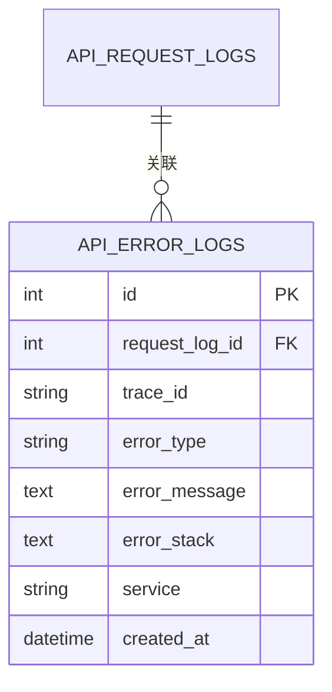

**图表来源**
- [models.py:220-233](file://backend/models.py#L220-L233)
- [008_add_admin_console_tables.py:57-70](file://backend/alembic/versions/008_add_admin_console_tables.py#L57-L70)

**章节来源**
- [models.py:220-233](file://backend/models.py#L220-L233)
- [008_add_admin_console_tables.py:57-70](file://backend/alembic/versions/008_add_admin_console_tables.py#L57-L70)

### 链路 Span 表 api_trace_spans
- 作用：分布式追踪的 Span 记录。
- 主键：id（自增整数）。
- 默认值：duration_ms 默认 0，status 默认 ok。
- 时间戳：start_time、end_time、created_at（服务器默认值与索引）。
- 索引：trace_id、span_id、parent_span_id、start_time、created_at。

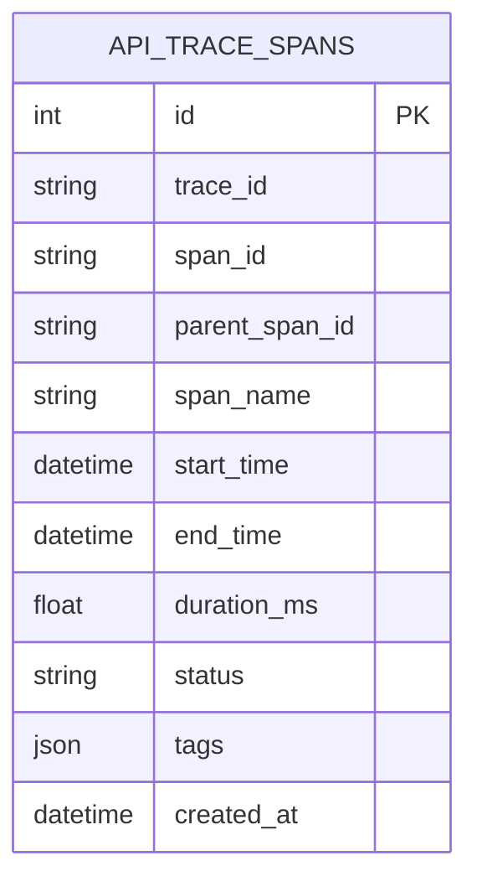

**图表来源**
- [models.py:235-251](file://backend/models.py#L235-L251)
- [008_add_admin_console_tables.py:72-90](file://backend/alembic/versions/008_add_admin_console_tables.py#L72-L90)

**章节来源**
- [models.py:235-251](file://backend/models.py#L235-L251)
- [008_add_admin_console_tables.py:72-90](file://backend/alembic/versions/008_add_admin_console_tables.py#L72-L90)

### 权限审计日志表 permission_audit_logs
- 作用：记录用户角色变更等审计事件。
- 主键：id（自增整数）。
- 外键：operator_user_id、target_user_id → users.id（SET NULL）。
- 时间戳：created_at（服务器默认值与索引）。
- 索引：operator_user_id、target_user_id、created_at。

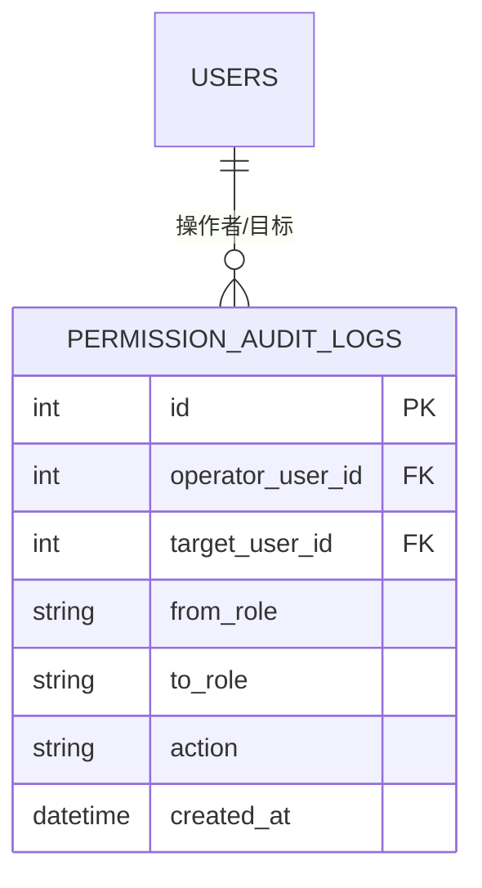

**图表来源**
- [models.py:253-265](file://backend/models.py#L253-L265)
- [008_add_admin_console_tables.py:92-104](file://backend/alembic/versions/008_add_admin_console_tables.py#L92-L104)

**章节来源**
- [models.py:253-265](file://backend/models.py#L253-L265)
- [008_add_admin_console_tables.py:92-104](file://backend/alembic/versions/008_add_admin_console_tables.py#L92-L104)

### 报告与文档表（演进）
- documents 表：存储文档内容与类型，为主键字符串 id。
- reports 表：存储报告元数据，包含 main_id 外键指向 documents。
- report_conversations 表：建立报告与会话的关联。
- 外键：reports.user_id → users.id（CASCADE），reports.main_id → documents.id（CASCADE），report_conversations.report_id → reports.id（CASCADE）。
- 索引：按业务需求建立。

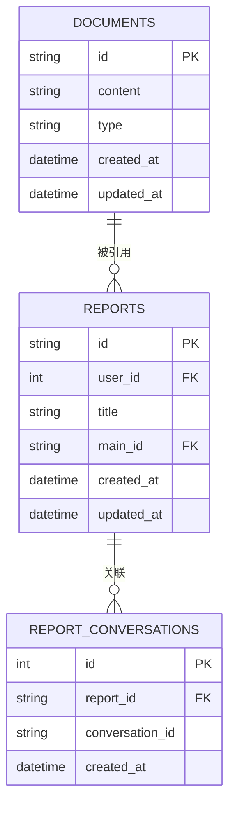

**图表来源**
- [002_add_reports_tables.py:20-61](file://backend/alembic/versions/002_add_reports_tables.py#L20-L61)

**章节来源**
- [002_add_reports_tables.py:19-67](file://backend/alembic/versions/002_add_reports_tables.py#L19-L67)

### Agent 对话表 agent_conversations 与 agent_messages
- agent_conversations
  - 主键：id（自增整数）。
  - 唯一：session_id。
  - 外键：user_id → users.id（SET NULL）。
  - 默认：title 默认 New Conversation，message_count 默认 0。
  - 时间戳：created_at、updated_at（服务器默认值与自动更新），last_message_at 可空。
  - 索引：id、session_id（唯一）、user_id、updated_at、user_id+updated_at。
- agent_messages
  - 主键：id（自增整数）。
  - 外键：conversation_id → agent_conversations.id（CASCADE）。
  - 唯一：(conversation_id, seq)。
  - 默认：role 限制长度与取值，created_at 服务器默认值。
  - 索引：id、conversation_id、tool_call_id。

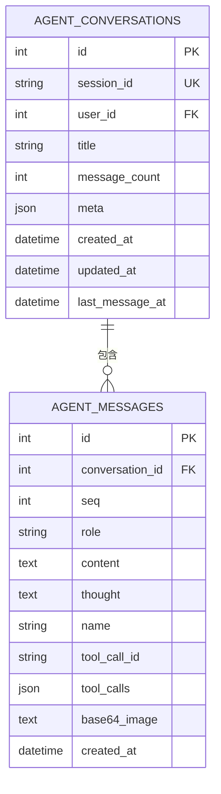

**图表来源**
- [models.py:267-308](file://backend/models.py#L267-L308)
- [010_add_agent_conversation_tables.py:19-61](file://backend/alembic/versions/010_add_agent_conversation_tables.py#L19-L61)

**章节来源**
- [models.py:267-308](file://backend/models.py#L267-L308)
- [010_add_agent_conversation_tables.py:19-75](file://backend/alembic/versions/010_add_agent_conversation_tables.py#L19-L75)

### 简历向量嵌入表 resume_embeddings
- 作用：存储简历内容的向量表示，用于语义检索。
- 主键：id（自增整数）。
- 外键：resume_id → resumes.id（CASCADE），user_id → users.id（CASCADE）。
- 字段：embedding（JSON，PG 中对应 vector(1536)）、content_type、content、metadata（JSON）。
- 时间戳：created_at、updated_at（服务器默认值与自动更新）。
- 索引：resume_id、user_id、content_type、created_at、updated_at。

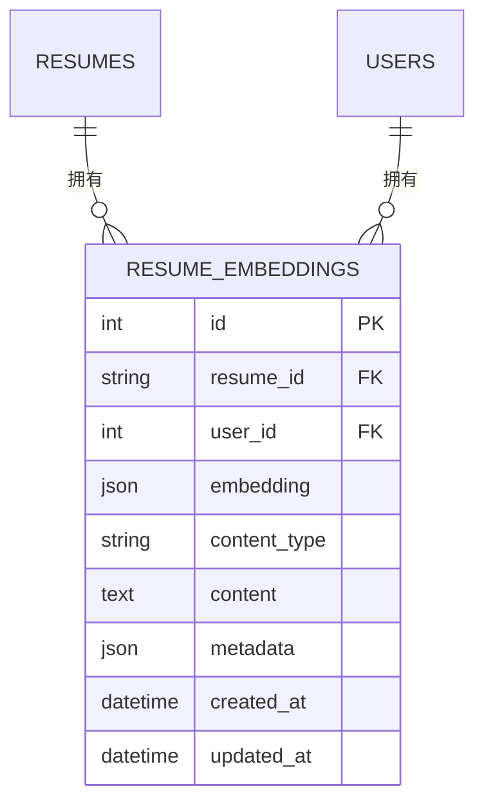

**图表来源**
- [models.py:310-330](file://backend/models.py#L310-L330)

**章节来源**
- [models.py:310-330](file://backend/models.py#L310-L330)

### 简历评分结果表 score_results
- 作用：存储简历评分维度与理由。
- 主键：id（自增整数）。
- 外键：resume_id → resumes.id（CASCADE），user_id → users.id（CASCADE）。
- 字段：jd_text（文本）、overall_score、skill_experience_score、education_score、project_overall_score、dimension_reasons（JSON）。
- 时间戳：created_at（服务器默认值）。
- 索引：resume_id、user_id、created_at。

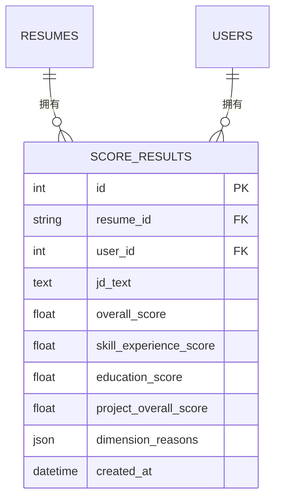

**图表来源**
- [models.py:357-372](file://backend/models.py#L357-L372)

**章节来源**
- [models.py:357-372](file://backend/models.py#L357-L372)

### BetterAuth 商业权益表 better_auth_entitlements
- 作用：存储基于 BetterAuth 的用户权益与订阅状态。
- 主键：id（自增整数）。
- 唯一：better_auth_user_id。
- 默认值：plan 默认 free，credits/daily_usage_count 默认 0。
- 时间戳：created_at、updated_at（服务器默认值与自动更新）。
- 索引：better_auth_user_id、email、plan、subscription_status、provider_customer_id、provider_subscription_id、updated_at。

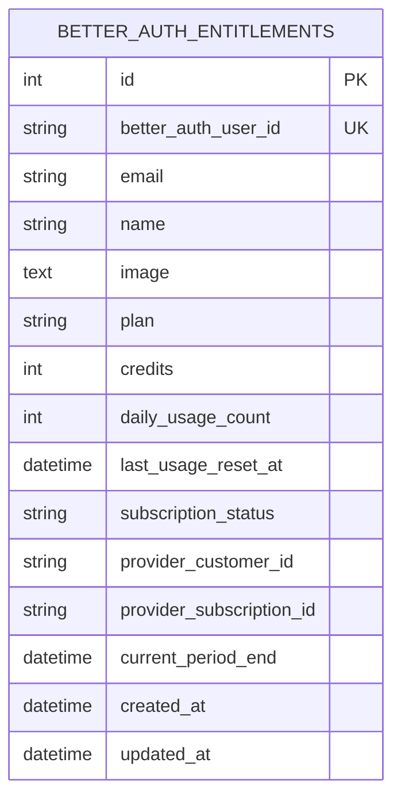

**图表来源**
- [models.py:138-161](file://backend/models.py#L138-L161)
- [015_add_better_auth_entitlements.py:18-81](file://backend/alembic/versions/015_add_better_auth_entitlements.py#L18-L81)

**章节来源**
- [models.py:138-161](file://backend/models.py#L138-L161)
- [015_add_better_auth_entitlements.py:18-92](file://backend/alembic/versions/015_add_better_auth_entitlements.py#L18-L92)

## 依赖分析
- 外键依赖：resumes.user_id → users.id（CASCADE）；api_request_logs.user_id → users.id（SET NULL）；members.user_id → users.id（SET NULL）；agent_conversations.user_id → users.id（SET NULL）；agent_messages.conversation_id → agent_conversations.id（CASCADE）；resume_embeddings.resume_id → resumes.id（CASCADE）、user_id → users.id（CASCADE）；score_results.resume_id → resumes.id（CASCADE）、user_id → users.id（CASCADE）；api_error_logs.request_log_id → api_request_logs.id（SET NULL）。
- 索引策略：围绕查询热点字段建立复合与单列索引，如 users.email、resumes.user_id、agent_conversations.user_id+updated_at、api_request_logs.created_at 等。
- JSON 字段：data、meta、tool_calls、dimension_reasons、embedding、metadata 等，用于灵活存储半结构化数据，配合查询函数与全文检索可扩展。

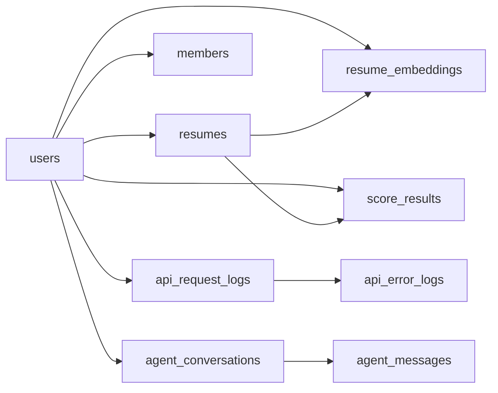

**图表来源**
- [models.py:111-372](file://backend/models.py#L111-L372)
- [008_add_admin_console_tables.py:34-104](file://backend/alembic/versions/008_add_admin_console_tables.py#L34-L104)
- [010_add_agent_conversation_tables.py:19-61](file://backend/alembic/versions/010_add_agent_conversation_tables.py#L19-L61)

**章节来源**
- [models.py:111-372](file://backend/models.py#L111-L372)

## 性能考虑
- 连接池与方言适配：根据数据库类型设置连接池大小、回收时间、超时参数，提升高并发稳定性。
- 索引策略：围绕高频过滤与排序字段建立索引，避免全表扫描；注意写多读少场景的索引维护成本。
- JSON 查询：合理使用 JSON 函数与 GIN/B-tree 索引（PostgreSQL），避免在 WHERE 子句中对 JSON 进行复杂计算。
- 时间戳更新：利用服务器默认值与 ON UPDATE CURRENT_TIMESTAMP（或 func.now() + onupdate）减少应用层逻辑开销。
- 向量检索：向量字段采用专用向量索引（PostgreSQL vector 扩展），控制维度与批量插入频率。

[本节为通用指导，不直接分析具体文件]

## 故障排查指南
- 表创建失败：检查 DATABASE_URL 与数据库权限，确认 init_db() 调用路径正确。
- SQLite 校验：使用 verify_tables.py 查看表数量与列定义，定位缺失或字段类型差异。
- 迁移冲突：确保 Alembic 版本号顺序正确，升级/降级时备份数据。
- JSON 数据异常：检查 JSON 字段的写入路径与规范化流程，避免非法键名与嵌套过深。

**章节来源**
- [create_tables.py:1-22](file://backend/create_tables.py#L1-L22)
- [verify_tables.py:1-33](file://backend/verify_tables.py#L1-L33)

## 结论
本数据库设计以 ORM 与 Alembic 协同，兼顾灵活性与一致性。通过合理的主外键、唯一约束与索引策略，支撑用户、简历、对话、日志与向量检索等核心功能。JSON 字段满足半结构化数据需求，时间戳字段实现自动化生命周期管理。建议在生产环境中结合监控与备份策略，持续优化索引与查询路径。

[本节为总结性内容，不直接分析具体文件]

## 附录

### 字段级说明与约束清单
- 主键：各表主键均为自增整数或显式主键字符串。
- 外键：遵循 CASCADE/SET NULL 约束，保证数据一致性与清理策略。
- 唯一约束：用户名、邮箱、会话 ID、BetterAuth 用户 ID 等。
- 默认值：角色、计划、计数、状态、延迟、时长等字段均有默认值。
- 索引：围绕查询热点建立单列与复合索引。

**章节来源**
- [models.py:111-372](file://backend/models.py#L111-L372)
- [008_add_admin_console_tables.py:34-104](file://backend/alembic/versions/008_add_admin_console_tables.py#L34-L104)
- [010_add_agent_conversation_tables.py:19-61](file://backend/alembic/versions/010_add_agent_conversation_tables.py#L19-L61)
- [015_add_better_auth_entitlements.py:18-81](file://backend/alembic/versions/015_add_better_auth_entitlements.py#L18-L81)

### 时间戳字段设计与自动更新机制
- 服务器默认值：使用 server_default=func.now() 设置创建时间。
- 自动更新：使用 onupdate=func.now() 或 updated_at=Column(..., onupdate=func.now()) 实现更新时间自动刷新。
- 索引：对 created_at、updated_at 建立索引以支持排序与范围查询。

**章节来源**
- [models.py:111-372](file://backend/models.py#L111-L372)

### JSON 字段使用场景与数据格式
- data：完整简历 JSON，包含联系信息、摘要、经历、项目、技能、教育、奖项等。
- meta：会话元信息，如模板、布局等。
- tool_calls：工具调用序列，记录 LLM 推理过程。
- dimension_reasons：评分维度与匹配原因集合。
- embedding：向量嵌入，PG 中对应 vector(1536)。
- metadata：额外元数据，如职位、公司等。

**章节来源**
- [models.py:53-63](file://backend/models.py#L53-L63)
- [models.py:162-172](file://backend/models.py#L162-L172)
- [models.py:277-277](file://backend/models.py#L277-L277)
- [models.py:305-305](file://backend/models.py#L305-L305)
- [models.py:370-370](file://backend/models.py#L370-L370)
- [models.py:327-327](file://backend/models.py#L327-L327)

### 完整 CREATE TABLE 示例（节选）
以下为关键表的 CREATE TABLE 示例，对应初始与后续版本演进：

- users
  - 字段：id（自增主键）、username（唯一）、email（唯一）、password_hash、last_login_ip、api_quota、role、pdf_download_count、created_at、updated_at。
  - 索引：ix_users_email（唯一）。
- resumes
  - 字段：id（主键）、user_id（外键，CASCADE）、name、data（JSON）、created_at、updated_at。
  - 索引：ix_resumes_user_id、ix_resumes_updated_at。
- members
  - 字段：id（自增主键）、name、email、position、team、status（默认 active）、user_id（外键，SET NULL）、created_at、updated_at。
  - 索引：ix_members_email、ix_members_user_id。
- api_request_logs
  - 字段：id（自增主键）、trace_id、request_id、method、path、status_code、latency_ms（默认 0）、user_id（外键，SET NULL）、ip、user_agent、request_size、response_size、created_at。
  - 索引：ix_api_request_logs_trace_id、ix_api_request_logs_request_id、ix_api_request_logs_path、ix_api_request_logs_user_id、ix_api_request_logs_ip、ix_api_request_logs_created_at。
- api_error_logs
  - 字段：id（自增主键）、request_log_id（外键，SET NULL）、trace_id、error_type、error_message、error_stack、service、created_at。
  - 索引：ix_api_error_logs_request_log_id、ix_api_error_logs_trace_id、ix_api_error_logs_created_at。
- api_trace_spans
  - 字段：id（自增主键）、trace_id、span_id、parent_span_id、span_name、start_time、end_time、duration_ms（默认 0）、status（默认 ok）、tags（JSON）、created_at。
  - 索引：ix_api_trace_spans_trace_id、ix_api_trace_spans_span_id、ix_api_trace_spans_parent_span_id、ix_api_trace_spans_start_time、ix_api_trace_spans_created_at。
- permission_audit_logs
  - 字段：id（自增主键）、operator_user_id（外键，SET NULL）、target_user_id（外键，SET NULL）、from_role、to_role、action、created_at。
  - 索引：ix_permission_audit_logs_operator_user_id、ix_permission_audit_logs_target_user_id、ix_permission_audit_logs_created_at。
- agent_conversations
  - 字段：id（自增主键）、session_id（唯一）、user_id（外键，SET NULL）、title（默认 New Conversation）、message_count（默认 0）、meta（JSON）、created_at、updated_at、last_message_at。
  - 索引：ix_agent_conversations_id、ix_agent_conversations_session_id（唯一）、ix_agent_conversations_user_id、ix_agent_conversations_updated_at、ix_agent_conversations_user_updated_at。
- agent_messages
  - 字段：id（自增主键）、conversation_id（外键，CASCADE）、seq、role、content、thought、name、tool_call_id、tool_calls（JSON）、base64_image、created_at。
  - 唯一：(conversation_id, seq)。
  - 索引：ix_agent_messages_id、ix_agent_messages_conversation_id、ix_agent_messages_tool_call_id。
- resume_embeddings
  - 字段：id（自增主键）、resume_id（外键，CASCADE）、user_id（外键，CASCADE）、embedding（JSON）、content_type、content、metadata（JSON）、created_at、updated_at。
  - 索引：ix_resume_embeddings_resume_id、ix_resume_embeddings_user_id、ix_resume_embeddings_content_type、ix_resume_embeddings_created_at、ix_resume_embeddings_updated_at。
- score_results
  - 字段：id（自增主键）、resume_id（外键，CASCADE）、user_id（外键，CASCADE）、jd_text、overall_score、skill_experience_score、education_score、project_overall_score、dimension_reasons（JSON）、created_at。
  - 索引：ix_score_results_resume_id、ix_score_results_user_id、ix_score_results_created_at。
- better_auth_entitlements
  - 字段：id（自增主键）、better_auth_user_id（唯一）、email、name、image、plan（默认 free）、credits（默认 0）、daily_usage_count（默认 0）、last_usage_reset_at、subscription_status（默认 free）、provider_customer_id、provider_subscription_id、current_period_end、created_at、updated_at。
  - 索引：ix_better_auth_entitlements_better_auth_user_id、ix_better_auth_entitlements_email、ix_better_auth_entitlements_plan、ix_better_auth_entitlements_subscription_status、ix_better_auth_entitlements_provider_customer_id、ix_better_auth_entitlements_provider_subscription_id、ix_better_auth_entitlements_updated_at。

**章节来源**
- [001_initial.py:19-48](file://backend/alembic/versions/001_initial.py#L19-L48)
- [008_add_admin_console_tables.py:18-104](file://backend/alembic/versions/008_add_admin_console_tables.py#L18-L104)
- [010_add_agent_conversation_tables.py:19-61](file://backend/alembic/versions/010_add_agent_conversation_tables.py#L19-L61)
- [015_add_better_auth_entitlements.py:18-81](file://backend/alembic/versions/015_add_better_auth_entitlements.py#L18-L81)