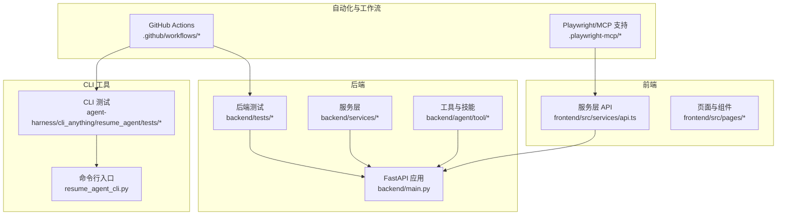
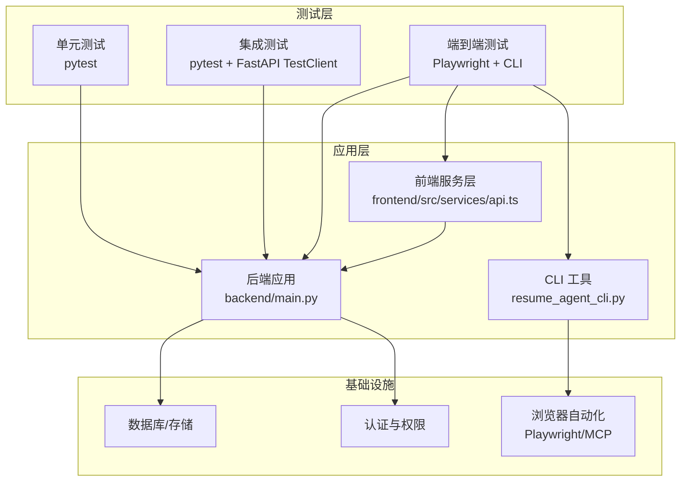
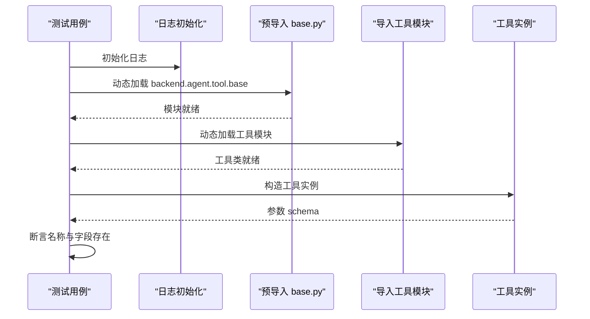
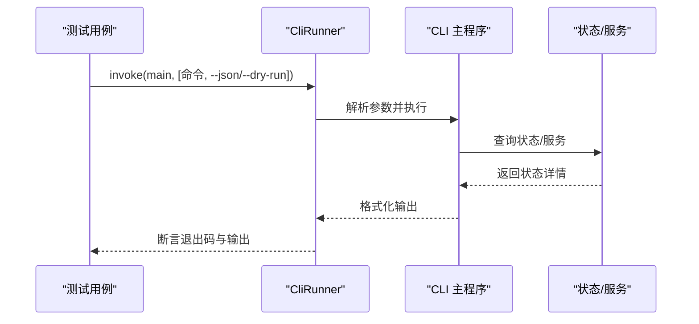
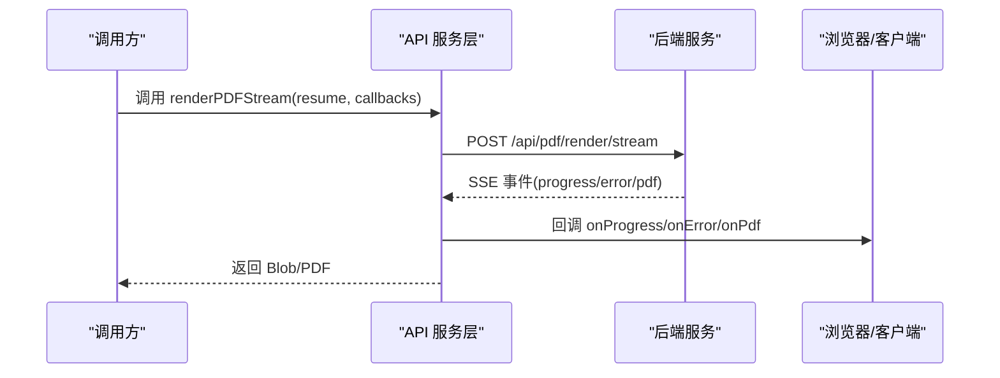
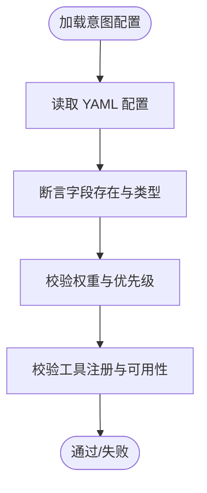
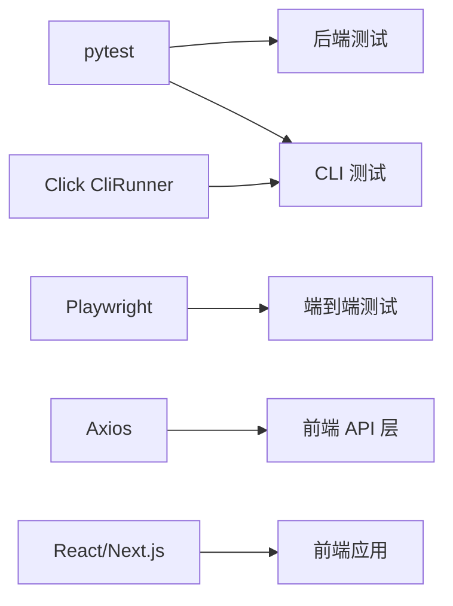

# 测试策略

<cite>
**本文引用的文件**
- [test_generate_resume_tool.py](file://backend/tests/test_generate_resume_tool.py)
- [test_core.py](file://agent-harness/cli_anything/resume_agent/tests/test_core.py)
- [test_process_manager.py](file://agent-harness/cli_anything/resume_agent/tests/test_process_manager.py)
- [api.ts](file://frontend/src/services/api.ts)
- [resume_agent_cli.py](file://agent-harness/cli_anything/resume_agent/resume_agent_cli.py)
- [requirements.txt](file://requirements.txt)
- [package.json](file://frontend/package.json)
- [code-stats.yml](file://.github/workflows/code-stats.yml)
- [star-history-monthly.yml](file://.github/workflows/star-history-monthly.yml)
- [cv_analyzer_agent.yaml](file://backend/agent/domain/intent/configs/cv_analyzer_agent.yaml)
- [cv_editor_agent.yaml](file://backend/agent/domain/intent/configs/cv_editor_agent.yaml)
- [cv_reader_agent.yaml](file://backend/agent/domain/intent/configs/cv_reader_agent.yaml)
- [show_resume.yaml](file://backend/agent/domain/intent/configs/show_resume.yaml)
</cite>

## 目录
1. [引言](#引言)
2. [项目结构](#项目结构)
3. [核心组件](#核心组件)
4. [架构总览](#架构总览)
5. [详细组件分析](#详细组件分析)
6. [依赖分析](#依赖分析)
7. [性能考量](#性能考量)
8. [故障排查指南](#故障排查指南)
9. [结论](#结论)
10. [附录](#附录)

## 引言
本测试策略文档面向 ResumeAgent 项目，系统化阐述单元测试、集成测试与端到端测试的实施方法、测试框架选择、用例设计原则、覆盖率目标、测试数据管理、AI 代理测试、API 测试与前端组件测试的特殊考虑，并给出持续集成流程、自动化测试执行与测试报告生成建议，以及测试最佳实践与调试技巧。文档旨在帮助开发团队建立稳定、可维护且高覆盖度的测试体系。

## 项目结构
项目采用多模块并行的工程布局，包含后端 FastAPI 应用、前端 Next.js/Vite 应用、CLI 工具与测试脚手架、Playwright/MCP 浏览器自动化支持等。测试相关的关键位置如下：
- 后端测试集中于 backend/tests，覆盖路由、工具、服务与业务逻辑。
- CLI 测试位于 agent-harness/cli_anything/resume_agent/tests，验证命令行工具的可用性与状态报告。
- 前端服务层位于 frontend/src/services，封装了 PDF 渲染、流式生成、鉴权与错误处理等 API 调用。
- GitHub Actions 工作流位于 .github/workflows，用于统计与归档类任务，可扩展为 CI 流水线。

图表来源
- [resume_agent_cli.py:218-222](file://agent-harness/cli_anything/resume_agent/resume_agent_cli.py#L218-L222)
- [api.ts:1-120](file://frontend/src/services/api.ts#L1-L120)
- [test_core.py:1-99](file://agent-harness/cli_anything/resume_agent/tests/test_core.py#L1-L99)
- [test_generate_resume_tool.py:1-41](file://backend/tests/test_generate_resume_tool.py#L1-L41)

章节来源
- [requirements.txt:1-90](file://requirements.txt#L1-L90)
- [package.json:1-66](file://frontend/package.json#L1-L66)

## 核心组件
- 后端测试套件：通过 pytest 运行，覆盖工具参数校验、服务接口行为与业务规则。
- CLI 测试套件：基于 Click 的 CliRunner，验证命令行状态查询、启动脚本与浏览器状态。
- 前端 API 层：封装 PDF 渲染、流式生成、鉴权头注入与错误解析，便于单元测试与集成测试。
- 浏览器自动化：Playwright/MCP 支持，配合 CLI 状态检测，支撑端到端场景。

章节来源
- [test_generate_resume_tool.py:35-41](file://backend/tests/test_generate_resume_tool.py#L35-L41)
- [test_core.py:10-99](file://agent-harness/cli_anything/resume_agent/tests/test_core.py#L10-L99)
- [api.ts:1-120](file://frontend/src/services/api.ts#L1-L120)

## 架构总览
下图展示了测试策略在系统中的位置与交互关系：后端测试直接驱动应用；前端测试通过服务层对接后端；CLI 测试保障运行环境与服务状态；自动化工作流负责持续集成与报告。

图表来源
- [api.ts:1-120](file://frontend/src/services/api.ts#L1-L120)
- [resume_agent_cli.py:218-222](file://agent-harness/cli_anything/resume_agent/resume_agent_cli.py#L218-L222)
- [requirements.txt:1-90](file://requirements.txt#L1-L90)

## 详细组件分析

### 后端单元测试：工具与参数校验
- 目标：验证工具的名称、参数模式与字段完整性。
- 方法：动态导入工具模块，绕过循环依赖链，构造工具实例并断言参数属性。
- 关键点：日志初始化、路径修正、模块加载顺序与异常处理。

图表来源
- [test_generate_resume_tool.py:1-41](file://backend/tests/test_generate_resume_tool.py#L1-L41)

章节来源
- [test_generate_resume_tool.py:35-41](file://backend/tests/test_generate_resume_tool.py#L35-L41)

### CLI 单元测试：命令行与状态检查
- 目标：验证 CLI 命令的输出与状态报告，确保服务与浏览器状态可被正确探测。
- 方法：使用 CliRunner 执行命令，断言退出码与输出内容；通过 monkeypatch 模拟进程与端口状态。
- 关键点：JSON 模式输出、干运行模式、状态目录与环境变量模拟。

图表来源
- [test_core.py:10-99](file://agent-harness/cli_anything/resume_agent/tests/test_core.py#L10-L99)

章节来源
- [test_core.py:10-99](file://agent-harness/cli_anything/resume_agent/tests/test_core.py#L10-L99)
- [test_process_manager.py:12-27](file://agent-harness/cli_anything/resume_agent/tests/test_process_manager.py#L12-L27)

### 前端 API 测试：流式渲染与错误处理
- 目标：验证 PDF 渲染、流式生成、鉴权与错误解析逻辑。
- 方法：封装 fetch/axios 请求，断言 SSE 事件类型与数据格式，处理超时与取消信号。
- 关键点：SSE 事件解析、二进制 PDF 数据十六进制转换、进度与错误事件回调。

图表来源
- [api.ts:288-525](file://frontend/src/services/api.ts#L288-L525)

章节来源
- [api.ts:115-125](file://frontend/src/services/api.ts#L115-L125)
- [api.ts:288-525](file://frontend/src/services/api.ts#L288-L525)

### AI 代理测试：意图与技能配置
- 目标：验证不同代理（CV 分析、编辑、阅读、展示）的意图规则与技能配置。
- 方法：读取 YAML 配置文件，断言关键字段与权重设置。
- 关键点：意图分类、增强规则、工具注册与权重分配。

图表来源
- [cv_analyzer_agent.yaml](file://backend/agent/domain/intent/configs/cv_analyzer_agent.yaml)
- [cv_editor_agent.yaml](file://backend/agent/domain/intent/configs/cv_editor_agent.yaml)
- [cv_reader_agent.yaml](file://backend/agent/domain/intent/configs/cv_reader_agent.yaml)
- [show_resume.yaml](file://backend/agent/domain/intent/configs/show_resume.yaml)

章节来源
- [cv_analyzer_agent.yaml](file://backend/agent/domain/intent/configs/cv_analyzer_agent.yaml)
- [cv_editor_agent.yaml](file://backend/agent/domain/intent/configs/cv_editor_agent.yaml)
- [cv_reader_agent.yaml](file://backend/agent/domain/intent/configs/cv_reader_agent.yaml)
- [show_resume.yaml](file://backend/agent/domain/intent/configs/show_resume.yaml)

## 依赖分析
- 后端依赖：FastAPI、Uvicorn、Pydantic、OpenAI、Zhipu、Playwright、LangChain、SQLAlchemy、Alembic 等。
- 前端依赖：React、Next.js、Vite、Axios、PDF.js、TailwindCSS 等。
- 测试框架：pytest、Click CliRunner、Playwright（已安装）。

图表来源
- [requirements.txt:1-90](file://requirements.txt#L1-L90)
- [package.json:1-66](file://frontend/package.json#L1-L66)

章节来源
- [requirements.txt:1-90](file://requirements.txt#L1-L90)
- [package.json:1-66](file://frontend/package.json#L1-L66)

## 性能考量
- 测试执行时间控制：拆分测试集、并行执行、缓存依赖与测试数据。
- 端到端测试优化：减少真实浏览器启动次数，复用会话与页面上下文。
- 流式接口测试：模拟 SSE 事件速率与缓冲区边界，避免长尾延迟影响。
- 数据库与外部服务：使用内存数据库或测试专用实例，隔离外部依赖。

## 故障排查指南
- 日志与追踪：前端 API 层包含丰富的 PDF 渲染追踪日志，便于定位 SSE 事件、进度与错误。
- 错误解析：统一解析后端返回的 detail/message，区分 401/403 场景与通用错误。
- CLI 状态诊断：通过 dry-run 输出与状态 JSON，快速确认服务与浏览器状态。
- 工具参数校验：若工具 schema 变更，需同步更新测试断言。

章节来源
- [api.ts:16-30](file://frontend/src/services/api.ts#L16-L30)
- [api.ts:360-370](file://frontend/src/services/api.ts#L360-L370)
- [test_core.py:26-31](file://agent-harness/cli_anything/resume_agent/tests/test_core.py#L26-L31)
- [test_process_manager.py:12-27](file://agent-harness/cli_anything/resume_agent/tests/test_process_manager.py#L12-L27)

## 结论
本测试策略以 pytest 为核心，结合 CLI 状态检查与前端服务层 API 测试，形成从单元到端到端的完整测试闭环。通过明确的用例设计原则、覆盖率目标与测试数据管理，配合 CI 自动化与报告生成，可显著提升系统稳定性与交付质量。

## 附录

### 测试框架与工具选择
- 后端测试：pytest（已内置），建议配合 FastAPI TestClient 进行集成测试。
- 前端测试：可在现有 API 层基础上引入 Vitest/Jest，针对服务层函数进行单元测试。
- 端到端测试：Playwright 已安装，建议结合 CLI 状态检查与浏览器会话管理。

章节来源
- [requirements.txt:36-38](file://requirements.txt#L36-L38)
- [package.json:54-66](file://frontend/package.json#L54-L66)

### 测试用例设计原则
- 单一职责：每个测试聚焦一个功能点或边界条件。
- 可重复性：使用固定输入与可预测输出，必要时使用桩/替身。
- 可维护性：参数化测试与共享 fixtures，减少重复代码。
- 可观测性：在关键路径添加日志与断言，便于定位问题。

### 覆盖率要求建议
- 语句覆盖率：≥80%
- 分支覆盖率：≥70%
- 行为覆盖率：重点覆盖 API 流程、错误分支与边界输入

### 测试数据管理
- 后端：使用测试数据库或内存数据库，按需初始化种子数据。
- 前端：使用 mock 数据与本地存储快照，避免依赖真实用户数据。
- 浏览器：使用固定页面与最小化上下文，减少随机性。

### 持续集成与自动化
- 建议在现有 GitHub Actions 工作流基础上扩展：
  - 触发条件：push/pr 到主分支
  - 步骤：安装依赖、运行后端测试、运行 CLI 测试、运行前端测试、生成覆盖率报告、上传工件
- 报告生成：pytest-html 或 junitxml 生成报告，结合覆盖率工具输出 HTML 报告

章节来源
- [code-stats.yml](file://.github/workflows/code-stats.yml)
- [star-history-monthly.yml](file://.github/workflows/star-history-monthly.yml)

### 调试技巧
- 后端：启用详细日志，使用 Dry Run 检查命令行参数与服务启动。
- 前端：利用浏览器开发者工具查看网络请求与 SSE 事件，核对事件类型与数据格式。
- CLI：通过 JSON 输出与状态目录文件定位进程与端口占用问题。