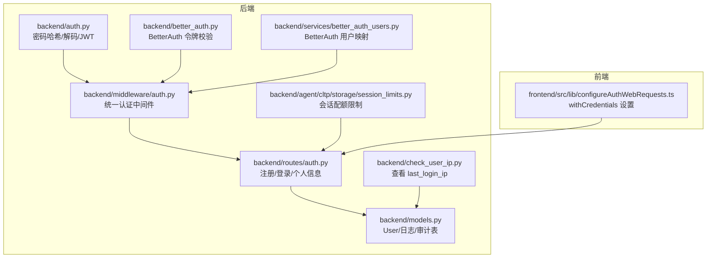
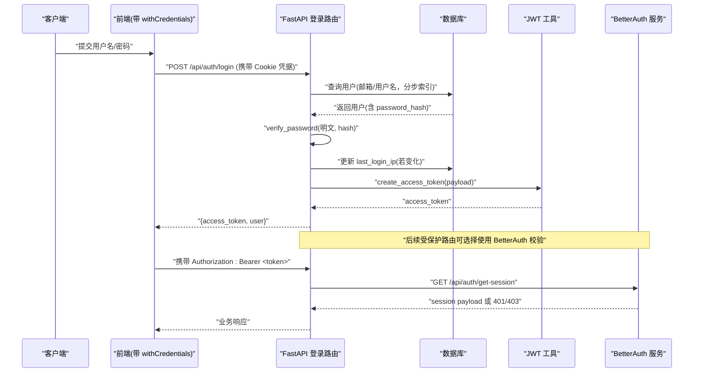
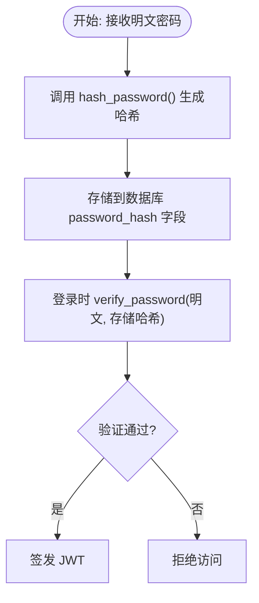
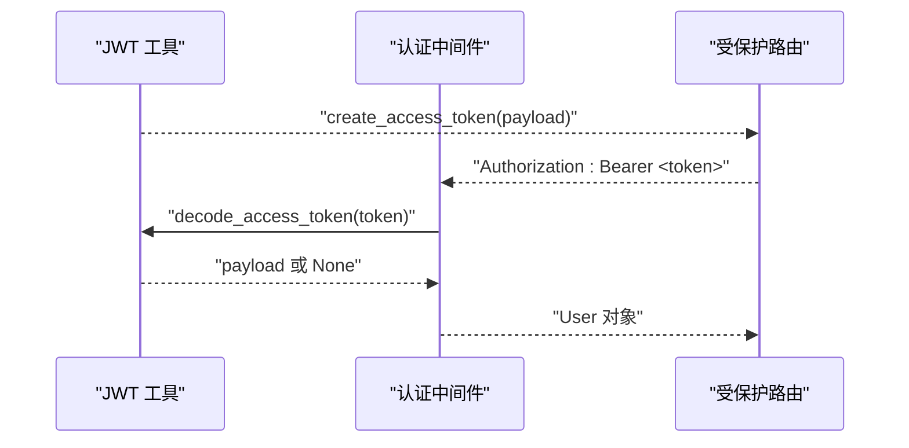
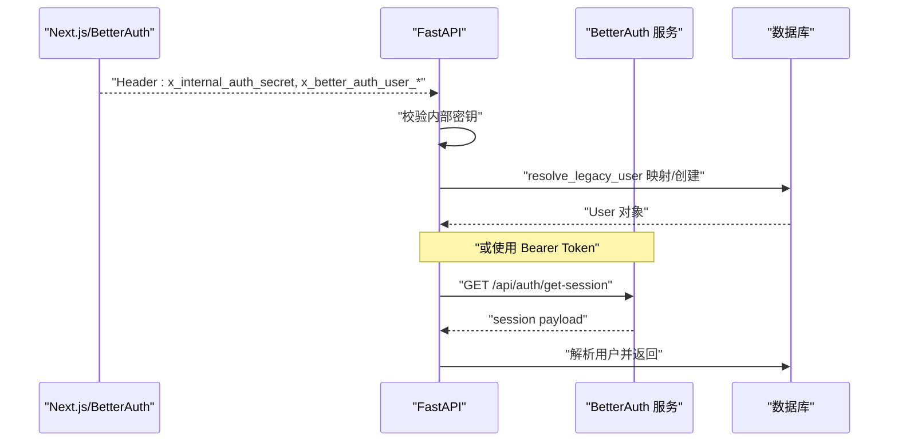
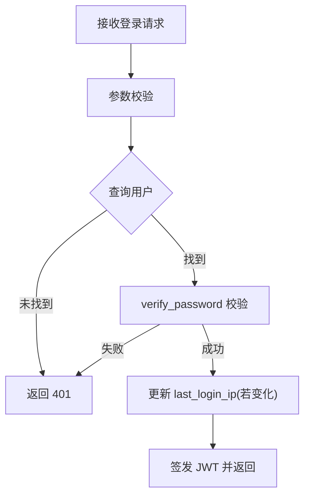
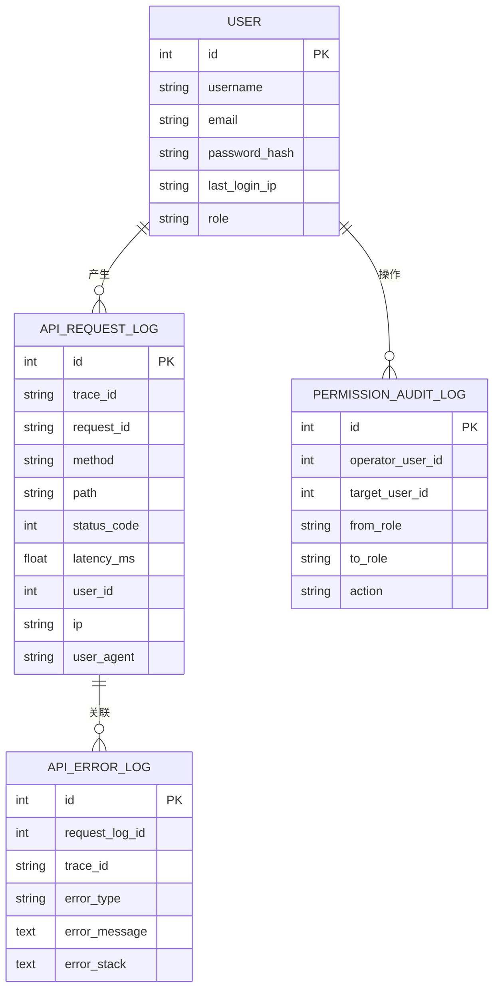
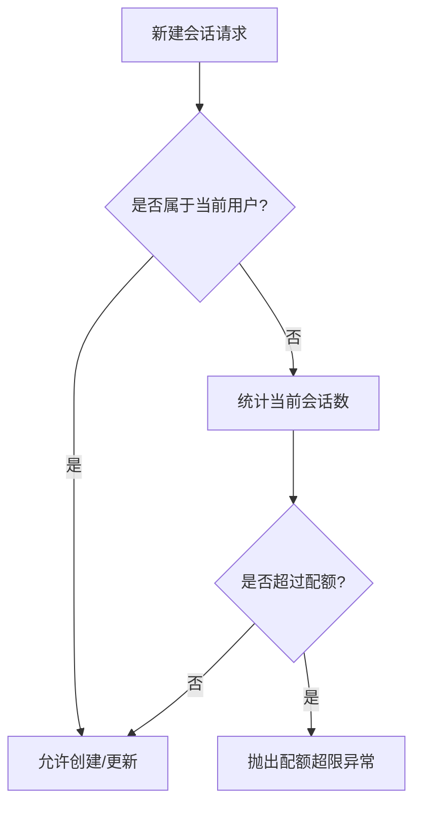
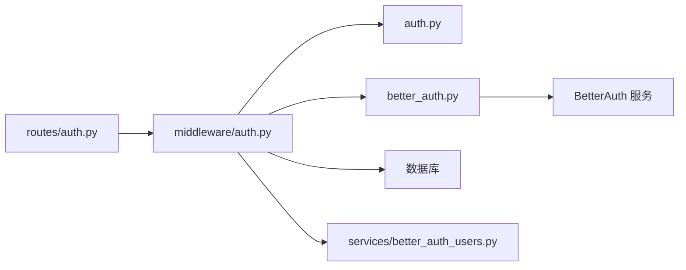

# 安全措施

<cite>
**本文引用的文件**
- [backend/auth.py](file://backend/auth.py)
- [backend/better_auth.py](file://backend/better_auth.py)
- [backend/middleware/auth.py](file://backend/middleware/auth.py)
- [backend/routes/auth.py](file://backend/routes/auth.py)
- [backend/services/better_auth_users.py](file://backend/services/better_auth_users.py)
- [backend/models.py](file://backend/models.py)
- [backend/check_user_ip.py](file://backend/check_user_ip.py)
- [backend/agent/cltp/storage/session_limits.py](file://backend/agent/cltp/storage/session_limits.py)
- [frontend/src/lib/configureAuthWebRequests.ts](file://frontend/src/lib/configureAuthWebRequests.ts)
- [auth-stack.env.example](file://auth-stack.env.example)
</cite>

## 目录
1. [简介](#简介)
2. [项目结构](#项目结构)
3. [核心组件](#核心组件)
4. [架构总览](#架构总览)
5. [详细组件分析](#详细组件分析)
6. [依赖分析](#依赖分析)
7. [性能考虑](#性能考虑)
8. [故障排查指南](#故障排查指南)
9. [结论](#结论)
10. [附录](#附录)

## 简介
本文件聚焦于 ResumeAgent 的安全措施，系统化梳理密码加密策略、JWT 令牌安全、会话与身份认证安全、防暴力破解与登录失败处理、IP 地址追踪与审计、以及 SQL 注入、XSS、CSRF 等常见攻击面的防护现状与改进建议。文档同时提供安全配置建议、常见威胁的防护方案与安全审计要点，帮助团队在开发与运维中持续提升安全性。

## 项目结构
围绕安全的关键代码分布在后端认证与中间件、前端跨域与凭据设置、以及数据库模型与审计日志等模块中。下图给出与安全相关的核心文件与职责概览：

**图表来源**
- [backend/auth.py:1-66](file://backend/auth.py#L1-L66)
- [backend/better_auth.py:1-113](file://backend/better_auth.py#L1-L113)
- [backend/middleware/auth.py:1-191](file://backend/middleware/auth.py#L1-L191)
- [backend/routes/auth.py:1-233](file://backend/routes/auth.py#L1-L233)
- [backend/services/better_auth_users.py:1-55](file://backend/services/better_auth_users.py#L1-L55)
- [backend/models.py:111-128](file://backend/models.py#L111-L128)
- [backend/check_user_ip.py:1-30](file://backend/check_user_ip.py#L1-L30)
- [backend/agent/cltp/storage/session_limits.py:1-68](file://backend/agent/cltp/storage/session_limits.py#L1-L68)
- [frontend/src/lib/configureAuthWebRequests.ts:1-41](file://frontend/src/lib/configureAuthWebRequests.ts#L1-L41)

**章节来源**
- [backend/auth.py:1-66](file://backend/auth.py#L1-L66)
- [backend/better_auth.py:1-113](file://backend/better_auth.py#L1-L113)
- [backend/middleware/auth.py:1-191](file://backend/middleware/auth.py#L1-L191)
- [backend/routes/auth.py:1-233](file://backend/routes/auth.py#L1-L233)
- [backend/services/better_auth_users.py:1-55](file://backend/services/better_auth_users.py#L1-L55)
- [backend/models.py:111-128](file://backend/models.py#L111-L128)
- [backend/check_user_ip.py:1-30](file://backend/check_user_ip.py#L1-L30)
- [backend/agent/cltp/storage/session_limits.py:1-68](file://backend/agent/cltp/storage/session_limits.py#L1-L68)
- [frontend/src/lib/configureAuthWebRequests.ts:1-41](file://frontend/src/lib/configureAuthWebRequests.ts#L1-L41)

## 核心组件
- 密码加密与 JWT 策略
  - 使用强密码哈希（bcrypt 或 pbkdf2_sha256），不存储明文密码。
  - JWT 使用 HS256 算法，密钥通过环境变量配置，默认值需替换。
  - 登录成功后签发短期 JWT，payload 包含用户标识与角色。
- BetterAuth 集成
  - FastAPI 通过 Bearer Token 向 BetterAuth 服务校验会话有效性。
  - 支持“受信任内网”模式：由上游 Web 提供内部密钥与用户头信息，FastAPI 直接信任并映射为本地 User。
- 统一认证中间件
  - 优先解析受信任头部，其次解析 Authorization Bearer，最后回退到 JWT 解码。
  - 对数据库异常进行有限次重试，避免瞬时故障导致 5xx。
- 登录与会话安全
  - 登录接口记录客户端 IP 至 last_login_ip，并在变更时持久化。
  - 会话配额限制，防止滥用与资源耗尽。
- 审计与可观测性
  - API 请求/错误日志表记录 trace_id、路径、状态码、延迟、IP、UA 等。
  - 权限审计日志记录角色变更等敏感操作。

**章节来源**
- [backend/auth.py:19-47](file://backend/auth.py#L19-L47)
- [backend/better_auth.py:35-113](file://backend/better_auth.py#L35-L113)
- [backend/middleware/auth.py:113-146](file://backend/middleware/auth.py#L113-L146)
- [backend/routes/auth.py:149-226](file://backend/routes/auth.py#L149-L226)
- [backend/models.py:111-128](file://backend/models.py#L111-L128)
- [backend/agent/cltp/storage/session_limits.py:43-68](file://backend/agent/cltp/storage/session_limits.py#L43-L68)
- [backend/models.py:200-233](file://backend/models.py#L200-L233)
- [backend/models.py:253-265](file://backend/models.py#L253-L265)

## 架构总览
下图展示登录与认证的整体流程，包括密码哈希、JWT 签发、BetterAuth 校验、以及 IP 记录与会话配额控制。

**图表来源**
- [backend/routes/auth.py:149-226](file://backend/routes/auth.py#L149-L226)
- [backend/auth.py:32-47](file://backend/auth.py#L32-L47)
- [backend/better_auth.py:65-113](file://backend/better_auth.py#L65-L113)
- [frontend/src/lib/configureAuthWebRequests.ts:10-39](file://frontend/src/lib/configureAuthWebRequests.ts#L10-L39)

## 详细组件分析

### 密码加密策略
- 密码哈希
  - 使用 passlib 的 CryptContext，优先 bcrypt，失败则回退 pbkdf2_sha256，确保兼容性与安全性。
  - 注册时对明文密码进行哈希，不存储明文。
- JWT 令牌
  - HS256 算法，密钥来自环境变量，支持自定义算法与过期时间。
  - 登录成功后签发短期 JWT，payload 包含 sub、username、role。
- 安全建议
  - 强制更换默认密钥；启用 HTTPS；缩短过期时间并支持刷新。
  - 对密码强度进行约束（长度、字符集、历史重复检测）。

**图表来源**
- [backend/auth.py:32-47](file://backend/auth.py#L32-L47)
- [backend/routes/auth.py:68-126](file://backend/routes/auth.py#L68-L126)

**章节来源**
- [backend/auth.py:24-47](file://backend/auth.py#L24-L47)
- [backend/routes/auth.py:68-126](file://backend/routes/auth.py#L68-L126)

### JWT 令牌安全
- 令牌生成与解析
  - create_access_token 支持自定义过期时长；decode_access_token 捕获 JWTError 并返回空负载，避免异常泄露。
- 令牌使用
  - 登录路由返回 access_token；后续受保护路由可依赖中间件统一解析。
- 安全建议
  - 使用 HTTPS 传输；限制 SameSite/Cookie 安全属性；定期轮换密钥；启用刷新令牌。

**图表来源**
- [backend/auth.py:42-66](file://backend/auth.py#L42-L66)
- [backend/middleware/auth.py:113-146](file://backend/middleware/auth.py#L113-L146)

**章节来源**
- [backend/auth.py:42-66](file://backend/auth.py#L42-L66)
- [backend/middleware/auth.py:113-146](file://backend/middleware/auth.py#L113-L146)

### 会话安全机制与 BetterAuth 集成
- 双通道认证
  - 受信任内网模式：上游 Web 传递内部密钥与 BetterAuth 用户头，FastAPI 直接信任并映射为本地 User。
  - 外部 Bearer 模式：FastAPI 向 BetterAuth 服务发起 GET /api/auth/get-session 校验会话。
- 用户映射
  - 将 BetterAuth 用户映射为本地 User，派生用户名与邮箱，生成临时密码哈希，保证本地业务可用。
- 安全建议
  - 内部密钥必须与 Web 侧一致且严格保密；限制 BetterAuth 服务可达范围；校验响应结构与字段完整性。

**图表来源**
- [backend/better_auth.py:35-113](file://backend/better_auth.py#L35-L113)
- [backend/middleware/auth.py:89-146](file://backend/middleware/auth.py#L89-L146)
- [backend/services/better_auth_users.py:33-55](file://backend/services/better_auth_users.py#L33-L55)

**章节来源**
- [backend/better_auth.py:35-113](file://backend/better_auth.py#L35-L113)
- [backend/middleware/auth.py:89-146](file://backend/middleware/auth.py#L89-L146)
- [backend/services/better_auth_users.py:33-55](file://backend/services/better_auth_users.py#L33-L55)

### 登录失败与防暴力破解
- 登录流程
  - 输入校验、按用户名/邮箱分步查询、哈希校验失败即返回 401。
  - 记录客户端 IP 至 last_login_ip，便于审计与风控。
- 防暴力破解现状
  - 当前未见显式的登录失败次数统计、账户锁定或速率限制逻辑。
- 建议
  - 引入登录失败计数与冷却窗口；对频繁失败的 IP/账号实施临时封禁；结合验证码与二次验证。

**图表来源**
- [backend/routes/auth.py:149-226](file://backend/routes/auth.py#L149-L226)

**章节来源**
- [backend/routes/auth.py:149-226](file://backend/routes/auth.py#L149-L226)
- [backend/check_user_ip.py:14-30](file://backend/check_user_ip.py#L14-L30)

### IP 地址追踪与审计
- IP 记录
  - 登录成功后记录 last_login_ip，支持后续审计与风控。
- 审计日志
  - APIRequestLog/ApiErrorLog/APITraceSpan/PermissionAuditLog 提供完整的链路与权限审计能力。
- 建议
  - 在登录失败场景补充 IP 记录；对异常 IP（多地区、高失败率）加入黑名单或二次校验。

**图表来源**
- [backend/models.py:111-128](file://backend/models.py#L111-L128)
- [backend/models.py:200-233](file://backend/models.py#L200-L233)
- [backend/models.py:253-265](file://backend/models.py#L253-L265)

**章节来源**
- [backend/models.py:111-128](file://backend/models.py#L111-L128)
- [backend/models.py:200-233](file://backend/models.py#L200-L233)
- [backend/models.py:253-265](file://backend/models.py#L253-L265)

### 会话配额与资源保护
- 会话配额
  - 默认每个用户最多保留固定数量的历史会话，防止资源滥用。
- 会话归属校验
  - 新建会话前检查用户是否拥有目标会话或是否超过配额。
- 建议
  - 配额阈值按用户角色分级；对管理员放宽限制并增加审计。

**图表来源**
- [backend/agent/cltp/storage/session_limits.py:43-68](file://backend/agent/cltp/storage/session_limits.py#L43-L68)

**章节来源**
- [backend/agent/cltp/storage/session_limits.py:43-68](file://backend/agent/cltp/storage/session_limits.py#L43-L68)

### CSRF 防护
- 现状
  - 未发现显式的 CSRF Token 机制或 SameSite Cookie 设置。
- 建议
  - 对状态变更类请求启用 SameSite=Lax/Strict；引入 CSRF Token 并在后端校验；对跨站请求强制要求 Origin/Referer 校验。

[本节为通用安全建议，不直接分析具体文件]

### XSS 防护
- 现状
  - 未见专门的 XSS 过滤器或模板转义配置。
- 建议
  - 对用户输入进行严格的白名单过滤与转义；模板渲染时默认转义；对富文本输出采用安全的 Sanitization 库。

[本节为通用安全建议，不直接分析具体文件]

### SQL 注入防护
- 现状
  - 使用 ORM 查询（如 User.username == login_identifier），未见原生 SQL 拼接。
- 建议
  - 保持 ORM 使用；对动态列名/表名进行白名单校验；避免字符串拼接；对日志中的 SQL 参数进行脱敏。

**章节来源**
- [backend/routes/auth.py:166-177](file://backend/routes/auth.py#L166-L177)

## 依赖分析
- 组件耦合
  - 认证中间件依赖 JWT 工具与 BetterAuth 校验；路由层依赖数据库与认证中间件；服务层负责 BetterAuth 用户映射。
- 外部依赖
  - passlib（密码哈希）、jose（JWT）、httpx（BetterAuth 会话校验）。
- 潜在风险
  - 若 JWT 密钥泄露或被硬编码，将影响所有令牌安全；BetterAuth 服务不可用时，基于 Bearer 的校验会降级为 503。

**图表来源**
- [backend/routes/auth.py:1-233](file://backend/routes/auth.py#L1-L233)
- [backend/middleware/auth.py:1-191](file://backend/middleware/auth.py#L1-L191)
- [backend/auth.py:1-66](file://backend/auth.py#L1-L66)
- [backend/better_auth.py:1-113](file://backend/better_auth.py#L1-L113)
- [backend/services/better_auth_users.py:1-55](file://backend/services/better_auth_users.py#L1-L55)

**章节来源**
- [backend/routes/auth.py:1-233](file://backend/routes/auth.py#L1-L233)
- [backend/middleware/auth.py:1-191](file://backend/middleware/auth.py#L1-L191)
- [backend/auth.py:1-66](file://backend/auth.py#L1-L66)
- [backend/better_auth.py:1-113](file://backend/better_auth.py#L1-L113)
- [backend/services/better_auth_users.py:1-55](file://backend/services/better_auth_users.py#L1-L55)

## 性能考虑
- 登录查询优化
  - 通过“先邮箱后用户名”或“先用户名后邮箱”的分步查询策略，减少 OR 条件导致的索引不稳定。
- 数据库重试
  - 对 OperationalError 进行有限次重试，降低瞬时故障概率。
- 令牌签发
  - JWT 签发成本较低，建议保持短有效期并配合刷新机制。

**章节来源**
- [backend/routes/auth.py:166-190](file://backend/routes/auth.py#L166-L190)
- [backend/middleware/auth.py:50-86](file://backend/middleware/auth.py#L50-L86)

## 故障排查指南
- 常见错误与定位
  - 401 未提供或无效认证信息：检查 Authorization 头格式与 BetterAuth Bearer 令牌。
  - 401 用户不存在：确认用户 ID 类型与数据库一致性。
  - 503 BetterAuth 服务不可用：检查 BETTER_AUTH_URL/BETTER_AUTH_INTERNAL_URL 与网络连通性。
  - 500 数据库连接异常：关注重试日志与 OperationalError，必要时扩容或优化慢查询。
- IP 审计
  - 使用脚本导出 last_login_ip 进行核对与异常识别。
- 建议的日志与监控
  - 记录登录失败次数、IP、UA、trace_id；对高频失败触发告警。

**章节来源**
- [backend/better_auth.py:73-87](file://backend/better_auth.py#L73-L87)
- [backend/middleware/auth.py:70-86](file://backend/middleware/auth.py#L70-L86)
- [backend/check_user_ip.py:14-30](file://backend/check_user_ip.py#L14-L30)

## 结论
本项目在密码哈希、JWT 签发与 BetterAuth 集成方面具备良好基础，但在防暴力破解、CSRF/XSS 防护、以及登录失败与 IP 黑名单等纵深防御上仍有改进空间。建议尽快补齐登录失败计数与速率限制、SameSite/Cookie 安全策略、XSS 过滤与模板转义、以及完善的审计与告警体系，以形成闭环的安全保障。

## 附录

### 安全配置建议清单
- 密钥与证书
  - 替换默认 JWT_SECRET_KEY；启用 HTTPS；合理设置 Cookie 的 Secure/SameSite/HttpOnly。
- 认证集成
  - 严格管理 FASTAPI_INTERNAL_AUTH_SECRET；限制 BetterAuth 服务可达范围；校验会话响应结构。
- 防护增强
  - 引入登录失败计数与冷却；对异常 IP/账号实施临时封禁；启用 CSRF Token 与 SameSite。
- 审计与可观测性
  - 完善 API 错误日志与链路追踪；对权限变更与高危操作进行审计留痕。

**章节来源**
- [auth-stack.env.example:4-6](file://auth-stack.env.example#L4-L6)
- [frontend/src/lib/configureAuthWebRequests.ts:10-39](file://frontend/src/lib/configureAuthWebRequests.ts#L10-L39)