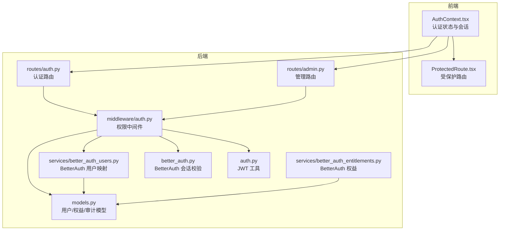
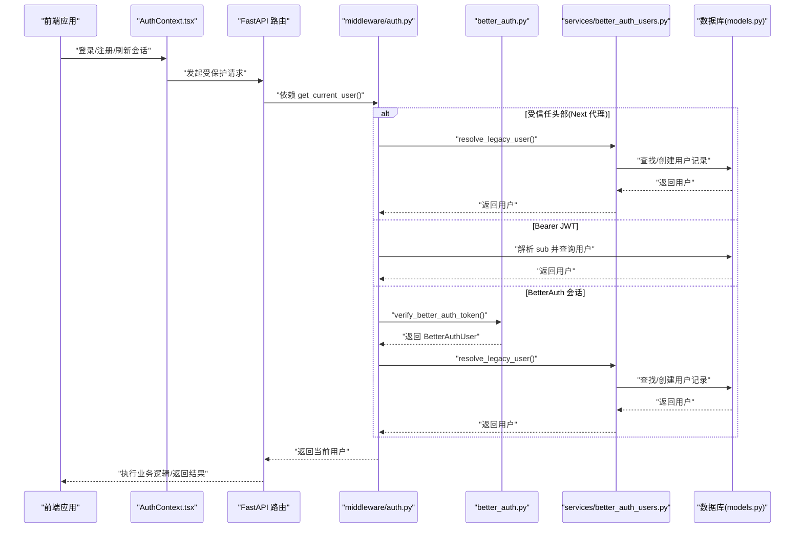
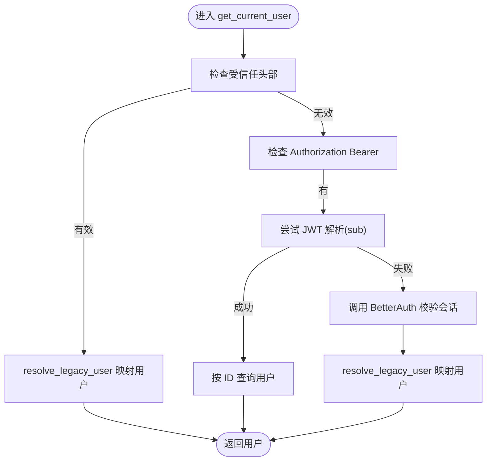
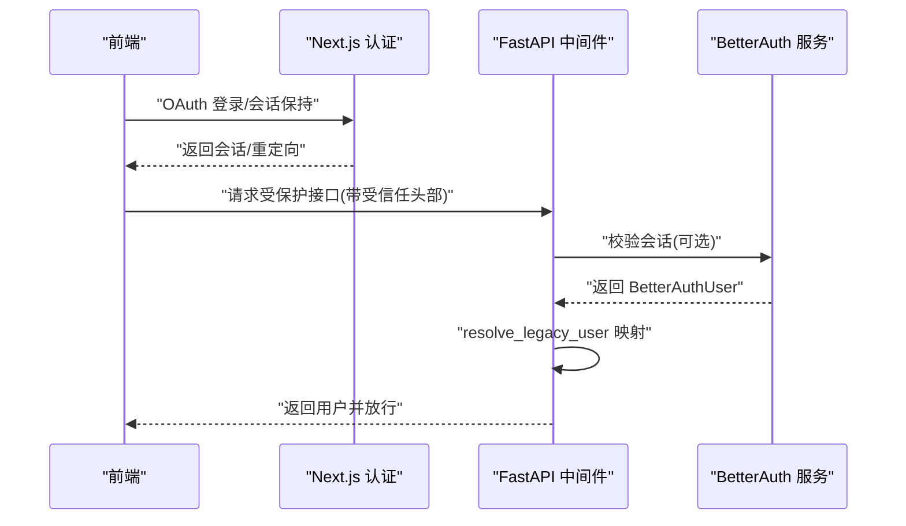
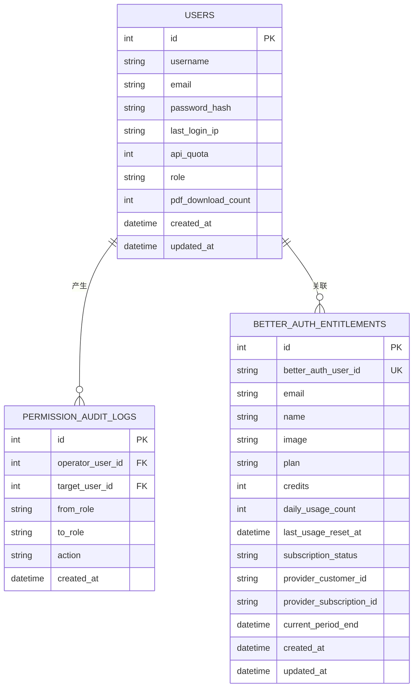
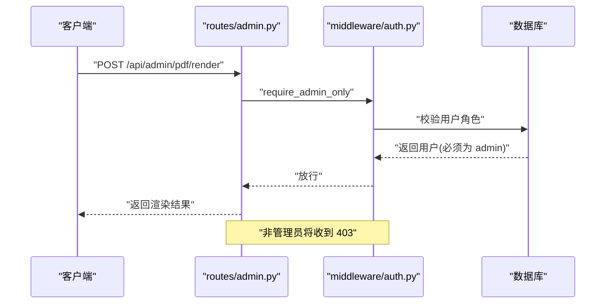
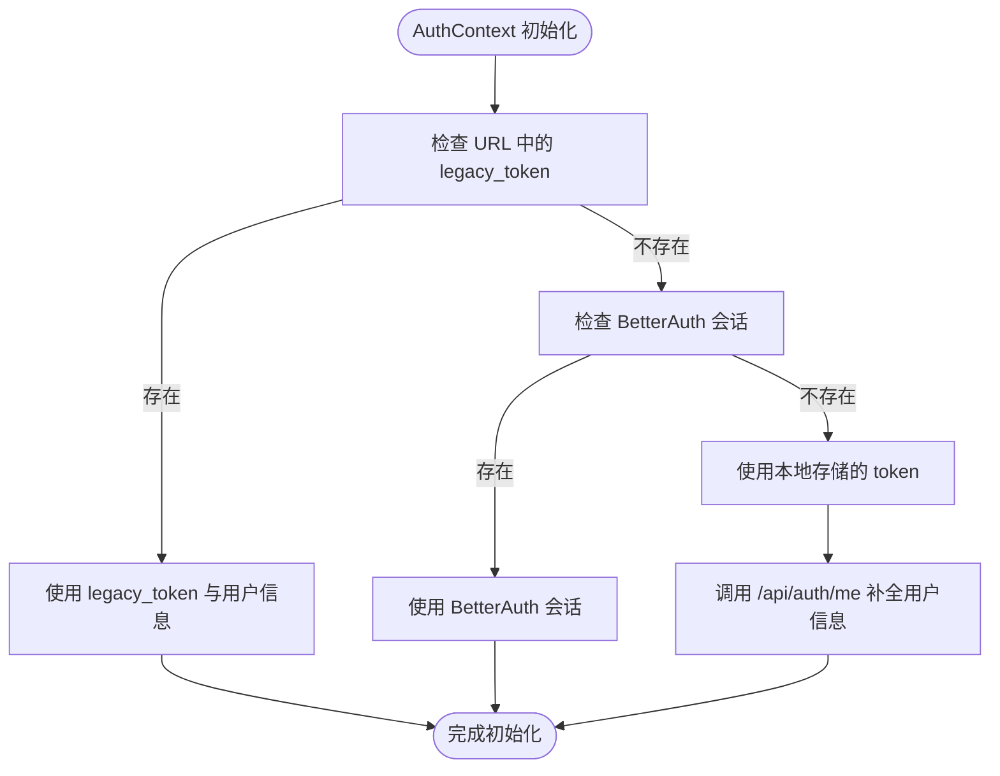
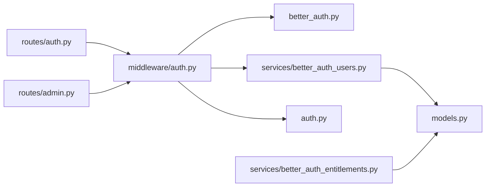

# 权限控制

<cite>
**本文引用的文件**
- [backend/middleware/auth.py](file://backend/middleware/auth.py)
- [backend/better_auth.py](file://backend/better_auth.py)
- [backend/auth.py](file://backend/auth.py)
- [backend/models.py](file://backend/models.py)
- [backend/routes/admin.py](file://backend/routes/admin.py)
- [backend/routes/auth.py](file://backend/routes/auth.py)
- [backend/services/better_auth_users.py](file://backend/services/better_auth_users.py)
- [backend/services/better_auth_entitlements.py](file://backend/services/better_auth_entitlements.py)
- [frontend/src/components/ProtectedRoute.tsx](file://frontend/src/components/ProtectedRoute.tsx)
- [frontend/src/contexts/AuthContext.tsx](file://frontend/src/contexts/AuthContext.tsx)
- [backend/alembic/versions/005_add_user_ip_quota_role.py](file://backend/alembic/versions/005_add_user_ip_quota_role.py)
- [backend/alembic/versions/015_add_better_auth_entitlements.py](file://backend/alembic/versions/015_add_better_auth_entitlements.py)
- [knowledge-base/specs/2026-06-28-auth-unification-decision.md](file://knowledge-base/specs/2026-06-28-auth-unification-decision.md)
</cite>

## 目录
1. [简介](#简介)
2. [项目结构](#项目结构)
3. [核心组件](#核心组件)
4. [架构总览](#架构总览)
5. [详细组件分析](#详细组件分析)
6. [依赖分析](#依赖分析)
7. [性能考虑](#性能考虑)
8. [故障排查指南](#故障排查指南)
9. [结论](#结论)
10. [附录](#附录)

## 简介
本文件系统性梳理 ResumeAgent 的权限控制系统，覆盖基于角色的访问控制（RBAC）实现、用户权限验证机制、API 访问控制策略、权限中间件工作原理、权限检查流程、角色定义与权限分配，并给出管理员与普通用户的实现差异、权限配置示例与最佳实践。文档同时结合前端保护路由与认证上下文，解释端到端的认证与授权闭环。

## 项目结构
权限控制涉及后端中间件、认证服务、业务路由、数据库模型与迁移脚本，以及前端认证上下文与受保护路由。下图展示与权限相关的关键模块及其交互：

图表来源
- [frontend/src/contexts/AuthContext.tsx:1-275](file://frontend/src/contexts/AuthContext.tsx#L1-L275)
- [frontend/src/components/ProtectedRoute.tsx:1-18](file://frontend/src/components/ProtectedRoute.tsx#L1-L18)
- [backend/routes/auth.py:1-233](file://backend/routes/auth.py#L1-L233)
- [backend/routes/admin.py:1-259](file://backend/routes/admin.py#L1-L259)
- [backend/middleware/auth.py:1-191](file://backend/middleware/auth.py#L1-L191)
- [backend/services/better_auth_users.py:1-55](file://backend/services/better_auth_users.py#L1-L55)
- [backend/services/better_auth_entitlements.py:1-36](file://backend/services/better_auth_entitlements.py#L1-L36)
- [backend/better_auth.py:1-113](file://backend/better_auth.py#L1-L113)
- [backend/auth.py:1-66](file://backend/auth.py#L1-L66)
- [backend/models.py:111-136](file://backend/models.py#L111-L136)

章节来源
- [backend/middleware/auth.py:1-191](file://backend/middleware/auth.py#L1-L191)
- [backend/routes/auth.py:1-233](file://backend/routes/auth.py#L1-L233)
- [backend/routes/admin.py:1-259](file://backend/routes/admin.py#L1-L259)
- [backend/services/better_auth_users.py:1-55](file://backend/services/better_auth_users.py#L1-L55)
- [backend/services/better_auth_entitlements.py:1-36](file://backend/services/better_auth_entitlements.py#L1-L36)
- [backend/better_auth.py:1-113](file://backend/better_auth.py#L1-L113)
- [backend/auth.py:1-66](file://backend/auth.py#L1-L66)
- [backend/models.py:111-136](file://backend/models.py#L111-L136)

## 核心组件
- 权限中间件与角色约束
  - 提供统一的用户解析与角色校验能力，支持三种认证来源：受信任头部（trusted headers）、JWT、BetterAuth 会话校验。
  - 提供管理员专用与管理员/成员通用两类角色约束装饰器。
- 认证与会话
  - 传统 JWT：注册/登录生成访问令牌；前端通过 Authorization: Bearer 传递。
  - BetterAuth：由 Next.js 管理会话，FastAPI 通过调用 BetterAuth 服务验证会话有效性，并将 BetterAuth 用户映射为后端用户记录。
- RBAC 数据模型
  - 用户模型包含角色字段，支持 user、admin、member 等角色；提供权限审计日志模型用于追踪角色变更。
- 权益与配额
  - BetterAuth 权益模型用于承载订阅计划、积分、每日用量等商业权益。
- 前端认证上下文
  - 统一处理登录态、令牌持久化、会话回填与受保护路由守卫。

章节来源
- [backend/middleware/auth.py:113-191](file://backend/middleware/auth.py#L113-L191)
- [backend/routes/auth.py:46-233](file://backend/routes/auth.py#L46-L233)
- [backend/better_auth.py:65-113](file://backend/better_auth.py#L65-L113)
- [backend/models.py:111-136](file://backend/models.py#L111-L136)
- [backend/models.py:253-265](file://backend/models.py#L253-L265)
- [backend/services/better_auth_users.py:33-55](file://backend/services/better_auth_users.py#L33-L55)
- [backend/services/better_auth_entitlements.py:10-36](file://backend/services/better_auth_entitlements.py#L10-L36)
- [frontend/src/contexts/AuthContext.tsx:61-275](file://frontend/src/contexts/AuthContext.tsx#L61-L275)
- [frontend/src/components/ProtectedRoute.tsx:5-18](file://frontend/src/components/ProtectedRoute.tsx#L5-L18)

## 架构总览
下图展示认证与授权在端到端的调用链路与决策点：

图表来源
- [backend/middleware/auth.py:113-146](file://backend/middleware/auth.py#L113-L146)
- [backend/better_auth.py:65-87](file://backend/better_auth.py#L65-L87)
- [backend/services/better_auth_users.py:33-55](file://backend/services/better_auth_users.py#L33-L55)
- [backend/models.py:111-136](file://backend/models.py#L111-L136)

## 详细组件分析

### 权限中间件与角色约束
- 用户解析优先级
  - 受信任头部（trusted headers）：当存在内部认证密钥与 BetterAuth 用户信息时，直接解析并映射为后端用户。
  - Bearer JWT：若头部为 Bearer 且可解析出 sub，则按用户 ID 查询数据库。
  - BetterAuth 会话：若 JWT 解析失败，则调用 BetterAuth 服务验证会话，再进行用户映射。
- 可选用户解析
  - 提供可选认证版本，用于匿名可访问端点（如 PDF 预览），未认证时返回 None 而非 401。
- 角色约束装饰器
  - require_admin_only：仅 admin 可访问。
  - require_admin_or_member：admin 与 member 可访问。

图表来源
- [backend/middleware/auth.py:113-146](file://backend/middleware/auth.py#L113-L146)
- [backend/services/better_auth_users.py:33-55](file://backend/services/better_auth_users.py#L33-L55)

章节来源
- [backend/middleware/auth.py:113-191](file://backend/middleware/auth.py#L113-L191)

### 认证与会话（JWT 与 BetterAuth）
- JWT 工具
  - 提供密码哈希、密码验证、JWT 签发与解码。
- 传统认证路由
  - 注册：校验用户名/密码长度，加密密码，创建用户并签发 JWT。
  - 登录：根据用户名/邮箱查询用户，验证密码，更新最近登录 IP，签发 JWT。
  - 我的信息：返回当前用户（角色实时从数据库读取）。
- BetterAuth 集成
  - 提供 BetterAuthUser 结构与会话校验方法，支持从 Next.js 服务端获取当前会话。
  - 前端通过 BetterAuth 管理登录态，后端通过受信任头部或会话校验获取用户。

图表来源
- [backend/better_auth.py:65-113](file://backend/better_auth.py#L65-L113)
- [backend/middleware/auth.py:113-146](file://backend/middleware/auth.py#L113-L146)
- [knowledge-base/specs/2026-06-28-auth-unification-decision.md:371-430](file://knowledge-base/specs/2026-06-28-auth-unification-decision.md#L371-L430)

章节来源
- [backend/auth.py:1-66](file://backend/auth.py#L1-L66)
- [backend/routes/auth.py:46-233](file://backend/routes/auth.py#L46-L233)
- [backend/better_auth.py:15-113](file://backend/better_auth.py#L15-L113)

### RBAC 数据模型与审计
- 用户模型
  - 关键字段：id、username、email、password_hash、last_login_ip、api_quota、role、pdf_download_count。
  - role 字段用于区分普通用户、管理员与成员。
- 权限审计日志
  - 记录操作者、目标用户、角色变更前后与动作时间，便于审计与追溯。
- BetterAuth 权益
  - 记录订阅计划、积分、每日用量与提供商相关信息，支撑商业化权益控制。

图表来源
- [backend/models.py:111-136](file://backend/models.py#L111-L136)
- [backend/models.py:253-265](file://backend/models.py#L253-L265)
- [backend/models.py:138-161](file://backend/models.py#L138-L161)

章节来源
- [backend/models.py:111-136](file://backend/models.py#L111-L136)
- [backend/models.py:138-161](file://backend/models.py#L138-L161)
- [backend/models.py:253-265](file://backend/models.py#L253-L265)

### 管理员权限与 API 访问控制策略
- 管理路由示例
  - /api/admin/stats/users：需要 admin 或 member 角色。
  - /api/admin/pdf/render 与 /api/admin/pdf/render/stream：仅管理员可访问。
- 策略说明
  - 使用 require_admin_only 与 require_admin_or_member 装饰器对路由进行角色约束。
  - 管理端 PDF 渲染支持本地直连与远程代理两种模式，内部具备自检与回退逻辑。

图表来源
- [backend/routes/admin.py:30-56](file://backend/routes/admin.py#L30-L56)
- [backend/routes/admin.py:217-259](file://backend/routes/admin.py#L217-L259)
- [backend/middleware/auth.py:176-191](file://backend/middleware/auth.py#L176-L191)

章节来源
- [backend/routes/admin.py:1-259](file://backend/routes/admin.py#L1-L259)
- [backend/middleware/auth.py:176-191](file://backend/middleware/auth.py#L176-L191)

### 前端认证上下文与受保护路由
- 认证上下文
  - 统一处理登录态、令牌持久化、会话回填与额度拉取。
  - 支持 BetterAuth 与传统 JWT 两种登录路径，兼容受保护路由守卫。
- 受保护路由
  - 未登录时自动跳转至登录页，加载完成后才决定是否放行。

图表来源
- [frontend/src/contexts/AuthContext.tsx:68-176](file://frontend/src/contexts/AuthContext.tsx#L68-L176)
- [frontend/src/components/ProtectedRoute.tsx:5-18](file://frontend/src/components/ProtectedRoute.tsx#L5-L18)

章节来源
- [frontend/src/contexts/AuthContext.tsx:1-275](file://frontend/src/contexts/AuthContext.tsx#L1-L275)
- [frontend/src/components/ProtectedRoute.tsx:1-18](file://frontend/src/components/ProtectedRoute.tsx#L1-L18)

## 依赖分析
- 组件耦合
  - 路由层依赖中间件进行用户解析与角色校验；中间件依赖 BetterAuth 工具与用户映射服务；用户映射服务依赖数据库模型。
- 外部依赖
  - BetterAuth 服务用于会话校验；数据库用于用户与权益数据持久化。
- 循环依赖
  - 文件间采用单向依赖，未发现循环导入风险。

图表来源
- [backend/routes/auth.py:1-233](file://backend/routes/auth.py#L1-L233)
- [backend/routes/admin.py:1-259](file://backend/routes/admin.py#L1-L259)
- [backend/middleware/auth.py:1-191](file://backend/middleware/auth.py#L1-L191)
- [backend/better_auth.py:1-113](file://backend/better_auth.py#L1-L113)
- [backend/services/better_auth_users.py:1-55](file://backend/services/better_auth_users.py#L1-L55)
- [backend/services/better_auth_entitlements.py:1-36](file://backend/services/better_auth_entitlements.py#L1-L36)
- [backend/auth.py:1-66](file://backend/auth.py#L1-L66)
- [backend/models.py:111-136](file://backend/models.py#L111-L136)

章节来源
- [backend/middleware/auth.py:1-191](file://backend/middleware/auth.py#L1-L191)
- [backend/routes/auth.py:1-233](file://backend/routes/auth.py#L1-L233)
- [backend/routes/admin.py:1-259](file://backend/routes/admin.py#L1-L259)
- [backend/services/better_auth_users.py:1-55](file://backend/services/better_auth_users.py#L1-L55)
- [backend/services/better_auth_entitlements.py:1-36](file://backend/services/better_auth_entitlements.py#L1-L36)
- [backend/better_auth.py:1-113](file://backend/better_auth.py#L1-L113)
- [backend/auth.py:1-66](file://backend/auth.py#L1-L66)
- [backend/models.py:111-136](file://backend/models.py#L111-L136)

## 性能考虑
- 数据库重试与降级
  - 用户解析过程对数据库异常进行有限次数重试与回滚，避免瞬时故障导致 500。
- 会话校验超时
  - BetterAuth 会话校验设置连接/读/写/池化超时，防止上游服务抖动影响下游。
- 查询优化
  - 用户解析仅加载必要字段，减少网络与序列化开销。
- 建议
  - 在高并发场景下，建议对用户查询结果增加缓存（如 Redis）并配合失效策略。
  - 对 BetterAuth 会话校验增加本地缓存与健康检查，避免频繁跨服务调用。

章节来源
- [backend/middleware/auth.py:41-86](file://backend/middleware/auth.py#L41-L86)
- [backend/better_auth.py:70-87](file://backend/better_auth.py#L70-L87)
- [backend/middleware/auth.py:28-38](file://backend/middleware/auth.py#L28-L38)

## 故障排查指南
- 401 未认证
  - 检查 Authorization 头是否为 Bearer 令牌；确认令牌格式与签名正确；确认 BetterAuth 会话是否有效。
- 403 权限不足
  - 确认当前用户角色是否满足 require_admin_only 或 require_admin_or_member 的要求。
- 数据库异常
  - 查看重试日志与回滚行为；确认连接池与超时配置；检查索引与查询条件。
- BetterAuth 服务不可用
  - 检查 BETTER_AUTH_URL/BETTER_AUTH_INTERNAL_URL 环境变量；确认网络可达性与超时设置。
- 前端登录态异常
  - 检查本地存储的 token 与用户信息；确认受保护路由守卫逻辑；核对认证上下文初始化流程。

章节来源
- [backend/middleware/auth.py:133-145](file://backend/middleware/auth.py#L133-L145)
- [backend/middleware/auth.py:176-191](file://backend/middleware/auth.py#L176-L191)
- [backend/middleware/auth.py:41-86](file://backend/middleware/auth.py#L41-L86)
- [backend/better_auth.py:70-87](file://backend/better_auth.py#L70-L87)
- [frontend/src/contexts/AuthContext.tsx:161-169](file://frontend/src/contexts/AuthContext.tsx#L161-L169)

## 结论
本权限体系以中间件为核心，融合 JWT 与 BetterAuth 两种认证路径，通过角色字段实现 RBAC 控制，并在管理路由中落实严格的访问限制。前端认证上下文与受保护路由形成完整的端到端安全闭环。建议在生产环境中进一步完善缓存、可观测性与审计能力，持续优化用户体验与安全性。

## 附录

### 角色定义与权限分配
- 角色
  - user：普通用户，基础权限。
  - admin：管理员，拥有最高权限。
  - member：内部成员，部分管理功能可访问。
- 分配方式
  - 通过数据库字段 role 进行分配；权限审计日志记录角色变更轨迹。

章节来源
- [backend/models.py:123-127](file://backend/models.py#L123-L127)
- [backend/models.py:253-265](file://backend/models.py#L253-L265)

### 权限配置示例
- 管理员专属路由
  - 使用 require_admin_only 装饰器保护 PDF 渲染与统计接口。
- 成员可访问路由
  - 使用 require_admin_or_member 装饰器保护用户统计接口。
- 可选认证端点
  - 使用 get_current_user_optional 支持匿名可访问场景（如 PDF 预览）。

章节来源
- [backend/routes/admin.py:30-56](file://backend/routes/admin.py#L30-L56)
- [backend/routes/admin.py:217-259](file://backend/routes/admin.py#L217-L259)
- [backend/middleware/auth.py:148-174](file://backend/middleware/auth.py#L148-L174)

### 权限验证最佳实践
- 优先使用受信任头部路径（经 Next 代理）以获得稳定会话与用户映射。
- 对于外部集成或直连场景，确保 BetterAuth 会话有效且环境变量配置正确。
- 在高并发场景下，合理设置数据库与外部服务超时，启用重试与降级策略。
- 对角色变更与敏感操作进行审计日志记录，定期审查权限分配合理性。

章节来源
- [knowledge-base/specs/2026-06-28-auth-unification-decision.md:371-430](file://knowledge-base/specs/2026-06-28-auth-unification-decision.md#L371-L430)
- [backend/middleware/auth.py:41-86](file://backend/middleware/auth.py#L41-L86)
- [backend/models.py:253-265](file://backend/models.py#L253-L265)