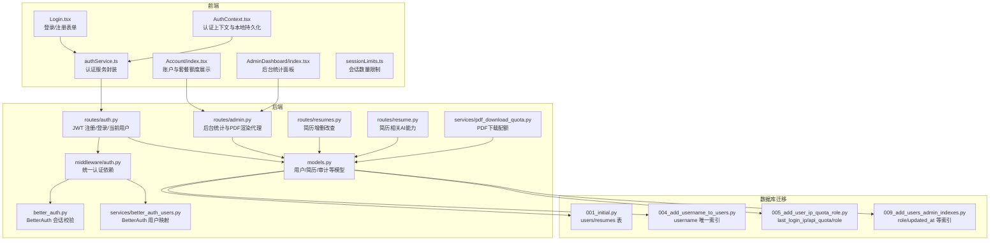
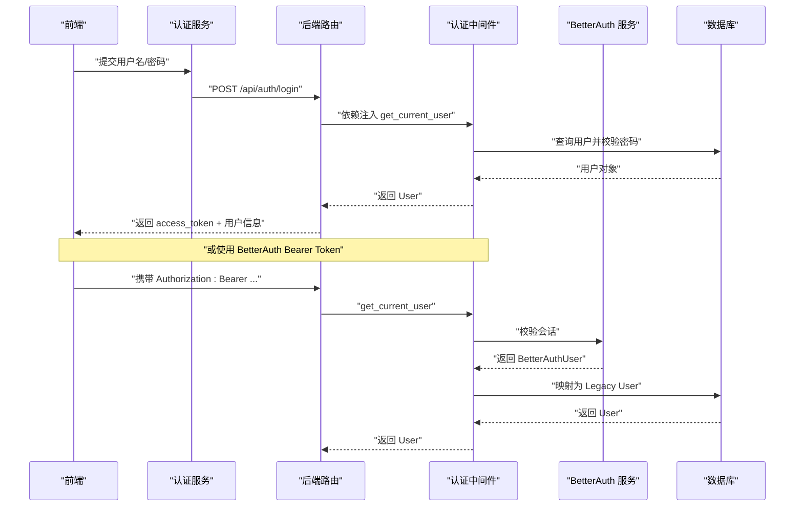
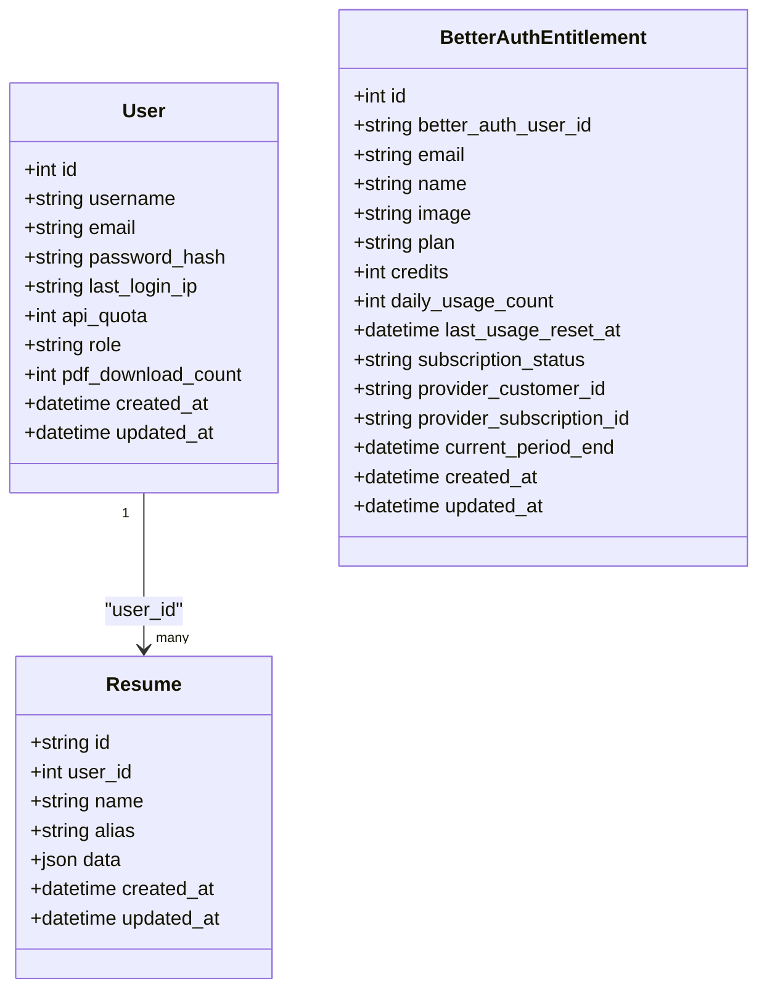
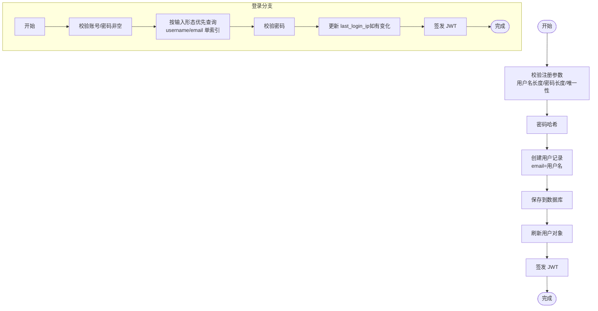
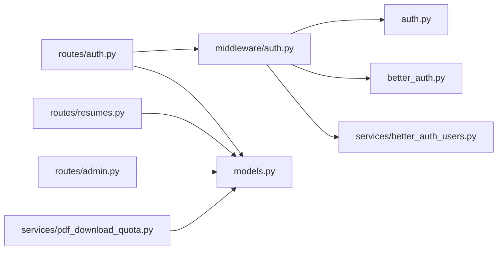

# 用户管理

<cite>
**本文引用的文件**
- [backend/models.py](file://backend/models.py)
- [backend/auth.py](file://backend/auth.py)
- [backend/routes/auth.py](file://backend/routes/auth.py)
- [backend/middleware/auth.py](file://backend/middleware/auth.py)
- [backend/better_auth.py](file://backend/better_auth.py)
- [backend/services/better_auth_users.py](file://backend/services/better_auth_users.py)
- [backend/routes/admin.py](file://backend/routes/admin.py)
- [backend/routes/resumes.py](file://backend/routes/resumes.py)
- [backend/routes/resume.py](file://backend/routes/resume.py)
- [backend/alembic/versions/001_initial.py](file://backend/alembic/versions/001_initial.py)
- [backend/alembic/versions/004_add_username_to_users.py](file://backend/alembic/versions/004_add_username_to_users.py)
- [backend/alembic/versions/005_add_user_ip_quota_role.py](file://backend/alembic/versions/005_add_user_ip_quota_role.py)
- [backend/alembic/versions/009_add_users_admin_indexes.py](file://backend/alembic/versions/009_add_users_admin_indexes.py)
- [backend/services/pdf_download_quota.py](file://backend/services/pdf_download_quota.py)
- [frontend/src/pages/Login.tsx](file://frontend/src/pages/Login.tsx)
- [frontend/src/services/authService.ts](file://frontend/src/services/authService.ts)
- [frontend/src/pages/AdminDashboard/index.tsx](file://frontend/src/pages/AdminDashboard/index.tsx)
- [frontend/src/pages/Account/index.tsx](file://frontend/src/pages/Account/index.tsx)
- [frontend/src/contexts/AuthContext.tsx](file://frontend/src/contexts/AuthContext.tsx)
- [frontend/src/utils/sessionLimits.ts](file://frontend/src/utils/sessionLimits.ts)
- [web/src/components/auth-panel.tsx](file://web/src/components/auth-panel.tsx)
- [knowledge-base/specs/2026-06-28-auth-unification-decision.md](file://knowledge-base/specs/2026-06-28-auth-unification-decision.md)
</cite>

## 目录
1. [简介](#简介)
2. [项目结构](#项目结构)
3. [核心组件](#核心组件)
4. [架构总览](#架构总览)
5. [详细组件分析](#详细组件分析)
6. [依赖分析](#依赖分析)
7. [性能考虑](#性能考虑)
8. [故障排查指南](#故障排查指南)
9. [结论](#结论)
10. [附录](#附录)

## 简介
本文件面向“用户管理系统”，围绕用户数据模型设计、用户信息存储、用户状态管理进行系统化说明；详细解释用户注册时的数据验证规则、密码安全策略、用户信息更新机制；涵盖用户数据的增删改查操作、用户状态监控、用户统计分析等功能实现，并提供用户管理API的使用示例与数据模型说明。

## 项目结构
用户管理相关代码主要分布在后端的模型层、认证与授权中间件、路由层以及前端的登录与账户页面、认证上下文与服务封装中。同时，数据库迁移脚本定义了用户表及索引、列扩展等结构演进。

图表来源
- [backend/routes/auth.py:1-233](file://backend/routes/auth.py#L1-L233)
- [backend/middleware/auth.py:1-191](file://backend/middleware/auth.py#L1-L191)
- [backend/better_auth.py:1-113](file://backend/better_auth.py#L1-L113)
- [backend/services/better_auth_users.py:1-55](file://backend/services/better_auth_users.py#L1-L55)
- [backend/models.py:111-181](file://backend/models.py#L111-L181)
- [backend/routes/admin.py:30-38](file://backend/routes/admin.py#L30-L38)
- [backend/routes/resumes.py:52-262](file://backend/routes/resumes.py#L52-L262)
- [backend/services/pdf_download_quota.py:1-110](file://backend/services/pdf_download_quota.py#L1-L110)
- [backend/alembic/versions/001_initial.py:30-48](file://backend/alembic/versions/001_initial.py#L30-L48)
- [backend/alembic/versions/004_add_username_to_users.py:18-31](file://backend/alembic/versions/004_add_username_to_users.py#L18-L31)
- [backend/alembic/versions/005_add_user_ip_quota_role.py:18-27](file://backend/alembic/versions/005_add_user_ip_quota_role.py#L18-L27)
- [backend/alembic/versions/009_add_users_admin_indexes.py:24-43](file://backend/alembic/versions/009_add_users_admin_indexes.py#L24-L43)

章节来源
- [backend/models.py:111-181](file://backend/models.py#L111-L181)
- [backend/routes/auth.py:1-233](file://backend/routes/auth.py#L1-L233)
- [backend/middleware/auth.py:1-191](file://backend/middleware/auth.py#L1-L191)
- [backend/better_auth.py:1-113](file://backend/better_auth.py#L1-L113)
- [backend/services/better_auth_users.py:1-55](file://backend/services/better_auth_users.py#L1-L55)
- [backend/routes/admin.py:30-38](file://backend/routes/admin.py#L30-L38)
- [backend/routes/resumes.py:52-262](file://backend/routes/resumes.py#L52-L262)
- [backend/services/pdf_download_quota.py:1-110](file://backend/services/pdf_download_quota.py#L1-L110)
- [backend/alembic/versions/001_initial.py:30-48](file://backend/alembic/versions/001_initial.py#L30-L48)
- [backend/alembic/versions/004_add_username_to_users.py:18-31](file://backend/alembic/versions/004_add_username_to_users.py#L18-L31)
- [backend/alembic/versions/005_add_user_ip_quota_role.py:18-27](file://backend/alembic/versions/005_add_user_ip_quota_role.py#L18-L27)
- [backend/alembic/versions/009_add_users_admin_indexes.py:24-43](file://backend/alembic/versions/009_add_users_admin_indexes.py#L24-L43)

## 核心组件
- 用户数据模型
  - 用户表：包含整数主键、用户名、邮箱、密码哈希、最近登录IP、API配额、角色、PDF下载计数等字段，并建立索引以提升查询性能。
  - 简历表：与用户表一对多关联，支持软删除级联。
  - 商业化权益表：记录 BetterAuth 用户的套餐、额度、订阅状态等。
- 认证与授权
  - JWT：密码哈希、令牌签发与解码。
  - BetterAuth：会话校验、令牌提取与解析。
  - 统一认证中间件：支持从 Trusted Headers、JWT、BetterAuth Bearer 三种来源解析当前用户。
- 用户管理API
  - 注册/登录：参数校验、密码加密、令牌返回。
  - 当前用户：返回用户基本信息（角色实时从DB读取）。
  - 管理统计：用户总数统计。
  - 简历管理：增删改查、同步、模板类型提取。
  - PDF下载配额：非管理员默认限额，管理员无限制。
- 前端集成
  - 登录/注册表单与错误处理。
  - 认证上下文：本地存储令牌与用户信息，登录后异步同步本地数据。
  - 账户页面：展示套餐、订阅状态、剩余额度、当日用量。
  - 后台统计：展示用户总数。

章节来源
- [backend/models.py:111-181](file://backend/models.py#L111-L181)
- [backend/auth.py:1-66](file://backend/auth.py#L1-L66)
- [backend/better_auth.py:1-113](file://backend/better_auth.py#L1-L113)
- [backend/middleware/auth.py:113-191](file://backend/middleware/auth.py#L113-L191)
- [backend/routes/auth.py:46-233](file://backend/routes/auth.py#L46-L233)
- [backend/routes/admin.py:30-38](file://backend/routes/admin.py#L30-L38)
- [backend/routes/resumes.py:52-262](file://backend/routes/resumes.py#L52-L262)
- [backend/services/pdf_download_quota.py:1-110](file://backend/services/pdf_download_quota.py#L1-L110)
- [frontend/src/pages/Login.tsx:19-98](file://frontend/src/pages/Login.tsx#L19-L98)
- [frontend/src/contexts/AuthContext.tsx:175-215](file://frontend/src/contexts/AuthContext.tsx#L175-L215)
- [frontend/src/pages/Account/index.tsx:106-149](file://frontend/src/pages/Account/index.tsx#L106-L149)
- [frontend/src/pages/AdminDashboard/index.tsx:168-191](file://frontend/src/pages/AdminDashboard/index.tsx#L168-L191)

## 架构总览
系统采用前后端分离架构，后端提供REST API，前端负责用户交互与状态管理。认证层支持两种模式并存：Legacy JWT 与 BetterAuth，通过统一中间件进行解析与映射。

图表来源
- [backend/routes/auth.py:149-226](file://backend/routes/auth.py#L149-L226)
- [backend/middleware/auth.py:113-146](file://backend/middleware/auth.py#L113-L146)
- [backend/better_auth.py:65-87](file://backend/better_auth.py#L65-L87)
- [backend/services/better_auth_users.py:33-55](file://backend/services/better_auth_users.py#L33-L55)

## 详细组件分析

### 用户数据模型设计
- 用户表（users）
  - 主键：整数自增ID
  - 唯一约束：username、email
  - 扩展字段：last_login_ip、api_quota、role、pdf_download_count
  - 关系：与简历表一对多
- 简历表（resumes）
  - 主键：字符串ID
  - 外键：user_id（级联删除）
  - JSON字段：data 存储完整简历数据
  - 索引：user_id、updated_at
- 商业化权益表（better_auth_entitlements）
  - 记录 BetterAuth 用户的 plan、credits、daily_usage_count、subscription_status 等
  - 索引：better_auth_user_id、plan、updated_at

图表来源
- [backend/models.py:111-181](file://backend/models.py#L111-L181)
- [backend/models.py:138-161](file://backend/models.py#L138-L161)

章节来源
- [backend/models.py:111-181](file://backend/models.py#L111-L181)
- [backend/models.py:138-161](file://backend/models.py#L138-L161)
- [backend/alembic/versions/001_initial.py:30-48](file://backend/alembic/versions/001_initial.py#L30-L48)
- [backend/alembic/versions/004_add_username_to_users.py:18-31](file://backend/alembic/versions/004_add_username_to_users.py#L18-L31)
- [backend/alembic/versions/005_add_user_ip_quota_role.py:18-27](file://backend/alembic/versions/005_add_user_ip_quota_role.py#L18-L27)
- [backend/alembic/versions/009_add_users_admin_indexes.py:24-43](file://backend/alembic/versions/009_add_users_admin_indexes.py#L24-L43)

### 用户注册与登录流程
- 注册
  - 参数校验：用户名长度、密码长度、唯一性检查
  - 密码加密：使用 bcrypt/pbkdf2
  - 用户创建：email 默认与 username 相同
  - 令牌签发：返回 JWT
- 登录
  - 输入校验：账号/密码非空
  - 查询策略：优先按输入形态走单索引查询（避免 OR 导致索引失效）
  - 密码校验：verify_password
  - IP记录：仅在变更时更新 last_login_ip
  - 令牌签发：返回 JWT

图表来源
- [backend/routes/auth.py:46-137](file://backend/routes/auth.py#L46-L137)
- [backend/routes/auth.py:149-226](file://backend/routes/auth.py#L149-L226)
- [backend/auth.py:32-66](file://backend/auth.py#L32-L66)

章节来源
- [backend/routes/auth.py:46-137](file://backend/routes/auth.py#L46-L137)
- [backend/routes/auth.py:149-226](file://backend/routes/auth.py#L149-L226)
- [backend/auth.py:32-66](file://backend/auth.py#L32-L66)

### 密码安全策略
- 密码哈希
  - 优先使用 bcrypt，兼容性问题时回退 pbkdf2_sha256
  - 注册/登录均通过 verify_password 校验
- JWT 安全
  - 秘钥、算法、过期时间通过环境变量配置
  - 解码失败时记录日志并返回错误
- BetterAuth 集成
  - 通过 BetterAuth 服务校验会话有效性
  - 支持内部可信头传递 BetterAuth 用户信息，绕过网络调用

章节来源
- [backend/auth.py:19-66](file://backend/auth.py#L19-L66)
- [backend/better_auth.py:39-87](file://backend/better_auth.py#L39-L87)
- [backend/middleware/auth.py:89-110](file://backend/middleware/auth.py#L89-L110)

### 用户信息更新机制
- 当前用户信息
  - GET /api/auth/me：返回用户ID、用户名、邮箱、角色（角色实时从DB读取）
- 简历信息更新
  - GET /api/resumes：列出当前用户所有简历，按更新时间倒序
  - GET /api/resumes/{id}：获取单个简历
  - POST /api/resumes：创建简历（支持自动生成ID与模板类型同步）
  - PUT /api/resumes/{id}：更新简历（不存在时自动创建，避免前端首次云端保存404）
  - DELETE /api/resumes/{id}：删除简历（级联删除向量嵌入）
  - POST /api/resumes/sync：同步本地与数据库简历数据

章节来源
- [backend/routes/auth.py:229-233](file://backend/routes/auth.py#L229-L233)
- [backend/routes/resumes.py:52-262](file://backend/routes/resumes.py#L52-L262)

### 用户状态管理与统计
- 用户状态
  - last_login_ip：记录最近登录IP
  - role：角色控制（admin/member/user）
  - api_quota：API调用配额上限（NULL表示不限制）
  - pdf_download_count：PDF下载计数
- 统计分析
  - GET /api/admin/stats/users：返回总用户数
- 前端展示
  - 后台面板：用户总数卡片
  - 账户页面：套餐、订阅状态、剩余额度、当日用量

章节来源
- [backend/models.py:111-128](file://backend/models.py#L111-L128)
- [backend/routes/admin.py:30-38](file://backend/routes/admin.py#L30-L38)
- [frontend/src/pages/AdminDashboard/index.tsx:168-191](file://frontend/src/pages/AdminDashboard/index.tsx#L168-L191)
- [frontend/src/pages/Account/index.tsx:106-149](file://frontend/src/pages/Account/index.tsx#L106-L149)

### BetterAuth 集成与迁移
- 统一认证
  - 支持 Trusted Headers、JWT、BetterAuth Bearer 三种来源
  - BetterAuth 会话校验失败时返回 401/503
- 用户映射
  - 将 BetterAuth 用户映射为 Legacy User，生成派生用户名与邮箱，设置默认密码哈希
- 决策背景
  - BetterAuth 要求邮箱格式，与 Legacy JWT 用户名体系不兼容，需通过映射与派生策略过渡

章节来源
- [backend/middleware/auth.py:113-146](file://backend/middleware/auth.py#L113-L146)
- [backend/better_auth.py:39-113](file://backend/better_auth.py#L39-L113)
- [backend/services/better_auth_users.py:14-55](file://backend/services/better_auth_users.py#L14-L55)
- [knowledge-base/specs/2026-06-28-auth-unification-decision.md:1-39](file://knowledge-base/specs/2026-06-28-auth-unification-decision.md#L1-L39)

### PDF 下载配额与额度
- 配额策略
  - 非管理员默认上限 10 次
  - 管理员无限制
- 记录与校验
  - 成功下载后原子性递增计数
  - 达限时拒绝并返回详细信息
- 前端交互
  - 账户页面展示剩余额度与当日用量
  - 后台统计展示用户总数

章节来源
- [backend/services/pdf_download_quota.py:1-110](file://backend/services/pdf_download_quota.py#L1-L110)
- [frontend/src/pages/Account/index.tsx:106-149](file://frontend/src/pages/Account/index.tsx#L106-L149)
- [frontend/src/pages/AdminDashboard/index.tsx:168-191](file://frontend/src/pages/AdminDashboard/index.tsx#L168-L191)

### 前端登录与认证上下文
- 登录/注册
  - 表单提交用户名/密码，调用后端接口
  - 成功后写入本地存储（令牌与用户信息）
- 认证上下文
  - 初始化：从URL或本地存储恢复令牌
  - 登录/注册：写入令牌与用户信息，延迟同步本地数据
  - 刷新权益：拉取用户套餐与额度并合并到上下文
- 错误处理
  - 统一归一化错误消息，避免HTML错误页直接展示

章节来源
- [frontend/src/pages/Login.tsx:19-98](file://frontend/src/pages/Login.tsx#L19-L98)
- [frontend/src/contexts/AuthContext.tsx:175-215](file://frontend/src/contexts/AuthContext.tsx#L175-L215)
- [frontend/src/services/authService.ts:1-52](file://frontend/src/services/authService.ts#L1-L52)

## 依赖分析
- 组件耦合
  - 路由层依赖认证中间件与数据库会话
  - 认证中间件依赖 JWT 工具与 BetterAuth 服务
  - 用户模型被路由与服务广泛使用
- 外部依赖
  - BetterAuth 服务（HTTP GET /api/auth/get-session）
  - 数据库（PostgreSQL/SQLite）

图表来源
- [backend/routes/auth.py:1-233](file://backend/routes/auth.py#L1-L233)
- [backend/middleware/auth.py:1-191](file://backend/middleware/auth.py#L1-L191)
- [backend/auth.py:1-66](file://backend/auth.py#L1-L66)
- [backend/better_auth.py:1-113](file://backend/better_auth.py#L1-L113)
- [backend/services/better_auth_users.py:1-55](file://backend/services/better_auth_users.py#L1-L55)
- [backend/models.py:111-181](file://backend/models.py#L111-L181)
- [backend/routes/resumes.py:1-262](file://backend/routes/resumes.py#L1-L262)
- [backend/routes/admin.py:1-259](file://backend/routes/admin.py#L1-L259)
- [backend/services/pdf_download_quota.py:1-110](file://backend/services/pdf_download_quota.py#L1-L110)

章节来源
- [backend/routes/auth.py:1-233](file://backend/routes/auth.py#L1-L233)
- [backend/middleware/auth.py:1-191](file://backend/middleware/auth.py#L1-L191)
- [backend/auth.py:1-66](file://backend/auth.py#L1-L66)
- [backend/better_auth.py:1-113](file://backend/better_auth.py#L1-L113)
- [backend/services/better_auth_users.py:1-55](file://backend/services/better_auth_users.py#L1-L55)
- [backend/models.py:111-181](file://backend/models.py#L111-L181)
- [backend/routes/resumes.py:1-262](file://backend/routes/resumes.py#L1-L262)
- [backend/routes/admin.py:1-259](file://backend/routes/admin.py#L1-L259)
- [backend/services/pdf_download_quota.py:1-110](file://backend/services/pdf_download_quota.py#L1-L110)

## 性能考虑
- 查询优化
  - 登录查询优先按输入形态走单索引，避免 OR 导致索引失效
  - 认证中间件加载用户时仅选择必要字段，减少ORM开销
- 幂等与重试
  - 数据库连接异常时，登录与认证中间件具备有限重试与回滚
- 索引设计
  - 用户表关键字段建立索引（role、updated_at、last_login_ip 等）
- 前端体验
  - 登录/注册成功后延迟同步本地数据，避免首屏阻塞

章节来源
- [backend/routes/auth.py:166-178](file://backend/routes/auth.py#L166-L178)
- [backend/middleware/auth.py:41-86](file://backend/middleware/auth.py#L41-L86)
- [backend/alembic/versions/009_add_users_admin_indexes.py:24-43](file://backend/alembic/versions/009_add_users_admin_indexes.py#L24-L43)

## 故障排查指南
- 认证失败
  - 未提供有效认证信息：检查 Authorization 头或 Trusted Headers
  - BetterAuth 会话无效：确认会话未过期，服务可达
  - JWT 解码失败：检查密钥与算法配置
- 注册失败
  - 用户名已存在：更换用户名
  - 密码加密失败：检查密码长度与哈希库版本
- 登录失败
  - 账号或密码错误：核对凭据
  - 数据库连接异常：查看重试日志与连接池状态
- PDF 下载受限
  - 配额用尽：升级套餐或等待重置
  - 管理员不受限：确认角色为 admin

章节来源
- [backend/middleware/auth.py:133-145](file://backend/middleware/auth.py#L133-L145)
- [backend/better_auth.py:79-87](file://backend/better_auth.py#L79-L87)
- [backend/routes/auth.py:54-66](file://backend/routes/auth.py#L54-L66)
- [backend/services/pdf_download_quota.py:86-110](file://backend/services/pdf_download_quota.py#L86-L110)

## 结论
本系统通过统一认证中间件整合 Legacy JWT 与 BetterAuth，既保证现有业务连续性，又为未来认证统一奠定基础。用户数据模型清晰、索引完善，配合严格的参数校验与密码安全策略，满足生产环境的安全与性能需求。前端提供完整的登录、账户与统计展示，后端提供完善的用户管理API与配额控制，形成闭环的用户管理体系。

## 附录

### 用户管理API清单与示例
- 注册
  - 方法：POST
  - 路径：/api/auth/register
  - 请求体：{ username, password }
  - 响应体：{ access_token, token_type, user: { id, username, email } }
- 登录
  - 方法：POST
  - 路径：/api/auth/login
  - 请求体：{ username, password }
  - 响应体：{ access_token, token_type, user: { id, username, email } }
- 当前用户
  - 方法：GET
  - 路径：/api/auth/me
  - 响应体：{ id, username, email, role }
- 用户统计
  - 方法：GET
  - 路径：/api/admin/stats/users
  - 响应体：{ total_users: number }
- 简历管理
  - 列表：GET /api/resumes
  - 获取：GET /api/resumes/{id}
  - 创建：POST /api/resumes
  - 更新：PUT /api/resumes/{id}
  - 删除：DELETE /api/resumes/{id}
  - 同步：POST /api/resumes/sync

章节来源
- [backend/routes/auth.py:46-233](file://backend/routes/auth.py#L46-L233)
- [backend/routes/admin.py:30-38](file://backend/routes/admin.py#L30-L38)
- [backend/routes/resumes.py:52-262](file://backend/routes/resumes.py#L52-L262)