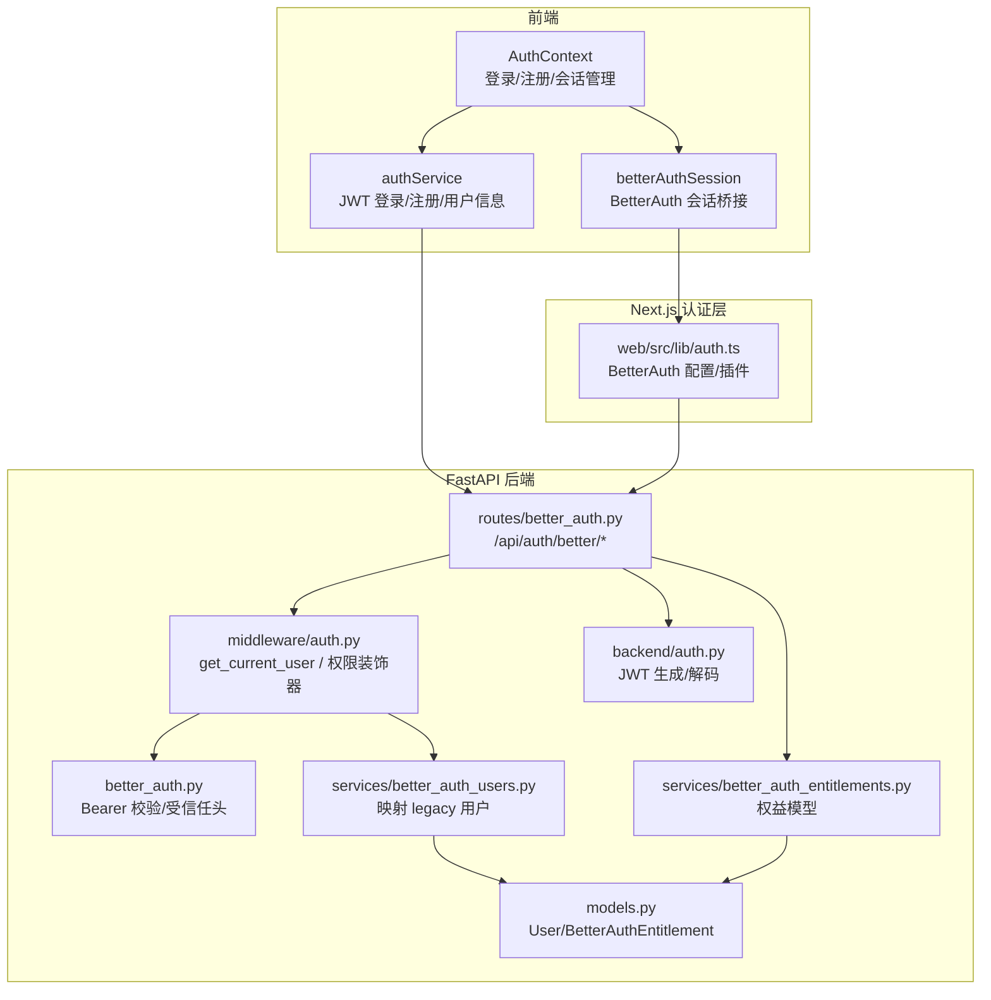
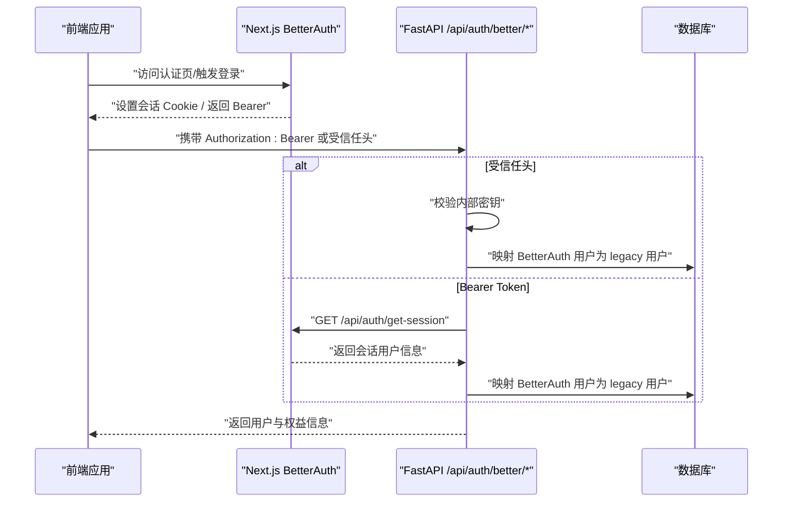
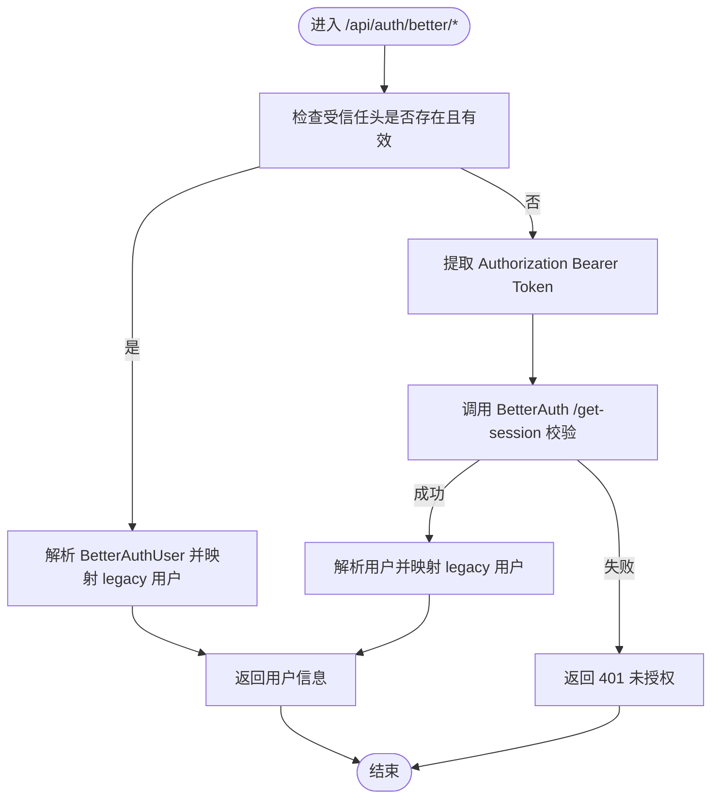
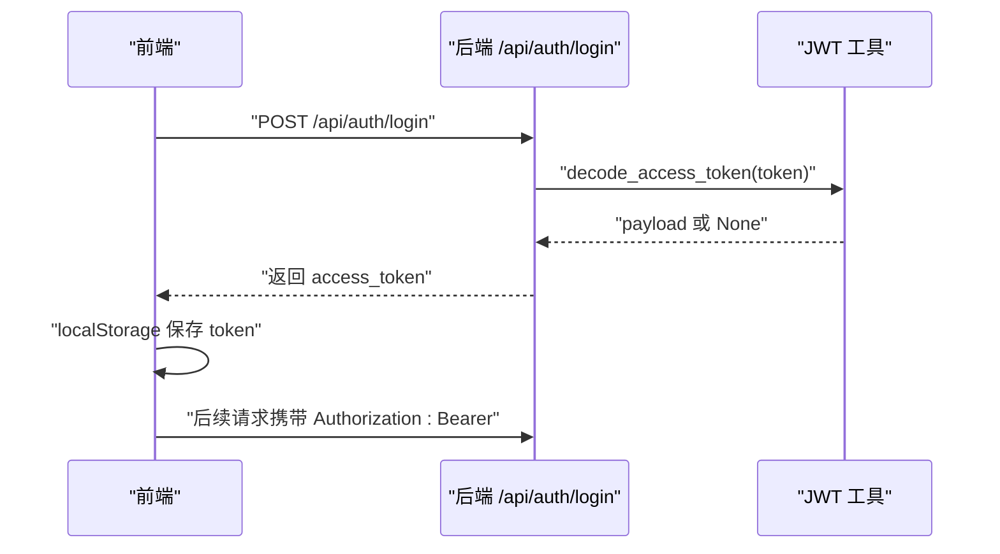
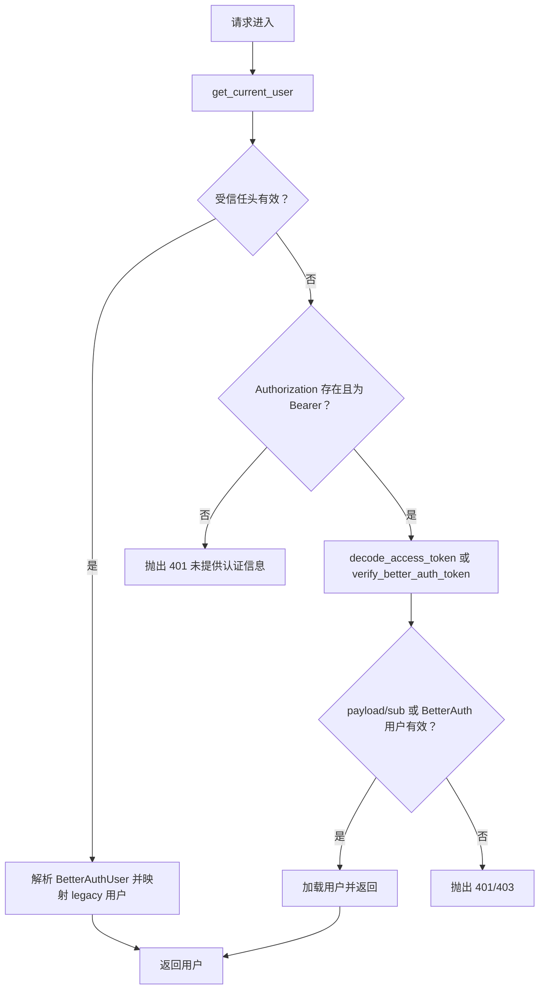
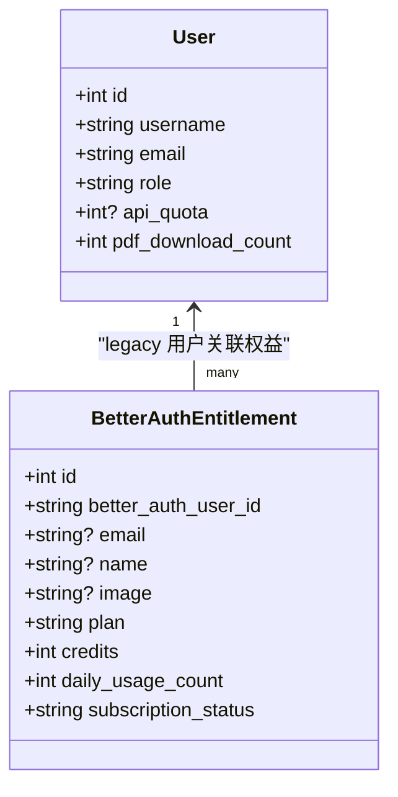
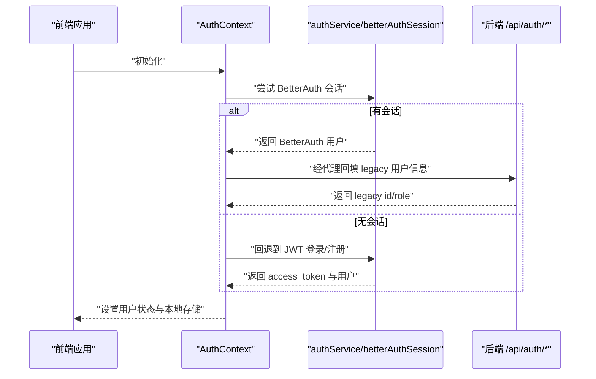
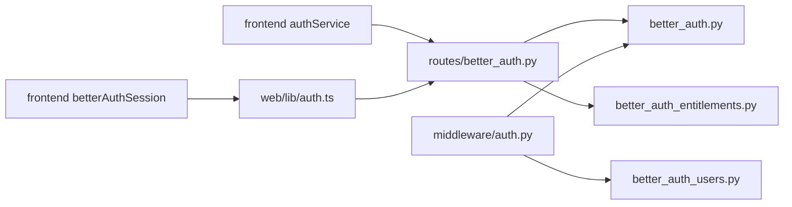

# 用户认证系统

<cite>
**本文引用的文件**
- [backend/better_auth.py](file://backend/better_auth.py)
- [backend/middleware/auth.py](file://backend/middleware/auth.py)
- [backend/routes/better_auth.py](file://backend/routes/better_auth.py)
- [backend/services/better_auth_users.py](file://backend/services/better_auth_users.py)
- [backend/services/better_auth_entitlements.py](file://backend/services/better_auth_entitlements.py)
- [backend/models.py](file://backend/models.py)
- [backend/auth.py](file://backend/auth.py)
- [frontend/src/contexts/AuthContext.tsx](file://frontend/src/contexts/AuthContext.tsx)
- [frontend/src/services/authService.ts](file://frontend/src/services/authService.ts)
- [frontend/src/services/betterAuthSession.ts](file://frontend/src/services/betterAuthSession.ts)
- [web/src/lib/auth.ts](file://web/src/lib/auth.ts)
- [scripts/bootstrap-auth-env.sh](file://scripts/bootstrap-auth-env.sh)
- [auth-stack.env.example](file://auth-stack.env.example)
</cite>

## 目录
1. [简介](#简介)
2. [项目结构](#项目结构)
3. [核心组件](#核心组件)
4. [架构总览](#架构总览)
5. [详细组件分析](#详细组件分析)
6. [依赖关系分析](#依赖关系分析)
7. [性能考虑](#性能考虑)
8. [故障排查指南](#故障排查指南)
9. [结论](#结论)
10. [附录](#附录)

## 简介
本文件面向用户认证系统，围绕 BetterAuth 集成方案，系统性阐述认证流程设计、JWT 令牌管理、权限控制系统与用户管理机制。文档覆盖用户注册、登录、密码重置、权限验证、中间件安全检查、API 访问控制与会话超时处理，并提供安全最佳实践与常见攻击防护建议。系统采用“前端由 Next.js 的 BetterAuth 统一认证，后端 FastAPI 通过受信任头或 Bearer Token 校验”的双轨模式，既兼容传统 JWT，又引入现代会话与商业权益模型。

## 项目结构
认证相关代码主要分布在以下位置：
- 后端 FastAPI 认证与中间件：backend/better_auth.py、backend/middleware/auth.py、backend/routes/better_auth.py、backend/services/better_auth_users.py、backend/services/better_auth_entitlements.py、backend/models.py、backend/auth.py
- 前端认证上下文与服务：frontend/src/contexts/AuthContext.tsx、frontend/src/services/authService.ts、frontend/src/services/betterAuthSession.ts
- Next.js BetterAuth 配置：web/src/lib/auth.ts
- 环境初始化脚本：scripts/bootstrap-auth-env.sh、auth-stack.env.example

图表来源
- [frontend/src/contexts/AuthContext.tsx:1-275](file://frontend/src/contexts/AuthContext.tsx#L1-L275)
- [frontend/src/services/authService.ts:1-132](file://frontend/src/services/authService.ts#L1-L132)
- [frontend/src/services/betterAuthSession.ts:1-99](file://frontend/src/services/betterAuthSession.ts#L1-L99)
- [web/src/lib/auth.ts:1-80](file://web/src/lib/auth.ts#L1-L80)
- [backend/routes/better_auth.py:1-90](file://backend/routes/better_auth.py#L1-L90)
- [backend/middleware/auth.py:1-191](file://backend/middleware/auth.py#L1-L191)
- [backend/better_auth.py:1-113](file://backend/better_auth.py#L1-L113)
- [backend/services/better_auth_users.py:1-55](file://backend/services/better_auth_users.py#L1-L55)
- [backend/services/better_auth_entitlements.py:1-36](file://backend/services/better_auth_entitlements.py#L1-L36)
- [backend/models.py:111-161](file://backend/models.py#L111-L161)
- [backend/auth.py:1-66](file://backend/auth.py#L1-L66)

章节来源
- [backend/better_auth.py:1-113](file://backend/better_auth.py#L1-L113)
- [backend/middleware/auth.py:1-191](file://backend/middleware/auth.py#L1-L191)
- [backend/routes/better_auth.py:1-90](file://backend/routes/better_auth.py#L1-L90)
- [backend/services/better_auth_users.py:1-55](file://backend/services/better_auth_users.py#L1-L55)
- [backend/services/better_auth_entitlements.py:1-36](file://backend/services/better_auth_entitlements.py#L1-L36)
- [backend/models.py:111-161](file://backend/models.py#L111-L161)
- [backend/auth.py:1-66](file://backend/auth.py#L1-L66)
- [frontend/src/contexts/AuthContext.tsx:1-275](file://frontend/src/contexts/AuthContext.tsx#L1-L275)
- [frontend/src/services/authService.ts:1-132](file://frontend/src/services/authService.ts#L1-L132)
- [frontend/src/services/betterAuthSession.ts:1-99](file://frontend/src/services/betterAuthSession.ts#L1-L99)
- [web/src/lib/auth.ts:1-80](file://web/src/lib/auth.ts#L1-L80)
- [scripts/bootstrap-auth-env.sh:1-204](file://scripts/bootstrap-auth-env.sh#L1-L204)
- [auth-stack.env.example:1-6](file://auth-stack.env.example#L1-L6)

## 核心组件
- BetterAuth 会话与受信任头校验：后端通过 Bearer Token 或受信任头（trusted headers）获取当前用户，兼容传统 JWT 与现代会话。
- JWT 令牌管理：生成与解码 JWT，支持过期时间配置；前端持久化并随请求携带。
- 权限控制：基于角色的访问控制（RBAC），提供管理员专用装饰器。
- 用户与权益映射：将 BetterAuth 用户映射为 legacy 用户记录，并维护商业权益表。
- 前端认证上下文：统一处理登录/注册、会话检测、权限回填与额度刷新。

章节来源
- [backend/better_auth.py:15-113](file://backend/better_auth.py#L15-L113)
- [backend/middleware/auth.py:113-191](file://backend/middleware/auth.py#L113-L191)
- [backend/auth.py:42-66](file://backend/auth.py#L42-L66)
- [backend/services/better_auth_users.py:33-55](file://backend/services/better_auth_users.py#L33-L55)
- [backend/services/better_auth_entitlements.py:10-36](file://backend/services/better_auth_entitlements.py#L10-L36)
- [frontend/src/contexts/AuthContext.tsx:61-275](file://frontend/src/contexts/AuthContext.tsx#L61-L275)

## 架构总览
系统采用“前端统一认证 + 后端双重校验”的混合架构：
- 前端 Next.js 使用 BetterAuth 管理会话，支持 Cookie、Bearer 插件与社交登录。
- 后端 FastAPI 支持两种路径：
  - 受信任头：由 Next.js 代理注入 BetterAuth 用户信息，后端直接解析并映射 legacy 用户。
  - Bearer Token：后端向 BetterAuth 服务查询当前会话有效性，再映射用户。
- 用户与权益：legacy 用户记录与 BetterAuth 权益表分离，通过服务层统一管理。

图表来源
- [backend/better_auth.py:65-113](file://backend/better_auth.py#L65-L113)
- [backend/middleware/auth.py:113-146](file://backend/middleware/auth.py#L113-L146)
- [backend/routes/better_auth.py:61-90](file://backend/routes/better_auth.py#L61-L90)
- [backend/services/better_auth_users.py:33-55](file://backend/services/better_auth_users.py#L33-L55)
- [web/src/lib/auth.ts:42-77](file://web/src/lib/auth.ts#L42-L77)

## 详细组件分析

### BetterAuth 集成与会话管理
- 会话查询：后端通过 Bearer Token 调用 BetterAuth 的会话接口，校验令牌有效性并解析用户信息。
- 受信任头：当 Next.js 代理转发时，注入内部密钥与 BetterAuth 用户信息，后端无需远程查询，提升性能与可靠性。
- 健康检查：提供 /api/auth/better/health 探针，检查 BetterAuth 内部地址、内部密钥与权益表就绪状态。

图表来源
- [backend/better_auth.py:65-113](file://backend/better_auth.py#L65-L113)
- [backend/middleware/auth.py:113-146](file://backend/middleware/auth.py#L113-L146)
- [backend/routes/better_auth.py:44-90](file://backend/routes/better_auth.py#L44-L90)

章节来源
- [backend/better_auth.py:22-113](file://backend/better_auth.py#L22-L113)
- [backend/routes/better_auth.py:44-90](file://backend/routes/better_auth.py#L44-L90)
- [backend/middleware/auth.py:89-146](file://backend/middleware/auth.py#L89-L146)

### JWT 令牌管理
- 生成：基于对称密钥与算法，设置过期时间（小时），返回 JWT。
- 解码：安全解码并捕获异常，失败时返回空负载。
- 前端持久化：登录成功后保存 token 到本地存储并在请求头中携带；401 自动清理。

图表来源
- [backend/auth.py:42-66](file://backend/auth.py#L42-L66)
- [frontend/src/services/authService.ts:86-132](file://frontend/src/services/authService.ts#L86-L132)

章节来源
- [backend/auth.py:19-66](file://backend/auth.py#L19-L66)
- [frontend/src/services/authService.ts:86-132](file://frontend/src/services/authService.ts#L86-L132)

### 权限控制系统
- 角色枚举：用户具备基础角色（如 user），管理员（admin）拥有最高权限。
- 装饰器：
  - require_admin_only：仅管理员可访问
  - require_admin_or_member：管理员或成员可访问
- 中间件链路：get_current_user 优先受信任头，其次 JWT，最后 BetterAuth Bearer；失败抛出 401/403。

图表来源
- [backend/middleware/auth.py:113-191](file://backend/middleware/auth.py#L113-L191)

章节来源
- [backend/middleware/auth.py:176-191](file://backend/middleware/auth.py#L176-L191)
- [backend/middleware/auth.py:113-146](file://backend/middleware/auth.py#L113-L146)

### 用户管理与权益模型
- 用户映射：BetterAuth 用户首次登录时，根据名称/邮箱派生用户名，保证唯一性并创建 legacy 用户记录。
- 权益表：为每个 BetterAuth 用户维护权益（计划、额度、订阅状态等），支持更新与查询。
- 数据模型：User 与 BetterAuthEntitlement 定义清晰的字段与索引，便于查询与扩展。

图表来源
- [backend/models.py:111-161](file://backend/models.py#L111-L161)
- [backend/services/better_auth_users.py:33-55](file://backend/services/better_auth_users.py#L33-L55)
- [backend/services/better_auth_entitlements.py:10-36](file://backend/services/better_auth_entitlements.py#L10-L36)

章节来源
- [backend/services/better_auth_users.py:14-55](file://backend/services/better_auth_users.py#L14-L55)
- [backend/services/better_auth_entitlements.py:10-36](file://backend/services/better_auth_entitlements.py#L10-L36)
- [backend/models.py:111-161](file://backend/models.py#L111-L161)

### 前端认证流程
- 登录/注册：通过 authService 发起请求，保存 token 并设置默认请求头。
- 会话桥接：betterAuthSession 通过 Next.js 桥接获取 BetterAuth 会话，必要时回填 legacy 用户 id 与角色。
- 上下文：AuthContext 统一管理用户状态、加载状态、模态框与额度刷新，支持两种登录模式共存。

图表来源
- [frontend/src/contexts/AuthContext.tsx:61-275](file://frontend/src/contexts/AuthContext.tsx#L61-L275)
- [frontend/src/services/authService.ts:110-132](file://frontend/src/services/authService.ts#L110-L132)
- [frontend/src/services/betterAuthSession.ts:24-99](file://frontend/src/services/betterAuthSession.ts#L24-L99)

章节来源
- [frontend/src/contexts/AuthContext.tsx:61-275](file://frontend/src/contexts/AuthContext.tsx#L61-L275)
- [frontend/src/services/authService.ts:110-132](file://frontend/src/services/authService.ts#L110-L132)
- [frontend/src/services/betterAuthSession.ts:24-99](file://frontend/src/services/betterAuthSession.ts#L24-L99)

## 依赖关系分析
- 组件耦合：
  - middleware/auth.py 依赖 better_auth.py 与 services/better_auth_users.py，形成“令牌解析 → 用户映射”的闭环。
  - routes/better_auth.py 依赖 better_auth.py 与 services/better_auth_entitlements.py，提供对外接口。
  - 前端依赖后端提供的 API 与 Next.js 桥接。
- 外部依赖：
  - BetterAuth（Next.js）负责会话与 Cookie 管理。
  - httpx 用于后端向 BetterAuth 查询会话。
  - SQLAlchemy 与数据库交互。

图表来源
- [backend/routes/better_auth.py:1-90](file://backend/routes/better_auth.py#L1-L90)
- [backend/better_auth.py:1-113](file://backend/better_auth.py#L1-L113)
- [backend/middleware/auth.py:1-191](file://backend/middleware/auth.py#L1-L191)
- [backend/services/better_auth_users.py:1-55](file://backend/services/better_auth_users.py#L1-L55)
- [backend/services/better_auth_entitlements.py:1-36](file://backend/services/better_auth_entitlements.py#L1-L36)
- [frontend/src/services/authService.ts:1-132](file://frontend/src/services/authService.ts#L1-L132)
- [frontend/src/services/betterAuthSession.ts:1-99](file://frontend/src/services/betterAuthSession.ts#L1-L99)
- [web/src/lib/auth.ts:1-80](file://web/src/lib/auth.ts#L1-L80)

章节来源
- [backend/middleware/auth.py:19-23](file://backend/middleware/auth.py#L19-L23)
- [backend/better_auth.py:10-12](file://backend/better_auth.py#L10-L12)
- [backend/routes/better_auth.py:4-18](file://backend/routes/better_auth.py#L4-L18)

## 性能考虑
- 受信任头优先：在 Next.js 代理场景下，避免后端远程查询 BetterAuth 会话，显著降低延迟与外部依赖风险。
- 数据库重试：用户加载包含有限次数重试与回滚，提升弱网或瞬断下的稳定性。
- 超时控制：BetterAuth 会话查询与前端桥接请求均设置合理超时，避免阻塞主线程。
- 缓存与懒加载：前端在首屏优先使用本地缓存用户信息，后续异步回填 legacy 信息与权益，优化体验。

章节来源
- [backend/middleware/auth.py:41-86](file://backend/middleware/auth.py#L41-L86)
- [frontend/src/contexts/AuthContext.tsx:100-130](file://frontend/src/contexts/AuthContext.tsx#L100-L130)
- [frontend/src/services/betterAuthSession.ts:4-53](file://frontend/src/services/betterAuthSession.ts#L4-L53)

## 故障排查指南
- 401 未提供认证信息：检查 Authorization 头是否为 Bearer，或 Next.js 代理是否正确注入受信任头。
- 401/403 会话无效或过期：确认 BetterAuth 会话是否仍有效，或后端是否能访问 BetterAuth 服务。
- 数据库连接异常：查看中间件中的重试日志与回滚行为，确认连接池与超时配置。
- 权益表缺失：运行健康检查接口，确认权益表是否存在并可查询。
- 环境变量缺失：使用环境初始化脚本生成或补充 BetterAuth 与 FastAPI 内部密钥、数据库连接等。

章节来源
- [backend/middleware/auth.py:70-86](file://backend/middleware/auth.py#L70-L86)
- [backend/better_auth.py:73-87](file://backend/better_auth.py#L73-L87)
- [backend/routes/better_auth.py:44-58](file://backend/routes/better_auth.py#L44-L58)
- [scripts/bootstrap-auth-env.sh:172-204](file://scripts/bootstrap-auth-env.sh#L172-L204)
- [auth-stack.env.example:4-6](file://auth-stack.env.example#L4-L6)

## 结论
本认证系统通过 BetterAuth 与 JWT 的双轨设计，实现了现代化会话与传统令牌的兼容；借助受信任头与后端映射，兼顾性能与安全性。权限控制与用户/权益模型清晰，前端上下文统一了登录态管理与额度刷新。建议在生产环境中严格管理密钥、启用 HTTPS、限制跨域来源，并定期审计权限与会话策略。

## 附录
- 环境初始化：使用脚本生成 BetterAuth 与 FastAPI 内部密钥，自动填充 Next.js 与后端所需环境变量。
- 安全基线：Cookie 跨子域需 Secure + SameSite=None；Bearer 插件与受信任头配合使用；数据库连接池与超时需结合实际负载调整。

章节来源
- [scripts/bootstrap-auth-env.sh:172-204](file://scripts/bootstrap-auth-env.sh#L172-L204)
- [web/src/lib/auth.ts:28-77](file://web/src/lib/auth.ts#L28-L77)