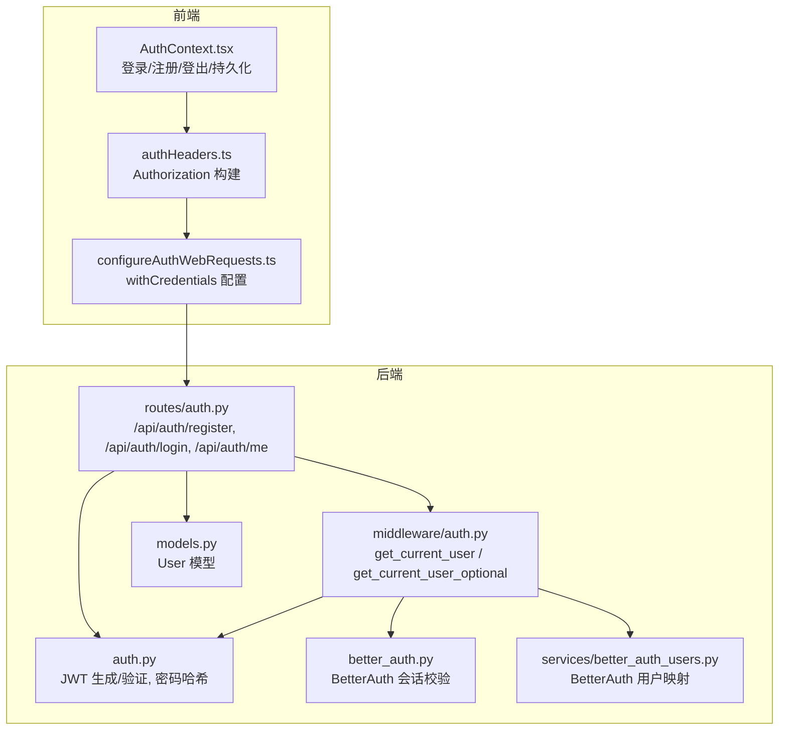
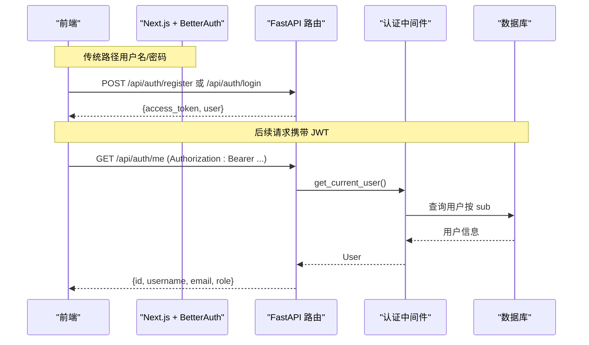
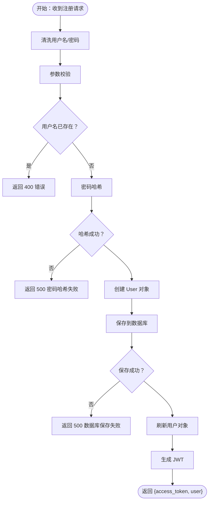
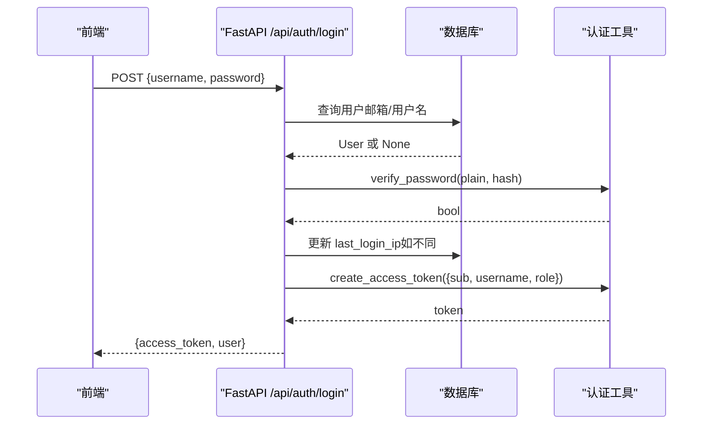
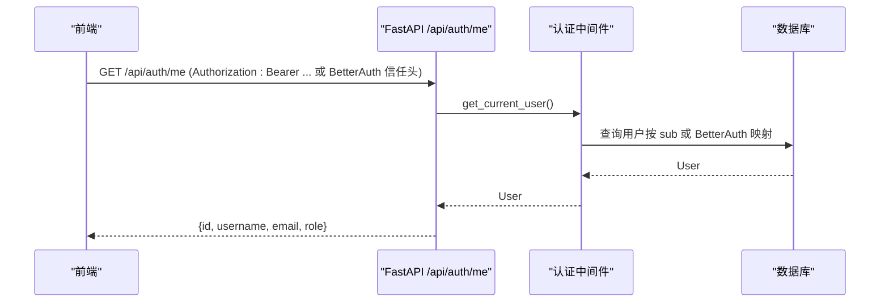
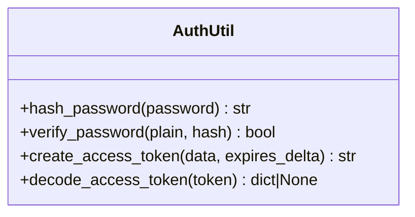
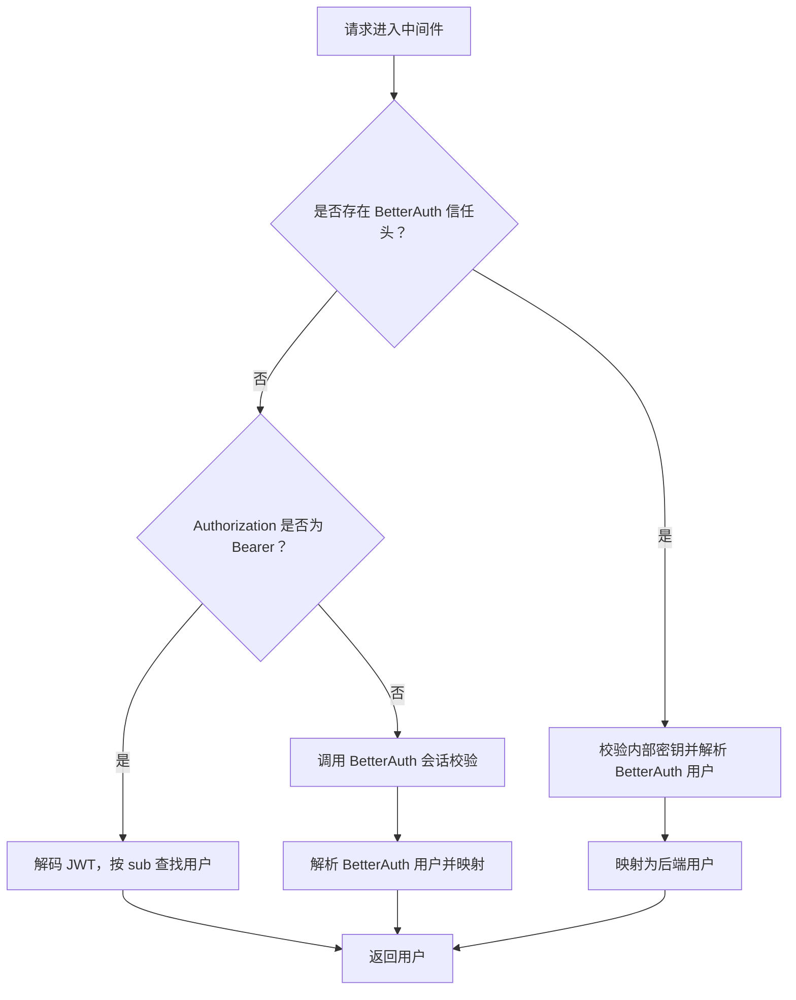
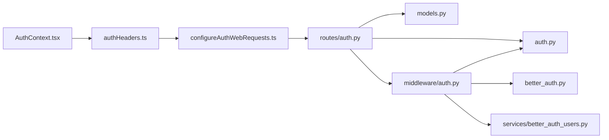

# 认证流程

<cite>
**本文引用的文件**
- [backend/routes/auth.py](file://backend/routes/auth.py)
- [backend/middleware/auth.py](file://backend/middleware/auth.py)
- [backend/auth.py](file://backend/auth.py)
- [backend/models.py](file://backend/models.py)
- [backend/better_auth.py](file://backend/better_auth.py)
- [backend/services/better_auth_users.py](file://backend/services/better_auth_users.py)
- [frontend/src/contexts/AuthContext.tsx](file://frontend/src/contexts/AuthContext.tsx)
- [frontend/src/lib/authHeaders.ts](file://frontend/src/lib/authHeaders.ts)
- [frontend/src/lib/configureAuthWebRequests.ts](file://frontend/src/lib/configureAuthWebRequests.ts)
- [scripts/bootstrap-auth-env.sh](file://scripts/bootstrap-auth-env.sh)
- [auth-stack.env.example](file://auth-stack.env.example)
</cite>

## 目录
1. [简介](#简介)
2. [项目结构](#项目结构)
3. [核心组件](#核心组件)
4. [架构总览](#架构总览)
5. [详细组件分析](#详细组件分析)
6. [依赖关系分析](#依赖关系分析)
7. [性能考量](#性能考量)
8. [故障排查指南](#故障排查指南)
9. [结论](#结论)
10. [附录](#附录)

## 简介
本文件系统性梳理 ResumeAgent 的认证流程，覆盖用户注册、登录、登出的完整实现；详解 JWT 令牌生成与验证机制、密码哈希算法、会话管理策略；并给出请求参数校验、错误处理、安全检查等实现细节。同时提供 API 调用示例与响应格式说明，并解释认证中间件的工作原理与用户身份验证过程。

## 项目结构
认证相关代码主要分布在后端 FastAPI 路由与中间件、认证工具模块、数据库模型以及前端上下文与请求头配置中。整体采用“Next.js + BetterAuth”与“传统用户名/密码 + JWT”双栈并行的认证架构，通过 FastAPI 中间件统一路由到后端业务。

图表来源
- [backend/routes/auth.py:1-233](file://backend/routes/auth.py#L1-L233)
- [backend/middleware/auth.py:1-191](file://backend/middleware/auth.py#L1-L191)
- [backend/auth.py:1-66](file://backend/auth.py#L1-L66)
- [backend/models.py:111-128](file://backend/models.py#L111-L128)
- [backend/better_auth.py:1-113](file://backend/better_auth.py#L1-L113)
- [backend/services/better_auth_users.py:1-55](file://backend/services/better_auth_users.py#L1-L55)
- [frontend/src/contexts/AuthContext.tsx:1-275](file://frontend/src/contexts/AuthContext.tsx#L1-L275)
- [frontend/src/lib/authHeaders.ts:1-22](file://frontend/src/lib/authHeaders.ts#L1-L22)
- [frontend/src/lib/configureAuthWebRequests.ts:1-41](file://frontend/src/lib/configureAuthWebRequests.ts#L1-L41)

章节来源
- [backend/routes/auth.py:1-233](file://backend/routes/auth.py#L1-L233)
- [backend/middleware/auth.py:1-191](file://backend/middleware/auth.py#L1-L191)
- [backend/auth.py:1-66](file://backend/auth.py#L1-L66)
- [backend/models.py:111-128](file://backend/models.py#L111-L128)
- [backend/better_auth.py:1-113](file://backend/better_auth.py#L1-L113)
- [backend/services/better_auth_users.py:1-55](file://backend/services/better_auth_users.py#L1-L55)
- [frontend/src/contexts/AuthContext.tsx:1-275](file://frontend/src/contexts/AuthContext.tsx#L1-L275)
- [frontend/src/lib/authHeaders.ts:1-22](file://frontend/src/lib/authHeaders.ts#L1-L22)
- [frontend/src/lib/configureAuthWebRequests.ts:1-41](file://frontend/src/lib/configureAuthWebRequests.ts#L1-L41)

## 核心组件
- 路由层：提供注册、登录、当前用户信息查询接口，负责参数校验、业务流程编排与错误处理。
- 中间件层：统一从请求头解析认证信息，支持 BetterAuth 信任头、Bearer JWT、BetterAuth 会话三种来源。
- 认证工具：封装 JWT 生成/验证、密码哈希/校验、BetterAuth 会话校验与用户映射。
- 数据模型：User 表承载用户名、邮箱、密码哈希、角色、登录 IP 等字段。
- 前端上下文：负责登录/注册/登出、本地持久化、请求头注入、与 BetterAuth 协作。

章节来源
- [backend/routes/auth.py:46-232](file://backend/routes/auth.py#L46-L232)
- [backend/middleware/auth.py:113-174](file://backend/middleware/auth.py#L113-L174)
- [backend/auth.py:32-66](file://backend/auth.py#L32-L66)
- [backend/models.py:111-128](file://backend/models.py#L111-L128)
- [frontend/src/contexts/AuthContext.tsx:178-228](file://frontend/src/contexts/AuthContext.tsx#L178-L228)

## 架构总览
认证架构分为两条路径：
- 传统路径：前端用户名/密码登录，后端生成 JWT 并返回；后续请求通过 Authorization: Bearer 传递。
- BetterAuth 路径：前端通过 Next.js + BetterAuth 完成登录，FastAPI 通过受信头或 BetterAuth 会话校验，映射为后端用户。

图表来源
- [backend/routes/auth.py:46-232](file://backend/routes/auth.py#L46-L232)
- [backend/middleware/auth.py:113-146](file://backend/middleware/auth.py#L113-L146)
- [backend/models.py:111-128](file://backend/models.py#L111-L128)

## 详细组件分析

### 注册流程
- 参数校验：用户名非空且长度≥2，密码长度≥4；检查用户名是否已存在。
- 密码处理：使用密码哈希算法生成哈希值，失败时返回 500。
- 用户创建：构造 User 对象（email 默认与 username 相同），保存至数据库，失败回滚并返回 500。
- 令牌生成：为新用户生成 JWT，包含 sub、username、role。
- 响应：返回 access_token 与用户信息。

图表来源
- [backend/routes/auth.py:46-136](file://backend/routes/auth.py#L46-L136)
- [backend/auth.py:32-34](file://backend/auth.py#L32-L34)

章节来源
- [backend/routes/auth.py:46-136](file://backend/routes/auth.py#L46-L136)
- [backend/auth.py:32-34](file://backend/auth.py#L32-L34)

### 登录流程
- 输入校验：用户名/密码均不能为空。
- 用户查找：优先按输入形态选择索引（邮箱或用户名），支持一次数据库重试。
- 密码校验：使用哈希校验，失败返回 401。
- 登录 IP 记录：若与 last_login_ip 不同，更新并提交。
- 令牌生成：生成 JWT 并返回。
- 响应：返回 access_token 与用户信息。

图表来源
- [backend/routes/auth.py:149-226](file://backend/routes/auth.py#L149-L226)
- [backend/auth.py:37-47](file://backend/auth.py#L37-L47)

章节来源
- [backend/routes/auth.py:149-226](file://backend/routes/auth.py#L149-L226)
- [backend/auth.py:37-47](file://backend/auth.py#L37-L47)

### 当前用户信息查询
- 接口：GET /api/auth/me
- 中间件：get_current_user 解析认证头，支持 BetterAuth 信任头、Bearer JWT、BetterAuth 会话三种来源。
- 返回：实时从数据库读取用户信息（role 不依赖 JWT 缓存）。

图表来源
- [backend/routes/auth.py:229-232](file://backend/routes/auth.py#L229-L232)
- [backend/middleware/auth.py:113-146](file://backend/middleware/auth.py#L113-L146)

章节来源
- [backend/routes/auth.py:229-232](file://backend/routes/auth.py#L229-L232)
- [backend/middleware/auth.py:113-146](file://backend/middleware/auth.py#L113-L146)

### JWT 令牌生成与验证机制
- 生成：基于用户 ID、用户名、角色构建载荷，设置过期时间，默认 168 小时。
- 验证：解码 JWT，捕获异常并返回 None；失败时由上层判定 401。
- 算法与密钥：从环境变量读取，支持 HS256；内置 bcrypt/pbkdf2 兼容处理。

图表来源
- [backend/auth.py:32-66](file://backend/auth.py#L32-L66)

章节来源
- [backend/auth.py:32-66](file://backend/auth.py#L32-L66)

### 密码哈希算法
- 使用 passlib 的 CryptContext，优先 bcrypt，失败回退 pbkdf2_sha256。
- 注册与登录均使用 verify_password 校验明文与哈希。

章节来源
- [backend/auth.py:24-39](file://backend/auth.py#L24-L39)
- [backend/routes/auth.py:69-76](file://backend/routes/auth.py#L69-L76)
- [backend/routes/auth.py:197](file://backend/routes/auth.py#L197)

### 会话管理策略
- 传统 JWT：前端本地存储 access_token，后续请求通过 Authorization: Bearer 传递。
- BetterAuth：前端通过 Next.js + BetterAuth 完成登录，FastAPI 通过受信头或 BetterAuth 会话校验，映射为后端用户。
- 登录 IP：登录成功后记录 last_login_ip，避免频繁更新。
- 数据库重试：认证中间件对数据库连接异常进行有限次重试，提升稳定性。

章节来源
- [frontend/src/lib/authHeaders.ts:3-13](file://frontend/src/lib/authHeaders.ts#L3-L13)
- [frontend/src/contexts/AuthContext.tsx:178-206](file://frontend/src/contexts/AuthContext.tsx#L178-L206)
- [backend/middleware/auth.py:26-86](file://backend/middleware/auth.py#L26-L86)
- [backend/routes/auth.py:204-216](file://backend/routes/auth.py#L204-L216)

### 认证中间件工作原理
- 优先级：BetterAuth 信任头 > Bearer JWT > BetterAuth 会话。
- BetterAuth 信任头：校验内部密钥，解析 BetterAuth 用户信息，映射为后端用户。
- Bearer JWT：解码 JWT，按 sub 查找用户。
- BetterAuth 会话：调用 BetterAuth 服务校验会话，解析用户信息并映射。
- 可选认证：get_current_user_optional 在无有效认证时返回 None 而非 401。

图表来源
- [backend/middleware/auth.py:113-146](file://backend/middleware/auth.py#L113-L146)
- [backend/better_auth.py:65-87](file://backend/better_auth.py#L65-L87)
- [backend/services/better_auth_users.py:33-55](file://backend/services/better_auth_users.py#L33-L55)

章节来源
- [backend/middleware/auth.py:113-146](file://backend/middleware/auth.py#L113-L146)
- [backend/better_auth.py:65-87](file://backend/better_auth.py#L65-L87)
- [backend/services/better_auth_users.py:33-55](file://backend/services/better_auth_users.py#L33-L55)

### 用户身份验证过程
- 前端发起请求，携带 Authorization: Bearer 或 BetterAuth 信任头。
- 中间件按优先级解析认证信息，映射为后端用户。
- 若用户不存在或认证失败，返回 401/403。
- 成功后，业务路由可安全使用 current_user。

章节来源
- [backend/middleware/auth.py:176-191](file://backend/middleware/auth.py#L176-L191)
- [backend/middleware/auth.py:148-174](file://backend/middleware/auth.py#L148-L174)

## 依赖关系分析
- 路由依赖认证工具与数据库会话，依赖中间件解析用户。
- 中间件依赖认证工具与 BetterAuth 会话校验，依赖用户映射服务。
- 前端依赖本地存储与请求拦截，注入 Authorization 头或使用 BetterAuth Cookie。

图表来源
- [backend/routes/auth.py:16-17](file://backend/routes/auth.py#L16-L17)
- [backend/middleware/auth.py:19-21](file://backend/middleware/auth.py#L19-L21)
- [backend/better_auth.py:9-12](file://backend/better_auth.py#L9-L12)
- [backend/services/better_auth_users.py:9-11](file://backend/services/better_auth_users.py#L9-L11)
- [frontend/src/contexts/AuthContext.tsx:1-12](file://frontend/src/contexts/AuthContext.tsx#L1-L12)
- [frontend/src/lib/authHeaders.ts:1-13](file://frontend/src/lib/authHeaders.ts#L1-L13)
- [frontend/src/lib/configureAuthWebRequests.ts:1-41](file://frontend/src/lib/configureAuthWebRequests.ts#L1-L41)

章节来源
- [backend/routes/auth.py:16-17](file://backend/routes/auth.py#L16-L17)
- [backend/middleware/auth.py:19-21](file://backend/middleware/auth.py#L19-L21)
- [backend/better_auth.py:9-12](file://backend/better_auth.py#L9-L12)
- [backend/services/better_auth_users.py:9-11](file://backend/services/better_auth_users.py#L9-L11)
- [frontend/src/contexts/AuthContext.tsx:1-12](file://frontend/src/contexts/AuthContext.tsx#L1-L12)
- [frontend/src/lib/authHeaders.ts:1-13](file://frontend/src/lib/authHeaders.ts#L1-L13)
- [frontend/src/lib/configureAuthWebRequests.ts:1-41](file://frontend/src/lib/configureAuthWebRequests.ts#L1-L41)

## 性能考量
- 数据库重试：登录与中间件对数据库连接异常进行有限次重试，减少瞬时抖动。
- 索引查询：登录时根据输入形态优先走单一索引，避免 OR 导致索引不稳定。
- 日志与耗时：登录流程记录各阶段耗时，便于定位瓶颈。
- 启动预热：后端启动时预热数据库连接与外部依赖，降低首请求延迟。

章节来源
- [backend/middleware/auth.py:50-86](file://backend/middleware/auth.py#L50-L86)
- [backend/routes/auth.py:166-194](file://backend/routes/auth.py#L166-L194)
- [backend/main.py:271-295](file://backend/main.py#L271-L295)

## 故障排查指南
- 注册失败（500）：检查密码哈希、数据库连接、唯一约束冲突。
- 登录失败（401）：确认用户名/密码正确、数据库连接稳定、BetterAuth 会话有效。
- 中间件 401：检查 Authorization 头格式、BetterAuth 信任头是否正确、内部密钥是否一致。
- BetterAuth 会话不可用：确认 BetterAuth 服务可达、超时配置合理。
- 登录 IP 未更新：检查请求头 x-forwarded-for 与客户端 IP 提取逻辑。

章节来源
- [backend/routes/auth.py:54-104](file://backend/routes/auth.py#L54-L104)
- [backend/routes/auth.py:157-201](file://backend/routes/auth.py#L157-L201)
- [backend/middleware/auth.py:96-103](file://backend/middleware/auth.py#L96-L103)
- [backend/middleware/auth.py:70-83](file://backend/middleware/auth.py#L70-L83)
- [backend/routes/auth.py:139-146](file://backend/routes/auth.py#L139-L146)

## 结论
本项目采用“传统 JWT + BetterAuth”双栈认证，通过 FastAPI 中间件统一路由到后端业务，既保证了传统用户名/密码登录的可控性，又支持现代会话体系的扩展。注册、登录、当前用户查询流程清晰，参数校验与错误处理完善，JWT 与密码哈希实现稳健，数据库重试与性能监控提升了可靠性与可观测性。

## 附录

### API 调用示例与响应格式
- 注册
  - 方法与路径：POST /api/auth/register
  - 请求体：{ "username": "...", "password": "..." }
  - 响应体：{ "access_token": "...", "token_type": "bearer", "user": { "id": 123, "username": "...", "email": "...", "role": "..." } }

- 登录
  - 方法与路径：POST /api/auth/login
  - 请求体：{ "username": "...", "password": "..." }
  - 响应体：{ "access_token": "...", "token_type": "bearer", "user": { "id": 123, "username": "...", "email": "...", "role": "..." } }

- 获取当前用户
  - 方法与路径：GET /api/auth/me
  - 请求头：Authorization: Bearer ...
  - 响应体：{ "id": 123, "username": "...", "email": "...", "role": "..." }

章节来源
- [backend/routes/auth.py:46-136](file://backend/routes/auth.py#L46-L136)
- [backend/routes/auth.py:149-226](file://backend/routes/auth.py#L149-L226)
- [backend/routes/auth.py:229-232](file://backend/routes/auth.py#L229-L232)

### 环境变量与部署要点
- BetterAuth 与 FastAPI 内部密钥需保持一致，用于受信头校验。
- 建议使用脚本初始化认证环境变量，确保密钥与数据库 URL 一致。
- 生产环境务必替换默认密钥与算法配置。

章节来源
- [scripts/bootstrap-auth-env.sh:172-200](file://scripts/bootstrap-auth-env.sh#L172-L200)
- [auth-stack.env.example:4-6](file://auth-stack.env.example#L4-L6)
- [backend/auth.py:20-22](file://backend/auth.py#L20-L22)