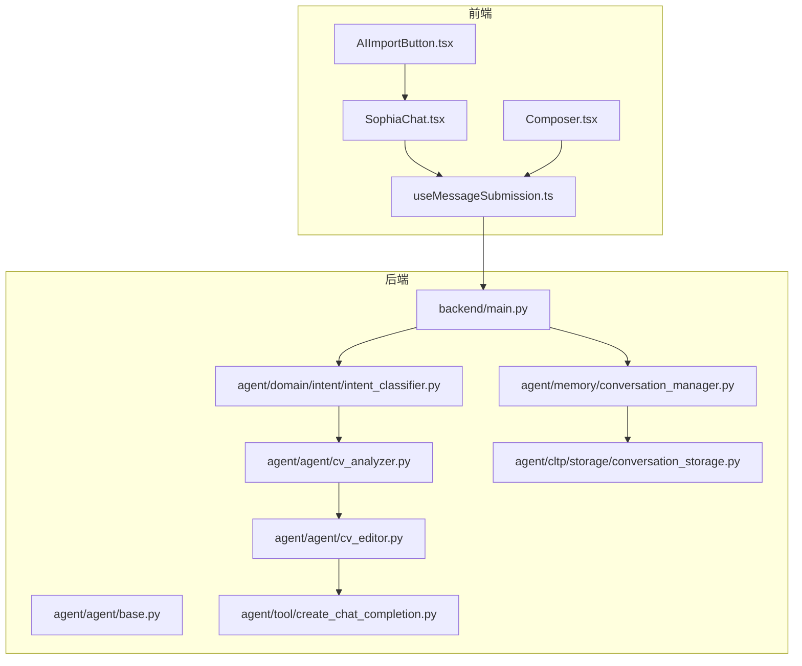
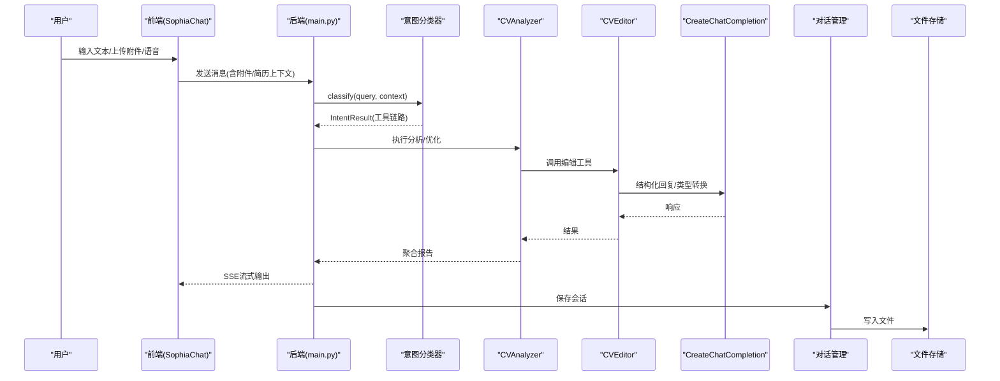
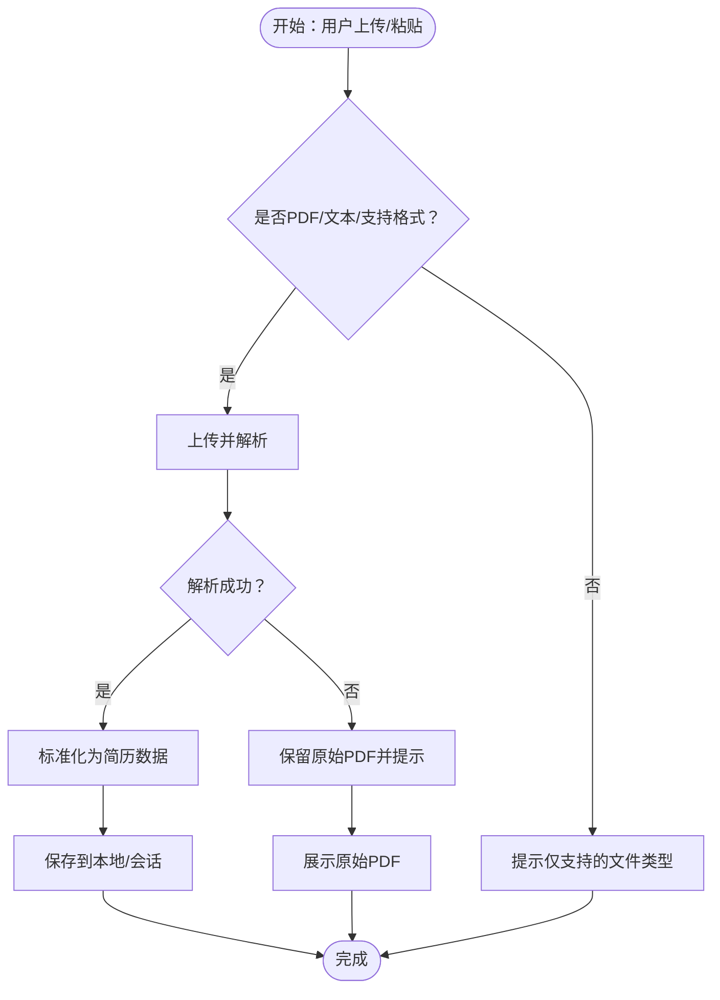
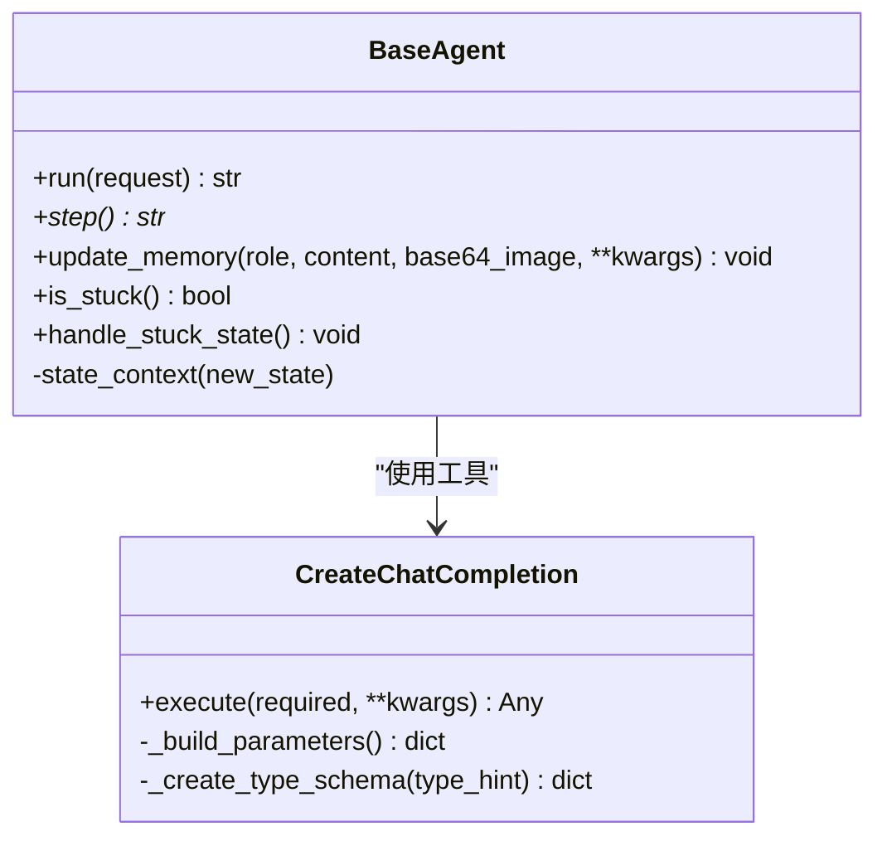
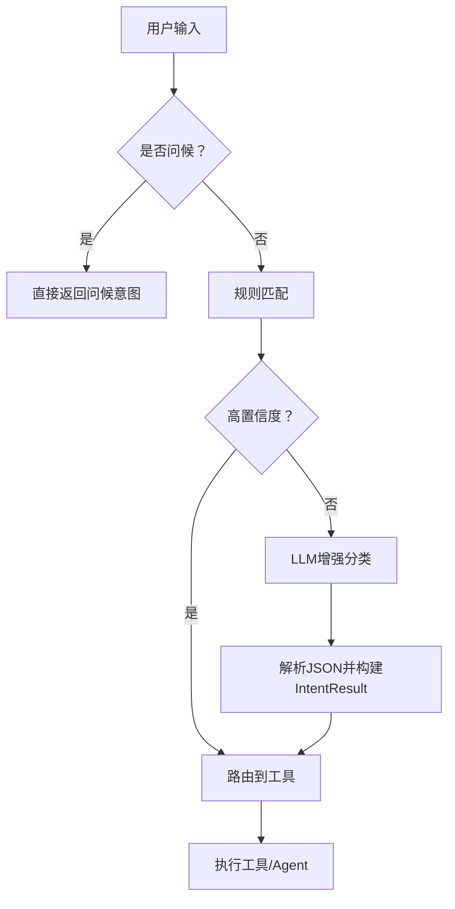
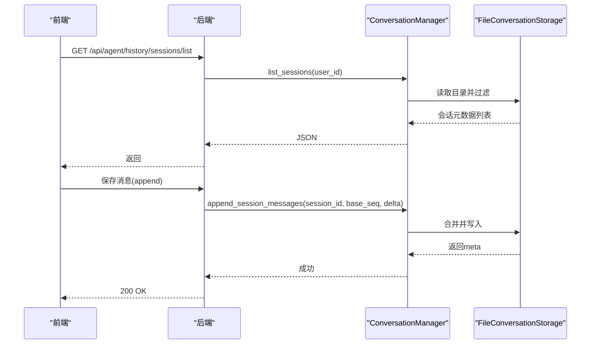
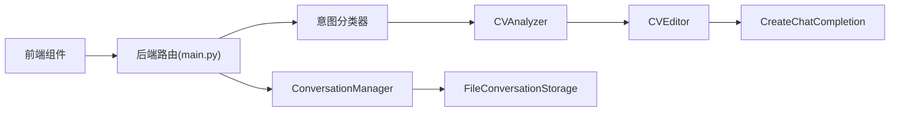

# AI增强功能

<cite>
**本文引用的文件**
- [backend/main.py](file://backend/main.py)
- [backend/agent/agent/base.py](file://backend/agent/agent/base.py)
- [backend/agent/agent/cv_editor.py](file://backend/agent/agent/cv_editor.py)
- [backend/agent/agent/cv_analyzer.py](file://backend/agent/agent/cv_analyzer.py)
- [backend/agent/agent/resume_optimizer.py](file://backend/agent/agent/resume_optimizer.py)
- [backend/agent/tool/create_chat_completion.py](file://backend/agent/tool/create_chat_completion.py)
- [backend/agent/domain/intent/intent_classifier.py](file://backend/agent/domain/intent/intent_classifier.py)
- [backend/agent/memory/conversation_manager.py](file://backend/agent/memory/conversation_manager.py)
- [backend/agent/cltp/storage/conversation_storage.py](file://backend/agent/cltp/storage/conversation_storage.py)
- [frontend/src/pages/AgentChat/SophiaChat.tsx](file://frontend/src/pages/AgentChat/SophiaChat.tsx)
- [frontend/src/components/common/AIImportButton.tsx](file://frontend/src/components/common/AIImportButton.tsx)
- [frontend/src/components/agent-chat/Composer.tsx](file://frontend/src/components/agent-chat/Composer.tsx)
- [frontend/src/hooks/agent-chat/useMessageSubmission.ts](file://frontend/src/hooks/agent-chat/useMessageSubmission.ts)
</cite>

## 目录
1. [简介](#简介)
2. [项目结构](#项目结构)
3. [核心组件](#核心组件)
4. [架构总览](#架构总览)
5. [详细组件分析](#详细组件分析)
6. [依赖关系分析](#依赖关系分析)
7. [性能考量](#性能考量)
8. [故障排除指南](#故障排除指南)
9. [结论](#结论)
10. [附录](#附录)

## 简介
本文件面向“AI增强功能”的综合技术文档，聚焦以下能力：
- AI导入：通过上传PDF/文本文件或粘贴简历内容，自动解析并生成可编辑的简历数据。
- 智能润色：对简历内容进行结构化优化与建议生成，支持按模块优先级推进。
- AI写作：以流式对话形式生成或改写简历段落，结合工具调用与上下文记忆。
- JD匹配：通过意图识别与工具系统，将用户需求映射到具体工具链路（如简历分析、优化建议等）。

同时，文档覆盖AI助手聊天对话框设计、对话历史管理与上下文保持机制、触发方式、参数配置与结果处理，并提供使用指南、最佳实践与故障排除建议。

## 项目结构
该功能横跨前端与后端两大侧，前端负责用户交互与流式渲染，后端负责意图识别、工具编排、对话历史持久化与模型调用。



图表来源
- [backend/main.py:106-138](file://backend/main.py#L106-L138)
- [backend/agent/domain/intent/intent_classifier.py:132-188](file://backend/agent/domain/intent/intent_classifier.py#L132-L188)
- [backend/agent/agent/cv_analyzer.py:101-122](file://backend/agent/agent/cv_analyzer.py#L101-L122)
- [backend/agent/agent/cv_editor.py:243-265](file://backend/agent/agent/cv_editor.py#L243-L265)
- [backend/agent/tool/create_chat_completion.py:130-170](file://backend/agent/tool/create_chat_completion.py#L130-L170)
- [backend/agent/memory/conversation_manager.py:12-68](file://backend/agent/memory/conversation_manager.py#L12-L68)
- [backend/agent/cltp/storage/conversation_storage.py:102-148](file://backend/agent/cltp/storage/conversation_storage.py#L102-L148)

章节来源
- [backend/main.py:93-138](file://backend/main.py#L93-L138)
- [frontend/src/pages/AgentChat/SophiaChat.tsx:498-503](file://frontend/src/pages/AgentChat/SophiaChat.tsx#L498-L503)

## 核心组件
- BaseAgent：抽象基类，提供状态机、内存管理、重复检测与终止处理，支撑所有AI Agent的统一执行框架。
- CVAnalyzer：简历分析协调者，聚合模块分析结果，输出结构化报告与优化建议。
- CVEditor：简历编辑Agent，支持更新、新增、删除简历字段，提供JSON路径操作与工具调用。
- 意图分类器：两阶段分类（规则+LLM增强），将用户输入映射到具体工具链路。
- 对话历史管理：会话生命周期管理、消息持久化、标题派生与导出。
- 前端聊天界面：SSE驱动的流式输出、语音输入、附件上传、简历预览与Diff渲染。

章节来源
- [backend/agent/agent/base.py:15-199](file://backend/agent/agent/base.py#L15-L199)
- [backend/agent/agent/cv_analyzer.py:26-122](file://backend/agent/agent/cv_analyzer.py#L26-L122)
- [backend/agent/agent/cv_editor.py:45-265](file://backend/agent/agent/cv_editor.py#L45-L265)
- [backend/agent/domain/intent/intent_classifier.py:50-332](file://backend/agent/domain/intent/intent_classifier.py#L50-L332)
- [backend/agent/memory/conversation_manager.py:12-146](file://backend/agent/memory/conversation_manager.py#L12-L146)
- [backend/agent/cltp/storage/conversation_storage.py:40-333](file://backend/agent/cltp/storage/conversation_storage.py#L40-L333)

## 架构总览
AI增强功能采用“前端交互 + 后端意图识别 + 工具编排 + 历史持久化”的分层架构。前端通过SSE接收流式响应，后端通过意图分类器将用户输入路由到合适的Agent，Agent内部通过工具集合执行具体任务，并将结果以结构化事件形式返回前端。



图表来源
- [backend/main.py:106-138](file://backend/main.py#L106-L138)
- [backend/agent/domain/intent/intent_classifier.py:132-188](file://backend/agent/domain/intent/intent_classifier.py#L132-L188)
- [backend/agent/agent/cv_analyzer.py:101-122](file://backend/agent/agent/cv_analyzer.py#L101-L122)
- [backend/agent/agent/cv_editor.py:243-265](file://backend/agent/agent/cv_editor.py#L243-L265)
- [backend/agent/tool/create_chat_completion.py:130-170](file://backend/agent/tool/create_chat_completion.py#L130-L170)
- [backend/agent/memory/conversation_manager.py:55-68](file://backend/agent/memory/conversation_manager.py#L55-L68)
- [backend/agent/cltp/storage/conversation_storage.py:102-148](file://backend/agent/cltp/storage/conversation_storage.py#L102-L148)

## 详细组件分析

### AI导入（PDF/文本/粘贴）
- 触发方式
  - 附件上传：支持PDF、文本、Markdown、JSON、CSV，前端自动解析并生成可编辑简历。
  - 粘贴导入：识别类似简历的文本片段，自动抽取正文并交由后端解析。
  - AI智能导入按钮：快捷入口，引导用户进行AI辅助导入。
- 参数配置
  - 上传类型限制：.pdf/.txt/.md/.json/.csv。
  - 文本截断：超过阈值自动截断，避免超长内容影响性能。
  - 本地预览：上传后立即展示PDF预览，提升反馈速度。
- 结果处理
  - 解析成功：标准化为简历数据结构，支持保存与后续编辑。
  - 解析失败：保留原始PDF，提示未解析出结构化内容。
- 关键实现
  - 前端提交与解析：见 useMessageSubmission 的附件处理与发送逻辑。
  - 前端UI：Composer 组件支持文件选择、预览与发送。
  - 前端入口：AIImportButton 提供一键触发。



图表来源
- [frontend/src/hooks/agent-chat/useMessageSubmission.ts:76-222](file://frontend/src/hooks/agent-chat/useMessageSubmission.ts#L76-L222)
- [frontend/src/components/agent-chat/Composer.tsx:57-62](file://frontend/src/components/agent-chat/Composer.tsx#L57-L62)
- [frontend/src/components/common/AIImportButton.tsx:12-36](file://frontend/src/components/common/AIImportButton.tsx#L12-L36)

章节来源
- [frontend/src/hooks/agent-chat/useMessageSubmission.ts:76-222](file://frontend/src/hooks/agent-chat/useMessageSubmission.ts#L76-L222)
- [frontend/src/components/agent-chat/Composer.tsx:57-62](file://frontend/src/components/agent-chat/Composer.tsx#L57-L62)
- [frontend/src/components/common/AIImportButton.tsx:12-36](file://frontend/src/components/common/AIImportButton.tsx#L12-L36)

### 智能润色（简历分析与优化建议）
- 触发方式
  - 用户输入“分析简历”或“优化XX模块”，由意图分类器识别并路由到CVAnalyzer。
- 处理流程
  - CVAnalyzer加载简历上下文，调用各模块分析工具，聚合结果并按优先级排序。
  - 生成结构化报告与优化建议，支持ResumeOptimizerAgent进一步生成可应用的路径。
- 关键实现
  - CVAnalyzer：负责协调与聚合，输出top优先模块与建议。
  - ResumeOptimizerAgent：将分析结果转换为可应用的优化建议，生成apply_path。
  - CVEditor：执行具体字段更新/新增/删除，配合JSON路径操作。

```mermaid
sequenceDiagram
participant U as "用户"
participant FE as "前端"
participant INT as "意图分类器"
participant ANA as "CVAnalyzer"
participant OPT as "ResumeOptimizerAgent"
participant EDIT as "CVEditor"
U->>FE : 输入“分析简历”
FE->>INT : classify()
INT-->>FE : 工具链路(分析)
FE->>ANA : 执行分析
ANA-->>OPT : 聚合结果
OPT-->>FE : 优化建议(含apply_path)
U->>FE : 选择某条建议
FE->>EDIT : 执行编辑(路径+值)
EDIT-->>FE : 更新后的简历
```

图表来源
- [backend/agent/domain/intent/intent_classifier.py:132-188](file://backend/agent/domain/intent/intent_classifier.py#L132-L188)
- [backend/agent/agent/cv_analyzer.py:124-167](file://backend/agent/agent/cv_analyzer.py#L124-L167)
- [backend/agent/agent/resume_optimizer.py:16-62](file://backend/agent/agent/resume_optimizer.py#L16-L62)
- [backend/agent/agent/cv_editor.py:116-154](file://backend/agent/agent/cv_editor.py#L116-L154)

章节来源
- [backend/agent/agent/cv_analyzer.py:65-122](file://backend/agent/agent/cv_analyzer.py#L65-L122)
- [backend/agent/agent/resume_optimizer.py:16-62](file://backend/agent/agent/resume_optimizer.py#L16-L62)
- [backend/agent/agent/cv_editor.py:116-154](file://backend/agent/agent/cv_editor.py#L116-L154)

### AI写作（流式对话与工具调用）
- 触发方式
  - 用户输入自然语言指令，前端通过SSE接收流式输出。
- 处理流程
  - BaseAgent提供统一的状态机与内存管理，防止重复与卡死。
  - CreateChatCompletion工具支持结构化输出与类型转换，便于前端渲染。
- 关键实现
  - BaseAgent.run/step：执行循环、状态切换、重复检测与错误回滚。
  - CreateChatCompletion：根据response_type生成JSON Schema并进行类型转换。



图表来源
- [backend/agent/agent/base.py:118-156](file://backend/agent/agent/base.py#L118-L156)
- [backend/agent/agent/base.py:172-188](file://backend/agent/agent/base.py#L172-L188)
- [backend/agent/tool/create_chat_completion.py:130-170](file://backend/agent/tool/create_chat_completion.py#L130-L170)

章节来源
- [backend/agent/agent/base.py:118-156](file://backend/agent/agent/base.py#L118-L156)
- [backend/agent/tool/create_chat_completion.py:130-170](file://backend/agent/tool/create_chat_completion.py#L130-L170)

### JD匹配对话框（意图识别与工具路由）
- 设计要点
  - 两阶段分类：规则快速匹配 + LLM增强分类，兼顾性能与准确性。
  - 高置信度直接执行，低置信度回退到规则或提示通用对话。
- 实现细节
  - IntentClassifier：构建工具摘要、构造提示词、解析LLM JSON响应。
  - ToolCollection：封装可用工具集合，支持Terminate等特殊工具。
  - 前端：SophiaChat根据会话ID与历史消息，动态引导用户下一步操作。



图表来源
- [backend/agent/domain/intent/intent_classifier.py:132-188](file://backend/agent/domain/intent/intent_classifier.py#L132-L188)
- [backend/agent/domain/intent/intent_classifier.py:236-316](file://backend/agent/domain/intent/intent_classifier.py#L236-L316)

章节来源
- [backend/agent/domain/intent/intent_classifier.py:50-332](file://backend/agent/domain/intent/intent_classifier.py#L50-L332)
- [frontend/src/pages/AgentChat/SophiaChat.tsx:636-717](file://frontend/src/pages/AgentChat/SophiaChat.tsx#L636-L717)

### 对话历史管理与上下文保持
- 会话生命周期
  - 列表：按用户维度列出最近会话，支持分页与筛选。
  - 加载：根据session_id加载历史消息，注入Agent内存。
  - 保存：增量追加消息，支持冲突检测与序列校验。
  - 删除：支持单个/批量/全部删除，权限控制。
- 存储实现
  - FileConversationStorage：基于文件的会话存储，支持导出为JSON/Markdown。
  - ConversationManager：封装存储接口，提供统一的CRUD与导出能力。



图表来源
- [backend/agent/memory/conversation_manager.py:23-68](file://backend/agent/memory/conversation_manager.py#L23-L68)
- [backend/agent/cltp/storage/conversation_storage.py:166-185](file://backend/agent/cltp/storage/conversation_storage.py#L166-L185)
- [backend/agent/cltp/storage/conversation_storage.py:274-332](file://backend/agent/cltp/storage/conversation_storage.py#L274-L332)

章节来源
- [backend/agent/memory/conversation_manager.py:12-146](file://backend/agent/memory/conversation_manager.py#L12-L146)
- [backend/agent/cltp/storage/conversation_storage.py:40-333](file://backend/agent/cltp/storage/conversation_storage.py#L40-L333)

## 依赖关系分析
- 前端依赖后端API与SSE通道，负责渲染与交互；后端通过意图分类器与Agent体系完成业务编排。
- 对话历史通过文件存储持久化，支持导出与权限校验，避免会话丢失。
- 工具链路围绕BaseAgent与ToolCollection展开，确保可扩展性与一致性。



图表来源
- [backend/main.py:106-138](file://backend/main.py#L106-L138)
- [backend/agent/domain/intent/intent_classifier.py:132-188](file://backend/agent/domain/intent/intent_classifier.py#L132-L188)
- [backend/agent/agent/cv_analyzer.py:101-122](file://backend/agent/agent/cv_analyzer.py#L101-L122)
- [backend/agent/agent/cv_editor.py:243-265](file://backend/agent/agent/cv_editor.py#L243-L265)
- [backend/agent/tool/create_chat_completion.py:130-170](file://backend/agent/tool/create_chat_completion.py#L130-L170)
- [backend/agent/memory/conversation_manager.py:55-68](file://backend/agent/memory/conversation_manager.py#L55-L68)
- [backend/agent/cltp/storage/conversation_storage.py:102-148](file://backend/agent/cltp/storage/conversation_storage.py#L102-L148)

章节来源
- [backend/main.py:93-138](file://backend/main.py#L93-L138)
- [backend/agent/agent/base.py:15-199](file://backend/agent/agent/base.py#L15-L199)

## 性能考量
- 启动优化
  - 预热HTTP连接、数据库连接与tiktoken编码文件，降低首次请求延迟。
- 流式输出
  - SSE逐块推送，前端即时渲染，减少等待时间。
- 上传与解析
  - 本地预览与异步解析，避免阻塞主线程。
- 会话并发
  - 基于文件的会话存储支持并发读写，冲突检测与序列校验保障一致性。

章节来源
- [backend/main.py:228-315](file://backend/main.py#L228-L315)
- [frontend/src/hooks/agent-chat/useMessageSubmission.ts:106-112](file://frontend/src/hooks/agent-chat/useMessageSubmission.ts#L106-L112)
- [backend/agent/cltp/storage/conversation_storage.py:274-332](file://backend/agent/cltp/storage/conversation_storage.py#L274-L332)

## 故障排除指南
- 会话历史不可用
  - 现象：历史接口返回404或无法加载。
  - 排查：确认后端路由已注册，文件存储目录存在且可读写。
- 上传失败
  - 现象：PDF/文本上传后解析失败。
  - 排查：检查文件类型与大小限制，查看后端日志与前端错误提示。
- 会话冲突
  - 现象：保存消息时报冲突或期望的base_seq不一致。
  - 排查：确认前端消息序列与后端预期一致，避免并发写入冲突。
- 意图识别异常
  - 现象：LLM分类失败回退到规则。
  - 排查：检查LLM客户端可用性与提示词格式，必要时调整阈值。

章节来源
- [backend/agent/cltp/storage/conversation_storage.py:187-203](file://backend/agent/cltp/storage/conversation_storage.py#L187-L203)
- [frontend/src/hooks/agent-chat/useMessageSubmission.ts:223-231](file://frontend/src/hooks/agent-chat/useMessageSubmission.ts#L223-L231)
- [backend/agent/domain/intent/intent_classifier.py:172-182](file://backend/agent/domain/intent/intent_classifier.py#L172-L182)

## 结论
本AI增强功能通过清晰的前后端分工、意图识别与工具编排、以及完善的对话历史管理，实现了从“AI导入”到“智能润色”再到“AI写作”的闭环体验。其模块化设计便于扩展与维护，SSE流式输出与本地预览显著提升了交互效率与稳定性。

## 附录
- 使用指南
  - AI导入：点击“AI智能导入”或直接上传PDF/文本，等待解析与预览。
  - 智能润色：输入“分析简历”或“优化XX模块”，按建议逐步改进。
  - AI写作：直接提问，AI将以流式方式输出并支持工具调用。
- 最佳实践
  - 优先使用结构化数据（JSON/CSV）以便更准确解析。
  - 在长文本场景下，建议拆分为多个简短指令，提高意图识别准确率。
  - 定期导出会话历史，避免本地缓存丢失。
- 故障排除
  - 若出现解析失败，尝试更换文件格式或精简内容。
  - 若会话异常，检查文件存储权限与磁盘空间。