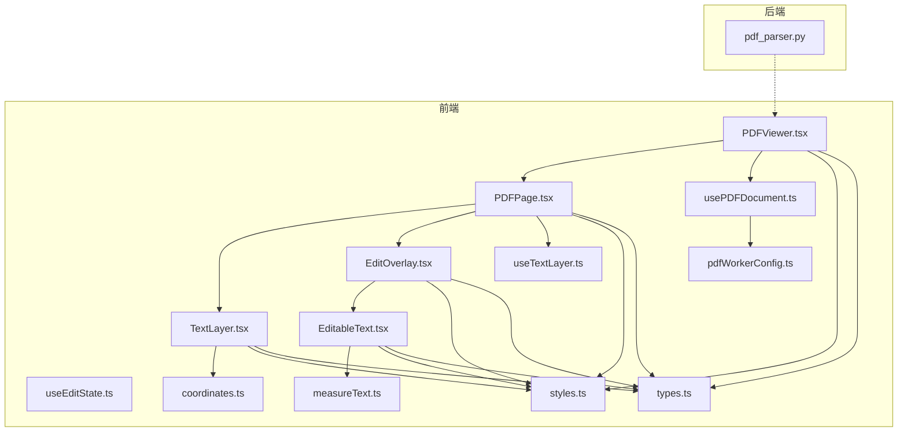
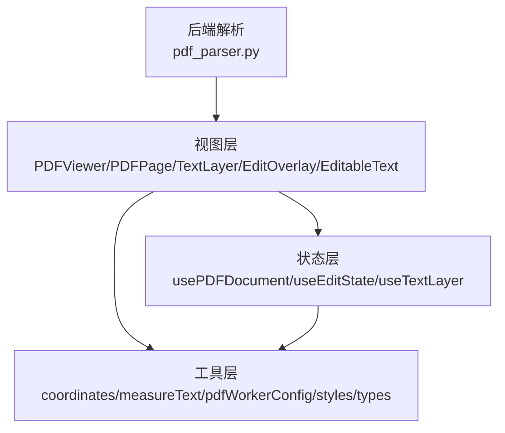
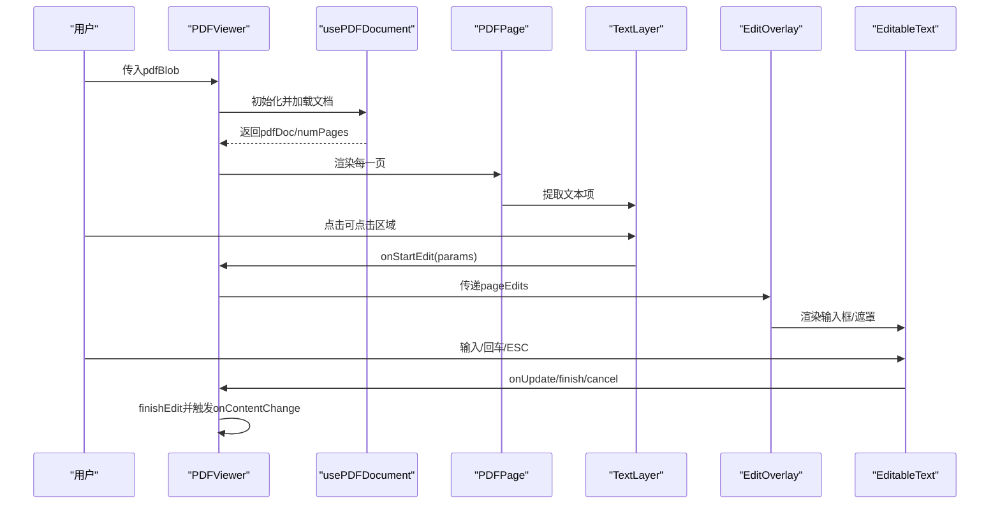
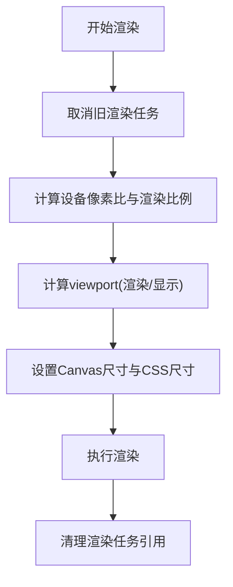
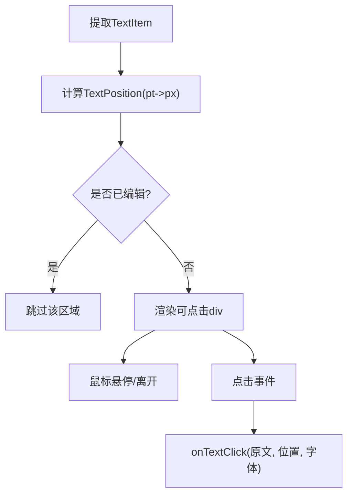
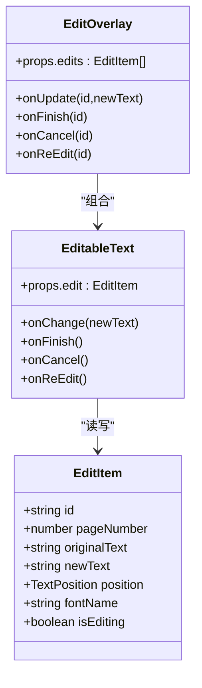
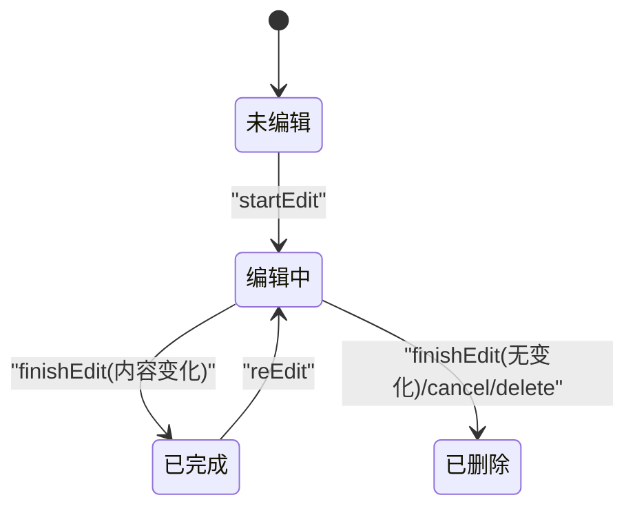
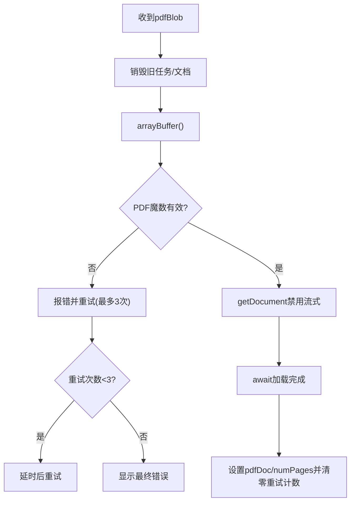
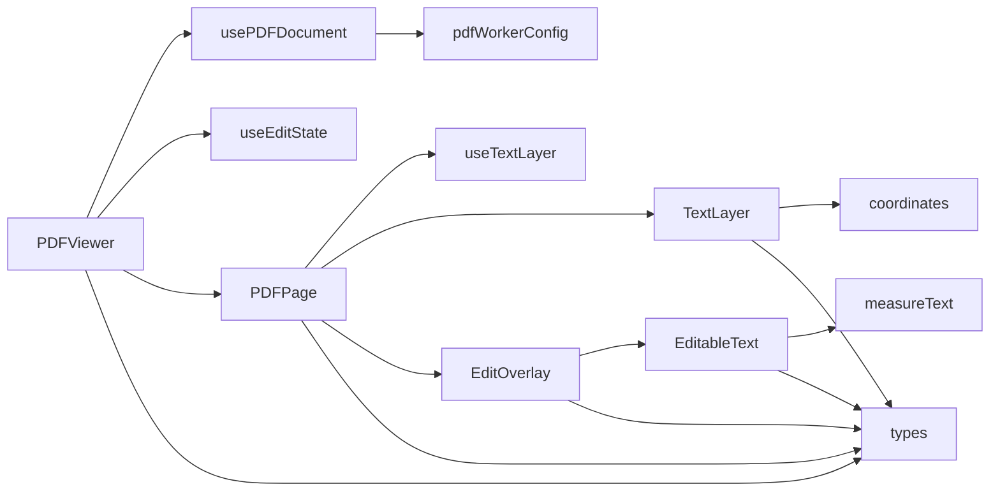

# PDF编辑器

<cite>
**本文引用的文件**
- [PDFViewer.tsx](file://frontend/src/components/PDFEditor/PDFViewer.tsx)
- [PDFPage.tsx](file://frontend/src/components/PDFEditor/PDFPage.tsx)
- [TextLayer.tsx](file://frontend/src/components/PDFEditor/TextLayer.tsx)
- [EditOverlay.tsx](file://frontend/src/components/PDFEditor/EditOverlay.tsx)
- [EditableText.tsx](file://frontend/src/components/PDFEditor/EditableText.tsx)
- [usePDFDocument.ts](file://frontend/src/components/PDFEditor/hooks/usePDFDocument.ts)
- [useEditState.ts](file://frontend/src/components/PDFEditor/hooks/useEditState.ts)
- [useTextLayer.ts](file://frontend/src/components/PDFEditor/hooks/useTextLayer.ts)
- [coordinates.ts](file://frontend/src/components/PDFEditor/utils/coordinates.ts)
- [measureText.ts](file://frontend/src/components/PDFEditor/utils/measureText.ts)
- [styles.ts](file://frontend/src/components/PDFEditor/styles.ts)
- [pdfWorkerConfig.ts](file://frontend/src/components/PDFEditor/pdfWorkerConfig.ts)
- [types.ts](file://frontend/src/components/PDFEditor/types.ts)
- [pdf_parser.py](file://backend/services/pdf_parser.py)
</cite>

## 目录
1. [简介](#简介)
2. [项目结构](#项目结构)
3. [核心组件](#核心组件)
4. [架构总览](#架构总览)
5. [详细组件分析](#详细组件分析)
6. [依赖关系分析](#依赖关系分析)
7. [性能考量](#性能考量)
8. [故障排查指南](#故障排查指南)
9. [结论](#结论)
10. [附录](#附录)

## 简介
本技术文档面向PDF编辑器的前端实现，围绕PDF查看器的核心架构、文本层渲染机制、编辑覆盖层设计展开，系统阐述坐标系统转换、文本选择算法、编辑操作实现原理，并补充文档加载、页面渲染、缩放控制与滚动同步、文本编辑与拖拽交互、实时更新机制、性能优化策略、内存管理与错误恢复，以及扩展性与自定义能力。文档同时结合后端PDF解析服务，给出前后端协同的完整视图。

## 项目结构
PDF编辑器位于前端组件库中，采用分层与职责分离的组织方式：
- 视图层：PDFViewer、PDFPage、TextLayer、EditOverlay、EditableText
- 数据与状态：usePDFDocument、useEditState、useTextLayer
- 工具与样式：coordinates、measureText、styles、pdfWorkerConfig、types
- 后端解析：pdf_parser.py

图表来源
- [PDFViewer.tsx:1-177](file://frontend/src/components/PDFEditor/PDFViewer.tsx#L1-L177)
- [PDFPage.tsx:1-181](file://frontend/src/components/PDFEditor/PDFPage.tsx#L1-L181)
- [TextLayer.tsx:1-79](file://frontend/src/components/PDFEditor/TextLayer.tsx#L1-L79)
- [EditOverlay.tsx:1-41](file://frontend/src/components/PDFEditor/EditOverlay.tsx#L1-L41)
- [EditableText.tsx:1-169](file://frontend/src/components/PDFEditor/EditableText.tsx#L1-L169)
- [usePDFDocument.ts:1-129](file://frontend/src/components/PDFEditor/hooks/usePDFDocument.ts#L1-L129)
- [useEditState.ts:1-168](file://frontend/src/components/PDFEditor/hooks/useEditState.ts#L1-L168)
- [useTextLayer.ts:1-66](file://frontend/src/components/PDFEditor/hooks/useTextLayer.ts#L1-L66)
- [coordinates.ts:1-90](file://frontend/src/components/PDFEditor/utils/coordinates.ts#L1-L90)
- [measureText.ts:1-54](file://frontend/src/components/PDFEditor/utils/measureText.ts#L1-L54)
- [styles.ts:1-120](file://frontend/src/components/PDFEditor/styles.ts#L1-L120)
- [pdfWorkerConfig.ts:1-45](file://frontend/src/components/PDFEditor/pdfWorkerConfig.ts#L1-L45)
- [types.ts:1-72](file://frontend/src/components/PDFEditor/types.ts#L1-L72)
- [pdf_parser.py:1-89](file://backend/services/pdf_parser.py#L1-L89)

章节来源
- [PDFViewer.tsx:1-177](file://frontend/src/components/PDFEditor/PDFViewer.tsx#L1-L177)
- [PDFPage.tsx:1-181](file://frontend/src/components/PDFEditor/PDFPage.tsx#L1-L181)
- [TextLayer.tsx:1-79](file://frontend/src/components/PDFEditor/TextLayer.tsx#L1-L79)
- [EditOverlay.tsx:1-41](file://frontend/src/components/PDFEditor/EditOverlay.tsx#L1-L41)
- [EditableText.tsx:1-169](file://frontend/src/components/PDFEditor/EditableText.tsx#L1-L169)
- [usePDFDocument.ts:1-129](file://frontend/src/components/PDFEditor/hooks/usePDFDocument.ts#L1-L129)
- [useEditState.ts:1-168](file://frontend/src/components/PDFEditor/hooks/useEditState.ts#L1-L168)
- [useTextLayer.ts:1-66](file://frontend/src/components/PDFEditor/hooks/useTextLayer.ts#L1-L66)
- [coordinates.ts:1-90](file://frontend/src/components/PDFEditor/utils/coordinates.ts#L1-L90)
- [measureText.ts:1-54](file://frontend/src/components/PDFEditor/utils/measureText.ts#L1-L54)
- [styles.ts:1-120](file://frontend/src/components/PDFEditor/styles.ts#L1-L120)
- [pdfWorkerConfig.ts:1-45](file://frontend/src/components/PDFEditor/pdfWorkerConfig.ts#L1-L45)
- [types.ts:1-72](file://frontend/src/components/PDFEditor/types.ts#L1-L72)
- [pdf_parser.py:1-89](file://backend/services/pdf_parser.py#L1-L89)

## 核心组件
- PDFViewer：聚合文档加载、页面列表渲染、编辑状态传递与变更回调
- PDFPage：单页渲染（Canvas底图）、TextLayer可点击文本、EditOverlay编辑覆盖层
- TextLayer：基于PDF.js文本提取结果，构建可点击区域，避免重复编辑
- EditOverlay：承载当前页所有编辑项，协调编辑生命周期
- EditableText：输入框/遮罩渲染，动态宽度与精确定位
- Hooks：usePDFDocument（文档加载/重试/销毁）、useEditState（编辑状态机）、useTextLayer（文本提取）
- 工具：坐标转换（pt/px、PDF坐标系到屏幕）、文字宽度测量、Worker配置、样式常量
- 类型：TextItem、TextPosition、EditItem、PageData、EditorState、CachedPage、PDFEditorProps

章节来源
- [PDFViewer.tsx:14-177](file://frontend/src/components/PDFEditor/PDFViewer.tsx#L14-L177)
- [PDFPage.tsx:31-181](file://frontend/src/components/PDFEditor/PDFPage.tsx#L31-L181)
- [TextLayer.tsx:19-79](file://frontend/src/components/PDFEditor/TextLayer.tsx#L19-L79)
- [EditOverlay.tsx:19-41](file://frontend/src/components/PDFEditor/EditOverlay.tsx#L19-L41)
- [EditableText.tsx:23-169](file://frontend/src/components/PDFEditor/EditableText.tsx#L23-L169)
- [usePDFDocument.ts:24-129](file://frontend/src/components/PDFEditor/hooks/usePDFDocument.ts#L24-L129)
- [useEditState.ts:31-168](file://frontend/src/components/PDFEditor/hooks/useEditState.ts#L31-L168)
- [useTextLayer.ts:16-66](file://frontend/src/components/PDFEditor/hooks/useTextLayer.ts#L16-L66)
- [coordinates.ts:30-90](file://frontend/src/components/PDFEditor/utils/coordinates.ts#L30-L90)
- [measureText.ts:28-54](file://frontend/src/components/PDFEditor/utils/measureText.ts#L28-L54)
- [styles.ts:6-120](file://frontend/src/components/PDFEditor/styles.ts#L6-L120)
- [types.ts:7-72](file://frontend/src/components/PDFEditor/types.ts#L7-L72)

## 架构总览
PDF编辑器采用“视图-状态-工具”三层架构：
- 视图层负责UI组合与事件分发
- 状态层通过React Hooks集中管理编辑状态与页面数据
- 工具层提供坐标转换、文本测量、Worker配置等基础能力
- 后端解析服务提供PDF文本抽取能力，供编辑器或下游流程使用

图表来源
- [PDFViewer.tsx:14-177](file://frontend/src/components/PDFEditor/PDFViewer.tsx#L14-L177)
- [PDFPage.tsx:31-181](file://frontend/src/components/PDFEditor/PDFPage.tsx#L31-L181)
- [usePDFDocument.ts:24-129](file://frontend/src/components/PDFEditor/hooks/usePDFDocument.ts#L24-L129)
- [useEditState.ts:31-168](file://frontend/src/components/PDFEditor/hooks/useEditState.ts#L31-L168)
- [useTextLayer.ts:16-66](file://frontend/src/components/PDFEditor/hooks/useTextLayer.ts#L16-L66)
- [coordinates.ts:30-90](file://frontend/src/components/PDFEditor/utils/coordinates.ts#L30-L90)
- [measureText.ts:28-54](file://frontend/src/components/PDFEditor/utils/measureText.ts#L28-L54)
- [pdfWorkerConfig.ts:41-45](file://frontend/src/components/PDFEditor/pdfWorkerConfig.ts#L41-L45)
- [pdf_parser.py:71-89](file://backend/services/pdf_parser.py#L71-L89)

## 详细组件分析

### PDFViewer：文档加载与页面调度
- 职责：接收pdfBlob，加载PDF文档，维护页面数组，传递缩放与编辑状态给子组件；在内容变更时回调通知父组件
- 关键点：
  - 依赖usePDFDocument进行文档加载与重试
  - 依赖useEditState管理全局编辑状态
  - 页面加载完成后批量获取各页PDFPageProxy
  - 错误/加载/空状态统一渲染
- 事件链路：用户点击TextLayer触发onStartEdit → 更新useEditState → EditOverlay渲染EditableText → 用户确认/取消 → finishEdit/cancelEdit → 回调onContentChange

图表来源
- [PDFViewer.tsx:19-68](file://frontend/src/components/PDFEditor/PDFViewer.tsx#L19-L68)
- [usePDFDocument.ts:24-129](file://frontend/src/components/PDFEditor/hooks/usePDFDocument.ts#L24-L129)
- [PDFPage.tsx:132-143](file://frontend/src/components/PDFEditor/PDFPage.tsx#L132-L143)
- [TextLayer.tsx:41-46](file://frontend/src/components/PDFEditor/TextLayer.tsx#L41-L46)
- [EditOverlay.tsx:19-41](file://frontend/src/components/PDFEditor/EditOverlay.tsx#L19-L41)
- [EditableText.tsx:69-92](file://frontend/src/components/PDFEditor/EditableText.tsx#L69-L92)

章节来源
- [PDFViewer.tsx:14-177](file://frontend/src/components/PDFEditor/PDFViewer.tsx#L14-L177)
- [usePDFDocument.ts:24-129](file://frontend/src/components/PDFEditor/hooks/usePDFDocument.ts#L24-L129)

### PDFPage：页面渲染与层级组织
- 职责：渲染Canvas底图，设置viewport与设备像素比，计算显示尺寸；组合TextLayer与EditOverlay
- 关键点：
  - 渲染前取消旧任务，避免并发冲突
  - 设备像素比与移动端渲染质量折中
  - 保存原始viewport高度用于坐标转换
  - 将文本点击事件转为编辑启动事件

图表来源
- [PDFPage.tsx:48-129](file://frontend/src/components/PDFEditor/PDFPage.tsx#L48-L129)

章节来源
- [PDFPage.tsx:31-181](file://frontend/src/components/PDFEditor/PDFPage.tsx#L31-L181)

### TextLayer：文本选择与点击区域
- 职责：基于PDF.js文本项构建可点击区域，避免对已编辑文本重复触发
- 关键点：
  - 使用calculateTextPosition将PDF坐标转换为屏幕像素
  - hover态视觉反馈
  - 简单碰撞检测避免重复编辑
  - 点击回调触发编辑启动

图表来源
- [TextLayer.tsx:29-76](file://frontend/src/components/PDFEditor/TextLayer.tsx#L29-L76)
- [coordinates.ts:30-71](file://frontend/src/components/PDFEditor/utils/coordinates.ts#L30-L71)

章节来源
- [TextLayer.tsx:19-79](file://frontend/src/components/PDFEditor/TextLayer.tsx#L19-L79)
- [coordinates.ts:30-71](file://frontend/src/components/PDFEditor/utils/coordinates.ts#L30-L71)

### EditOverlay与EditableText：编辑覆盖层与输入控件
- 职责：EditOverlay聚合当前页编辑项；EditableText负责输入框/遮罩渲染、动态宽度、键盘与失焦处理、重新编辑
- 关键点：
  - 动态宽度：measureTextWidth按内容实时计算，取原宽与新宽的最大值，确保遮盖原文
  - 精确定位：考虑边框与内边距补偿，高度增加以覆盖中文延伸
  - 生命周期：startEdit→isEditing=true→输入→Enter/Blur完成→finishEdit→非编辑态显示遮罩
  - 重新编辑：点击遮罩进入编辑态

图表来源
- [EditOverlay.tsx:19-41](file://frontend/src/components/PDFEditor/EditOverlay.tsx#L19-L41)
- [EditableText.tsx:23-169](file://frontend/src/components/PDFEditor/EditableText.tsx#L23-L169)
- [types.ts:28-36](file://frontend/src/components/PDFEditor/types.ts#L28-L36)

章节来源
- [EditOverlay.tsx:19-41](file://frontend/src/components/PDFEditor/EditOverlay.tsx#L19-L41)
- [EditableText.tsx:23-169](file://frontend/src/components/PDFEditor/EditableText.tsx#L23-L169)
- [types.ts:28-36](file://frontend/src/components/PDFEditor/types.ts#L28-L36)

### useEditState：编辑状态机
- 职责：维护Map结构的编辑项集合，提供start/update/finish/cancel/reEdit/clearAll/getPageEdits等操作
- 关键点：
  - 生成唯一ID，初始newText=originalText
  - finish时若内容无变化则删除，否则标记为完成态
  - reEdit切换isEditing并激活对应ID

图表来源
- [useEditState.ts:38-147](file://frontend/src/components/PDFEditor/hooks/useEditState.ts#L38-L147)

章节来源
- [useEditState.ts:31-168](file://frontend/src/components/PDFEditor/hooks/useEditState.ts#L31-L168)

### usePDFDocument：文档加载与重试
- 职责：初始化PDF.js Worker，加载PDF文档，校验文件头，支持重试与取消
- 关键点：
  - 最多重试3次，指数退避延迟
  - 禁用流式处理，一次性加载，提升稳定性
  - 校验PDF魔数，避免无效文件
  - 销毁旧任务与文档，释放资源

图表来源
- [usePDFDocument.ts:48-115](file://frontend/src/components/PDFEditor/hooks/usePDFDocument.ts#L48-L115)
- [pdfWorkerConfig.ts:41-45](file://frontend/src/components/PDFEditor/pdfWorkerConfig.ts#L41-L45)

章节来源
- [usePDFDocument.ts:24-129](file://frontend/src/components/PDFEditor/hooks/usePDFDocument.ts#L24-L129)
- [pdfWorkerConfig.ts:41-45](file://frontend/src/components/PDFEditor/pdfWorkerConfig.ts#L41-L45)

### useTextLayer：文本提取
- 职责：从PDF页面提取文本内容与位置信息，过滤空白项，标准化字段
- 关键点：
  - getTextContent异步提取
  - 过滤空字符串与缺失字段
  - 输出TextItem数组供TextLayer使用

章节来源
- [useTextLayer.ts:16-66](file://frontend/src/components/PDFEditor/hooks/useTextLayer.ts#L16-L66)

### 坐标系统与文本测量
- 坐标转换：
  - ptToPx/pxToPt：96 DPI换算
  - calculateTextPosition：从transform矩阵提取left/top/width/height，注意PDF坐标原点在左下，需转换为顶部
  - hexToPdfRgb：颜色空间转换
  - generateId：唯一ID生成
- 文本测量：
  - measureTextWidth：使用Canvas上下文精确测量，缓存上下文实例，fallback粗估
- 样式：
  - editorStyles：统一容器、滚动区、页面容器、Canvas、TextLayer、编辑覆盖层、可点击文本、输入框、加载态与工具提示样式

章节来源
- [coordinates.ts:14-90](file://frontend/src/components/PDFEditor/utils/coordinates.ts#L14-L90)
- [measureText.ts:28-54](file://frontend/src/components/PDFEditor/utils/measureText.ts#L28-L54)
- [styles.ts:6-120](file://frontend/src/components/PDFEditor/styles.ts#L6-L120)

### 后端PDF解析服务
- 能力：优先使用MinerU进行高质量解析，失败时降级到pdfminer
- 关键点：
  - 支持表格/公式/布局识别输出Markdown
  - 环境变量控制后端与解析方法、语言
  - 输出目录临时管理与清理

章节来源
- [pdf_parser.py:71-89](file://backend/services/pdf_parser.py#L71-L89)

## 依赖关系分析
- 组件耦合：
  - PDFViewer依赖usePDFDocument与useEditState，向下传递props
  - PDFPage依赖useTextLayer，组合TextLayer与EditOverlay
  - EditOverlay依赖EditableText
  - TextLayer依赖coordinates
  - EditableText依赖measureText
- 外部依赖：
  - pdfjsLib：文档加载、页面渲染、文本提取
  - Worker：多CDN备选，兼容不同运行环境
- 类型契约：
  - TextItem/TextPosition/编辑项接口约束了跨组件的数据结构

图表来源
- [PDFViewer.tsx:19-30](file://frontend/src/components/PDFEditor/PDFViewer.tsx#L19-L30)
- [PDFPage.tsx:46-46](file://frontend/src/components/PDFEditor/PDFPage.tsx#L46-L46)
- [TextLayer.tsx:8-8](file://frontend/src/components/PDFEditor/TextLayer.tsx#L8-L8)
- [EditOverlay.tsx:8-8](file://frontend/src/components/PDFEditor/EditOverlay.tsx#L8-L8)
- [EditableText.tsx:13-13](file://frontend/src/components/PDFEditor/EditableText.tsx#L13-L13)
- [usePDFDocument.ts:9-9](file://frontend/src/components/PDFEditor/hooks/usePDFDocument.ts#L9-L9)
- [types.ts:5-72](file://frontend/src/components/PDFEditor/types.ts#L5-L72)

章节来源
- [types.ts:7-72](file://frontend/src/components/PDFEditor/types.ts#L7-L72)

## 性能考量
- 渲染优化
  - Canvas高分辨率渲染与CSS显示尺寸分离，减少过度绘制
  - 设备像素比限制与移动端阈值，平衡清晰度与性能
  - 渲染任务取消与复用，避免并发冲突与资源浪费
- 文本测量
  - Canvas上下文缓存，避免频繁创建DOM
  - fallback估算保证在异常场景可用
- 加载与重试
  - 禁用流式加载，一次性加载提升稳定性
  - 失败重试与延迟退避，改善弱网体验
- 内存管理
  - 文档与加载任务销毁，避免内存泄漏
  - 临时目录清理，避免磁盘占用
- Worker配置
  - 多CDN备选，自动容错
  - 低内存设备日志提示（可扩展为参数化）

章节来源
- [PDFPage.tsx:62-129](file://frontend/src/components/PDFEditor/PDFPage.tsx#L62-L129)
- [measureText.ts:13-54](file://frontend/src/components/PDFEditor/utils/measureText.ts#L13-L54)
- [usePDFDocument.ts:68-115](file://frontend/src/components/PDFEditor/hooks/usePDFDocument.ts#L68-L115)
- [pdfWorkerConfig.ts:9-43](file://frontend/src/components/PDFEditor/pdfWorkerConfig.ts#L9-L43)
- [pdf_parser.py:28-67](file://backend/services/pdf_parser.py#L28-L67)

## 故障排查指南
- 文档加载失败
  - 现象：显示错误信息并提示重试
  - 排查：检查网络、CDN可达性、PDF魔数、重试次数上限
  - 处理：刷新页面或更换CDN源
- 渲染异常
  - 现象：Rendering cancelled异常被静默处理
  - 排查：并发渲染任务冲突、组件卸载
  - 处理：确保渲染任务取消与清理
- 文本不可点击
  - 现象：TextLayer未出现可点击区域
  - 排查：文本提取为空、已编辑区域过滤、hover态
  - 处理：确认页面文本、检查碰撞检测逻辑
- 编辑无法完成
  - 现象：输入后未触发finish
  - 排查：键盘事件、失焦延迟、状态机流转
  - 处理：Enter/ESC键确认、避免快速切换焦点
- 文本遮罩不准确
  - 现象：遮罩宽度/高度与原文不一致
  - 排查：字体大小、动态宽度计算、边框/内边距补偿
  - 处理：调整补偿系数、确保measureText返回有效值

章节来源
- [usePDFDocument.ts:86-114](file://frontend/src/components/PDFEditor/hooks/usePDFDocument.ts#L86-L114)
- [PDFPage.tsx:105-117](file://frontend/src/components/PDFEditor/PDFPage.tsx#L105-L117)
- [TextLayer.tsx:29-46](file://frontend/src/components/PDFEditor/TextLayer.tsx#L29-L46)
- [EditableText.tsx:77-92](file://frontend/src/components/PDFEditor/EditableText.tsx#L77-L92)
- [measureText.ts:35-53](file://frontend/src/components/PDFEditor/utils/measureText.ts#L35-L53)

## 结论
本PDF编辑器通过清晰的分层架构与完善的工具链，实现了从文档加载、页面渲染、文本提取到编辑覆盖的全链路能力。坐标转换与文本测量保障了编辑精度，状态机与事件流确保了交互一致性。配合后端解析服务，编辑器既满足高性能渲染需求，又具备良好的扩展性与自定义空间。

## 附录
- 扩展建议
  - 支持拖拽选择文本并触发编辑
  - 增加撤销/重做栈与持久化
  - 多语言与复杂版式适配
  - 导出为PDF/图片/Markdown的统一接口
- 自定义能力
  - 样式主题切换（colors、fonts、spacing）
  - 编辑行为定制（双击/三击触发、快捷键）
  - Worker与CDN源可配置
  - 文本测量策略可插拔（Canvas/字体API）