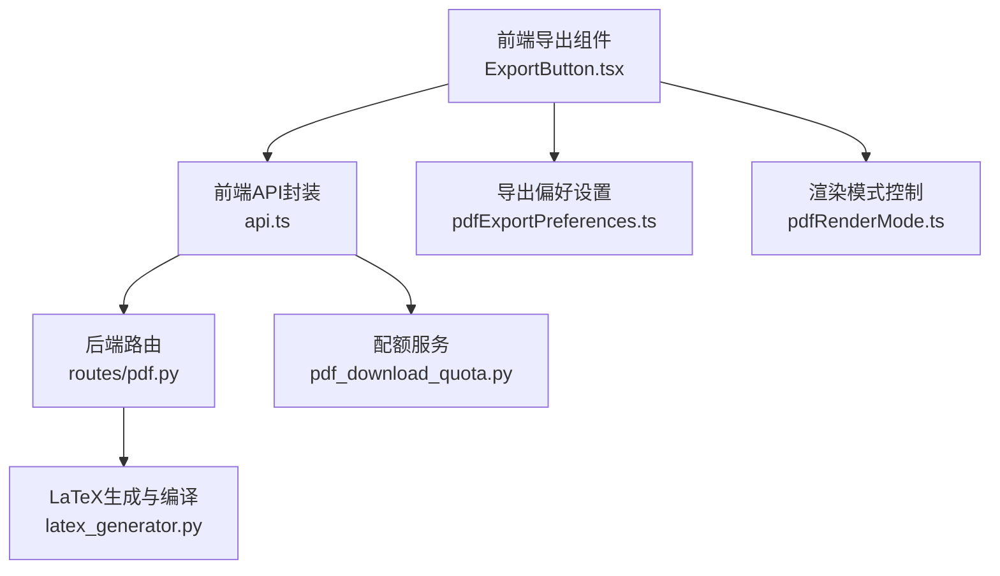
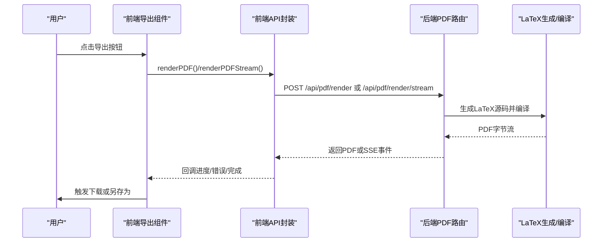
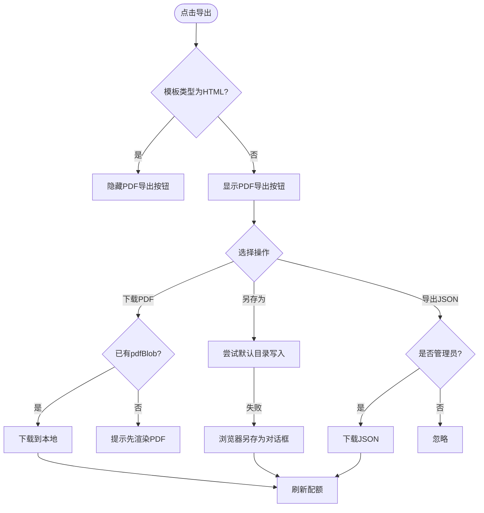
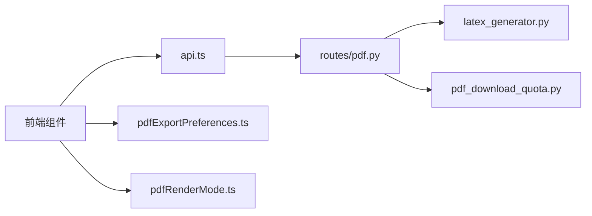
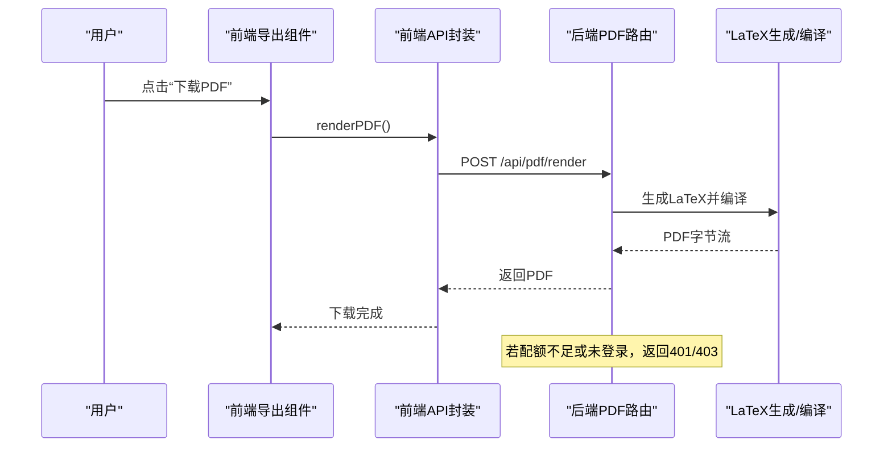
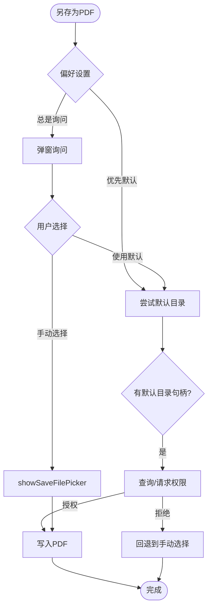

# 导出功能

<cite>
**本文档引用的文件**
- [ExportButton.tsx](file://frontend/src/components/ExportShare/ExportButton.tsx)
- [ExportButton.tsx](file://frontend/src/pages/Workspace/v2/components/ExportButton.tsx)
- [pdfGenerator.ts](file://frontend/src/components/ExportShare/pdfGenerator.ts)
- [pdfRenderMode.ts](file://frontend/src/services/pdfRenderMode.ts)
- [api.ts](file://frontend/src/services/api.ts)
- [pdfExportPreferences.ts](file://frontend/src/services/pdfExportPreferences.ts)
- [pdf.py](file://backend/routes/pdf.py)
- [pdf_download_quota.py](file://backend/services/pdf_download_quota.py)
- [latex_generator.py](file://backend/latex_generator.py)
- [index.tsx](file://frontend/src/pages/Workspace/v2/PreviewPanel/index.tsx)
- [constants.ts](file://frontend/src/pages/Workspace/v2/constants.ts)
</cite>

## 目录
1. [简介](#简介)
2. [项目结构](#项目结构)
3. [核心组件](#核心组件)
4. [架构总览](#架构总览)
5. [详细组件分析](#详细组件分析)
6. [依赖分析](#依赖分析)
7. [性能考虑](#性能考虑)
8. [故障排查指南](#故障排查指南)
9. [结论](#结论)
10. [附录](#附录)

## 简介
本文件系统性梳理导出功能的实现，涵盖前端导出按钮组件、PDF 渲染偏好设置与渲染模式控制、后端 LaTeX 渲染链路、配额与权限控制、错误处理与进度反馈、性能优化与资源管理策略，以及扩展点与自定义选项。目标是帮助开发者快速理解并维护导出能力。

## 项目结构
导出功能由前端组件与后端服务协同完成：
- 前端负责导出入口交互、渲染模式切换、下载行为与配额展示；LaTeX 模板场景下还支持“另存为”到用户指定目录。
- 后端负责将简历 JSON 转换为 LaTeX 源码并编译为 PDF，提供配额校验与记录，支持流式渲染与进度事件推送。

图表来源
- [ExportButton.tsx:1-387](file://frontend/src/pages/Workspace/v2/components/ExportButton.tsx#L1-L387)
- [api.ts:1-525](file://frontend/src/services/api.ts#L1-L525)
- [pdf.py:1-380](file://backend/routes/pdf.py#L1-L380)
- [latex_generator.py:1-200](file://backend/latex_generator.py#L1-L200)
- [pdfExportPreferences.ts:1-171](file://frontend/src/services/pdfExportPreferences.ts#L1-L171)
- [pdfRenderMode.ts:1-16](file://frontend/src/services/pdfRenderMode.ts#L1-L16)
- [pdf_download_quota.py:1-44](file://backend/services/pdf_download_quota.py#L1-L44)

章节来源
- [ExportButton.tsx:1-387](file://frontend/src/pages/Workspace/v2/components/ExportButton.tsx#L1-L387)
- [api.ts:1-525](file://frontend/src/services/api.ts#L1-L525)
- [pdf.py:1-380](file://backend/routes/pdf.py#L1-L380)
- [latex_generator.py:1-200](file://backend/latex_generator.py#L1-L200)
- [pdfExportPreferences.ts:1-171](file://frontend/src/services/pdfExportPreferences.ts#L1-L171)
- [pdfRenderMode.ts:1-16](file://frontend/src/services/pdfRenderMode.ts#L1-L16)
- [pdf_download_quota.py:1-44](file://backend/services/pdf_download_quota.py#L1-L44)

## 核心组件
- 导出按钮组件（前端）：提供“下载 PDF”“另存为 PDF”“导出 JSON”等操作入口，支持配额展示与限额提示，HTML 模板场景下禁用 PDF 相关操作。
- PDF 渲染模式：支持本地/远程两种渲染模式，持久化存储于本地，便于跨会话记忆。
- 导出偏好设置：控制“总是询问”或“优先默认目录”，结合 IndexedDB 存储默认目录句柄与标签。
- 后端渲染链路：LaTeX 源码生成 → 编译为 PDF → 流式返回或直接返回。
- 配额与权限：非管理员用户默认 10 次/月，管理员无限次；下载真实 PDF 才计数。

章节来源
- [ExportButton.tsx:230-383](file://frontend/src/pages/Workspace/v2/components/ExportButton.tsx#L230-L383)
- [pdfRenderMode.ts:1-16](file://frontend/src/services/pdfRenderMode.ts#L1-L16)
- [pdfExportPreferences.ts:1-171](file://frontend/src/services/pdfExportPreferences.ts#L1-L171)
- [pdf.py:76-122](file://backend/routes/pdf.py#L76-L122)
- [pdf_download_quota.py:1-44](file://backend/services/pdf_download_quota.py#L1-L44)

## 架构总览
导出流程从用户点击导出按钮开始，前端根据模板类型与可用状态决定具体动作，随后通过 API 发起渲染请求，后端执行 LaTeX 渲染并返回 PDF 或流式事件，前端接收并处理进度与结果，最终触发下载或保存。

图表来源
- [ExportButton.tsx:91-185](file://frontend/src/pages/Workspace/v2/components/ExportButton.tsx#L91-L185)
- [api.ts:227-525](file://frontend/src/services/api.ts#L227-L525)
- [pdf.py:125-299](file://backend/routes/pdf.py#L125-L299)
- [latex_generator.py:463-495](file://backend/latex_generator.py#L463-L495)

## 详细组件分析

### 组件一：导出按钮（LaTeX 模板专用）
- 功能要点
  - “下载 PDF”：若已有 pdfBlob，直接下载；否则提示先渲染。
  - “另存为 PDF”：优先尝试默认目录写入，失败则回落到浏览器原生“另存为”对话框。
  - “导出 JSON”：仅管理员可见，下载原始 JSON 数据。
  - 配额展示：打开菜单时自动刷新配额，限额用红色高亮。
- 交互细节
  - 当模板为 HTML 时不显示 PDF 相关按钮。
  - 若下载配额耗尽，按钮禁用并提示剩余次数。
  - 下载成功后刷新配额，确保 UI 与后端一致。

图表来源
- [ExportButton.tsx:266-381](file://frontend/src/pages/Workspace/v2/components/ExportButton.tsx#L266-L381)
- [api.ts:62-90](file://frontend/src/services/api.ts#L62-L90)

章节来源
- [ExportButton.tsx:91-185](file://frontend/src/pages/Workspace/v2/components/ExportButton.tsx#L91-L185)
- [ExportButton.tsx:113-185](file://frontend/src/pages/Workspace/v2/components/ExportButton.tsx#L113-L185)
- [ExportButton.tsx:187-213](file://frontend/src/pages/Workspace/v2/components/ExportButton.tsx#L187-L213)
- [ExportButton.tsx:266-381](file://frontend/src/pages/Workspace/v2/components/ExportButton.tsx#L266-L381)

### 组件二：导出按钮（通用分享/导出）
- 功能要点
  - 提供“导出 PDF”“导出 JSON”“生成分享链接”三大能力。
  - 分享链接生成后支持复制，兼容 HTTP 环境下的备用复制方案。
  - 与 LaTeX 模板版本相比，该组件更侧重通用导出与分享。
- 错误处理
  - 分享链接生成失败时弹窗提示。
  - JSON 导出失败时记录错误并提示。

章节来源
- [ExportButton.tsx:33-59](file://frontend/src/components/ExportShare/ExportButton.tsx#L33-L59)
- [ExportButton.tsx:61-84](file://frontend/src/components/ExportShare/ExportButton.tsx#L61-L84)
- [ExportButton.tsx:86-154](file://frontend/src/components/ExportShare/ExportButton.tsx#L86-L154)

### 组件三：PDF 生成器（HTML 模板场景）
- 功能要点
  - 将简历 JSON 转换为 HTML 片段，使用 html2pdf 配置生成 PDF。
  - 通过配置项控制边距、图像质量、缩放与纸张格式。
- 注意事项
  - 该生成器适用于 HTML 模板场景，LaTeX 模板由后端统一处理。

章节来源
- [pdfGenerator.ts:21-51](file://frontend/src/components/ExportShare/pdfGenerator.ts#L21-L51)
- [pdfGenerator.ts:53-187](file://frontend/src/components/ExportShare/pdfGenerator.ts#L53-L187)

### 组件四：PDF 渲染模式控制
- 功能要点
  - 通过本地存储记录用户偏好的渲染模式（本地/远程）。
  - 前端 API 根据模式选择不同的后端端点。
- 使用场景
  - 在预览面板中提供切换控件，变更时记录日志到后端。

章节来源
- [pdfRenderMode.ts:1-16](file://frontend/src/services/pdfRenderMode.ts#L1-L16)
- [api.ts:9-14](file://frontend/src/services/api.ts#L9-L14)
- [index.tsx:145-171](file://frontend/src/pages/Workspace/v2/PreviewPanel/index.tsx#L145-L171)

### 组件五：导出偏好设置与目录写入
- 功能要点
  - 支持“总是询问”“优先默认目录”两种行为。
  - 使用 IndexedDB 存储默认目录句柄，localStorage 存储目录名称标签。
  - 支持查询/请求目录权限，向指定目录写入 PDF 文件。
- 降级策略
  - 不支持目录选择器时，回退到浏览器默认下载。

章节来源
- [pdfExportPreferences.ts:1-171](file://frontend/src/services/pdfExportPreferences.ts#L1-L171)

### 组件六：后端 LaTeX 渲染与流式返回
- 功能要点
  - 将简历 JSON 转换为 LaTeX 源码并编译为 PDF。
  - 提供非流式与流式两种渲染端点，流式端点支持进度事件与错误事件。
  - 记录真实下载次数，返回剩余配额。
- 性能与可观测性
  - 后端打印渲染各阶段耗时与字节数，便于诊断。
  - 流式事件包含 start/progress/pdf/error/quota 等事件类型。

章节来源
- [pdf.py:43-56](file://backend/routes/pdf.py#L43-L56)
- [pdf.py:125-179](file://backend/routes/pdf.py#L125-L179)
- [pdf.py:187-299](file://backend/routes/pdf.py#L187-L299)
- [latex_generator.py:463-495](file://backend/latex_generator.py#L463-L495)

### 组件七：配额与权限控制
- 功能要点
  - 非管理员默认每月 10 次下载配额。
  - 管理员无限下载。
  - 下载真实 PDF 才会记录配额使用。
- 错误处理
  - 401：未登录。
  - 403：超过配额。

章节来源
- [pdf_download_quota.py:17-44](file://backend/services/pdf_download_quota.py#L17-L44)
- [pdf.py:76-122](file://backend/routes/pdf.py#L76-L122)
- [api.ts:62-90](file://frontend/src/services/api.ts#L62-L90)

### 组件八：预览面板与渲染模式联动
- 功能要点
  - LaTeX 模板场景显示“渲染 PDF”按钮与渲染模式选择器。
  - 支持进度状态展示与错误高亮。
  - 缩放栏支持放大/缩小/适应宽度等操作。

章节来源
- [index.tsx:124-173](file://frontend/src/pages/Workspace/v2/PreviewPanel/index.tsx#L124-L173)
- [index.tsx:176-195](file://frontend/src/pages/Workspace/v2/PreviewPanel/index.tsx#L176-L195)
- [index.tsx:197-303](file://frontend/src/pages/Workspace/v2/PreviewPanel/index.tsx#L197-L303)

## 依赖分析
- 前端导出组件依赖：
  - API 封装：提供渲染、流式渲染、配额查询、下载记录等方法。
  - 渲染模式：本地/远程端点映射。
  - 导出偏好：默认目录与权限处理。
- 后端依赖：
  - LaTeX 生成器：JSON → LaTeX 源码 → PDF 编译。
  - 配额服务：配额构建、校验与记录。

图表来源
- [api.ts:1-525](file://frontend/src/services/api.ts#L1-L525)
- [pdf.py:1-380](file://backend/routes/pdf.py#L1-L380)
- [latex_generator.py:1-200](file://backend/latex_generator.py#L1-L200)
- [pdfExportPreferences.ts:1-171](file://frontend/src/services/pdfExportPreferences.ts#L1-L171)
- [pdfRenderMode.ts:1-16](file://frontend/src/services/pdfRenderMode.ts#L1-L16)
- [pdf_download_quota.py:1-44](file://backend/services/pdf_download_quota.py#L1-L44)

## 性能考虑
- 渲染模式
  - 本地渲染：适合轻量场景，减少网络往返，但占用前端资源。
  - 远程渲染：减轻前端负载，适合复杂模板与大体量数据。
- 流式渲染
  - 后端使用线程池执行 LaTeX 生成与编译，前端按事件逐步更新进度。
  - 建议在移动端谨慎启用流式，避免过多事件导致 UI 卡顿。
- 文件写入
  - 默认目录写入需查询/请求权限，建议在用户主动触发时执行，避免后台阻塞。
- 资源清理
  - 下载完成后及时释放对象 URL，避免内存泄漏。
  - 流式读取时注意中断信号与缓冲区清理。

[本节为通用指导，无需列出章节来源]

## 故障排查指南
- 常见问题与定位
  - “请先登录后再下载 PDF”：检查认证头与登录状态。
  - “PDF 下载次数已达上限（10 次）”：确认用户角色与配额使用情况。
  - “LaTeX 编译错误”：查看后端日志中的错误摘要，优先关注以“!”开头的错误行。
  - “未收到PDF数据/数据格式错误”：检查前端 SSE 解析与十六进制数据规范化。
- 建议步骤
  - 前端：开启调试日志，观察 traceId 与事件序列。
  - 后端：查看渲染阶段耗时与字节数，定位卡顿环节。
  - 配额：确认用户角色与使用次数，必要时重置或提升权限。

章节来源
- [api.ts:78-90](file://frontend/src/services/api.ts#L78-L90)
- [pdf.py:281-297](file://backend/routes/pdf.py#L281-L297)
- [latex_generator.py:153-178](file://backend/latex_generator.py#L153-L178)

## 结论
导出功能在前端与后端间形成清晰的职责边界：前端负责交互与体验（含偏好与模式），后端负责高质量排版（LaTeX）。通过流式事件与配额控制，系统在可用性与稳定性之间取得平衡。后续可在以下方向演进：
- 增加导出格式扩展点（如 Word/Markdown），复用现有 API 与配额体系。
- 引入并发队列与重试策略，提升大规模导出的可靠性。
- 优化前端资源回收与流式解析健壮性，改善移动端体验。

[本节为总结性内容，无需列出章节来源]

## 附录

### 导出流程与错误处理时序图（LaTeX 模板）

图表来源
- [ExportButton.tsx:91-111](file://frontend/src/pages/Workspace/v2/components/ExportButton.tsx#L91-L111)
- [api.ts:227-283](file://frontend/src/services/api.ts#L227-L283)
- [pdf.py:125-179](file://backend/routes/pdf.py#L125-L179)

### 导出偏好设置与目录写入流程

图表来源
- [ExportButton.tsx:113-185](file://frontend/src/pages/Workspace/v2/components/ExportButton.tsx#L113-L185)
- [pdfExportPreferences.ts:140-171](file://frontend/src/services/pdfExportPreferences.ts#L140-L171)

### LaTeX 模板全局排版参数（参考）
- 字号：11pt
- 边距：标准边距
- 行距：1.15
- 头部间距：若干像素级微调

章节来源
- [constants.ts:116-132](file://frontend/src/pages/Workspace/v2/constants.ts#L116-L132)