# 布局管理

<cite>
**本文档引用的文件**
- [EditPreviewLayout.tsx](file://frontend/src/pages/Workspace/v2/EditPreviewLayout.tsx)
- [ResizableLayout.tsx](file://frontend/src/pages/Workspace/v2/ResizableLayout.tsx)
- [ScrollEditMode.tsx](file://frontend/src/pages/Workspace/v2/ScrollEditMode.tsx)
- [JsonEditMode.tsx](file://frontend/src/pages/Workspace/v2/JsonEditMode.tsx)
- [LayoutSetting.tsx](file://frontend/src/pages/Workspace/v2/SidePanel/LayoutSetting.tsx)
- [SmartOnePage.tsx](file://frontend/src/pages/Workspace/v2/SidePanel/SmartOnePage.tsx)
- [WorkspaceLayout/index.tsx](file://frontend/src/pages/WorkspaceLayout/index.tsx)
- [Workspace v2/index.tsx](file://frontend/src/pages/Workspace/v2/index.tsx)
- [useTheme.ts](file://frontend/src/hooks/useTheme.ts)
- [theme.ts](file://frontend/src/lib/theme.ts)
- [types/index.ts](file://frontend/src/pages/Workspace/v2/types/index.ts)
- [StorageAdapter.ts](file://frontend/src/services/storage/StorageAdapter.ts)
- [utils/index.ts](file://frontend/src/pages/Workspace/v2/utils/index.ts)
</cite>

## 目录
1. [简介](#简介)
2. [项目结构](#项目结构)
3. [核心组件](#核心组件)
4. [架构总览](#架构总览)
5. [详细组件分析](#详细组件分析)
6. [依赖关系分析](#依赖关系分析)
7. [性能考量](#性能考量)
8. [故障排查指南](#故障排查指南)
9. [结论](#结论)
10. [附录](#附录)

## 简介
本文件面向“布局管理系统”的实现，围绕编辑预览布局、可调整布局、滚动编辑模式、侧边栏布局设置、智能单页布局与响应式设计进行系统化说明。文档同时覆盖布局状态管理、持久化存储、主题适配、布局切换动画、性能优化与兼容性处理，并给出扩展点与自定义选项建议及用户体验设计原则。

## 项目结构
布局系统位于前端 Workspace v2 页面，采用“工作区容器 + 三列布局 + 多编辑模式 + 侧边栏设置 + 预览面板”的组合架构。整体结构如下：

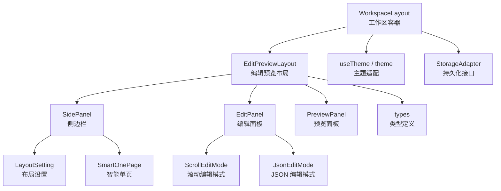

图表来源
- [WorkspaceLayout/index.tsx:299-673](file://frontend/src/pages/WorkspaceLayout/index.tsx#L299-L673)
- [EditPreviewLayout.tsx:112-410](file://frontend/src/pages/Workspace/v2/EditPreviewLayout.tsx#L112-L410)
- [ScrollEditMode.tsx:49-375](file://frontend/src/pages/Workspace/v2/ScrollEditMode.tsx#L49-L375)
- [JsonEditMode.tsx:18-239](file://frontend/src/pages/Workspace/v2/JsonEditMode.tsx#L18-L239)
- [LayoutSetting.tsx:18-78](file://frontend/src/pages/Workspace/v2/SidePanel/LayoutSetting.tsx#L18-L78)
- [SmartOnePage.tsx:67-274](file://frontend/src/pages/Workspace/v2/SidePanel/SmartOnePage.tsx#L67-L274)
- [useTheme.ts:14-27](file://frontend/src/hooks/useTheme.ts#L14-L27)
- [theme.ts:12-45](file://frontend/src/lib/theme.ts#L12-L45)
- [types/index.ts:185-235](file://frontend/src/pages/Workspace/v2/types/index.ts#L185-L235)
- [StorageAdapter.ts:17-28](file://frontend/src/services/storage/StorageAdapter.ts#L17-L28)

章节来源
- [WorkspaceLayout/index.tsx:124-673](file://frontend/src/pages/WorkspaceLayout/index.tsx#L124-L673)
- [EditPreviewLayout.tsx:112-410](file://frontend/src/pages/Workspace/v2/EditPreviewLayout.tsx#L112-L410)
- [types/index.ts:185-235](file://frontend/src/pages/Workspace/v2/types/index.ts#L185-L235)

## 核心组件
- 编辑预览布局（三列布局）：支持点击编辑、滚动编辑、JSON 编辑三种模式，中间编辑区宽度可拖拽调整，右侧预览区始终展示。
- 可调整布局（ResizableLayout）：提供双拖拽分隔线，分别控制侧边栏与编辑区宽度、编辑区与预览区宽度。
- 滚动编辑模式：模块按顺序垂直堆叠，支持折叠/展开、标题编辑、AI 导入等交互。
- JSON 编辑模式：以文本形式直接编辑 ResumeData，实时校验并同步到状态源。
- 侧边栏布局设置：模块列表拖拽排序、可见性切换、标题编辑。
- 智能单页：基于 PDF 页数分析，自动调整 LaTeX 排版参数，一键紧凑/重置。
- 主题适配：统一的主题状态与事件广播，支持亮/暗/跟随系统。
- 类型系统：完整的 ResumeData 结构与全局设置，支撑布局与渲染一致性。
- 持久化接口：抽象的存储适配器，便于替换本地/远程存储。

章节来源
- [EditPreviewLayout.tsx:112-410](file://frontend/src/pages/Workspace/v2/EditPreviewLayout.tsx#L112-L410)
- [ResizableLayout.tsx:104-298](file://frontend/src/pages/Workspace/v2/ResizableLayout.tsx#L104-L298)
- [ScrollEditMode.tsx:49-375](file://frontend/src/pages/Workspace/v2/ScrollEditMode.tsx#L49-L375)
- [JsonEditMode.tsx:18-239](file://frontend/src/pages/Workspace/v2/JsonEditMode.tsx#L18-L239)
- [LayoutSetting.tsx:18-78](file://frontend/src/pages/Workspace/v2/SidePanel/LayoutSetting.tsx#L18-L78)
- [SmartOnePage.tsx:67-274](file://frontend/src/pages/Workspace/v2/SidePanel/SmartOnePage.tsx#L67-L274)
- [useTheme.ts:14-27](file://frontend/src/hooks/useTheme.ts#L14-L27)
- [theme.ts:12-45](file://frontend/src/lib/theme.ts#L12-L45)
- [types/index.ts:185-235](file://frontend/src/pages/Workspace/v2/types/index.ts#L185-L235)
- [StorageAdapter.ts:17-28](file://frontend/src/services/storage/StorageAdapter.ts#L17-L28)

## 架构总览
布局系统采用“容器 + 布局 + 模式 + 设置 + 预览”的分层设计，配合主题与存储抽象，形成高内聚、低耦合的可扩展体系。

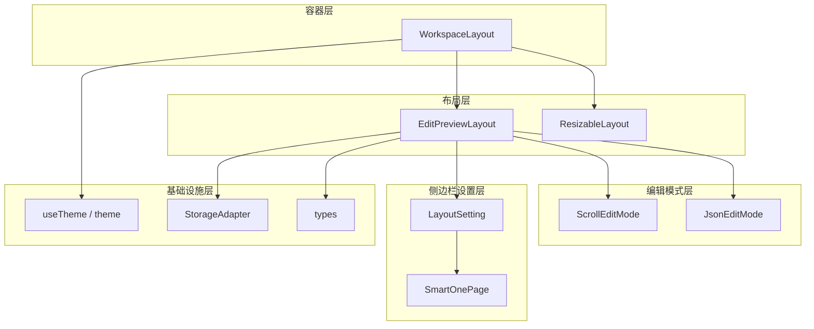

图表来源
- [WorkspaceLayout/index.tsx:299-673](file://frontend/src/pages/WorkspaceLayout/index.tsx#L299-L673)
- [EditPreviewLayout.tsx:112-410](file://frontend/src/pages/Workspace/v2/EditPreviewLayout.tsx#L112-L410)
- [ResizableLayout.tsx:104-298](file://frontend/src/pages/Workspace/v2/ResizableLayout.tsx#L104-L298)
- [ScrollEditMode.tsx:49-375](file://frontend/src/pages/Workspace/v2/ScrollEditMode.tsx#L49-L375)
- [JsonEditMode.tsx:18-239](file://frontend/src/pages/Workspace/v2/JsonEditMode.tsx#L18-L239)
- [LayoutSetting.tsx:18-78](file://frontend/src/pages/Workspace/v2/SidePanel/LayoutSetting.tsx#L18-L78)
- [SmartOnePage.tsx:67-274](file://frontend/src/pages/Workspace/v2/SidePanel/SmartOnePage.tsx#L67-L274)
- [useTheme.ts:14-27](file://frontend/src/hooks/useTheme.ts#L14-L27)
- [StorageAdapter.ts:17-28](file://frontend/src/services/storage/StorageAdapter.ts#L17-L28)
- [types/index.ts:185-235](file://frontend/src/pages/Workspace/v2/types/index.ts#L185-L235)

## 详细组件分析

### 编辑预览布局（三列布局）
- 三列结构：左侧模块选择（固定宽度）、中间编辑区（宽度可拖拽）、右侧预览区（自适应）。
- 模式切换：点击编辑（默认）、滚动编辑、JSON 编辑；JSON 模式对非管理员角色降级为点击编辑。
- 拖拽机制：使用 RAF 思想在拖拽过程中直接操作 DOM 宽度，结束时 setState 固定值，避免高频重渲染导致抖动。
- 遮罩层：拖拽时插入全屏遮罩拦截鼠标事件，防止预览 iframe 抢占导致宽度回弹。

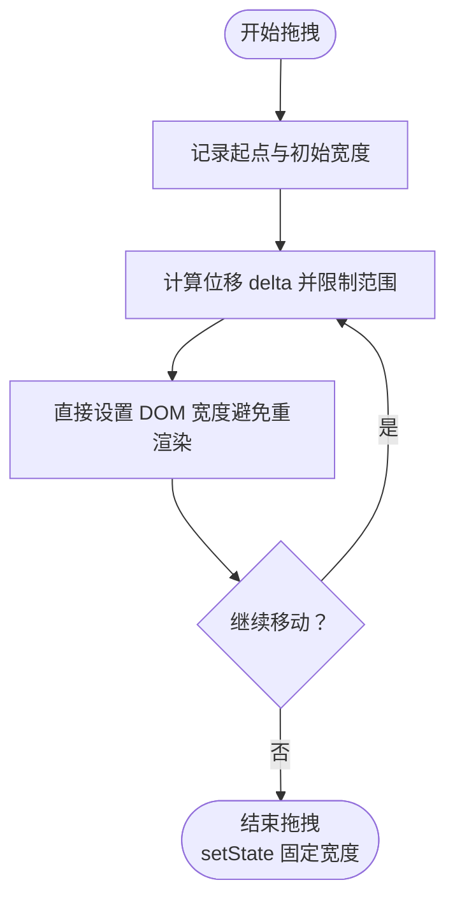

图表来源
- [EditPreviewLayout.tsx:168-210](file://frontend/src/pages/Workspace/v2/EditPreviewLayout.tsx#L168-L210)

章节来源
- [EditPreviewLayout.tsx:112-410](file://frontend/src/pages/Workspace/v2/EditPreviewLayout.tsx#L112-L410)

### 可调整布局（ResizableLayout）
- 双拖拽分隔线：左侧分隔线控制侧边栏宽度，右侧分隔线控制编辑区宽度；右侧列自动填充剩余空间。
- 窗口尺寸监听：响应式计算第三列宽度，保证布局稳定。
- 范围限制：侧边栏宽度限制在 250–500px，编辑区宽度限制在 500–1000px，超出范围自动回退。

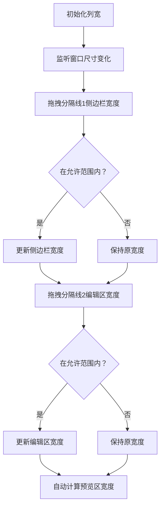

图表来源
- [ResizableLayout.tsx:149-208](file://frontend/src/pages/Workspace/v2/ResizableLayout.tsx#L149-L208)

章节来源
- [ResizableLayout.tsx:104-298](file://frontend/src/pages/Workspace/v2/ResizableLayout.tsx#L104-L298)

### 滚动编辑模式
- 垂直堆叠：根据 menuSections 的 enabled 与 order 排序，逐个渲染模块卡片。
- 折叠/展开：每个模块标题区域可点击折叠/展开，支持键盘交互。
- 标题编辑：长按/点击进入编辑模式，支持回车保存、ESC 取消。
- 动画与交互：使用 Framer Motion 实现模块入场动画，hover 状态增强交互反馈。

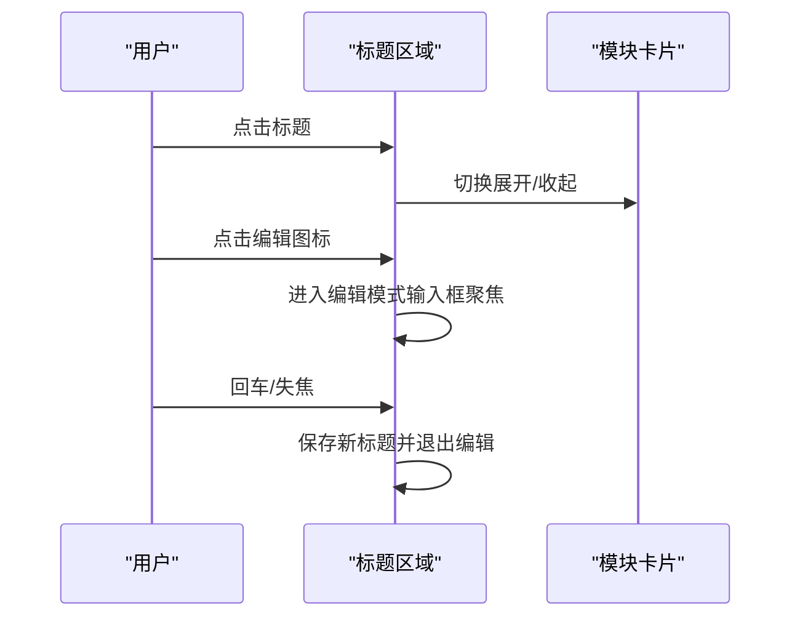

图表来源
- [ScrollEditMode.tsx:89-136](file://frontend/src/pages/Workspace/v2/ScrollEditMode.tsx#L89-L136)

章节来源
- [ScrollEditMode.tsx:49-375](file://frontend/src/pages/Workspace/v2/ScrollEditMode.tsx#L49-L375)

### JSON 编辑模式
- 实时校验：输入时解析草稿，若合法则立即同步到状态源并触发渲染。
- 规则提示：内置富文本规则卡片，支持一键复制。
- 格式化与复制：提供格式化 JSON 与复制 JSON 的便捷功能。
- 错误状态：语法错误时显示错误提示，同步状态变为“未同步”。

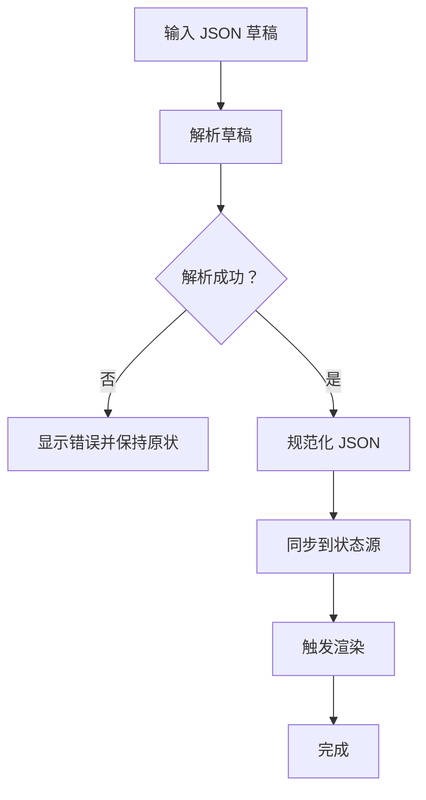

图表来源
- [JsonEditMode.tsx:35-71](file://frontend/src/pages/Workspace/v2/JsonEditMode.tsx#L35-L71)

章节来源
- [JsonEditMode.tsx:18-239](file://frontend/src/pages/Workspace/v2/JsonEditMode.tsx#L18-L239)

### 侧边栏布局设置
- 模块排序：使用 Framer Motion Reorder 实现拖拽排序，基本信息模块固定在顶部。
- 可见性切换：支持启用/禁用模块，影响滚动编辑模式的渲染顺序。
- 标题编辑：支持在侧边栏直接修改模块标题。

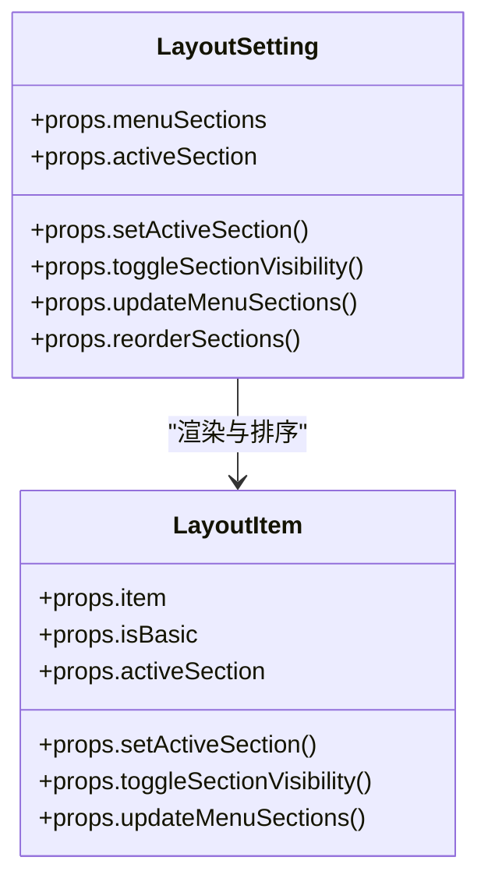

图表来源
- [LayoutSetting.tsx:18-78](file://frontend/src/pages/Workspace/v2/SidePanel/LayoutSetting.tsx#L18-L78)

章节来源
- [LayoutSetting.tsx:18-78](file://frontend/src/pages/Workspace/v2/SidePanel/LayoutSetting.tsx#L18-L78)

### 智能单页布局
- 级别预设：提供 7 个排版级别（从宽松到极度紧凑），包含字体大小、边距、行间距等参数。
- 自动分析：读取 PDF 文档页数，若大于 1 则逐步切换到更紧凑级别；若已达最紧凑仍超页则提示。
- 一键操作：提供“最紧凑”“重置”快捷按钮；支持点击圆点快速切换级别。
- 状态反馈：使用状态消息与颜色区分“分析中/优化中/成功/失败”。

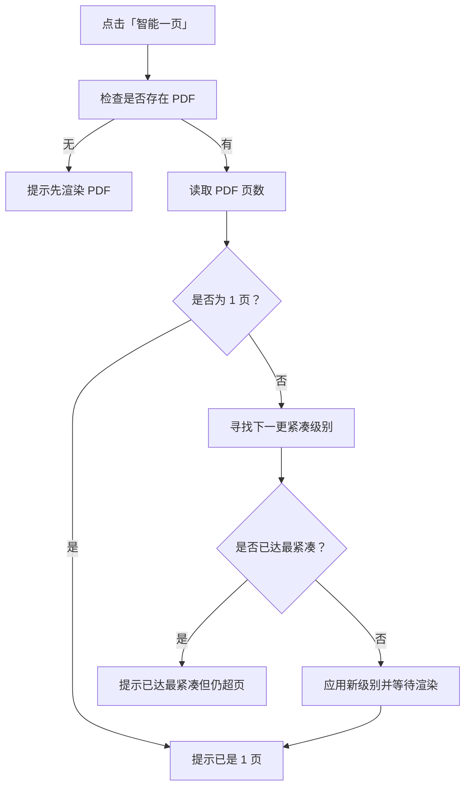

图表来源
- [SmartOnePage.tsx:92-148](file://frontend/src/pages/Workspace/v2/SidePanel/SmartOnePage.tsx#L92-L148)

章节来源
- [SmartOnePage.tsx:67-274](file://frontend/src/pages/Workspace/v2/SidePanel/SmartOnePage.tsx#L67-L274)

### 主题适配与响应式设计
- 主题状态：通过 useTheme hook 读取/切换主题，主题事件在多组件间同步。
- 主题解析：支持 light/dark/system，遵循系统偏好。
- 响应式侧边栏：工作区容器支持侧边栏展开/收起，动态计算内容区最大宽度，避免布局错位。

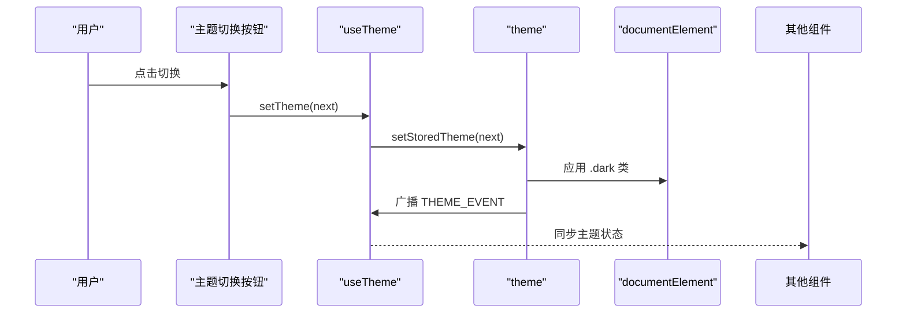

图表来源
- [useTheme.ts:14-27](file://frontend/src/hooks/useTheme.ts#L14-L27)
- [theme.ts:39-45](file://frontend/src/lib/theme.ts#L39-L45)
- [WorkspaceLayout/index.tsx:136-152](file://frontend/src/pages/WorkspaceLayout/index.tsx#L136-L152)

章节来源
- [useTheme.ts:14-27](file://frontend/src/hooks/useTheme.ts#L14-L27)
- [theme.ts:12-45](file://frontend/src/lib/theme.ts#L12-L45)
- [WorkspaceLayout/index.tsx:136-152](file://frontend/src/pages/WorkspaceLayout/index.tsx#L136-L152)

### 类型系统与状态模型
- ResumeData：包含模板元信息、基础信息、各模块数组、自定义模块、活动模块、拖拽状态、菜单配置与全局设置。
- GlobalSettings：涵盖主题色、字体、字号、段落/行距、章节间距、LaTeX 排版参数等。
- MenuSection：模块配置（id/title/icon/enabled/order）。

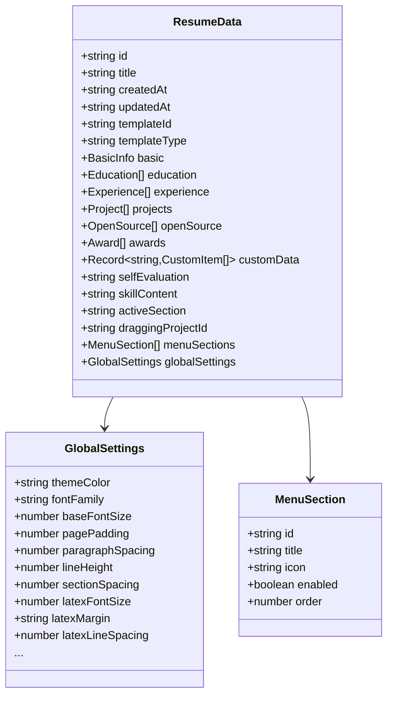

图表来源
- [types/index.ts:185-235](file://frontend/src/pages/Workspace/v2/types/index.ts#L185-L235)

章节来源
- [types/index.ts:185-235](file://frontend/src/pages/Workspace/v2/types/index.ts#L185-L235)

### 持久化存储与工作流
- 存储适配器：抽象接口定义简历 CRUD、别名/置顶管理、当前简历 ID 管理等。
- 工作流：Workspace v2 通过 useResumeData 管理状态，结合 PDF 渲染钩子与 AI 导入/导出能力，形成闭环。

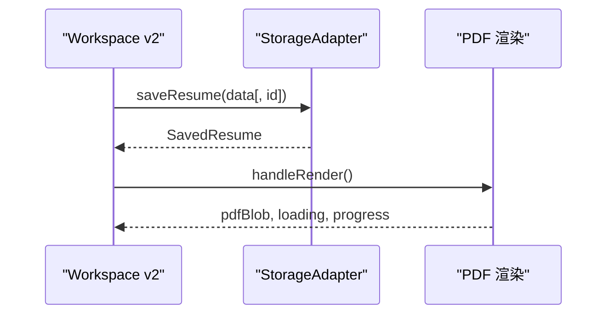

图表来源
- [StorageAdapter.ts:17-28](file://frontend/src/services/storage/StorageAdapter.ts#L17-L28)
- [Workspace v2/index.tsx:108-116](file://frontend/src/pages/Workspace/v2/index.tsx#L108-L116)

章节来源
- [StorageAdapter.ts:17-28](file://frontend/src/services/storage/StorageAdapter.ts#L17-L28)
- [Workspace v2/index.tsx:108-116](file://frontend/src/pages/Workspace/v2/index.tsx#L108-L116)

## 依赖关系分析
- 组件耦合：EditPreviewLayout 作为中枢，依赖 SidePanel、EditPanel、PreviewPanel；PreviewPanel 依赖 PDF 渲染服务；ScrollEditMode/JsonEditMode 依赖 types 与全局设置。
- 外部依赖：Framer Motion 用于动画；pdfjs-dist 用于 PDF 页数分析；localStorage 用于主题与侧边栏状态持久化。
- 循环依赖：当前文件未发现循环依赖迹象，组件职责清晰。

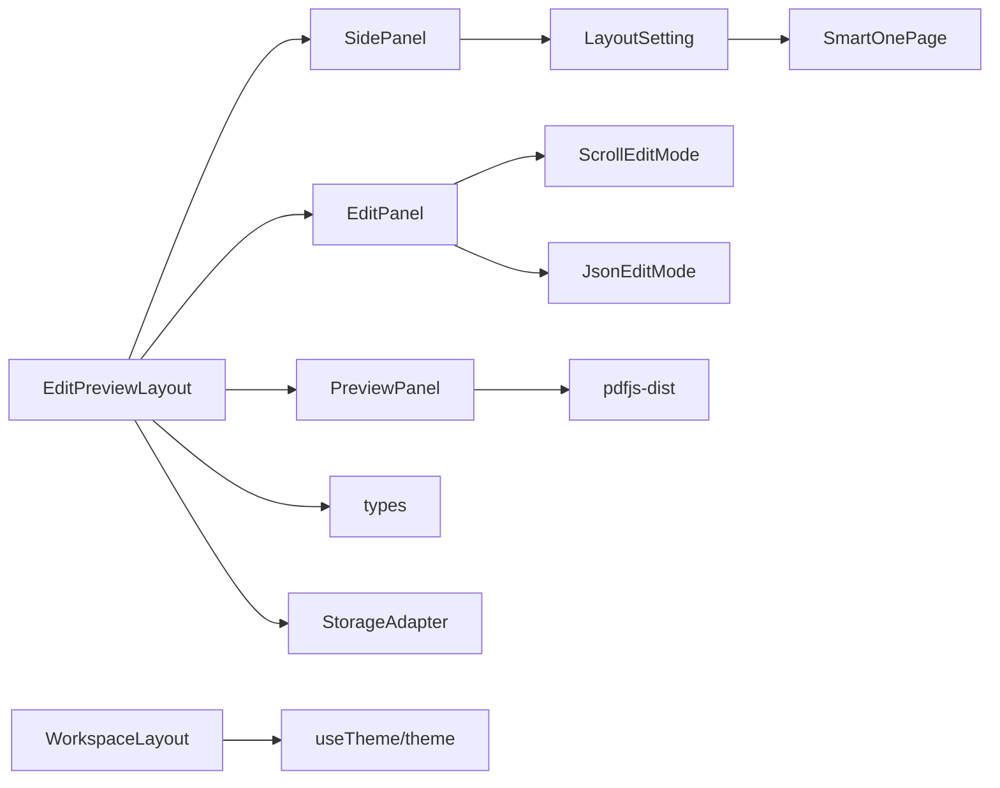

图表来源
- [EditPreviewLayout.tsx:112-410](file://frontend/src/pages/Workspace/v2/EditPreviewLayout.tsx#L112-L410)
- [ScrollEditMode.tsx:49-375](file://frontend/src/pages/Workspace/v2/ScrollEditMode.tsx#L49-L375)
- [JsonEditMode.tsx:18-239](file://frontend/src/pages/Workspace/v2/JsonEditMode.tsx#L18-L239)
- [LayoutSetting.tsx:18-78](file://frontend/src/pages/Workspace/v2/SidePanel/LayoutSetting.tsx#L18-L78)
- [SmartOnePage.tsx:67-274](file://frontend/src/pages/Workspace/v2/SidePanel/SmartOnePage.tsx#L67-L274)
- [WorkspaceLayout/index.tsx:124-673](file://frontend/src/pages/WorkspaceLayout/index.tsx#L124-L673)
- [types/index.ts:185-235](file://frontend/src/pages/Workspace/v2/types/index.ts#L185-L235)
- [StorageAdapter.ts:17-28](file://frontend/src/services/storage/StorageAdapter.ts#L17-L28)

章节来源
- [EditPreviewLayout.tsx:112-410](file://frontend/src/pages/Workspace/v2/EditPreviewLayout.tsx#L112-L410)
- [WorkspaceLayout/index.tsx:124-673](file://frontend/src/pages/WorkspaceLayout/index.tsx#L124-L673)

## 性能考量
- 拖拽节流：拖拽过程中直接操作 DOM 宽度，避免频繁 setState 引发的重渲染抖动。
- 渲染去抖：编辑变更后采用去抖策略，合并多次渲染请求，降低 PDF 渲染压力。
- 动画优化：使用 Framer Motion 的轻量动画与显式过渡，避免复杂布局抖动。
- 响应式布局：侧边栏收起时动态计算内容区最大宽度，减少布局回流。
- 主题切换：通过单一事件广播与类名切换，避免全树重绘。

章节来源
- [EditPreviewLayout.tsx:168-210](file://frontend/src/pages/Workspace/v2/EditPreviewLayout.tsx#L168-L210)
- [Workspace v2/index.tsx:178-213](file://frontend/src/pages/Workspace/v2/index.tsx#L178-L213)
- [WorkspaceLayout/index.tsx:136-152](file://frontend/src/pages/WorkspaceLayout/index.tsx#L136-L152)

## 故障排查指南
- 拖拽异常：确认拖拽遮罩层是否正确挂载，避免预览 iframe 抢占事件；检查 isDragging 状态与样式覆盖。
- 滚动编辑无法展开：检查 expandedSections 状态与 toggleSection 逻辑；确认模块 enabled 与 order。
- JSON 编辑未同步：检查 parse/normalize 流程与 lastAppliedJsonRef；确认错误提示是否阻断同步。
- 智能单页无效：确认 pdfBlob 是否存在；检查 pdfjs-dist 加载与 getDocument 调用；核对级别上限与切换逻辑。
- 主题不同步：确认 THEME_EVENT 是否广播；检查 applyThemeClass 与 getStoredTheme 的一致性。

章节来源
- [EditPreviewLayout.tsx:399-408](file://frontend/src/pages/Workspace/v2/EditPreviewLayout.tsx#L399-L408)
- [ScrollEditMode.tsx:89-96](file://frontend/src/pages/Workspace/v2/ScrollEditMode.tsx#L89-L96)
- [JsonEditMode.tsx:35-49](file://frontend/src/pages/Workspace/v2/JsonEditMode.tsx#L35-L49)
- [SmartOnePage.tsx:92-148](file://frontend/src/pages/Workspace/v2/SidePanel/SmartOnePage.tsx#L92-L148)
- [useTheme.ts:17-21](file://frontend/src/hooks/useTheme.ts#L17-L21)

## 结论
该布局管理系统以“容器 + 布局 + 模式 + 设置 + 预览”为核心，结合主题与存储抽象，实现了高可用的编辑体验。通过拖拽优化、渲染去抖、动画与响应式设计，兼顾性能与交互流畅性。智能单页与侧边栏设置进一步提升易用性与可定制性。建议后续在无障碍与移动端适配上持续优化，并扩展更多布局扩展点。

## 附录
- 扩展点建议
  - 新增布局模式：在 EditPreviewLayout 中新增分支与拖拽逻辑。
  - 自定义模块：通过 menuSections 与 customData 扩展模块类型。
  - 主题扩展：在 GlobalSettings 中增加更多排版参数，驱动 LaTeX/HTML 渲染。
  - 存储扩展：实现 StorageAdapter 的具体实现以适配云端/数据库。
- 用户体验设计原则
  - 一致性：布局与交互在不同模式下保持一致的视觉与行为。
  - 可预期性：拖拽范围、动画时长、状态反馈需明确且可预测。
  - 可访问性：为键盘与屏幕阅读器提供等价操作路径。
  - 渐进增强：在弱网/低性能设备上保证基础功能可用。