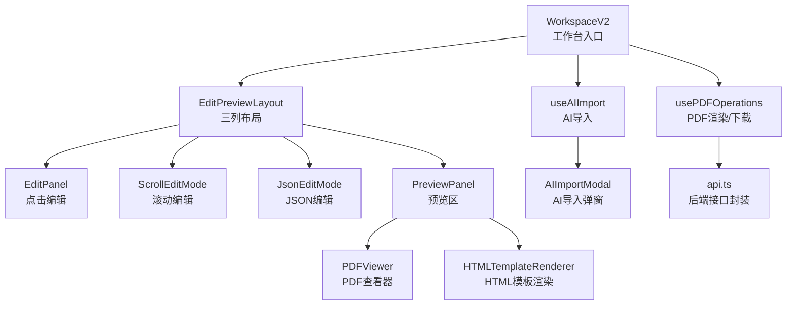
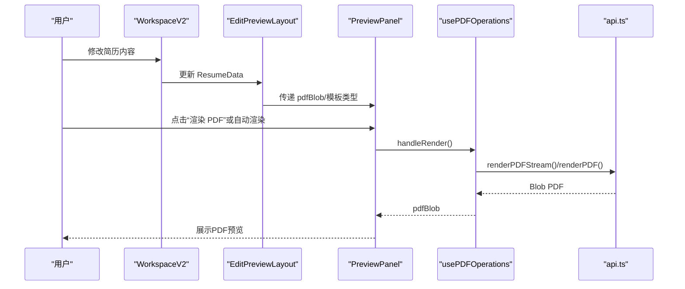
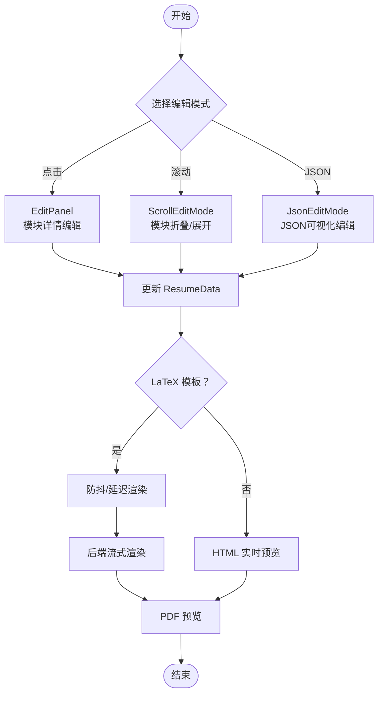
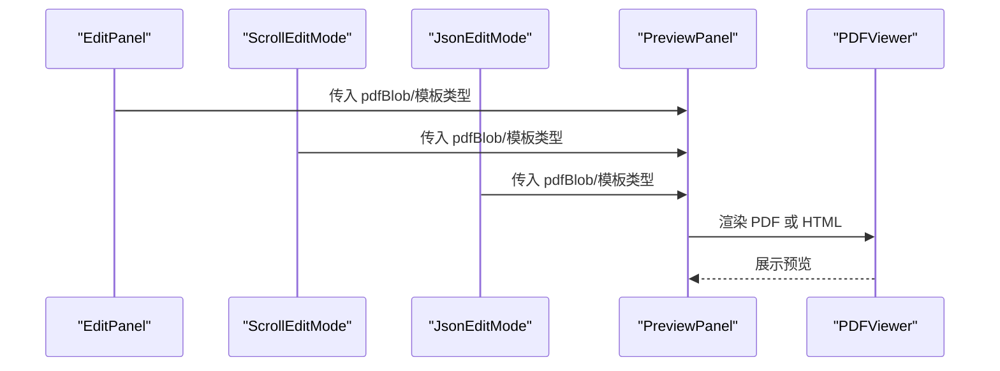
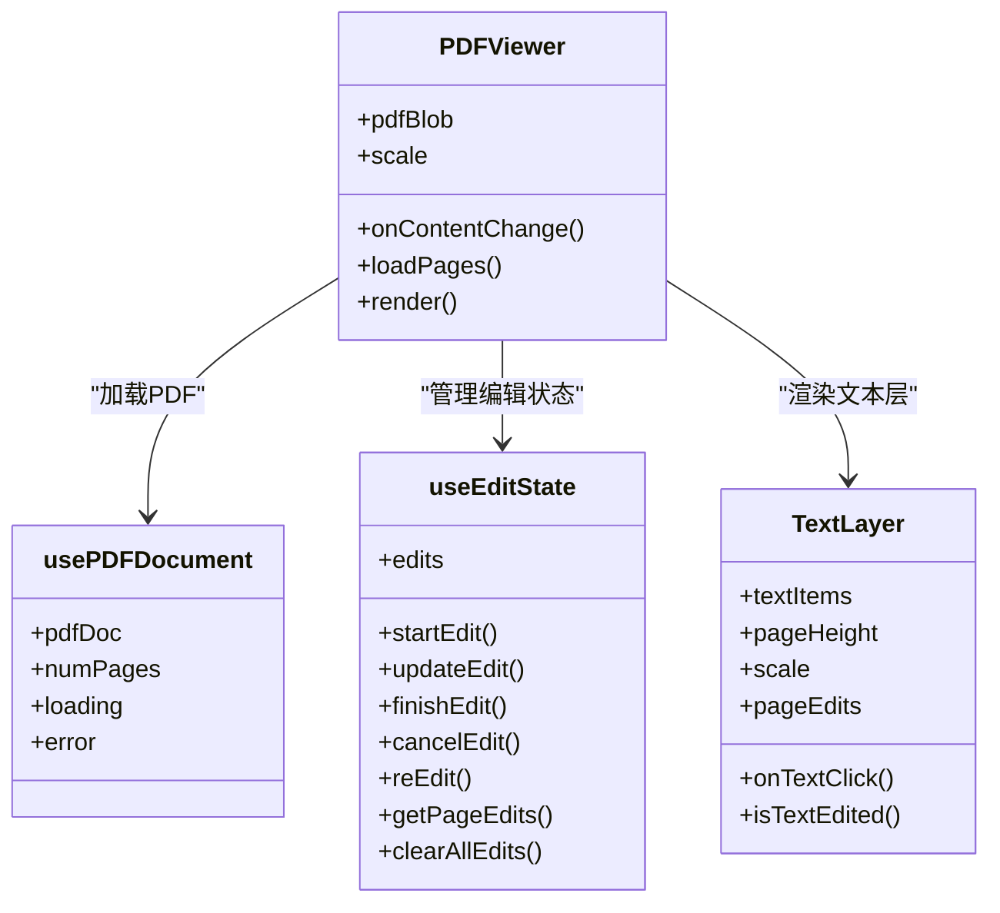
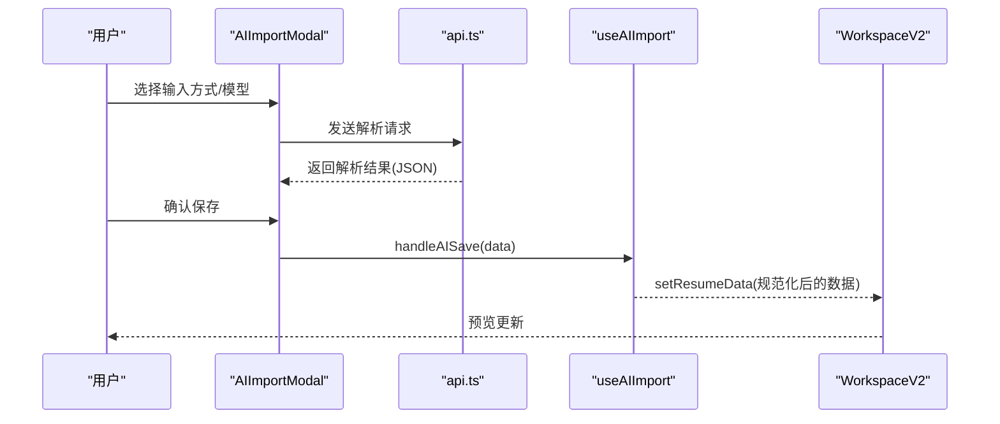
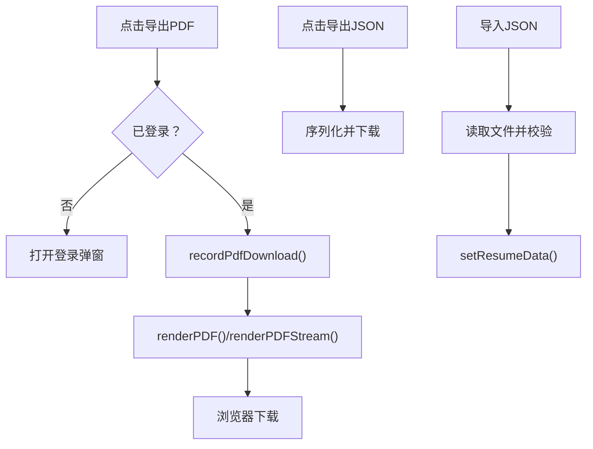
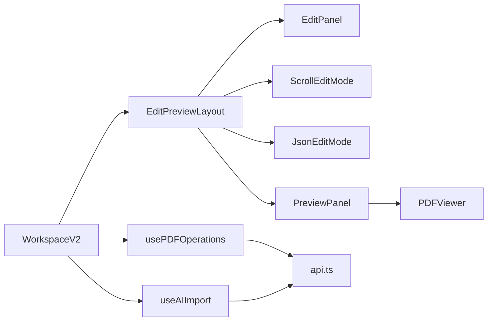

# 简历工作台

<cite>
**本文档引用的文件**
- [frontend/src/pages/Workspace/v2/index.tsx](file://frontend/src/pages/Workspace/v2/index.tsx)
- [frontend/src/pages/Workspace/v2/EditPreviewLayout.tsx](file://frontend/src/pages/Workspace/v2/EditPreviewLayout.tsx)
- [frontend/src/pages/Workspace/v2/ResizableLayout.tsx](file://frontend/src/pages/Workspace/v2/ResizableLayout.tsx)
- [frontend/src/pages/Workspace/v2/ScrollEditMode.tsx](file://frontend/src/pages/Workspace/v2/ScrollEditMode.tsx)
- [frontend/src/pages/Workspace/v2/JsonEditMode.tsx](file://frontend/src/pages/Workspace/v2/JsonEditMode.tsx)
- [frontend/src/pages/Workspace/v2/PreviewPanel/index.tsx](file://frontend/src/pages/Workspace/v2/PreviewPanel/index.tsx)
- [frontend/src/pages/Workspace/v2/EditPanel/index.tsx](file://frontend/src/pages/Workspace/v2/EditPanel/index.tsx)
- [frontend/src/pages/Workspace/v2/hooks/usePDFOperations.ts](file://frontend/src/pages/Workspace/v2/hooks/usePDFOperations.ts)
- [frontend/src/pages/Workspace/v2/hooks/useAIImport.ts](file://frontend/src/pages/Workspace/v2/hooks/useAIImport.ts)
- [frontend/src/pages/Workspace/v2/shared/AIImportModal.tsx](file://frontend/src/pages/Workspace/v2/shared/AIImportModal.tsx)
- [frontend/src/components/PDFEditor/index.tsx](file://frontend/src/components/PDFEditor/index.tsx)
- [frontend/src/components/PDFEditor/PDFViewer.tsx](file://frontend/src/components/PDFEditor/PDFViewer.tsx)
- [frontend/src/components/PDFEditor/TextLayer.tsx](file://frontend/src/components/PDFEditor/TextLayer.tsx)
- [frontend/src/services/api.ts](file://frontend/src/services/api.ts)
</cite>

## 目录
1. [简介](#简介)
2. [项目结构](#项目结构)
3. [核心组件](#核心组件)
4. [架构总览](#架构总览)
5. [详细组件分析](#详细组件分析)
6. [依赖关系分析](#依赖关系分析)
7. [性能考量](#性能考量)
8. [故障排查指南](#故障排查指南)
9. [结论](#结论)
10. [附录](#附录)

## 简介
简历工作台是一个面向用户的在线简历编辑与预览平台，提供三栏式编辑界面（左侧模块选择、中间编辑面板、右侧预览区），支持点击/滚动/JSON三种编辑模式，并内置LaTeX模板的PDF实时渲染与导出、HTML模板的实时预览、AI导入、智能润色与划词翻译等增强功能。系统通过钩子与服务层解耦，保证前后端交互清晰、渲染与导出流程稳定。

## 项目结构
工作台位于前端目录的 Workspace v2 页面，采用“布局 + 面板 + 钩子 + 服务”的分层组织：
- 布局层：EditPreviewLayout/ResizableLayout 控制三列布局与拖拽调整
- 面板层：EditPanel、ScrollEditMode、JsonEditMode、PreviewPanel 提供不同编辑与预览体验
- 钩子层：usePDFOperations、useAIImport 封装PDF渲染/下载、AI导入逻辑
- 服务层：api.ts 提供渲染、下载、配额、AI测试等后端接口封装

图表来源
- [frontend/src/pages/Workspace/v2/index.tsx:28-451](file://frontend/src/pages/Workspace/v2/index.tsx#L28-L451)
- [frontend/src/pages/Workspace/v2/EditPreviewLayout.tsx:112-411](file://frontend/src/pages/Workspace/v2/EditPreviewLayout.tsx#L112-L411)
- [frontend/src/pages/Workspace/v2/PreviewPanel/index.tsx:27-309](file://frontend/src/pages/Workspace/v2/PreviewPanel/index.tsx#L27-L309)
- [frontend/src/pages/Workspace/v2/hooks/usePDFOperations.ts:20-208](file://frontend/src/pages/Workspace/v2/hooks/usePDFOperations.ts#L20-L208)
- [frontend/src/pages/Workspace/v2/hooks/useAIImport.ts:181-393](file://frontend/src/pages/Workspace/v2/hooks/useAIImport.ts#L181-L393)
- [frontend/src/pages/Workspace/v2/shared/AIImportModal.tsx:103-411](file://frontend/src/pages/Workspace/v2/shared/AIImportModal.tsx#L103-L411)
- [frontend/src/services/api.ts:9-113](file://frontend/src/services/api.ts#L9-L113)

章节来源
- [frontend/src/pages/Workspace/v2/index.tsx:28-451](file://frontend/src/pages/Workspace/v2/index.tsx#L28-L451)
- [frontend/src/pages/Workspace/v2/EditPreviewLayout.tsx:112-411](file://frontend/src/pages/Workspace/v2/EditPreviewLayout.tsx#L112-L411)
- [frontend/src/pages/Workspace/v2/PreviewPanel/index.tsx:27-309](file://frontend/src/pages/Workspace/v2/PreviewPanel/index.tsx#L27-L309)

## 核心组件
- 工作台入口：负责编辑模式切换、自动渲染调度、JD评分联动、导出/导入JSON、AI导入弹窗控制
- 布局组件：三列布局与拖拽调整，支持点击/滚动/JSON三种编辑模式
- 预览组件：根据模板类型切换HTML实时预览或LaTeX PDF预览，支持缩放与渲染按钮
- PDF编辑器：基于pdfjs-dist的可编辑PDF查看器，支持文本层点击定位与编辑
- 钩子：usePDFOperations封装PDF渲染/下载/配额记录；useAIImport封装AI导入与数据规范化
- 服务：api.ts统一封装渲染、下载、配额、渲染模式日志、AI测试等接口

章节来源
- [frontend/src/pages/Workspace/v2/index.tsx:28-451](file://frontend/src/pages/Workspace/v2/index.tsx#L28-L451)
- [frontend/src/pages/Workspace/v2/EditPreviewLayout.tsx:112-411](file://frontend/src/pages/Workspace/v2/EditPreviewLayout.tsx#L112-L411)
- [frontend/src/pages/Workspace/v2/PreviewPanel/index.tsx:27-309](file://frontend/src/pages/Workspace/v2/PreviewPanel/index.tsx#L27-L309)
- [frontend/src/pages/Workspace/v2/hooks/usePDFOperations.ts:20-208](file://frontend/src/pages/Workspace/v2/hooks/usePDFOperations.ts#L20-L208)
- [frontend/src/pages/Workspace/v2/hooks/useAIImport.ts:181-393](file://frontend/src/pages/Workspace/v2/hooks/useAIImport.ts#L181-L393)
- [frontend/src/components/PDFEditor/PDFViewer.tsx:14-177](file://frontend/src/components/PDFEditor/PDFViewer.tsx#L14-L177)

## 架构总览
工作台采用“状态驱动 + 钩子解耦 + 服务封装”的架构：
- 状态：ResumeData集中管理，编辑面板与预览区通过props双向同步
- 渲染：LaTeX模板走后端流式渲染，HTML模板走前端模板渲染
- 导出：PDF下载需登录，记录下载配额；JSON导出/导入在前端完成
- AI：AI导入弹窗通过流式/非流式接口解析简历，规范化后写入状态

图表来源
- [frontend/src/pages/Workspace/v2/index.tsx:174-214](file://frontend/src/pages/Workspace/v2/index.tsx#L174-L214)
- [frontend/src/pages/Workspace/v2/PreviewPanel/index.tsx:128-144](file://frontend/src/pages/Workspace/v2/PreviewPanel/index.tsx#L128-L144)
- [frontend/src/pages/Workspace/v2/hooks/usePDFOperations.ts:65-146](file://frontend/src/pages/Workspace/v2/hooks/usePDFOperations.ts#L65-L146)
- [frontend/src/services/api.ts:9-14](file://frontend/src/services/api.ts#L9-L14)

## 详细组件分析

### 布局与交互设计
- 三列布局：左侧模块选择（固定宽度）、中间编辑面板（可拖拽宽度）、右侧预览区（自适应）
- 拖拽优化：使用RAF节流与DOM直接修改宽度，避免频繁setState导致抖动
- 编辑模式：点击模式（模块卡片+详细编辑）、滚动模式（模块折叠展开）、JSON模式（语法校验与格式化）

图表来源
- [frontend/src/pages/Workspace/v2/EditPreviewLayout.tsx:157-211](file://frontend/src/pages/Workspace/v2/EditPreviewLayout.tsx#L157-L211)
- [frontend/src/pages/Workspace/v2/ScrollEditMode.tsx:77-97](file://frontend/src/pages/Workspace/v2/ScrollEditMode.tsx#L77-L97)
- [frontend/src/pages/Workspace/v2/JsonEditMode.tsx:18-49](file://frontend/src/pages/Workspace/v2/JsonEditMode.tsx#L18-L49)
- [frontend/src/pages/Workspace/v2/index.tsx:174-214](file://frontend/src/pages/Workspace/v2/index.tsx#L174-L214)

章节来源
- [frontend/src/pages/Workspace/v2/EditPreviewLayout.tsx:112-411](file://frontend/src/pages/Workspace/v2/EditPreviewLayout.tsx#L112-L411)
- [frontend/src/pages/Workspace/v2/ScrollEditMode.tsx:49-376](file://frontend/src/pages/Workspace/v2/ScrollEditMode.tsx#L49-L376)
- [frontend/src/pages/Workspace/v2/JsonEditMode.tsx:18-240](file://frontend/src/pages/Workspace/v2/JsonEditMode.tsx#L18-L240)

### 预览系统与数据同步
- 模板类型判定：根据 resumeData.templateType 切换HTML实时预览或LaTeX PDF预览
- PDF预览：自适应宽度缩放，支持手动缩放与“适应宽度”，渲染失败时展示错误状态
- 数据同步：编辑区任一字段变更均触发状态更新；LaTeX模板通过防抖延迟渲染，避免频繁请求

图表来源
- [frontend/src/pages/Workspace/v2/EditPanel/index.tsx:52-327](file://frontend/src/pages/Workspace/v2/EditPanel/index.tsx#L52-L327)
- [frontend/src/pages/Workspace/v2/ScrollEditMode.tsx:138-248](file://frontend/src/pages/Workspace/v2/ScrollEditMode.tsx#L138-L248)
- [frontend/src/pages/Workspace/v2/JsonEditMode.tsx:18-71](file://frontend/src/pages/Workspace/v2/JsonEditMode.tsx#L18-L71)
- [frontend/src/pages/Workspace/v2/PreviewPanel/index.tsx:27-309](file://frontend/src/pages/Workspace/v2/PreviewPanel/index.tsx#L27-L309)

章节来源
- [frontend/src/pages/Workspace/v2/PreviewPanel/index.tsx:27-309](file://frontend/src/pages/Workspace/v2/PreviewPanel/index.tsx#L27-L309)

### PDF编辑器实现
- 组件结构：PDFViewer整合文档加载、页面渲染与编辑状态管理；TextLayer提供可点击文本区域
- 坐标系统：基于pdfjs-lib的原始点坐标，结合缩放比例换算为像素位置
- 编辑流程：点击TextLayer触发编辑，生成EditItem，支持开始/更新/完成/取消/重做

图表来源
- [frontend/src/components/PDFEditor/PDFViewer.tsx:14-177](file://frontend/src/components/PDFEditor/PDFViewer.tsx#L14-L177)
- [frontend/src/components/PDFEditor/TextLayer.tsx:19-79](file://frontend/src/components/PDFEditor/TextLayer.tsx#L19-L79)
- [frontend/src/components/PDFEditor/index.tsx:6-26](file://frontend/src/components/PDFEditor/index.tsx#L6-L26)

章节来源
- [frontend/src/components/PDFEditor/PDFViewer.tsx:14-177](file://frontend/src/components/PDFEditor/PDFViewer.tsx#L14-L177)
- [frontend/src/components/PDFEditor/TextLayer.tsx:19-79](file://frontend/src/components/PDFEditor/TextLayer.tsx#L19-L79)
- [frontend/src/components/PDFEditor/index.tsx:6-26](file://frontend/src/components/PDFEditor/index.tsx#L6-L26)

### AI导入与智能润色
- AI导入弹窗：支持PDF/图片/文本三种输入方式，选择AI模型后解析并展示结果
- 数据规范化：针对教育/实习/项目/技能/开源/奖项等字段进行格式化与Logo匹配
- 智能润色：将Highlights/技能描述等拆分为HTML列表，支持嵌套层级与加粗标记
- 划词翻译：通过对话面板触发翻译弹窗，批量应用翻译结果

图表来源
- [frontend/src/pages/Workspace/v2/shared/AIImportModal.tsx:186-280](file://frontend/src/pages/Workspace/v2/shared/AIImportModal.tsx#L186-L280)
- [frontend/src/pages/Workspace/v2/hooks/useAIImport.ts:212-392](file://frontend/src/pages/Workspace/v2/hooks/useAIImport.ts#L212-L392)
- [frontend/src/services/api.ts:121-125](file://frontend/src/services/api.ts#L121-L125)

章节来源
- [frontend/src/pages/Workspace/v2/shared/AIImportModal.tsx:103-411](file://frontend/src/pages/Workspace/v2/shared/AIImportModal.tsx#L103-L411)
- [frontend/src/pages/Workspace/v2/hooks/useAIImport.ts:181-393](file://frontend/src/pages/Workspace/v2/hooks/useAIImport.ts#L181-L393)

### 导出功能
- PDF导出：登录后记录下载配额并触发浏览器下载；支持本地/远程渲染模式切换
- JSON导出/导入：前端序列化/反序列化，支持文件选择与验证
- 保存到仪表盘：持久化当前简历数据，保留模板类型等元信息

图表来源
- [frontend/src/pages/Workspace/v2/hooks/usePDFOperations.ts:155-194](file://frontend/src/pages/Workspace/v2/hooks/usePDFOperations.ts#L155-L194)
- [frontend/src/pages/Workspace/v2/index.tsx:232-285](file://frontend/src/pages/Workspace/v2/index.tsx#L232-L285)
- [frontend/src/services/api.ts:69-90](file://frontend/src/services/api.ts#L69-L90)

章节来源
- [frontend/src/pages/Workspace/v2/hooks/usePDFOperations.ts:20-208](file://frontend/src/pages/Workspace/v2/hooks/usePDFOperations.ts#L20-L208)
- [frontend/src/pages/Workspace/v2/index.tsx:232-285](file://frontend/src/pages/Workspace/v2/index.tsx#L232-L285)

## 依赖关系分析
- 组件耦合：WorkspaceV2 作为顶层容器，向下聚合布局、面板、钩子与服务；各子组件通过props与回调解耦
- 外部依赖：pdfjs-dist用于PDF渲染；file-saver用于下载；axios/fetch用于接口通信
- 状态管理：ResumeData集中存储，usePDFOperations与useAIImport分别封装副作用

图表来源
- [frontend/src/pages/Workspace/v2/index.tsx:28-451](file://frontend/src/pages/Workspace/v2/index.tsx#L28-L451)
- [frontend/src/pages/Workspace/v2/EditPreviewLayout.tsx:112-411](file://frontend/src/pages/Workspace/v2/EditPreviewLayout.tsx#L112-L411)
- [frontend/src/pages/Workspace/v2/PreviewPanel/index.tsx:27-309](file://frontend/src/pages/Workspace/v2/PreviewPanel/index.tsx#L27-L309)
- [frontend/src/pages/Workspace/v2/hooks/usePDFOperations.ts:20-208](file://frontend/src/pages/Workspace/v2/hooks/usePDFOperations.ts#L20-L208)
- [frontend/src/pages/Workspace/v2/hooks/useAIImport.ts:181-393](file://frontend/src/pages/Workspace/v2/hooks/useAIImport.ts#L181-L393)
- [frontend/src/services/api.ts:9-113](file://frontend/src/services/api.ts#L9-L113)

章节来源
- [frontend/src/pages/Workspace/v2/index.tsx:28-451](file://frontend/src/pages/Workspace/v2/index.tsx#L28-L451)

## 性能考量
- 渲染防抖：LaTeX模板采用2秒防抖与首次300ms延迟，减少频繁渲染
- 拖拽优化：拖拽过程中禁用预览区指针事件，遮罩层接管鼠标事件，避免iframe抢占导致宽度回弹
- 缩放策略：PDF预览自适应宽度，限制缩放范围，避免过度放大导致内存压力
- JSON编辑：草稿态与最后应用态分离，仅在合法时同步到状态源，降低重渲染频率

## 故障排查指南
- PDF渲染失败：检查后端渲染模式与权限；查看进度条中的错误信息；尝试切换本地/远程渲染
- 下载受限：未登录或配额不足会抛出明确错误；登录后重试或联系管理员
- AI解析超时：网络不稳定或文件过大；建议更换更小PDF或更清晰图片
- JSON导入失败：确保文件为有效JSON；前端会进行基本格式校验

章节来源
- [frontend/src/pages/Workspace/v2/PreviewPanel/index.tsx:88-96](file://frontend/src/pages/Workspace/v2/PreviewPanel/index.tsx#L88-L96)
- [frontend/src/pages/Workspace/v2/hooks/usePDFOperations.ts:135-145](file://frontend/src/pages/Workspace/v2/hooks/usePDFOperations.ts#L135-L145)
- [frontend/src/pages/Workspace/v2/shared/AIImportModal.tsx:282-322](file://frontend/src/pages/Workspace/v2/shared/AIImportModal.tsx#L282-L322)
- [frontend/src/pages/Workspace/v2/index.tsx:256-285](file://frontend/src/pages/Workspace/v2/index.tsx#L256-L285)

## 结论
简历工作台通过清晰的组件分层与钩子封装，实现了从编辑到预览再到导出的完整闭环。LaTeX模板的流式渲染与HTML模板的实时预览满足多样化需求；AI导入与智能润色显著提升内容生产效率；PDF编辑器提供基础的可编辑能力。整体架构具备良好的可扩展性与可维护性。

## 附录
- 用户体验优化建议：增加撤销/重做、快捷键支持、主题切换；完善错误提示与加载状态
- 性能优化建议：对大文档分页渲染、缓存渲染结果、懒加载编辑器组件
- 安全与合规：严格校验AI解析结果，防止恶意内容注入；完善下载配额与审计日志