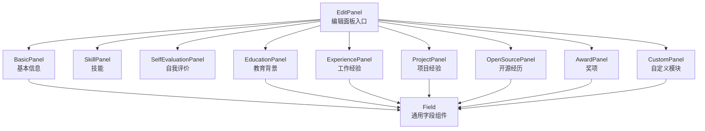
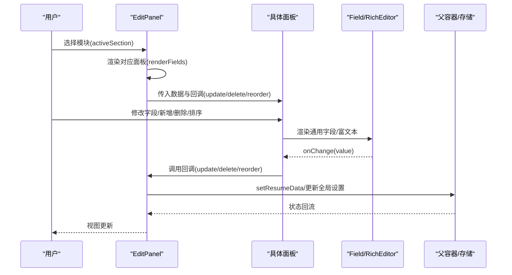
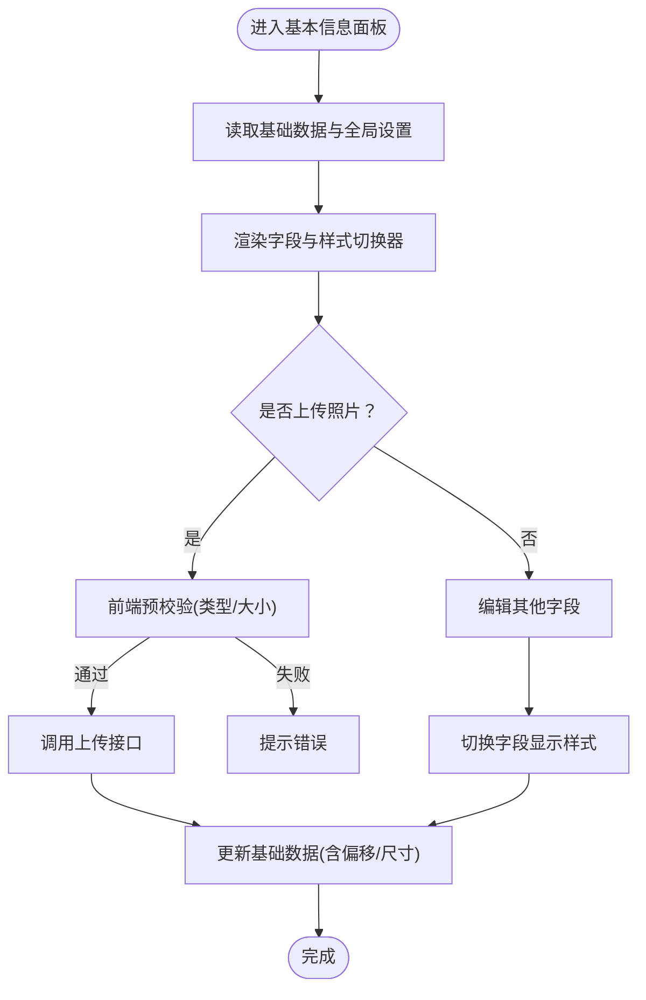
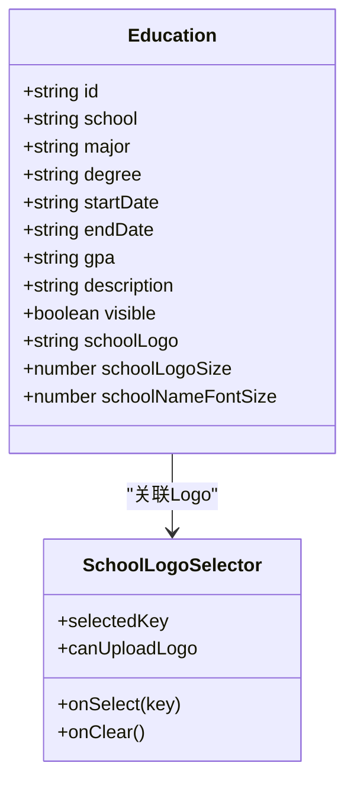
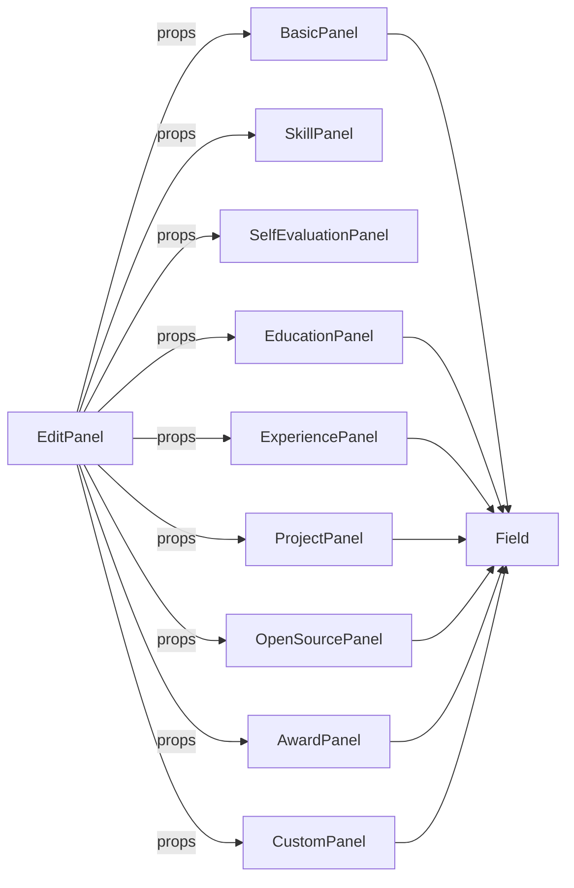

# 编辑面板

<cite>
**本文引用的文件**
- [EditPanel/index.tsx](file://frontend/src/pages/Workspace/v2/EditPanel/index.tsx)
- [BasicPanel.tsx](file://frontend/src/pages/Workspace/v2/EditPanel/BasicPanel.tsx)
- [EducationPanel.tsx](file://frontend/src/pages/Workspace/v2/EditPanel/EducationPanel.tsx)
- [ExperiencePanel.tsx](file://frontend/src/pages/Workspace/v2/EditPanel/ExperiencePanel.tsx)
- [ProjectPanel.tsx](file://frontend/src/pages/Workspace/v2/EditPanel/ProjectPanel.tsx)
- [SkillPanel.tsx](file://frontend/src/pages/Workspace/v2/EditPanel/SkillPanel.tsx)
- [SelfEvaluationPanel.tsx](file://frontend/src/pages/Workspace/v2/EditPanel/SelfEvaluationPanel.tsx)
- [AwardPanel.tsx](file://frontend/src/pages/Workspace/v2/EditPanel/AwardPanel.tsx)
- [OpenSourcePanel.tsx](file://frontend/src/pages/Workspace/v2/EditPanel/OpenSourcePanel.tsx)
- [CustomPanel.tsx](file://frontend/src/pages/Workspace/v2/EditPanel/CustomPanel.tsx)
- [Field.tsx](file://frontend/src/pages/Workspace/v2/EditPanel/Field.tsx)
- [initialResumeData.ts](file://frontend/src/data/initialResumeData.ts)
- [resume.ts](file://frontend/src/types/resume.ts)
</cite>

## 目录
1. [简介](#简介)
2. [项目结构](#项目结构)
3. [核心组件](#核心组件)
4. [架构总览](#架构总览)
5. [详细组件分析](#详细组件分析)
6. [依赖分析](#依赖分析)
7. [性能考量](#性能考量)
8. [故障排查指南](#故障排查指南)
9. [结论](#结论)
10. [附录](#附录)

## 简介
本文件系统性梳理“编辑面板”在简历工作区中的设计与实现，覆盖基本信息、教育背景、工作经验、项目经验、技能、奖项、开源经历、自定义模块及通用字段组件。文档聚焦以下方面：
- 各面板的数据结构与字段约束
- 表单项类型、默认值、必填规则与错误处理策略
- 样式设计与交互逻辑
- 面板间联动关系与数据同步机制
- 表单提交与持久化流程
- 用户体验优化与验证最佳实践

## 项目结构
编辑面板位于前端工作区的“编辑侧栏”，根据当前选中模块动态渲染对应面板；各面板通过统一的回调接口与父容器进行数据更新与排序。

图表来源
- [EditPanel/index.tsx:120-234](file://frontend/src/pages/Workspace/v2/EditPanel/index.tsx#L120-L234)
- [BasicPanel.tsx:105-345](file://frontend/src/pages/Workspace/v2/EditPanel/BasicPanel.tsx#L105-L345)
- [Field.tsx:15-30](file://frontend/src/pages/Workspace/v2/EditPanel/Field.tsx#L15-L30)

章节来源
- [EditPanel/index.tsx:120-234](file://frontend/src/pages/Workspace/v2/EditPanel/index.tsx#L120-L234)

## 核心组件
- EditPanel 入口：根据 activeSection 动态渲染对应面板，支持模块标题编辑、AI 导入入口与全局设置联动。
- 各面板：分别管理自身数据集合（增删改查、排序），并通过回调函数与父容器同步。
- Field 通用字段：统一处理文本、富文本、日期、多行文本等输入类型，支持格式化按钮与级联动画。

章节来源
- [EditPanel/index.tsx:19-81](file://frontend/src/pages/Workspace/v2/EditPanel/index.tsx#L19-L81)
- [Field.tsx:15-30](file://frontend/src/pages/Workspace/v2/EditPanel/Field.tsx#L15-L30)

## 架构总览
编辑面板采用“入口路由 + 面板组合”的结构，通过 props 注入数据与回调，实现松耦合与高扩展性。

图表来源
- [EditPanel/index.tsx:120-234](file://frontend/src/pages/Workspace/v2/EditPanel/index.tsx#L120-L234)
- [Field.tsx:57-76](file://frontend/src/pages/Workspace/v2/EditPanel/Field.tsx#L57-L76)

## 详细组件分析

### 基本信息面板（BasicPanel）
- 设计目标：集中管理候选人基础资料、头像上传与字段显示样式。
- 数据结构与默认值
  - 字段：姓名、职位、出生日期、年龄显示模式、邮箱、电话、地址、博客、照片偏移与尺寸等。
  - 默认值：来自初始数据与全局设置合并。
- 表单项与验证
  - 文本类：无强制必填，提供占位提示。
  - 年龄显示：birthDateDisplayMode 控制显示“出生日期”或“年龄”。
  - 照片上传：前端预校验（类型与大小），鉴权后调用服务端接口。
- 交互与样式
  - 字段显示样式切换：通过全局设置与字段图标映射，支持“标题/图标”组合。
  - 照片参数：X/Y 偏移、宽高（厘米）可微调，UI 以“相对值”呈现。
- 错误处理
  - 文件类型与大小校验失败时提示。
  - 上传异常时弹窗提示。
- 面板联动
  - 字段样式切换影响预览；年龄随出生日期动态计算。

图表来源
- [BasicPanel.tsx:37-72](file://frontend/src/pages/Workspace/v2/EditPanel/BasicPanel.tsx#L37-L72)
- [BasicPanel.tsx:89-103](file://frontend/src/pages/Workspace/v2/EditPanel/BasicPanel.tsx#L89-L103)

章节来源
- [BasicPanel.tsx:17-349](file://frontend/src/pages/Workspace/v2/EditPanel/BasicPanel.tsx#L17-L349)
- [initialResumeData.ts:5-11](file://frontend/src/data/initialResumeData.ts#L5-L11)

### 教育背景面板（EducationPanel）
- 设计目标：维护教育经历列表，支持学校 Logo 匹配与上传、时间范围选择、学历选择、GPA 等。
- 数据结构与默认值
  - 条目：学校、专业、学位、时间范围、GPA、描述、可见性、Logo 关联与尺寸。
  - 默认值：新增条目时填充占位文本。
- 表单项与验证
  - 学历：限定为“大专/本科/硕士”。
  - 时间：规范化“YYYY-MM - YYYY-MM”格式。
  - 描述：富文本编辑器，支持 AI 润色路径。
- 交互与样式
  - 可展开折叠，支持拖拽排序。
  - 学校 Logo：自动匹配与手动选择，支持上传新 Logo。
  - 字体大小：针对学校名称的字号调节。
- 错误处理
  - Logo 加载失败时显示错误提示。
  - 上传失败弹窗提示。
- 面板联动
  - 字段样式与全局设置联动；Logo 尺寸变化影响渲染。

图表来源
- [EducationPanel.tsx:54-61](file://frontend/src/pages/Workspace/v2/EditPanel/EducationPanel.tsx#L54-L61)
- [EducationPanel.tsx:72-331](file://frontend/src/pages/Workspace/v2/EditPanel/EducationPanel.tsx#L72-L331)

章节来源
- [EducationPanel.tsx:29-800](file://frontend/src/pages/Workspace/v2/EditPanel/EducationPanel.tsx#L29-L800)

### 工作经验面板（ExperiencePanel）
- 设计目标：维护实习/工作经历列表，支持拖拽排序与批量可见性控制。
- 数据结构与默认值
  - 条目：公司、职位、时间、描述、可见性。
  - 默认值：新增条目时填充占位文本。
- 表单项与验证
  - 描述：富文本编辑器。
  - 时间：支持“至今”与规范化日期范围。
- 交互与样式
  - 可展开折叠，支持拖拽排序。
  - 右上角可见性开关。
- 面板联动
  - 与全局设置联动（如字段显示样式）。

章节来源
- [ExperiencePanel.tsx:12-96](file://frontend/src/pages/Workspace/v2/EditPanel/ExperiencePanel.tsx#L12-L96)

### 项目经验面板（ProjectPanel）
- 设计目标：维护项目列表，支持多选批量删除、拖拽排序与可见性控制。
- 数据结构与默认值
  - 条目：名称、角色、时间、描述、可见性。
  - 默认值：新增条目时填充占位文本。
- 表单项与验证
  - 描述：富文本编辑器。
  - 时间：支持“至今”与规范化日期范围。
- 交互与样式
  - 多选模式：勾选多个条目后批量删除。
  - 可展开折叠，支持拖拽排序。
- 面板联动
  - 与全局设置联动（如字段显示样式）。

章节来源
- [ProjectPanel.tsx:16-186](file://frontend/src/pages/Workspace/v2/EditPanel/ProjectPanel.tsx#L16-L186)

### 技能面板（SkillPanel）
- 设计目标：维护技能内容，支持富文本编辑与 AI 导入。
- 数据结构与默认值
  - 内容：字符串（富文本 HTML）。
  - 默认值：来自初始数据。
- 表单项与验证
  - 富文本编辑器：支持加粗、列表等格式。
  - 提示：建议使用列表分类展示技能。
- 交互与样式
  - AI 导入按钮：一键导入技能内容。
- 面板联动
  - 与全局设置联动（如字段显示样式）。

章节来源
- [SkillPanel.tsx:13-74](file://frontend/src/pages/Workspace/v2/EditPanel/SkillPanel.tsx#L13-L74)
- [initialResumeData.ts:42-42](file://frontend/src/data/initialResumeData.ts#L42-L42)

### 自我评价面板（SelfEvaluationPanel）
- 设计目标：维护自我评价内容，支持富文本编辑与 AI 导入。
- 数据结构与默认值
  - 内容：字符串（富文本 HTML）。
  - 默认值：来自初始数据。
- 表单项与验证
  - 富文本编辑器：建议控制在 2-3 句话。
- 交互与样式
  - AI 导入按钮：一键导入自我评价。
- 面板联动
  - 与全局设置联动（如字段显示样式）。

章节来源
- [SelfEvaluationPanel.tsx:10-66](file://frontend/src/pages/Workspace/v2/EditPanel/SelfEvaluationPanel.tsx#L10-L66)
- [initialResumeData.ts:54-54](file://frontend/src/data/initialResumeData.ts#L54-L54)

### 奖项面板（AwardPanel）
- 设计目标：维护荣誉奖项列表，支持级别选择、时间选择与列表样式切换。
- 数据结构与默认值
  - 条目：名称、级别、时间、描述、可见性。
  - 默认值：新增条目时填充占位文本。
- 表单项与验证
  - 级别：支持“校级/省级/市级/国家级”。
  - 时间：月份/年份选择器。
  - 列表样式：支持“无序/有序”两种样式。
- 交互与样式
  - 可展开折叠，支持可见性开关。
- 面板联动
  - 与全局设置联动（如奖项列表样式）。

章节来源
- [AwardPanel.tsx:14-248](file://frontend/src/pages/Workspace/v2/EditPanel/AwardPanel.tsx#L14-L248)

### 开源经历面板（OpenSourcePanel）
- 设计目标：维护开源贡献列表，支持仓库链接显示样式与前缀设置。
- 数据结构与默认值
  - 条目：项目名称、角色、仓库链接、时间、描述、可见性。
  - 默认值：新增条目时填充占位文本。
- 表单项与验证
  - 描述：富文本编辑器。
  - 时间：支持“至今”与规范化日期范围。
  - 链接显示：支持“下方/右侧/图标”三种布局与自定义前缀。
- 交互与样式
  - 可展开折叠，支持拖拽排序。
- 面板联动
  - 与全局设置联动（如仓库链接显示样式与前缀）。

章节来源
- [OpenSourcePanel.tsx:12-314](file://frontend/src/pages/Workspace/v2/EditPanel/OpenSourcePanel.tsx#L12-L314)

### 自定义模块面板（CustomPanel）
- 设计目标：支持用户自定义模块条目，统一管理标题、副标题、时间与描述。
- 数据结构与默认值
  - 条目：标题、副标题、时间范围、描述、可见性。
  - 默认值：新增条目时填充占位文本。
- 表单项与验证
  - 描述：富文本编辑器。
  - 时间：支持“至今”与规范化日期范围。
- 交互与样式
  - 可展开折叠，支持可见性开关。
- 面板联动
  - 与全局设置联动（如字段显示样式）。

章节来源
- [CustomPanel.tsx:12-168](file://frontend/src/pages/Workspace/v2/EditPanel/CustomPanel.tsx#L12-L168)

### 通用字段组件（Field）
- 设计目标：统一处理不同类型的表单项，支持富文本、多行文本、日期与单行文本。
- 支持类型
  - text：单行文本，默认。
  - textarea：多行文本。
  - date：日期输入。
  - editor：富文本编辑器。
- 特性
  - formatButtons：支持加粗等格式按钮。
  - controlsLayout：控制格式控件位置（覆盖/下方）。
  - labelExtra：标签右侧附加控件（如字段显示样式切换）。
  - 级联动画：按索引延迟入场，增强视觉层次。
- 面板联动
  - 通过 onChange 回调与父面板通信。

章节来源
- [Field.tsx:15-184](file://frontend/src/pages/Workspace/v2/EditPanel/Field.tsx#L15-L184)

## 依赖分析
- EditPanel 作为中枢，依赖各子面板与其回调签名，形成“入口路由 + 面板组合”的低耦合结构。
- 各面板依赖 Field 与通用编辑器组件，保证一致性与可维护性。
- 面板间共享的全局设置（如字段显示样式、列表样式、字段图标）通过 updateGlobalSettings 进行集中管理。

图表来源
- [EditPanel/index.tsx:19-50](file://frontend/src/pages/Workspace/v2/EditPanel/index.tsx#L19-L50)
- [Field.tsx:15-30](file://frontend/src/pages/Workspace/v2/EditPanel/Field.tsx#L15-L30)

章节来源
- [EditPanel/index.tsx:19-50](file://frontend/src/pages/Workspace/v2/EditPanel/index.tsx#L19-L50)

## 性能考量
- 渲染优化
  - 使用 Framer Motion 的受控展开/折叠与级联动画，避免一次性渲染大量节点。
  - Reorder.Group 仅在必要时重排，减少不必要的 DOM 更新。
- 上传与资源
  - 照片上传前进行前端预校验，避免无效请求。
  - 学校 Logo 列表懒加载与缓存，首次打开时异步拉取。
- 计算与显示
  - 年龄计算基于出生日期，避免重复计算与不一致显示。
- 存储与同步
  - setResumeData 使用函数式更新，确保闭包中最新状态生效，避免竞态。

## 故障排查指南
- 照片上传失败
  - 检查文件类型与大小是否符合要求。
  - 确认已登录且 token 存在。
  - 查看服务端返回的错误消息。
- Logo 选择异常
  - 确认 Logo 列表是否成功加载。
  - 若加载失败，检查网络与缓存状态。
- 排序与可见性
  - 确保 onReorder 回调正确接收新顺序数组。
  - 检查 visible 字段是否被意外置为 false。
- 富文本编辑
  - 确认富文本编辑器初始化与内容变更回调正常。
  - 检查 polishPath 是否指向正确的 JSON 路径。

章节来源
- [BasicPanel.tsx:37-72](file://frontend/src/pages/Workspace/v2/EditPanel/BasicPanel.tsx#L37-L72)
- [EducationPanel.tsx:93-104](file://frontend/src/pages/Workspace/v2/EditPanel/EducationPanel.tsx#L93-L104)

## 结论
编辑面板通过“入口路由 + 面板组合 + 通用字段组件”的架构，实现了简历各模块的统一管理与高效编辑。其设计兼顾了易用性与扩展性，配合全局设置与面板联动，能够满足多样化的简历编辑需求。建议在后续迭代中持续完善默认值与校验规则，进一步优化大列表场景下的渲染性能与交互反馈。

## 附录
- 数据模型概览（节选）
  - 基础信息：姓名、职位、联系方式、出生日期、年龄显示模式、照片参数等。
  - 教育背景：学校、专业、学位、时间范围、GPA、描述、Logo 等。
  - 工作经验：公司、职位、时间、描述等。
  - 项目经验：名称、角色、时间、描述等。
  - 技能：富文本内容。
  - 自我评价：富文本内容。
  - 奖项：名称、级别、时间、描述等。
  - 开源经历：项目名称、角色、仓库链接、时间、描述等。
  - 自定义模块：标题、副标题、时间范围、描述等。

章节来源
- [initialResumeData.ts:3-64](file://frontend/src/data/initialResumeData.ts#L3-L64)
- [resume.ts:80-98](file://frontend/src/types/resume.ts#L80-L98)