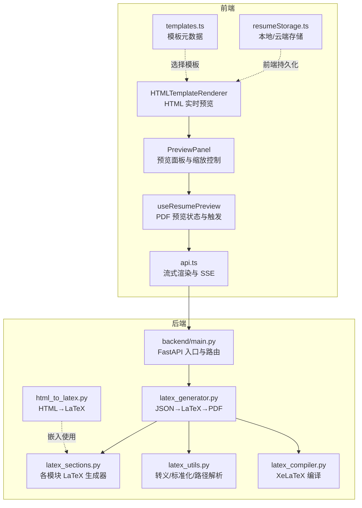
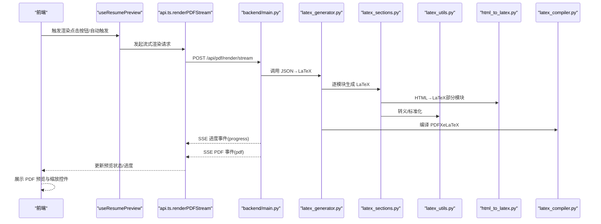
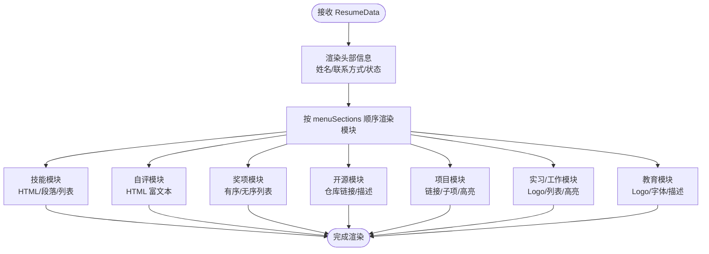
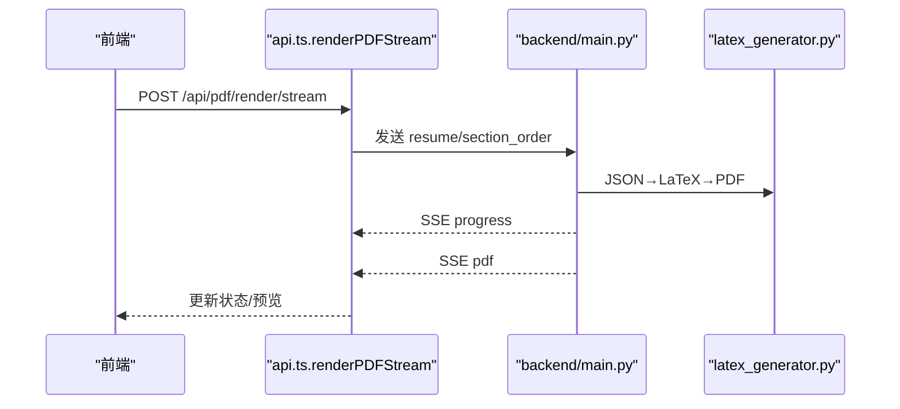
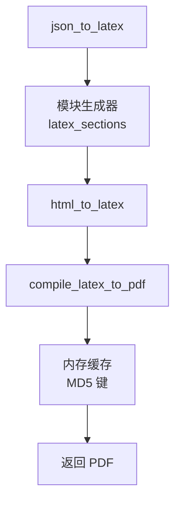
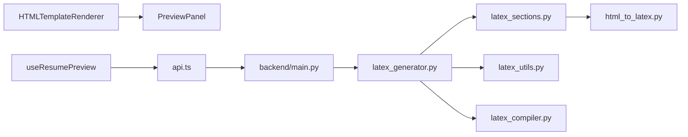

# 预览系统

<cite>
**本文引用的文件**
- [backend/html_to_latex.py](file://backend/html_to_latex.py)
- [backend/latex_compiler.py](file://backend/latex_compiler.py)
- [backend/latex_generator.py](file://backend/latex_generator.py)
- [backend/latex_utils.py](file://backend/latex_utils.py)
- [backend/latex_sections.py](file://backend/latex_sections.py)
- [backend/main.py](file://backend/main.py)
- [frontend/src/pages/Workspace/v2/HTMLTemplateRenderer/index.tsx](file://frontend/src/pages/Workspace/v2/HTMLTemplateRenderer/index.tsx)
- [frontend/src/pages/Workspace/v2/PreviewPanel/index.tsx](file://frontend/src/pages/Workspace/v2/PreviewPanel/index.tsx)
- [frontend/src/hooks/agent-chat/useResumePreview.ts](file://frontend/src/hooks/agent-chat/useResumePreview.ts)
- [frontend/src/services/api.ts](file://frontend/src/services/api.ts)
- [frontend/src/services/resumeStorage.ts](file://frontend/src/services/resumeStorage.ts)
- [frontend/src/data/templates.ts](file://frontend/src/data/templates.ts)
</cite>

## 目录
1. [引言](#引言)
2. [项目结构](#项目结构)
3. [核心组件](#核心组件)
4. [架构总览](#架构总览)
5. [详细组件分析](#详细组件分析)
6. [依赖分析](#依赖分析)
7. [性能考虑](#性能考虑)
8. [故障排查指南](#故障排查指南)
9. [结论](#结论)
10. [附录](#附录)

## 引言
本文件面向“预览系统”的技术文档，聚焦于：
- HTML 模板渲染器的实现原理与实时预览机制
- LaTeX 渲染流程与 PDF 生成
- 数据流向、模板引擎与样式处理
- 两种渲染模式的差异、性能优化与缓存策略
- 预览更新触发条件、防抖与内存管理
- 扩展性设计与自定义模板支持
- 常见问题排查与性能调优建议

## 项目结构
预览系统由前后端协同组成：
- 前端负责实时预览（HTML 模板）与 PDF 预览控制（缩放、工具栏、状态提示）
- 后端负责简历 JSON 到 LaTeX 的转换、LaTeX 编译 PDF、以及流式渲染 API

图表来源
- [backend/main.py:1-326](file://backend/main.py#L1-L326)
- [frontend/src/pages/Workspace/v2/HTMLTemplateRenderer/index.tsx:1-421](file://frontend/src/pages/Workspace/v2/HTMLTemplateRenderer/index.tsx#L1-L421)
- [frontend/src/pages/Workspace/v2/PreviewPanel/index.tsx:1-309](file://frontend/src/pages/Workspace/v2/PreviewPanel/index.tsx#L1-L309)
- [frontend/src/hooks/agent-chat/useResumePreview.ts:1-76](file://frontend/src/hooks/agent-chat/useResumePreview.ts#L1-L76)
- [frontend/src/services/api.ts:1-1143](file://frontend/src/services/api.ts#L1-L1143)
- [backend/latex_generator.py:1-676](file://backend/latex_generator.py#L1-L676)
- [backend/latex_sections.py:1-879](file://backend/latex_sections.py#L1-L879)
- [backend/latex_utils.py:1-252](file://backend/latex_utils.py#L1-L252)
- [backend/html_to_latex.py:1-305](file://backend/html_to_latex.py#L1-L305)
- [backend/latex_compiler.py:1-131](file://backend/latex_compiler.py#L1-L131)

章节来源
- [backend/main.py:1-326](file://backend/main.py#L1-L326)
- [frontend/src/pages/Workspace/v2/HTMLTemplateRenderer/index.tsx:1-421](file://frontend/src/pages/Workspace/v2/HTMLTemplateRenderer/index.tsx#L1-L421)
- [frontend/src/pages/Workspace/v2/PreviewPanel/index.tsx:1-309](file://frontend/src/pages/Workspace/v2/PreviewPanel/index.tsx#L1-L309)
- [frontend/src/hooks/agent-chat/useResumePreview.ts:1-76](file://frontend/src/hooks/agent-chat/useResumePreview.ts#L1-L76)
- [frontend/src/services/api.ts:1-1143](file://frontend/src/services/api.ts#L1-L1143)

## 核心组件
- HTML 模板渲染器：基于 React 组件，接收 ResumeData，按模块渲染 HTML 结构，支持字段前缀、头像、Logo、列表样式等
- 预览面板：根据模板类型切换 HTML 实时预览或 PDF 预览，提供缩放、适应宽度、百分比输入等交互
- PDF 预览钩子：封装渲染状态、进度、错误与触发逻辑
- 流式渲染 API：前端通过 SSE 接收进度与 PDF 数据，后端按需生成 PDF
- LaTeX 渲染链路：JSON→LaTeX→PDF，内置缓存与资源下载、XeLaTeX 编译

章节来源
- [frontend/src/pages/Workspace/v2/HTMLTemplateRenderer/index.tsx:1-421](file://frontend/src/pages/Workspace/v2/HTMLTemplateRenderer/index.tsx#L1-L421)
- [frontend/src/pages/Workspace/v2/PreviewPanel/index.tsx:1-309](file://frontend/src/pages/Workspace/v2/PreviewPanel/index.tsx#L1-L309)
- [frontend/src/hooks/agent-chat/useResumePreview.ts:1-76](file://frontend/src/hooks/agent-chat/useResumePreview.ts#L1-L76)
- [frontend/src/services/api.ts:288-525](file://frontend/src/services/api.ts#L288-L525)
- [backend/latex_generator.py:261-676](file://backend/latex_generator.py#L261-L676)

## 架构总览
预览系统采用“前端实时渲染 + 后端流式渲染”的双通道设计：
- HTML 模板：前端直接渲染，零后端编译，延迟低，适合编辑态高频预览
- LaTeX 模板：后端 JSON→LaTeX→PDF，支持复杂排版与高质量导出，适合最终预览与下载

图表来源
- [frontend/src/hooks/agent-chat/useResumePreview.ts:24-66](file://frontend/src/hooks/agent-chat/useResumePreview.ts#L24-L66)
- [frontend/src/services/api.ts:288-525](file://frontend/src/services/api.ts#L288-L525)
- [backend/main.py:1-326](file://backend/main.py#L1-L326)
- [backend/latex_generator.py:261-676](file://backend/latex_generator.py#L261-L676)
- [backend/latex_sections.py:1-879](file://backend/latex_sections.py#L1-L879)
- [backend/latex_utils.py:1-252](file://backend/latex_utils.py#L1-L252)
- [backend/html_to_latex.py:1-305](file://backend/html_to_latex.py#L1-L305)
- [backend/latex_compiler.py:1-131](file://backend/latex_compiler.py#L1-L131)

## 详细组件分析

### HTML 模板渲染器
- 输入：ResumeData（包含基本信息、模块数据、全局设置）
- 渲染策略：
  - 头部：姓名、求职意向、联系方式（支持 icon/text/none 三种显示模式）
  - 模块：教育、实习/工作、项目、开源、奖项、技能、自评等
  - 列表与 HTML：支持 HTML 内容（如富文本编辑器输出），通过 dangerouslySetInnerHTML 注入
  - Logo/头像：按设置尺寸与位置渲染
  - 字体与间距：通过全局设置与内联样式控制
- 性能：纯前端渲染，无网络请求，适合高频编辑态预览

图表来源
- [frontend/src/pages/Workspace/v2/HTMLTemplateRenderer/index.tsx:19-344](file://frontend/src/pages/Workspace/v2/HTMLTemplateRenderer/index.tsx#L19-L344)

章节来源
- [frontend/src/pages/Workspace/v2/HTMLTemplateRenderer/index.tsx:1-421](file://frontend/src/pages/Workspace/v2/HTMLTemplateRenderer/index.tsx#L1-L421)

### 预览面板与交互
- 模板类型判定：根据 resumeData.templateType 决定渲染模式（HTML 实时预览 / LaTeX PDF 预览）
- LaTeX 模式：
  - 工具栏：渲染按钮、渲染环境选择（本地/远程）
  - 状态提示：加载中/自动渲染等待/错误
  - PDF 预览：支持缩放、适应宽度、百分比输入
- HTML 模式：仅显示“实时预览”标签，直接渲染 HTMLTemplateRenderer

章节来源
- [frontend/src/pages/Workspace/v2/PreviewPanel/index.tsx:1-309](file://frontend/src/pages/Workspace/v2/PreviewPanel/index.tsx#L1-L309)

### PDF 预览状态与触发
- useResumePreview：维护每个简历的渲染状态（loading/progress/error/blob）
- 触发条件：
  - 用户点击“渲染 PDF”
  - 自动触发（待定，当前实现为每次触发都会发起请求）
- 防抖：当前未实现前端防抖；可在业务层增加防抖策略（如 2 秒无输入再触发）

章节来源
- [frontend/src/hooks/agent-chat/useResumePreview.ts:1-76](file://frontend/src/hooks/agent-chat/useResumePreview.ts#L1-L76)

### 流式渲染与 SSE
- 前端通过 renderPDFStream 发起请求，接收 SSE：
  - progress 事件：更新状态提示
  - pdf 事件：十六进制 PDF 数据，解码为 Blob
- 后端路由：/api/pdf/render/stream（本地/远程可切换）
- 错误处理：401/403 等状态码与错误消息透传

图表来源
- [frontend/src/services/api.ts:288-525](file://frontend/src/services/api.ts#L288-L525)
- [backend/main.py:1-326](file://backend/main.py#L1-L326)
- [backend/latex_generator.py:261-676](file://backend/latex_generator.py#L261-L676)

章节来源
- [frontend/src/services/api.ts:288-525](file://frontend/src/services/api.ts#L288-L525)

### LaTeX 渲染链路与缓存
- JSON→LaTeX：latex_generator.json_to_latex
  - 标准化简历字段（中英混输）
  - 生成 LaTeX 文档头、全局设置（字号、页边距、行距、间距）
  - 调用各模块生成器（latex_sections）
  - HTML→LaTeX：html_to_latex（富文本/列表/特殊字符转义）
- PDF 编译：latex_compiler.compile_latex_raw 或 latex_generator.compile_latex_to_pdf
  - 复制模板与字体资源
  - 下载 Logo/头像等外部资源
  - XeLaTeX 编译，捕获错误并返回摘要
- 缓存：内存缓存（最大 50 个），基于 resume_data + section_order 的 MD5 键

图表来源
- [backend/latex_generator.py:261-676](file://backend/latex_generator.py#L261-L676)
- [backend/latex_sections.py:1-879](file://backend/latex_sections.py#L1-L879)
- [backend/html_to_latex.py:192-241](file://backend/html_to_latex.py#L192-L241)
- [backend/latex_compiler.py:18-131](file://backend/latex_compiler.py#L18-L131)

章节来源
- [backend/latex_generator.py:261-676](file://backend/latex_generator.py#L261-L676)
- [backend/latex_compiler.py:18-131](file://backend/latex_compiler.py#L18-L131)
- [backend/html_to_latex.py:192-241](file://backend/html_to_latex.py#L192-L241)

### 模板与样式处理
- 模板元数据：templates.ts 定义模板类型（latex/html）与分类标签
- HTML 模板：HTMLTemplateRenderer 直接渲染，样式由组件内联样式与 CSS 类控制
- LaTeX 模板：通过 latex_generator 与 latex_sections 生成 LaTeX，样式由模板与全局设置控制

章节来源
- [frontend/src/data/templates.ts:1-74](file://frontend/src/data/templates.ts#L1-L74)
- [frontend/src/pages/Workspace/v2/HTMLTemplateRenderer/index.tsx:1-421](file://frontend/src/pages/Workspace/v2/HTMLTemplateRenderer/index.tsx#L1-L421)
- [backend/latex_generator.py:290-356](file://backend/latex_generator.py#L290-L356)

## 依赖分析
- 前端依赖后端 API（SSE），后端依赖 LaTeX 工具链（XeLaTeX）
- 模块间耦合：
  - latex_sections 依赖 latex_utils 与 html_to_latex
  - latex_generator 依赖 latex_sections、latex_utils、latex_compiler
  - 前端 PreviewPanel 依赖 HTMLTemplateRenderer 与 PDFViewerSelector
  - useResumePreview 依赖 api.ts 的流式渲染接口

图表来源
- [frontend/src/pages/Workspace/v2/HTMLTemplateRenderer/index.tsx:1-421](file://frontend/src/pages/Workspace/v2/HTMLTemplateRenderer/index.tsx#L1-L421)
- [frontend/src/pages/Workspace/v2/PreviewPanel/index.tsx:1-309](file://frontend/src/pages/Workspace/v2/PreviewPanel/index.tsx#L1-L309)
- [frontend/src/hooks/agent-chat/useResumePreview.ts:1-76](file://frontend/src/hooks/agent-chat/useResumePreview.ts#L1-L76)
- [frontend/src/services/api.ts:288-525](file://frontend/src/services/api.ts#L288-L525)
- [backend/main.py:1-326](file://backend/main.py#L1-L326)
- [backend/latex_generator.py:261-676](file://backend/latex_generator.py#L261-L676)
- [backend/latex_sections.py:1-879](file://backend/latex_sections.py#L1-L879)
- [backend/latex_utils.py:1-252](file://backend/latex_utils.py#L1-L252)
- [backend/html_to_latex.py:1-305](file://backend/html_to_latex.py#L1-L305)
- [backend/latex_compiler.py:1-131](file://backend/latex_compiler.py#L1-L131)

## 性能考虑
- HTML 模板渲染
  - 优势：纯前端，无网络与编译开销，适合高频编辑态
  - 建议：避免在渲染函数中进行昂贵计算；合理拆分组件，减少不必要的重渲染
- LaTeX 模板渲染
  - 编译成本：XeLaTeX 编译时间较长，建议启用内存缓存
  - 缓存策略：当前内存缓存上限 50；可结合 LRU 或键空间优化
  - 资源下载：Logo/头像下载失败会降级，避免编译失败
- 流式渲染
  - 前端按 SSE 事件更新进度，建议在 UI 层增加节流/去抖
  - 后端超时与错误摘要，便于快速定位问题
- 预览更新触发
  - 当前未实现前端防抖；可在业务层引入防抖（如 2 秒无输入再触发）
  - 自动渲染 pending 状态与“立即更新”按钮，提升交互体验

[本节为通用指导，无需特定文件引用]

## 故障排查指南
- LaTeX 编译失败
  - 现象：后端返回错误摘要或 PDF 未生成
  - 排查：确认 XeLaTeX 可执行路径、模板与字体资源是否存在
  - 参考：latex_compiler.resolve_xelatex_executable、latex_compiler subprocess_env_with_xelatex_bin
- PDF 渲染错误
  - 现象：SSE 错误事件或 HTTP 错误码
  - 排查：检查鉴权、配额、网络与后端日志
  - 参考：api.ts.renderPDFStream 的错误处理与状态码分支
- HTML 预览异常
  - 现象：富文本内容未正确渲染
  - 排查：确认 HTML 内容是否包含非法标签；检查 dangerouslySetInnerHTML 使用
- 缓存命中率低
  - 现象：频繁重新编译
  - 排查：检查缓存键生成逻辑与数据稳定性；必要时扩大缓存容量或引入持久化缓存

章节来源
- [backend/latex_compiler.py:18-131](file://backend/latex_compiler.py#L18-L131)
- [frontend/src/services/api.ts:288-525](file://frontend/src/services/api.ts#L288-L525)
- [backend/latex_generator.py:606-676](file://backend/latex_generator.py#L606-L676)

## 结论
预览系统通过“HTML 实时渲染 + LaTeX 流式渲染”的双通道设计，兼顾编辑效率与最终质量。前端组件清晰、后端链路完备，配合内存缓存与资源降级策略，能够在多数场景下提供稳定高效的预览体验。后续可在前端引入防抖、优化缓存键、扩展模板体系等方面持续改进。

[本节为总结性内容，无需特定文件引用]

## 附录

### 数据流向与处理要点
- HTML 模式：ResumeData → HTMLTemplateRenderer → DOM
- LaTeX 模式：ResumeData → latex_generator → LaTeX → XeLaTeX → PDF → SSE → 前端 Blob
- 关键处理：
  - HTML→LaTeX：html_to_latex（转义、列表、段落、嵌套列表修复）
  - 字段标准化：latex_utils.normalize_resume_data
  - 资源下载：compile_latex_to_pdf 下载 Logo/头像并剔除不存在资源

章节来源
- [backend/html_to_latex.py:192-241](file://backend/html_to_latex.py#L192-L241)
- [backend/latex_utils.py:76-156](file://backend/latex_utils.py#L76-L156)
- [backend/latex_generator.py:463-604](file://backend/latex_generator.py#L463-L604)

### 扩展性与自定义模板
- 模板元数据：templates.ts 支持新增模板类型与分类
- HTML 模板：HTMLTemplateRenderer 可按模块扩展渲染逻辑
- LaTeX 模板：新增模块可通过 latex_sections 扩展生成器，或通过自定义模块（custom_）支持

章节来源
- [frontend/src/data/templates.ts:1-74](file://frontend/src/data/templates.ts#L1-L74)
- [frontend/src/pages/Workspace/v2/HTMLTemplateRenderer/index.tsx:306-344](file://frontend/src/pages/Workspace/v2/HTMLTemplateRenderer/index.tsx#L306-L344)
- [backend/latex_sections.py:796-800](file://backend/latex_sections.py#L796-L800)