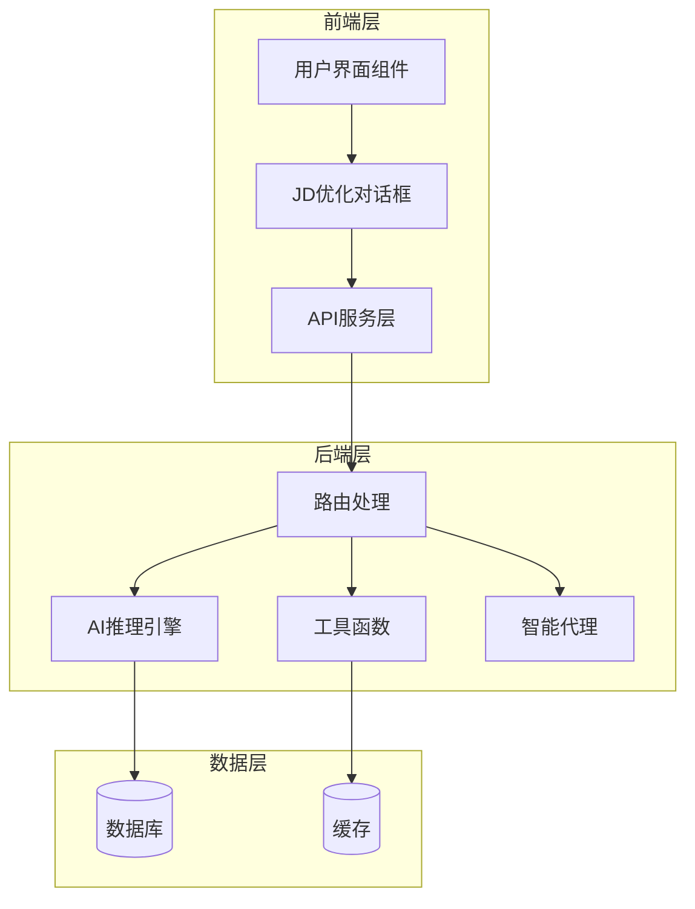
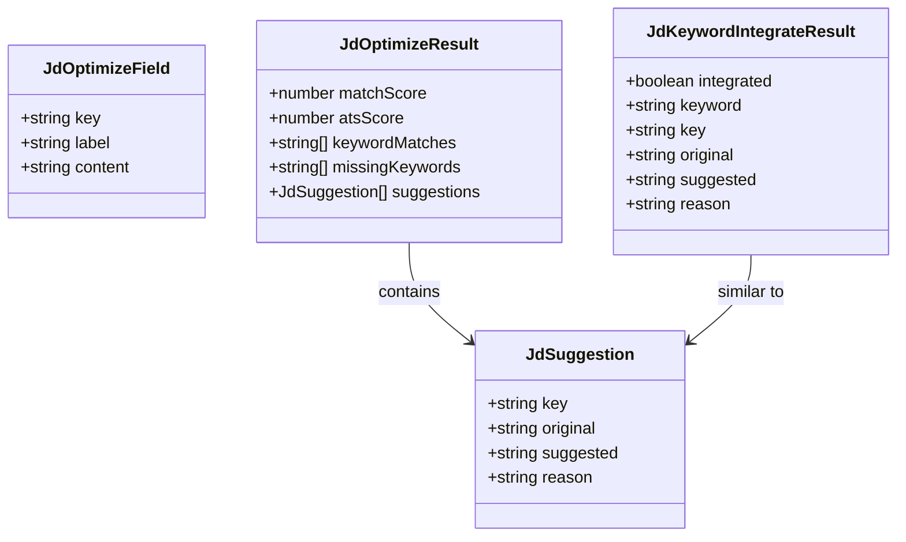
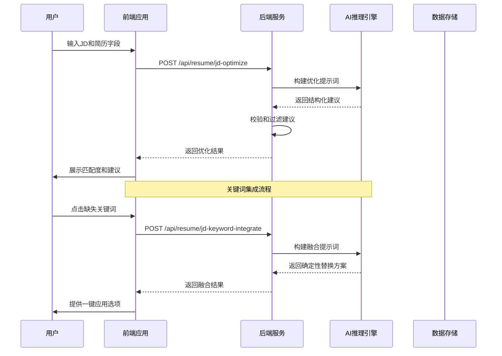
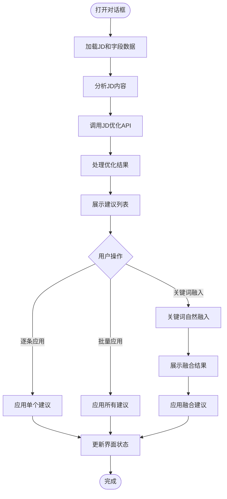
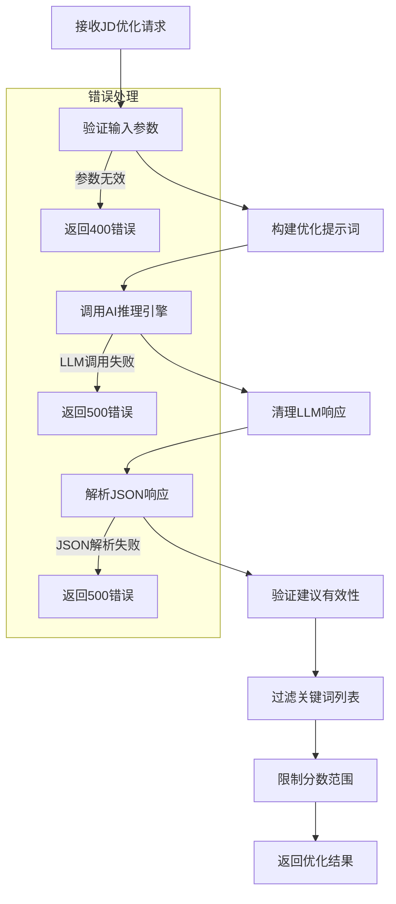
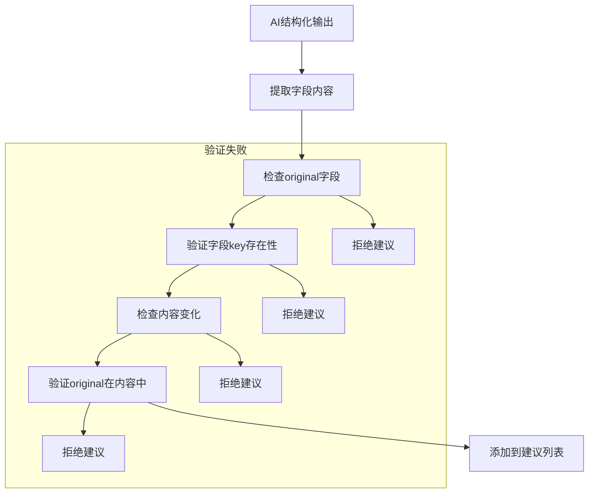
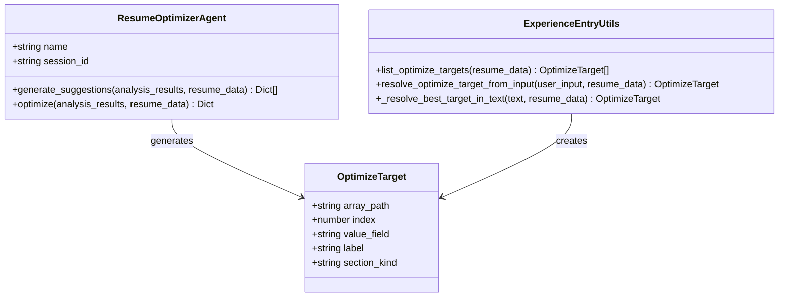
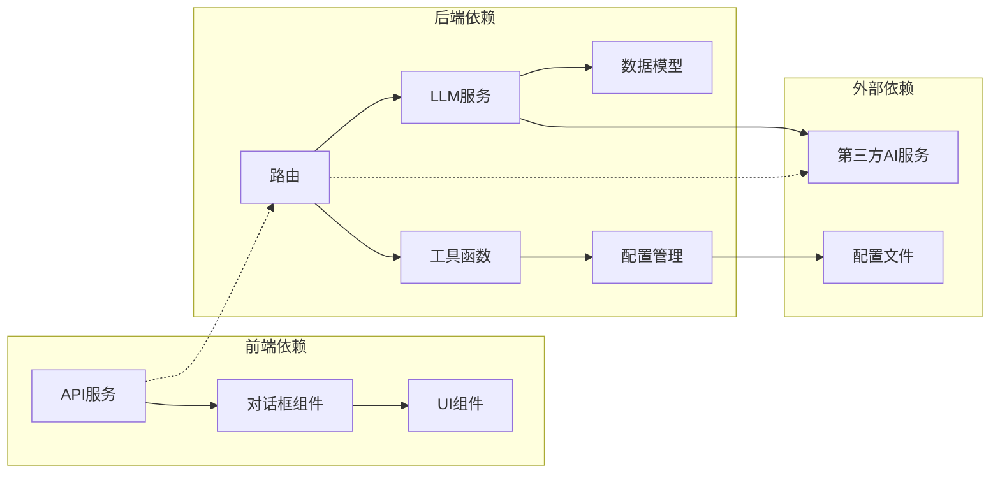
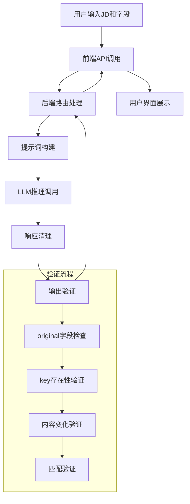
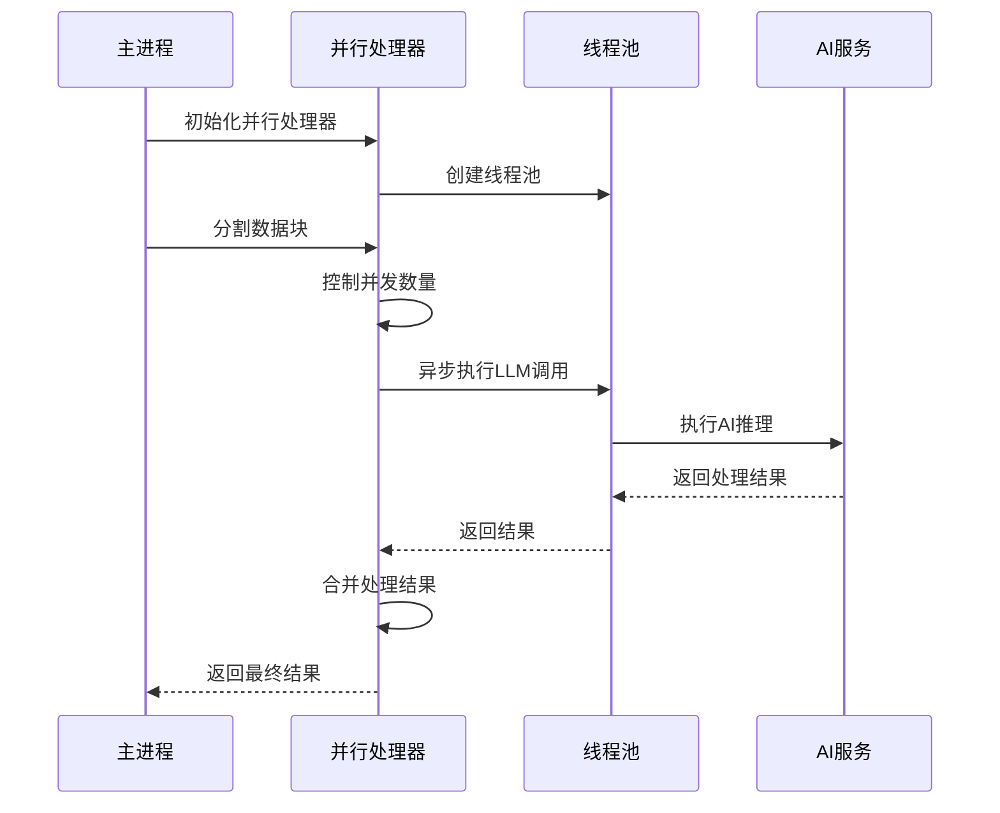

# JD匹配优化

<cite>
**本文档引用的文件**
- [backend/routes/resume.py](file://backend/routes/resume.py)
- [frontend/src/services/api.ts](file://frontend/src/services/api.ts)
- [frontend/src/pages/Workspace/v2/shared/JdOptimizeDialog.tsx](file://frontend/src/pages/Workspace/v2/shared/JdOptimizeDialog.tsx)
- [backend/agent/agent/resume_optimizer.py](file://backend/agent/agent/resume_optimizer.py)
- [backend/agent/utils/experience_entry.py](file://backend/agent/utils/experience_entry.py)
- [backend/parallel_chunk_processor.py](file://backend/parallel_chunk_processor.py)
- [backend/config/parallel_config.py](file://backend/config/parallel_config.py)
- [backend/tests/test_jd_keyword_integrate.py](file://backend/tests/test_jd_keyword_integrate.py)
</cite>

## 目录
1. [简介](#简介)
2. [项目结构](#项目结构)
3. [核心组件](#核心组件)
4. [架构概览](#架构概览)
5. [详细组件分析](#详细组件分析)
6. [依赖关系分析](#依赖关系分析)
7. [性能考虑](#性能考虑)
8. [故障排除指南](#故障排除指南)
9. [结论](#结论)
10. [附录](#附录)

## 简介

JD匹配优化功能是简历编辑器中的核心智能优化组件，旨在帮助用户根据职位描述（JD）自动优化简历内容。该功能通过AI驱动的关键词匹配、ATS兼容性分析和整体匹配度评分，为用户提供精准的简历优化建议。

该系统采用前后端分离架构，前端负责用户交互和界面展示，后端提供AI推理服务和数据处理能力。核心功能包括关键词集成、缺失关键词识别、自然语言融合算法以及批量处理策略。

## 项目结构

简历JD匹配优化功能分布在以下主要模块中：



**图表来源**
- [backend/routes/resume.py:92-100](file://backend/routes/resume.py#L92-L100)
- [frontend/src/services/api.ts:1053-1083](file://frontend/src/services/api.ts#L1053-L1083)

**章节来源**
- [backend/routes/resume.py:1-100](file://backend/routes/resume.py#L1-L100)
- [frontend/src/services/api.ts:1-50](file://frontend/src/services/api.ts#L1-L50)

## 核心组件

### JD优化API接口

系统提供两个核心API接口来实现JD匹配优化功能：

1. **多字段优化接口** (`/api/resume/jd-optimize`)
2. **关键词集成接口** (`/api/resume/jd-keyword-integrate`)

这两个接口共同构成了完整的JD匹配优化解决方案，支持结构化响应和确定性替换。

### 数据模型定义

系统使用标准化的数据模型来确保前后端数据一致性：



**图表来源**
- [frontend/src/services/api.ts:1031-1083](file://frontend/src/services/api.ts#L1031-L1083)

**章节来源**
- [frontend/src/services/api.ts:1031-1083](file://frontend/src/services/api.ts#L1031-L1083)
- [backend/routes/resume.py:422-443](file://backend/routes/resume.py#L422-L443)

## 架构概览

JD匹配优化系统采用分层架构设计，确保功能模块的职责分离和可扩展性：



**图表来源**
- [backend/routes/resume.py:551-660](file://backend/routes/resume.py#L551-L660)
- [frontend/src/services/api.ts:1053-1083](file://frontend/src/services/api.ts#L1053-L1083)

## 详细组件分析

### 前端交互组件

#### JD优化对话框

JD优化对话框是用户与系统交互的主要界面，提供直观的优化建议展示和批量操作功能：



**图表来源**
- [frontend/src/pages/Workspace/v2/shared/JdOptimizeDialog.tsx:84-153](file://frontend/src/pages/Workspace/v2/shared/JdOptimizeDialog.tsx#L84-L153)

#### API服务层

前端API服务封装了所有JD优化相关的HTTP请求，提供了类型安全的接口定义：

**章节来源**
- [frontend/src/pages/Workspace/v2/shared/JdOptimizeDialog.tsx:1-409](file://frontend/src/pages/Workspace/v2/shared/JdOptimizeDialog.tsx#L1-L409)
- [frontend/src/services/api.ts:1053-1083](file://frontend/src/services/api.ts#L1053-L1083)

### 后端处理逻辑

#### JD优化路由处理

后端路由负责接收前端请求、构建AI提示词、调用LLM服务并返回结构化结果：



**图表来源**
- [backend/routes/resume.py:551-612](file://backend/routes/resume.py#L551-L612)

#### 关键词集成处理

关键词集成功能允许将缺失的关键字自然融入简历的最相关字段中：

**章节来源**
- [backend/routes/resume.py:551-682](file://backend/routes/resume.py#L551-L682)

### AI推理引擎

#### 提示词构建策略

系统为不同的优化场景构建专门的提示词模板：

| 场景 | 提示词模板 | 主要要求 |
|------|------------|----------|
| JD优化 | 包含JD文本、简历字段、匹配度评分要求 | 严格的JSON输出格式、关键词匹配识别 |
| 关键词融入 | 包含关键词、JD语境、字段内容 | 确定性替换、自然融入、不可编造事实 |
| 通用体检 | 包含字段内容、评分维度 | 多维度评分、具体改进建议 |

#### 输出验证机制

为了确保AI输出的质量和安全性，系统实现了多层次的验证机制：



**图表来源**
- [backend/routes/resume.py:575-595](file://backend/routes/resume.py#L575-L595)

**章节来源**
- [backend/routes/resume.py:518-548](file://backend/routes/resume.py#L518-L548)
- [backend/routes/resume.py:615-635](file://backend/routes/resume.py#L615-L635)

### 智能代理系统

#### 简历优化代理

简历优化代理负责聚合分析结果并生成具体的优化建议：



**图表来源**
- [backend/agent/agent/resume_optimizer.py:8-63](file://backend/agent/agent/resume_optimizer.py#L8-L63)
- [backend/agent/utils/experience_entry.py:222-348](file://backend/agent/utils/experience_entry.py#L222-L348)

**章节来源**
- [backend/agent/agent/resume_optimizer.py:1-63](file://backend/agent/agent/resume_optimizer.py#L1-L63)
- [backend/agent/utils/experience_entry.py:206-348](file://backend/agent/utils/experience_entry.py#L206-L348)

## 依赖关系分析

### 组件耦合度

系统采用松耦合设计，各组件间通过明确定义的接口进行通信：



**图表来源**
- [backend/routes/resume.py:16-90](file://backend/routes/resume.py#L16-L90)
- [frontend/src/services/api.ts:1-10](file://frontend/src/services/api.ts#L1-L10)

### 数据流图



**图表来源**
- [backend/routes/resume.py:136-161](file://backend/routes/resume.py#L136-L161)
- [backend/routes/resume.py:575-595](file://backend/routes/resume.py#L575-L595)

**章节来源**
- [backend/routes/resume.py:1-100](file://backend/routes/resume.py#L1-L100)
- [frontend/src/services/api.ts:1053-1083](file://frontend/src/services/api.ts#L1053-L1083)

## 性能考虑

### 并行处理优化

系统实现了高效的并行处理机制来提升大规模数据处理性能：



**图表来源**
- [backend/parallel_chunk_processor.py:83-318](file://backend/parallel_chunk_processor.py#L83-L318)

#### 并行配置策略

系统提供了灵活的并行配置选项，根据不同AI提供商的特点进行优化：

| 配置项 | 默认值 | Doubao | Zhipu | Gemini | DeepSeek |
|--------|--------|--------|-------|--------|----------|
| 最大并发数 | 6 | 6 | 6 | 2 | 6 |
| 请求超时 | 30秒 | 25秒 | 15秒 | 40秒 | 30秒 |
| 分块阈值 | 500字符 | - | - | - | - |
| 单块大小 | 300字符 | - | - | - | - |

**章节来源**
- [backend/parallel_chunk_processor.py:83-318](file://backend/parallel_chunk_processor.py#L83-L318)
- [backend/config/parallel_config.py:32-49](file://backend/config/parallel_config.py#L32-L49)

### 内存管理优化

系统采用了多项内存管理策略来确保长时间运行的稳定性：

1. **线程池管理**：合理控制并发线程数量，避免资源过度消耗
2. **超时控制**：设置合理的请求超时时间，防止长时间阻塞
3. **异常处理**：完善的异常捕获和恢复机制
4. **资源清理**：及时释放不再使用的资源

## 故障排除指南

### 常见问题及解决方案

#### API调用失败

**问题症状**：前端收到500错误或网络超时

**可能原因**：
1. AI服务API密钥配置错误
2. 网络连接不稳定
3. 服务器负载过高

**解决方案**：
1. 检查环境变量中的API密钥配置
2. 验证网络连接状态
3. 降低并发请求量
4. 查看服务器日志获取详细错误信息

#### JSON解析错误

**问题症状**：系统提示JSON解析失败

**可能原因**：
1. AI服务返回格式不符合预期
2. 响应内容被意外修改
3. 网络传输过程中数据损坏

**解决方案**：
1. 检查AI服务的响应格式
2. 验证响应内容的完整性
3. 重新发送请求
4. 查看调试日志

#### 关键词融合失败

**问题症状**：关键词无法自然融入简历

**可能原因**：
1. 缺失关键词与简历内容不相关
2. AI理解偏差
3. 字段内容过于简单

**解决方案**：
1. 提供更详细的JD描述
2. 检查简历字段的内容质量
3. 尝试不同的关键词表述
4. 手动调整融合结果

**章节来源**
- [backend/tests/test_jd_keyword_integrate.py:29-76](file://backend/tests/test_jd_keyword_integrate.py#L29-L76)

### 调试技巧

#### 日志分析

系统提供了详细的日志记录机制，有助于问题诊断：

1. **请求日志**：记录所有API请求的详细信息
2. **响应日志**：保存AI服务的原始响应
3. **错误日志**：记录所有异常和错误信息
4. **性能日志**：监控处理时间和资源使用情况

#### 性能监控

建议监控以下关键指标：
- API响应时间
- AI服务调用成功率
- 内存使用情况
- CPU使用率
- 并发处理效率

## 结论

JD匹配优化功能通过智能化的AI推理和严谨的系统设计，为用户提供了高效、准确的简历优化解决方案。系统的核心优势包括：

1. **准确性**：通过严格的输出验证机制确保建议的可靠性
2. **用户体验**：直观的界面设计和流畅的操作体验
3. **性能优化**：高效的并行处理和资源管理
4. **可扩展性**：模块化的架构设计支持功能扩展

该系统不仅能够提升简历与JD的匹配度，还能显著提高ATS系统的兼容性，为求职者创造更好的职业发展机会。

## 附录

### API使用示例

#### 基本使用流程

```typescript
// 1. 准备字段数据
const fields = [
  {
    key: "experience:1",
    label: "项目经验",
    content: "负责后端接口开发，完成订单模块..."
  }
];

// 2. 调用JD优化API
const result = await jdOptimize(fields, "需要具备Kubernetes经验的后端工程师");

// 3. 处理优化结果
if (result.matchScore !== null) {
  console.log(`匹配度: ${result.matchScore}/100`);
  console.log(`ATS兼容度: ${result.atsScore}/100`);
}

// 4. 应用单个建议
const suggestion = result.suggestions[0];
await applySuggestion(suggestion.key, suggestion.original, suggestion.suggested);
```

#### 批量处理策略

系统支持多种批量处理模式：

1. **逐条应用**：用户手动确认每个优化建议
2. **一键应用**：一次性应用所有建议
3. **关键词融入**：将缺失的关键词自然融入简历
4. **条件筛选**：根据匹配度和ATS评分筛选建议

### 性能优化建议

1. **合理设置并发数**：根据网络环境和AI服务特点调整并发配置
2. **缓存机制**：对常用查询结果进行缓存
3. **分页处理**：对于大量数据采用分页处理策略
4. **资源监控**：持续监控系统资源使用情况
5. **错误重试**：实现智能的错误重试机制