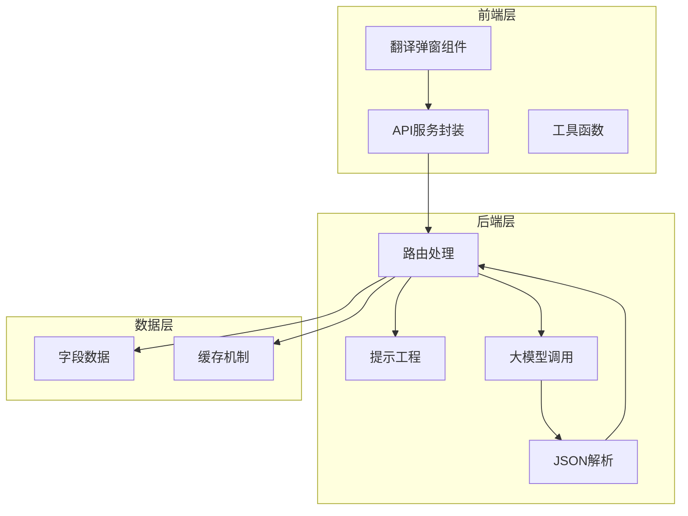
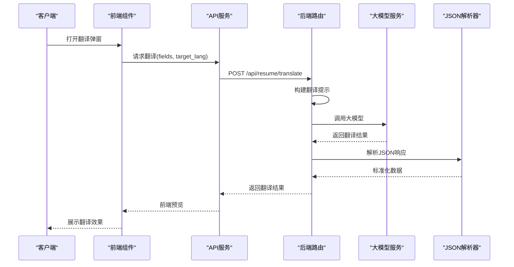
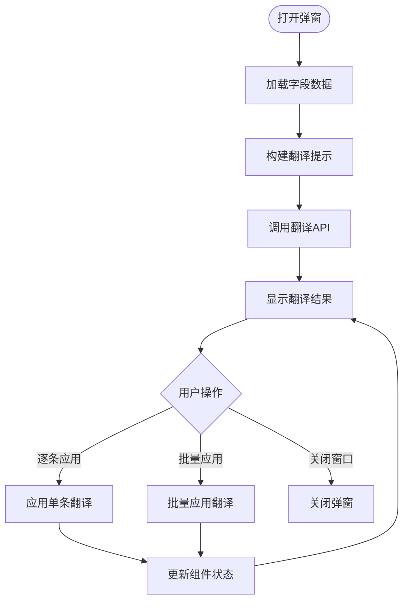
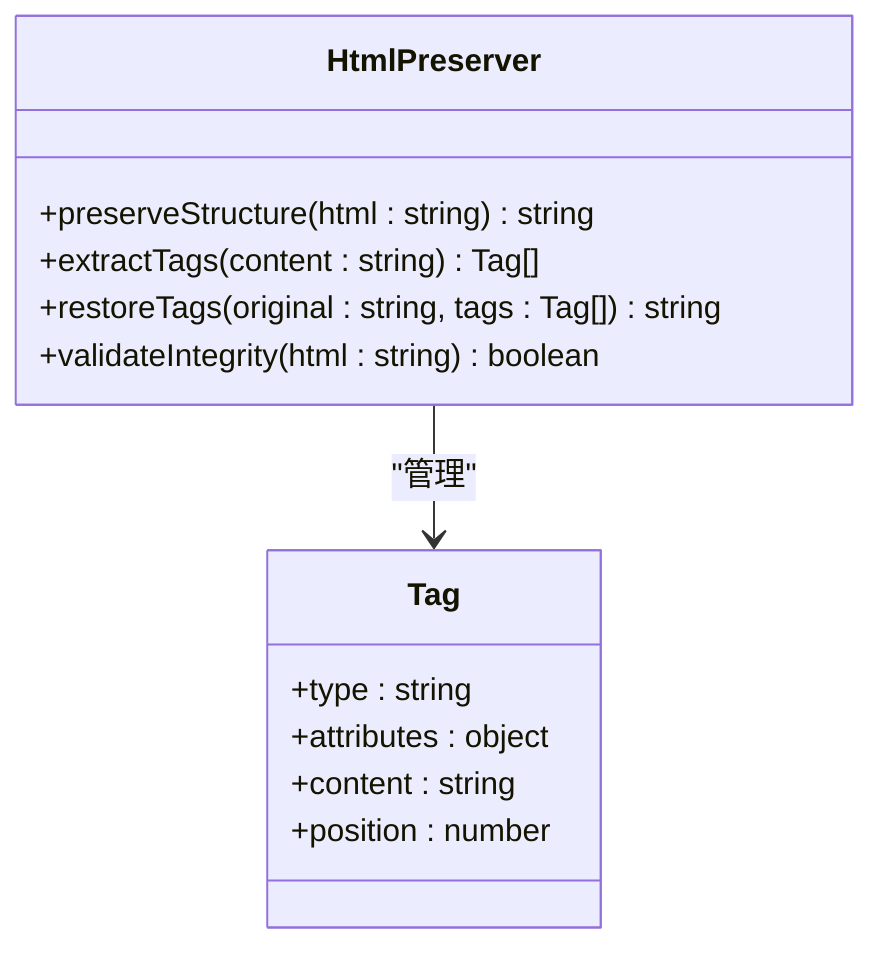
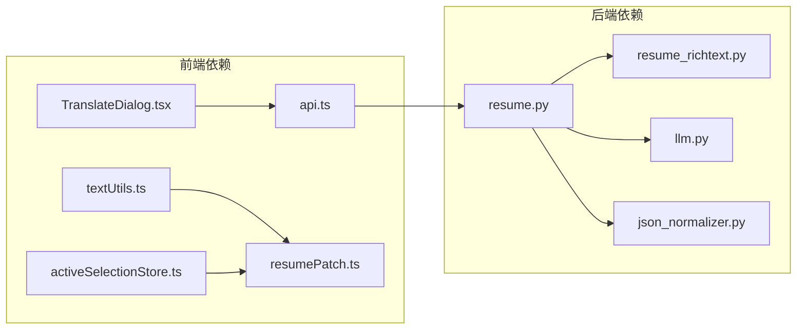

# 多语言翻译服务

<cite>
**本文档引用的文件**
- [backend/routes/resume.py](file://backend/routes/resume.py)
- [frontend/src/services/api.ts](file://frontend/src/services/api.ts)
- [frontend/src/pages/Workspace/v2/shared/TranslateDialog.tsx](file://frontend/src/pages/Workspace/v2/shared/TranslateDialog.tsx)
- [frontend/src/pages/Workspace/v2/utils/textUtils.ts](file://frontend/src/pages/Workspace/v2/utils/textUtils.ts)
- [frontend/src/pages/Workspace/v2/shared/activeSelectionStore.ts](file://frontend/src/pages/Workspace/v2/shared/activeSelectionStore.ts)
- [frontend/src/utils/resumePatch.ts](file://frontend/src/utils/resumePatch.ts)
- [backend/agent/utils/resume_richtext.py](file://backend/agent/utils/resume_richtext.py)
</cite>

## 目录
1. [简介](#简介)
2. [项目结构](#项目结构)
3. [核心组件](#核心组件)
4. [架构概览](#架构概览)
5. [详细组件分析](#详细组件分析)
6. [依赖关系分析](#依赖关系分析)
7. [性能考虑](#性能考虑)
8. [故障排除指南](#故障排除指南)
9. [结论](#结论)
10. [附录](#附录)

## 简介
本项目提供简历多语言翻译服务，支持中英日韩等多种语言的互译。系统通过前后端协作实现高质量的翻译体验，包括：
- 多语言翻译：支持英语、中文、日语、韩语、法语、德语、西班牙语等
- HTML标签保留：完整保留富文本结构，确保翻译后格式不变
- 术语一致性：通过字段级别的翻译控制，保证术语统一
- 并发优化：采用信号量限制并发，提升翻译效率
- 错误恢复：完善的异常处理和重试机制

## 项目结构
翻译服务采用前后端分离架构，主要涉及以下模块：



**图表来源**
- [backend/routes/resume.py:685-723](file://backend/routes/resume.py#L685-L723)
- [frontend/src/services/api.ts:1095-1105](file://frontend/src/services/api.ts#L1095-L1105)

**章节来源**
- [backend/routes/resume.py:1-200](file://backend/routes/resume.py#L1-L200)
- [frontend/src/services/api.ts:1-120](file://frontend/src/services/api.ts#L1-L120)

## 核心组件
翻译服务的核心组件包括：

### 1. 翻译API接口
提供标准化的翻译接口，支持批量字段翻译和单字段翻译。

### 2. 前端翻译弹窗
实现用户友好的翻译界面，支持语言选择、预览和应用功能。

### 3. 提示工程系统
设计专门的翻译提示模板，确保翻译质量和一致性。

### 4. HTML标签保留机制
通过严格的提示规则，确保翻译过程中HTML结构的完整性。

**章节来源**
- [frontend/src/services/api.ts:1095-1105](file://frontend/src/services/api.ts#L1095-L1105)
- [frontend/src/pages/Workspace/v2/shared/TranslateDialog.tsx:1-197](file://frontend/src/pages/Workspace/v2/shared/TranslateDialog.tsx#L1-L197)
- [backend/routes/resume.py:498-515](file://backend/routes/resume.py#L498-L515)

## 架构概览
翻译服务采用分层架构设计，确保系统的可扩展性和维护性：



**图表来源**
- [frontend/src/services/api.ts:1095-1105](file://frontend/src/services/api.ts#L1095-L1105)
- [backend/routes/resume.py:685-723](file://backend/routes/resume.py#L685-L723)

## 详细组件分析

### 翻译API服务
翻译API服务提供标准化的翻译接口，支持多种语言的批量翻译。

#### 接口定义
```typescript
export interface JdOptimizeField {
  key: string
  label: string
  content: string
}

export interface TranslationItem {
  key: string
  original: string
  translated: string
}

export interface TranslateResult {
  translations: TranslationItem[]
}

export async function translateResume(
  fields: JdOptimizeField[], 
  targetLang: string
): Promise<TranslateResult>
```

#### 并发控制机制
后端采用信号量限制并发数量，确保系统稳定性：

```python
sem = asyncio.Semaphore(5)

async def translate_one(f: JdOptimizeField):
    async with sem:
        # 翻译逻辑
        pass
```

**章节来源**
- [frontend/src/services/api.ts:1030-1105](file://frontend/src/services/api.ts#L1030-L1105)
- [backend/routes/resume.py:697-723](file://backend/routes/resume.py#L697-L723)

### 前端翻译弹窗组件
翻译弹窗组件提供用户友好的交互界面，支持语言选择和翻译预览。

#### 主要功能特性
- 语言选择下拉框
- 翻译结果预览面板
- 单条应用和批量应用功能
- 实时加载状态显示

#### 翻译流程


**图表来源**
- [frontend/src/pages/Workspace/v2/shared/TranslateDialog.tsx:40-75](file://frontend/src/pages/Workspace/v2/shared/TranslateDialog.tsx#L40-L75)

**章节来源**
- [frontend/src/pages/Workspace/v2/shared/TranslateDialog.tsx:1-197](file://frontend/src/pages/Workspace/v2/shared/TranslateDialog.tsx#L1-L197)

### HTML标签保留策略
系统实现了严格的HTML标签保留机制，确保翻译过程中的格式完整性。

#### 保留规则
1. **结构完整性**：完整保留HTML标签结构
2. **语义一致性**：确保标签语义不被破坏
3. **样式保持**：维持原有的CSS样式和布局

#### 实现机制


**图表来源**
- [backend/routes/resume.py:505-508](file://backend/routes/resume.py#L505-L508)

**章节来源**
- [backend/routes/resume.py:505-508](file://backend/routes/resume.py#L505-L508)
- [backend/agent/utils/resume_richtext.py:249-257](file://backend/agent/utils/resume_richtext.py#L249-L257)

### 术语一致性处理
系统通过字段级别的翻译控制，确保术语的一致性和准确性。

#### 术语管理机制
1. **字段标识**：每个字段都有唯一的key标识
2. **上下文关联**：翻译时考虑字段的上下文环境
3. **一致性检查**：验证翻译结果的术语一致性

**章节来源**
- [backend/routes/resume.py:701-714](file://backend/routes/resume.py#L701-L714)

## 依赖关系分析



**图表来源**
- [frontend/src/pages/Workspace/v2/shared/TranslateDialog.tsx:1-11](file://frontend/src/pages/Workspace/v2/shared/TranslateDialog.tsx#L1-L11)
- [backend/routes/resume.py:1-50](file://backend/routes/resume.py#L1-L50)

**章节来源**
- [frontend/src/pages/Workspace/v2/shared/TranslateDialog.tsx:1-11](file://frontend/src/pages/Workspace/v2/shared/TranslateDialog.tsx#L1-L11)
- [backend/routes/resume.py:1-50](file://backend/routes/resume.py#L1-L50)

## 性能考虑
翻译服务在设计时充分考虑了性能优化：

### 并发优化
- **信号量控制**：限制同时进行的翻译任务数量
- **异步处理**：使用asyncio.gather并行处理多个字段
- **线程池**：将同步LLM调用放入线程池执行

### 内存管理
- **流式处理**：避免大对象的重复创建
- **及时释放**：及时清理不再使用的中间结果
- **缓存策略**：合理使用缓存减少重复计算

### 网络优化
- **批量请求**：将多个字段的翻译合并为单次请求
- **连接复用**：复用HTTP连接减少建立成本
- **超时控制**：设置合理的超时时间避免资源占用

## 故障排除指南

### 常见问题及解决方案

#### 翻译失败
**症状**：翻译接口返回错误
**原因**：LLM调用失败或JSON解析异常
**解决**：检查网络连接和API密钥配置

#### HTML标签损坏
**症状**：翻译后格式错乱
**原因**：提示模板配置不当
**解决**：确认提示模板中的标签保留规则

#### 术语不一致
**症状**：同一术语在不同字段中翻译不一致
**解决**：检查字段的上下文信息和翻译规则

**章节来源**
- [backend/routes/resume.py:704-708](file://backend/routes/resume.py#L704-L708)

### 调试工具
系统提供了多种调试工具帮助定位问题：

1. **日志追踪**：详细的API调用日志
2. **状态监控**：实时监控翻译进度
3. **错误报告**：自动收集和报告异常信息

## 结论
本多语言翻译服务通过精心设计的架构和严格的实现策略，提供了高质量的简历翻译体验。系统的主要优势包括：

1. **多语言支持**：支持主流语言的互译
2. **格式保持**：完整保留HTML结构和样式
3. **性能优化**：高效的并发处理机制
4. **用户体验**：直观易用的交互界面
5. **质量保证**：完善的错误处理和恢复机制

未来可以进一步优化的方向包括：
- 增加更多语言支持
- 实现翻译记忆功能
- 提供翻译质量评估
- 增强术语库管理

## 附录

### 翻译API使用方法
```typescript
// 基本使用
const fields = [
  { key: 'summary', label: '个人总结', content: '...' },
  { key: 'skills', label: '专业技能', content: '...' }
];

const result = await translateResume(fields, 'en');
console.log(result.translations);
```

### 语言代码映射表
| 语言 | 代码 | 名称 |
|------|------|------|
| 中文 | zh | 中文 |
| 英语 | en | English |
| 日语 | ja | 日本語 |
| 韩语 | ko | 한국어 |
| 法语 | fr | Français |
| 德语 | de | Deutsch |
| 西班牙语 | es | Español |

### 前端预览功能集成
翻译弹窗组件提供了完整的预览和应用功能：

```typescript
// 集成示例
<TranslateDialog
  open={isOpen}
  onOpenChange={setOpen}
  fields={resumeFields}
  onApply={handleApply}
  onApplyBatch={handleApplyBatch}
/>
```

**章节来源**
- [frontend/src/pages/Workspace/v2/shared/TranslateDialog.tsx:31-68](file://frontend/src/pages/Workspace/v2/shared/TranslateDialog.tsx#L31-L68)
- [frontend/src/services/api.ts:1095-1105](file://frontend/src/services/api.ts#L1095-L1105)