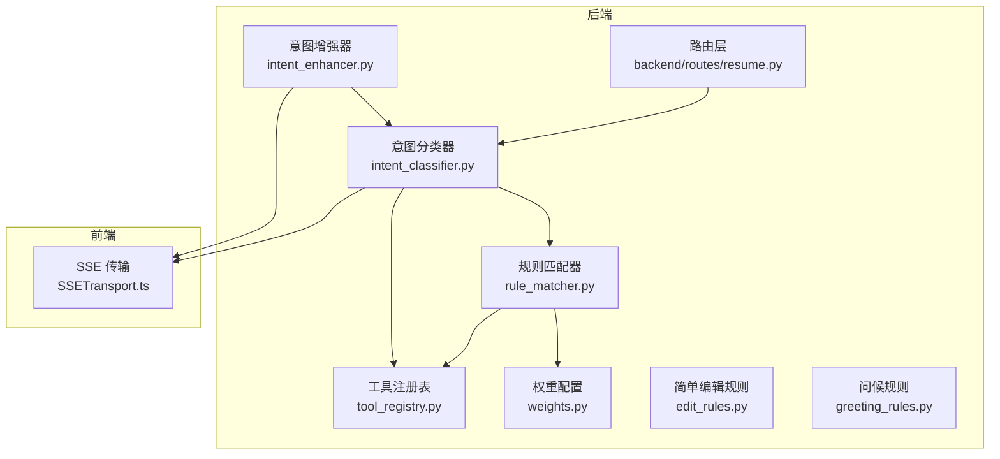
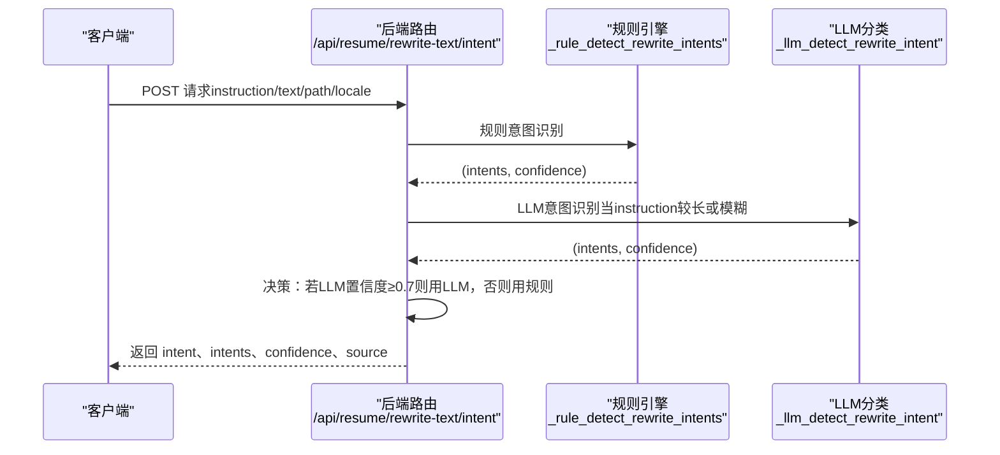
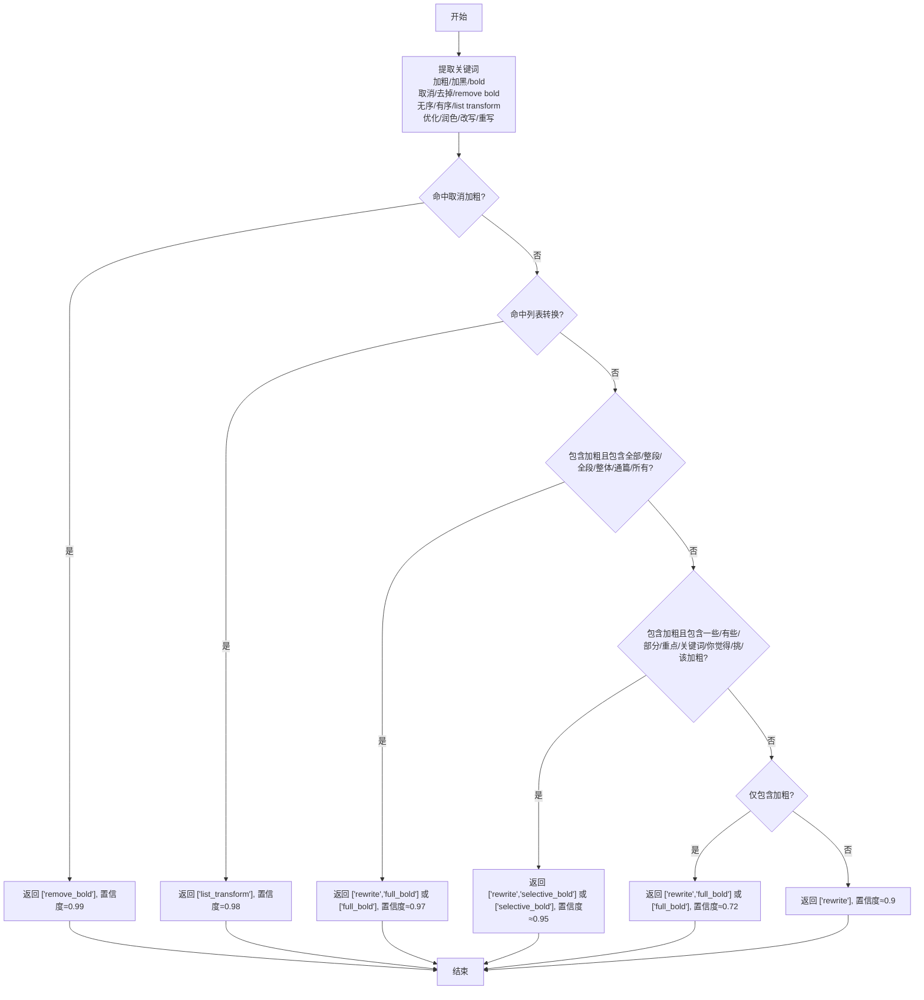
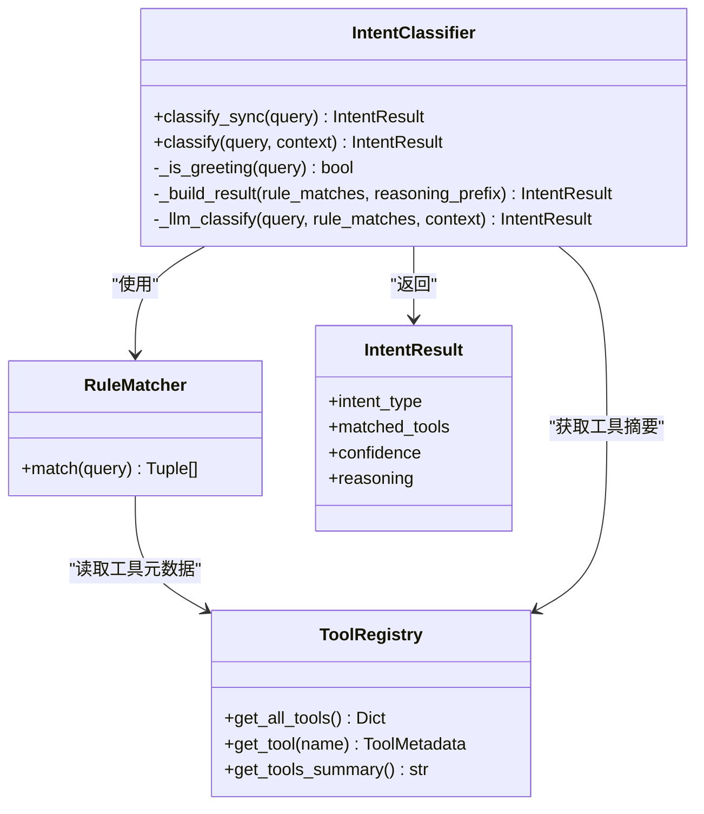
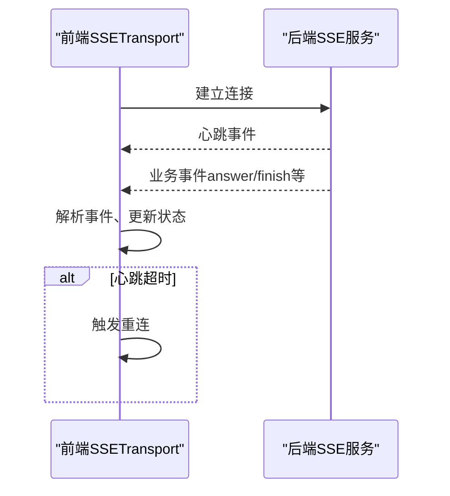
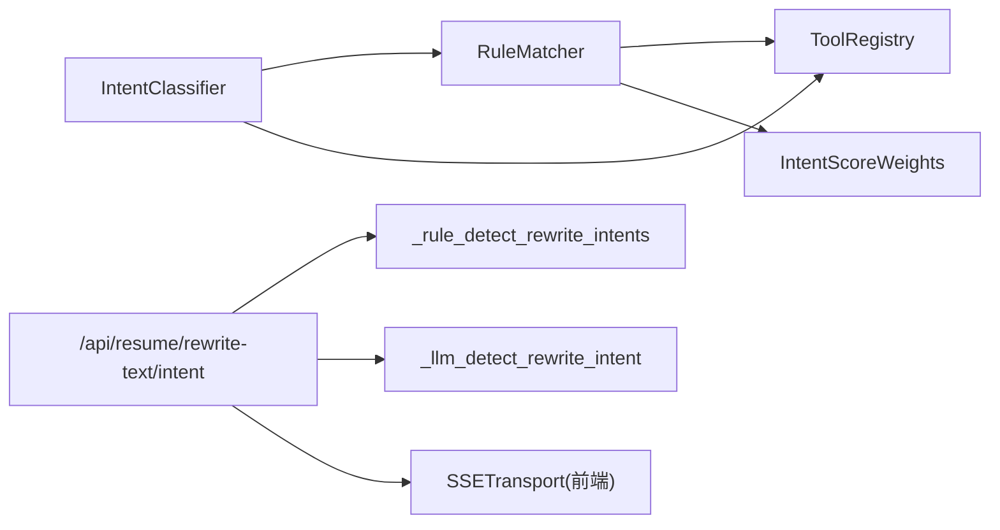

# 意图检测与分类

<cite>
**本文引用的文件**
- [backend/routes/resume.py](file://backend/routes/resume.py)
- [backend/agent/domain/intent/intent_classifier.py](file://backend/agent/domain/intent/intent_classifier.py)
- [backend/agent/domain/intent/rule_matcher.py](file://backend/agent/domain/intent/rule_matcher.py)
- [backend/agent/domain/intent/tool_registry.py](file://backend/agent/domain/intent/tool_registry.py)
- [backend/agent/domain/intent/weights.py](file://backend/agent/domain/intent/weights.py)
- [backend/agent/domain/intent/edit_rules.py](file://backend/agent/domain/intent/edit_rules.py)
- [backend/agent/domain/intent/greeting_rules.py](file://backend/agent/domain/intent/greeting_rules.py)
- [backend/agent/domain/intent/intent_enhancer.py](file://backend/agent/domain/intent/intent_enhancer.py)
- [frontend/src/transports/SSETransport.ts](file://frontend/src/transports/SSETransport.ts)
</cite>

## 目录
1. [简介](#简介)
2. [项目结构](#项目结构)
3. [核心组件](#核心组件)
4. [架构总览](#架构总览)
5. [详细组件分析](#详细组件分析)
6. [依赖关系分析](#依赖关系分析)
7. [性能考量](#性能考量)
8. [故障排查指南](#故障排查指南)
9. [结论](#结论)
10. [附录](#附录)

## 简介
本文件聚焦“简历AI意图检测与分类”能力，围绕两类场景：
- 文本改写意图识别：针对“划词改写”场景，识别 full_bold、selective_bold、remove_bold、list_transform、rewrite 等意图，并给出置信度与来源（规则/LLM）。
- 通用聊天意图分类：基于规则与LLM的混合决策，识别工具特定意图、问候与通用对话。

文档涵盖：
- 规则引擎与LLM混合决策机制
- 意图类型识别逻辑与置信度计算
- 提示工程设计
- 多轮对话上下文处理
- 流式响应机制
- API使用示例与错误处理策略

## 项目结构
与意图检测相关的核心代码分布在后端路由层与意图域（domain/intent）模块，前端通过SSE传输接收流式响应。

**图表来源**
- [backend/routes/resume.py](file://backend/routes/resume.py)
- [backend/agent/domain/intent/intent_classifier.py](file://backend/agent/domain/intent/intent_classifier.py)
- [backend/agent/domain/intent/rule_matcher.py](file://backend/agent/domain/intent/rule_matcher.py)
- [backend/agent/domain/intent/tool_registry.py](file://backend/agent/domain/intent/tool_registry.py)
- [backend/agent/domain/intent/weights.py](file://backend/agent/domain/intent/weights.py)
- [backend/agent/domain/intent/edit_rules.py](file://backend/agent/domain/intent/edit_rules.py)
- [backend/agent/domain/intent/greeting_rules.py](file://backend/agent/domain/intent/greeting_rules.py)
- [backend/agent/domain/intent/intent_enhancer.py](file://backend/agent/domain/intent/intent_enhancer.py)
- [frontend/src/transports/SSETransport.ts](file://frontend/src/transports/SSETransport.ts)

**章节来源**
- [backend/routes/resume.py](file://backend/routes/resume.py)
- [backend/agent/domain/intent/intent_classifier.py](file://backend/agent/domain/intent/intent_classifier.py)
- [backend/agent/domain/intent/rule_matcher.py](file://backend/agent/domain/intent/rule_matcher.py)
- [backend/agent/domain/intent/tool_registry.py](file://backend/agent/domain/intent/tool_registry.py)
- [backend/agent/domain/intent/weights.py](file://backend/agent/domain/intent/weights.py)
- [backend/agent/domain/intent/edit_rules.py](file://backend/agent/domain/intent/edit_rules.py)
- [backend/agent/domain/intent/greeting_rules.py](file://backend/agent/domain/intent/greeting_rules.py)
- [backend/agent/domain/intent/intent_enhancer.py](file://backend/agent/domain/intent/intent_enhancer.py)
- [frontend/src/transports/SSETransport.ts](file://frontend/src/transports/SSETransport.ts)

## 核心组件
- 文本改写意图识别
  - 规则引擎：基于关键词与短语的快速判定，覆盖“加粗/取消加粗/列表转换/通篇/部分”等常见模式。
  - LLM增强：当规则置信度不足时，使用结构化JSON提示进行意图分类与置信度输出。
  - API：POST /api/resume/rewrite-text/intent，返回intent、intents、confidence及来源（rule/llm）。
- 通用聊天意图分类
  - 规则阶段：关键词/正则/描述相似度 + 权重，按置信度排序，最多返回3个候选。
  - LLM阶段：当规则置信度低于阈值时，使用工具摘要与规则结果进行LLM增强分类。
  - 意图类型：tool_specific、general_chat、greeting、unknown。
- 流式响应
  - 后端通过SSE向前端推送事件流；前端SSETransport负责解析、心跳监控与重连。
- 多轮对话上下文
  - 通用聊天支持传入messages与resume_context，构建带上下文的提示词。

**章节来源**
- [backend/routes/resume.py](file://backend/routes/resume.py)
- [backend/agent/domain/intent/intent_classifier.py](file://backend/agent/domain/intent/intent_classifier.py)
- [backend/agent/domain/intent/rule_matcher.py](file://backend/agent/domain/intent/rule_matcher.py)
- [backend/agent/domain/intent/tool_registry.py](file://backend/agent/domain/intent/tool_registry.py)
- [backend/agent/domain/intent/weights.py](file://backend/agent/domain/intent/weights.py)
- [backend/agent/domain/intent/intent_enhancer.py](file://backend/agent/domain/intent/intent_enhancer.py)
- [frontend/src/transports/SSETransport.ts](file://frontend/src/transports/SSETransport.ts)

## 架构总览
文本改写意图识别采用“规则优先 + LLM兜底”的混合策略；通用聊天意图分类采用“规则高置信直接返回 + LLM增强”的两阶段策略。

**图表来源**
- [backend/routes/resume.py](file://backend/routes/resume.py)

**章节来源**
- [backend/routes/resume.py](file://backend/routes/resume.py)

## 详细组件分析

### 文本改写意图识别（规则引擎 + LLM混合）
- 规则引擎
  - 关键词覆盖：加粗/加黑/bold、取消/去掉/不要/remove bold、无序/有序/list transform、优化/润色/改写/重写等。
  - 置信度策略：
    - 精确短语命中（如“去掉加粗”）：高置信度。
    - 列表转换（如“无序列表改成有序列表”）：高置信度。
    - “全部/整段/全段/整体/通篇/所有 + 加粗”：full_bold，若同时包含“优化/润色/改写”，合并为["rewrite","full_bold"]。
    - “一些/有些/部分/重点/关键词/你觉得/挑/该加粗 + 加粗”：selective_bold，若同时包含“优化/润色/改写”，合并为["rewrite","selective_bold"]。
    - 仅有“加粗”：full_bold，置信度中等。
    - 默认：rewrite。
- LLM增强
  - 当规则置信度较低或用户指令模糊时，构造结构化JSON提示，要求模型输出intents与confidence。
  - 解析与校验：清洗LLM输出、提取JSON、规范化意图集合、裁剪至[0,1]区间。
- 决策融合
  - 若LLM置信度≥0.7，优先采用LLM结果；否则采用规则结果。
  - 返回字段：intent、intents、confidence、source（rule/llm）、以及规则与LLM的对比结果。

**图表来源**
- [backend/routes/resume.py](file://backend/routes/resume.py)

**章节来源**
- [backend/routes/resume.py](file://backend/routes/resume.py)

### 通用聊天意图分类（规则 + LLM）
- 规则阶段
  - 关键词匹配：短/长关键词分别赋予不同权重，上限由权重配置控制。
  - 正则模式匹配：对每个工具的pattern进行一次匹配计分。
  - 描述相似度：对工具描述中的词进行匹配计分，限制最高分。
  - 优先级权重：乘以工具优先级，过滤低于最低阈值的匹配。
  - 排序与裁剪：按置信度降序，最多返回3个。
- LLM阶段
  - 当规则最高置信度低于阈值（如0.7）或未匹配时，使用工具摘要与规则结果进行提示词增强。
  - 提示词要求模型输出intent_type、matched_tools、confidence与reasoning。
  - 异常回退：LLM失败时回退到规则结果。
- 意图类型
  - tool_specific：明确需要某个工具。
  - general_chat：普通对话。
  - greeting：问候。
  - unknown：未知意图。

**图表来源**
- [backend/agent/domain/intent/intent_classifier.py](file://backend/agent/domain/intent/intent_classifier.py)
- [backend/agent/domain/intent/rule_matcher.py](file://backend/agent/domain/intent/rule_matcher.py)
- [backend/agent/domain/intent/tool_registry.py](file://backend/agent/domain/intent/tool_registry.py)

**章节来源**
- [backend/agent/domain/intent/intent_classifier.py](file://backend/agent/domain/intent/intent_classifier.py)
- [backend/agent/domain/intent/rule_matcher.py](file://backend/agent/domain/intent/rule_matcher.py)
- [backend/agent/domain/intent/tool_registry.py](file://backend/agent/domain/intent/tool_registry.py)
- [backend/agent/domain/intent/weights.py](file://backend/agent/domain/intent/weights.py)

### 提示工程设计
- 文本改写意图分类提示
  - 明确意图集合与JSON输出约束，限定字段（intents、confidence）。
  - 提供语言、路径、用户指令与源文本片段，便于模型理解上下文。
- 通用聊天意图分类提示
  - 展示工具摘要与规则匹配结果，降低幻觉概率。
  - 低temperature设置，提升稳定性。
- 输出解析与校验
  - 清洗代码块标记与多余内容，尝试提取JSON主体。
  - 校验意图集合合法性，归一化并裁剪置信度范围。

**章节来源**
- [backend/routes/resume.py](file://backend/routes/resume.py)
- [backend/agent/domain/intent/intent_classifier.py](file://backend/agent/domain/intent/intent_classifier.py)

### 多轮对话上下文处理
- 文本改写意图API
  - 支持传入path与locale，便于模型理解字段路径与语言。
- 通用聊天API
  - 支持messages与resume_context，构建带上下文的历史对话与简历背景。
  - 前端通过SSETransport维护conversation_id与lastEventId，实现断线续连与心跳检测。

**章节来源**
- [backend/routes/resume.py](file://backend/routes/resume.py)
- [frontend/src/transports/SSETransport.ts](file://frontend/src/transports/SSETransport.ts)

### 流式响应机制
- 后端
  - SSE事件流：事件类型、数据体、时间戳、心跳等。
  - 心跳超时检测与自动重连。
- 前端
  - 事件解析：按“事件块”切分，处理心跳与业务事件。
  - 生命周期管理：连接建立、断开、异常处理与重连策略。

**图表来源**
- [frontend/src/transports/SSETransport.ts](file://frontend/src/transports/SSETransport.ts)

**章节来源**
- [frontend/src/transports/SSETransport.ts](file://frontend/src/transports/SSETransport.ts)

## 依赖关系分析
- 组件耦合
  - 规则匹配器依赖工具注册表与权重配置，耦合度适中。
  - 意图分类器依赖规则匹配器与工具注册表，可插拔LLM客户端。
  - 文本改写意图识别独立于通用聊天意图分类，但共享提示工程与输出解析策略。
- 外部依赖
  - LLM调用封装（call_llm/call_llm_stream）与默认提供商常量。
  - 前端SSETransport负责与后端SSE服务交互。

**图表来源**
- [backend/agent/domain/intent/rule_matcher.py](file://backend/agent/domain/intent/rule_matcher.py)
- [backend/agent/domain/intent/tool_registry.py](file://backend/agent/domain/intent/tool_registry.py)
- [backend/agent/domain/intent/weights.py](file://backend/agent/domain/intent/weights.py)
- [backend/agent/domain/intent/intent_classifier.py](file://backend/agent/domain/intent/intent_classifier.py)
- [backend/routes/resume.py](file://backend/routes/resume.py)
- [frontend/src/transports/SSETransport.ts](file://frontend/src/transports/SSETransport.ts)

**章节来源**
- [backend/agent/domain/intent/rule_matcher.py](file://backend/agent/domain/intent/rule_matcher.py)
- [backend/agent/domain/intent/tool_registry.py](file://backend/agent/domain/intent/tool_registry.py)
- [backend/agent/domain/intent/weights.py](file://backend/agent/domain/intent/weights.py)
- [backend/agent/domain/intent/intent_classifier.py](file://backend/agent/domain/intent/intent_classifier.py)
- [backend/routes/resume.py](file://backend/routes/resume.py)
- [frontend/src/transports/SSETransport.ts](file://frontend/src/transports/SSETransport.ts)

## 性能考量
- 规则优先：规则匹配O(N工具)且无外部调用，延迟低、吞吐高。
- LLM兜底：仅在规则置信度不足时触发，减少昂贵调用。
- 并发与限流：前端翻译接口使用信号量限制并发，避免单次响应过大。
- 输出解析健壮性：对LLM输出进行清洗与JSON提取，提高鲁棒性。

[本节为通用指导，不直接分析具体文件]

## 故障排查指南
- 文本改写意图API
  - instruction为空：返回400错误。
  - LLM调用失败：捕获异常并返回500。
  - JSON解析失败：返回500并提示解析错误。
- 通用聊天意图分类
  - LLM不可用：抛出异常，分类器记录警告并回退规则。
  - 输出格式不符：提示词要求严格JSON，解析不到JSON主体时抛出异常。
- 流式响应
  - 心跳超时：前端检测到长时间无心跳事件，触发重连。
  - 断线重连：保存conversation_id与lastEventId，恢复会话。

**章节来源**
- [backend/routes/resume.py](file://backend/routes/resume.py)
- [backend/agent/domain/intent/intent_classifier.py](file://backend/agent/domain/intent/intent_classifier.py)
- [frontend/src/transports/SSETransport.ts](file://frontend/src/transports/SSETransport.ts)

## 结论
本项目在“简历AI意图检测与分类”方面实现了“规则优先、LLM兜底”的稳健混合策略：
- 文本改写意图识别具备明确的规则分支与置信度策略，并在必要时由LLM增强。
- 通用聊天意图分类通过规则与LLM双通道，兼顾速度与准确性。
- 前后端配合完善，支持多轮对话上下文与流式响应，具备良好的可扩展性与可维护性。

[本节为总结，不直接分析具体文件]

## 附录

### API使用示例（文本改写意图识别）
- 请求
  - 方法：POST
  - 路径：/api/resume/rewrite-text/intent
  - 参数：
    - provider：可选，AI提供商
    - text：选中文本片段
    - instruction：改写指令
    - path：可选，字段路径提示
    - locale：可选，语言代码
- 响应
  - intent：最终意图（如 full_bold/selective_bold/remove_bold/list_transform/rewrite）
  - intents：所有识别到的意图列表
  - confidence：置信度（0~1）
  - source：来源（rule/llm）
  - rule_* 与 llm_*：规则与LLM结果的对比字段

**章节来源**
- [backend/routes/resume.py](file://backend/routes/resume.py)

### 简单编辑规则（fast rules）
- 用途：对“把…改成…”等简单编辑指令进行确定性解析，映射到简历字段路径。
- 支持：姓名、电话、邮箱、现居地、求职意向、实习公司等常见字段。
- 作用：为通用聊天意图分类提供基础规则支撑。

**章节来源**
- [backend/agent/domain/intent/edit_rules.py](file://backend/agent/domain/intent/edit_rules.py)