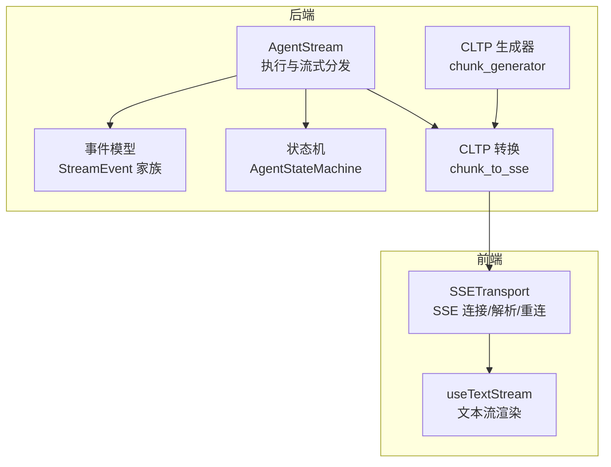
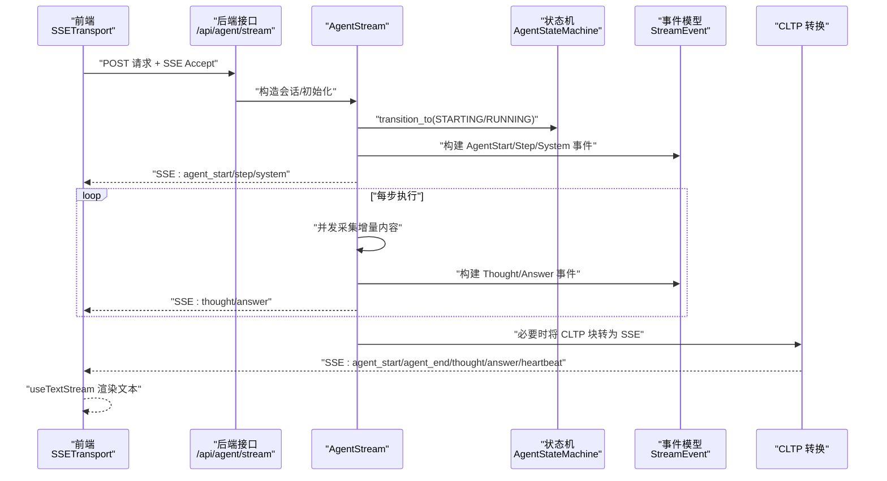
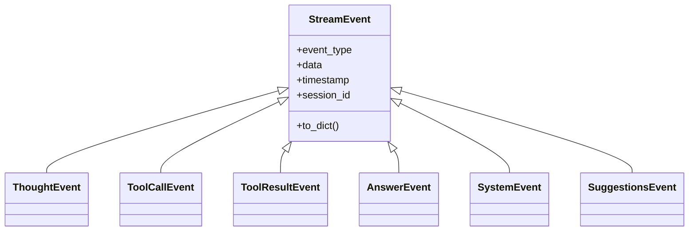
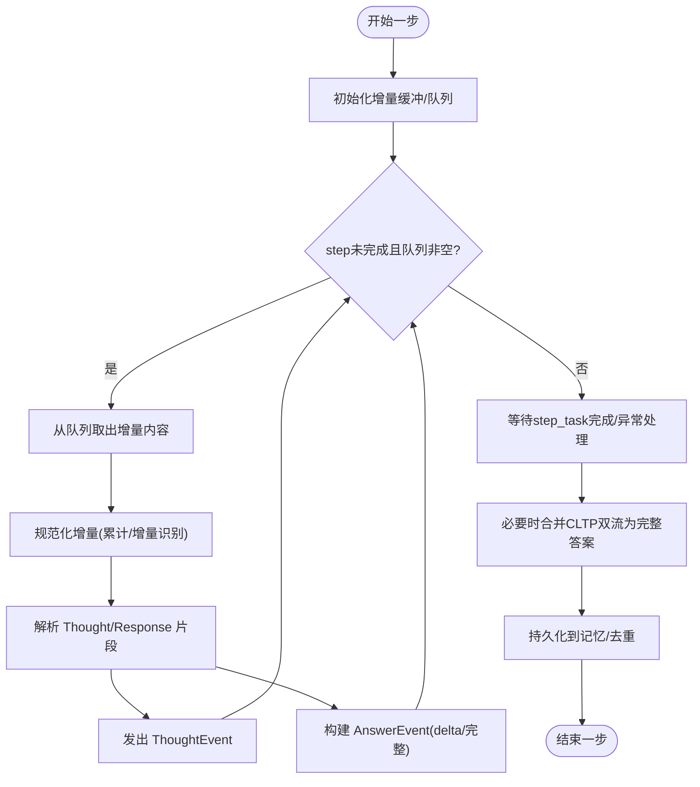
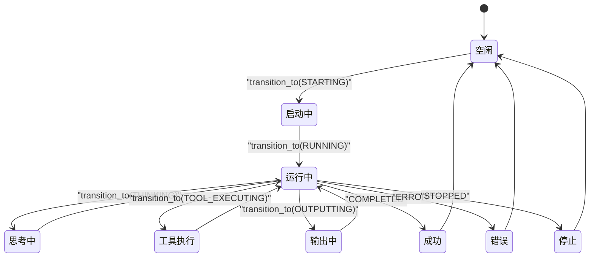
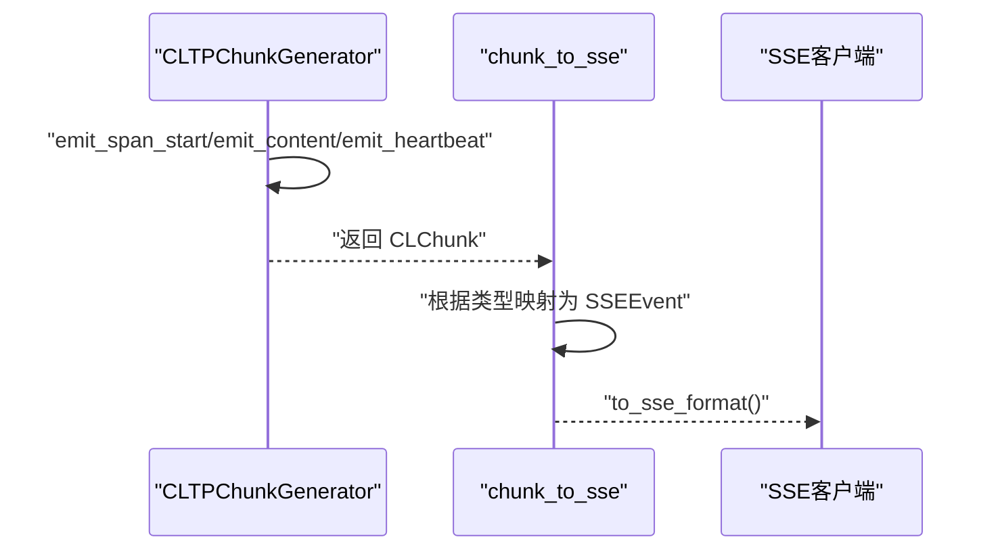
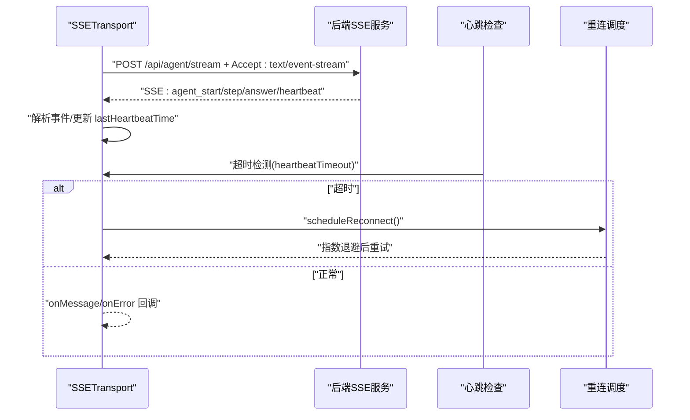
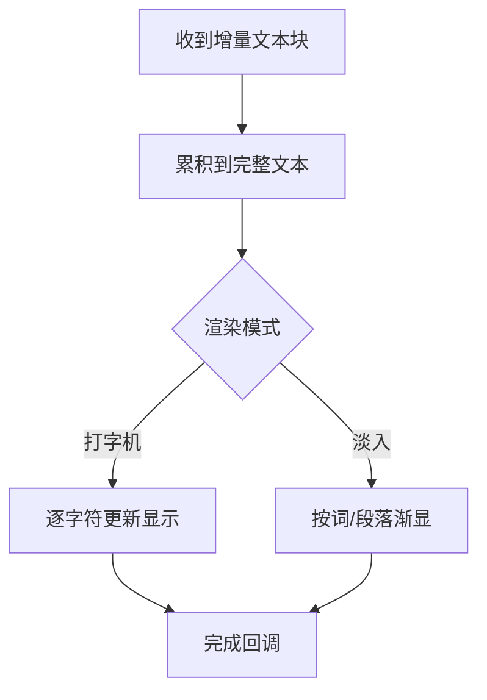
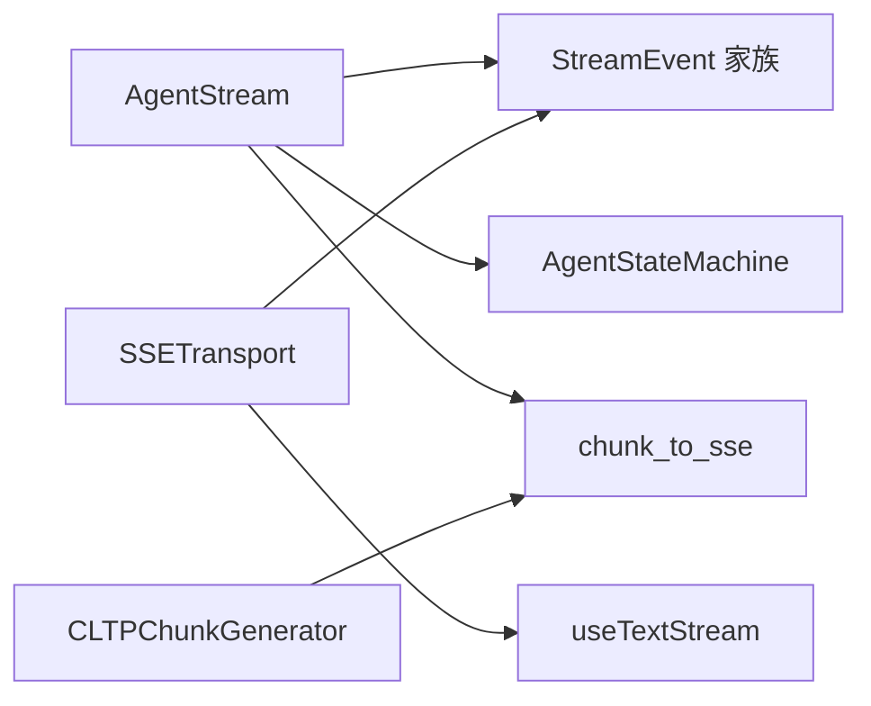

# 流式处理与实时响应

<cite>
**本文引用的文件**
- [backend/agent/web/streaming/agent_stream.py](file://backend/agent/web/streaming/agent_stream.py)
- [backend/agent/web/streaming/events.py](file://backend/agent/web/streaming/events.py)
- [backend/agent/web/streaming/state_machine.py](file://backend/agent/web/streaming/state_machine.py)
- [backend/agent/web/streaming/agent_state.py](file://backend/agent/web/streaming/agent_state.py)
- [backend/agent/cltp/chunk_to_sse.py](file://backend/agent/cltp/chunk_to_sse.py)
- [backend/agent/cltp/chunk_generator.py](file://backend/agent/cltp/chunk_generator.py)
- [frontend/src/transports/SSETransport.ts](file://frontend/src/transports/SSETransport.ts)
- [frontend/src/hooks/useTextStream.ts](file://frontend/src/hooks/useTextStream.ts)
</cite>

## 目录
1. [简介](#简介)
2. [项目结构](#项目结构)
3. [核心组件](#核心组件)
4. [架构总览](#架构总览)
5. [详细组件分析](#详细组件分析)
6. [依赖关系分析](#依赖关系分析)
7. [性能考量](#性能考量)
8. [故障排查指南](#故障排查指南)
9. [结论](#结论)
10. [附录](#附录)

## 简介
本文件聚焦于简历AI的“流式处理与实时响应”能力，围绕SSE（Server-Sent Events）流式传输机制、实时AI响应生成与前端交互优化展开。文档解释了从后端事件模型、状态机与流式执行，到SSE转换、前端解析与自动重连的完整链路；并给出流式API设计模式、错误恢复与重连策略、前端集成要点、性能监控与调试技巧。

## 项目结构
本功能横跨后端Python与前端TypeScript两大侧：
- 后端负责：
  - 事件模型定义与序列化（StreamEvent家族）
  - 状态机驱动的执行生命周期管理
  - 真·流式执行与增量内容分发
  - CLTP（兼容层）到SSE的转换
- 前端负责：
  - SSETransport：HTTP + SSE的稳定连接、心跳检测、自动重连
  - useTextStream：将增量文本流以打字机/淡入等模式渲染

图表来源
- [backend/agent/web/streaming/agent_stream.py:476-800](file://backend/agent/web/streaming/agent_stream.py#L476-L800)
- [backend/agent/web/streaming/events.py:15-415](file://backend/agent/web/streaming/events.py#L15-L415)
- [backend/agent/web/streaming/state_machine.py:26-247](file://backend/agent/web/streaming/state_machine.py#L26-L247)
- [backend/agent/cltp/chunk_to_sse.py:12-114](file://backend/agent/cltp/chunk_to_sse.py#L12-L114)
- [backend/agent/cltp/chunk_generator.py:33-217](file://backend/agent/cltp/chunk_generator.py#L33-L217)
- [frontend/src/transports/SSETransport.ts:34-439](file://frontend/src/transports/SSETransport.ts#L34-L439)
- [frontend/src/hooks/useTextStream.ts:44-175](file://frontend/src/hooks/useTextStream.ts#L44-L175)

章节来源
- [backend/agent/web/streaming/agent_stream.py:1-800](file://backend/agent/web/streaming/agent_stream.py#L1-L800)
- [backend/agent/web/streaming/events.py:1-415](file://backend/agent/web/streaming/events.py#L1-L415)
- [backend/agent/web/streaming/state_machine.py:1-247](file://backend/agent/web/streaming/state_machine.py#L1-L247)
- [backend/agent/cltp/chunk_to_sse.py:1-114](file://backend/agent/cltp/chunk_to_sse.py#L1-L114)
- [backend/agent/cltp/chunk_generator.py:1-217](file://backend/agent/cltp/chunk_generator.py#L1-L217)
- [frontend/src/transports/SSETransport.ts:1-439](file://frontend/src/transports/SSETransport.ts#L1-L439)
- [frontend/src/hooks/useTextStream.ts:1-175](file://frontend/src/hooks/useTextStream.ts#L1-L175)

## 核心组件
- 事件模型与序列化
  - StreamEvent基类与具体事件类型（思考、工具调用/结果、回答、系统消息、建议按钮等）
  - to_dict兼容前端格式，便于SSE传输
- 状态机
  - 统一的状态流转与终端态判定，支持错误回调与停止信号
- 真·流式执行
  - AgentStream在每步执行中维护增量缓冲，区分“思考/响应”片段，构建AnswerEvent并去重
- CLTP到SSE
  - 将Span/Content/Heartbeat等CLTP块转换为SSE事件，保证文本内容原样透传
- 前端SSE传输
  - SSETransport封装fetch + ReadableStream，解析事件、心跳检测、指数退避重连
- 文本流渲染
  - useTextStream将增量文本流以打字机/淡入模式渲染，支持暂停/恢复/重置

章节来源
- [backend/agent/web/streaming/events.py:15-415](file://backend/agent/web/streaming/events.py#L15-L415)
- [backend/agent/web/streaming/state_machine.py:26-247](file://backend/agent/web/streaming/state_machine.py#L26-L247)
- [backend/agent/web/streaming/agent_stream.py:224-800](file://backend/agent/web/streaming/agent_stream.py#L224-L800)
- [backend/agent/cltp/chunk_to_sse.py:12-114](file://backend/agent/cltp/chunk_to_sse.py#L12-L114)
- [frontend/src/transports/SSETransport.ts:34-439](file://frontend/src/transports/SSETransport.ts#L34-L439)
- [frontend/src/hooks/useTextStream.ts:44-175](file://frontend/src/hooks/useTextStream.ts#L44-L175)

## 架构总览
整体链路由“后端执行 → 事件/分块 → SSE → 前端解析/渲染 → 用户感知”构成。后端通过AgentStream与状态机协调，结合CLTP兼容层，将LLM/工具调用的增量输出转化为SSE事件；前端以SSETransport接收并解析，再由useTextStream进行UI层面的文本渲染与动画。

图表来源
- [backend/agent/web/streaming/agent_stream.py:476-800](file://backend/agent/web/streaming/agent_stream.py#L476-L800)
- [backend/agent/web/streaming/state_machine.py:102-151](file://backend/agent/web/streaming/state_machine.py#L102-L151)
- [backend/agent/web/streaming/events.py:55-242](file://backend/agent/web/streaming/events.py#L55-L242)
- [backend/agent/cltp/chunk_to_sse.py:12-114](file://backend/agent/cltp/chunk_to_sse.py#L12-L114)
- [frontend/src/transports/SSETransport.ts:65-163](file://frontend/src/transports/SSETransport.ts#L65-L163)
- [frontend/src/hooks/useTextStream.ts:100-139](file://frontend/src/hooks/useTextStream.ts#L100-L139)

## 详细组件分析

### 后端事件模型与SSE输出
- 事件类型覆盖思考、工具调用/结果、最终回答、系统消息、建议按钮、简历更新等
- 事件序列化to_dict兼容前端期望字段（如answer事件包含content/delta/is_complete/event_seq）
- SSETransport仅消费SSE事件，不关心内部状态机细节

图表来源
- [backend/agent/web/streaming/events.py:55-415](file://backend/agent/web/streaming/events.py#L55-L415)

章节来源
- [backend/agent/web/streaming/events.py:15-415](file://backend/agent/web/streaming/events.py#L15-L415)

### 真·流式执行与增量分发
- AgentStream在每步执行中：
  - 并发采集增量内容（支持累计/增量两种模式）
  - 解析“思考/响应”片段，分别发出ThoughtEvent与AnswerEvent
  - 去重集合与指纹校验，避免重复事件
  - 支持停止信号（用户中断/会话切换），及时取消任务
- 对齐CLTP的thinking/content双流场景，合并为最终完整答案与建议项

图表来源
- [backend/agent/web/streaming/agent_stream.py:564-791](file://backend/agent/web/streaming/agent_stream.py#L564-L791)

章节来源
- [backend/agent/web/streaming/agent_stream.py:224-800](file://backend/agent/web/streaming/agent_stream.py#L224-L800)

### 状态机与生命周期
- AgentState枚举定义起止与活跃态，can_transition_to约束合法流转
- AgentStateMachine提供锁保护的transition_to、错误回调、停止请求、历史记录
- 前端通过SSETransport监听系统事件与心跳，实现连接健康度判断

图表来源
- [backend/agent/web/streaming/agent_state.py:12-115](file://backend/agent/web/streaming/agent_state.py#L12-L115)
- [backend/agent/web/streaming/state_machine.py:102-151](file://backend/agent/web/streaming/state_machine.py#L102-L151)

章节来源
- [backend/agent/web/streaming/agent_state.py:1-169](file://backend/agent/web/streaming/agent_state.py#L1-L169)
- [backend/agent/web/streaming/state_machine.py:1-247](file://backend/agent/web/streaming/state_machine.py#L1-L247)

### CLTP到SSE转换与兼容
- CLTPChunkGenerator生成Span/Content/Heartbeat块，维护会话状态与消息序号
- chunk_to_sse将CLTP块映射为SSE事件（agent_start/end、thought、answer、heartbeat等），保持文本原样
- 保障现有SSE消费者无需改动即可消费新格式

图表来源
- [backend/agent/cltp/chunk_generator.py:33-217](file://backend/agent/cltp/chunk_generator.py#L33-L217)
- [backend/agent/cltp/chunk_to_sse.py:12-114](file://backend/agent/cltp/chunk_to_sse.py#L12-L114)

章节来源
- [backend/agent/cltp/chunk_generator.py:1-217](file://backend/agent/cltp/chunk_generator.py#L1-L217)
- [backend/agent/cltp/chunk_to_sse.py:1-114](file://backend/agent/cltp/chunk_to_sse.py#L1-L114)

### 前端SSE传输与自动重连
- SSETransport基于fetch + ReadableStream解析SSE，支持心跳超时检测与指数退避重连
- 自动注入认证头、记录conversation_id、支持断线续聊
- 前端监听系统事件与心跳，异常时触发重连流程

图表来源
- [frontend/src/transports/SSETransport.ts:65-163](file://frontend/src/transports/SSETransport.ts#L65-L163)
- [frontend/src/transports/SSETransport.ts:286-309](file://frontend/src/transports/SSETransport.ts#L286-L309)
- [frontend/src/transports/SSETransport.ts:407-422](file://frontend/src/transports/SSETransport.ts#L407-L422)

章节来源
- [frontend/src/transports/SSETransport.ts:1-439](file://frontend/src/transports/SSETransport.ts#L1-L439)

### 前端文本流渲染与交互
- useTextStream将增量文本流直接呈现，支持打字机/淡入两种模式
- 提供暂停/恢复/重置能力，便于用户控制阅读节奏
- 与SSETransport解耦，仅依赖文本流输入

图表来源
- [frontend/src/hooks/useTextStream.ts:100-139](file://frontend/src/hooks/useTextStream.ts#L100-L139)

章节来源
- [frontend/src/hooks/useTextStream.ts:1-175](file://frontend/src/hooks/useTextStream.ts#L1-L175)

## 依赖关系分析
- 后端
  - AgentStream依赖事件模型与状态机，同时兼容CLTP转换
  - CLTP生成器与转换器共同保证向后兼容
- 前端
  - SSETransport独立于后端状态机，专注SSE协议与重连
  - useTextStream独立于SSETransport，专注渲染体验

图表来源
- [backend/agent/web/streaming/agent_stream.py:178-195](file://backend/agent/web/streaming/agent_stream.py#L178-L195)
- [backend/agent/web/streaming/events.py:55-415](file://backend/agent/web/streaming/events.py#L55-L415)
- [backend/agent/web/streaming/state_machine.py:26-151](file://backend/agent/web/streaming/state_machine.py#L26-L151)
- [backend/agent/cltp/chunk_to_sse.py:12-114](file://backend/agent/cltp/chunk_to_sse.py#L12-L114)
- [backend/agent/cltp/chunk_generator.py:33-217](file://backend/agent/cltp/chunk_generator.py#L33-L217)
- [frontend/src/transports/SSETransport.ts:34-163](file://frontend/src/transports/SSETransport.ts#L34-L163)
- [frontend/src/hooks/useTextStream.ts:44-139](file://frontend/src/hooks/useTextStream.ts#L44-L139)

章节来源
- [backend/agent/web/streaming/agent_stream.py:178-195](file://backend/agent/web/streaming/agent_stream.py#L178-L195)
- [backend/agent/web/streaming/events.py:55-415](file://backend/agent/web/streaming/events.py#L55-L415)
- [backend/agent/web/streaming/state_machine.py:26-151](file://backend/agent/web/streaming/state_machine.py#L26-L151)
- [backend/agent/cltp/chunk_to_sse.py:12-114](file://backend/agent/cltp/chunk_to_sse.py#L12-L114)
- [backend/agent/cltp/chunk_generator.py:33-217](file://backend/agent/cltp/chunk_generator.py#L33-L217)
- [frontend/src/transports/SSETransport.ts:34-163](file://frontend/src/transports/SSETransport.ts#L34-L163)
- [frontend/src/hooks/useTextStream.ts:44-139](file://frontend/src/hooks/useTextStream.ts#L44-L139)

## 性能考量
- 后端
  - 增量缓冲与去重：避免重复事件与冗余存储
  - 并发采集与异步队列：提升吞吐，降低首字节延迟
  - 文本原样透传：减少额外编码/解码开销
- 前端
  - SSE解析采用流式TextDecoder，低延迟展示
  - 渲染模式选择：打字机适合沉浸感，淡入适合可读性
  - 心跳超时与指数退避：平衡稳定性与资源占用

## 故障排查指南
- 连接失败
  - 检查SSETransport的onError回调与日志，确认网络/鉴权/服务可用性
  - 若响应体为空或不可读，需在后端确保SSE输出与头部设置正确
- 心跳超时
  - 前端心跳定时器未收到heartbeat事件时触发重连
  - 后端应持续发送心跳，避免长时间无输出导致误判
- 重复事件/内容抖动
  - 后端使用指纹与去重集合；前端也应避免重复渲染
- 停止/中断
  - 用户点击停止或切换会话时，后端应尽快取消任务并发出STOPPED事件
  - 前端收到停止事件后，应清空未完成渲染并提示用户

章节来源
- [frontend/src/transports/SSETransport.ts:150-163](file://frontend/src/transports/SSETransport.ts#L150-L163)
- [frontend/src/transports/SSETransport.ts:286-309](file://frontend/src/transports/SSETransport.ts#L286-L309)
- [backend/agent/web/streaming/agent_stream.py:534-549](file://backend/agent/web/streaming/agent_stream.py#L534-L549)
- [backend/agent/web/streaming/state_machine.py:162-175](file://backend/agent/web/streaming/state_machine.py#L162-L175)

## 结论
本方案以SSE为核心，结合后端事件模型与状态机、CLTP兼容层以及前端SSETransport与文本流渲染，实现了简历AI的高实时性与强鲁棒性。通过增量分发、去重与心跳检测，既保证了用户体验，也为扩展更多工具与多模态输出奠定了基础。

## 附录

### 流式API设计模式
- 事件驱动：以StreamEvent统一承载思考、工具、输出、系统消息
- 生命周期：通过状态机约束合法流转，错误与停止具备明确出口
- 兼容性：CLTP到SSE转换确保既有消费者无需改动

章节来源
- [backend/agent/web/streaming/events.py:15-415](file://backend/agent/web/streaming/events.py#L15-L415)
- [backend/agent/web/streaming/state_machine.py:26-151](file://backend/agent/web/streaming/state_machine.py#L26-L151)
- [backend/agent/cltp/chunk_to_sse.py:12-114](file://backend/agent/cltp/chunk_to_sse.py#L12-L114)

### 错误恢复与重连机制
- 后端：状态机handle_error触发ERROR态并通知回调；AgentStream在停止请求时及时取消任务
- 前端：SSETransport心跳超时触发scheduleReconnect，指数退避至最大上限

章节来源
- [backend/agent/web/streaming/state_machine.py:196-224](file://backend/agent/web/streaming/state_machine.py#L196-L224)
- [backend/agent/web/streaming/agent_stream.py:584-598](file://backend/agent/web/streaming/agent_stream.py#L584-L598)
- [frontend/src/transports/SSETransport.ts:407-422](file://frontend/src/transports/SSETransport.ts#L407-L422)

### 前端集成示例要点
- 创建SSETransport实例，注册onMessage/onError/onConnect/onDisconnect
- 发送消息时附带conversation_id（若已有会话）与可选resume_data
- 使用useTextStream消费answer事件的content，按需选择渲染模式

章节来源
- [frontend/src/transports/SSETransport.ts:65-163](file://frontend/src/transports/SSETransport.ts#L65-L163)
- [frontend/src/hooks/useTextStream.ts:100-139](file://frontend/src/hooks/useTextStream.ts#L100-L139)