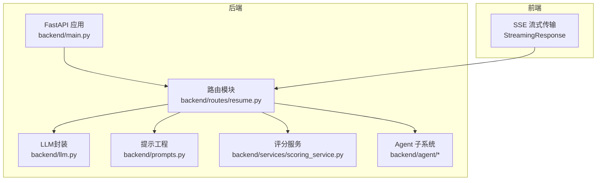
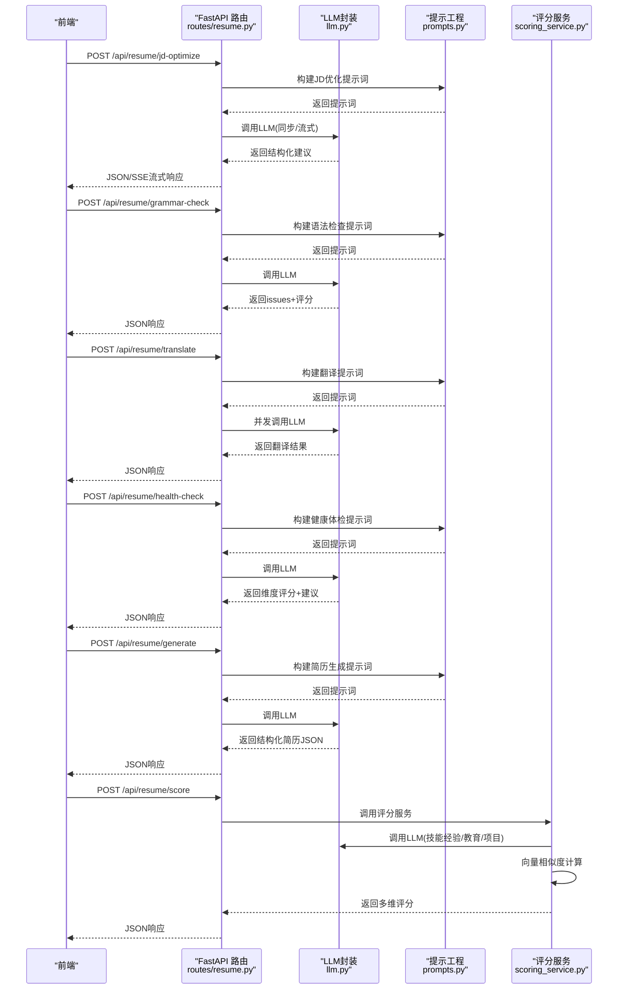
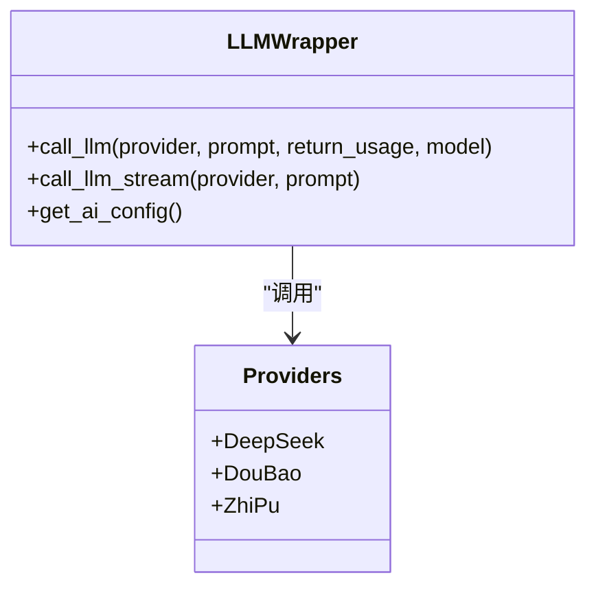
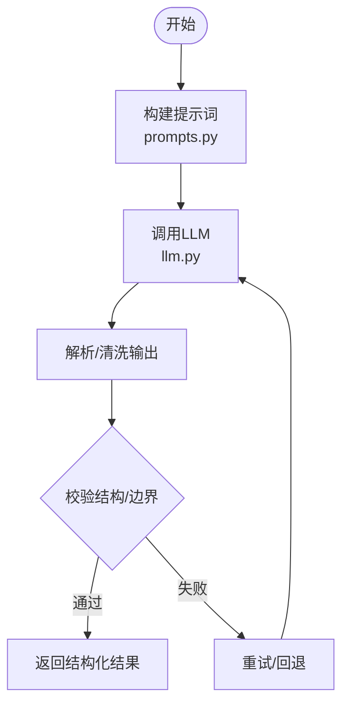
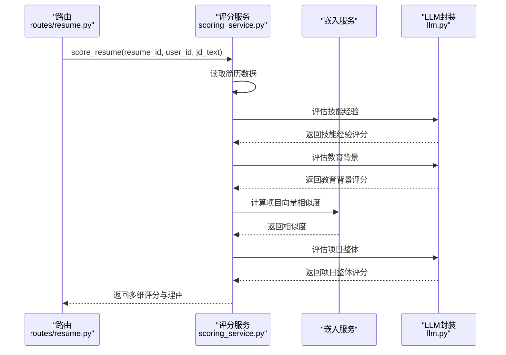
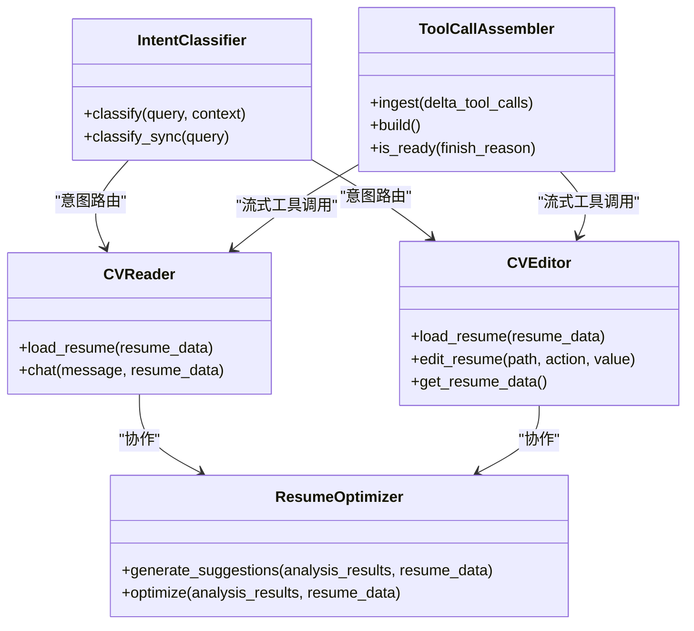
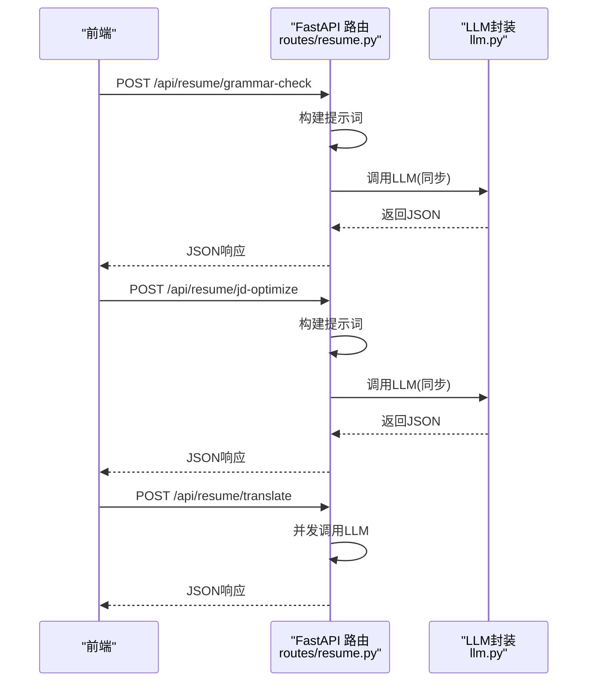
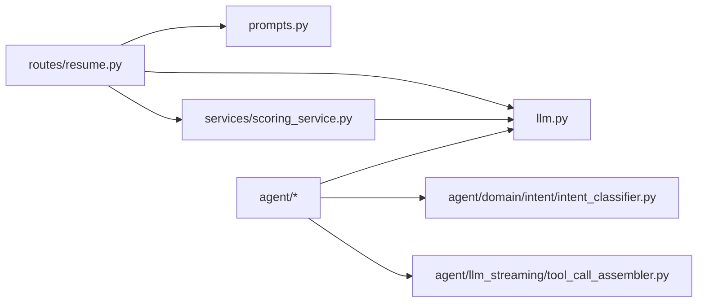

# 简历AI智能处理

<cite>
**本文引用的文件**
- [backend/main.py](file://backend/main.py)
- [backend/llm.py](file://backend/llm.py)
- [backend/routes/resume.py](file://backend/routes/resume.py)
- [backend/prompts.py](file://backend/prompts.py)
- [backend/services/scoring_service.py](file://backend/services/scoring_service.py)
- [backend/agent/agent/resume_optimizer.py](file://backend/agent/agent/resume_optimizer.py)
- [backend/agent/agent/cv_analyzer.py](file://backend/agent/agent/cv_analyzer.py)
- [backend/agent/agent/cv_editor.py](file://backend/agent/agent/cv_editor.py)
- [backend/agent/agent/cv_reader.py](file://backend/agent/agent/cv_reader.py)
- [backend/agent/domain/intent/intent_classifier.py](file://backend/agent/domain/intent/intent_classifier.py)
- [backend/agent/llm_streaming/tool_call_assembler.py](file://backend/agent/llm_streaming/tool_call_assembler.py)
- [backend/llm_utils.py](file://backend/llm_utils.py)
</cite>

## 目录
1. [简介](#简介)
2. [项目结构](#项目结构)
3. [核心组件](#核心组件)
4. [架构总览](#架构总览)
5. [详细组件分析](#详细组件分析)
6. [依赖关系分析](#依赖关系分析)
7. [性能考量](#性能考量)
8. [故障排查指南](#故障排查指南)
9. [结论](#结论)
10. [附录](#附录)

## 简介
本文件面向“简历AI智能处理”功能，系统化梳理并解释以下能力：
- AI驱动的简历优化、评分、翻译与匹配
- 意图检测、语法检查、内容改写、关键词优化等AI服务集成
- 提示工程、LLM调用模式与流式处理机制
- AI功能的配置选项、性能优化与错误处理策略
- 与不同AI提供商的集成方案与API调用示例

## 项目结构
后端采用FastAPI提供REST接口，结合提示工程与LLM调用模块，支撑简历生成、改写、语法检查、翻译、评分与匹配等能力。前端通过SSE流式接收AI输出，Agent子系统提供简历阅读、编辑与优化建议聚合。

图表来源
- [backend/main.py:92-138](file://backend/main.py#L92-L138)
- [backend/routes/resume.py:92](file://backend/routes/resume.py#L92)

章节来源
- [backend/main.py:92-138](file://backend/main.py#L92-L138)
- [backend/routes/resume.py:92](file://backend/routes/resume.py#L92)

## 核心组件
- LLM统一调用入口：封装DeepSeek、豆包、智谱等提供商，支持同步与流式调用，统一返回格式与错误处理。
- 提示工程模块：简历生成、改写、语法检查、翻译、健康体检、JD优化、关键词融合等专用提示词模板。
- 简历评分服务：结合结构化解析与嵌入相似度，对技能经验、教育背景、项目整体进行多维评分。
- Agent子系统：简历阅读、编辑、优化建议聚合，配合意图分类器与工具调用装配器，实现复杂交互与流式工具调用。
- 流式处理：SSE流式输出，工具调用增量组装，保障实时反馈。

章节来源
- [backend/llm.py:52-157](file://backend/llm.py#L52-L157)
- [backend/prompts.py:11-224](file://backend/prompts.py#L11-L224)
- [backend/services/scoring_service.py:20-81](file://backend/services/scoring_service.py#L20-L81)
- [backend/agent/agent/cv_reader.py:16-104](file://backend/agent/agent/cv_reader.py#L16-L104)
- [backend/agent/agent/cv_editor.py:45-265](file://backend/agent/agent/cv_editor.py#L45-L265)
- [backend/agent/agent/resume_optimizer.py:7-63](file://backend/agent/agent/resume_optimizer.py#L7-L63)
- [backend/agent/llm_streaming/tool_call_assembler.py:16-102](file://backend/agent/llm_streaming/tool_call_assembler.py#L16-L102)

## 架构总览
后端通过FastAPI路由暴露AI能力，LLM封装负责提供商切换与参数注入；提示工程模块为各功能提供结构化提示词；评分服务整合LLM与向量相似度；Agent子系统提供多Agent协作与流式工具调用。

图表来源
- [backend/routes/resume.py:551-792](file://backend/routes/resume.py#L551-L792)
- [backend/llm.py:52-157](file://backend/llm.py#L52-L157)
- [backend/prompts.py:11-224](file://backend/prompts.py#L11-L224)
- [backend/services/scoring_service.py:20-81](file://backend/services/scoring_service.py#L20-L81)

## 详细组件分析

### LLM封装与提供商集成
- 统一入口：call_llm与call_llm_stream，支持DeepSeek、豆包、智普等提供商，自动注入API Key、模型与基础URL。
- 错误处理：缺失API Key时返回400；调用失败抛出HTTP异常；提供默认模型与支持模型列表。
- 配置项：可通过环境变量覆盖默认模型与基础URL，便于多提供商切换与灰度发布。

图表来源
- [backend/llm.py:52-157](file://backend/llm.py#L52-L157)

章节来源
- [backend/llm.py:38-167](file://backend/llm.py#L38-L167)

### 提示工程与意图检测
- 提示词模板：简历生成、改写、语法检查、翻译、健康体检、JD优化、关键词融合等专用提示词，保证结构化输出与领域对齐。
- 意图检测：两阶段策略（规则+LLM增强），高置信度走规则，低置信度走LLM，支持问候、通用聊天与工具特定意图识别。

图表来源
- [backend/prompts.py:11-224](file://backend/prompts.py#L11-L224)
- [backend/llm.py:52-157](file://backend/llm.py#L52-L157)

章节来源
- [backend/prompts.py:11-224](file://backend/prompts.py#L11-L224)
- [backend/agent/domain/intent/intent_classifier.py:96-188](file://backend/agent/domain/intent/intent_classifier.py#L96-L188)

### 简历评分服务（技能经验/教育/项目）
- 多维评分：技能经验40%、教育背景20%、项目整体40%；支持向量相似度与LLM综合评分。
- 输出结构：总体分数、维度明细与原因、保存至数据库。
- LLM调用：分别针对技能经验、教育背景与项目整体构建提示词，解析JSON并回填评分。

图表来源
- [backend/services/scoring_service.py:20-81](file://backend/services/scoring_service.py#L20-L81)
- [backend/services/scoring_service.py:83-192](file://backend/services/scoring_service.py#L83-L192)

章节来源
- [backend/services/scoring_service.py:20-81](file://backend/services/scoring_service.py#L20-L81)
- [backend/services/scoring_service.py:83-192](file://backend/services/scoring_service.py#L83-L192)

### 简历优化Agent与工具链
- CVReader：基于工具读取简历上下文，回答问题。
- CVEditor：支持更新、添加、删除字段，路径别名归一化，保持结构一致性。
- ResumeOptimizer：聚合分析结果，生成可应用的优化建议，支持路径生成与校验。
- 意图分类器：两阶段意图识别，支持问候、通用聊天与工具特定意图，可选LLM增强。
- 流式工具调用：工具调用增量组装，支持SSE流式输出。

图表来源
- [backend/agent/agent/cv_reader.py:16-104](file://backend/agent/agent/cv_reader.py#L16-L104)
- [backend/agent/agent/cv_editor.py:45-265](file://backend/agent/agent/cv_editor.py#L45-L265)
- [backend/agent/agent/resume_optimizer.py:7-63](file://backend/agent/agent/resume_optimizer.py#L7-L63)
- [backend/agent/domain/intent/intent_classifier.py:50-332](file://backend/agent/domain/intent/intent_classifier.py#L50-L332)
- [backend/agent/llm_streaming/tool_call_assembler.py:16-102](file://backend/agent/llm_streaming/tool_call_assembler.py#L16-L102)

章节来源
- [backend/agent/agent/cv_reader.py:16-104](file://backend/agent/agent/cv_reader.py#L16-L104)
- [backend/agent/agent/cv_editor.py:45-265](file://backend/agent/agent/cv_editor.py#L45-L265)
- [backend/agent/agent/resume_optimizer.py:7-63](file://backend/agent/agent/resume_optimizer.py#L7-L63)
- [backend/agent/domain/intent/intent_classifier.py:50-332](file://backend/agent/domain/intent/intent_classifier.py#L50-L332)
- [backend/agent/llm_streaming/tool_call_assembler.py:16-102](file://backend/agent/llm_streaming/tool_call_assembler.py#L16-L102)

### 路由与流式处理
- 路由注册：统一在主入口注册健康检查、配置、简历、PDF、分享、认证、LeetCode、语义搜索等路由。
- 流式接口：简历改写意图检测、语法检查、JD优化、关键词融合、翻译、健康体检等均支持SSE流式输出。
- 并发翻译：使用信号量限制并发，线程池执行同步LLM调用，保证顺序与稳定性。

图表来源
- [backend/routes/resume.py:362-420](file://backend/routes/resume.py#L362-L420)
- [backend/routes/resume.py:551-612](file://backend/routes/resume.py#L551-L612)
- [backend/routes/resume.py:638-682](file://backend/routes/resume.py#L638-L682)
- [backend/routes/resume.py:685-723](file://backend/routes/resume.py#L685-L723)
- [backend/routes/resume.py:726-792](file://backend/routes/resume.py#L726-L792)
- [backend/llm.py:120-157](file://backend/llm.py#L120-L157)

章节来源
- [backend/routes/resume.py:362-420](file://backend/routes/resume.py#L362-L420)
- [backend/routes/resume.py:551-612](file://backend/routes/resume.py#L551-L612)
- [backend/routes/resume.py:638-682](file://backend/routes/resume.py#L638-L682)
- [backend/routes/resume.py:685-723](file://backend/routes/resume.py#L685-L723)
- [backend/routes/resume.py:726-792](file://backend/routes/resume.py#L726-L792)
- [backend/llm.py:120-157](file://backend/llm.py#L120-L157)

## 依赖关系分析
- 路由依赖LLM封装与提示工程模块，评分服务依赖嵌入服务与LLM封装。
- Agent子系统内部协作，IntentClassifier为工具路由提供意图决策。
- 流式处理依赖工具调用装配器与SSE响应。

图表来源
- [backend/routes/resume.py:28-89](file://backend/routes/resume.py#L28-L89)
- [backend/services/scoring_service.py:10-11](file://backend/services/scoring_service.py#L10-L11)
- [backend/agent/domain/intent/intent_classifier.py:19-21](file://backend/agent/domain/intent/intent_classifier.py#L19-L21)
- [backend/agent/llm_streaming/tool_call_assembler.py:16-102](file://backend/agent/llm_streaming/tool_call_assembler.py#L16-L102)

章节来源
- [backend/routes/resume.py:28-89](file://backend/routes/resume.py#L28-L89)
- [backend/services/scoring_service.py:10-11](file://backend/services/scoring_service.py#L10-L11)
- [backend/agent/domain/intent/intent_classifier.py:19-21](file://backend/agent/domain/intent/intent_classifier.py#L19-L21)
- [backend/agent/llm_streaming/tool_call_assembler.py:16-102](file://backend/agent/llm_streaming/tool_call_assembler.py#L16-L102)

## 性能考量
- 启动优化：预热HTTP连接、数据库连接、tiktoken编码文件，减少首次请求延迟。
- 并发与限流：翻译接口使用信号量限制并发，避免LLM提供商限流或超卖。
- 重试与超时：提供安全调用装饰器，指数退避与超时控制提升鲁棒性。
- 流式输出：SSE与工具调用增量组装，降低等待时间，提升用户体验。

章节来源
- [backend/main.py:228-315](file://backend/main.py#L228-L315)
- [backend/routes/resume.py:699-723](file://backend/routes/resume.py#L699-L723)
- [backend/llm_utils.py:11-102](file://backend/llm_utils.py#L11-L102)
- [backend/agent/llm_streaming/tool_call_assembler.py:16-102](file://backend/agent/llm_streaming/tool_call_assembler.py#L16-L102)

## 故障排查指南
- 缺少API Key：LLM封装在缺失Key时返回400，检查环境变量或系统配置。
- LLM调用失败：查看HTTP异常与解析错误，确认提示词结构与JSON输出约束。
- 输出校验失败：系统对LLM输出进行严格校验（如original必须存在于原文），不符合将被过滤。
- Agent代理不可达：主入口支持反向代理，上游不可达时返回502并提示检查上游地址。
- 意图分类异常：规则匹配失败时回退到通用聊天；LLM增强失败时记录警告并回退。

章节来源
- [backend/llm.py:67-117](file://backend/llm.py#L67-L117)
- [backend/routes/resume.py:377-407](file://backend/routes/resume.py#L377-L407)
- [backend/main.py:146-214](file://backend/main.py#L146-L214)
- [backend/agent/domain/intent/intent_classifier.py:172-182](file://backend/agent/domain/intent/intent_classifier.py#L172-L182)

## 结论
本项目通过统一的LLM封装、结构化的提示工程与Agent协作体系，实现了简历生成、改写、语法检查、翻译、健康体检、评分与匹配等AI能力。结合流式处理与性能优化策略，满足生产环境的稳定性与实时性需求。未来可在提示词工程、意图识别与多提供商灰度策略方面持续迭代。

## 附录

### AI功能与提示工程一览
- 简历生成：构建结构化JSON提示词，遵循ATS最佳实践。
- 内容改写：按字段类型注入优化策略，支持多轮历史上下文。
- 语法检查：四类问题维度（语法、措辞、模糊、量化），输出结构化issues与评分。
- 翻译：保留HTML标签结构，按目标语言输出翻译结果。
- 健康体检：通用质量评分与建议，维度包括完整度、表达质量、量化成果、关键词丰富度、格式规范。
- JD优化：基于JD输出匹配度、ATS兼容度、关键词命中与缺失、结构化建议。
- 关键词融合：将JD缺失关键词自然融入最相关字段，返回可替换片段。

章节来源
- [backend/prompts.py:11-224](file://backend/prompts.py#L11-L224)
- [backend/routes/resume.py:518-548](file://backend/routes/resume.py#L518-L548)
- [backend/routes/resume.py:615-635](file://backend/routes/resume.py#L615-L635)
- [backend/routes/resume.py:498-515](file://backend/routes/resume.py#L498-L515)
- [backend/routes/resume.py:460-489](file://backend/routes/resume.py#L460-L489)
- [backend/routes/resume.py:551-612](file://backend/routes/resume.py#L551-L612)
- [backend/routes/resume.py:638-682](file://backend/routes/resume.py#L638-L682)

### LLM调用模式与流式处理
- 同步调用：适用于一次性结构化输出，如评分、体检、翻译等。
- 流式调用：适用于长文本生成与工具调用，通过SSE推送增量内容。
- 工具调用装配：将流式delta.tool_calls累积为稳定payload，支持ready判定与JSON完整性校验。

章节来源
- [backend/llm.py:120-157](file://backend/llm.py#L120-L157)
- [backend/agent/llm_streaming/tool_call_assembler.py:16-102](file://backend/agent/llm_streaming/tool_call_assembler.py#L16-L102)

### 配置选项与API调用示例
- 配置项
  - 默认提供商与模型：可通过环境变量覆盖。
  - API Key：DeepSeek使用DASHSCOPE_API_KEY，豆包使用DOUBAO_API_KEY，智谱使用ZHIPU_API_KEY。
  - 模型与基础URL：DEEPSEEK_MODEL、DEEPSEEK_BASE_URL、DOUBAO_MODEL、DOUBAO_BASE_URL。
- API示例
  - 健康检查：GET /api/health
  - AI测试：POST /api/ai/test（携带provider与prompt）
  - 简历生成：POST /api/resume/generate（携带provider与instruction）
  - 语法检查：POST /api/resume/grammar-check（携带text与path）
  - 翻译：POST /api/resume/translate（携带target_lang与fields）
  - 健康体检：POST /api/resume/health-check（携带fields）
  - JD优化：POST /api/resume/jd-optimize（携带jd_text与fields）
  - 关键词融合：POST /api/resume/jd-keyword-integrate（携带keyword、jd_text与fields）
  - 评分：POST /api/resume/score（携带resume_id、user_id与jd_text）

章节来源
- [backend/llm.py:38-167](file://backend/llm.py#L38-L167)
- [backend/main.py:318-326](file://backend/main.py#L318-L326)
- [backend/routes/resume.py:795-800](file://backend/routes/resume.py#L795-L800)