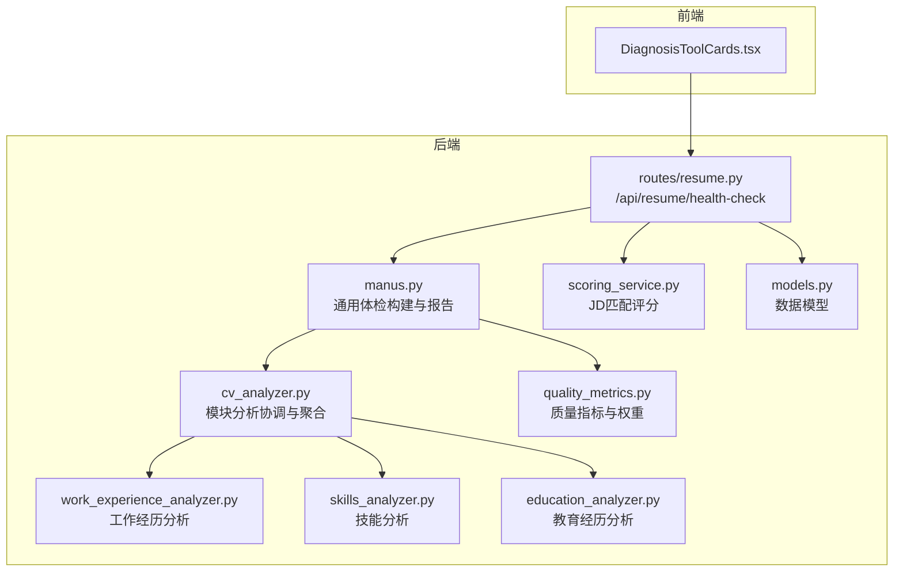
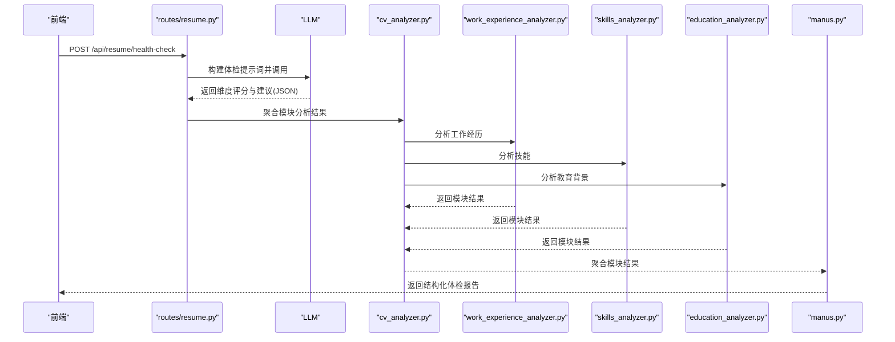
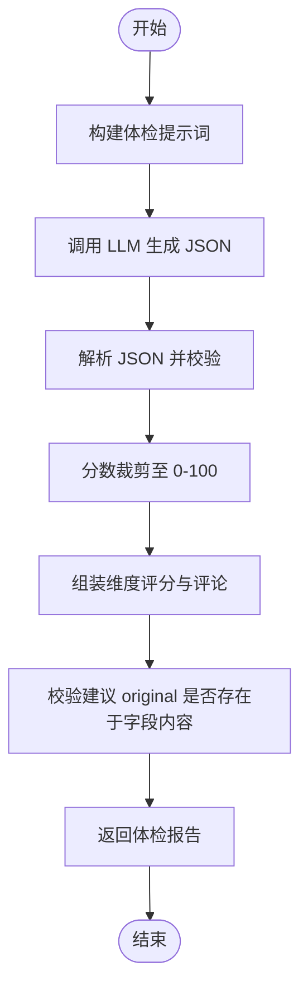
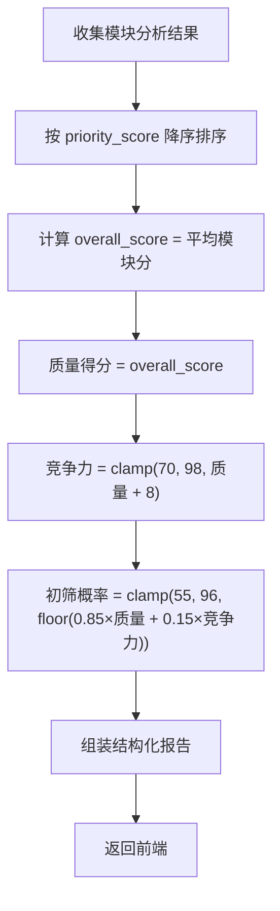
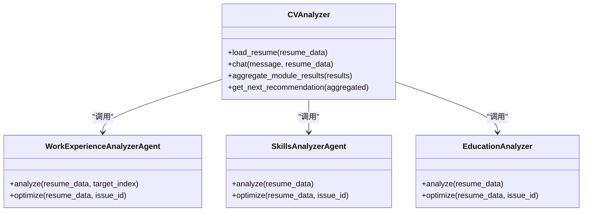
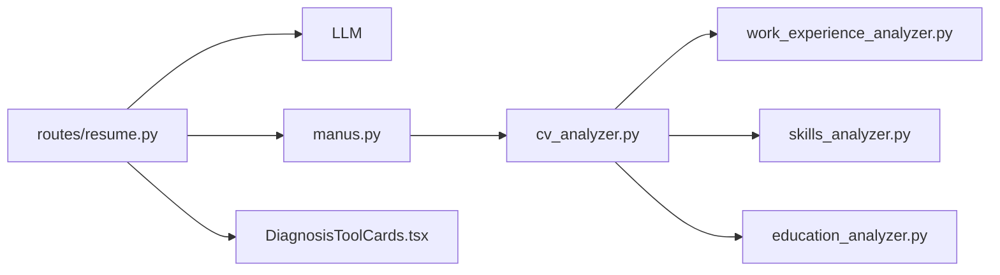

# 简历健康体检

<cite>
**本文引用的文件**
- [routes/resume.py](file://backend/routes/resume.py)
- [manus.py](file://backend/agent/agent/manus.py)
- [cv_analyzer.py](file://backend/agent/agent/cv_analyzer.py)
- [work_experience_analyzer.py](file://backend/agent/agent/analyzers/work_experience_analyzer.py)
- [skills_analyzer.py](file://backend/agent/agent/analyzers/skills_analyzer.py)
- [education_analyzer.py](file://backend/agent/agent/analyzers/education_analyzer.py)
- [education_analyzer.py](file://backend/agent/agent/module/education_analyzer.py)
- [DiagnosisToolCards.tsx](file://frontend/src/components/agent-chat/DiagnosisToolCards.tsx)
- [quality_metrics.py](file://backend/agent/prompt/quality_metrics.py)
- [scoring_service.py](file://backend/services/scoring_service.py)
- [models.py](file://backend/models.py)
</cite>

## 目录
1. [简介](#简介)
2. [项目结构](#项目结构)
3. [核心组件](#核心组件)
4. [架构总览](#架构总览)
5. [详细组件分析](#详细组件分析)
6. [依赖关系分析](#依赖关系分析)
7. [性能考量](#性能考量)
8. [故障排查指南](#故障排查指南)
9. [结论](#结论)
10. [附录](#附录)

## 简介
本文件面向“简历健康体检”功能，系统化阐述通用简历质量评估体系与实现方案。该体系覆盖五个维度：完整性、表达质量、量化成果、关键词丰富度、格式规范；并提供体检报告生成逻辑、结构化改进建议、整体质量评分算法、维度权重分配、建议优先级排序与可应用修改的精确匹配机制。同时，文档包含健康体检 API 的使用示例与报告解读指南，帮助用户快速理解与应用。

## 项目结构
简历健康体检涉及后端 API、模块化分析器、前端展示组件与评分服务，形成“请求-分析-聚合-输出”的闭环。

图示来源
- [routes/resume.py:726-792](file://backend/routes/resume.py#L726-L792)
- [manus.py:296-496](file://backend/agent/agent/manus.py#L296-L496)
- [cv_analyzer.py:124-193](file://backend/agent/agent/cv_analyzer.py#L124-L193)
- [work_experience_analyzer.py:171-223](file://backend/agent/agent/analyzers/work_experience_analyzer.py#L171-L223)
- [skills_analyzer.py:15-49](file://backend/agent/agent/analyzers/skills_analyzer.py#L15-L49)
- [education_analyzer.py:77-161](file://backend/agent/agent/module/education_analyzer.py#L77-L161)
- [quality_metrics.py:10-40](file://backend/agent/prompt/quality_metrics.py#L10-L40)
- [scoring_service.py:20-81](file://backend/services/scoring_service.py#L20-L81)
- [models.py:336-372](file://backend/models.py#L336-L372)

章节来源
- [routes/resume.py:726-792](file://backend/routes/resume.py#L726-L792)
- [manus.py:296-496](file://backend/agent/agent/manus.py#L296-L496)
- [cv_analyzer.py:124-193](file://backend/agent/agent/cv_analyzer.py#L124-L193)
- [work_experience_analyzer.py:171-223](file://backend/agent/agent/analyzers/work_experience_analyzer.py#L171-L223)
- [skills_analyzer.py:15-49](file://backend/agent/agent/analyzers/skills_analyzer.py#L15-L49)
- [education_analyzer.py:77-161](file://backend/agent/agent/module/education_analyzer.py#L77-L161)
- [quality_metrics.py:10-40](file://backend/agent/prompt/quality_metrics.py#L10-L40)
- [scoring_service.py:20-81](file://backend/services/scoring_service.py#L20-L81)
- [models.py:336-372](file://backend/models.py#L336-L372)

## 核心组件
- 健康体检 API：接收字段级简历内容，按五维评分与建议输出，支持精确匹配替换。
- 通用体检构建器：将模块分析结果聚合为整体评分与建议，计算初筛概率、质量得分与竞争力。
- 模块分析器：工作经历、技能、教育背景三大模块分别进行规则化与 LLM 辅助分析。
- 质量指标与权重：标准化的五维评分体系与等级划分。
- JD 匹配评分服务：在提供目标岗位时，计算技能经验、教育背景、项目整体的匹配度。
- 前端展示：诊断卡片组件渲染体检结果与建议。

章节来源
- [routes/resume.py:453-489](file://backend/routes/resume.py#L453-L489)
- [routes/resume.py:726-792](file://backend/routes/resume.py#L726-L792)
- [manus.py:325-496](file://backend/agent/agent/manus.py#L325-L496)
- [cv_analyzer.py:124-193](file://backend/agent/agent/cv_analyzer.py#L124-L193)
- [quality_metrics.py:10-40](file://backend/agent/prompt/quality_metrics.py#L10-L40)
- [scoring_service.py:20-81](file://backend/services/scoring_service.py#L20-L81)
- [DiagnosisToolCards.tsx:13-39](file://frontend/src/components/agent-chat/DiagnosisToolCards.tsx#L13-L39)

## 架构总览
健康体检采用“API-分析-聚合-输出”的流水线式架构。前端通过 /api/resume/health-check 发送字段集合，后端构造体检提示词并调用 LLM；随后由模块分析器对关键模块进行规则化分析，最终由通用体检构建器聚合模块结果，生成整体评分与建议，并通过前端组件可视化呈现。

图示来源
- [routes/resume.py:726-792](file://backend/routes/resume.py#L726-L792)
- [cv_analyzer.py:124-193](file://backend/agent/agent/cv_analyzer.py#L124-L193)
- [work_experience_analyzer.py:171-223](file://backend/agent/agent/analyzers/work_experience_analyzer.py#L171-L223)
- [skills_analyzer.py:15-49](file://backend/agent/agent/analyzers/skills_analyzer.py#L15-L49)
- [education_analyzer.py:77-161](file://backend/agent/agent/module/education_analyzer.py#L77-L161)
- [manus.py:325-496](file://backend/agent/agent/manus.py#L325-L496)

## 详细组件分析

### 健康体检 API（后端）
- 输入：字段列表（key、label、content），语言 locale。
- 输出：overallScore、dimensions、suggestions、summary。
- 关键特性：
  - 维度评分与建议均来自 LLM，确保一致性与可解释性。
  - suggestions 中 original 必须在对应字段内容中逐字出现，保证精确替换。
  - 对输出进行严格校验与裁剪，确保分数范围合法。

图示来源
- [routes/resume.py:460-489](file://backend/routes/resume.py#L460-L489)
- [routes/resume.py:726-792](file://backend/routes/resume.py#L726-L792)

章节来源
- [routes/resume.py:453-489](file://backend/routes/resume.py#L453-L489)
- [routes/resume.py:726-792](file://backend/routes/resume.py#L726-L792)

### 通用体检构建器（manus）
- 职责：将模块分析结果聚合为整体报告，计算质量得分、竞争力与初筛概率。
- 聚合策略：
  - 按 priority_score 降序排序，决定优化优先级。
  - overall_score 为模块评分的平均值。
  - 质量得分 = 模块评分均值；竞争力 = min(98, max(70, 质量 + 8))；初筛概率 = min(96, max(55, floor(质量×0.85 + 竞争力×0.15)))。
- 输出：结构化体检报告（含摘要、问题清单、Top 建议、下一步）。

图示来源
- [manus.py:325-496](file://backend/agent/agent/manus.py#L325-L496)
- [cv_analyzer.py:124-193](file://backend/agent/agent/cv_analyzer.py#L124-L193)

章节来源
- [manus.py:325-496](file://backend/agent/agent/manus.py#L325-L496)
- [cv_analyzer.py:124-193](file://backend/agent/agent/cv_analyzer.py#L124-L193)

### 模块分析器
- 工作经历分析器（规则化）：
  - 关注量化指标、结构化程度、动词开头等。
  - 生成问题清单与优化预览，便于直接应用。
- 技能分析器（规则化）：
  - 关注技能描述长度与完整性，生成优化建议。
- 教育背景分析器（模块化）：
  - 院校层次、专业匹配、GPA/排名、课程覆盖、荣誉奖项等维度综合评分。

图示来源
- [cv_analyzer.py:26-51](file://backend/agent/agent/cv_analyzer.py#L26-L51)
- [work_experience_analyzer.py:33-40](file://backend/agent/agent/analyzers/work_experience_analyzer.py#L33-L40)
- [skills_analyzer.py:7-14](file://backend/agent/agent/analyzers/skills_analyzer.py#L7-L14)
- [education_analyzer.py:28-48](file://backend/agent/agent/module/education_analyzer.py#L28-L48)

章节来源
- [work_experience_analyzer.py:59-145](file://backend/agent/agent/analyzers/work_experience_analyzer.py#L59-L145)
- [skills_analyzer.py:15-49](file://backend/agent/agent/analyzers/skills_analyzer.py#L15-L49)
- [education_analyzer.py:77-161](file://backend/agent/agent/module/education_analyzer.py#L77-L161)

### 质量指标与权重（QualityMetrics）
- 评估维度与权重：
  - 完整性：30%
  - 表达质量：25%
  - 量化成果：25%
  - 关键词丰富度：15%
  - 格式规范：5%
- 等级划分：A（90-100）、B（80-89）、C（70-79）、D（0-69）。
- 提供评分标准与提示词模板，便于统一评估口径。

章节来源
- [quality_metrics.py:10-40](file://backend/agent/prompt/quality_metrics.py#L10-L40)
- [quality_metrics.py:203-247](file://backend/agent/prompt/quality_metrics.py#L203-L247)

### JD 匹配评分服务
- 维度与权重：
  - 技能与经验匹配：40%
  - 教育背景匹配：20%
  - 项目与整体匹配：40%
- 计算方式：加权求和；项目整体匹配结合向量相似度与 LLM 评估。
- 输出：维度分数与理由列表，持久化记录。

章节来源
- [scoring_service.py:20-81](file://backend/services/scoring_service.py#L20-L81)
- [scoring_service.py:149-192](file://backend/services/scoring_service.py#L149-L192)

### 前端展示组件（DiagnosisToolCards）
- 渲染字段：简历摘要、质量得分、竞争力、初筛概率、匹配度、问题清单、Top 建议、下一步。
- 支持不同严重级别问题的视觉区分与交互。

章节来源
- [DiagnosisToolCards.tsx:13-39](file://frontend/src/components/agent-chat/DiagnosisToolCards.tsx#L13-L39)
- [DiagnosisToolCards.tsx:46-179](file://frontend/src/components/agent-chat/DiagnosisToolCards.tsx#L46-L179)

## 依赖关系分析
- API 依赖 LLM 生成体检报告；随后协调模块分析器进行规则化分析；manus 聚合模块结果并计算综合评分。
- 模块分析器之间解耦，各自维护独立的评分与建议生成逻辑。
- 前端组件依赖后端结构化输出，按字段 key 精确匹配建议，确保可一键应用。

图示来源
- [routes/resume.py:726-792](file://backend/routes/resume.py#L726-L792)
- [manus.py:325-496](file://backend/agent/agent/manus.py#L325-L496)
- [cv_analyzer.py:124-193](file://backend/agent/agent/cv_analyzer.py#L124-L193)
- [work_experience_analyzer.py:171-223](file://backend/agent/agent/analyzers/work_experience_analyzer.py#L171-L223)
- [skills_analyzer.py:15-49](file://backend/agent/agent/analyzers/skills_analyzer.py#L15-L49)
- [education_analyzer.py:77-161](file://backend/agent/agent/module/education_analyzer.py#L77-L161)
- [DiagnosisToolCards.tsx:13-39](file://frontend/src/components/agent-chat/DiagnosisToolCards.tsx#L13-L39)

## 性能考量
- 健康体检 API 的 LLM 调用成本较高，建议：
  - 控制字段数量与内容长度，避免超长提示词导致延迟与费用上升。
  - 对高频请求增加缓存策略（如对相同字段内容的体检结果缓存）。
- 模块分析器采用规则化与轻量 LLM 辅助，可在 Manus 不可用时作为兜底。
- 前端一次性渲染大量建议时，注意虚拟化与分页展示，避免 DOM 压力。

## 故障排查指南
- LLM 调用失败：检查 provider 配置与网络连通性；查看后端日志定位异常。
- JSON 解析失败：确认 LLM 输出严格遵循 JSON 格式；必要时启用清洗与重试。
- 建议不可应用：original 必须在字段内容中逐字出现，否则会被过滤；请核对字段 key 与内容一致性。
- 体检报告为空：确认传入字段 content 非空；必要时补充字段内容或调整字段 key。

章节来源
- [routes/resume.py:362-419](file://backend/routes/resume.py#L362-L419)
- [routes/resume.py:551-612](file://backend/routes/resume.py#L551-L612)
- [routes/resume.py:638-682](file://backend/routes/resume.py#L638-L682)

## 结论
本体检系统通过“字段级体检 + 模块化分析 + 统一聚合”的方式，实现了可解释、可落地的简历质量评估与改进建议。五维权重与等级划分确保了评分的稳定性；精确匹配机制保障了建议的可应用性；前端组件直观呈现体检结果，便于用户快速迭代优化。

## 附录

### 维度权重与评分算法
- 通用体检（字段级）：完整性、表达质量、量化成果、关键词丰富度、格式规范。
- 通用体检（模块级）：工作经历、技能、教育背景三模块评分与优先级。
- 综合评分：质量得分 = 模块评分均值；竞争力 = clamp(70, 98, 质量 + 8)；初筛概率 = clamp(55, 96, floor(0.85×质量 + 0.15×竞争力))。

章节来源
- [quality_metrics.py:26-32](file://backend/agent/prompt/quality_metrics.py#L26-L32)
- [manus.py:351-353](file://backend/agent/agent/manus.py#L351-L353)

### 健康体检 API 使用示例
- 请求路径：POST /api/resume/health-check
- 请求体字段：
  - provider：可选，AI 提供商
  - fields：字段数组，每项包含 key、label、content
  - locale：语言
- 返回字段：
  - overallScore：整体评分
  - dimensions：维度评分与评论
  - suggestions：结构化建议（original、suggested、reason）
  - summary：总体评价

章节来源
- [routes/resume.py:453-458](file://backend/routes/resume.py#L453-L458)
- [routes/resume.py:726-792](file://backend/routes/resume.py#L726-L792)

### 报告解读指南
- 质量得分：反映简历内容质量；越高越利于通过初筛。
- 竞争力：在质量基础上的附加分，体现简历相对水平。
- 初筛概率：综合质量与竞争力得出的通过率预估。
- 问题清单：按严重级别分类，优先处理“必须修改”项。
- Top 建议：聚焦最有效的三条优化动作。
- 下一步：建议补充目标岗位或 JD，进行定向匹配度分析。

章节来源
- [manus.py:418-496](file://backend/agent/agent/manus.py#L418-L496)
- [DiagnosisToolCards.tsx:60-179](file://frontend/src/components/agent-chat/DiagnosisToolCards.tsx#L60-L179)