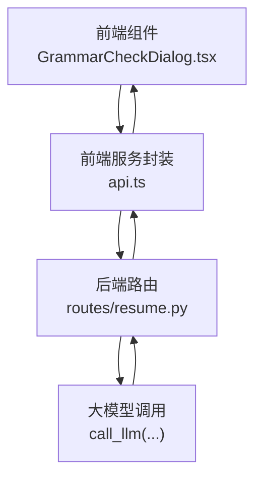
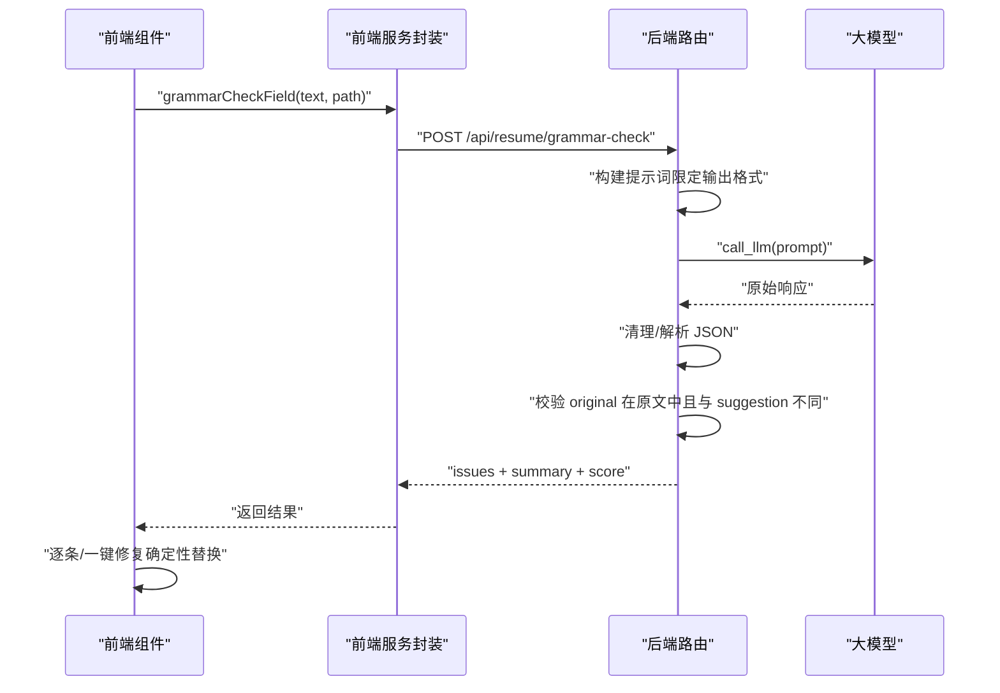
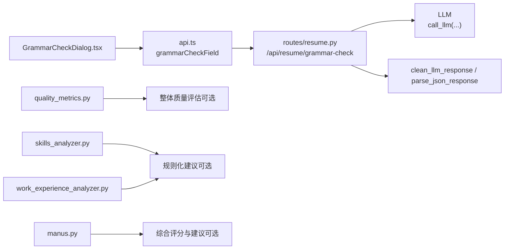

# 语法检查与表达优化

<cite>
**本文引用的文件**
- [backend/routes/resume.py](file://backend/routes/resume.py)
- [frontend/src/pages/Workspace/v2/shared/GrammarCheckDialog.tsx](file://frontend/src/pages/Workspace/v2/shared/GrammarCheckDialog.tsx)
- [frontend/src/services/api.ts](file://frontend/src/services/api.ts)
- [backend/agent/prompt/quality_metrics.py](file://backend/agent/prompt/quality_metrics.py)
- [backend/agent/agent/analyzers/skills_analyzer.py](file://backend/agent/agent/analyzers/skills_analyzer.py)
- [backend/agent/agent/analyzers/work_experience_analyzer.py](file://backend/agent/agent/analyzers/work_experience_analyzer.py)
- [backend/agent/agent/manus.py](file://backend/agent/agent/manus.py)
</cite>

## 目录
1. [简介](#简介)
2. [项目结构](#项目结构)
3. [核心组件](#核心组件)
4. [架构总览](#架构总览)
5. [详细组件分析](#详细组件分析)
6. [依赖关系分析](#依赖关系分析)
7. [性能考量](#性能考量)
8. [故障排查指南](#故障排查指南)
9. [结论](#结论)
10. [附录](#附录)

## 简介
本文件面向“简历语法检查与表达优化”功能，系统化阐述单字段语法检查、表达质量评估与量化指标建议的实现方案。文档覆盖以下要点：
- 分类标准：语法错误（grammar）、表达优化（wording）、模糊描述（vague）、量化建议（quantify）
- 检查维度评分体系与严重程度分级
- 改进建议生成与前端弹窗交互流程
- 语法检查 API 的使用方法、JSON 输出格式与前端集成示例

## 项目结构
该功能由后端 FastAPI 路由提供语法检查接口，前端通过对话框组件调用并展示结果，同时具备一键修复能力。

图示来源
- [frontend/src/pages/Workspace/v2/shared/GrammarCheckDialog.tsx:1-262](file://frontend/src/pages/Workspace/v2/shared/GrammarCheckDialog.tsx#L1-L262)
- [frontend/src/services/api.ts:1020-1029](file://frontend/src/services/api.ts#L1020-L1029)
- [backend/routes/resume.py:362-419](file://backend/routes/resume.py#L362-L419)

章节来源
- [backend/routes/resume.py:362-419](file://backend/routes/resume.py#L362-L419)
- [frontend/src/pages/Workspace/v2/shared/GrammarCheckDialog.tsx:1-262](file://frontend/src/pages/Workspace/v2/shared/GrammarCheckDialog.tsx#L1-L262)
- [frontend/src/services/api.ts:1020-1029](file://frontend/src/services/api.ts#L1020-L1029)

## 核心组件
- 后端路由与提示词工程
  - 提供“单字段语法/表达体检”接口，构建专用提示词，限定输出 JSON 字段与格式，严格校验 original 片段必须在原文中逐字出现，确保可确定性替换。
- 前端弹窗与修复
  - GrammarCheckDialog 展示 issues、评分与摘要，支持逐条应用与一键修复，修复为确定性字符串替换，不二次调用 LLM。
- 质量评估与指标
  - 提供标准化的简历质量评估指标（完整性、清晰度、量化度、相关性）与等级划分，用于整体评分与等级描述。

章节来源
- [backend/routes/resume.py:329-359](file://backend/routes/resume.py#L329-L359)
- [backend/routes/resume.py:362-419](file://backend/routes/resume.py#L362-L419)
- [frontend/src/pages/Workspace/v2/shared/GrammarCheckDialog.tsx:1-262](file://frontend/src/pages/Workspace/v2/shared/GrammarCheckDialog.tsx#L1-L262)
- [backend/agent/prompt/quality_metrics.py:10-93](file://backend/agent/prompt/quality_metrics.py#L10-L93)

## 架构总览
后端路由负责接收请求、构造提示词、调用 LLM 并清洗/解析 JSON；前端负责发起请求、展示结果与执行修复。

图示来源
- [frontend/src/services/api.ts:1020-1029](file://frontend/src/services/api.ts#L1020-L1029)
- [backend/routes/resume.py:329-359](file://backend/routes/resume.py#L329-L359)
- [backend/routes/resume.py:362-419](file://backend/routes/resume.py#L362-L419)

## 详细组件分析

### 后端路由：语法检查接口
- 请求体字段
  - provider：可选，指定大模型供应商
  - text：必填，待检查字段内容（支持纯文本或 HTML）
  - path：可选，来源字段路径，用于场景判断
  - locale：可选，默认 zh
- 输出字段
  - issues：结构化问题列表，每项包含 original、suggestion、type、severity
  - summary：总体评价
  - score：字段整体写作质量分（0-100）

- 严格约束与校验
  - original 必须在原文中逐字出现，且 original ≠ suggestion
  - type 限定为 grammar、wording、vague、quantify
  - severity 限定为 high、medium、low
  - score 限制在 0-100

- 提示词工程
  - 明确检查维度与输出格式
  - 强制使用与输入相同语言
  - 保证可直接替换的建议文本

章节来源
- [backend/routes/resume.py:128-134](file://backend/routes/resume.py#L128-L134)
- [backend/routes/resume.py:329-359](file://backend/routes/resume.py#L329-L359)
- [backend/routes/resume.py:362-419](file://backend/routes/resume.py#L362-L419)

### 前端组件：语法/表达体检弹窗
- 功能特性
  - 自动发起检查，展示 issues 列表与评分
  - 类型与严重度标签化展示
  - 支持逐条应用与一键应用
  - 修复为确定性替换（original → suggestion），不二次调用 LLM

- 交互流程
  - 打开弹窗时根据当前内容触发检查
  - 用户点击“应用”或“一键全部修复”，在 working 文本中执行替换并回调 onApply

章节来源
- [frontend/src/pages/Workspace/v2/shared/GrammarCheckDialog.tsx:1-262](file://frontend/src/pages/Workspace/v2/shared/GrammarCheckDialog.tsx#L1-L262)

### 前端服务封装：API 方法
- grammarCheckField
  - 发送 POST 请求至 /api/resume/grammar-check
  - 参数：provider、text、path、locale
  - 返回：GrammarCheckResult（issues、summary、score）

章节来源
- [frontend/src/services/api.ts:1020-1029](file://frontend/src/services/api.ts#L1020-L1029)

### 质量评估与指标
- 评估维度与权重
  - 完整性（30%）：必填字段是否完整
  - 清晰度（25%）：表达是否清晰易懂
  - 量化度（25%）：成果是否有数据支撑
  - 相关性（20%）：与目标岗位的匹配度
- 等级划分
  - A（90-100）、B（80-89）、C（70-79）、D（0-69）
- 输出
  - 计算总分与等级，提供等级说明与字典形式导出

章节来源
- [backend/agent/prompt/quality_metrics.py:10-93](file://backend/agent/prompt/quality_metrics.py#L10-L93)

### 规则化分析与优化（扩展能力）
- 技能模块分析
  - 若技能描述过短，提出“建议补充核心技能栈、熟练度以及工具/框架”的改进建议
  - 为空时标记高严重度问题
- 工作经历分析
  - 未提供细节描述：建议补充职责、行动和成果，尽量量化指标
  - 未发现量化指标：建议补充可衡量指标（如性能提升比例、吞吐/QPS、延迟、处理量级等）
  - 描述偏长且未拆分：建议按“背景/任务 → 行动 → 结果”拆分为 2-4 条要点
  - 缺少强动词：建议以“负责/主导/设计/实现/优化”等动词起句
  - 优化兜底：在 LLM 不可用时提供规则化参考（_build_optimized_preview）

章节来源
- [backend/agent/agent/analyzers/skills_analyzer.py:15-49](file://backend/agent/agent/analyzers/skills_analyzer.py#L15-L49)
- [backend/agent/agent/analyzers/work_experience_analyzer.py:59-145](file://backend/agent/agent/analyzers/work_experience_analyzer.py#L59-L145)
- [backend/agent/agent/analyzers/work_experience_analyzer.py:147-169](file://backend/agent/agent/analyzers/work_experience_analyzer.py#L147-L169)

### 整体质量与竞争力评估（扩展能力）
- 基于模块分析结果汇总生成整体质量分与竞争力分
- 依据严重度筛选 must-fix/should-fix/optional-fix 建议
- 生成 Top 优化动作标题与建议详情

章节来源
- [backend/agent/agent/manus.py:333-388](file://backend/agent/agent/manus.py#L333-L388)

## 依赖关系分析

图示来源
- [frontend/src/pages/Workspace/v2/shared/GrammarCheckDialog.tsx:1-262](file://frontend/src/pages/Workspace/v2/shared/GrammarCheckDialog.tsx#L1-L262)
- [frontend/src/services/api.ts:1020-1029](file://frontend/src/services/api.ts#L1020-L1029)
- [backend/routes/resume.py:362-419](file://backend/routes/resume.py#L362-L419)
- [backend/agent/prompt/quality_metrics.py:10-93](file://backend/agent/prompt/quality_metrics.py#L10-L93)
- [backend/agent/agent/analyzers/skills_analyzer.py:15-49](file://backend/agent/agent/analyzers/skills_analyzer.py#L15-L49)
- [backend/agent/agent/analyzers/work_experience_analyzer.py:59-145](file://backend/agent/agent/analyzers/work_experience_analyzer.py#L59-L145)
- [backend/agent/agent/manus.py:333-388](file://backend/agent/agent/manus.py#L333-L388)

## 性能考量
- 前端
  - 修复采用确定性字符串替换，避免二次 LLM 调用，降低延迟与成本
  - 逐条/一键修复均在本地 working 文本上操作，UI 响应迅速
- 后端
  - 严格校验 original 与 suggestion，减少无效输出与前端重试
  - 提示词显式限定输出 JSON 结构，提高解析成功率与稳定性
- 可扩展性
  - 规则化分析（技能、工作经历）可在 LLM 不可用时作为兜底
  - 整体质量评估与建议可按需启用，不影响基础语法检查流程

## 故障排查指南
- 常见错误与处理
  - text 为空：后端返回 400，提示 text 不能为空
  - LLM 调用失败：后端返回 500，提示 LLM 调用失败
  - JSON 解析失败：后端返回 500，提示解析 JSON 失败
  - original 不在原文中或 original==suggestion：后端过滤掉该条目
- 前端
  - 检查失败时显示错误提示，支持重新检查
  - 一键修复后 working 文本发生变化，及时回调 onApply

章节来源
- [backend/routes/resume.py:365-367](file://backend/routes/resume.py#L365-L367)
- [backend/routes/resume.py:378-385](file://backend/routes/resume.py#L378-L385)
- [backend/routes/resume.py:396-399](file://backend/routes/resume.py#L396-L399)
- [frontend/src/pages/Workspace/v2/shared/GrammarCheckDialog.tsx:66-70](file://frontend/src/pages/Workspace/v2/shared/GrammarCheckDialog.tsx#L66-L70)

## 结论
该功能通过“严格的提示词工程 + 前端确定性修复”的组合，在保证输出质量的同时兼顾性能与用户体验。语法检查接口提供结构化问题与评分，前端弹窗支持快速修复；配合规则化分析与整体质量评估，可进一步提升简历表达质量与岗位匹配度。

## 附录

### 分类标准与严重程度
- grammar：语法错误、错别字、用词搭配错误
- wording：弱动词、平淡/口语化表达，建议替换为更专业有力的措辞
- vague：含糊笼统、缺少信息量的描述
- quantify：缺少量化指标、可补充数字/结果的地方
- 严重程度：high（高）、medium（中）、low（低）

章节来源
- [backend/routes/resume.py:332-336](file://backend/routes/resume.py#L332-L336)
- [backend/routes/resume.py:343-343](file://backend/routes/resume.py#L343-L343)

### 检查维度评分体系与等级
- 完整性（30%）、清晰度（25%）、量化度（25%）、相关性（20%）
- 等级：A（90-100）、B（80-89）、C（70-79）、D（0-69）

章节来源
- [backend/agent/prompt/quality_metrics.py:26-40](file://backend/agent/prompt/quality_metrics.py#L26-L40)
- [backend/agent/prompt/quality_metrics.py:95-93](file://backend/agent/prompt/quality_metrics.py#L95-L93)

### 语法检查 API 使用方法与 JSON 输出格式
- 接口：POST /api/resume/grammar-check
- 请求体字段
  - provider：可选
  - text：必填（纯文本或 HTML）
  - path：可选（来源字段路径）
  - locale：可选（默认 zh）
- 返回字段
  - issues：数组，每项包含 original、suggestion、type、severity
  - summary：总体评价
  - score：字段整体写作质量分（0-100）

章节来源
- [backend/routes/resume.py:128-134](file://backend/routes/resume.py#L128-L134)
- [backend/routes/resume.py:329-359](file://backend/routes/resume.py#L329-L359)
- [backend/routes/resume.py:362-419](file://backend/routes/resume.py#L362-L419)
- [frontend/src/services/api.ts:1020-1029](file://frontend/src/services/api.ts#L1020-L1029)

### 前端集成示例（步骤）
- 导入组件与服务
  - 从 GrammarCheckDialog.tsx 导入弹窗组件
  - 从 api.ts 导入 grammarCheckField 方法
- 调用流程
  - 在编辑器中打开弹窗，传入当前字段内容与 path
  - 调用 grammarCheckField(text, path)，等待返回 issues 与 score
  - 用户点击“应用”或“一键全部修复”，在 working 文本中执行替换并回调 onApply
- 交互细节
  - 若 original 不在 working 文本中（已被前序修复影响），仅标记为已处理
  - 修复为确定性替换，不二次调用 LLM

章节来源
- [frontend/src/pages/Workspace/v2/shared/GrammarCheckDialog.tsx:58-113](file://frontend/src/pages/Workspace/v2/shared/GrammarCheckDialog.tsx#L58-L113)
- [frontend/src/services/api.ts:1020-1029](file://frontend/src/services/api.ts#L1020-L1029)