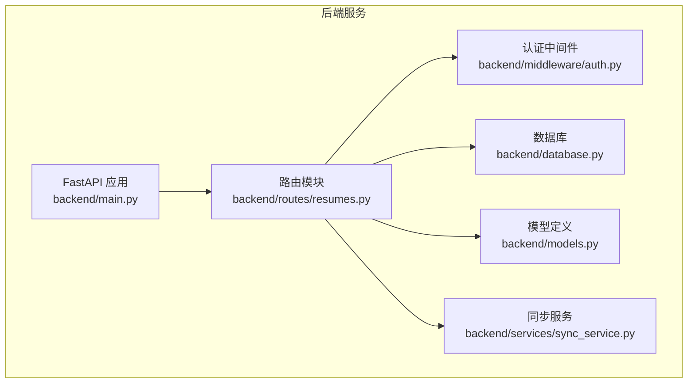
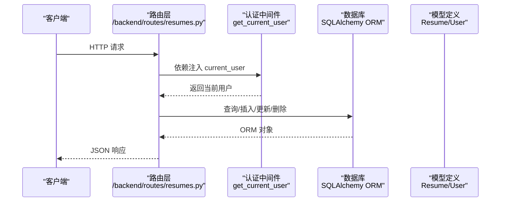
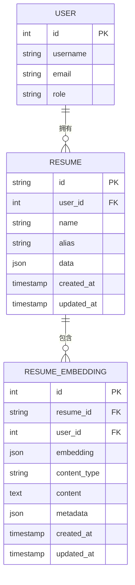
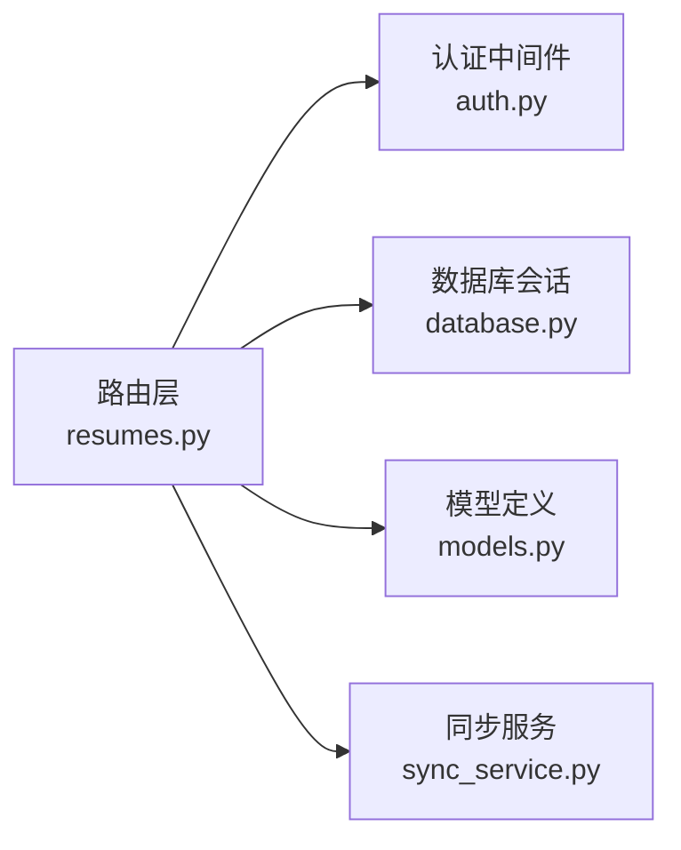

# 简历CRUD操作

<cite>
**本文引用的文件**
- [backend/routes/resumes.py](file://backend/routes/resumes.py)
- [backend/models.py](file://backend/models.py)
- [backend/database.py](file://backend/database.py)
- [backend/middleware/auth.py](file://backend/middleware/auth.py)
- [backend/services/sync_service.py](file://backend/services/sync_service.py)
- [backend/main.py](file://backend/main.py)
</cite>

## 目录
1. [简介](#简介)
2. [项目结构](#项目结构)
3. [核心组件](#核心组件)
4. [架构总览](#架构总览)
5. [详细组件分析](#详细组件分析)
6. [依赖分析](#依赖分析)
7. [性能考量](#性能考量)
8. [故障排查指南](#故障排查指南)
9. [结论](#结论)

## 简介
本文件聚焦于“简历CRUD操作”的完整实现与使用说明，涵盖以下方面：
- RESTful API 接口设计与URL模式
- HTTP方法与请求/响应格式
- 数据验证规则与错误处理机制
- 权限控制与安全考虑
- 与数据库的交互模式
- 完整的API调用示例（请求参数、响应格式、错误处理）

## 项目结构
简历CRUD功能位于后端模块化路由中，核心文件如下：
- 路由层：/backend/routes/resumes.py 提供简历的增删改查与同步接口
- 数据模型：/backend/models.py 定义ORM模型与Pydantic数据结构
- 数据库：/backend/database.py 提供数据库连接与会话管理
- 认证中间件：/backend/middleware/auth.py 提供用户鉴权与权限校验
- 同步服务：/backend/services/sync_service.py 实现本地与数据库的双向合并
- 应用入口：/backend/main.py 注册路由并启动服务

图表来源
- [backend/main.py:93-139](file://backend/main.py#L93-L139)
- [backend/routes/resumes.py:19](file://backend/routes/resumes.py#L19)
- [backend/middleware/auth.py:113-146](file://backend/middleware/auth.py#L113-L146)
- [backend/database.py:121-131](file://backend/database.py#L121-L131)
- [backend/models.py:163-182](file://backend/models.py#L163-L182)
- [backend/services/sync_service.py:25-87](file://backend/services/sync_service.py#L25-L87)

章节来源
- [backend/main.py:93-139](file://backend/main.py#L93-L139)
- [backend/routes/resumes.py:19](file://backend/routes/resumes.py#L19)

## 核心组件
- 路由路由器：/backend/routes/resumes.py 定义了简历的CRUD与同步接口
- 数据模型：/backend/models.py 定义了Resume、User、ResumeEmbedding等ORM模型
- 认证依赖：/backend/middleware/auth.py 提供get_current_user依赖，确保接口访问受控
- 数据库会话：/backend/database.py 提供get_db依赖，统一数据库连接与生命周期管理
- 同步服务：/backend/services/sync_service.py 实现本地localStorage与数据库的合并策略

章节来源
- [backend/routes/resumes.py:19](file://backend/routes/resumes.py#L19)
- [backend/models.py:163-182](file://backend/models.py#L163-L182)
- [backend/middleware/auth.py:113-146](file://backend/middleware/auth.py#L113-L146)
- [backend/database.py:121-131](file://backend/database.py#L121-L131)
- [backend/services/sync_service.py:25-87](file://backend/services/sync_service.py#L25-L87)

## 架构总览
简历CRUD遵循“路由-中间件-服务-数据库”分层：
- 路由层接收请求，进行基础参数校验
- 中间件层注入当前用户，执行权限校验
- 服务层负责业务逻辑（如合并策略）
- 数据库层通过SQLAlchemy ORM持久化

图表来源
- [backend/routes/resumes.py:52-262](file://backend/routes/resumes.py#L52-L262)
- [backend/middleware/auth.py:113-146](file://backend/middleware/auth.py#L113-L146)
- [backend/database.py:121-131](file://backend/database.py#L121-L131)
- [backend/models.py:163-182](file://backend/models.py#L163-L182)

## 详细组件分析

### RESTful API 设计与URL模式
- 基础路径：/api/resumes
- 资源：简历（Resume）
- 支持的操作：
  - GET /api/resumes —— 获取当前用户的所有简历
  - GET /api/resumes/{resume_id} —— 获取指定简历
  - POST /api/resumes —— 创建简历
  - PUT /api/resumes/{resume_id} —— 更新简历（不存在时自动创建）
  - DELETE /api/resumes/{resume_id} —— 删除简历
  - POST /api/resumes/sync —— 同步简历数据（本地↔数据库）

章节来源
- [backend/routes/resumes.py:52-262](file://backend/routes/resumes.py#L52-L262)

### HTTP方法与URL映射
- GET /api/resumes
  - 功能：列出当前用户的所有简历
  - 认证：必需
  - 响应：数组，元素为简历对象
- GET /api/resumes/{resume_id}
  - 功能：获取单个简历
  - 认证：必需
  - 响应：单个简历对象
- POST /api/resumes
  - 功能：创建简历
  - 认证：必需
  - 请求体：ResumePayload
  - 响应：ResumeResponse
- PUT /api/resumes/{resume_id}
  - 功能：更新简历；若不存在且ID未被他人占用则创建
  - 认证：必需
  - 请求体：ResumePayload
  - 响应：ResumeResponse
- DELETE /api/resumes/{resume_id}
  - 功能：删除简历
  - 认证：必需
  - 响应：{"success": true}
- POST /api/resumes/sync
  - 功能：同步本地与数据库的简历数据
  - 认证：必需
  - 请求体：SyncRequest
  - 响应：数组，元素为简历对象

章节来源
- [backend/routes/resumes.py:52-262](file://backend/routes/resumes.py#L52-L262)

### 请求/响应格式与数据模型
- ResumePayload（请求体）
  - 字段：id（可选）、name（可选）、alias（可选）、template_type（可选）、data（必填）、created_at/updated_at（可选）
  - 说明：template_type会同步到data["templateType"]中
- ResumeResponse（响应体）
  - 字段：id、name、alias、template_type、data、created_at、updated_at
  - 说明：template_type从data["templateType"]提取
- SyncRequest（同步请求体）
  - 字段：resumes（数组，元素为ResumePayload）

章节来源
- [backend/routes/resumes.py:23-45](file://backend/routes/resumes.py#L23-L45)
- [backend/routes/resumes.py:98-132](file://backend/routes/resumes.py#L98-L132)
- [backend/routes/resumes.py:135-195](file://backend/routes/resumes.py#L135-L195)
- [backend/routes/resumes.py:198-232](file://backend/routes/resumes.py#L198-L232)
- [backend/routes/resumes.py:234-262](file://backend/routes/resumes.py#L234-L262)

### 数据验证规则
- 参数校验
  - id：可选；若未提供，服务端生成UUID前缀的ID
  - name：可选；若未提供，从data["basic"]["name"]提取，否则默认“未命名简历”
  - alias：可选；可为None
  - template_type：可选；若提供，会同步到data["templateType"]
  - data：必填；JSON结构，存储完整简历数据
- 时间戳处理
  - created_at/updated_at：服务端自动维护；响应中以ISO格式字符串返回
- 同步合并
  - 比较incoming_updated_at与数据库记录的updated_at，仅在本地更新更晚时覆盖
  - 无ID的记录会被跳过

章节来源
- [backend/routes/resumes.py:104-132](file://backend/routes/resumes.py#L104-L132)
- [backend/routes/resumes.py:142-195](file://backend/routes/resumes.py#L142-L195)
- [backend/services/sync_service.py:25-87](file://backend/services/sync_service.py#L25-L87)

### 错误处理机制与状态码
- 400 Bad Request：请求参数缺失或非法（如template_type为空）
- 401 Unauthorized：未提供有效认证信息或认证失败
- 403 Forbidden：权限不足（例如非管理员访问受限接口）
- 404 Not Found：资源不存在（如简历ID不存在）
- 409 Conflict：更新时ID已被他人占用
- 500 Internal Server Error：数据库异常或内部错误
- 503 Service Unavailable：数据库连接异常
- 502 Bad Gateway：代理上游不可达（与代理相关，非CRUD主流程）

章节来源
- [backend/routes/resumes.py:83-95](file://backend/routes/resumes.py#L83-L95)
- [backend/routes/resumes.py:148-150](file://backend/routes/resumes.py#L148-L150)
- [backend/routes/resumes.py:209-210](file://backend/routes/resumes.py#L209-L210)
- [backend/routes/resumes.py:228-231](file://backend/routes/resumes.py#L228-L231)
- [backend/middleware/auth.py:133-145](file://backend/middleware/auth.py#L133-L145)
- [backend/middleware/auth.py:82-86](file://backend/middleware/auth.py#L82-L86)

### 权限控制与安全考虑
- 认证依赖：所有简历接口均依赖get_current_user，确保请求来自已认证用户
- 资源隔离：查询/更新/删除均限定在当前用户（user_id）范围内
- 越权保护：PUT更新时若ID已被他人占用，拒绝覆盖并返回409
- 内部信任头：支持BetterAuth信任头，用于内部服务间调用
- 数据库连接健壮性：鉴权过程中具备数据库异常重试与回滚机制

章节来源
- [backend/middleware/auth.py:113-146](file://backend/middleware/auth.py#L113-L146)
- [backend/routes/resumes.py:142-150](file://backend/routes/resumes.py#L142-L150)
- [backend/middleware/auth.py:40-86](file://backend/middleware/auth.py#L40-L86)

### 与数据库的交互模式
- 会话管理：通过get_db依赖注入数据库会话，确保生命周期正确
- ORM模型：Resume与User之间存在外键关联，Cascade删除保证级联清理
- 批量删除：删除简历时同时清理相关向量嵌入，避免孤儿数据
- 合并策略：同步服务按updated_at比较决定插入或更新，避免覆盖最新数据

图表来源
- [backend/models.py:163-182](file://backend/models.py#L163-L182)
- [backend/models.py:310-330](file://backend/models.py#L310-L330)

章节来源
- [backend/database.py:121-131](file://backend/database.py#L121-L131)
- [backend/models.py:163-182](file://backend/models.py#L163-L182)
- [backend/models.py:310-330](file://backend/models.py#L310-L330)
- [backend/routes/resumes.py:212-227](file://backend/routes/resumes.py#L212-L227)

### API调用示例（请求参数、响应格式、错误处理）
- 获取所有简历
  - 方法：GET
  - URL：/api/resumes
  - 认证：必需
  - 成功响应：数组，元素为ResumeResponse
  - 错误：401/503（数据库异常）
- 获取单个简历
  - 方法：GET
  - URL：/api/resumes/{resume_id}
  - 认证：必需
  - 成功响应：ResumeResponse
  - 错误：401/404
- 创建简历
  - 方法：POST
  - URL：/api/resumes
  - 认证：必需
  - 请求体：ResumePayload（至少包含data）
  - 成功响应：ResumeResponse
  - 错误：400/401
- 更新简历
  - 方法：PUT
  - URL：/api/resumes/{resume_id}
  - 认证：必需
  - 请求体：ResumePayload
  - 成功响应：ResumeResponse
  - 错误：400/401/404/409
- 删除简历
  - 方法：DELETE
  - URL：/api/resumes/{resume_id}
  - 认证：必需
  - 成功响应：{"success": true}
  - 错误：401/404/500
- 同步简历
  - 方法：POST
  - URL：/api/resumes/sync
  - 认证：必需
  - 请求体：SyncRequest（resumes数组）
  - 成功响应：数组，元素为ResumeResponse
  - 错误：400/401/500

章节来源
- [backend/routes/resumes.py:52-262](file://backend/routes/resumes.py#L52-L262)

## 依赖分析
- 路由层依赖
  - 认证中间件：get_current_user
  - 数据库会话：get_db
  - 模型：Resume、User、ResumeEmbedding
  - 同步服务：sync_resumes
- 认证依赖
  - 支持Bearer Token与BetterAuth Token
  - 支持内部信任头（用于服务间调用）
- 数据库依赖
  - SQLAlchemy ORM
  - 会话生命周期管理
  - Cascade删除与索引优化

图表来源
- [backend/routes/resumes.py:19](file://backend/routes/resumes.py#L19)
- [backend/middleware/auth.py:113-146](file://backend/middleware/auth.py#L113-L146)
- [backend/database.py:121-131](file://backend/database.py#L121-L131)
- [backend/models.py:163-182](file://backend/models.py#L163-L182)
- [backend/services/sync_service.py:25-87](file://backend/services/sync_service.py#L25-L87)

章节来源
- [backend/routes/resumes.py:19](file://backend/routes/resumes.py#L19)
- [backend/middleware/auth.py:113-146](file://backend/middleware/auth.py#L113-L146)
- [backend/database.py:121-131](file://backend/database.py#L121-L131)
- [backend/models.py:163-182](file://backend/models.py#L163-L182)
- [backend/services/sync_service.py:25-87](file://backend/services/sync_service.py#L25-L87)

## 性能考量
- 数据库连接池：通过环境变量配置池大小、回收时间、超时等参数，提升并发稳定性
- 启动预热：应用启动时预热数据库连接与外部依赖，降低首请求延迟
- 同步合并：按updated_at比较，避免不必要的写入，减少冲突与回滚
- 日志与可观测性：统一日志与追踪，便于定位慢查询与异常

章节来源
- [backend/database.py:72-112](file://backend/database.py#L72-L112)
- [backend/main.py:271-296](file://backend/main.py#L271-L296)
- [backend/services/sync_service.py:60-64](file://backend/services/sync_service.py#L60-L64)

## 故障排查指南
- 401 未提供有效认证信息
  - 检查Authorization头是否为Bearer Token，或BetterAuth Token是否有效
  - 确认内部信任头配置（如适用）
- 403 权限不足
  - 确认当前用户角色是否满足接口要求
- 404 资源不存在
  - 确认resume_id是否存在且属于当前用户
  - 确认数据库中是否存在对应记录
- 409 ID冲突
  - 当PUT更新时，若ID已被他人占用，需更换ID或等待对方释放
- 500/503 数据库异常
  - 查看数据库连接配置与网络状况
  - 检查连接池参数与超时设置
- 502 代理上游不可达
  - 检查代理上游服务是否正常运行

章节来源
- [backend/middleware/auth.py:133-145](file://backend/middleware/auth.py#L133-L145)
- [backend/middleware/auth.py:82-86](file://backend/middleware/auth.py#L82-L86)
- [backend/routes/resumes.py:148-150](file://backend/routes/resumes.py#L148-L150)
- [backend/routes/resumes.py:209-210](file://backend/routes/resumes.py#L209-L210)
- [backend/routes/resumes.py:228-231](file://backend/routes/resumes.py#L228-L231)

## 结论
本实现提供了完整的简历CRUD能力，结合严格的认证与权限控制、稳健的数据库交互与同步策略，能够满足多端协同编辑与持久化的需求。通过清晰的RESTful接口与标准化的请求/响应格式，开发者可以便捷地集成到前端或第三方系统中。