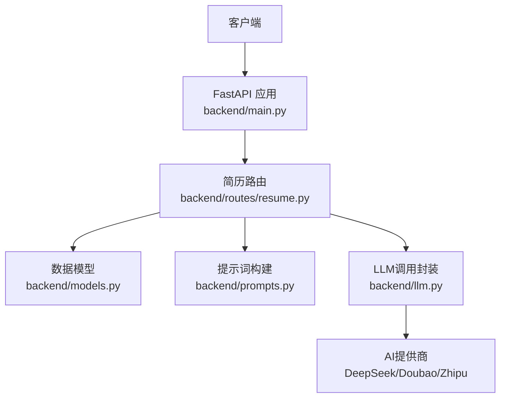
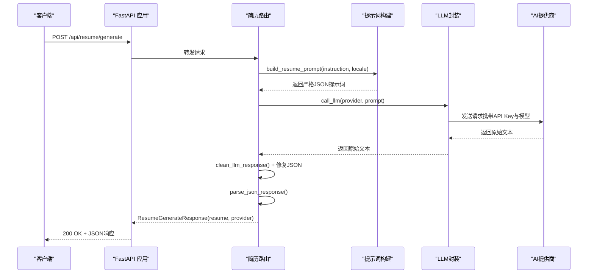
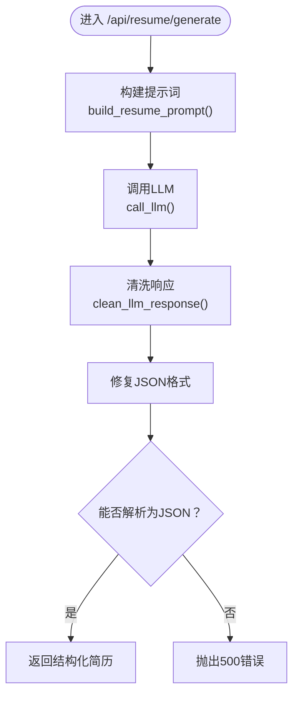
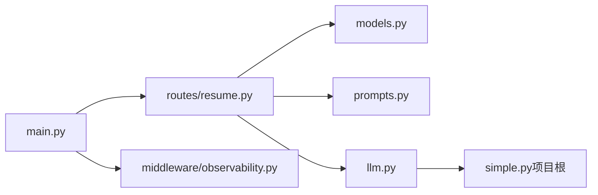

# 简历创建API

<cite>
**本文档引用的文件**
- [backend/routes/resume.py](file://backend/routes/resume.py)
- [backend/models.py](file://backend/models.py)
- [backend/prompts.py](file://backend/prompts.py)
- [backend/llm.py](file://backend/llm.py)
- [backend/main.py](file://backend/main.py)
- [backend/middleware/observability.py](file://backend/middleware/observability.py)
</cite>

## 目录
1. [简介](#简介)
2. [项目结构](#项目结构)
3. [核心组件](#核心组件)
4. [架构概览](#架构概览)
5. [详细组件分析](#详细组件分析)
6. [依赖分析](#依赖分析)
7. [性能考虑](#性能考虑)
8. [故障排查指南](#故障排查指南)
9. [结论](#结论)
10. [附录](#附录)

## 简介
本文件面向“简历创建API”的POST /api/resume/generate端点，提供从请求参数、响应格式、数据验证规则到与AI模型交互流程的完整说明。读者将了解如何构造请求体、理解响应结构、处理错误，以及掌握提示工程与响应解析的关键细节。

## 项目结构
- 后端采用FastAPI框架，路由集中在backend/routes/resume.py中，核心逻辑围绕“从一句话生成结构化简历JSON”展开。
- 数据模型定义于backend/models.py，包含请求与响应的Pydantic模型。
- 提示词构建位于backend/prompts.py，负责根据instruction与locale生成严格的JSON输出提示。
- LLM调用封装在backend/llm.py，统一处理不同提供商（如deepseek、doubao、zhipu）的API Key与模型选择。
- 应用入口backend/main.py注册路由并启用可观测性中间件，便于追踪与日志记录。

图表来源
- [backend/main.py:93-138](file://backend/main.py#L93-L138)
- [backend/routes/resume.py:92-92](file://backend/routes/resume.py#L92-L92)
- [backend/models.py:40-51](file://backend/models.py#L40-L51)
- [backend/prompts.py:11-58](file://backend/prompts.py#L11-L58)
- [backend/llm.py:52-117](file://backend/llm.py#L52-L117)

章节来源
- [backend/main.py:93-138](file://backend/main.py#L93-L138)
- [backend/routes/resume.py:92-92](file://backend/routes/resume.py#L92-L92)

## 核心组件
- 请求模型 ResumeGenerateRequest
  - 字段
    - provider: 可选，枚举值为 "zhipu" | "doubao" | "deepseek"，默认为 "deepseek"
    - instruction: 必填，字符串，描述岗位、经历、技能等的一句话或少量信息
    - locale: 可选，枚举值 "zh" | "en"，默认 "zh"
  - 验证规则
    - instruction非空校验由FastAPI自动执行（必填字段）
    - provider与locale限定枚举值
- 响应模型 ResumeGenerateResponse
  - 字段
    - resume: 字典，结构化简历JSON
    - provider: 字符串，实际使用的提供商标识
- 路由与处理
  - 路由：POST /api/resume/generate
  - 处理流程：构建提示词 → 调用LLM → 清洗与修复JSON → 解析JSON → 返回结构化响应

章节来源
- [backend/models.py:40-51](file://backend/models.py#L40-L51)
- [backend/routes/resume.py:795-820](file://backend/routes/resume.py#L795-L820)

## 架构概览
下图展示了从客户端到AI提供商的整体调用链路，以及关键的错误处理与日志记录位置。

图表来源
- [backend/routes/resume.py:795-820](file://backend/routes/resume.py#L795-L820)
- [backend/prompts.py:11-58](file://backend/prompts.py#L11-L58)
- [backend/llm.py:52-117](file://backend/llm.py#L52-L117)

## 详细组件分析

### 端点：POST /api/resume/generate
- 功能
  - 将用户提供的“一句话”信息转化为结构化简历JSON
- 请求体
  - ResumeGenerateRequest
    - provider: "zhipu" | "doubao" | "deepseek"（默认 "deepseek"）
    - instruction: 必填，字符串
    - locale: "zh" | "en"（默认 "zh"）
- 响应体
  - ResumeGenerateResponse
    - resume: 字典，符合简历JSON Schema
    - provider: 字符串，实际使用的提供商
- 错误处理
  - LLM调用异常：返回500，包含"LLM调用失败"的详细信息
  - JSON解析异常：返回500，包含"解析 JSON 失败"的详细信息
  - API Key缺失：LLM封装层抛出400错误，提示缺少相应提供商的API Key
- 数据验证
  - FastAPI自动校验instruction必填
  - provider与locale枚举限制
  - 响应自动序列化为ResumeGenerateResponse

章节来源
- [backend/routes/resume.py:795-820](file://backend/routes/resume.py#L795-L820)
- [backend/models.py:40-51](file://backend/models.py#L40-L51)
- [backend/llm.py:67-117](file://backend/llm.py#L67-L117)

### 提示工程与响应解析
- 提示词构建
  - build_resume_prompt(instruction, locale)生成严格JSON输出的提示词
  - 重要约束：输出必须为JSON，不包含解释或代码块标记
  - Schema要求：包含name、contact、summary、experience、projects、skills、education、awards等字段
- 响应清洗与修复
  - clean_llm_response移除常见标记与多余字符
  - 修复常见的JSON格式错误（如逗号、引号、括号位置问题）
- JSON解析
  - parse_json_response尝试直接解析，失败时提取最可能的JSON片段
- 错误恢复
  - 若解析失败，返回500错误，避免向前传播无效数据

图表来源
- [backend/routes/resume.py:795-820](file://backend/routes/resume.py#L795-L820)
- [backend/prompts.py:11-58](file://backend/prompts.py#L11-L58)
- [backend/llm.py:52-117](file://backend/llm.py#L52-L117)

章节来源
- [backend/routes/resume.py:136-161](file://backend/routes/resume.py#L136-L161)
- [backend/prompts.py:11-58](file://backend/prompts.py#L11-L58)

### API调用示例与最佳实践
- 请求示例
  - 方法：POST
  - 路径：/api/resume/generate
  - 头部：Content-Type: application/json
  - 示例请求体（不包含具体代码内容）
    - provider: "deepseek"（可选）
    - instruction: "为一位前端开发工程师生成一份包含工作经历、项目经历、技能与教育背景的简历"
    - locale: "zh"（可选）
- 成功响应示例
  - 状态码：200
  - 响应体：包含resume（结构化简历JSON）与provider
- 错误处理
  - 400：缺少API Key或请求参数不合法
  - 500：LLM调用失败或JSON解析失败
  - 可结合X-Accel-Buffering与X-Trace-Id进行调试

章节来源
- [backend/routes/resume.py:795-820](file://backend/routes/resume.py#L795-L820)
- [backend/llm.py:67-117](file://backend/llm.py#L67-L117)

### 与AI模型的交互流程
- 选择提供商与模型
  - 默认提供商：deepseek
  - 默认模型：deepseek-v4-flash（可通过环境变量或参数覆盖）
- 认证与配置
  - 通过环境变量设置API Key（如DASHSCOPE_API_KEY、DOUBAO_API_KEY、ZHIPU_API_KEY）
  - LLM封装层在调用前校验Key是否存在
- 调用方式
  - 同步调用：call_llm(provider, prompt)
  - 流式调用：call_llm_stream(provider, prompt)（用于流式生成端点）

章节来源
- [backend/llm.py:38-49](file://backend/llm.py#L38-L49)
- [backend/llm.py:67-117](file://backend/llm.py#L67-L117)

## 依赖分析
- 组件耦合
  - 路由层依赖模型定义与提示词构建
  - 路由层通过LLM封装访问外部提供商
  - LLM封装依赖simple.py（项目根目录下的实现）
- 外部依赖
  - 环境变量：API Key与模型配置
  - FastAPI中间件：CORS与可观测性（日志、追踪、错误日志）

图表来源
- [backend/routes/resume.py:16-89](file://backend/routes/resume.py#L16-L89)
- [backend/llm.py:20-36](file://backend/llm.py#L20-L36)
- [backend/main.py:74-90](file://backend/main.py#L74-L90)
- [backend/middleware/observability.py:90-147](file://backend/middleware/observability.py#L90-L147)

章节来源
- [backend/routes/resume.py:16-89](file://backend/routes/resume.py#L16-L89)
- [backend/llm.py:20-36](file://backend/llm.py#L20-L36)
- [backend/main.py:74-90](file://backend/main.py#L74-L90)

## 性能考虑
- JSON修复策略
  - 通过正则批量修复常见格式问题，减少解析失败率
- 并行与流式
  - 存在流式生成端点（/api/resume/generate/stream），可结合SSE提升用户体验
- 启动优化
  - 应用启动时预热HTTP连接与数据库连接，降低首次请求延迟

章节来源
- [backend/routes/resume.py:806-812](file://backend/routes/resume.py#L806-L812)
- [backend/main.py:228-295](file://backend/main.py#L228-L295)

## 故障排查指南
- 常见错误与定位
  - 400 缺少API Key：检查环境变量是否正确设置
  - 500 LLM调用失败：查看后端日志与可观测性追踪（X-Trace-Id）
  - 500 JSON解析失败：确认提示词输出严格遵循JSON格式，避免解释性文字
- 日志与追踪
  - 中间件自动记录请求与错误日志，便于定位问题
  - 错误日志包含trace_id、错误类型与堆栈信息

章节来源
- [backend/llm.py:67-117](file://backend/llm.py#L67-L117)
- [backend/middleware/observability.py:90-147](file://backend/middleware/observability.py#L90-L147)

## 结论
POST /api/resume/generate端点通过严格的提示工程与稳健的响应解析，实现了从一句话到结构化简历的自动化生成。配合完善的错误处理与可观测性机制，能够在生产环境中稳定运行。建议在集成时关注API Key配置、locale与provider的选择，以及对JSON输出格式的严格约束。

## 附录
- 端点定义与路由注册
  - 路由：/api/resume/generate
  - 方法：POST
  - 响应模型：ResumeGenerateResponse
- 相关提示词模板
  - build_resume_prompt：严格JSON输出约束与Schema要求
- LLM封装能力
  - 支持提供商：deepseek、doubao、zhipu
  - 默认提供商与模型可在配置中调整

章节来源
- [backend/routes/resume.py:795-820](file://backend/routes/resume.py#L795-L820)
- [backend/prompts.py:11-58](file://backend/prompts.py#L11-L58)
- [backend/llm.py:38-49](file://backend/llm.py#L38-L49)