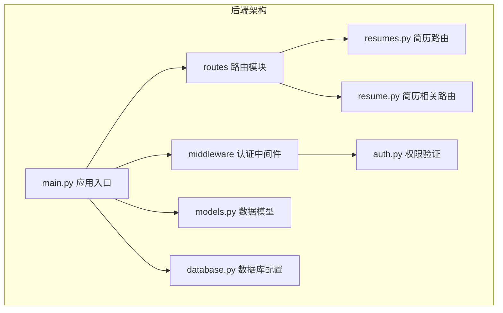
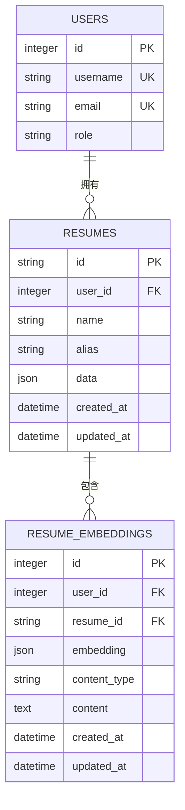
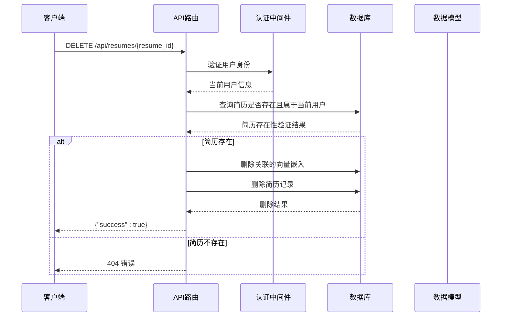
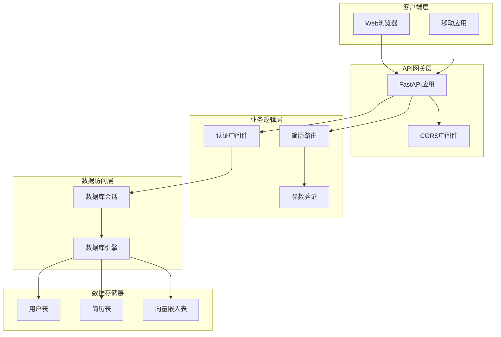
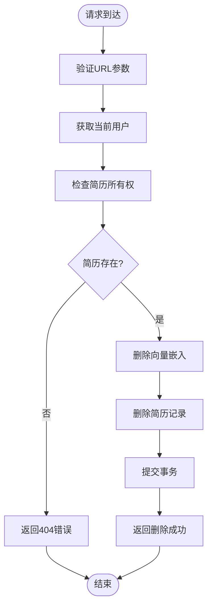
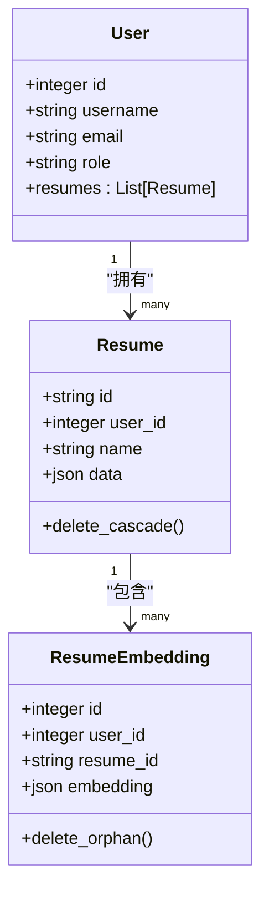
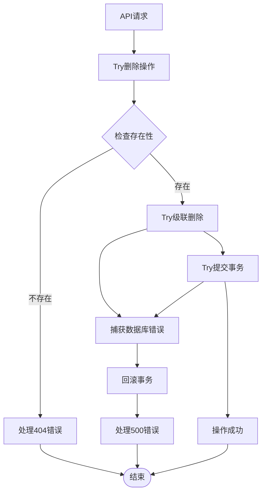

# 简历删除API

<cite>
**本文档引用的文件**
- [backend/routes/resumes.py](file://backend/routes/resumes.py)
- [backend/models.py](file://backend/models.py)
- [backend/middleware/auth.py](file://backend/middleware/auth.py)
- [backend/database.py](file://backend/database.py)
- [backend/main.py](file://backend/main.py)
- [backend/alembic/versions/001_initial.py](file://backend/alembic/versions/001_initial.py)
</cite>

## 目录
1. [简介](#简介)
2. [项目结构](#项目结构)
3. [核心组件](#核心组件)
4. [架构概览](#架构概览)
5. [详细组件分析](#详细组件分析)
6. [依赖关系分析](#依赖关系分析)
7. [性能考虑](#性能考虑)
8. [故障排除指南](#故障排除指南)
9. [结论](#结论)

## 简介

本文档详细说明了简历删除API接口的实现，特别是DELETE /api/resumes/{resume_id}端点。该API实现了完整的简历删除功能，包括权限验证、数据完整性检查、级联删除逻辑、错误处理和审计日志记录。

## 项目结构

后端采用FastAPI框架，路由模块化组织：



**图表来源**
- [backend/main.py:92-138](file://backend/main.py#L92-L138)
- [backend/routes/resumes.py:19](file://backend/routes/resumes.py#L19)

**章节来源**
- [backend/main.py:92-138](file://backend/main.py#L92-L138)
- [backend/routes/resumes.py:19](file://backend/routes/resumes.py#L19)

## 核心组件

### 数据模型关系



**图表来源**
- [backend/models.py:163-181](file://backend/models.py#L163-L181)
- [backend/models.py:310-329](file://backend/models.py#L310-L329)

### 删除流程架构



**图表来源**
- [backend/routes/resumes.py:198-231](file://backend/routes/resumes.py#L198-L231)
- [backend/middleware/auth.py:113-145](file://backend/middleware/auth.py#L113-L145)

**章节来源**
- [backend/routes/resumes.py:198-231](file://backend/routes/resumes.py#L198-L231)
- [backend/models.py:163-181](file://backend/models.py#L163-L181)

## 架构概览

### 系统架构图



**图表来源**
- [backend/main.py:92-138](file://backend/main.py#L92-L138)
- [backend/database.py:90-131](file://backend/database.py#L90-L131)

## 详细组件分析

### 删除API实现详解

#### 路由定义和权限验证

删除API通过FastAPI装饰器定义，使用依赖注入获取当前用户和数据库会话：



**图表来源**
- [backend/routes/resumes.py:198-231](file://backend/routes/resumes.py#L198-L231)

#### 权限验证机制

系统采用多层认证机制确保安全性：

1. **JWT令牌验证**：支持标准Bearer令牌
2. **BetterAuth集成**：支持BetterAuth用户系统
3. **内部信任认证**：支持服务间安全通信
4. **用户角色检查**：确保用户存在且有效

#### 数据完整性检查

删除操作包含严格的完整性检查：

1. **存在性验证**：确认简历记录存在
2. **所有权验证**：确保当前用户是简历所有者
3. **级联删除**：自动删除关联的向量嵌入数据
4. **事务保证**：使用数据库事务确保操作原子性

#### 级联删除逻辑

系统实现了完整的级联删除机制：



**图表来源**
- [backend/models.py:163-181](file://backend/models.py#L163-L181)
- [backend/models.py:310-329](file://backend/models.py#L310-L329)

**章节来源**
- [backend/routes/resumes.py:198-231](file://backend/routes/resumes.py#L198-L231)
- [backend/middleware/auth.py:113-145](file://backend/middleware/auth.py#L113-L145)

### 错误处理和异常管理

系统实现了完善的错误处理机制：



**图表来源**
- [backend/routes/resumes.py:228-231](file://backend/routes/resumes.py#L228-L231)

**章节来源**
- [backend/routes/resumes.py:228-231](file://backend/routes/resumes.py#L228-L231)

## 依赖关系分析

### 数据库依赖关系

```mermaid
graph LR
subgraph "数据库表关系"
A[users] --> B[resumes]
B --> C[resume_embeddings]
B -.-> D[users]
end
subgraph "删除约束"
B -.onDelete.CASCADE.-> A
C -.onDelete.CASCADE.-> B
C -.onDelete.CASCADE.-> A
end
```

**图表来源**
- [backend/alembic/versions/001_initial.py:30-40](file://backend/alembic/versions/001_initial.py#L30-L40)
- [backend/models.py:169](file://backend/models.py#L169)

### 外部依赖

系统依赖的关键外部组件：

1. **SQLAlchemy**：ORM框架，负责数据库操作
2. **FastAPI**：Web框架，提供REST API功能
3. **Pydantic**：数据验证和序列化
4. **数据库驱动**：支持MySQL、PostgreSQL和SQLite

**章节来源**
- [backend/database.py:90-131](file://backend/database.py#L90-L131)
- [backend/models.py:163-181](file://backend/models.py#L163-L181)

## 性能考虑

### 数据库性能优化

1. **索引优化**：简历表在user_id和updated_at上有索引
2. **批量删除**：使用synchronize_session=False避免不必要的关系加载
3. **连接池管理**：配置合适的连接池大小和超时参数
4. **事务优化**：最小化事务持续时间

### 缓存策略

系统支持以下缓存机制：
- **连接预热**：应用启动时预热数据库连接
- **会话复用**：使用LIFO连接池策略
- **超时配置**：合理设置连接超时参数

## 故障排除指南

### 常见问题和解决方案

#### 404错误
**症状**：删除不存在的简历
**原因**：简历ID不存在或不属于当前用户
**解决方案**：确认简历ID正确性和用户权限

#### 500错误
**症状**：数据库操作失败
**原因**：数据库连接异常或事务冲突
**解决方案**：检查数据库连接状态，重试操作

#### 权限错误
**症状**：401或403错误
**原因**：认证失败或权限不足
**解决方案**：重新登录，检查用户角色

### 调试技巧

1. **启用详细日志**：设置LOG_LEVEL=DEBUG
2. **监控数据库连接**：使用数据库监控工具
3. **检查事务状态**：确认事务是否正确提交

**章节来源**
- [backend/routes/resumes.py:228-231](file://backend/routes/resumes.py#L228-L231)
- [backend/middleware/auth.py:40-86](file://backend/middleware/auth.py#L40-L86)

## 结论

简历删除API实现了安全、可靠的简历删除功能。通过多层认证机制、完整的数据完整性检查和级联删除逻辑，确保了数据的一致性和安全性。系统的设计充分考虑了性能优化和错误处理，为用户提供可靠的删除体验。

主要特点包括：
- 完整的权限验证机制
- 原子性事务操作
- 自动级联删除
- 详细的错误处理
- 性能优化的数据库操作

该实现为简历管理系统提供了坚实的基础，支持未来的扩展和维护需求。