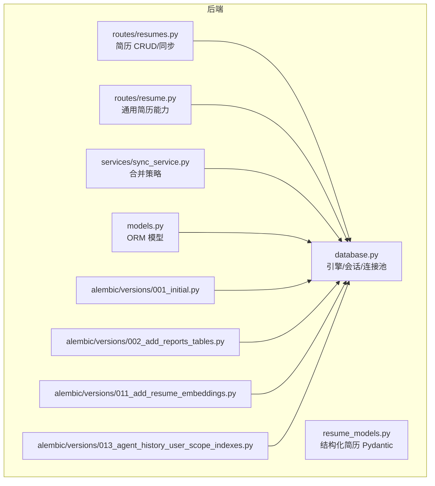
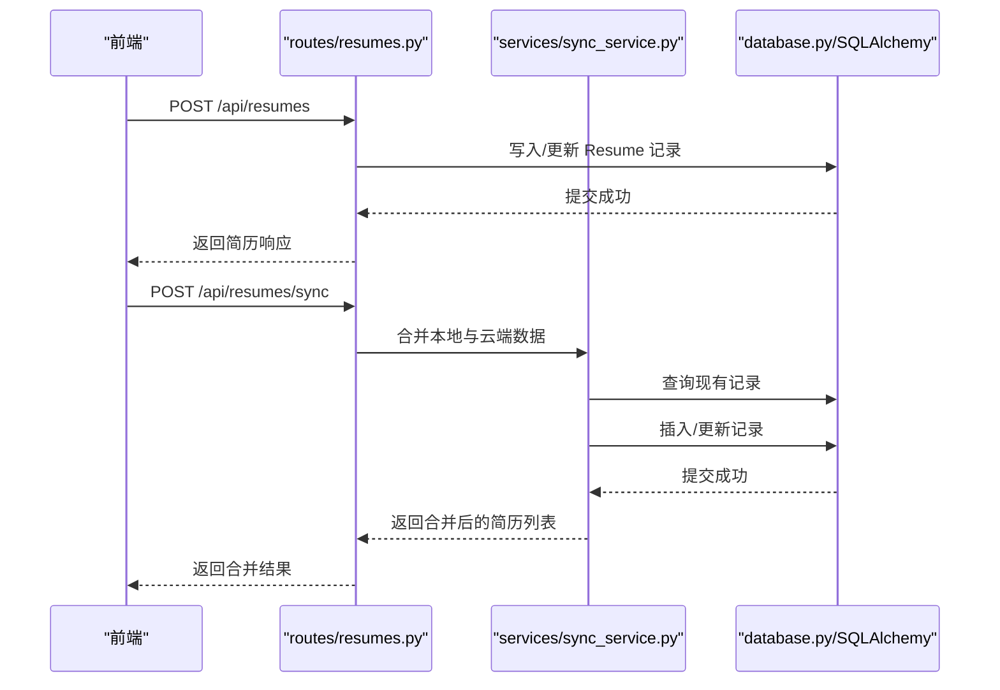
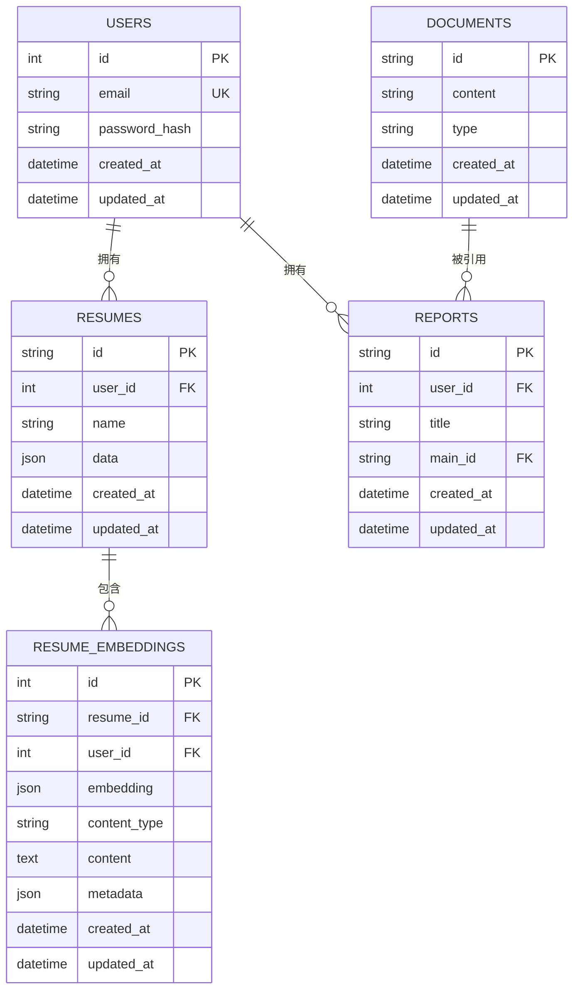
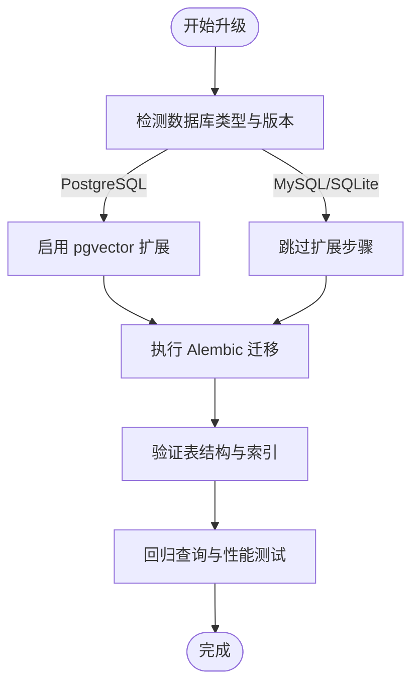
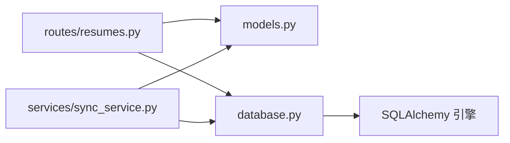

# 简历存储策略

<cite>
**本文引用的文件**
- [backend/models.py](file://backend/models.py)
- [backend/resume_models.py](file://backend/resume_models.py)
- [backend/database.py](file://backend/database.py)
- [backend/routes/resume.py](file://backend/routes/resume.py)
- [backend/routes/resumes.py](file://backend/routes/resumes.py)
- [backend/services/sync_service.py](file://backend/services/sync_service.py)
- [backend/create_tables.py](file://backend/create_tables.py)
- [backend/check_sqlite_structure.py](file://backend/check_sqlite_structure.py)
- [backend/alembic/versions/001_initial.py](file://backend/alembic/versions/001_initial.py)
- [backend/alembic/versions/002_add_reports_tables.py](file://backend/alembic/versions/002_add_reports_tables.py)
- [backend/alembic/versions/011_add_resume_embeddings.py](file://backend/alembic/versions/011_add_resume_embeddings.py)
- [backend/alembic/versions/013_agent_history_user_scope_indexes.py](file://backend/alembic/versions/013_agent_history_user_scope_indexes.py)
</cite>

## 目录
1. [简介](#简介)
2. [项目结构](#项目结构)
3. [核心组件](#核心组件)
4. [架构总览](#架构总览)
5. [详细组件分析](#详细组件分析)
6. [依赖分析](#依赖分析)
7. [性能考虑](#性能考虑)
8. [故障排查指南](#故障排查指南)
9. [结论](#结论)
10. [附录](#附录)

## 简介
本文件面向“简历存储策略”，系统性阐述简历数据的持久化机制、版本与历史管理、备份与恢复、性能优化、以及数据迁移与升级流程。文档以仓库现有实现为基础，结合数据库模型、路由与服务层逻辑，给出可操作的策略建议与最佳实践。

## 项目结构
简历存储相关的核心位于后端目录，围绕以下层次组织：
- 数据模型层：定义 SQLAlchemy ORM 模型与 Pydantic 数据模型
- 数据库配置层：连接池、方言切换、初始化入口
- 路由与服务层：简历 CRUD、同步、向量嵌入、索引与迁移
- 迁移与校验：Alembic 版本化迁移与 SQLite 结构检查脚本

图表来源
- [backend/database.py:1-138](file://backend/database.py#L1-L138)
- [backend/models.py:111-182](file://backend/models.py#L111-L182)
- [backend/resume_models.py:82-128](file://backend/resume_models.py#L82-L128)
- [backend/routes/resume.py:1-120](file://backend/routes/resume.py#L1-L120)
- [backend/routes/resumes.py:1-60](file://backend/routes/resumes.py#L1-L60)
- [backend/services/sync_service.py:25-87](file://backend/services/sync_service.py#L25-L87)
- [backend/alembic/versions/001_initial.py:19-48](file://backend/alembic/versions/001_initial.py#L19-L48)
- [backend/alembic/versions/002_add_reports_tables.py:19-66](file://backend/alembic/versions/002_add_reports_tables.py#L19-L66)
- [backend/alembic/versions/011_add_resume_embeddings.py:19-51](file://backend/alembic/versions/011_add_resume_embeddings.py#L19-L51)
- [backend/alembic/versions/013_agent_history_user_scope_indexes.py:18-24](file://backend/alembic/versions/013_agent_history_user_scope_indexes.py#L18-L24)

章节来源
- [backend/database.py:1-138](file://backend/database.py#L1-L138)
- [backend/models.py:111-182](file://backend/models.py#L111-L182)
- [backend/resume_models.py:82-128](file://backend/resume_models.py#L82-L128)
- [backend/routes/resume.py:1-120](file://backend/routes/resume.py#L1-L120)
- [backend/routes/resumes.py:1-60](file://backend/routes/resumes.py#L1-L60)
- [backend/services/sync_service.py:25-87](file://backend/services/sync_service.py#L25-L87)
- [backend/alembic/versions/001_initial.py:19-48](file://backend/alembic/versions/001_initial.py#L19-L48)
- [backend/alembic/versions/002_add_reports_tables.py:19-66](file://backend/alembic/versions/002_add_reports_tables.py#L19-L66)
- [backend/alembic/versions/011_add_resume_embeddings.py:19-51](file://backend/alembic/versions/011_add_resume_embeddings.py#L19-L51)
- [backend/alembic/versions/013_agent_history_user_scope_indexes.py:18-24](file://backend/alembic/versions/013_agent_history_user_scope_indexes.py#L18-L24)

## 核心组件
- 数据模型与表结构
  - 用户表 users：用户名、邮箱唯一索引、角色、API 配额、最近登录 IP 等
  - 简历表 resumes：主键为字符串 ID，外键关联用户，JSON 字段存储完整简历数据，带更新时间索引
  - 向量嵌入表 resume_embeddings：支持按 content_type 分片检索，含复合索引
  - 其他辅助表：报告/文档、Agent 对话与消息、权限审计、API 日志等
- 数据库配置与连接池
  - 自动识别 PostgreSQL/MySQL/SQLite，统一连接参数、池大小、回收与超时
  - 支持预检与连接超时回退策略
- 路由与服务
  - 简历 CRUD：创建、更新（幂等）、删除、列表、单条查询
  - 同步服务：基于 updated_at 的合并策略，避免覆盖旧数据
  - 通用简历能力：解析、改写、翻译、健康检查等（非持久化核心，但依赖存储）

章节来源
- [backend/models.py:111-182](file://backend/models.py#L111-L182)
- [backend/models.py:310-330](file://backend/models.py#L310-L330)
- [backend/database.py:26-112](file://backend/database.py#L26-L112)
- [backend/routes/resumes.py:52-196](file://backend/routes/resumes.py#L52-L196)
- [backend/services/sync_service.py:25-87](file://backend/services/sync_service.py#L25-L87)

## 架构总览
简历数据在系统内的流转路径如下：
- 前端通过 /api/resumes 接口进行 CRUD 与同步
- 服务层调用 SQLAlchemy 会话访问 resumes 表
- 同步服务依据 updated_at 决策插入或更新
- 向量嵌入表用于语义检索，配合复合索引提升查询效率

图表来源
- [backend/routes/resumes.py:98-196](file://backend/routes/resumes.py#L98-L196)
- [backend/services/sync_service.py:25-87](file://backend/services/sync_service.py#L25-L87)
- [backend/database.py:121-131](file://backend/database.py#L121-L131)

## 详细组件分析

### 数据模型与表结构
- 用户表 users
  - 主键：自增整数
  - 索引：email 唯一索引、updated_at 索引、role 索引、last_login_ip 索引
  - 关系：一对多到 resumes
- 简历表 resumes
  - 主键：字符串 ID
  - 外键：user_id -> users(id)（级联删除）
  - JSON 字段：data 存储完整简历结构
  - 索引：user_id、updated_at
- 向量嵌入表 resume_embeddings
  - 复合索引：user_id + content_type
  - 作用：按用户与片段类型快速检索
- 其他表
  - 报告/文档表：与用户、简历存在外键关联
  - Agent 对话与消息：会话表含用户范围索引，加速用户维度查询

图表来源
- [backend/models.py:111-182](file://backend/models.py#L111-L182)
- [backend/models.py:310-330](file://backend/models.py#L310-L330)
- [backend/alembic/versions/002_add_reports_tables.py:19-66](file://backend/alembic/versions/002_add_reports_tables.py#L19-L66)

章节来源
- [backend/models.py:111-182](file://backend/models.py#L111-L182)
- [backend/models.py:310-330](file://backend/models.py#L310-L330)
- [backend/alembic/versions/002_add_reports_tables.py:19-66](file://backend/alembic/versions/002_add_reports_tables.py#L19-L66)

### 索引策略与查询优化
- resumes
  - user_id：按用户过滤简历
  - updated_at：按更新时间排序与筛选
- resume_embeddings
  - user_id + content_type：按用户与片段类型快速检索
  - resume_id：按简历 ID 过滤
- agent_conversations
  - user_id + last_message_at + updated_at：用户维度的高效查询与排序
- 建议
  - 为高频查询列建立合适索引，避免全表扫描
  - 对 JSON 字段的查询尽量通过结构化字段替代
  - 使用复合索引覆盖常见过滤-排序组合

章节来源
- [backend/alembic/versions/001_initial.py:39-40](file://backend/alembic/versions/001_initial.py#L39-L40)
- [backend/alembic/versions/011_add_resume_embeddings.py:40-50](file://backend/alembic/versions/011_add_resume_embeddings.py#L40-L50)
- [backend/alembic/versions/013_agent_history_user_scope_indexes.py:18-24](file://backend/alembic/versions/013_agent_history_user_scope_indexes.py#L18-L24)

### 版本控制与历史记录管理
- 当前实现
  - 简历表采用单版本存储，通过 updated_at 字段记录变更时间
  - 同步服务以 updated_at 为准进行合并，避免覆盖旧数据
- 历史记录扩展建议
  - 新增简历历史表：记录每次变更的快照（如 JSON diff 或完整快照），保留变更人、时间、原因
  - 为 resumes 增加版本号字段，支持回滚与对比
  - 为 resume_embeddings 增加版本字段，保证检索一致性

章节来源
- [backend/routes/resumes.py:142-175](file://backend/routes/resumes.py#L142-L175)
- [backend/services/sync_service.py:60-68](file://backend/services/sync_service.py#L60-L68)

### 备份与恢复策略
- 全量备份
  - PostgreSQL/MySQL：使用官方工具导出 SQL 或二进制格式
  - SQLite：复制数据库文件
- 增量备份
  - 基于 WAL/binlog 的增量捕获（PostgreSQL 使用逻辑解码，MySQL 使用 binlog）
  - 文件系统层面的增量（SQLite 文件复制）
- 恢复流程
  - 验证备份完整性与时间点
  - 在隔离环境中验证恢复数据一致性
  - 逐步切换流量至新实例
- 运维脚本
  - 使用结构检查脚本核对 SQLite 表结构与索引

章节来源
- [backend/check_sqlite_structure.py:1-97](file://backend/check_sqlite_structure.py#L1-L97)

### 存储性能优化
- 连接池与方言
  - 统一连接参数、池大小、回收与超时，启用 pre_ping（按需）
  - PostgreSQL 使用 psycopg 驱动，MySQL 使用 pymysql 驱动
- 读写分离
  - 读多写少场景：将 list/get 请求路由至只读副本，写操作路由至主库
  - 通过中间件或路由层实现透明分流
- 缓存策略
  - 热点简历数据缓存（短期有效），结合失效策略
  - 向量检索结果缓存（降低 pgvector 查询压力）
- 并发与批处理
  - 批量插入/更新，减少往返次数
  - 合并策略避免重复写入

章节来源
- [backend/database.py:72-112](file://backend/database.py#L72-L112)
- [backend/routes/resumes.py:234-262](file://backend/routes/resumes.py#L234-L262)
- [backend/services/sync_service.py:25-87](file://backend/services/sync_service.py#L25-L87)

### 数据迁移与升级
- 版本化迁移
  - 使用 Alembic 管理数据库演进，初始版本创建 users/resumes 表
  - 新增报告/文档表、向量嵌入表、Agent 对话索引等
- 升级流程
  - 在新版本部署前执行迁移
  - 对 PostgreSQL 先启用 pgvector 扩展
  - 逐步验证索引与查询性能
- 回滚策略
  - 降级到上一版本前，确保数据结构兼容
  - 保留必要的降级脚本与数据映射

图表来源
- [backend/alembic/versions/001_initial.py:19-48](file://backend/alembic/versions/001_initial.py#L19-L48)
- [backend/alembic/versions/002_add_reports_tables.py:19-66](file://backend/alembic/versions/002_add_reports_tables.py#L19-L66)
- [backend/alembic/versions/011_add_resume_embeddings.py:19-51](file://backend/alembic/versions/011_add_resume_embeddings.py#L19-L51)

章节来源
- [backend/alembic/versions/001_initial.py:19-48](file://backend/alembic/versions/001_initial.py#L19-L48)
- [backend/alembic/versions/002_add_reports_tables.py:19-66](file://backend/alembic/versions/002_add_reports_tables.py#L19-L66)
- [backend/alembic/versions/011_add_resume_embeddings.py:19-51](file://backend/alembic/versions/011_add_resume_embeddings.py#L19-L51)

## 依赖分析
- 组件耦合
  - routes/resumes.py 依赖 models.Resume 与 database.get_db
  - services/sync_service.py 依赖 models.Resume、models.User 与 SQLAlchemy 会话
  - database.py 为全局引擎与会话工厂，被各层共享
- 外部依赖
  - SQLAlchemy ORM 与 Alembic 迁移
  - PostgreSQL/MySQL/SQLite 驱动
  - 环境变量驱动的连接配置

图表来源
- [backend/routes/resumes.py:1-60](file://backend/routes/resumes.py#L1-L60)
- [backend/services/sync_service.py:1-12](file://backend/services/sync_service.py#L1-L12)
- [backend/database.py:1-25](file://backend/database.py#L1-L25)

章节来源
- [backend/routes/resumes.py:1-60](file://backend/routes/resumes.py#L1-L60)
- [backend/services/sync_service.py:1-12](file://backend/services/sync_service.py#L1-L12)
- [backend/database.py:1-25](file://backend/database.py#L1-L25)

## 性能考虑
- 连接池参数
  - pool_size、max_overflow、pool_timeout、pool_recycle、pool_pre_ping
  - 根据 QPS 与延迟调整，避免连接争用
- 查询优化
  - 为高频过滤与排序列建立索引
  - 避免 SELECT *，仅取必要字段
  - 使用 LIMIT 与分页
- 写入优化
  - 批量写入与合并策略
  - 减少不必要的更新（基于 updated_at 的幂等更新）
- 向量检索
  - 合理使用复合索引与向量维度
  - 控制检索上下文大小，避免超长文本影响性能

## 故障排查指南
- 连接失败
  - 检查 DATABASE_URL/POSTGRESQL_URL 环境变量
  - 调整连接超时与预检开关
- 表结构异常
  - 使用 SQLite 结构检查脚本核对表与索引
  - 执行初始化脚本重建表
- 同步冲突
  - 核对 updated_at 时间戳，确认合并策略生效
  - 检查是否存在跨用户 ID 冲突
- 迁移失败
  - 确认数据库类型与扩展（pgvector）
  - 逐版本执行迁移，定位失败节点

章节来源
- [backend/database.py:26-112](file://backend/database.py#L26-L112)
- [backend/check_sqlite_structure.py:1-97](file://backend/check_sqlite_structure.py#L1-L97)
- [backend/create_tables.py:1-22](file://backend/create_tables.py#L1-L22)
- [backend/services/sync_service.py:60-68](file://backend/services/sync_service.py#L60-L68)

## 结论
本项目采用结构化的 ORM 模型与版本化迁移，结合连接池与索引策略，实现了简历数据的稳定持久化。通过 updated_at 驱动的合并策略，兼顾了多端同步与数据一致性。建议在现有基础上引入版本历史与增量备份机制，进一步完善数据治理与灾难恢复能力。

## 附录
- 初始化与创建表
  - 使用 create_tables.py 调用 init_db 创建所有表
- SQLite 结构检查
  - 使用 check_sqlite_structure.py 输出表结构、索引与外键信息

章节来源
- [backend/create_tables.py:1-22](file://backend/create_tables.py#L1-L22)
- [backend/check_sqlite_structure.py:1-97](file://backend/check_sqlite_structure.py#L1-L97)