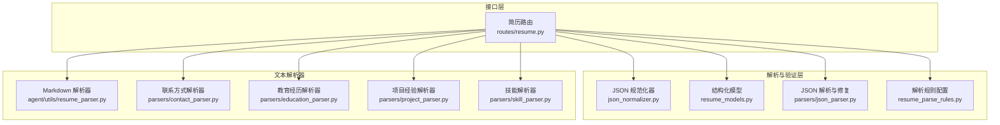
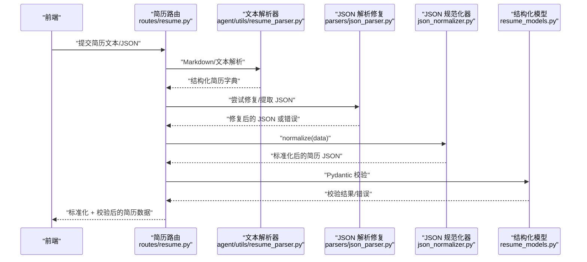
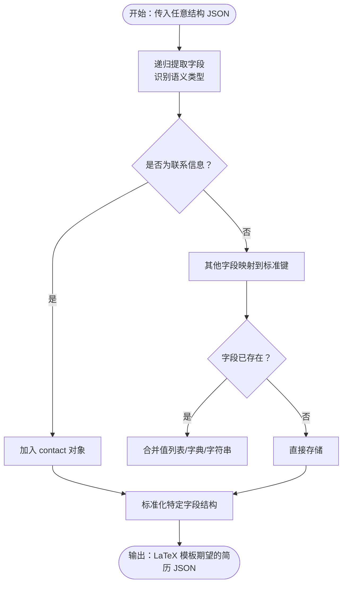
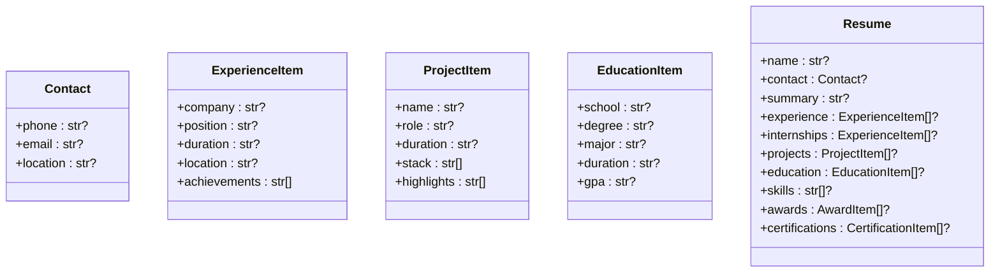
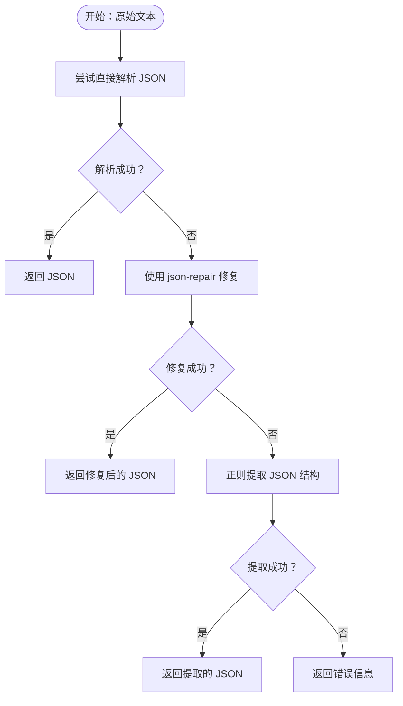
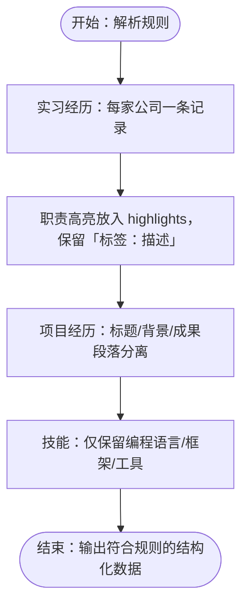
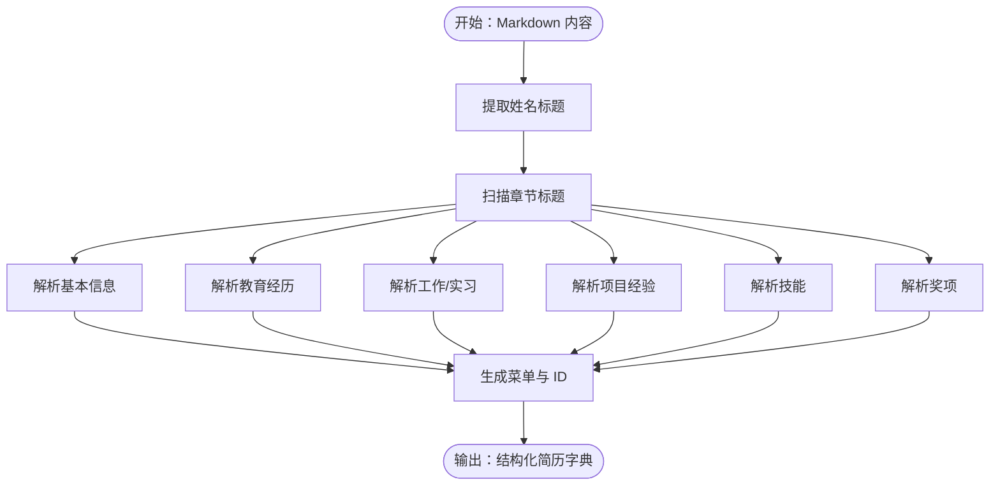
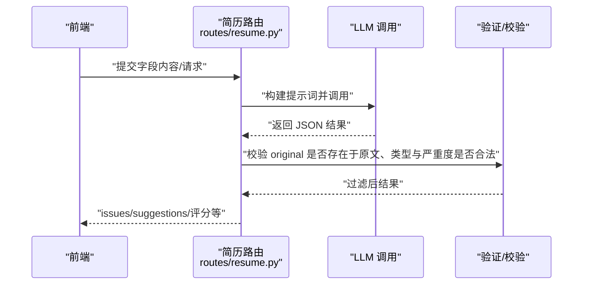
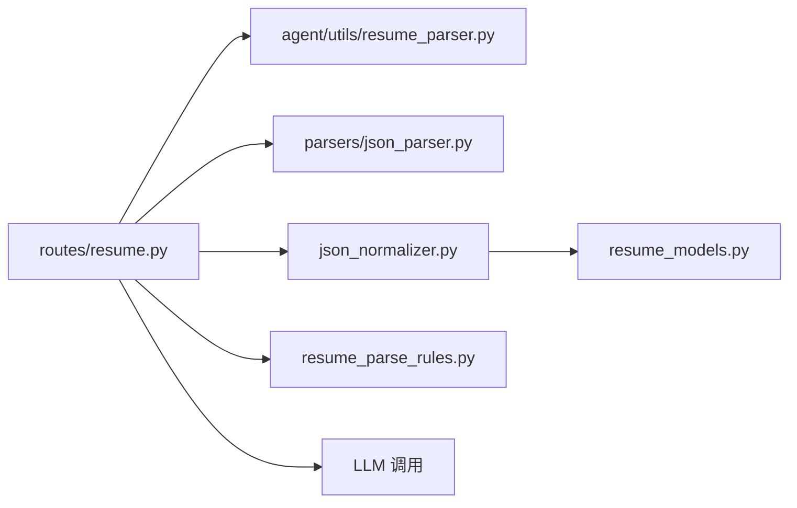

# 简历数据验证规则

<cite>
**本文档引用的文件**
- [json_normalizer.py](file://backend/json_normalizer.py)
- [resume_parse_rules.py](file://backend/resume_parse_rules.py)
- [json_parser.py](file://backend/parsers/json_parser.py)
- [resume_models.py](file://backend/resume_models.py)
- [resume_parser.py](file://backend/agent/utils/resume_parser.py)
- [contact_parser.py](file://backend/parsers/contact_parser.py)
- [education_parser.py](file://backend/parsers/education_parser.py)
- [project_parser.py](file://backend/parsers/project_parser.py)
- [skill_parser.py](file://backend/parsers/skill_parser.py)
- [resume.py](file://backend/routes/resume.py)
</cite>

## 目录
1. [引言](#引言)
2. [项目结构](#项目结构)
3. [核心组件](#核心组件)
4. [架构总览](#架构总览)
5. [详细组件分析](#详细组件分析)
6. [依赖关系分析](#依赖关系分析)
7. [性能考量](#性能考量)
8. [故障排查指南](#故障排查指南)
9. [结论](#结论)
10. [附录](#附录)

## 引言
本文件面向“简历数据验证规则”的实现与使用，系统化阐述以下内容：
- 简历数据的验证逻辑：字段类型检查、格式验证、业务规则验证
- JSON 规范化流程：如何将任意结构的简历 JSON 转换为 LaTeX 模板期望的标准结构
- 解析规则的配置与扩展机制：如何通过规则文件与解析器进行扩展
- 验证错误的分类与处理：如何生成用户友好的错误消息并与前端表单验证协同

## 项目结构
围绕简历数据验证与解析的关键目录与文件如下：
- 后端核心验证与规范化
  - JSON 规范化器：backend/json_normalizer.py
  - 结构化模型（Pydantic）：backend/resume_models.py
  - JSON 解析与修复：backend/parsers/json_parser.py
  - 解析规则配置：backend/resume_parse_rules.py
- LLM/文本解析器
  - Markdown 简历解析：backend/agent/utils/resume_parser.py
  - 联系方式解析：backend/parsers/contact_parser.py
  - 教育经历解析：backend/parsers/education_parser.py
  - 项目经验解析：backend/parsers/project_parser.py
  - 技能解析：backend/parsers/skill_parser.py
- 接口层（与前端交互）
  - 简历相关路由：backend/routes/resume.py

**图表来源**
- [json_normalizer.py:15-536](file://backend/json_normalizer.py#L15-L536)
- [resume_models.py:10-128](file://backend/resume_models.py#L10-L128)
- [json_parser.py:7-55](file://backend/parsers/json_parser.py#L7-L55)
- [resume_parse_rules.py:3-15](file://backend/resume_parse_rules.py#L3-L15)
- [resume_parser.py:9-478](file://backend/agent/utils/resume_parser.py#L9-L478)
- [contact_parser.py:7-63](file://backend/parsers/contact_parser.py#L7-L63)
- [education_parser.py:7-79](file://backend/parsers/education_parser.py#L7-L79)
- [project_parser.py:7-109](file://backend/parsers/project_parser.py#L7-L109)
- [skill_parser.py:7-83](file://backend/parsers/skill_parser.py#L7-L83)
- [resume.py:1-800](file://backend/routes/resume.py#L1-L800)

**章节来源**
- [json_normalizer.py:15-536](file://backend/json_normalizer.py#L15-L536)
- [resume_models.py:10-128](file://backend/resume_models.py#L10-L128)
- [json_parser.py:7-55](file://backend/parsers/json_parser.py#L7-L55)
- [resume_parse_rules.py:3-15](file://backend/resume_parse_rules.py#L3-L15)
- [resume_parser.py:9-478](file://backend/agent/utils/resume_parser.py#L9-L478)
- [contact_parser.py:7-63](file://backend/parsers/contact_parser.py#L7-L63)
- [education_parser.py:7-79](file://backend/parsers/education_parser.py#L7-L79)
- [project_parser.py:7-109](file://backend/parsers/project_parser.py#L7-L109)
- [skill_parser.py:7-83](file://backend/parsers/skill_parser.py#L7-L83)
- [resume.py:1-800](file://backend/routes/resume.py#L1-L800)

## 核心组件
- JSON 规范化器：将任意结构的简历 JSON 转换为 LaTeX 模板期望的标准结构，支持字段语义识别、联系信息抽取、结构标准化与字段映射。
- 结构化模型（Pydantic）：定义简历各字段的数据模型，用于结构化输出与前端渲染。
- JSON 解析与修复：尝试修复与提取 JSON，增强鲁棒性。
- 解析规则配置：集中管理 LLM 解析的业务规则，确保实习经历、项目经历等的统一格式。
- 文本解析器集合：针对 Markdown/纯文本简历进行结构化解析，提取联系信息、教育经历、项目经验、技能等。
- 接口层：提供简历生成、语法检查、翻译、健康体检等接口，贯穿验证与规范化流程。

**章节来源**
- [json_normalizer.py:66-95](file://backend/json_normalizer.py#L66-L95)
- [resume_models.py:82-128](file://backend/resume_models.py#L82-L128)
- [json_parser.py:7-55](file://backend/parsers/json_parser.py#L7-L55)
- [resume_parse_rules.py:3-15](file://backend/resume_parse_rules.py#L3-L15)
- [resume_parser.py:24-139](file://backend/agent/utils/resume_parser.py#L24-L139)

## 架构总览
简历数据验证与规范化流程分为两条主线：
- 结构化解析链路：文本解析器 → JSON 规范化器 → 结构化模型校验 → 前端渲染
- 接口驱动链路：接口层接收请求 → 调用解析/规范化 → 返回结构化结果

**图表来源**
- [resume.py:1-800](file://backend/routes/resume.py#L1-L800)
- [resume_parser.py:24-139](file://backend/agent/utils/resume_parser.py#L24-L139)
- [json_parser.py:7-55](file://backend/parsers/json_parser.py#L7-L55)
- [json_normalizer.py:66-95](file://backend/json_normalizer.py#L66-L95)
- [resume_models.py:82-128](file://backend/resume_models.py#L82-L128)

## 详细组件分析

### JSON 规范化器（字段类型检查、格式验证、业务规则）
- 字段语义识别：通过语义模式表识别 name、phone、email、location、experience、internships、projects、opensource、skills、education、awards 等字段，支持中英文与多种表达方式。
- 联系信息抽取：将 phone、email、location 提取到 contact 对象中，避免分散存储。
- 结构标准化：针对开源经历、实习/工作经历、项目经验、教育经历进行字段映射与结构规整，确保与 LaTeX 模板一致。
- 字符串解析：对实习经历字符串进行解析，提取公司、职位、时间等关键信息。
- 合并策略：对重复字段采用合并策略（列表拼接、字典合并、字符串拼接），保证数据完整性。

**图表来源**
- [json_normalizer.py:97-236](file://backend/json_normalizer.py#L97-L236)
- [json_normalizer.py:237-474](file://backend/json_normalizer.py#L237-L474)

**章节来源**
- [json_normalizer.py:24-64](file://backend/json_normalizer.py#L24-L64)
- [json_normalizer.py:97-190](file://backend/json_normalizer.py#L97-L190)
- [json_normalizer.py:237-474](file://backend/json_normalizer.py#L237-L474)

### 结构化模型（Pydantic）与字段类型检查
- 模型设计：以可选字段为主，允许用户按需填写，减少强制约束。
- 字段覆盖：涵盖联系信息、工作/实习、项目、教育、技能、奖项、证书等模块。
- 校验用途：在规范化后对最终简历 JSON 进行结构化校验，确保字段类型与模板一致。

**图表来源**
- [resume_models.py:10-128](file://backend/resume_models.py#L10-L128)

**章节来源**
- [resume_models.py:82-128](file://backend/resume_models.py#L82-L128)

### JSON 解析与修复（格式验证）
- 直接解析：尝试直接解析去除首尾空白的字符串。
- 修复解析：使用第三方库进行 JSON 修复，提升鲁棒性。
- 正则提取：在无法直接解析时，尝试使用正则提取 JSON 结构。

**图表来源**
- [json_parser.py:7-55](file://backend/parsers/json_parser.py#L7-L55)

**章节来源**
- [json_parser.py:7-55](file://backend/parsers/json_parser.py#L7-L55)

### 解析规则配置（业务规则验证）
- 实习经历规则：强调每家公司/组织只有一条记录，职责高亮统一放入 highlights，保持“标签：描述”格式。
- 项目经历规则：明确项目标题、背景、成果等段落的归属，避免将技术细节误入 skills。
- 技能规则：仅保留编程语言、框架、工具等技能列表，避免混入项目/实习细节。

**图表来源**
- [resume_parse_rules.py:3-15](file://backend/resume_parse_rules.py#L3-L15)

**章节来源**
- [resume_parse_rules.py:3-15](file://backend/resume_parse_rules.py#L3-L15)

### 文本解析器（字段类型检查与格式验证）
- Markdown 解析：从标题、章节、列表中提取基本信息、教育经历、工作/实习、项目经验、技能、奖项等，并生成前端所需的菜单与 ID。
- 联系方式解析：支持电话、邮箱、求职方向的提取与清洗。
- 教育经历解析：支持多种时间格式与学校/专业/学位组合，提取荣誉信息。
- 项目经验解析：支持层级结构（项目/子项目/模块），提取描述与亮点。
- 技能解析：支持分类格式与简单列表格式，过滤非技能内容。

**图表来源**
- [resume_parser.py:24-139](file://backend/agent/utils/resume_parser.py#L24-L139)
- [contact_parser.py:23-61](file://backend/parsers/contact_parser.py#L23-L61)
- [education_parser.py:7-79](file://backend/parsers/education_parser.py#L7-L79)
- [project_parser.py:7-109](file://backend/parsers/project_parser.py#L7-L109)
- [skill_parser.py:7-83](file://backend/parsers/skill_parser.py#L7-L83)

**章节来源**
- [resume_parser.py:24-139](file://backend/agent/utils/resume_parser.py#L24-L139)
- [contact_parser.py:23-61](file://backend/parsers/contact_parser.py#L23-L61)
- [education_parser.py:7-79](file://backend/parsers/education_parser.py#L7-L79)
- [project_parser.py:7-109](file://backend/parsers/project_parser.py#L7-L109)
- [skill_parser.py:7-83](file://backend/parsers/skill_parser.py#L7-L83)

### 接口层（验证错误分类与处理）
- 语法/表达体检：返回结构化 issues（类型 grammar/wording/vague/quantify，严重程度 high/medium/low），并提供评分与摘要。
- 多字段翻译：保留 HTML 结构，逐字段翻译并返回可替换片段。
- 健康体检：按维度评分并给出可应用建议。
- JD 匹配优化：给出与目标岗位匹配度、ATS 兼容度与关键词匹配情况。

**图表来源**
- [resume.py:362-420](file://backend/routes/resume.py#L362-L420)
- [resume.py:551-613](file://backend/routes/resume.py#L551-L613)
- [resume.py:638-683](file://backend/routes/resume.py#L638-L683)
- [resume.py:685-724](file://backend/routes/resume.py#L685-L724)
- [resume.py:726-792](file://backend/routes/resume.py#L726-L792)

**章节来源**
- [resume.py:362-420](file://backend/routes/resume.py#L362-L420)
- [resume.py:551-613](file://backend/routes/resume.py#L551-L613)
- [resume.py:638-683](file://backend/routes/resume.py#L638-L683)
- [resume.py:685-724](file://backend/routes/resume.py#L685-L724)
- [resume.py:726-792](file://backend/routes/resume.py#L726-L792)

## 依赖关系分析
- 组件耦合
  - 接口层依赖解析器与规范化器，形成“输入 → 解析/修复 → 规范化 → 校验 → 输出”的主链路。
  - 规范化器与模型共同承担“结构一致性”职责，前者负责语义与结构映射，后者负责类型与必填校验。
  - 文本解析器与 JSON 解析器互补：前者面向 Markdown/文本，后者面向 JSON 字符串。
- 外部依赖
  - JSON 修复依赖第三方库（在修复失败时返回错误信息）。
  - LLM 调用用于语法检查、翻译、健康体检与 JD 优化，接口层对返回结果进行二次校验与过滤。

**图表来源**
- [resume.py:1-800](file://backend/routes/resume.py#L1-L800)
- [resume_parser.py:24-139](file://backend/agent/utils/resume_parser.py#L24-L139)
- [json_parser.py:7-55](file://backend/parsers/json_parser.py#L7-L55)
- [json_normalizer.py:66-95](file://backend/json_normalizer.py#L66-L95)
- [resume_models.py:82-128](file://backend/resume_models.py#L82-L128)
- [resume_parse_rules.py:3-15](file://backend/resume_parse_rules.py#L3-L15)

**章节来源**
- [resume.py:1-800](file://backend/routes/resume.py#L1-L800)

## 性能考量
- 并发与限流：翻译接口采用信号量限制并发，避免 LLM 调用过载。
- 结果缓存：规范化与解析结果可结合业务场景进行缓存，减少重复计算。
- 正则与循环：规范化器与解析器大量使用正则与递归，建议对超长文本进行分片处理或提前截断。
- 模型校验：Pydantic 校验开销较小，但在大规模批量处理时仍需关注序列化成本。

## 故障排查指南
- JSON 修复失败
  - 现象：返回“json-repair 失败”或“json-repair 库未安装”。
  - 处理：确认依赖安装；尝试手动清理 JSON；使用正则提取备用方案。
- LLM 输出不符合预期
  - 现象：issues/suggestions 中 original 不在原文中或类型/严重度非法。
  - 处理：接口层会进行二次校验并过滤无效项；前端应仅接受逐字匹配片段。
- 规范化后字段缺失
  - 现象：contact 或某些模块为空。
  - 处理：检查输入字段命名与大小写；规范化器支持多语言与多种表达，必要时调整输入格式。
- 文本解析错误
  - 现象：章节标题识别失败、时间格式不匹配。
  - 处理：遵循 Markdown 约定的标题与列表格式；时间格式尽量使用标准格式。

**章节来源**
- [json_parser.py:31-34](file://backend/parsers/json_parser.py#L31-L34)
- [resume.py:387-408](file://backend/routes/resume.py#L387-L408)
- [json_normalizer.py:118-142](file://backend/json_normalizer.py#L118-L142)
- [resume_parser.py:48-52](file://backend/agent/utils/resume_parser.py#L48-L52)

## 结论
本项目通过“文本解析器 + JSON 规范化器 + 结构化模型 + 接口层”的分层设计，实现了对简历数据的全面验证与规范化：
- 字段类型检查由 Pydantic 模型保障；
- 格式验证通过 JSON 修复与解析规则实现；
- 业务规则验证通过规范化器与规则配置完成；
- 错误处理与用户体验通过接口层的二次校验与结构化反馈提升。

## 附录
- 配置与扩展建议
  - 规则扩展：在解析规则文件中增加新规则，确保实习/项目/技能等模块的统一格式。
  - 规范化扩展：在规范化器中增加新的语义模式与字段映射，适配更多输入风格。
  - 前端协同：接口层返回的 issues/suggestions 与评分可用于前端实时展示与一键修复。