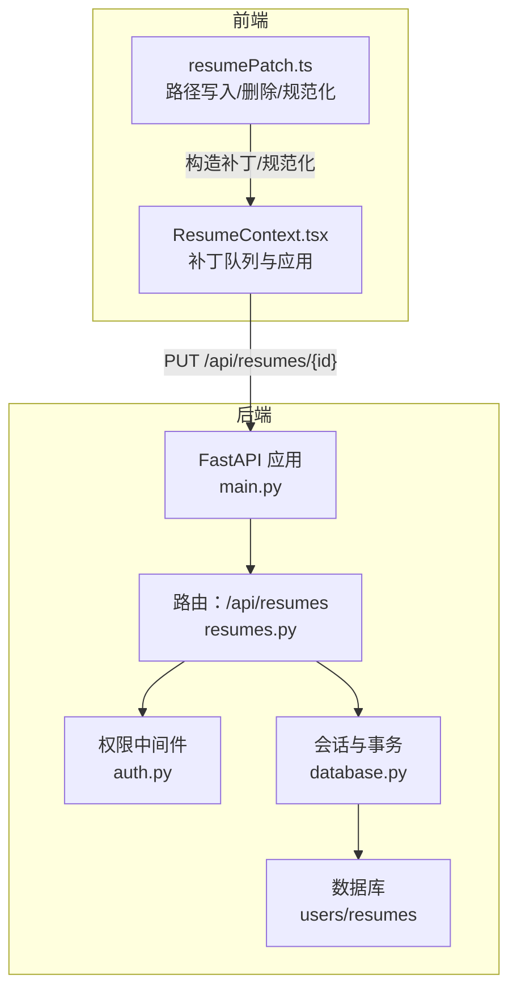
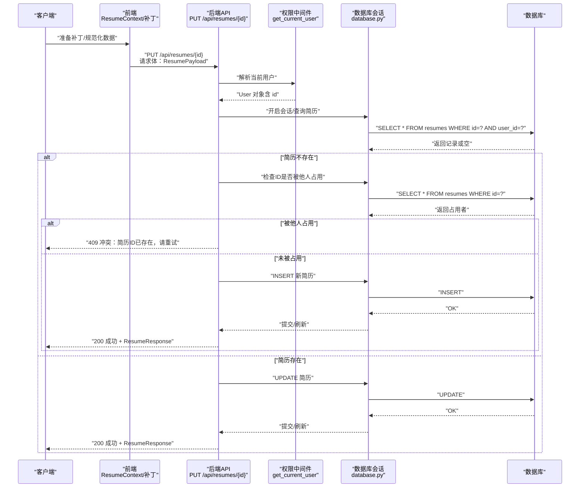
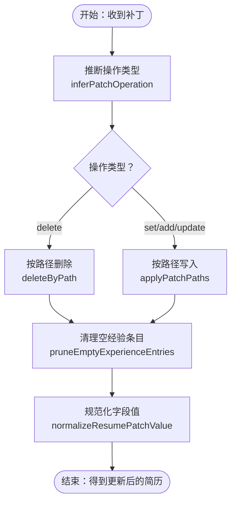
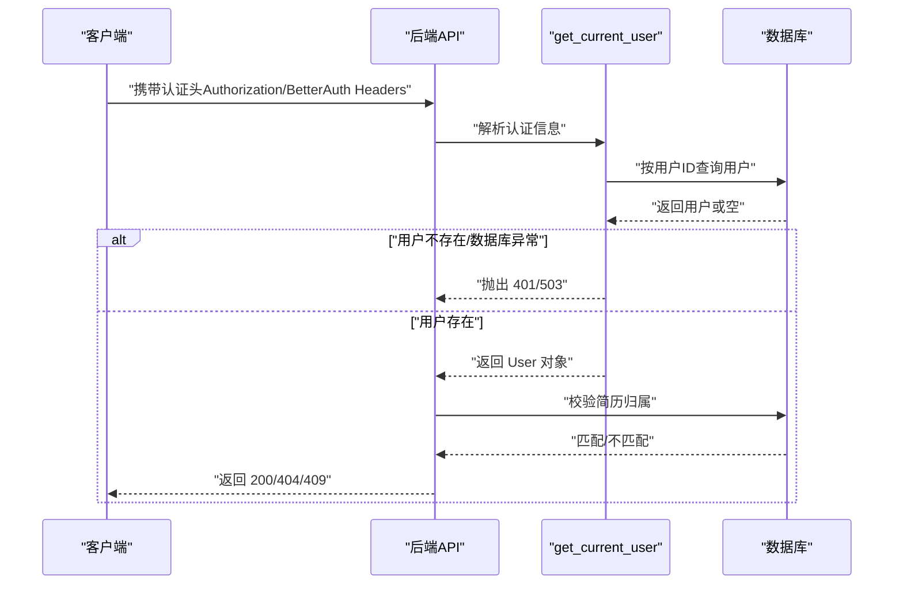
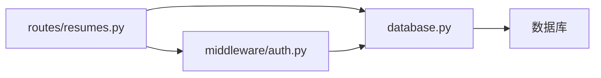

# 简历更新API

<cite>
**本文档引用的文件**
- [backend/routes/resumes.py](file://backend/routes/resumes.py)
- [backend/middleware/auth.py](file://backend/middleware/auth.py)
- [backend/models.py](file://backend/models.py)
- [backend/database.py](file://backend/database.py)
- [frontend/src/utils/resumePatch.ts](file://frontend/src/utils/resumePatch.ts)
- [frontend/src/contexts/ResumeContext.tsx](file://frontend/src/contexts/ResumeContext.tsx)
- [knowledge-base/specs/2026-03-23-nl-resume-refactor-design.md](file://knowledge-base/specs/2026-03-23-nl-resume-refactor-design.md)
- [backend/main.py](file://backend/main.py)
</cite>

## 目录
1. [简介](#简介)
2. [项目结构](#项目结构)
3. [核心组件](#核心组件)
4. [架构总览](#架构总览)
5. [详细组件分析](#详细组件分析)
6. [依赖分析](#依赖分析)
7. [性能考虑](#性能考虑)
8. [故障排查指南](#故障排查指南)
9. [结论](#结论)
10. [附录](#附录)

## 简介
本文件面向“简历更新API”的实现与使用，重点围绕以下目标展开：
- 详述 PUT /api/resumes/{resume_id} 端点的请求参数、权限校验、数据更新与冲突处理。
- 解释简历数据的“部分更新（PATCH）”与“完整替换（PUT）”机制及其区别。
- 说明权限验证流程，确保用户只能更新自己的简历。
- 提供完整的API调用示例（请求格式、响应结构、错误处理）。
- 解释数据一致性与事务处理机制。

## 项目结构
后端采用 FastAPI + SQLAlchemy 架构，简历相关路由集中在 resumes.py，权限校验通过中间件 get_current_user 完成，数据库连接与会话管理在 database.py 中集中处理。

图表来源
- [backend/main.py:93-138](file://backend/main.py#L93-L138)
- [backend/routes/resumes.py:19-262](file://backend/routes/resumes.py#L19-L262)
- [backend/middleware/auth.py:113-146](file://backend/middleware/auth.py#L113-L146)
- [backend/database.py:121-138](file://backend/database.py#L121-L138)

章节来源
- [backend/main.py:93-138](file://backend/main.py#L93-L138)
- [backend/routes/resumes.py:19-262](file://backend/routes/resumes.py#L19-L262)
- [backend/middleware/auth.py:113-146](file://backend/middleware/auth.py#L113-L146)
- [backend/database.py:121-138](file://backend/database.py#L121-L138)

## 核心组件
- 路由与端点
  - PUT /api/resumes/{resume_id}：更新简历（不存在时自动创建）
  - GET /api/resumes：列出当前用户所有简历
  - GET /api/resumes/{resume_id}：获取单个简历
  - POST /api/resumes：创建简历
  - DELETE /api/resumes/{resume_id}：删除简历
  - POST /api/resumes/sync：同步简历数据（本地↔数据库）
- 权限与认证
  - get_current_user：从多种来源解析当前用户（trusted headers/BetterAuth/JWT）
  - 严格基于 user_id 与 resume_id 的归属校验
- 数据模型
  - Resume：简历实体（JSON 字段存储完整简历数据）
  - User：用户实体
- 前端补丁机制
  - 路径式写入（by-path）替代深合并，避免数组索引覆盖冲突
  - 支持 add/update/delete/set 操作推断与执行
  - 对富文本/经验条目进行规范化处理

章节来源
- [backend/routes/resumes.py:52-262](file://backend/routes/resumes.py#L52-L262)
- [backend/middleware/auth.py:113-146](file://backend/middleware/auth.py#L113-L146)
- [backend/models.py:163-181](file://backend/models.py#L163-L181)
- [frontend/src/utils/resumePatch.ts:172-218](file://frontend/src/utils/resumePatch.ts#L172-L218)

## 架构总览
下面的序列图展示了“PUT 更新简历”的端到端流程，包括请求参数、权限校验、冲突处理与数据更新。

图表来源
- [backend/routes/resumes.py:135-195](file://backend/routes/resumes.py#L135-L195)
- [backend/middleware/auth.py:113-146](file://backend/middleware/auth.py#L113-L146)
- [backend/database.py:121-138](file://backend/database.py#L121-L138)

## 详细组件分析

### 端点：PUT /api/resumes/{resume_id}
- 功能概述
  - 更新指定 ID 的简历；若不存在且未被他人占用，则自动创建。
  - 支持将 template_type 同步到 data["templateType"]。
  - 支持对 name、alias、data 进行更新。
- 请求参数
  - 路径参数
    - resume_id：字符串，简历唯一标识
  - 请求体（ResumePayload）
    - id：可选，建议与路径一致
    - name：可选，简历名称
    - alias：可选，备注/别名
    - template_type：可选，模板类型（如 latex/html）
    - data：必需，简历完整JSON数据
    - created_at/updated_at：可选，服务端忽略（由服务端维护）
- 响应
  - 成功：ResumeResponse
    - id、name、alias、template_type、data、created_at、updated_at
- 权限与安全
  - 仅允许当前用户更新其拥有的简历
  - 若 resume_id 已被他人占用，拒绝创建并返回 409
- 冲突处理
  - 若请求中的 resume_id 已被其他用户占用，返回 409
  - 若更新时发现记录不存在，返回 404
- 错误码
  - 401：未认证或认证信息无效
  - 403：无权限（当前实现主要针对用户归属校验，一般不会触发）
  - 404：简历不存在
  - 409：ID冲突
  - 500：服务器内部错误（数据库异常）

章节来源
- [backend/routes/resumes.py:23-41](file://backend/routes/resumes.py#L23-L41)
- [backend/routes/resumes.py:135-195](file://backend/routes/resumes.py#L135-L195)
- [backend/middleware/auth.py:113-146](file://backend/middleware/auth.py#L113-L146)

### PATCH 更新机制（部分字段更新）
- 设计理念
  - 采用“路径式写入（by-path）”而非深合并，避免数组索引覆盖导致的冲突。
  - 支持四种操作：add、update、delete、set；当无法明确推断时默认 set。
- 前端实现要点
  - applyPatchPaths：按 paths[] 逐路径写入 after 中的值
  - deleteByPath：支持数组索引删除（如 experience[0]）
  - inferPatchOperation：根据 before/after 与路径推断操作类型
  - normalizeResumePatchValue：对富文本/纯文本进行规范化处理
- 与后端的关系
  - 后端 PUT 接收完整 data；前端 PATCH 通常在本地先应用补丁，再通过 PUT 提交完整数据。
  - 两者并不矛盾：前端负责局部交互体验，后端负责最终一致性与权限控制。

图表来源
- [frontend/src/utils/resumePatch.ts:60-87](file://frontend/src/utils/resumePatch.ts#L60-L87)
- [frontend/src/utils/resumePatch.ts:137-164](file://frontend/src/utils/resumePatch.ts#L137-L164)
- [frontend/src/utils/resumePatch.ts:172-218](file://frontend/src/utils/resumePatch.ts#L172-L218)
- [frontend/src/utils/resumePatch.ts:312-349](file://frontend/src/utils/resumePatch.ts#L312-L349)

章节来源
- [frontend/src/utils/resumePatch.ts:60-87](file://frontend/src/utils/resumePatch.ts#L60-L87)
- [frontend/src/utils/resumePatch.ts:137-164](file://frontend/src/utils/resumePatch.ts#L137-L164)
- [frontend/src/utils/resumePatch.ts:172-218](file://frontend/src/utils/resumePatch.ts#L172-L218)
- [frontend/src/utils/resumePatch.ts:312-349](file://frontend/src/utils/resumePatch.ts#L312-L349)
- [knowledge-base/specs/2026-03-23-nl-resume-refactor-design.md:257-312](file://knowledge-base/specs/2026-03-23-nl-resume-refactor-design.md#L257-L312)

### 权限验证流程
- 多源认证
  - trusted headers（内部桥接 BetterAuth）
  - Bearer Token（JWT）
  - BetterAuth Token
- 校验步骤
  - 解析 token，获取 sub（用户ID）
  - 查询用户信息（仅加载必要字段）
  - 严格校验：请求的简历必须属于当前用户
- 未认证/无效
  - 返回 401

图表来源
- [backend/middleware/auth.py:113-146](file://backend/middleware/auth.py#L113-L146)
- [backend/middleware/auth.py:41-86](file://backend/middleware/auth.py#L41-L86)
- [backend/routes/resumes.py:143](file://backend/routes/resumes.py#L143)

章节来源
- [backend/middleware/auth.py:113-146](file://backend/middleware/auth.py#L113-L146)
- [backend/middleware/auth.py:41-86](file://backend/middleware/auth.py#L41-L86)
- [backend/routes/resumes.py:143](file://backend/routes/resumes.py#L143)

### 数据一致性与事务处理
- 会话与事务
  - 每次请求通过 get_db 获取独立 Session
  - 更新/插入后调用 commit；发生异常时 rollback
- 并发与冲突
  - 在创建前检查 resume_id 是否已被他人占用，避免越权覆盖
  - 删除时先删嵌入再删简历，使用批量删除避免关系懒加载引发异常
- 数据库连接池
  - 支持 MySQL/PostgreSQL/SQLite，连接池参数可配置
  - 预热连接，降低首次请求延迟

章节来源
- [backend/database.py:121-138](file://backend/database.py#L121-L138)
- [backend/routes/resumes.py:146-150](file://backend/routes/resumes.py#L146-L150)
- [backend/routes/resumes.py:212-231](file://backend/routes/resumes.py#L212-L231)

### API 调用示例

- 请求格式（PUT /api/resumes/{resume_id}）
  - 方法：PUT
  - 路径：/api/resumes/{resume_id}
  - 头部：Authorization: Bearer <token>
  - 请求体（ResumePayload）：
    - id：字符串，建议与路径一致
    - name：字符串，可选
    - alias：字符串，可选
    - template_type：字符串，可选（如 latex/html）
    - data：对象，必需（完整简历JSON）
    - created_at/updated_at：可选
- 成功响应（200 OK）
  - ResumeResponse：
    - id、name、alias、template_type、data、created_at、updated_at
- 错误响应
  - 401：未认证或认证信息无效
  - 404：简历不存在
  - 409：简历ID已存在，请重试
  - 500：服务器内部错误

章节来源
- [backend/routes/resumes.py:23-41](file://backend/routes/resumes.py#L23-L41)
- [backend/routes/resumes.py:135-195](file://backend/routes/resumes.py#L135-L195)

## 依赖分析
- 组件耦合
  - 路由层依赖权限中间件与数据库会话
  - 权限中间件依赖数据库与 BetterAuth/JWT 解析
  - 数据库层提供统一 Session 工厂
- 外部依赖
  - FastAPI（路由与依赖注入）
  - SQLAlchemy（ORM/会话/连接池）
  - 环境变量（数据库URL、连接池参数）

图表来源
- [backend/routes/resumes.py:14-18](file://backend/routes/resumes.py#L14-L18)
- [backend/middleware/auth.py:19-23](file://backend/middleware/auth.py#L19-L23)
- [backend/database.py:121-138](file://backend/database.py#L121-L138)

章节来源
- [backend/routes/resumes.py:14-18](file://backend/routes/resumes.py#L14-L18)
- [backend/middleware/auth.py:19-23](file://backend/middleware/auth.py#L19-L23)
- [backend/database.py:121-138](file://backend/database.py#L121-L138)

## 性能考虑
- 连接池与预热
  - 启动时预热数据库连接，避免首次请求延迟
  - 可配置连接池大小、回收时间、超时等参数
- 查询优化
  - 权限中间件仅加载必要字段，减少查询开销
  - 删除时使用批量删除，避免触发关系懒加载
- 前端补丁
  - 路径式写入避免深合并带来的复杂度与冲突，提升本地交互性能

章节来源
- [backend/main.py:271-295](file://backend/main.py#L271-L295)
- [backend/middleware/auth.py:28-38](file://backend/middleware/auth.py#L28-L38)
- [backend/routes/resumes.py:212-231](file://backend/routes/resumes.py#L212-L231)

## 故障排查指南
- 401 未认证
  - 检查 Authorization 头是否为 Bearer Token
  - 确认 BetterAuth 信任头是否正确传递
- 404 简历不存在
  - 确认 resume_id 是否属于当前用户
  - 首次云端保存时可接受 404 并自动创建（需确保ID未被他人占用）
- 409 ID冲突
  - 选择新的 resume_id 或删除他人占用的同名ID
- 500 服务器内部错误
  - 查看后端日志定位数据库异常
  - 检查连接池配置与数据库可达性

章节来源
- [backend/middleware/auth.py:133-145](file://backend/middleware/auth.py#L133-L145)
- [backend/routes/resumes.py:146-150](file://backend/routes/resumes.py#L146-L150)
- [backend/routes/resumes.py:228-231](file://backend/routes/resumes.py#L228-L231)

## 结论
- PUT /api/resumes/{resume_id} 提供了幂等的简历更新能力，支持自动创建与冲突检测。
- 前端采用路径式补丁机制，确保局部更新的确定性与一致性。
- 权限中间件严格校验用户归属，配合后端事务与会话管理，保障数据安全与一致性。
- 建议在生产环境中启用 BetterAuth 与合适的数据库连接池参数，以获得最佳性能与稳定性。

## 附录
- 相关设计文档
  - 2026-03-23-nl-resume-refactor-design.md：明确了路径式补丁与覆盖逻辑的设计思想

章节来源
- [knowledge-base/specs/2026-03-23-nl-resume-refactor-design.md:257-312](file://knowledge-base/specs/2026-03-23-nl-resume-refactor-design.md#L257-L312)