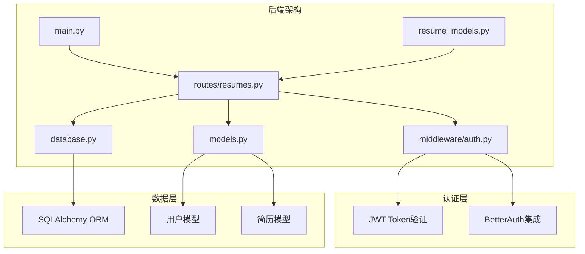
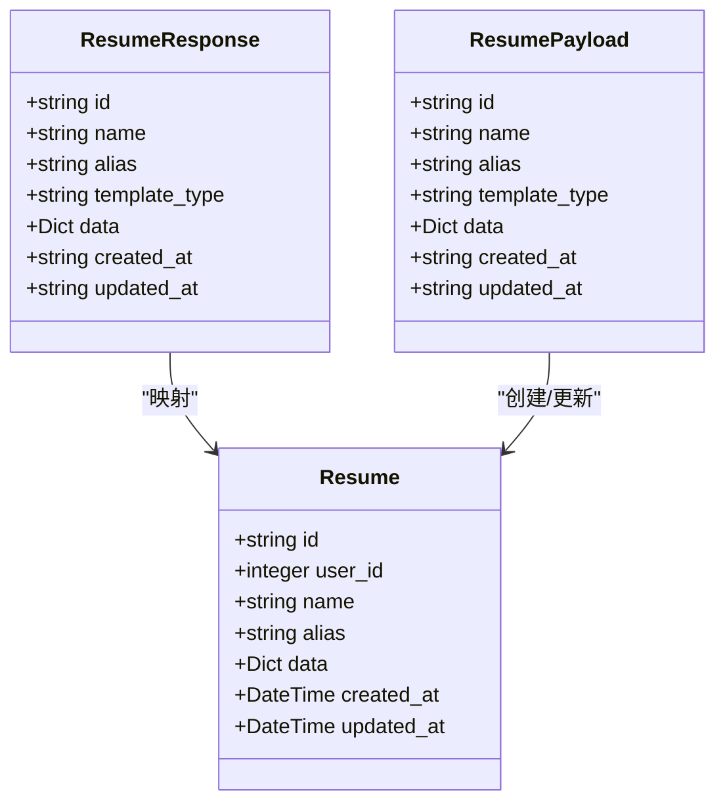
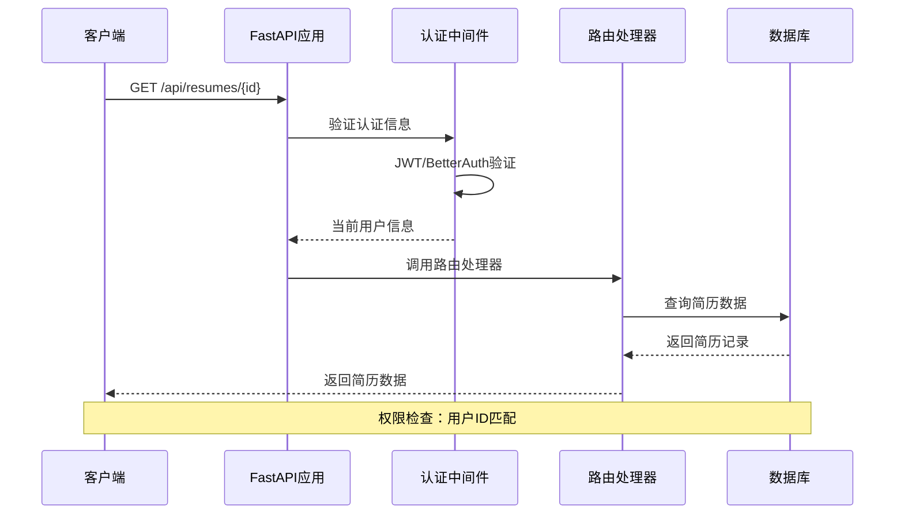
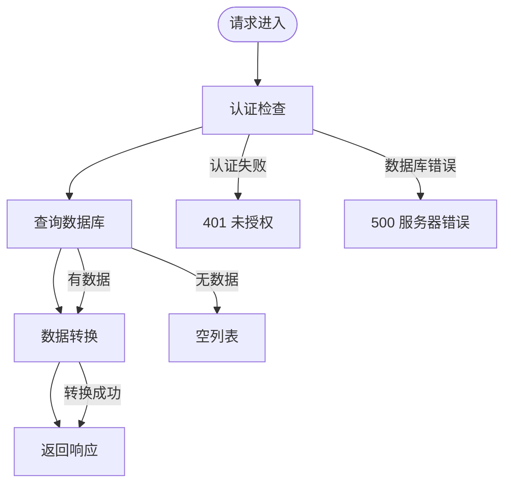
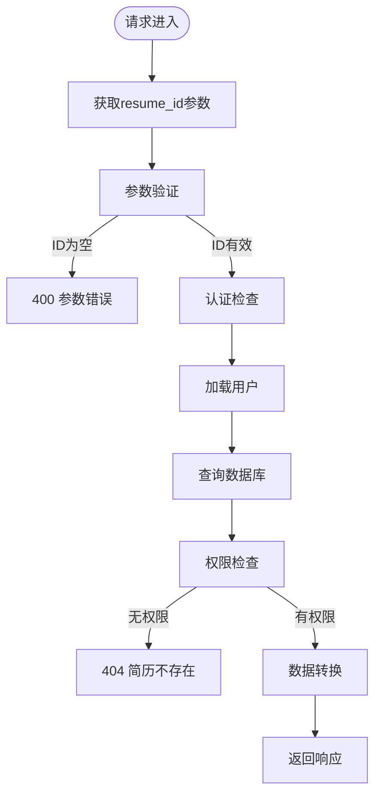
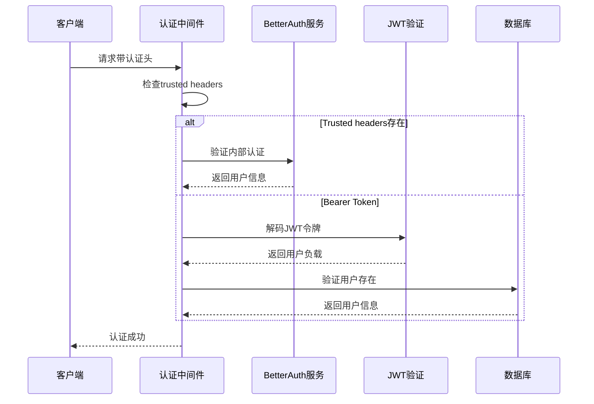
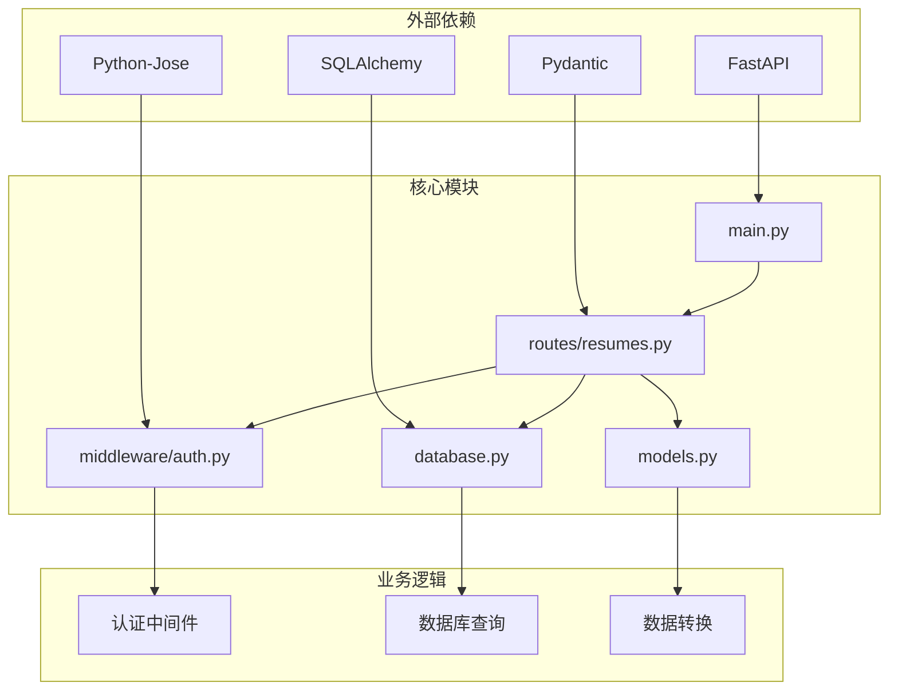
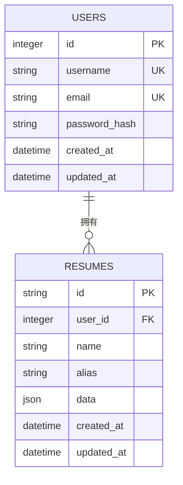

# 简历读取API

<cite>
**本文档引用的文件**
- [backend/routes/resumes.py](file://backend/routes/resumes.py)
- [backend/models.py](file://backend/models.py)
- [backend/middleware/auth.py](file://backend/middleware/auth.py)
- [backend/database.py](file://backend/database.py)
- [backend/main.py](file://backend/main.py)
- [backend/resume_models.py](file://backend/resume_models.py)
</cite>

## 目录
1. [简介](#简介)
2. [项目结构](#项目结构)
3. [核心组件](#核心组件)
4. [架构概览](#架构概览)
5. [详细组件分析](#详细组件分析)
6. [依赖关系分析](#依赖关系分析)
7. [性能考虑](#性能考虑)
8. [故障排除指南](#故障排除指南)
9. [结论](#结论)

## 简介

本文档详细说明了简历读取API接口的实现，重点关注以下两个端点：

- GET /api/resumes：获取当前用户的所有简历列表
- GET /api/resumes/{resume_id}：获取指定简历的详细信息

该API实现了严格的权限控制和数据访问安全机制，确保用户只能访问自己的简历数据。系统采用FastAPI框架构建，使用SQLAlchemy进行数据库操作，并集成了JWT和BetterAuth双重认证机制。

## 项目结构

简历读取API位于后端服务的路由模块中，主要涉及以下文件：

**图表来源**
- [backend/main.py:92-138](file://backend/main.py#L92-L138)
- [backend/routes/resumes.py:19](file://backend/routes/resumes.py#L19-L21)

**章节来源**
- [backend/main.py:73-138](file://backend/main.py#L73-L138)
- [backend/routes/resumes.py:1-262](file://backend/routes/resumes.py#L1-L262)

## 核心组件

### 路由模块

简历读取API的核心实现位于`backend/routes/resumes.py`文件中，包含以下关键组件：

#### 路由定义
- **前缀**：`/api/resumes`
- **标签**：`Resumes`
- **认证**：需要登录用户

#### 数据模型

**图表来源**
- [backend/routes/resumes.py:33-41](file://backend/routes/resumes.py#L33-L41)
- [backend/models.py:163-181](file://backend/models.py#L163-L181)

### 认证中间件

系统采用双重认证机制，确保API的安全性：

#### 认证流程
1. **BetterAuth集成**：支持内部认证头和外部Bearer Token
2. **JWT Token验证**：标准JWT令牌解码和验证
3. **用户加载**：从数据库加载当前用户信息

**章节来源**
- [backend/routes/resumes.py:52-95](file://backend/routes/resumes.py#L52-L95)
- [backend/middleware/auth.py:113-146](file://backend/middleware/auth.py#L113-L146)

## 架构概览

简历读取API采用分层架构设计，确保关注点分离和代码可维护性：

**图表来源**
- [backend/middleware/auth.py:113-146](file://backend/middleware/auth.py#L113-L146)
- [backend/routes/resumes.py:76-95](file://backend/routes/resumes.py#L76-L95)

## 详细组件分析

### GET /api/resumes 端点

#### 功能概述
获取当前用户的所有简历列表，按更新时间降序排列。

#### 参数和响应

**图表来源**
- [backend/routes/resumes.py:52-73](file://backend/routes/resumes.py#L52-L73)

#### 实现细节

**请求处理流程**：
1. 通过`get_current_user`依赖注入获取当前用户
2. 使用`get_db`获取数据库会话
3. 查询当前用户的所有简历记录
4. 按`updated_at`降序排序
5. 转换为`ResumeResponse`模型

**响应数据结构**：
- `id`: 简历唯一标识符
- `name`: 简历名称
- `alias`: 简历别名
- `template_type`: 模板类型（默认"latex"）
- `data`: 简历完整数据
- `created_at`: 创建时间（ISO格式）
- `updated_at`: 更新时间（ISO格式）

**章节来源**
- [backend/routes/resumes.py:52-73](file://backend/routes/resumes.py#L52-L73)

### GET /api/resumes/{resume_id} 端点

#### 功能概述
获取指定ID的简历详细信息，包含完整的简历数据。

#### 参数验证机制

**图表来源**
- [backend/routes/resumes.py:76-95](file://backend/routes/resumes.py#L76-L95)

#### 实现细节

**参数获取和验证**：
1. 从URL路径参数获取`resume_id`
2. 自动进行类型转换和基本验证
3. 通过FastAPI的依赖注入系统获取当前用户

**权限检查机制**：
1. 查询数据库中的简历记录
2. 验证`Resume.user_id`与当前用户ID匹配
3. 如果不匹配或记录不存在，返回404错误

**数据访问控制**：
- 每个用户只能访问自己的简历数据
- 防止跨用户数据泄露
- 支持软删除和级联删除

**响应数据结构**：
与列表端点相同，但返回单个简历对象。

**章节来源**
- [backend/routes/resumes.py:76-95](file://backend/routes/resumes.py#L76-L95)

### 认证和权限控制

#### 认证流程

**图表来源**
- [backend/middleware/auth.py:113-146](file://backend/middleware/auth.py#L113-L146)

#### 权限控制策略

**用户隔离**：
- 每个简历记录关联到特定用户ID
- 查询时强制添加用户ID过滤条件
- 防止跨用户数据访问

**错误处理**：
- 认证失败：返回401未授权
- 用户不存在：返回401未授权
- 数据不存在：返回404 Not Found
- 数据库错误：返回500 Internal Server Error

**章节来源**
- [backend/middleware/auth.py:113-146](file://backend/middleware/auth.py#L113-L146)
- [backend/routes/resumes.py:83-85](file://backend/routes/resumes.py#L83-L85)

## 依赖关系分析

### 组件依赖图

**图表来源**
- [backend/main.py:92-138](file://backend/main.py#L92-L138)
- [backend/routes/resumes.py:1-21](file://backend/routes/resumes.py#L1-L21)

### 数据库模型关系

**图表来源**
- [backend/models.py:111-181](file://backend/models.py#L111-L181)

**章节来源**
- [backend/models.py:111-181](file://backend/models.py#L111-L181)

## 性能考虑

### 查询优化

**索引策略**：
- `users.id`：主键索引，支持快速用户查找
- `resumes.user_id`：外键索引，加速用户简历查询
- `resumes.updated_at`：索引支持按更新时间排序

**查询优化**：
- 使用`load_only`选项只加载必要字段
- 单表查询避免复杂的JOIN操作
- 时间戳索引支持高效的排序和过滤

### 缓存策略

**性能监控**：
- 内置查询性能日志记录
- 记录查询耗时和结果数量
- 支持性能分析和优化

**连接池配置**：
- 可配置的连接池大小和超时
- 支持MySQL和PostgreSQL
- 自动连接重试机制

### 错误处理和重试

**数据库连接重试**：
- 最多重试4次
- 指数退避策略
- 连接失效自动恢复

**章节来源**
- [backend/routes/resumes.py:58-61](file://backend/routes/resumes.py#L58-L61)
- [backend/middleware/auth.py:26-86](file://backend/middleware/auth.py#L26-L86)
- [backend/database.py:78-112](file://backend/database.py#L78-L112)

## 故障排除指南

### 常见错误和解决方案

**认证相关错误**：
- `401 未提供有效的认证信息`：检查Authorization头格式
- `401 用户不存在`：验证用户ID有效性
- `503 数据库连接异常`：检查数据库连接配置

**数据访问错误**：
- `404 简历不存在`：确认简历ID和用户权限
- `409 简历ID已存在`：避免ID冲突

**数据库错误**：
- `500 删除简历失败`：检查数据库事务状态

### 调试技巧

**性能监控**：
- 查看`[DashboardPerf]`日志条目
- 分析查询耗时和数据库负载
- 监控API响应时间

**日志分析**：
- 启用详细日志模式
- 检查认证中间件日志
- 监控数据库查询日志

**章节来源**
- [backend/routes/resumes.py:84-85](file://backend/routes/resumes.py#L84-L85)
- [backend/middleware/auth.py:82-86](file://backend/middleware/auth.py#L82-L86)

## 结论

简历读取API提供了安全、高效、可靠的简历数据访问服务。通过以下关键特性确保系统的健壮性和安全性：

**安全性保障**：
- 双重认证机制（JWT + BetterAuth）
- 强制的用户数据隔离
- 严格的权限检查

**性能优化**：
- 优化的数据库查询和索引策略
- 连接池管理和重试机制
- 内置性能监控

**可靠性保证**：
- 完善的错误处理和日志记录
- 数据库连接自动恢复
- 详细的API文档和示例

该API设计遵循RESTful原则，提供了清晰的响应格式和错误处理机制，适合在生产环境中稳定运行。