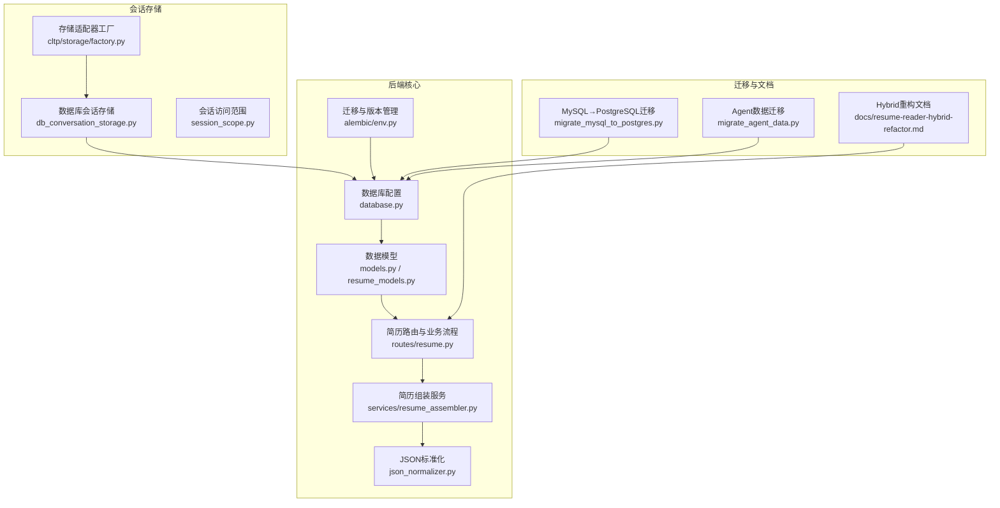
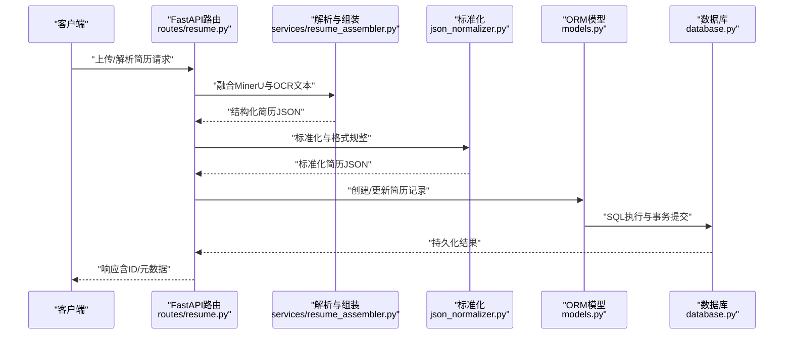
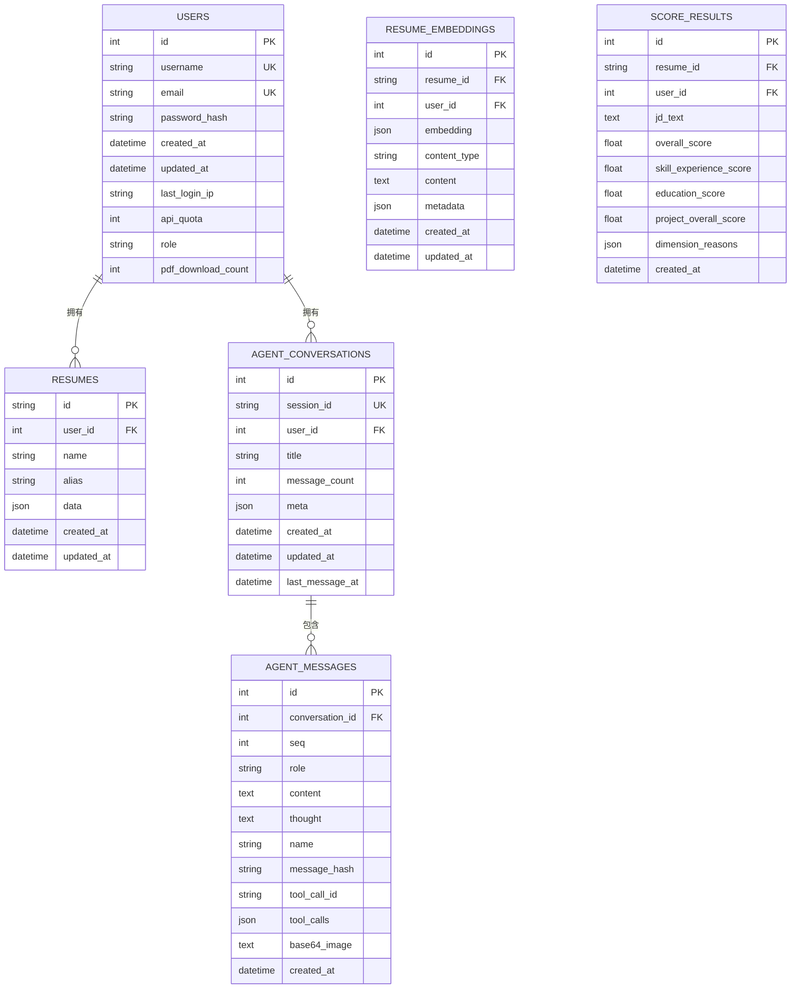
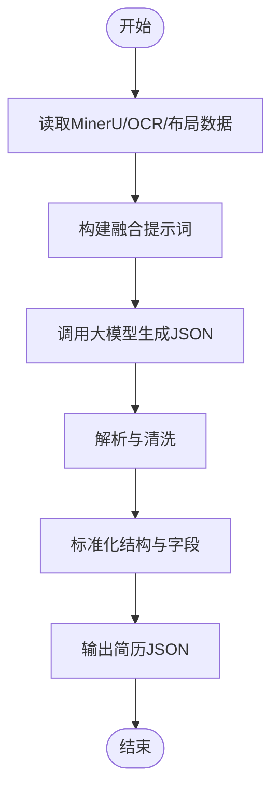
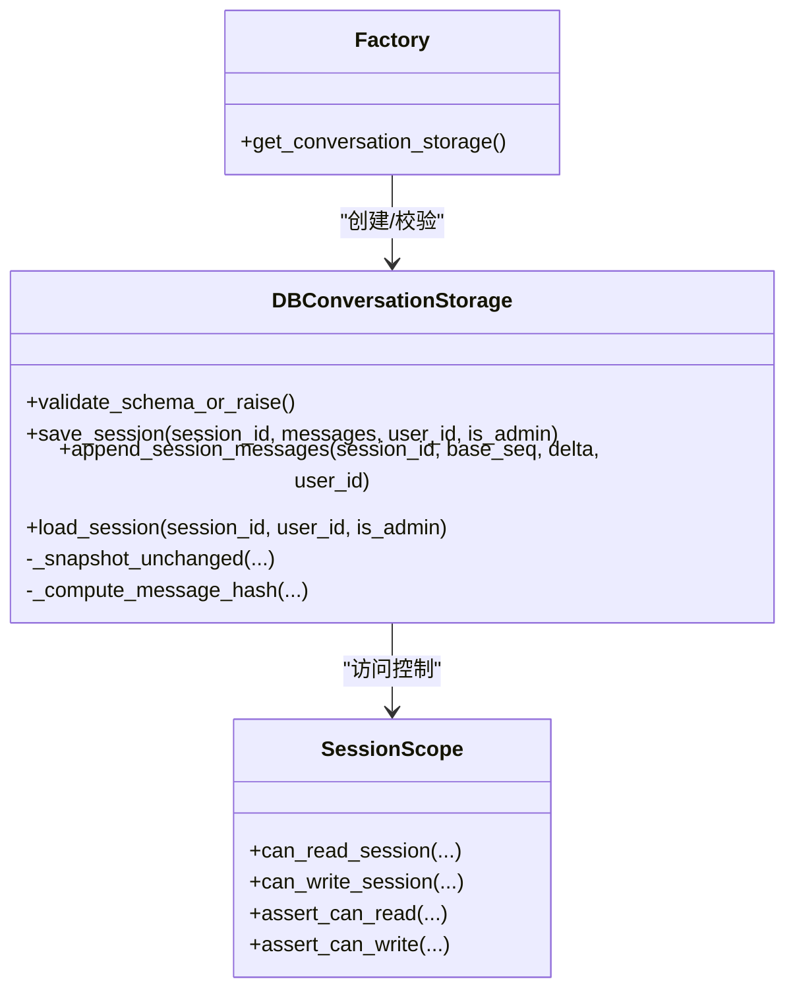
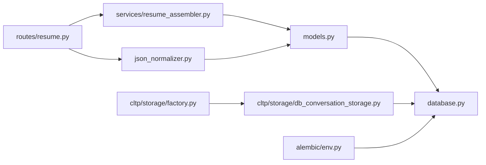

# 简历存储管理

<cite>
**本文档引用的文件**
- [backend/models.py](file://backend/models.py)
- [backend/resume_models.py](file://backend/resume_models.py)
- [backend/database.py](file://backend/database.py)
- [backend/alembic/env.py](file://backend/alembic/env.py)
- [backend/routes/resume.py](file://backend/routes/resume.py)
- [backend/services/resume_assembler.py](file://backend/services/resume_assembler.py)
- [backend/json_normalizer.py](file://backend/json_normalizer.py)
- [backend/agent/cltp/storage/db_conversation_storage.py](file://backend/agent/cltp/storage/db_conversation_storage.py)
- [backend/agent/cltp/storage/factory.py](file://backend/agent/cltp/storage/factory.py)
- [backend/agent/cltp/storage/session_scope.py](file://backend/agent/cltp/storage/session_scope.py)
- [backend/migrate_mysql_to_postgres.py](file://backend/migrate_mysql_to_postgres.py)
- [backend/migrate_agent_data.py](file://backend/migrate_agent_data.py)
- [docs/resume-reader-hybrid-refactor.md](file://docs/resume-reader-hybrid-refactor.md)
</cite>

## 目录
1. [简介](#简介)
2. [项目结构](#项目结构)
3. [核心组件](#核心组件)
4. [架构总览](#架构总览)
5. [详细组件分析](#详细组件分析)
6. [依赖关系分析](#依赖关系分析)
7. [性能考虑](#性能考虑)
8. [故障排查指南](#故障排查指南)
9. [结论](#结论)
10. [附录](#附录)

## 简介
本文件面向“简历存储管理”主题，系统梳理简历数据的持久化策略、数据库设计与索引优化、备份恢复与迁移机制、缓存策略、数据同步与一致性保障、性能优化与容量规划、监控指标以及数据安全与隐私保护。文档结合代码库中的模型定义、数据库配置、会话存储、迁移脚本与文档说明，形成从架构到实现的全景视图。

## 项目结构
简历存储管理涉及后端数据库模型、会话历史存储、简历解析与组装、标准化与持久化流程，以及数据库迁移与版本管理。关键目录与文件如下：
- 数据模型与ORM：backend/models.py、backend/resume_models.py
- 数据库配置与连接池：backend/database.py
- 版本管理与迁移：backend/alembic/env.py、backend/migrate_mysql_to_postgres.py、backend/migrate_agent_data.py
- 简历解析与组装：backend/routes/resume.py、backend/services/resume_assembler.py、backend/json_normalizer.py
- 会话历史存储（Agent）：backend/agent/cltp/storage/db_conversation_storage.py、factory.py、session_scope.py
- 设计文档与重构说明：docs/resume-reader-hybrid-refactor.md

**图表来源**
- [backend/database.py:1-138](file://backend/database.py#L1-L138)
- [backend/models.py:111-372](file://backend/models.py#L111-L372)
- [backend/alembic/env.py:1-80](file://backend/alembic/env.py#L1-L80)
- [backend/routes/resume.py:1-800](file://backend/routes/resume.py#L1-L800)
- [backend/services/resume_assembler.py:1-388](file://backend/services/resume_assembler.py#L1-L388)
- [backend/json_normalizer.py:1-536](file://backend/json_normalizer.py#L1-L536)
- [backend/agent/cltp/storage/factory.py:16-42](file://backend/agent/cltp/storage/factory.py#L16-L42)
- [backend/agent/cltp/storage/db_conversation_storage.py:33-800](file://backend/agent/cltp/storage/db_conversation_storage.py#L33-L800)
- [backend/agent/cltp/storage/session_scope.py:1-75](file://backend/agent/cltp/storage/session_scope.py#L1-L75)
- [backend/migrate_mysql_to_postgres.py:254-345](file://backend/migrate_mysql_to_postgres.py#L254-L345)
- [backend/migrate_agent_data.py:319-368](file://backend/migrate_agent_data.py#L319-L368)
- [docs/resume-reader-hybrid-refactor.md:1-465](file://docs/resume-reader-hybrid-refactor.md#L1-L465)

**章节来源**
- [backend/database.py:1-138](file://backend/database.py#L1-L138)
- [backend/models.py:111-372](file://backend/models.py#L111-L372)
- [backend/alembic/env.py:1-80](file://backend/alembic/env.py#L1-L80)
- [backend/routes/resume.py:1-800](file://backend/routes/resume.py#L1-L800)
- [backend/services/resume_assembler.py:1-388](file://backend/services/resume_assembler.py#L1-L388)
- [backend/json_normalizer.py:1-536](file://backend/json_normalizer.py#L1-L536)
- [backend/agent/cltp/storage/factory.py:16-42](file://backend/agent/cltp/storage/factory.py#L16-L42)
- [backend/agent/cltp/storage/db_conversation_storage.py:33-800](file://backend/agent/cltp/storage/db_conversation_storage.py#L33-L800)
- [backend/agent/cltp/storage/session_scope.py:1-75](file://backend/agent/cltp/storage/session_scope.py#L1-L75)
- [backend/migrate_mysql_to_postgres.py:254-345](file://backend/migrate_mysql_to_postgres.py#L254-L345)
- [backend/migrate_agent_data.py:319-368](file://backend/migrate_agent_data.py#L319-L368)
- [docs/resume-reader-hybrid-refactor.md:1-465](file://docs/resume-reader-hybrid-refactor.md#L1-L465)

## 核心组件
- 数据模型与ORM
  - 用户、简历、成员、API日志、权限审计、Agent会话与消息、简历向量嵌入、评分结果等模型定义，涵盖主键、外键、索引与关系映射。
- 数据库配置与连接池
  - 支持SQLite、MySQL与PostgreSQL，统一连接参数、池化配置、超时与字符集设置，提供会话工厂与初始化方法。
- 简历解析与组装
  - 通过多模态数据融合（MinerU文本、OCR文本）生成结构化简历JSON，并进行标准化与格式规整。
- 会话历史存储（Agent）
  - 提供数据库与文件两种后端，支持幂等保存、追加消息、会话所有权校验与访问控制。
- 迁移与版本管理
  - Alembic环境配置与迁移脚本，支持MySQL→PostgreSQL数据迁移与Agent数据迁移，具备重试与校验机制。

**章节来源**
- [backend/models.py:111-372](file://backend/models.py#L111-L372)
- [backend/database.py:26-138](file://backend/database.py#L26-L138)
- [backend/services/resume_assembler.py:280-388](file://backend/services/resume_assembler.py#L280-L388)
- [backend/json_normalizer.py:66-96](file://backend/json_normalizer.py#L66-L96)
- [backend/agent/cltp/storage/db_conversation_storage.py:33-800](file://backend/agent/cltp/storage/db_conversation_storage.py#L33-L800)
- [backend/agent/cltp/storage/factory.py:16-42](file://backend/agent/cltp/storage/factory.py#L16-L42)
- [backend/alembic/env.py:30-80](file://backend/alembic/env.py#L30-L80)
- [backend/migrate_mysql_to_postgres.py:254-345](file://backend/migrate_mysql_to_postgres.py#L254-L345)
- [backend/migrate_agent_data.py:319-368](file://backend/migrate_agent_data.py#L319-L368)

## 架构总览
简历存储管理贯穿“数据采集→解析组装→标准化→持久化→查询检索”的全链路。系统采用SQLAlchemy ORM与Alembic迁移，支持多数据库后端；会话历史采用可插拔存储后端；简历数据以JSON结构持久化，配合向量嵌入实现语义检索。

**图表来源**
- [backend/routes/resume.py:795-800](file://backend/routes/resume.py#L795-L800)
- [backend/services/resume_assembler.py:280-388](file://backend/services/resume_assembler.py#L280-L388)
- [backend/json_normalizer.py:525-536](file://backend/json_normalizer.py#L525-L536)
- [backend/models.py:163-182](file://backend/models.py#L163-L182)
- [backend/database.py:121-138](file://backend/database.py#L121-L138)

## 详细组件分析

### 数据模型与数据库设计
- 用户与简历
  - 用户表包含用户名、邮箱、密码哈希、角色、IP与下载计数等字段，并建立多处索引以支撑鉴权与查询。
  - 简历表以字符串ID为主键，关联用户，JSON字段存储完整简历数据，具备创建/更新时间戳。
- 会话与消息（Agent）
  - 会话表记录会话ID、标题、消息计数与最后消息时间；消息表按序列存储，支持工具调用、图像等扩展字段，并以message_hash辅助幂等校验。
- 向量嵌入与评分
  - 简历向量嵌入表存储向量、内容类型与元数据，评分结果表记录多维评分与原因。
- 索引与约束
  - 多表建立唯一索引与复合索引，如会话唯一、消息唯一约束、JSON字段索引等，提升查询效率与数据一致性。

**图表来源**
- [backend/models.py:111-372](file://backend/models.py#L111-L372)

**章节来源**
- [backend/models.py:111-372](file://backend/models.py#L111-L372)

### 数据库配置与连接池
- 数据库URL解析
  - 支持PostgreSQL与MySQL，自动修正驱动协议，Railway环境变量兼容，SQLite默认路径固定。
- 连接池参数
  - 预检查、回收周期、池大小、溢出、超时、字符集与读写超时等参数可配置，适配高延迟远程数据库。
- 会话管理
  - 提供会话工厂与初始化方法，确保依赖注入与资源释放。

**章节来源**
- [backend/database.py:26-138](file://backend/database.py#L26-L138)

### 简历解析与组装流程
- 数据融合
  - 依据OCR文本（含结构信息）与MinerU文本，结合布局骨架（可选）构建提示词，调用大模型生成结构化JSON。
- 标准化
  - 递归识别字段语义，合并联系信息，标准化开源经历、实习/工作经历、项目经验与教育背景等结构。
- 输出
  - 返回LaTeX模板友好的JSON结构，确保后续渲染与导出稳定性。

**图表来源**
- [backend/services/resume_assembler.py:280-388](file://backend/services/resume_assembler.py#L280-L388)
- [backend/json_normalizer.py:66-96](file://backend/json_normalizer.py#L66-L96)

**章节来源**
- [backend/services/resume_assembler.py:280-388](file://backend/services/resume_assembler.py#L280-L388)
- [backend/json_normalizer.py:66-96](file://backend/json_normalizer.py#L66-L96)

### 会话历史存储（Agent）
- 存储后端选择
  - 通过环境变量选择数据库或文件后端，工厂缓存结果避免重复探测。
- 幂等与一致性
  - 基于消息签名与首尾消息快照进行增量比较，避免重复写入；缺失message_hash列时自动回退兼容路径。
- 访问控制
  - 会话所有权校验，支持管理员豁免与读写权限判定。

**图表来源**
- [backend/agent/cltp/storage/db_conversation_storage.py:33-800](file://backend/agent/cltp/storage/db_conversation_storage.py#L33-L800)
- [backend/agent/cltp/storage/factory.py:16-42](file://backend/agent/cltp/storage/factory.py#L16-L42)
- [backend/agent/cltp/storage/session_scope.py:27-75](file://backend/agent/cltp/storage/session_scope.py#L27-L75)

**章节来源**
- [backend/agent/cltp/storage/db_conversation_storage.py:33-800](file://backend/agent/cltp/storage/db_conversation_storage.py#L33-L800)
- [backend/agent/cltp/storage/factory.py:16-42](file://backend/agent/cltp/storage/factory.py#L16-L42)
- [backend/agent/cltp/storage/session_scope.py:27-75](file://backend/agent/cltp/storage/session_scope.py#L27-L75)

### 备份、恢复与迁移机制
- 版本管理
  - Alembic环境配置加载数据库URL与模型元数据，支持离线/在线迁移。
- 数据迁移
  - MySQL→PostgreSQL迁移脚本：按表顺序、批大小迁移，支持跳过已存在主键与校验计数。
  - Agent数据迁移脚本：本地→远程数据库迁移，具备重试与统计汇总。
- 恢复策略
  - 建议结合数据库备份与迁移脚本进行灰度验证，确保目标库结构一致与数据完整性。

**章节来源**
- [backend/alembic/env.py:30-80](file://backend/alembic/env.py#L30-L80)
- [backend/migrate_mysql_to_postgres.py:254-345](file://backend/migrate_mysql_to_postgres.py#L254-L345)
- [backend/migrate_agent_data.py:319-368](file://backend/migrate_agent_data.py#L319-L368)

### 缓存策略、数据同步与一致性
- 缓存与一致性
  - 会话存储采用消息签名与快照对比实现幂等写入，避免重复与乱序导致的数据不一致。
  - 会话隔离与清理钩子防止跨会话污染，确保“读取—编辑—差异”链路一致性。
- 路由与数据流
  - 简历路由负责解析、组装与标准化，随后持久化至数据库；Agent会话存储独立管理，二者通过不同模型与表空间隔离。

**章节来源**
- [backend/agent/cltp/storage/db_conversation_storage.py:166-212](file://backend/agent/cltp/storage/db_conversation_storage.py#L166-L212)
- [docs/resume-reader-hybrid-refactor.md:183-202](file://docs/resume-reader-hybrid-refactor.md#L183-L202)

## 依赖关系分析
- 组件耦合
  - 路由层依赖解析与标准化服务；ORM层依赖数据库配置；会话存储依赖工厂与作用域模块。
- 外部依赖
  - SQLAlchemy、Alembic、数据库驱动（psycopg/postgres、pymysql/mysql）、大模型服务（DashScope/DeepSeek）。
- 潜在循环依赖
  - 模块别名与导入路径规范化避免重复加载导致的mapper冲突。

**图表来源**
- [backend/routes/resume.py:1-800](file://backend/routes/resume.py#L1-L800)
- [backend/services/resume_assembler.py:1-388](file://backend/services/resume_assembler.py#L1-L388)
- [backend/json_normalizer.py:1-536](file://backend/json_normalizer.py#L1-L536)
- [backend/models.py:111-372](file://backend/models.py#L111-L372)
- [backend/database.py:1-138](file://backend/database.py#L1-L138)
- [backend/agent/cltp/storage/factory.py:16-42](file://backend/agent/cltp/storage/factory.py#L16-L42)
- [backend/agent/cltp/storage/db_conversation_storage.py:33-800](file://backend/agent/cltp/storage/db_conversation_storage.py#L33-L800)
- [backend/alembic/env.py:30-80](file://backend/alembic/env.py#L30-L80)

**章节来源**
- [backend/routes/resume.py:1-800](file://backend/routes/resume.py#L1-L800)
- [backend/services/resume_assembler.py:1-388](file://backend/services/resume_assembler.py#L1-L388)
- [backend/json_normalizer.py:1-536](file://backend/json_normalizer.py#L1-L536)
- [backend/models.py:111-372](file://backend/models.py#L111-L372)
- [backend/database.py:1-138](file://backend/database.py#L1-L138)
- [backend/agent/cltp/storage/factory.py:16-42](file://backend/agent/cltp/storage/factory.py#L16-L42)
- [backend/agent/cltp/storage/db_conversation_storage.py:33-800](file://backend/agent/cltp/storage/db_conversation_storage.py#L33-L800)
- [backend/alembic/env.py:30-80](file://backend/alembic/env.py#L30-L80)

## 性能考虑
- 数据库性能
  - 合理设置连接池参数（大小、溢出、回收周期、超时），启用预检查以降低远端高延迟影响。
  - 为高频查询字段建立索引（如用户唯一索引、会话唯一索引、消息序列与哈希索引）。
- 查询优化
  - 使用复合索引与唯一约束减少扫描；对JSON字段查询建议限定条件与投影。
- IO与吞吐
  - 批量插入与事务提交控制；避免大对象频繁序列化；会话存储采用快照对比减少冗余写入。
- 渲染与导出
  - 标准化后的JSON结构利于模板渲染，建议在前端缓存常用模板与片段以降低重复计算。

[本节为通用指导，无需特定文件引用]

## 故障排查指南
- 会话存储异常
  - schema不匹配：运行迁移升级；缺失message_hash列时自动回退兼容路径。
  - 会话访问拒绝：检查用户ID与会话所有权；管理员可豁免。
- 数据迁移失败
  - 校验源/目标库结构与表存在性；确认批大小与跳过策略；查看重试日志与统计。
- 路由解析异常
  - 检查大模型服务可用性与API密钥；确认提示词构建与JSON解析流程。

**章节来源**
- [backend/agent/cltp/storage/db_conversation_storage.py:37-92](file://backend/agent/cltp/storage/db_conversation_storage.py#L37-L92)
- [backend/agent/cltp/storage/db_conversation_storage.py:391-404](file://backend/agent/cltp/storage/db_conversation_storage.py#L391-L404)
- [backend/migrate_mysql_to_postgres.py:254-345](file://backend/migrate_mysql_to_postgres.py#L254-L345)
- [backend/migrate_agent_data.py:319-368](file://backend/migrate_agent_data.py#L319-L368)

## 结论
本系统通过清晰的模型设计、灵活的数据库配置、可靠的迁移与版本管理、严谨的会话存储与一致性保障，以及标准化的数据处理流程，实现了简历数据的高效、安全与可扩展存储。建议在生产环境中持续完善索引策略、监控关键指标，并定期演练备份与迁移流程，以确保数据高可用与业务连续性。

[本节为总结性内容，无需特定文件引用]

## 附录
- 索引与约束建议
  - 用户：username/email唯一索引，role、updated_at索引
  - 简历：user_id、updated_at索引
  - 会话：session_id唯一索引，消息：conversation_id+seq唯一索引
  - 消息：message_hash索引（若存在）
- 监控指标
  - 数据库连接池利用率、慢查询、错误率；迁移任务成功率与耗时；会话写入冲突率与幂等命中率
- 安全与隐私
  - 传输加密、最小权限访问、敏感字段脱敏、审计日志与合规追踪

[本节为通用指导，无需特定文件引用]