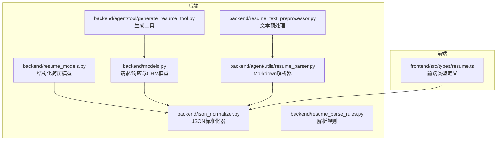
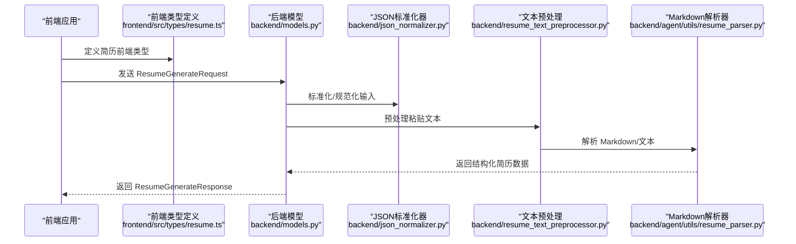
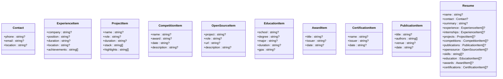
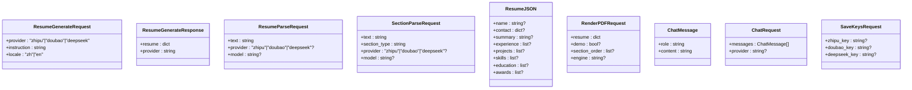
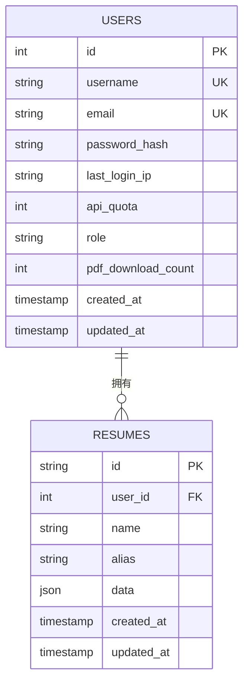
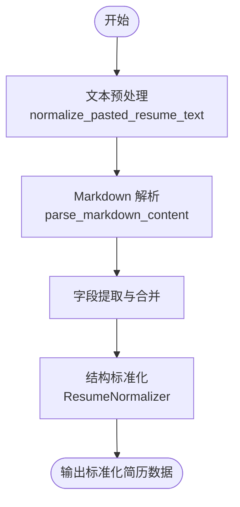
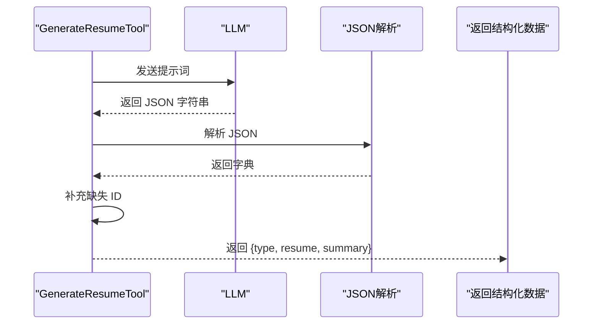
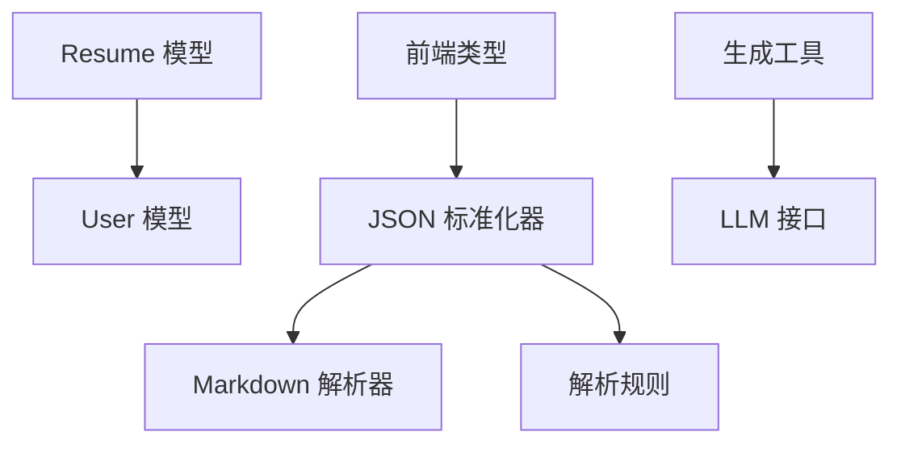

# 简历数据模型

<cite>
**本文档引用的文件**
- [backend/resume_models.py](file://backend/resume_models.py)
- [backend/models.py](file://backend/models.py)
- [backend/json_normalizer.py](file://backend/json_normalizer.py)
- [backend/resume_text_preprocessor.py](file://backend/resume_text_preprocessor.py)
- [backend/agent/utils/resume_parser.py](file://backend/agent/utils/resume_parser.py)
- [backend/resume_parse_rules.py](file://backend/resume_parse_rules.py)
- [backend/agent/tool/generate_resume_tool.py](file://backend/agent/tool/generate_resume_tool.py)
- [frontend/src/types/resume.ts](file://frontend/src/types/resume.ts)
</cite>

## 目录
1. [简介](#简介)
2. [项目结构](#项目结构)
3. [核心组件](#核心组件)
4. [架构总览](#架构总览)
5. [详细组件分析](#详细组件分析)
6. [依赖分析](#依赖分析)
7. [性能考虑](#性能考虑)
8. [故障排除指南](#故障排除指南)
9. [结论](#结论)
10. [附录](#附录)

## 简介
本文件系统性梳理简历数据模型的设计与实现，覆盖从请求/响应模型、数据库模型、前端类型定义，到数据标准化与解析流程。重点说明 ResumeGenerateRequest、ResumeGenerateResponse、ResumeParseRequest 等核心模型的字段定义、数据类型与验证规则；解释简历数据的嵌套结构、字段间关联关系与约束条件；并给出序列化/反序列化处理逻辑、JSON Schema 定义与数据校验机制。最后提供使用示例与最佳实践，帮助开发者正确构建与解析简历数据。

## 项目结构
简历数据模型涉及后端 Pydantic 模型、数据库 ORM、前端 TypeScript 类型、以及文本预处理与标准化工具。下图展示与简历数据模型相关的关键文件与交互关系：

**图表来源**
- [backend/resume_models.py:1-128](file://backend/resume_models.py#L1-L128)
- [backend/models.py:40-105](file://backend/models.py#L40-L105)
- [backend/json_normalizer.py:15-95](file://backend/json_normalizer.py#L15-L95)
- [backend/resume_text_preprocessor.py:28-56](file://backend/resume_text_preprocessor.py#L28-L56)
- [backend/agent/utils/resume_parser.py:9-139](file://backend/agent/utils/resume_parser.py#L9-L139)
- [backend/resume_parse_rules.py:3-14](file://backend/resume_parse_rules.py#L3-L14)
- [backend/agent/tool/generate_resume_tool.py:25-87](file://backend/agent/tool/generate_resume_tool.py#L25-L87)
- [frontend/src/types/resume.ts:1-98](file://frontend/src/types/resume.ts#L1-L98)

**章节来源**
- [backend/resume_models.py:1-128](file://backend/resume_models.py#L1-L128)
- [backend/models.py:40-105](file://backend/models.py#L40-L105)
- [backend/json_normalizer.py:15-95](file://backend/json_normalizer.py#L15-L95)
- [backend/resume_text_preprocessor.py:28-56](file://backend/resume_text_preprocessor.py#L28-L56)
- [backend/agent/utils/resume_parser.py:9-139](file://backend/agent/utils/resume_parser.py#L9-L139)
- [backend/resume_parse_rules.py:3-14](file://backend/resume_parse_rules.py#L3-L14)
- [backend/agent/tool/generate_resume_tool.py:25-87](file://backend/agent/tool/generate_resume_tool.py#L25-L87)
- [frontend/src/types/resume.ts:1-98](file://frontend/src/types/resume.ts#L1-L98)

## 核心组件
本节聚焦简历数据模型的核心类与请求/响应模型，说明字段定义、数据类型与验证规则。

- 结构化简历模型（Pydantic）
  - Contact：联系方式（电话、邮箱、所在地）
  - ExperienceItem：工作/实习经历（公司、职位、时间段、地点、成就）
  - ProjectItem：项目经验（名称、角色、时间段、技术栈、亮点）
  - CompetitionItem：竞赛经历（名称、奖项、时间、描述）
  - OpenSourceItem：开源贡献（项目、角色/贡献、链接、描述）
  - EducationItem：教育经历（学校、学位、专业、时间段、GPA）
  - AwardItem：奖项（名称、颁发方、时间）
  - CertificationItem：证书（名称、颁发机构、获得时间）
  - PublicationItem：论文/出版物（标题、作者、发表venue、时间）
  - Resume：完整简历（姓名、联系方式、个人简介/求职意向、工作/实习、项目、学术/竞赛、开源、技能、教育、荣誉/证书）

- 请求/响应模型（Pydantic）
  - ResumeGenerateRequest：简历生成请求（provider、instruction、locale）
  - ResumeGenerateResponse：简历生成响应（resume、provider）
  - ResumeJSON：简历 JSON 结构（扁平化字段集合）
  - RenderPDFRequest：PDF 渲染请求（resume、demo、section_order、engine）
  - SaveKeysRequest：保存 API Key 请求（zhipu_key、doubao_key、deepseek_key）
  - ChatMessage：聊天消息（role、content）
  - ChatRequest：聊天请求（messages、provider）
  - SectionParseRequest：单模块 AI 解析请求（text、section_type、provider、model）
  - ResumeParseRequest：简历解析请求（text、provider、model）

- 数据库模型（SQLAlchemy）
  - User、Resume、Member、APIRequestLog、APIErrorLog、APITraceSpan、PermissionAuditLog、AgentConversation、AgentMessage、ResumeEmbedding、ScoreRequest、DimensionScore、ScoreResponse、ScoreResult

**章节来源**
- [backend/resume_models.py:10-128](file://backend/resume_models.py#L10-L128)
- [backend/models.py:40-105](file://backend/models.py#L40-L105)
- [backend/models.py:163-372](file://backend/models.py#L163-L372)

## 架构总览
简历数据在系统中的流转路径如下：前端类型定义与后端模型相互映射；请求进入后端进行参数校验与标准化；解析与生成工具负责结构化解析与AI生成；最终数据持久化至数据库并支持PDF渲染。

**图表来源**
- [frontend/src/types/resume.ts:80-98](file://frontend/src/types/resume.ts#L80-L98)
- [backend/models.py:40-105](file://backend/models.py#L40-L105)
- [backend/json_normalizer.py:66-95](file://backend/json_normalizer.py#L66-L95)
- [backend/resume_text_preprocessor.py:28-56](file://backend/resume_text_preprocessor.py#L28-L56)
- [backend/agent/utils/resume_parser.py:24-41](file://backend/agent/utils/resume_parser.py#L24-L41)

## 详细组件分析

### 结构化简历模型（Pydantic）
- 设计原则
  - 所有字段均为可选，允许用户按需填充
  - 支持灵活嵌套结构，便于与不同来源数据对接
  - 通过字段描述增强可读性与可维护性

- 关键字段与类型
  - 基础信息：name（可选）、contact（可选）、summary（可选）
  - 工作相关：experience（可选列表）、internships（可选列表）
  - 项目相关：projects（可选列表）
  - 学术/竞赛相关：competitions（可选列表）、publications（可选列表）
  - 开源/社区：opensource（可选列表）
  - 技能/教育：skills（可选字符串列表）、education（可选列表）
  - 荣誉/证书：awards（可选列表）、certifications（可选列表）

- 字段约束与验证
  - 可选字段允许空值，避免强制约束
  - 列表字段默认为空工厂，保证类型一致性
  - 嵌套模型自动继承父模型的可选特性

**图表来源**
- [backend/resume_models.py:10-128](file://backend/resume_models.py#L10-L128)

**章节来源**
- [backend/resume_models.py:10-128](file://backend/resume_models.py#L10-L128)

### 请求/响应模型（Pydantic）
- ResumeGenerateRequest
  - 字段：provider（枚举：zhipu/doubao/deepseek，默认 deepseek）、instruction（必填字符串）、locale（枚举：zh/en，默认 zh）
  - 验证规则：provider 与 locale 为限定值；instruction 必填
  - 用途：驱动简历生成流程

- ResumeGenerateResponse
  - 字段：resume（字典，结构化简历数据）、provider（字符串）
  - 验证规则：resume 为任意 JSON 字典；provider 为字符串
  - 用途：返回生成的简历数据

- ResumeParseRequest
  - 字段：text（必填字符串，简历文本）、provider（可选枚举）、model（可选字符串，指定具体模型）
  - 验证规则：text 必填；provider 与 model 为可选
  - 用途：解析用户粘贴的简历文本

- SectionParseRequest
  - 字段：text（必填字符串，模块文本）、section_type（必填字符串，模块类型）、provider（可选枚举）、model（可选字符串）
  - 验证规则：text 与 section_type 必填
  - 用途：对单个模块进行 AI 解析

- 其他常用模型
  - ResumeJSON：扁平化简历 JSON 结构
  - RenderPDFRequest：PDF 渲染请求
  - ChatMessage/ChatRequest：聊天消息与请求
  - SaveKeysRequest：保存 API Key 请求

**图表来源**
- [backend/models.py:40-105](file://backend/models.py#L40-L105)

**章节来源**
- [backend/models.py:40-105](file://backend/models.py#L40-L105)

### 数据库模型（SQLAlchemy）
- Resume 模型
  - 主要字段：id（主键）、user_id（外键）、name、alias、data（JSON 存储完整简历）、created_at、updated_at
  - 关系：与 User 反向关联，级联删除
  - 用途：持久化存储简历数据

- User 模型
  - 主要字段：username、email、password_hash、last_login_ip、api_quota、role、pdf_download_count
  - 关系：与 Resume 一对多

- 其他模型
  - Member、APIRequestLog、APIErrorLog、APITraceSpan、PermissionAuditLog、AgentConversation、AgentMessage、ResumeEmbedding、ScoreRequest、DimensionScore、ScoreResponse、ScoreResult

**图表来源**
- [backend/models.py:163-182](file://backend/models.py#L163-L182)
- [backend/models.py:111-136](file://backend/models.py#L111-L136)

**章节来源**
- [backend/models.py:163-182](file://backend/models.py#L163-L182)
- [backend/models.py:111-136](file://backend/models.py#L111-L136)

### JSON 标准化与解析流程
- JSON 标准化器（ResumeNormalizer）
  - 功能：智能识别字段语义，递归处理嵌套结构，将任意结构的简历 JSON 扁平化到标准格式
  - 关键步骤：字段语义识别 → 联系信息合并 → 结构标准化（实习/工作/项目/教育等）
  - 适用场景：适配 LaTeX 模板所需的字段结构

- Markdown 解析器（parse_markdown_content）
  - 功能：从 Markdown 内容中解析简历数据，生成基础结构（basic、education、experience、projects、openSource、skillContent、awards）
  - 关键步骤：章节标题检测 → 段落解析 → 字段提取 → ID 自动生成 → 模块顺序控制

- 文本预处理（normalize_pasted_resume_text）
  - 功能：还原粘贴文本的段落与 bullet 结构，避免 LLM 错误拆分
  - 关键步骤：去除导入前缀 → bullet 格式化 → 模块标题规范化

**图表来源**
- [backend/resume_text_preprocessor.py:28-56](file://backend/resume_text_preprocessor.py#L28-L56)
- [backend/agent/utils/resume_parser.py:24-139](file://backend/agent/utils/resume_parser.py#L24-L139)
- [backend/json_normalizer.py:66-95](file://backend/json_normalizer.py#L66-L95)

**章节来源**
- [backend/json_normalizer.py:66-95](file://backend/json_normalizer.py#L66-L95)
- [backend/agent/utils/resume_parser.py:24-139](file://backend/agent/utils/resume_parser.py#L24-L139)
- [backend/resume_text_preprocessor.py:28-56](file://backend/resume_text_preprocessor.py#L28-L56)

### 生成工具与流程
- GenerateResumeTool
  - 功能：根据岗位描述与用户背景生成完整简历 JSON
  - 关键步骤：构造提示词 → 调用 LLM → 解析 JSON → 补充 ID → 返回结构化数据
  - 异常处理：JSON 解析失败与通用异常捕获

**图表来源**
- [backend/agent/tool/generate_resume_tool.py:46-87](file://backend/agent/tool/generate_resume_tool.py#L46-L87)

**章节来源**
- [backend/agent/tool/generate_resume_tool.py:46-87](file://backend/agent/tool/generate_resume_tool.py#L46-L87)

### 前端类型定义
- 前端类型（TypeScript）
  - DatedEntry：带日期的工作/实习条目
  - ProjectItem：项目经验中的子项目或描述块
  - Project：项目经验（含多个子项目）
  - OpenSourceContribution：开源经历
  - Skill：专业技能条目
  - Education：教育经历
  - SectionTitles：模块标题配置
  - Resume：完整简历数据结构（包含 name、contact、objective、internships、projects、openSource、skills、education、awards、summary、sectionTitles）

- 用途
  - 与后端模型保持一致，确保前后端数据契约稳定
  - 支持编辑器与模板渲染

**章节来源**
- [frontend/src/types/resume.ts:8-98](file://frontend/src/types/resume.ts#L8-L98)

## 依赖分析
- 组件耦合
  - Resume 模型依赖 User 模型（一对多）
  - JSON 标准化器依赖解析器与规则文件
  - 生成工具依赖 LLM 与消息模型
  - 前端类型与后端模型相互映射

- 外部依赖
  - Pydantic：数据模型与校验
  - SQLAlchemy：数据库 ORM
  - 正则表达式：文本解析与预处理

**图表来源**
- [backend/models.py:163-182](file://backend/models.py#L163-L182)
- [backend/models.py:111-136](file://backend/models.py#L111-L136)
- [backend/json_normalizer.py:237-291](file://backend/json_normalizer.py#L237-L291)
- [backend/agent/utils/resume_parser.py:9-41](file://backend/agent/utils/resume_parser.py#L9-L41)
- [backend/resume_parse_rules.py:3-14](file://backend/resume_parse_rules.py#L3-L14)
- [backend/agent/tool/generate_resume_tool.py:47-58](file://backend/agent/tool/generate_resume_tool.py#L47-L58)
- [frontend/src/types/resume.ts:80-98](file://frontend/src/types/resume.ts#L80-L98)

**章节来源**
- [backend/models.py:163-182](file://backend/models.py#L163-L182)
- [backend/models.py:111-136](file://backend/models.py#L111-L136)
- [backend/json_normalizer.py:237-291](file://backend/json_normalizer.py#L237-L291)
- [backend/agent/utils/resume_parser.py:9-41](file://backend/agent/utils/resume_parser.py#L9-L41)
- [backend/resume_parse_rules.py:3-14](file://backend/resume_parse_rules.py#L3-L14)
- [backend/agent/tool/generate_resume_tool.py:47-58](file://backend/agent/tool/generate_resume_tool.py#L47-L58)
- [frontend/src/types/resume.ts:80-98](file://frontend/src/types/resume.ts#L80-L98)

## 性能考虑
- 解析与标准化
  - 预处理阶段减少正则匹配次数，提升文本规范化效率
  - 标准化器采用递归处理，注意大体量数据的内存占用
- 数据库存储
  - JSON 字段适合灵活结构，但查询与索引受限；建议对高频查询字段建立额外索引或拆分表
- 前后端映射
  - 类型定义保持一致可减少序列化/反序列化开销与错误

## 故障排除指南
- JSON 解析失败
  - 现象：生成工具在解析 LLM 返回的 JSON 时抛出异常
  - 处理：检查提示词格式与 LLM 输出稳定性；增加日志记录与重试机制
  - 参考：[backend/agent/tool/generate_resume_tool.py:81-86](file://backend/agent/tool/generate_resume_tool.py#L81-L86)

- 文本解析异常
  - 现象：Markdown 解析器无法正确识别章节或字段
  - 处理：确认文本格式是否符合预期；必要时先执行文本预处理
  - 参考：[backend/agent/utils/resume_parser.py:24-41](file://backend/agent/utils/resume_parser.py#L24-L41)，[backend/resume_text_preprocessor.py:28-56](file://backend/resume_text_preprocessor.py#L28-L56)

- 字段标准化不一致
  - 现象：不同来源数据导致字段结构差异较大
  - 处理：使用 JSON 标准化器统一字段语义；扩展语义映射表以覆盖更多字段变体
  - 参考：[backend/json_normalizer.py:24-64](file://backend/json_normalizer.py#L24-L64)

**章节来源**
- [backend/agent/tool/generate_resume_tool.py:81-86](file://backend/agent/tool/generate_resume_tool.py#L81-L86)
- [backend/agent/utils/resume_parser.py:24-41](file://backend/agent/utils/resume_parser.py#L24-L41)
- [backend/resume_text_preprocessor.py:28-56](file://backend/resume_text_preprocessor.py#L28-L56)
- [backend/json_normalizer.py:24-64](file://backend/json_normalizer.py#L24-L64)

## 结论
本文件系统梳理了简历数据模型的设计与实现，涵盖结构化模型、请求/响应模型、数据库模型、前端类型定义，以及文本预处理与标准化流程。通过可选字段设计与灵活嵌套结构，满足多样化的简历数据来源；借助标准化器与解析器，确保数据结构的一致性与可用性。建议在实际使用中遵循字段约束与验证规则，结合最佳实践进行数据构建与解析。

## 附录
- 字段与验证规则速查
  - ResumeGenerateRequest：provider 与 locale 为限定值；instruction 必填
  - ResumeParseRequest：text 必填；provider 与 model 可选
  - SectionParseRequest：text 与 section_type 必填
  - Resume 模型：data 为 JSON 字段，建议配合索引优化查询
  - 前端类型：与后端模型保持一致，确保序列化/反序列化稳定