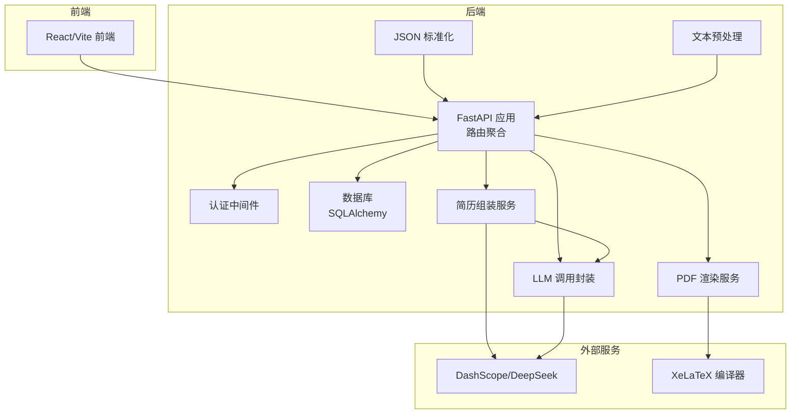
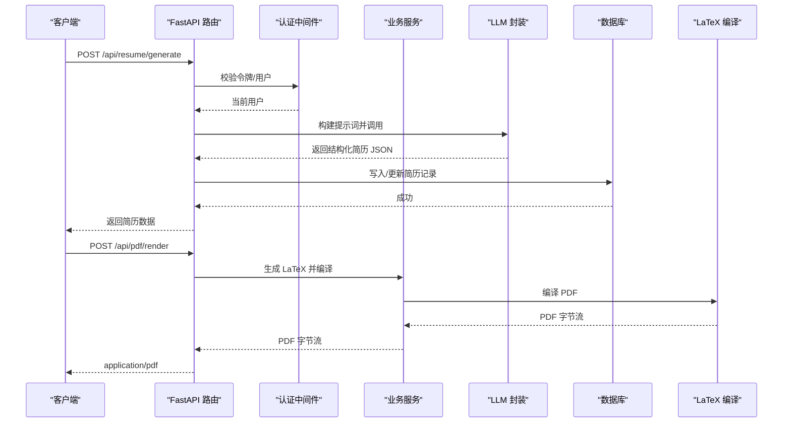
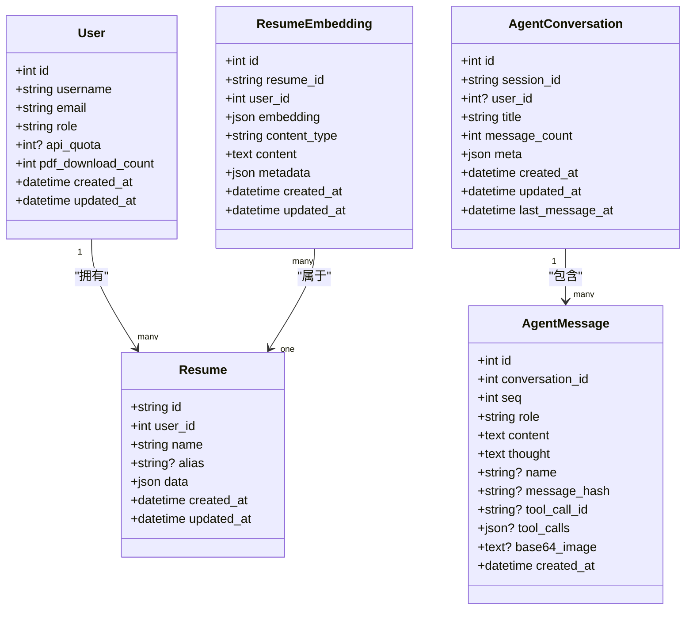
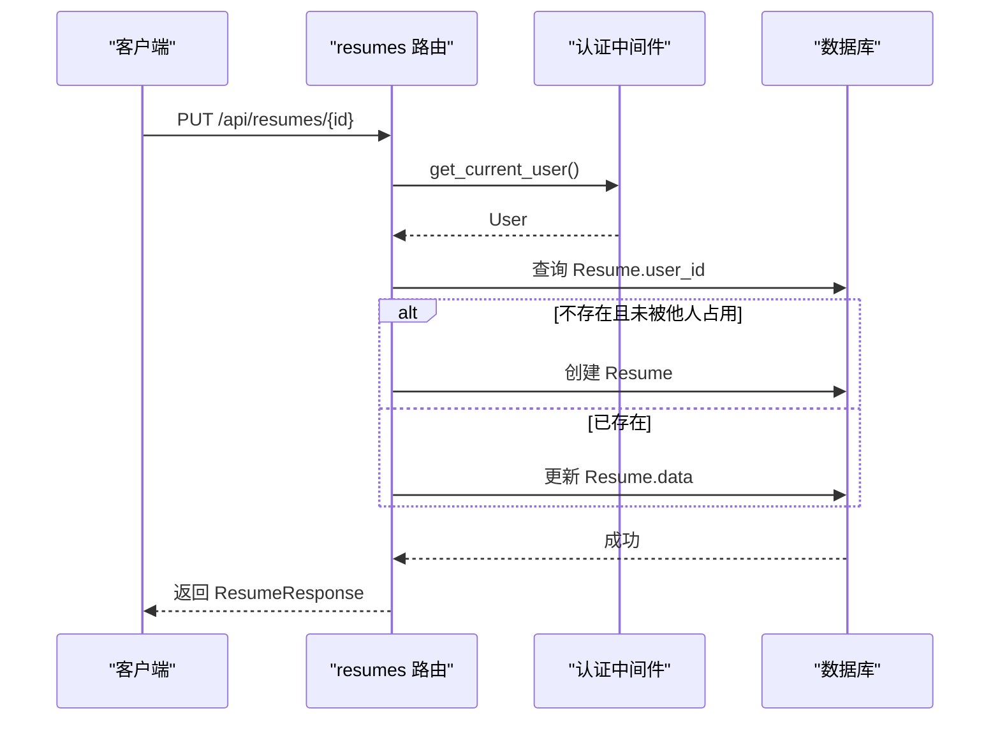
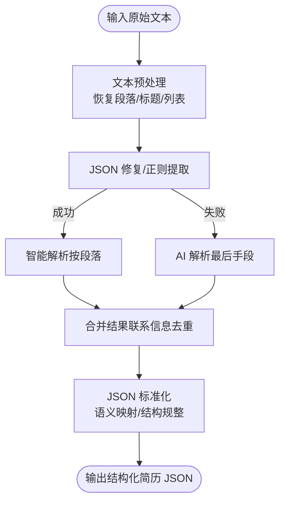
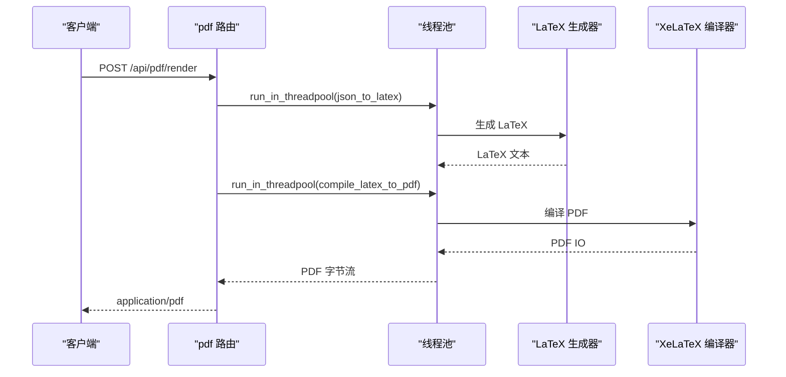
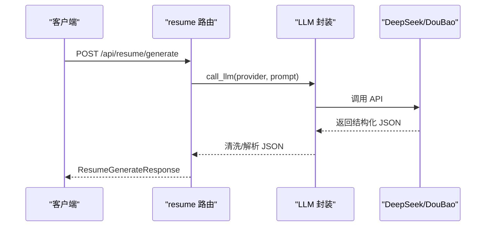
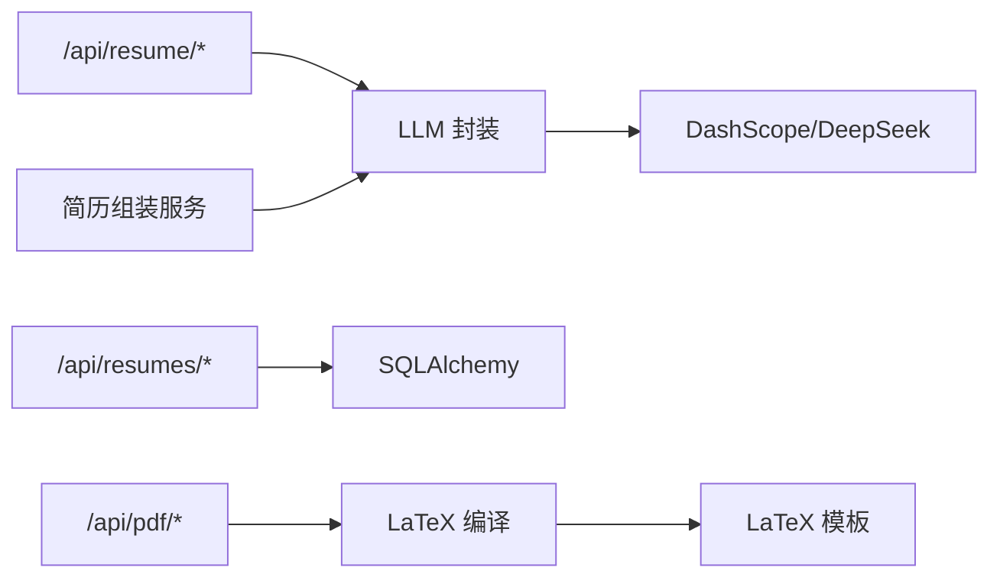

# 简历管理系统

<cite>
**本文引用的文件**
- [backend/main.py](file://backend/main.py)
- [backend/models.py](file://backend/models.py)
- [backend/resume_models.py](file://backend/resume_models.py)
- [backend/database.py](file://backend/database.py)
- [backend/middleware/auth.py](file://backend/middleware/auth.py)
- [backend/routes/resume.py](file://backend/routes/resume.py)
- [backend/routes/resumes.py](file://backend/routes/resumes.py)
- [backend/routes/pdf.py](file://backend/routes/pdf.py)
- [backend/llm.py](file://backend/llm.py)
- [backend/services/resume_assembler.py](file://backend/services/resume_assembler.py)
- [backend/json_normalizer.py](file://backend/json_normalizer.py)
- [backend/resume_text_preprocessor.py](file://backend/resume_text_preprocessor.py)
- [backend/format_helper.py](file://backend/format_helper.py)
- [latex-resume-template/resume.cls](file://latex-resume-template/resume.cls)
- [latex-resume-template/Makefile](file://latex-resume-template/Makefile)
- [README.md](file://README.md)
</cite>

## 目录
1. [简介](#简介)
2. [项目结构](#项目结构)
3. [核心组件](#核心组件)
4. [架构总览](#架构总览)
5. [详细组件分析](#详细组件分析)
6. [依赖关系分析](#依赖关系分析)
7. [性能考量](#性能考量)
8. [故障排查指南](#故障排查指南)
9. [结论](#结论)
10. [附录](#附录)

## 简介
本系统是一个面向中文求职场景的 AI 简历管理平台，提供从“一句话生成”、“结构化编辑”到“LaTeX 高质量 PDF 导出”的完整闭环。后端采用 FastAPI + SQLAlchemy，结合多模态解析与 AI 提示词工程，实现简历数据的采集、清洗、标准化、存储、检索与导出。

## 项目结构
后端采用模块化路由组织，核心模块包括：
- 路由层：/api/resume、/api/resumes、/api/pdf 等
- 数据模型层：Pydantic 模型 + SQLAlchemy ORM
- 中间件：认证与可观测性
- 服务层：PDF 渲染、AI 调用、简历组装、文本预处理
- 模板层：LaTeX 模板与编译工具

图示来源
- [backend/main.py:92-139](file://backend/main.py#L92-L139)
- [backend/routes/resume.py:92](file://backend/routes/resume.py#L92)
- [backend/routes/resumes.py:19](file://backend/routes/resumes.py#L19)
- [backend/routes/pdf.py:34](file://backend/routes/pdf.py#L34)

章节来源
- [backend/main.py:92-139](file://backend/main.py#L92-L139)
- [README.md:38-86](file://README.md#L38-L86)

## 核心组件
- 数据模型
  - Pydantic 模型：ResumeGenerateRequest/Response、RenderPDFRequest、ScoreRequest/Response 等
  - SQLAlchemy 模型：User、Resume、ResumeEmbedding、AgentConversation/Messages 等
- 路由与业务
  - /api/resume：AI 生成、解析、润色、翻译、体检、JD 优化等
  - /api/resumes：CRUD 简历、同步
  - /api/pdf：LaTeX 渲染、流式编译、配额控制
- 中间件与安全
  - 认证：JWT/BetterAuth 统一解析，支持内部可信头
  - 权限：require_admin_only/require_admin_or_member
- 服务与工具
  - LLM 封装：统一调用 DeepSeek/DouBao/ZhiPu
  - 简历组装：多源文本融合生成结构化 JSON
  - 格式化：JSON 标准化、文本预处理、智能解析

章节来源
- [backend/models.py:24-105](file://backend/models.py#L24-L105)
- [backend/models.py:163-182](file://backend/models.py#L163-L182)
- [backend/routes/resume.py:92](file://backend/routes/resume.py#L92)
- [backend/routes/resumes.py:19](file://backend/routes/resumes.py#L19)
- [backend/routes/pdf.py:34](file://backend/routes/pdf.py#L34)
- [backend/middleware/auth.py:113-191](file://backend/middleware/auth.py#L113-L191)
- [backend/llm.py:52-168](file://backend/llm.py#L52-L168)
- [backend/services/resume_assembler.py:280-388](file://backend/services/resume_assembler.py#L280-L388)
- [backend/json_normalizer.py:66-96](file://backend/json_normalizer.py#L66-L96)
- [backend/resume_text_preprocessor.py:28-56](file://backend/resume_text_preprocessor.py#L28-L56)
- [backend/format_helper.py:33-168](file://backend/format_helper.py#L33-L168)

## 架构总览
系统采用“路由-服务-模型-模板”的分层架构：
- 路由层负责请求接入与参数校验
- 服务层封装业务逻辑（PDF 渲染、AI 调用、简历组装）
- 模型层负责数据持久化与关系映射
- 模板层提供 LaTeX 编译与字体资源

图示来源
- [backend/routes/resume.py:795-800](file://backend/routes/resume.py#L795-L800)
- [backend/routes/pdf.py:125-180](file://backend/routes/pdf.py#L125-L180)
- [backend/llm.py:52-118](file://backend/llm.py#L52-L118)
- [backend/database.py:121-131](file://backend/database.py#L121-L131)

## 详细组件分析

### 数据模型与验证
- Pydantic 模型
  - ResumeGenerateRequest/Response：用于“一句话生成”流程
  - RenderPDFRequest：PDF 渲染输入
  - ScoreRequest/Response：简历评分请求/响应
  - ResumeJSON：简历 JSON 结构（兼容性）
- SQLAlchemy 模型
  - User：用户信息、角色、配额
  - Resume：简历主表，JSON 字段存储完整数据
  - ResumeEmbedding：用于语义搜索的向量表
  - AgentConversation/AgentMessage：对话与消息
- 验证规则
  - 路由层对必填字段进行校验（如 text/instruction 等）
  - LLM 输出后进行 JSON 解析与结构校验
  - PDF 渲染前对模板与字段进行简要校验

图示来源
- [backend/models.py:111-182](file://backend/models.py#L111-L182)
- [backend/models.py:310-330](file://backend/models.py#L310-L330)
- [backend/models.py:267-309](file://backend/models.py#L267-L309)

章节来源
- [backend/models.py:24-105](file://backend/models.py#L24-L105)
- [backend/models.py:163-182](file://backend/models.py#L163-L182)
- [backend/models.py:310-330](file://backend/models.py#L310-L330)
- [backend/models.py:267-309](file://backend/models.py#L267-L309)

### CRUD 简历管理
- 接口
  - GET /api/resumes：列出当前用户所有简历
  - GET /api/resumes/{id}：获取单个简历
  - POST /api/resumes：创建简历（自动生成 ID，名称回退策略）
  - PUT /api/resumes/{id}：更新简历（不存在时自动创建，避免前端首次云端保存 404）
  - DELETE /api/resumes/{id}：删除简历（级联删除向量）
  - POST /api/resumes/sync：同步 localStorage 与数据库
- 权限控制
  - 通过 get_current_user 依赖注入获取当前用户，所有操作均绑定 user_id
  - 删除时严格校验所属关系，防止越权
- 数据一致性
  - 更新时若 payload 含 template_type，同步写入 data["templateType"]

图示来源
- [backend/routes/resumes.py:135-196](file://backend/routes/resumes.py#L135-L196)
- [backend/middleware/auth.py:113-146](file://backend/middleware/auth.py#L113-L146)

章节来源
- [backend/routes/resumes.py:52-262](file://backend/routes/resumes.py#L52-L262)
- [backend/middleware/auth.py:113-191](file://backend/middleware/auth.py#L113-L191)

### 数据解析与标准化
- 文本预处理
  - resume_text_preprocessor.normalize_pasted_resume_text：还原段落、标题与列表结构，避免 AI 拆分职责
- 智能解析
  - format_helper.format_resume_text：多层降级（JSON 修复 → 正则 → 智能解析 → AI），在快速路径满足时避免昂贵的 LLM 调用
- JSON 标准化
  - json_normalizer.normalize_resume_json：语义识别 + 结构标准化，适配 LaTeX 模板字段
- 简历组装
  - resume_assembler.assemble_resume_data：多源文本融合（OCR + MinerU），DeepSeek 推断结构并输出结构化 JSON

图示来源
- [backend/resume_text_preprocessor.py:28-56](file://backend/resume_text_preprocessor.py#L28-L56)
- [backend/format_helper.py:121-168](file://backend/format_helper.py#L121-L168)
- [backend/json_normalizer.py:66-96](file://backend/json_normalizer.py#L66-L96)
- [backend/services/resume_assembler.py:280-388](file://backend/services/resume_assembler.py#L280-L388)

章节来源
- [backend/resume_text_preprocessor.py:28-56](file://backend/resume_text_preprocessor.py#L28-L56)
- [backend/format_helper.py:33-168](file://backend/format_helper.py#L33-L168)
- [backend/json_normalizer.py:15-536](file://backend/json_normalizer.py#L15-L536)
- [backend/services/resume_assembler.py:280-388](file://backend/services/resume_assembler.py#L280-L388)

### PDF 渲染与导出
- 接口
  - POST /api/pdf/render：直接返回 PDF 字节流
  - POST /api/pdf/render/stream：SSE 流式渲染，提供进度事件
  - POST /api/pdf/compile-latex：编译 LaTeX 源码
  - POST /api/pdf/compile-latex/stream：流式编译
  - GET /api/pdf/quota：查询配额
  - POST /api/pdf/downloads/record：记录真实下载
- 流程
  - 生成 LaTeX → 编译 PDF → 返回字节流
  - 流式版本通过 SSE 发送 start/progress/pdf/error 事件
- 配额控制
  - 记录成功下载并限制使用次数，避免滥用

图示来源
- [backend/routes/pdf.py:125-180](file://backend/routes/pdf.py#L125-L180)
- [backend/routes/pdf.py:187-299](file://backend/routes/pdf.py#L187-L299)

章节来源
- [backend/routes/pdf.py:76-380](file://backend/routes/pdf.py#L76-L380)

### AI 代理系统交互
- LLM 调用封装
  - 支持 provider：deepseek、doubao、zhipu
  - 统一错误处理：缺失 API Key 返回 400
  - 流式与非流式调用
- 简历解析与优化
  - /api/resume/generate：根据指令生成结构化简历
  - /api/resume/jd-optimize：基于 JD 的匹配度与 ATS 评分
  - /api/resume/translate：多字段翻译（保留 HTML 结构）
  - /api/resume/health-check：通用体检与建议
  - /api/resume/grammar-check：语法/表达体检
- 意图识别与改写
  - /api/resume/rewrite-text/intent：识别改写意图（加粗/列表转换/润色）

图示来源
- [backend/routes/resume.py:795-800](file://backend/routes/resume.py#L795-L800)
- [backend/llm.py:52-168](file://backend/llm.py#L52-L168)

章节来源
- [backend/routes/resume.py:252-298](file://backend/routes/resume.py#L252-L298)
- [backend/routes/resume.py:362-420](file://backend/routes/resume.py#L362-L420)
- [backend/routes/resume.py:551-613](file://backend/routes/resume.py#L551-L613)
- [backend/routes/resume.py:685-724](file://backend/routes/resume.py#L685-L724)
- [backend/routes/resume.py:726-792](file://backend/routes/resume.py#L726-L792)
- [backend/llm.py:52-168](file://backend/llm.py#L52-L168)

### 权限控制机制
- 认证来源
  - Trusted Internal Headers（内部可信头）
  - BetterAuth Bearer Token
  - JWT Access Token
- 依赖注入
  - get_current_user：必需认证
  - get_current_user_optional：匿名可访问（如 PDF 预览）
  - require_admin_only/require_admin_or_member：管理员/成员专用
- 数据隔离
  - 所有路由均按 user_id 进行过滤，防止越权访问

章节来源
- [backend/middleware/auth.py:113-191](file://backend/middleware/auth.py#L113-L191)

## 依赖关系分析
- 路由到服务
  - resume 路由依赖 LLM 封装与解析服务
  - resumes 路由依赖数据库与同步服务
  - pdf 路由依赖 LaTeX 生成器与编译器
- 服务到外部
  - LLM 封装依赖 DashScope/DeepSeek
  - 简历组装依赖 DeepSeek 与 OCR 文本
  - PDF 渲染依赖 XeLaTeX
- 数据库
  - User/Resume/ResumeEmbedding 等模型通过 SQLAlchemy 管理

图示来源
- [backend/routes/resume.py:92](file://backend/routes/resume.py#L92)
- [backend/routes/resumes.py:19](file://backend/routes/resumes.py#L19)
- [backend/routes/pdf.py:34](file://backend/routes/pdf.py#L34)
- [backend/services/resume_assembler.py:280-388](file://backend/services/resume_assembler.py#L280-L388)
- [latex-resume-template/resume.cls:1-200](file://latex-resume-template/resume.cls#L1-L200)

章节来源
- [backend/routes/resume.py:92](file://backend/routes/resume.py#L92)
- [backend/routes/resumes.py:19](file://backend/routes/resumes.py#L19)
- [backend/routes/pdf.py:34](file://backend/routes/pdf.py#L34)
- [backend/services/resume_assembler.py:280-388](file://backend/services/resume_assembler.py#L280-L388)

## 性能考量
- 启动优化
  - 预热 HTTP 连接、数据库连接、tiktoken 编码文件，降低首次请求延迟
- 并发与异步
  - PDF 流式渲染使用 SSE，前端可逐步接收进度
  - 翻译任务使用信号量限制并发，保证稳定性
- I/O 与 CPU
  - LaTeX 编译在独立线程池执行，避免阻塞主事件循环
- 存储与索引
  - ResumeEmbedding 支持简历向量化，便于后续语义检索扩展

章节来源
- [backend/main.py:228-316](file://backend/main.py#L228-L316)
- [backend/routes/resume.py:699-724](file://backend/routes/resume.py#L699-L724)
- [backend/routes/pdf.py:187-299](file://backend/routes/pdf.py#L187-L299)

## 故障排查指南
- 常见错误与处理
  - 缺少 API Key：LLM 调用返回 400，检查环境变量
  - 数据库连接异常：认证中间件重试与回退，确认连接串与网络
  - PDF 渲染失败：查看编译日志与模板路径，确认 XeLaTeX 与字体
  - 简历解析失败：检查文本预处理与智能解析降级路径
- 日志与追踪
  - 后端统一日志与追踪头（X-PDF-Trace-*），便于定位问题
  - PDF 渲染打印 trace 信息，包含用户、会话、耗时等

章节来源
- [backend/llm.py:67-114](file://backend/llm.py#L67-L114)
- [backend/middleware/auth.py:41-86](file://backend/middleware/auth.py#L41-L86)
- [backend/routes/pdf.py:125-180](file://backend/routes/pdf.py#L125-L180)
- [backend/routes/resume.py:28-48](file://backend/routes/resume.py#L28-L48)

## 结论
本系统通过清晰的模块化设计与稳健的中间件体系，实现了从“文本解析、结构化生成、AI 优化、存储管理”到“LaTeX 导出”的完整闭环。配合严格的权限控制与可观测性，既保证了易用性，也兼顾了生产环境的可靠性与可维护性。

## 附录

### API 接口概览
- 简历管理
  - GET /api/resumes：获取简历列表
  - GET /api/resumes/{id}：获取单个简历
  - POST /api/resumes：创建简历
  - PUT /api/resumes/{id}：更新/创建简历
  - DELETE /api/resumes/{id}：删除简历
  - POST /api/resumes/sync：同步本地与云端
- 简历解析与优化
  - POST /api/resume/generate：生成结构化简历
  - POST /api/resume/jd-optimize：JD 优化建议
  - POST /api/resume/translate：多字段翻译
  - POST /api/resume/health-check：通用体检
  - POST /api/resume/grammar-check：语法/表达体检
  - POST /api/resume/rewrite-text/intent：改写意图识别
- PDF 渲染
  - POST /api/pdf/render：渲染 PDF
  - POST /api/pdf/render/stream：流式渲染
  - POST /api/pdf/compile-latex：编译 LaTeX
  - POST /api/pdf/compile-latex/stream：流式编译
  - GET /api/pdf/quota：查询配额
  - POST /api/pdf/downloads/record：记录下载

章节来源
- [backend/routes/resumes.py:52-262](file://backend/routes/resumes.py#L52-L262)
- [backend/routes/resume.py:795-792](file://backend/routes/resume.py#L795-L792)
- [backend/routes/pdf.py:125-380](file://backend/routes/pdf.py#L125-L380)

### 数据模型与模板
- LaTeX 模板
  - resume.cls：简历文档类
  - Makefile：编译脚本与字体配置
- 模板使用
  - PDF 渲染时从 latex-resume-template 目录读取模板与字体资源

章节来源
- [latex-resume-template/resume.cls:1-200](file://latex-resume-template/resume.cls#L1-L200)
- [latex-resume-template/Makefile:1-200](file://latex-resume-template/Makefile#L1-L200)
- [backend/routes/pdf.py:38-57](file://backend/routes/pdf.py#L38-L57)