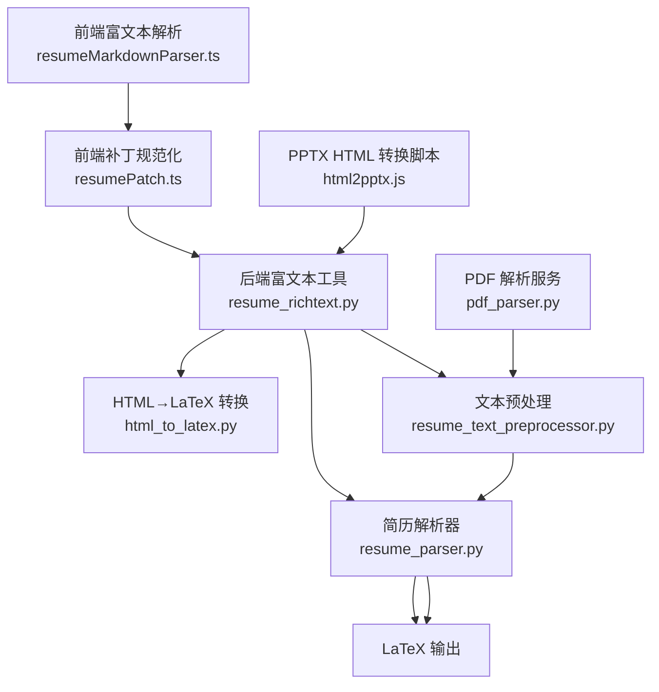
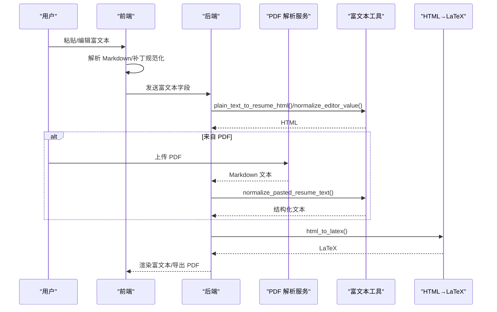
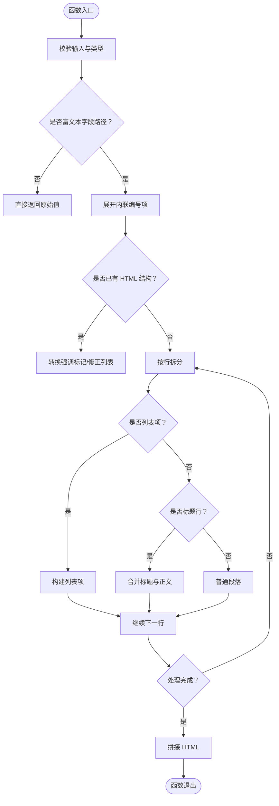
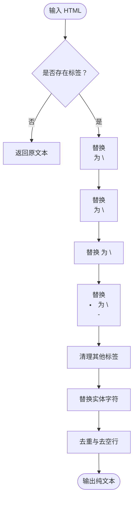
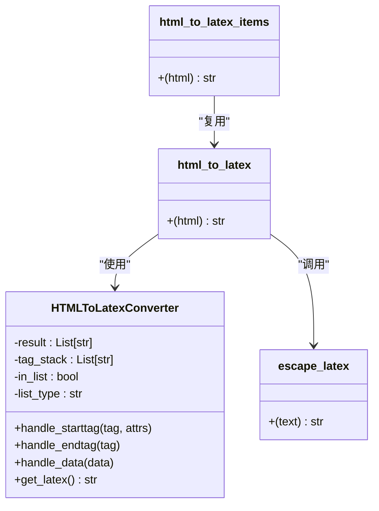
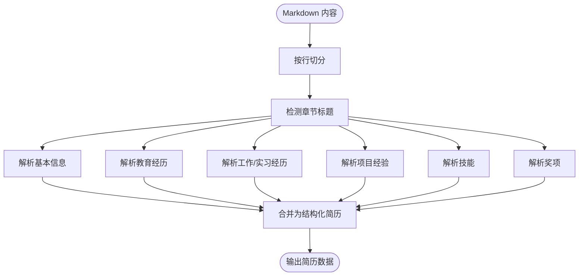
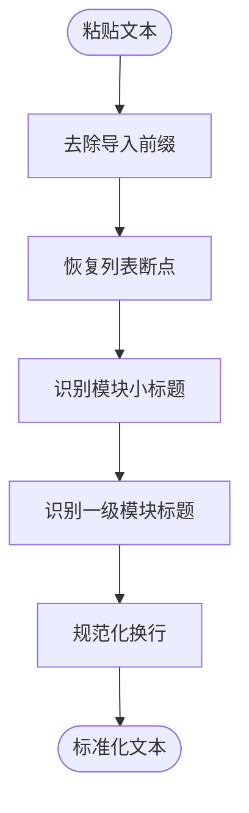
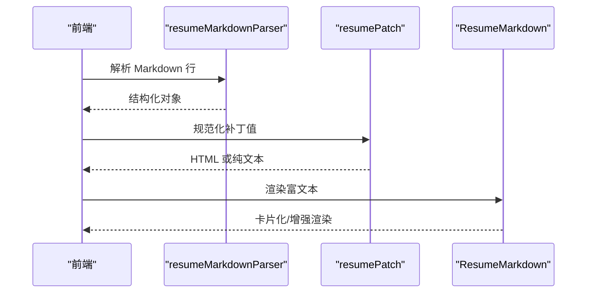
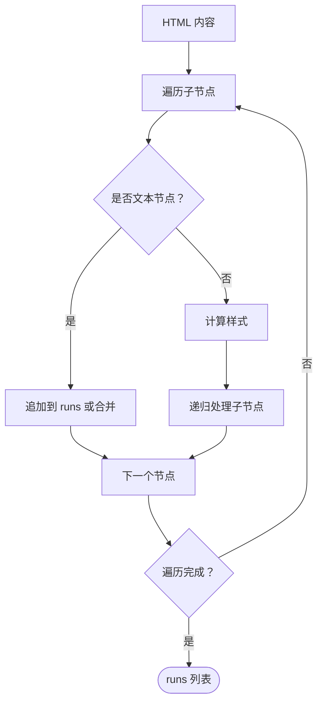
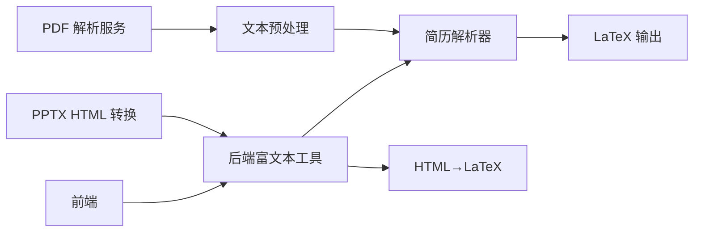

# 富文本处理

<cite>
**本文引用的文件**
- [backend/agent/utils/resume_richtext.py](file://backend/agent/utils/resume_richtext.py)
- [backend/resume_text_preprocessor.py](file://backend/resume_text_preprocessor.py)
- [backend/html_to_latex.py](file://backend/html_to_latex.py)
- [backend/agent/utils/resume_parser.py](file://backend/agent/utils/resume_parser.py)
- [backend/services/pdf_parser.py](file://backend/services/pdf_parser.py)
- [backend/agent/skills/office-files/pptx/scripts/html2pptx.js](file://backend/agent/skills/office-files/pptx/scripts/html2pptx.js)
- [frontend/src/utils/resumeMarkdownParser.ts](file://frontend/src/utils/resumeMarkdownParser.ts)
- [frontend/src/utils/resumePatch.ts](file://frontend/src/utils/resumePatch.ts)
- [frontend/src/components/agent-chat/ResumeMarkdown.tsx](file://frontend/src/components/agent-chat/ResumeMarkdown.tsx)
- [backend/tests/test_resume_text_preprocessor.py](file://backend/tests/test_resume_text_preprocessor.py)
</cite>

## 目录
1. [简介](#简介)
2. [项目结构](#项目结构)
3. [核心组件](#核心组件)
4. [架构总览](#架构总览)
5. [详细组件分析](#详细组件分析)
6. [依赖关系分析](#依赖关系分析)
7. [性能考量](#性能考量)
8. [故障排查指南](#故障排查指南)
9. [结论](#结论)
10. [附录](#附录)

## 简介
本文件系统性阐述简历中富文本内容的解析与转换能力，覆盖以下方面：
- 格式标记识别与样式信息提取：识别 Markdown 强调标记与列表结构，抽取富文本样式上下文。
- 结构化数据转换：将富文本转换为 HTML，并进一步标准化为 LaTeX。
- 富文本到纯文本的转换算法：保留列表与标题结构，便于混合解析与注入。
- HTML 标签处理与样式保留策略：在转换过程中保留加粗、斜体、下划线、列表等语义。
- 扩展机制与兼容性：支持多格式输入（Markdown/HTML/纯文本）、样式标准化与内容清洗。
- 前后端协同：前端富文本渲染与补丁规范化，后端富文本预处理与解析。

## 项目结构
富文本处理涉及前后端与后端工具链的协作：
- 前端：富文本渲染、补丁规范化、Markdown 解析与卡片化展示。
- 后端：富文本预处理、富文本到 HTML/纯文本转换、HTML 到 LaTeX 转换、PDF/Office 文件解析与导出。

**图表来源**
- [frontend/src/utils/resumeMarkdownParser.ts:87-132](file://frontend/src/utils/resumeMarkdownParser.ts#L87-L132)
- [frontend/src/utils/resumePatch.ts:276-319](file://frontend/src/utils/resumePatch.ts#L276-L319)
- [backend/agent/utils/resume_richtext.py:112-258](file://backend/agent/utils/resume_richtext.py#L112-L258)
- [backend/html_to_latex.py:192-241](file://backend/html_to_latex.py#L192-L241)
- [backend/agent/utils/resume_parser.py:9-478](file://backend/agent/utils/resume_parser.py#L9-L478)
- [backend/resume_text_preprocessor.py:28-56](file://backend/resume_text_preprocessor.py#L28-L56)
- [backend/services/pdf_parser.py:71-89](file://backend/services/pdf_parser.py#L71-L89)
- [backend/agent/skills/office-files/pptx/scripts/html2pptx.js:418-437](file://backend/agent/skills/office-files/pptx/scripts/html2pptx.js#L418-L437)

**章节来源**
- [backend/agent/utils/resume_richtext.py:1-258](file://backend/agent/utils/resume_richtext.py#L1-L258)
- [backend/resume_text_preprocessor.py:1-56](file://backend/resume_text_preprocessor.py#L1-L56)
- [backend/html_to_latex.py:1-305](file://backend/html_to_latex.py#L1-L305)
- [backend/agent/utils/resume_parser.py:1-478](file://backend/agent/utils/resume_parser.py#L1-L478)
- [backend/services/pdf_parser.py:1-89](file://backend/services/pdf_parser.py#L1-L89)
- [backend/agent/skills/office-files/pptx/scripts/html2pptx.js:418-437](file://backend/agent/skills/office-files/pptx/scripts/html2pptx.js#L418-L437)
- [frontend/src/utils/resumeMarkdownParser.ts:87-132](file://frontend/src/utils/resumeMarkdownParser.ts#L87-L132)
- [frontend/src/utils/resumePatch.ts:276-319](file://frontend/src/utils/resumePatch.ts#L276-L319)
- [frontend/src/components/agent-chat/ResumeMarkdown.tsx:1-58](file://frontend/src/components/agent-chat/ResumeMarkdown.tsx#L1-L58)

## 核心组件
- 富文本预处理与规范化
  - 前端补丁规范化：区分富文本字段与纯文本字段，富文本字段转换为 HTML，纯文本字段去除 Markdown/HTML 标记。
  - 后端富文本工具：将 Markdown/纯文本转换为简历专用 HTML（统一无序列表、强调标记转换），或将 HTML 转换为纯文本以便混合解析。
- HTML→LaTeX 转换
  - 支持加粗、斜体、下划线、列表、段落、换行等标签，转义 LaTeX 特殊字符，处理嵌套列表与空列表项。
- 简历解析器
  - 从 Markdown 内容解析结构化数据，自动识别章节、标题、时间、地点、描述等，支持富文本字段的 HTML 规范化。
- PDF/Office 文件解析与导出
  - PDF 解析服务优先使用 MinerU，失败时降级到 pdfminer；Office 文件通过 LibreOffice/Pandoc/自定义脚本导出 HTML，再进入富文本处理链路。

**章节来源**
- [frontend/src/utils/resumePatch.ts:307-319](file://frontend/src/utils/resumePatch.ts#L307-L319)
- [backend/agent/utils/resume_richtext.py:145-258](file://backend/agent/utils/resume_richtext.py#L145-L258)
- [backend/html_to_latex.py:87-241](file://backend/html_to_latex.py#L87-L241)
- [backend/agent/utils/resume_parser.py:9-478](file://backend/agent/utils/resume_parser.py#L9-L478)
- [backend/services/pdf_parser.py:71-89](file://backend/services/pdf_parser.py#L71-L89)
- [backend/agent/skills/office-files/pptx/scripts/html2pptx.js:418-437](file://backend/agent/skills/office-files/pptx/scripts/html2pptx.js#L418-L437)

## 架构总览
富文本处理的关键流程：
- 输入层：用户粘贴的纯文本、Markdown、HTML，或 Office/PDF 导出的 HTML。
- 预处理层：清洗与结构化，确保列表与标题边界清晰。
- 转换层：Markdown/纯文本→HTML；HTML→纯文本（用于混合解析）；HTML→LaTeX（用于排版输出）。
- 解析层：简历解析器抽取结构化数据，富文本字段保持 HTML 格式。
- 输出层：前端渲染富文本，后端生成 LaTeX/PDF。

**图表来源**
- [frontend/src/utils/resumeMarkdownParser.ts:87-132](file://frontend/src/utils/resumeMarkdownParser.ts#L87-L132)
- [frontend/src/utils/resumePatch.ts:307-319](file://frontend/src/utils/resumePatch.ts#L307-L319)
- [backend/agent/utils/resume_richtext.py:145-258](file://backend/agent/utils/resume_richtext.py#L145-L258)
- [backend/resume_text_preprocessor.py:28-56](file://backend/resume_text_preprocessor.py#L28-L56)
- [backend/services/pdf_parser.py:71-89](file://backend/services/pdf_parser.py#L71-L89)
- [backend/html_to_latex.py:192-241](file://backend/html_to_latex.py#L192-L241)

## 详细组件分析

### 组件A：富文本预处理与规范化（后端）
- 功能要点
  - 识别富文本字段路径，仅对富文本字段执行 HTML 规范化。
  - 将 Markdown/纯文本转换为简历专用 HTML（统一无序列表、强调标记转换）。
  - 将 HTML 转换为纯文本，保留列表与标题结构，便于混合解析。
- 关键算法
  - 正则识别列表前缀（有序/无序）、标题强调标记、行内强调转换。
  - 拆分长句为多行列表项，避免合并为单个列表项。
  - 标题与正文合并策略，保证渲染一致性。
- 性能与健壮性
  - 使用正则批量替换，时间复杂度 O(n)；对空输入快速返回。
  - 对已存在 HTML 结构进行最小化转换，避免重复处理。

**图表来源**
- [backend/agent/utils/resume_richtext.py:145-258](file://backend/agent/utils/resume_richtext.py#L145-L258)

**章节来源**
- [backend/agent/utils/resume_richtext.py:1-258](file://backend/agent/utils/resume_richtext.py#L1-L258)

### 组件B：HTML→纯文本转换（Hybrid 解析注入）
- 功能要点
  - 将 HTML 富文本转换为多行纯文本，保留列表与标题结构。
  - 替换换行与段落标签，清理列表标签，强调标记转换为双星号。
  - 去除多余空白与重复行，保证混合解析稳定性。
- 兼容性
  - 支持多种列表标签与强调标签，忽略实体字符，保留中文标点。

**图表来源**
- [backend/agent/utils/resume_richtext.py:112-143](file://backend/agent/utils/resume_richtext.py#L112-L143)

**章节来源**
- [backend/agent/utils/resume_richtext.py:112-143](file://backend/agent/utils/resume_richtext.py#L112-L143)

### 组件C：HTML→LaTeX 转换（排版输出）
- 功能要点
  - 支持标签：strong/b、em/i、u、ul/li、ol/li、p、br、h1/h2/h3。
  - 转义 LaTeX 特殊字符，处理空段落与嵌套列表。
  - 提供列表项提取接口，便于项目描述等片段化输出。
- 错误处理
  - 解析失败时回退为纯文本转义输出，保证稳定性。

**图表来源**
- [backend/html_to_latex.py:87-241](file://backend/html_to_latex.py#L87-L241)

**章节来源**
- [backend/html_to_latex.py:1-305](file://backend/html_to_latex.py#L1-L305)

### 组件D：简历解析器（结构化抽取）
- 功能要点
  - 从 Markdown 内容解析基本信息、教育经历、工作/实习经历、项目经验、技能、奖项等。
  - 自动识别章节标题、时间、地点、描述等，支持富文本字段的 HTML 规范化。
- 扩展性
  - 新增字段时可复用富文本规范化工具，确保富文本字段一致性。

**图表来源**
- [backend/agent/utils/resume_parser.py:9-478](file://backend/agent/utils/resume_parser.py#L9-L478)

**章节来源**
- [backend/agent/utils/resume_parser.py:1-478](file://backend/agent/utils/resume_parser.py#L1-L478)

### 组件E：粘贴文本预处理（混合解析前置）
- 功能要点
  - 清洗导入前缀、恢复段落与列表结构，确保混合解析按模块分块。
  - 识别模块小标题与一级模块标题，插入合适换行。
- 测试验证
  - 单元测试覆盖段落与列表断点插入、实习条目合并修复。

**图表来源**
- [backend/resume_text_preprocessor.py:28-56](file://backend/resume_text_preprocessor.py#L28-L56)

**章节来源**
- [backend/resume_text_preprocessor.py:1-56](file://backend/resume_text_preprocessor.py#L1-L56)
- [backend/tests/test_resume_text_preprocessor.py:1-56](file://backend/tests/test_resume_text_preprocessor.py#L1-L56)

### 组件F：前端富文本渲染与补丁规范化
- 功能要点
  - 解析 Markdown 行类型（标题、标签行、列表、文本），构建结构化对象。
  - 补丁规范化：区分富文本字段与纯文本字段，富文本字段转换为 HTML，纯文本字段去标记。
  - ResumeMarkdown 组件：检测结构化内容时卡片化展示，否则回退到增强 Markdown 渲染。

**图表来源**
- [frontend/src/utils/resumeMarkdownParser.ts:87-132](file://frontend/src/utils/resumeMarkdownParser.ts#L87-L132)
- [frontend/src/utils/resumePatch.ts:307-319](file://frontend/src/utils/resumePatch.ts#L307-L319)
- [frontend/src/components/agent-chat/ResumeMarkdown.tsx:19-58](file://frontend/src/components/agent-chat/ResumeMarkdown.tsx#L19-L58)

**章节来源**
- [frontend/src/utils/resumeMarkdownParser.ts:87-132](file://frontend/src/utils/resumeMarkdownParser.ts#L87-L132)
- [frontend/src/utils/resumePatch.ts:276-319](file://frontend/src/utils/resumePatch.ts#L276-L319)
- [frontend/src/components/agent-chat/ResumeMarkdown.tsx:1-58](file://frontend/src/components/agent-chat/ResumeMarkdown.tsx#L1-L58)

### 组件G：Office/PPTX HTML 转换（样式保留）
- 功能要点
  - 将 HTML 转换为 PPTX 文本运行（text runs），保留内联格式（粗体、斜体、下划线、颜色等）。
  - 递归遍历节点，将文本与样式选项映射为 runs，处理换行与相邻文本合并。

**图表来源**
- [backend/agent/skills/office-files/pptx/scripts/html2pptx.js:418-437](file://backend/agent/skills/office-files/pptx/scripts/html2pptx.js#L418-L437)

**章节来源**
- [backend/agent/skills/office-files/pptx/scripts/html2pptx.js:418-437](file://backend/agent/skills/office-files/pptx/scripts/html2pptx.js#L418-L437)

## 依赖关系分析
- 前端依赖后端富文本工具：前端补丁规范化依赖后端富文本路径识别与 HTML 规范化。
- 后端解析依赖预处理：简历解析器依赖预处理后的结构化文本，提升解析准确率。
- LaTeX 输出依赖 HTML：HTML→LaTeX 转换器依赖 HTML 标签语义，确保样式正确映射。
- PDF/Office 依赖后端解析：PDF 解析服务输出 Markdown，再进入富文本处理链路。

**图表来源**
- [frontend/src/utils/resumePatch.ts:307-319](file://frontend/src/utils/resumePatch.ts#L307-L319)
- [backend/agent/utils/resume_richtext.py:145-258](file://backend/agent/utils/resume_richtext.py#L145-L258)
- [backend/agent/utils/resume_parser.py:9-478](file://backend/agent/utils/resume_parser.py#L9-L478)
- [backend/html_to_latex.py:192-241](file://backend/html_to_latex.py#L192-L241)
- [backend/resume_text_preprocessor.py:28-56](file://backend/resume_text_preprocessor.py#L28-L56)
- [backend/services/pdf_parser.py:71-89](file://backend/services/pdf_parser.py#L71-L89)
- [backend/agent/skills/office-files/pptx/scripts/html2pptx.js:418-437](file://backend/agent/skills/office-files/pptx/scripts/html2pptx.js#L418-L437)

**章节来源**
- [frontend/src/utils/resumePatch.ts:307-319](file://frontend/src/utils/resumePatch.ts#L307-L319)
- [backend/agent/utils/resume_richtext.py:145-258](file://backend/agent/utils/resume_richtext.py#L145-L258)
- [backend/agent/utils/resume_parser.py:9-478](file://backend/agent/utils/resume_parser.py#L9-L478)
- [backend/html_to_latex.py:192-241](file://backend/html_to_latex.py#L192-L241)
- [backend/resume_text_preprocessor.py:28-56](file://backend/resume_text_preprocessor.py#L28-L56)
- [backend/services/pdf_parser.py:71-89](file://backend/services/pdf_parser.py#L71-L89)
- [backend/agent/skills/office-files/pptx/scripts/html2pptx.js:418-437](file://backend/agent/skills/office-files/pptx/scripts/html2pptx.js#L418-L437)

## 性能考量
- 正则批量处理：富文本转换与预处理均采用正则替换，适合大文本批处理，时间复杂度近似 O(n)。
- 最小化转换：已存在 HTML 结构时仅做必要转换，避免重复解析。
- 解析器短路：简历解析器按章节推进，遇到新章节即切换状态，减少无效扫描。
- 缓存与降级：PDF 解析优先使用 MinerU，失败时快速降级到 pdfminer，保障可用性。

## 故障排查指南
- HTML→LaTeX 转换异常
  - 现象：LaTeX 编译报错或输出为空。
  - 排查：确认 HTML 中空列表项未被删除；检查嵌套列表与空父级列表项的处理逻辑。
  - 参考：[html_to_latex.py:213-241](file://backend/html_to_latex.py#L213-L241)
- 富文本字段未正确渲染
  - 现象：富文本字段显示为纯文本或格式丢失。
  - 排查：确认字段路径是否命中富文本后缀；检查补丁规范化逻辑。
  - 参考：[resume_richtext.py:25-30](file://backend/agent/utils/resume_richtext.py#L25-L30), [resumePatch.ts:307-319](file://frontend/src/utils/resumePatch.ts#L307-L319)
- PDF 解析质量不佳
  - 现象：解析结果缺失或结构错误。
  - 排查：确认 MinerU 可用性与环境变量配置；若不可用，检查 pdfminer 降级路径。
  - 参考：[pdf_parser.py:71-89](file://backend/services/pdf_parser.py#L71-L89)
- 粘贴文本解析错位
  - 现象：混合解析将职责拆分为多个条目。
  - 排查：确认粘贴文本是否经过预处理；检查模块标题与列表断点识别。
  - 参考：[resume_text_preprocessor.py:28-56](file://backend/resume_text_preprocessor.py#L28-L56), [test_resume_text_preprocessor.py:17-56](file://backend/tests/test_resume_text_preprocessor.py#L17-L56)

**章节来源**
- [backend/html_to_latex.py:192-241](file://backend/html_to_latex.py#L192-L241)
- [backend/agent/utils/resume_richtext.py:25-30](file://backend/agent/utils/resume_richtext.py#L25-L30)
- [frontend/src/utils/resumePatch.ts:307-319](file://frontend/src/utils/resumePatch.ts#L307-L319)
- [backend/services/pdf_parser.py:71-89](file://backend/services/pdf_parser.py#L71-L89)
- [backend/resume_text_preprocessor.py:28-56](file://backend/resume_text_preprocessor.py#L28-L56)
- [backend/tests/test_resume_text_preprocessor.py:1-56](file://backend/tests/test_resume_text_preprocessor.py#L1-L56)

## 结论
该富文本处理体系通过前后端协同与多格式输入适配，实现了从 Markdown/HTML/纯文本到结构化数据与 LaTeX 的完整链路。其核心优势在于：
- 明确的富文本字段识别与最小化转换策略，兼顾性能与准确性。
- 完整的 HTML→LaTeX 转换与样式保留，满足排版需求。
- 面向混合解析的文本预处理与结构化抽取，提升简历解析鲁棒性。
建议在新增字段或格式时，遵循现有富文本路径识别与规范化流程，确保一致性与可维护性。

## 附录
- 扩展机制
  - 新增富文本字段：在富文本路径集合中注册字段后缀，后端即可自动规范化。
  - 新增标签支持：在 HTML→LaTeX 转换器中增加标签映射与转义规则。
- 兼容性处理
  - 多格式输入：统一通过富文本工具进行规范化，屏蔽底层差异。
  - 样式标准化：统一强调标记与列表样式，避免前端/后端渲染差异。
- 内容清洗
  - 去除冗余空白、实体字符与重复行，提升解析稳定性。