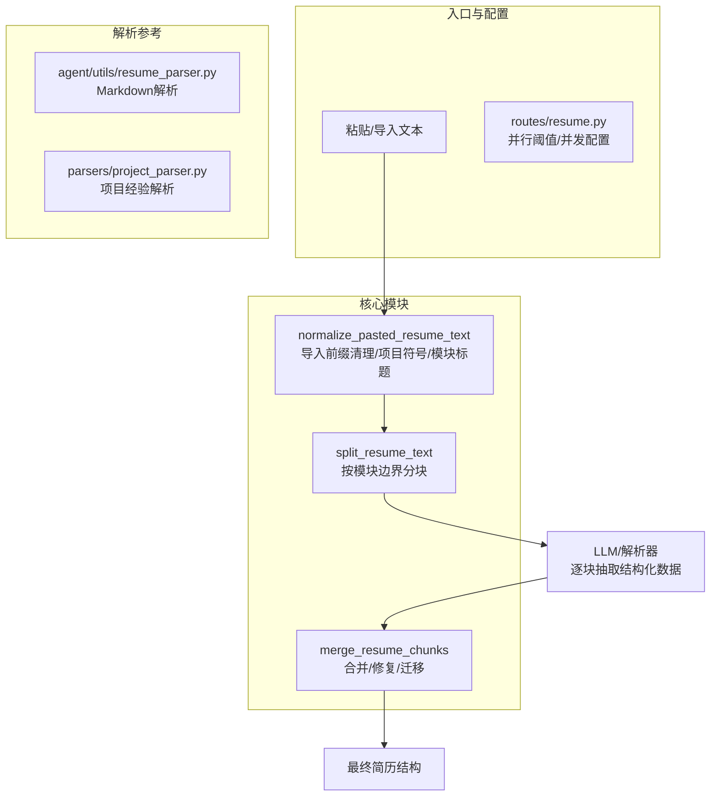
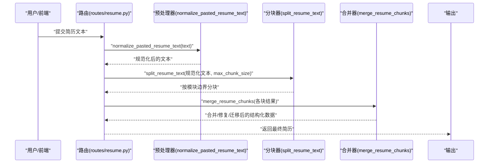
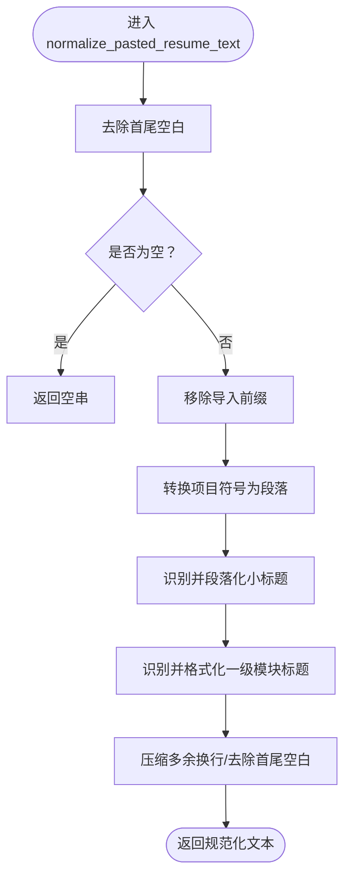
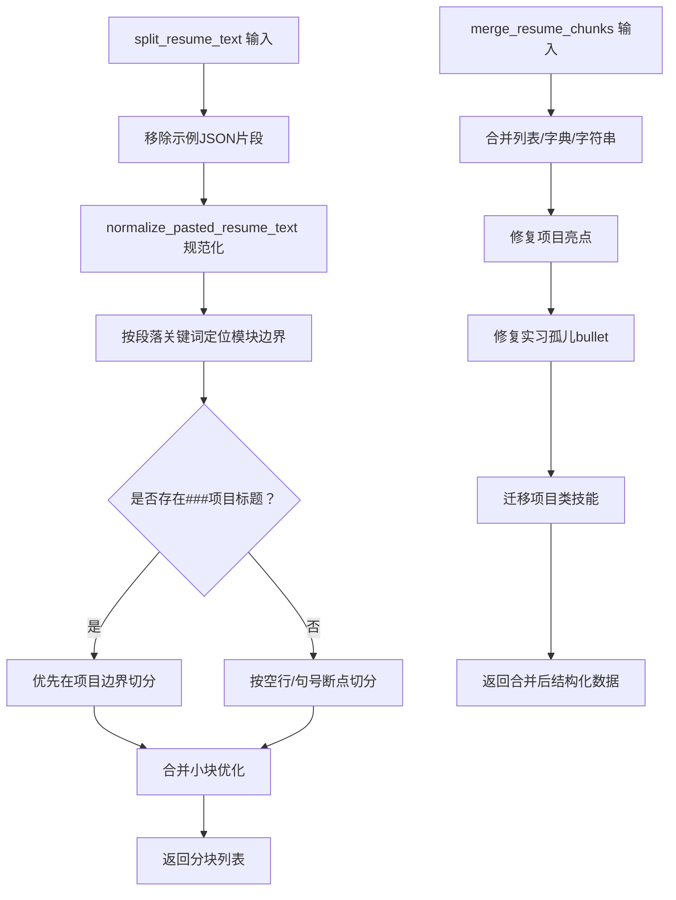
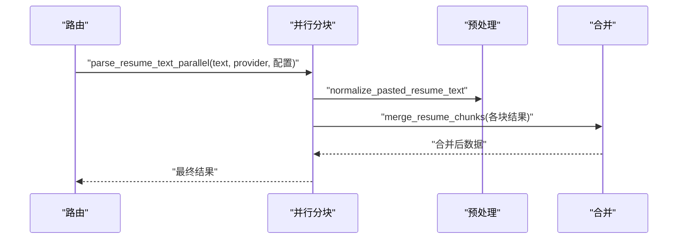
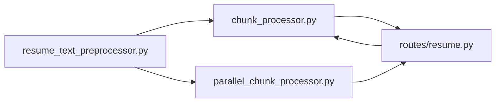

# 文本预处理

<cite>
**本文引用的文件**
- [backend/resume_text_preprocessor.py](file://backend/resume_text_preprocessor.py)
- [backend/tests/test_resume_text_preprocessor.py](file://backend/tests/test_resume_text_preprocessor.py)
- [backend/chunk_processor.py](file://backend/chunk_processor.py)
- [backend/parallel_chunk_processor.py](file://backend/parallel_chunk_processor.py)
- [backend/routes/resume.py](file://backend/routes/resume.py)
- [backend/agent/utils/resume_parser.py](file://backend/agent/utils/resume_parser.py)
- [backend/parsers/project_parser.py](file://backend/parsers/project_parser.py)
</cite>

## 目录
1. [简介](#简介)
2. [项目结构](#项目结构)
3. [核心组件](#核心组件)
4. [架构总览](#架构总览)
5. [详细组件分析](#详细组件分析)
6. [依赖关系分析](#依赖关系分析)
7. [性能考量](#性能考量)
8. [故障排查指南](#故障排查指南)
9. [结论](#结论)
10. [附录](#附录)

## 简介
本文件系统性阐述简历文本的“标准化预处理”能力，覆盖从“粘贴/导入”的扁平化文本到“结构化简历”的完整流程。重点包括：
- 导入前缀清理：自动识别并剔除“导入简历/导入CV/导入内容”等显式前缀
- 项目符号处理：将单行/空格分隔的“- 标题：描述”转换为规范段落与列表
- 模块标题识别：识别“项目背景/主要工作成果/核心职责/性能优化成果/参与核心业务实现”等小标题，并进行段落化
- 一级模块标题识别：识别“教育经历/实习经历/工作经历/项目经历/项目经验/开源经历/专业技能/技能特长/荣誉奖项/自我评价/个人总结”等模块标题，确保模块边界清晰
- 正则表达式应用：导入标识符移除、项目符号转换、标题分割规则
- 文本规范化算法：Unicode字符处理、换行符管理、空白字符清理
- 预处理规则配置与扩展：如何通过配置项与自定义规则增强鲁棒性

## 项目结构
与文本预处理直接相关的后端模块分布如下：
- 预处理核心：backend/resume_text_preprocessor.py
- 分块与合并：backend/chunk_processor.py、backend/parallel_chunk_processor.py
- 路由入口与并行控制：backend/routes/resume.py
- Markdown解析（对比参考）：backend/agent/utils/resume_parser.py
- 项目经验解析（对比参考）：backend/parsers/project_parser.py
- 单元测试：backend/tests/test_resume_text_preprocessor.py

图示来源
- [backend/resume_text_preprocessor.py:28-55](file://backend/resume_text_preprocessor.py#L28-L55)
- [backend/chunk_processor.py:32-318](file://backend/chunk_processor.py#L32-L318)
- [backend/parallel_chunk_processor.py:337-343](file://backend/parallel_chunk_processor.py#L337-L343)
- [backend/routes/resume.py:896-928](file://backend/routes/resume.py#L896-L928)

章节来源
- [backend/resume_text_preprocessor.py:1-56](file://backend/resume_text_preprocessor.py#L1-L56)
- [backend/chunk_processor.py:1-688](file://backend/chunk_processor.py#L1-L688)
- [backend/parallel_chunk_processor.py:337-343](file://backend/parallel_chunk_processor.py#L337-L343)
- [backend/routes/resume.py:896-928](file://backend/routes/resume.py#L896-L928)

## 核心组件
- 导入前缀清理
  - 使用正则 IMPORT_PREFIX_RE 移除“导入简历/导入CV/导入内容”等显式前缀，支持中英文冒号与全角半角冒号
- 项目符号处理
  - 将“ - 标题：描述”转换为“换行 - 标题：描述”，保证列表项独立成段
- 模块小标题识别
  - 对“项目背景/主要工作成果/核心职责/性能优化成果/参与核心业务实现”等小标题进行段落化处理
- 一级模块标题识别
  - 对“教育经历/实习经历/工作经历/项目经历/项目经验/开源经历/专业技能/技能特长/荣誉奖项/自我评价/个人总结”等模块标题进行识别与格式化，确保模块边界清晰
- 换行与空白清理
  - 将连续三个及以上换行压缩为两个，去除首尾空白，保证后续解析稳定性

章节来源
- [backend/resume_text_preprocessor.py:22-25](file://backend/resume_text_preprocessor.py#L22-L25)
- [backend/resume_text_preprocessor.py:37-55](file://backend/resume_text_preprocessor.py#L37-L55)

## 架构总览
下面的序列图展示了从“粘贴文本”到“结构化简历”的关键步骤与组件交互。

图示来源
- [backend/resume_text_preprocessor.py:28-55](file://backend/resume_text_preprocessor.py#L28-L55)
- [backend/chunk_processor.py:32-318](file://backend/chunk_processor.py#L32-L318)
- [backend/chunk_processor.py:321-376](file://backend/chunk_processor.py#L321-L376)
- [backend/routes/resume.py:896-928](file://backend/routes/resume.py#L896-L928)

## 详细组件分析

### 组件A：导入前缀清理与项目符号/标题规范化
- 目标
  - 清理显式导入前缀，统一项目符号与模块标题格式，为后续分块与解析打基础
- 关键点
  - 导入前缀：支持“导入简历/导入CV/导入内容”等，忽略大小写，兼容中文冒号与英文冒号
  - 项目符号：将“ - 标题：描述”转换为独立段落，便于识别列表项
  - 模块小标题：对特定短语进行段落化，提升模块内结构清晰度
  - 一级模块标题：对常见模块标题进行识别与格式化，确保模块边界
  - 换行与空白：压缩多余换行，去除首尾空白

图示来源
- [backend/resume_text_preprocessor.py:28-55](file://backend/resume_text_preprocessor.py#L28-L55)

章节来源
- [backend/resume_text_preprocessor.py:22-25](file://backend/resume_text_preprocessor.py#L22-L25)
- [backend/resume_text_preprocessor.py:37-55](file://backend/resume_text_preprocessor.py#L37-L55)

### 组件B：分块与合并（含实习/项目修复）
- 分块策略
  - 以“### 项目标题”为优先边界，确保项目完整性
  - 当存在多个项目时，优先在第二/第三个项目标题处分割，避免第一块过小
  - 若单项目过大，则在项目内部寻找空行或句号等自然断点进行切分
  - 若无项目标题，按空行或句号断点切分，必要时强制切半
  - 合并小块：相邻小于阈值的小块与前一块合并，减少分块数量
- 合并与修复
  - 合并策略：列表追加、字典合并、字符串合并、保留首个非空值
  - 实习修复：将“孤儿 bullet”合并回上一条实习，或合并到下一条实习
  - 项目亮点修复：将被误识别为项目的功能亮点合并到正确项目
  - 技能迁移：将疑似项目类技能从 skills 迁移到 projects 的 highlights

图示来源
- [backend/chunk_processor.py:32-318](file://backend/chunk_processor.py#L32-L318)
- [backend/chunk_processor.py:321-376](file://backend/chunk_processor.py#L321-L376)
- [backend/chunk_processor.py:541-630](file://backend/chunk_processor.py#L541-L630)
- [backend/chunk_processor.py:646-687](file://backend/chunk_processor.py#L646-L687)

章节来源
- [backend/chunk_processor.py:32-318](file://backend/chunk_processor.py#L32-L318)
- [backend/chunk_processor.py:321-376](file://backend/chunk_processor.py#L321-L376)
- [backend/chunk_processor.py:541-630](file://backend/chunk_processor.py#L541-L630)
- [backend/chunk_processor.py:646-687](file://backend/chunk_processor.py#L646-L687)

### 组件C：并行解析与配置
- 并行触发条件
  - 文本长度超过配置阈值时启用并行分块解析
- 关键配置
  - chunk_threshold：并行阈值
  - max_concurrent：最大并发
  - max_chunk_size：单块最大字符数
- 流程
  - 预处理 → 并行分块 → 合并 → 反思修复（可选）

图示来源
- [backend/parallel_chunk_processor.py:337-343](file://backend/parallel_chunk_processor.py#L337-L343)
- [backend/routes/resume.py:896-928](file://backend/routes/resume.py#L896-L928)

章节来源
- [backend/parallel_chunk_processor.py:337-343](file://backend/parallel_chunk_processor.py#L337-L343)
- [backend/routes/resume.py:896-928](file://backend/routes/resume.py#L896-L928)

### 组件D：对比参考（Markdown解析与项目解析）
- Markdown解析（agent/utils/resume_parser.py）
  - 通过“##/###”标题识别模块，解析基本信息、教育经历、工作/实习经历、项目经验、技能、奖项等
  - 适合结构良好、遵循Markdown规范的简历
- 项目经验解析（parsers/project_parser.py）
  - 支持“项目一/子项目甲/模块一：描述”等层级结构，适合层级化项目描述
  - 与预处理后的文本风格互补，可作为解析规则的参考

章节来源
- [backend/agent/utils/resume_parser.py:24-139](file://backend/agent/utils/resume_parser.py#L24-L139)
- [backend/parsers/project_parser.py:7-108](file://backend/parsers/project_parser.py#L7-L108)

## 依赖关系分析
- 预处理依赖
  - normalize_pasted_resume_text 依赖正则表达式进行导入前缀清理、项目符号转换与模块标题识别
- 分块与合并依赖
  - split_resume_text 依赖 normalize_pasted_resume_text 的规范化结果
  - merge_resume_chunks 依赖实习/项目修复规则与技能迁移规则
- 路由与并行
  - routes/resume.py 依据配置决定是否启用并行解析，并传入并发与分块参数

图示来源
- [backend/resume_text_preprocessor.py:28-55](file://backend/resume_text_preprocessor.py#L28-L55)
- [backend/chunk_processor.py:32-318](file://backend/chunk_processor.py#L32-L318)
- [backend/parallel_chunk_processor.py:337-343](file://backend/parallel_chunk_processor.py#L337-L343)
- [backend/routes/resume.py:896-928](file://backend/routes/resume.py#L896-L928)

章节来源
- [backend/resume_text_preprocessor.py:28-55](file://backend/resume_text_preprocessor.py#L28-L55)
- [backend/chunk_processor.py:32-318](file://backend/chunk_processor.py#L32-L318)
- [backend/parallel_chunk_processor.py:337-343](file://backend/parallel_chunk_processor.py#L337-L343)
- [backend/routes/resume.py:896-928](file://backend/routes/resume.py#L896-L928)

## 性能考量
- 正则匹配复杂度
  - 导入前缀清理与模块标题识别使用固定前缀/关键字正则，时间复杂度近似线性于文本长度
- 分块策略
  - 优先项目边界切分，避免重复解析；小块合并减少并发开销
- 并行配置
  - 通过 chunk_threshold、max_concurrent、max_chunk_size 控制吞吐与资源占用
- 建议
  - 对超长文本启用并行；合理设置 max_chunk_size，避免单块过大导致解析失败
  - 在高频场景下，可考虑缓存预处理结果（需结合业务场景评估）

## 故障排查指南
- 常见问题
  - 导入前缀未清理：确认文本是否包含“导入简历/导入CV/导入内容”等字样，以及冒号是否为中文或英文
  - 项目符号未转换：检查是否为“ - 标题：描述”格式，注意空格与冒号
  - 模块标题未识别：确认是否使用常见模块标题词汇，注意中英文混排
  - 实习孤儿bullet未合并：检查是否为“架构设计/性能调优”等孤儿标题，或缺少公司/职位/时间信息
  - 项目亮点误识别：检查是否被误识别为项目，可通过合并器规则进行修复
- 定位手段
  - 查看分块日志与优化日志，确认分块数量与大小
  - 使用单元测试样例验证预处理效果
- 相关实现参考
  - 预处理与修复规则位于预处理器与分块器中
  - 并行阈值与并发配置位于路由层

章节来源
- [backend/tests/test_resume_text_preprocessor.py:17-56](file://backend/tests/test_resume_text_preprocessor.py#L17-L56)
- [backend/chunk_processor.py:321-376](file://backend/chunk_processor.py#L321-L376)
- [backend/chunk_processor.py:541-630](file://backend/chunk_processor.py#L541-L630)
- [backend/routes/resume.py:896-928](file://backend/routes/resume.py#L896-L928)

## 结论
本方案通过“导入前缀清理 + 项目符号与标题规范化 + 模块边界识别 + 分块与合并修复”的组合，有效提升了从扁平化粘贴文本到结构化简历的解析质量与稳定性。配合并行配置与规则扩展，可在保证准确率的同时兼顾性能与可维护性。

## 附录

### 预处理规则与配置清单
- 导入前缀清理
  - 正则：支持“导入简历/导入CV/导入内容”，忽略大小写，兼容中文冒号与英文冒号
- 项目符号处理
  - 规则：将“ - 标题：描述”转换为“换行 - 标题：描述”
- 模块小标题识别
  - 关键词：项目背景、主要工作成果、核心职责、性能优化成果、参与核心业务实现
- 一级模块标题识别
  - 关键词：教育经历、实习经历、工作经历、项目经历、项目经验、开源经历、专业技能、技能特长、荣誉奖项、自我评价、个人总结
- 换行与空白
  - 规则：压缩连续三个以上换行为两个，去除首尾空白
- 并行配置
  - chunk_threshold：并行阈值
  - max_concurrent：最大并发
  - max_chunk_size：单块最大字符数

章节来源
- [backend/resume_text_preprocessor.py:8-25](file://backend/resume_text_preprocessor.py#L8-L25)
- [backend/resume_text_preprocessor.py:37-55](file://backend/resume_text_preprocessor.py#L37-L55)
- [backend/routes/resume.py:896-928](file://backend/routes/resume.py#L896-L928)