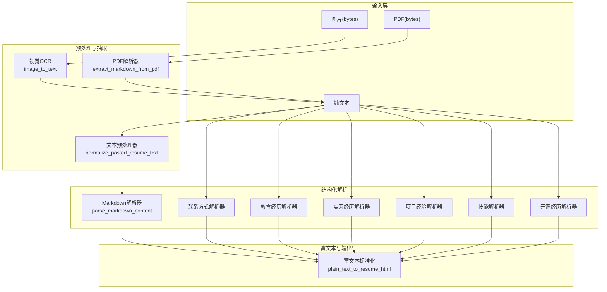
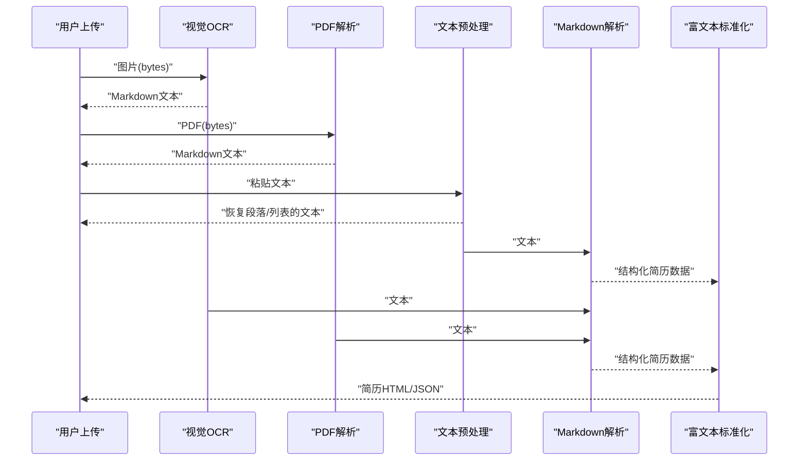
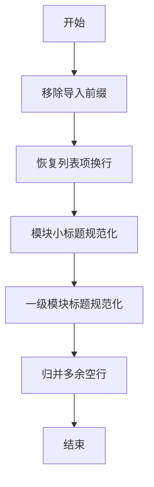
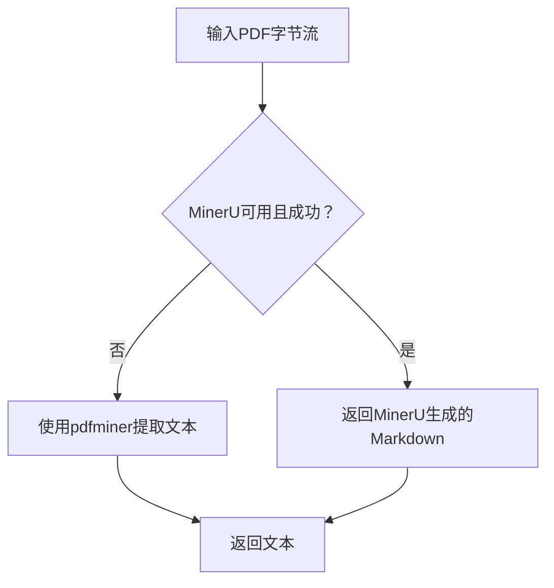
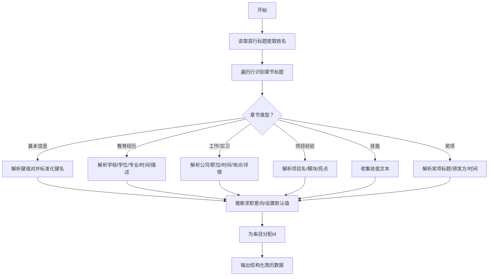
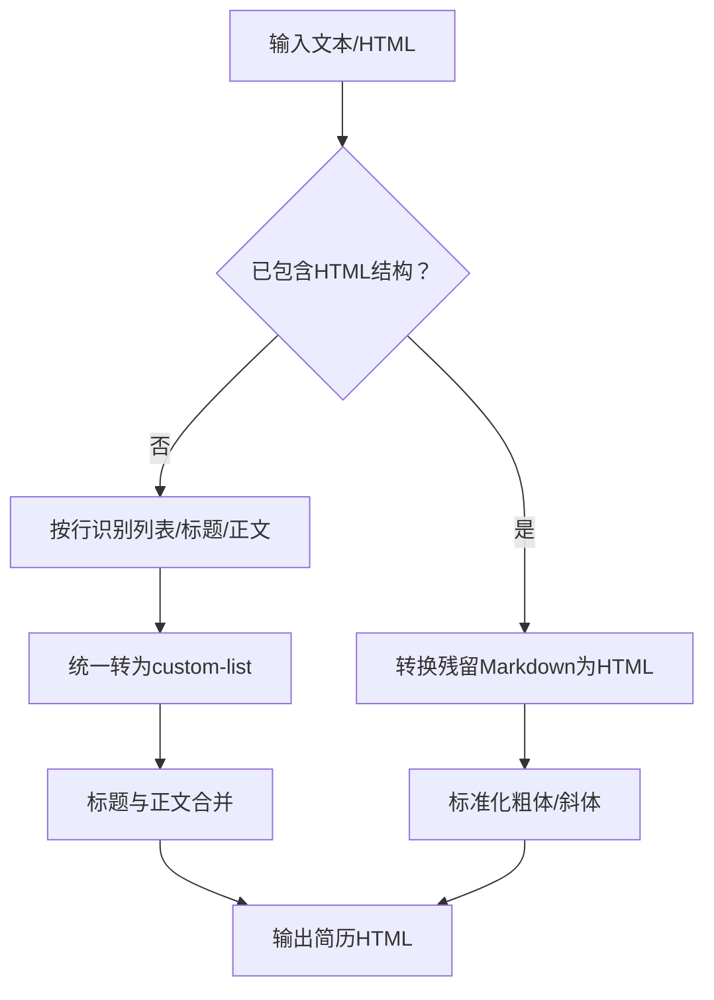
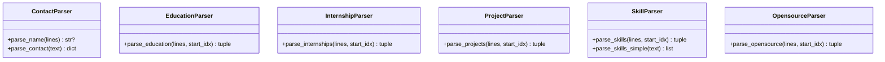
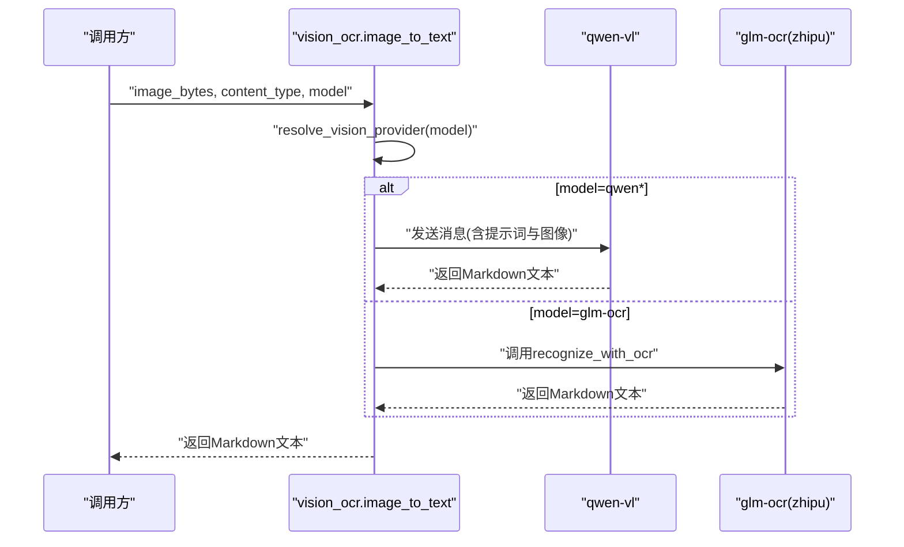
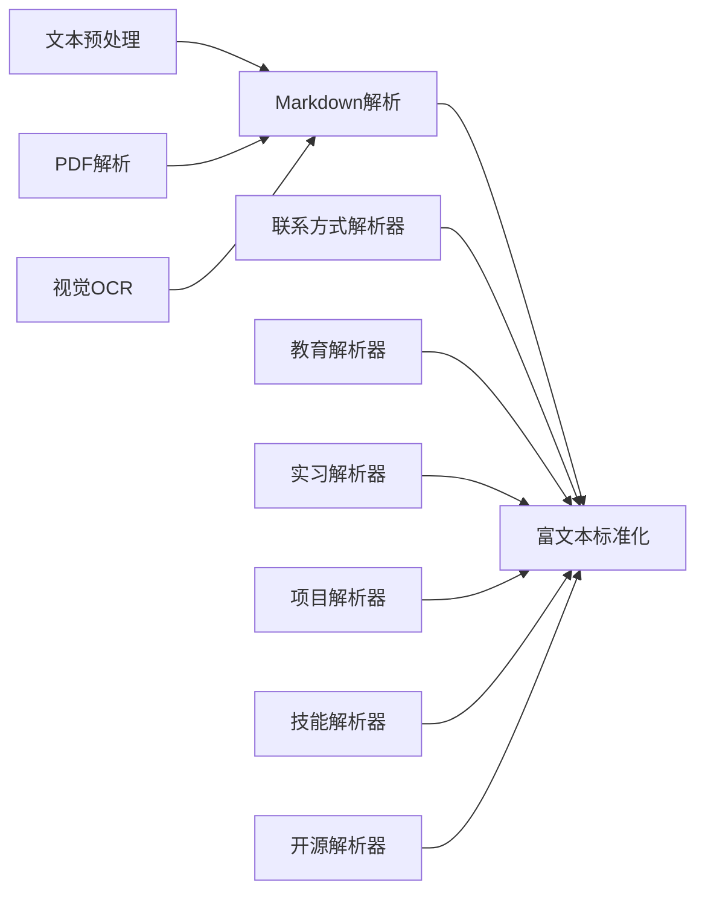

# 简历解析与处理

<cite>
**本文引用的文件**
- [resume_text_preprocessor.py](file://backend/resume_text_preprocessor.py)
- [resume_parse_rules.py](file://backend/resume_parse_rules.py)
- [pdf_parser.py](file://backend/services/pdf_parser.py)
- [resume_parser.py](file://backend/agent/utils/resume_parser.py)
- [resume_richtext.py](file://backend/agent/utils/resume_richtext.py)
- [contact_parser.py](file://backend/parsers/contact_parser.py)
- [education_parser.py](file://backend/parsers/education_parser.py)
- [internship_parser.py](file://backend/parsers/internship_parser.py)
- [project_parser.py](file://backend/parsers/project_parser.py)
- [skill_parser.py](file://backend/parsers/skill_parser.py)
- [opensource_parser.py](file://backend/parsers/opensource_parser.py)
- [vision_ocr.py](file://backend/services/vision_ocr.py)
</cite>

## 目录
1. [简介](#简介)
2. [项目结构](#项目结构)
3. [核心组件](#核心组件)
4. [架构总览](#架构总览)
5. [详细组件分析](#详细组件分析)
6. [依赖分析](#依赖分析)
7. [性能考虑](#性能考虑)
8. [故障排查指南](#故障排查指南)
9. [结论](#结论)
10. [附录](#附录)

## 简介
本文件系统性阐述简历解析与处理能力，覆盖文本预处理、OCR 图片识别、PDF 文本抽取、多格式解析（Markdown/纯文本）、富文本标准化与结构化输出。文档聚焦以下方面：
- 文本清洗与结构恢复：针对对话粘贴场景还原段落与列表结构，确保后续解析稳定。
- 正则表达式与解析算法：对联系方式、教育经历、实习/工作经历、项目经验、技能、开源经历等进行字段识别与提取。
- 结构化转换与格式统一：将解析结果映射为统一的数据模型，并在编辑侧进行富文本 HTML 规范化。
- 配置与扩展：解析规则、环境变量、可插拔的 OCR 与 PDF 解析策略。
- 多格式支持：Markdown、纯文本、图片 OCR、PDF 流水线。

## 项目结构
简历解析与处理功能分布在后端服务层与解析器模块中，形成“输入预处理 → OCR/PDF 抽取 → 结构化解析 → 富文本标准化”的流水线。

图表来源
- [resume_text_preprocessor.py:28-55](file://backend/resume_text_preprocessor.py#L28-L55)
- [vision_ocr.py:69-80](file://backend/services/vision_ocr.py#L69-L80)
- [pdf_parser.py:71-88](file://backend/services/pdf_parser.py#L71-L88)
- [resume_parser.py:9-139](file://backend/agent/utils/resume_parser.py#L9-L139)
- [contact_parser.py:7-61](file://backend/parsers/contact_parser.py#L7-L61)
- [education_parser.py:7-77](file://backend/parsers/education_parser.py#L7-L77)
- [internship_parser.py:57-94](file://backend/parsers/internship_parser.py#L57-L94)
- [project_parser.py:7-107](file://backend/parsers/project_parser.py#L7-L107)
- [skill_parser.py:7-82](file://backend/parsers/skill_parser.py#L7-L82)
- [opensource_parser.py:7-69](file://backend/parsers/opensource_parser.py#L7-L69)
- [resume_richtext.py:145-246](file://backend/agent/utils/resume_richtext.py#L145-L246)

章节来源
- [resume_text_preprocessor.py:1-56](file://backend/resume_text_preprocessor.py#L1-L56)
- [pdf_parser.py:1-89](file://backend/services/pdf_parser.py#L1-L89)
- [vision_ocr.py:1-81](file://backend/services/vision_ocr.py#L1-L81)
- [resume_parser.py:1-478](file://backend/agent/utils/resume_parser.py#L1-L478)
- [resume_richtext.py:1-258](file://backend/agent/utils/resume_richtext.py#L1-L258)
- [contact_parser.py:1-63](file://backend/parsers/contact_parser.py#L1-L63)
- [education_parser.py:1-79](file://backend/parsers/education_parser.py#L1-L79)
- [internship_parser.py:1-95](file://backend/parsers/internship_parser.py#L1-L95)
- [project_parser.py:1-109](file://backend/parsers/project_parser.py#L1-L109)
- [skill_parser.py:1-83](file://backend/parsers/skill_parser.py#L1-L83)
- [opensource_parser.py:1-71](file://backend/parsers/opensource_parser.py#L1-L71)

## 核心组件
- 文本预处理器：针对对话粘贴的单行/空格分隔文本，恢复段落与列表结构，提升后续解析稳定性。
- PDF 解析器：优先使用 MinerU（Hybrid/VLM 引擎）抽取 Markdown，失败时降级到 pdfminer。
- Markdown 解析器：从 Markdown 内容解析出标准化简历结构（基本信息、教育、经历、项目、技能、奖项）。
- 富文本标准化器：将 Markdown/纯文本转换为简历专用 HTML（无序列表 + strong），并支持反向转换。
- 多字段解析器：联系方式、教育、实习/工作、项目、技能、开源经历等专用解析器。
- 视觉 OCR：支持 qwen-vl 与 glm-ocr，将图片转为结构化 Markdown 文本。

章节来源
- [resume_text_preprocessor.py:28-55](file://backend/resume_text_preprocessor.py#L28-L55)
- [pdf_parser.py:71-88](file://backend/services/pdf_parser.py#L71-L88)
- [resume_parser.py:9-139](file://backend/agent/utils/resume_parser.py#L9-L139)
- [resume_richtext.py:145-246](file://backend/agent/utils/resume_richtext.py#L145-L246)
- [contact_parser.py:7-61](file://backend/parsers/contact_parser.py#L7-L61)
- [education_parser.py:7-77](file://backend/parsers/education_parser.py#L7-L77)
- [internship_parser.py:57-94](file://backend/parsers/internship_parser.py#L57-L94)
- [project_parser.py:7-107](file://backend/parsers/project_parser.py#L7-L107)
- [skill_parser.py:7-82](file://backend/parsers/skill_parser.py#L7-L82)
- [opensource_parser.py:7-69](file://backend/parsers/opensource_parser.py#L7-L69)
- [vision_ocr.py:69-80](file://backend/services/vision_ocr.py#L69-L80)

## 架构总览
简历解析与处理采用“输入预处理 → OCR/PDF 抽取 → 结构化解析 → 富文本标准化”的流水线，结合正则与上下文规则实现高鲁棒性的字段识别与结构化输出。

图表来源
- [vision_ocr.py:69-80](file://backend/services/vision_ocr.py#L69-L80)
- [pdf_parser.py:71-88](file://backend/services/pdf_parser.py#L71-L88)
- [resume_text_preprocessor.py:28-55](file://backend/resume_text_preprocessor.py#L28-L55)
- [resume_parser.py:9-139](file://backend/agent/utils/resume_parser.py#L9-L139)
- [resume_richtext.py:145-246](file://backend/agent/utils/resume_richtext.py#L145-L246)

## 详细组件分析

### 文本预处理与清洗
- 目标：修复对话粘贴导致的单行/空格分隔问题，恢复段落与列表结构，避免切分错误。
- 关键规则：
  - 移除导入前缀（如“导入我的简历：”）。
  - 将“- 标题”类列表项与模块标题之间插入换行，保证模块边界清晰。
  - 模块小标题（如“项目背景”等）后插入冒号并换行。
  - 一级模块标题（教育/实习/工作/项目/技能/荣誉等）前后加换行，避免跨模块混叠。
  - 归并多余空行，保持整洁。
- 复杂度：O(n) 线性扫描与多次正则替换，适合大文本快速预处理。

图表来源
- [resume_text_preprocessor.py:28-55](file://backend/resume_text_preprocessor.py#L28-L55)

章节来源
- [resume_text_preprocessor.py:28-55](file://backend/resume_text_preprocessor.py#L28-L55)

### PDF 文本抽取与降级策略
- 优先策略：尝试 MinerU（Hybrid/VLM 引擎）抽取 Markdown。
- 降级策略：MinerU 失败或不可用时，使用 pdfminer 抽取文本。
- 环境变量：
  - MINERU_BACKEND：选择 hybrid-auto-engine 或 vlm 等后端。
  - MINERU_PARSE_METHOD：解析模式（如 auto）。
  - MINERU_LANG：语言（如 ch）。
- 输出：统一返回 Markdown 文本，便于后续结构化解析。

图表来源
- [pdf_parser.py:71-88](file://backend/services/pdf_parser.py#L71-L88)

章节来源
- [pdf_parser.py:1-89](file://backend/services/pdf_parser.py#L1-L89)

### Markdown 结构化解析
- 输入：Markdown 内容（含标题、列表、粗体等）。
- 输出：标准化简历数据结构（基本信息、教育、经历、项目、技能、奖项等）。
- 关键流程：
  - 从首行标题提取姓名。
  - 识别二级/三级标题，进入对应解析分支。
  - 基本信息：解析“键: 值”或“**键**: 值”形式，标准化键名（电话/邮箱/年龄/求职意向/现居地/姓名等）。
  - 教育经历：支持“### 学校 | 学位 | 专业”与“**学校** | 学位 | 专业”两种模式，时间优先匹配，去重同校同层次记录。
  - 实习/工作经历：支持“公司 | 职位”或“公司 - 职位”，提取时间与地点，合并职责为详情。
  - 项目经验：支持“### 项目名（时间）”与“模块：描述”，自动聚合亮点。
  - 技能：整体作为 skillContent 输出，交由富文本标准化器处理。
  - 奖项：支持列表与纯文本行，统一为标题/颁发方/时间。
  - 自动推断求职意向：若未显式给出，从内容推断或设置默认值。
  - 为各条目分配稳定 id，便于前端展示与编辑。

图表来源
- [resume_parser.py:9-139](file://backend/agent/utils/resume_parser.py#L9-L139)

章节来源
- [resume_parser.py:9-139](file://backend/agent/utils/resume_parser.py#L9-L139)

### 富文本标准化与格式统一
- 目标：将 Markdown/纯文本转换为简历专用 HTML（无序列表 custom-list，禁用有序列表），并对粗体/斜体进行安全转换。
- 关键能力：
  - 列表项识别：支持数字编号与无序符号，统一转为 custom-list。
  - 标题与正文合并：标题与正文在同一 li 中用冒号连接，保持前端一致性。
  - 行内样式：将“**粗体**”转换为<strong>，保留斜体标记。
  - 内联编号/符号展开：将“1. 2. 3.”与“· 子项”拆分为多行，避免合并为单个 li。
  - HTML → 文本：将 HTML 富文本转换为多行纯文本，保留列表结构，供混合解析注入。
- 路径判定：通过字段后缀集合判断是否需要富文本处理（如 details/description/skillContent/highlights 等）。

图表来源
- [resume_richtext.py:145-246](file://backend/agent/utils/resume_richtext.py#L145-L246)

章节来源
- [resume_richtext.py:1-258](file://backend/agent/utils/resume_richtext.py#L1-L258)

### 多字段解析器
- 联系方式与姓名解析器：从文本中提取姓名与电话/邮箱/求职方向，过滤疑似联系方式的关键词行。
- 教育经历解析器：支持多种时间与标题组合，提取荣誉信息并清理括号。
- 实习经历解析器：支持多种分隔符与时间格式，提取公司/职位/时间。
- 项目经验解析器：支持层级结构（项目/子项目/模块/描述），自动聚合亮点。
- 技能解析器：支持分类格式与简单列表格式，过滤非技能类内容。
- 开源经历解析器：支持“社区贡献”标题与子项描述，提取副标题与项目名。

图表来源
- [contact_parser.py:7-61](file://backend/parsers/contact_parser.py#L7-L61)
- [education_parser.py:7-77](file://backend/parsers/education_parser.py#L7-L77)
- [internship_parser.py:57-94](file://backend/parsers/internship_parser.py#L57-L94)
- [project_parser.py:7-107](file://backend/parsers/project_parser.py#L7-L107)
- [skill_parser.py:7-82](file://backend/parsers/skill_parser.py#L7-L82)
- [opensource_parser.py:7-69](file://backend/parsers/opensource_parser.py#L7-L69)

章节来源
- [contact_parser.py:1-63](file://backend/parsers/contact_parser.py#L1-L63)
- [education_parser.py:1-79](file://backend/parsers/education_parser.py#L1-L79)
- [internship_parser.py:1-95](file://backend/parsers/internship_parser.py#L1-L95)
- [project_parser.py:1-109](file://backend/parsers/project_parser.py#L1-L109)
- [skill_parser.py:1-83](file://backend/parsers/skill_parser.py#L1-L83)
- [opensource_parser.py:1-71](file://backend/parsers/opensource_parser.py#L1-L71)

### 视觉 OCR 与多模型支持
- 支持模型：
  - qwen-vl（DashScope，兼容 OpenAI 兼容接口）。
  - glm-ocr（智谱 layout_parsing，复用 zhipu_layout.recognize_with_ocr）。
- 环境变量：
  - DASHSCOPE_API_KEY：DashScope 授权。
  - DEEPSEEK_BASE_URL：DashScope 兼容 API 基础地址。
- 输入：图片字节流与 Content-Type。
- 输出：结构化 Markdown 文本，严格保持层级与忠实原文。

图表来源
- [vision_ocr.py:30-80](file://backend/services/vision_ocr.py#L30-L80)

章节来源
- [vision_ocr.py:1-81](file://backend/services/vision_ocr.py#L1-L81)

### 解析规则与配置
- LLM 解析额外规则：对“实习经历”“项目经历”“专业技能”等字段的提取约束与格式要求进行强化，确保结构化输出符合预期。
- 环境变量：
  - MINERU_BACKEND/MINERU_PARSE_METHOD/MINERU_LANG：MinerU 解析参数。
  - DASHSCOPE_API_KEY/DEEPSEEK_BASE_URL：DashScope OCR 参数。
- 字段后缀白名单：富文本路径判定依据字段后缀集合，仅对富文本字段执行富文本转换。

章节来源
- [resume_parse_rules.py:1-15](file://backend/resume_parse_rules.py#L1-L15)
- [pdf_parser.py:27-51](file://backend/services/pdf_parser.py#L27-L51)
- [vision_ocr.py:14-17](file://backend/services/vision_ocr.py#L14-L17)
- [resume_richtext.py:8-17](file://backend/agent/utils/resume_richtext.py#L8-L17)

## 依赖分析
- 组件耦合：
  - 文本预处理与结构化解析解耦，预处理仅负责恢复结构，不改变语义。
  - PDF/OCR 抽取与解析器解耦，二者均输出 Markdown 文本，便于统一处理。
  - 富文本标准化器对字段路径敏感，避免对非富文本字段进行富文本转换。
- 外部依赖：
  - MinerU：提供高质量 PDF/图片解析能力，失败时可降级。
  - DashScope：提供 qwen-vl OCR 能力。
  - pdfminer：轻量级 PDF 文本抽取工具。
- 循环依赖：未发现循环依赖，模块间通过函数调用与返回值交互。

图表来源
- [resume_text_preprocessor.py:28-55](file://backend/resume_text_preprocessor.py#L28-L55)
- [pdf_parser.py:71-88](file://backend/services/pdf_parser.py#L71-L88)
- [vision_ocr.py:69-80](file://backend/services/vision_ocr.py#L69-L80)
- [resume_parser.py:9-139](file://backend/agent/utils/resume_parser.py#L9-L139)
- [resume_richtext.py:145-246](file://backend/agent/utils/resume_richtext.py#L145-L246)
- [contact_parser.py:7-61](file://backend/parsers/contact_parser.py#L7-L61)
- [education_parser.py:7-77](file://backend/parsers/education_parser.py#L7-L77)
- [internship_parser.py:57-94](file://backend/parsers/internship_parser.py#L57-L94)
- [project_parser.py:7-107](file://backend/parsers/project_parser.py#L7-L107)
- [skill_parser.py:7-82](file://backend/parsers/skill_parser.py#L7-L82)
- [opensource_parser.py:7-69](file://backend/parsers/opensource_parser.py#L7-L69)

## 性能考虑
- 正则匹配：所有解析器均使用正则表达式进行模式匹配，建议在大规模文本上避免过于复杂的回溯，当前实现已尽量简化分支。
- 线性扫描：Markdown 解析器与富文本标准化器均为 O(n) 扫描，适合大文本处理。
- I/O 优化：MinerU 与 pdfminer 均为内存流处理，减少磁盘 IO；OCR 请求超时设置合理，避免阻塞。
- 去重策略：教育经历去重基于“学校+学历层次”，避免重复条目影响展示与评分。
- 建议：
  - 对超长文本可先进行分段处理再调用解析器。
  - 在高并发场景下，合理配置 MinerU 与 OCR 的并发上限与超时阈值。

## 故障排查指南
- MinerU 未生成 Markdown：
  - 现象：MinerU 成功但未生成 Markdown 文件。
  - 处理：检查 MINERU_BACKEND/MINERU_PARSE_METHOD/MINERU_LANG 环境变量，确认输出目录存在目标 Markdown 文件。
- DashScope API Key 未配置：
  - 现象：调用 qwen-vl OCR 抛出授权异常。
  - 处理：设置 DASHSCOPE_API_KEY，并确认 DEEPSEEK_BASE_URL 可访问。
- OCR 返回为空或乱码：
  - 现象：图片质量差或模型不支持。
  - 处理：更换模型（如 glm-ocr），或提高图片分辨率与对比度。
- 结构化解析错分模块：
  - 现象：模块标题未正确识别导致跨模块混叠。
  - 处理：使用文本预处理恢复段落与列表结构；确保模块标题使用中文冒号与换行。
- 富文本渲染异常：
  - 现象：HTML 标签未正确闭合或样式不生效。
  - 处理：确认输入为富文本路径（字段后缀在白名单内）；必要时使用 HTML → 文本转换进行调试。

章节来源
- [pdf_parser.py:27-67](file://backend/services/pdf_parser.py#L27-L67)
- [vision_ocr.py:41-66](file://backend/services/vision_ocr.py#L41-L66)
- [resume_text_preprocessor.py:28-55](file://backend/resume_text_preprocessor.py#L28-L55)
- [resume_richtext.py:145-246](file://backend/agent/utils/resume_richtext.py#L145-L246)

## 结论
本系统通过“文本预处理 + OCR/PDF 抽取 + 结构化解析 + 富文本标准化”的完整链路，实现了对多格式简历输入的稳健解析与统一输出。正则规则与上下文识别相结合，确保字段提取的准确性；富文本标准化保障了前端渲染的一致性；环境变量与解析规则提供了灵活的配置与扩展空间。建议在生产环境中结合缓存、限流与监控，持续优化解析质量与响应性能。

## 附录
- 字段后缀白名单（富文本路径判定）：details、description、skillContent、selfEvaluation、summary、highlights、content。
- 常用环境变量：
  - MINERU_BACKEND、MINERU_PARSE_METHOD、MINERU_LANG（MinerU）
  - DASHSCOPE_API_KEY、DEEPSEEK_BASE_URL（DashScope）
- 支持的图片 MIME 类型：image/jpeg、image/png。