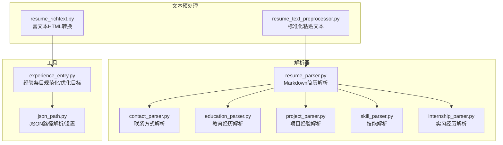
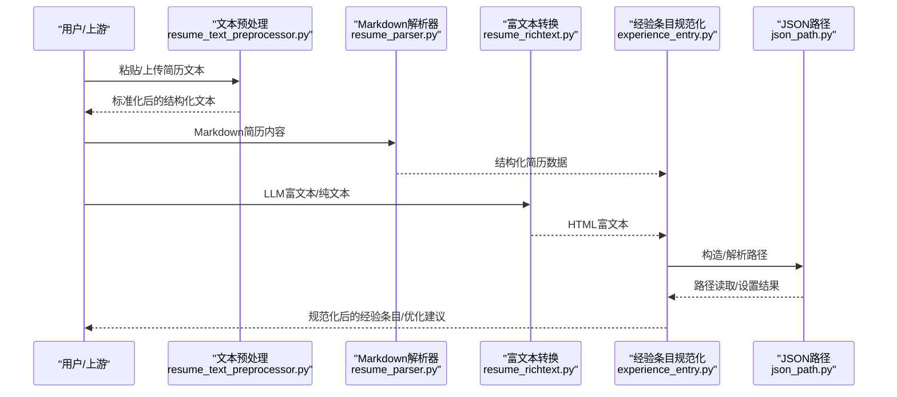
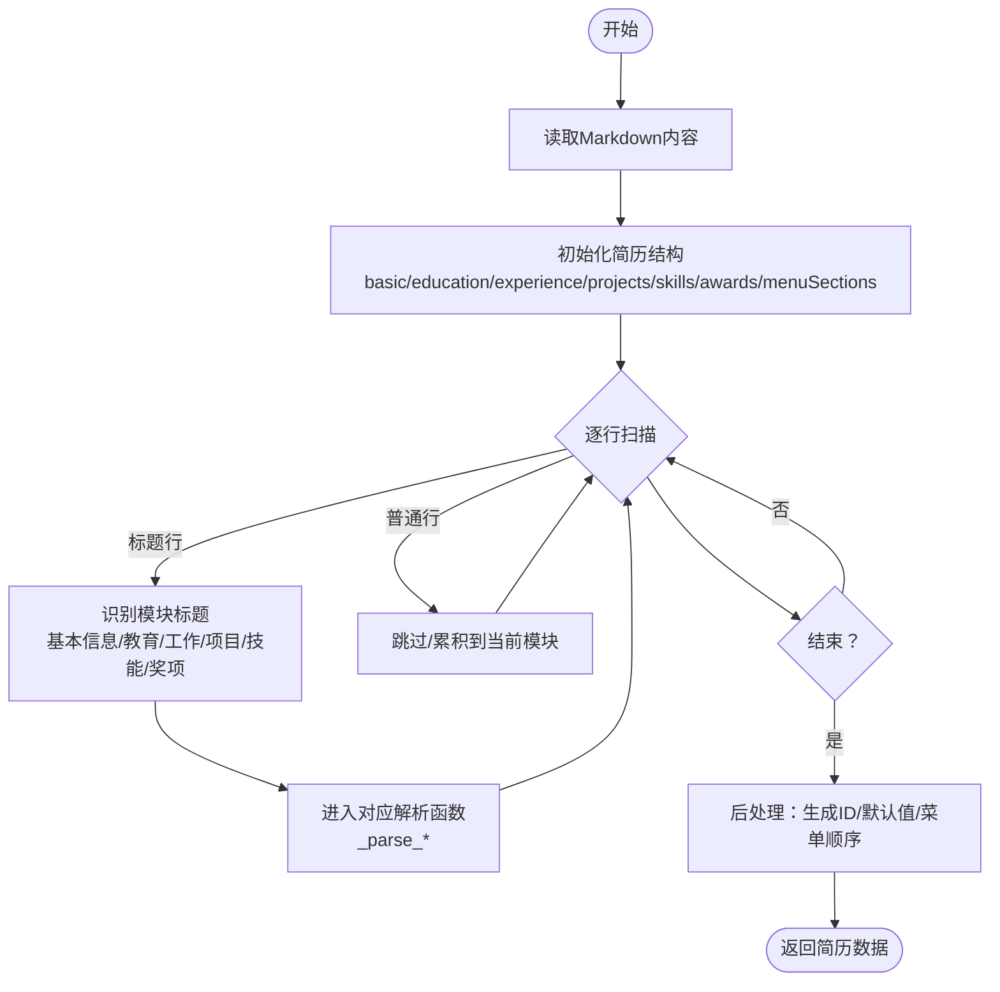
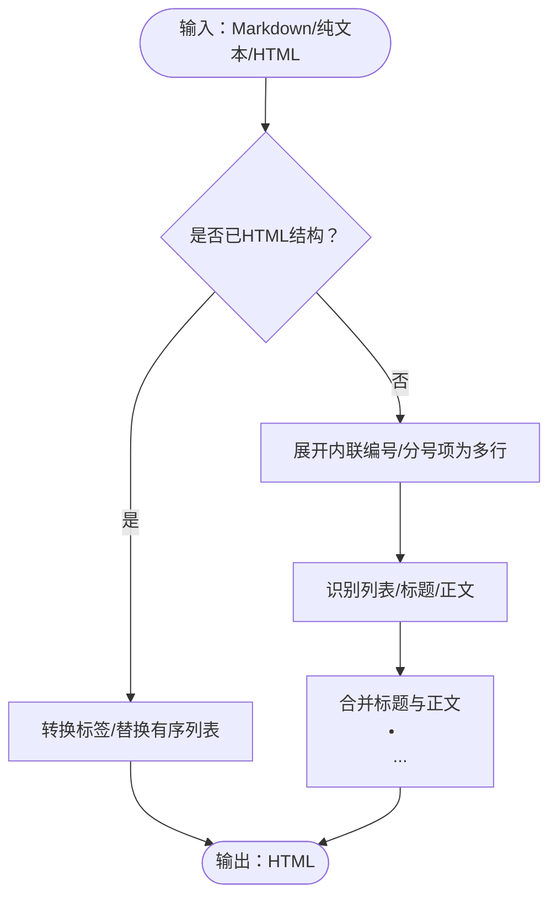
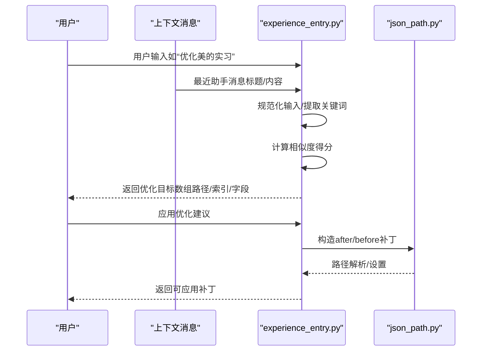
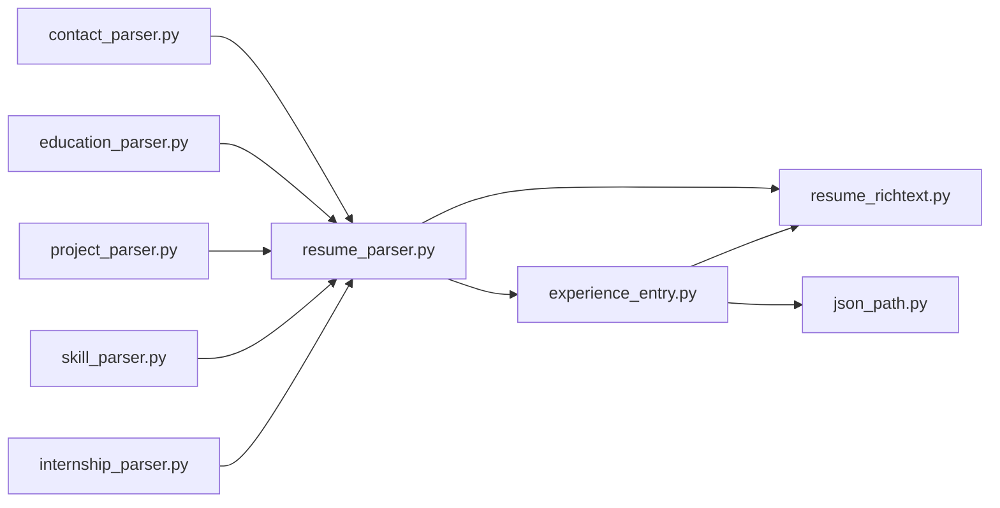

# 解析工具函数

<cite>
**本文引用的文件**
- [backend/agent/utils/resume_parser.py](file://backend/agent/utils/resume_parser.py)
- [backend/agent/utils/resume_richtext.py](file://backend/agent/utils/resume_richtext.py)
- [backend/agent/utils/experience_entry.py](file://backend/agent/utils/experience_entry.py)
- [backend/agent/utils/json_path.py](file://backend/agent/utils/json_path.py)
- [backend/resume_text_preprocessor.py](file://backend/resume_text_preprocessor.py)
- [backend/parsers/contact_parser.py](file://backend/parsers/contact_parser.py)
- [backend/parsers/education_parser.py](file://backend/parsers/education_parser.py)
- [backend/parsers/project_parser.py](file://backend/parsers/project_parser.py)
- [backend/parsers/skill_parser.py](file://backend/parsers/skill_parser.py)
- [backend/parsers/internship_parser.py](file://backend/parsers/internship_parser.py)
</cite>

## 目录
1. [简介](#简介)
2. [项目结构](#项目结构)
3. [核心组件](#核心组件)
4. [架构总览](#架构总览)
5. [详细组件分析](#详细组件分析)
6. [依赖分析](#依赖分析)
7. [性能考虑](#性能考虑)
8. [故障排查指南](#故障排查指南)
9. [结论](#结论)
10. [附录](#附录)

## 简介
本文件聚焦于简历解析过程中的辅助工具函数，系统性梳理文本预处理、字段提取、日期解析与联系方式识别，并深入解释解析器的核心算法（上下文分析、实体识别与关系建立）。同时提供工具函数的使用示例、参数配置与返回值格式说明，以及解析质量评估、错误恢复机制与性能优化策略。

## 项目结构
围绕“解析工具函数”的相关模块分布于以下目录：
- 文本预处理与富文本转换：backend/resume_text_preprocessor.py、backend/agent/utils/resume_richtext.py
- Markdown简历解析器：backend/agent/utils/resume_parser.py
- 经验条目规范化与优化目标解析：backend/agent/utils/experience_entry.py
- JSON路径工具：backend/agent/utils/json_path.py
- 领域解析器（联系方式、教育、项目、技能、实习）：backend/parsers/*.py

图表来源
- [backend/resume_text_preprocessor.py:1-56](file://backend/resume_text_preprocessor.py#L1-L56)
- [backend/agent/utils/resume_richtext.py:1-258](file://backend/agent/utils/resume_richtext.py#L1-L258)
- [backend/agent/utils/resume_parser.py:1-478](file://backend/agent/utils/resume_parser.py#L1-L478)
- [backend/agent/utils/experience_entry.py:1-682](file://backend/agent/utils/experience_entry.py#L1-L682)
- [backend/agent/utils/json_path.py:1-261](file://backend/agent/utils/json_path.py#L1-L261)
- [backend/parsers/contact_parser.py:1-63](file://backend/parsers/contact_parser.py#L1-L63)
- [backend/parsers/education_parser.py:1-79](file://backend/parsers/education_parser.py#L1-L79)
- [backend/parsers/project_parser.py:1-109](file://backend/parsers/project_parser.py#L1-L109)
- [backend/parsers/skill_parser.py:1-83](file://backend/parsers/skill_parser.py#L1-L83)
- [backend/parsers/internship_parser.py:1-95](file://backend/parsers/internship_parser.py#L1-L95)

章节来源
- [backend/resume_text_preprocessor.py:1-56](file://backend/resume_text_preprocessor.py#L1-L56)
- [backend/agent/utils/resume_richtext.py:1-258](file://backend/agent/utils/resume_richtext.py#L1-L258)
- [backend/agent/utils/resume_parser.py:1-478](file://backend/agent/utils/resume_parser.py#L1-L478)
- [backend/agent/utils/experience_entry.py:1-682](file://backend/agent/utils/experience_entry.py#L1-L682)
- [backend/agent/utils/json_path.py:1-261](file://backend/agent/utils/json_path.py#L1-L261)
- [backend/parsers/contact_parser.py:1-63](file://backend/parsers/contact_parser.py#L1-L63)
- [backend/parsers/education_parser.py:1-79](file://backend/parsers/education_parser.py#L1-L79)
- [backend/parsers/project_parser.py:1-109](file://backend/parsers/project_parser.py#L1-L109)
- [backend/parsers/skill_parser.py:1-83](file://backend/parsers/skill_parser.py#L1-L83)
- [backend/parsers/internship_parser.py:1-95](file://backend/parsers/internship_parser.py#L1-L95)

## 核心组件
- 文本预处理：将“导入”前缀、单行/空格分隔的粘贴文本还原为带段落与项目符号的结构，确保后续解析按模块分块。
- Markdown解析器：从Markdown简历中抽取基本信息、教育、工作/实习、项目、技能、奖项等结构化数据。
- 富文本转换：将LLM输出的Markdown/纯文本转换为简历富文本HTML，保持列表与加粗结构。
- 领域解析器：分别处理联系方式、教育、项目、技能、实习等领域的字段提取与日期解析。
- 经验条目规范化：统一经验/实习条目的字段，支持优化目标识别与补丁构造。
- JSON路径工具：支持 a.b[0].c 形式的路径解析、读取、设置、删除。

章节来源
- [backend/resume_text_preprocessor.py:28-55](file://backend/resume_text_preprocessor.py#L28-L55)
- [backend/agent/utils/resume_parser.py:9-139](file://backend/agent/utils/resume_parser.py#L9-L139)
- [backend/agent/utils/resume_richtext.py:145-246](file://backend/agent/utils/resume_richtext.py#L145-L246)
- [backend/agent/utils/experience_entry.py:482-548](file://backend/agent/utils/experience_entry.py#L482-L548)
- [backend/agent/utils/json_path.py:10-179](file://backend/agent/utils/json_path.py#L10-L179)

## 架构总览
解析流程自上而下分为三层：
- 输入层：原始文本（含Markdown/富文本/粘贴文本）、LLM输出文本
- 工具层：文本预处理、富文本转换、JSON路径、经验条目规范化
- 解析层：领域解析器（联系方式/教育/项目/技能/实习）与Markdown解析器

图表来源
- [backend/resume_text_preprocessor.py:28-55](file://backend/resume_text_preprocessor.py#L28-L55)
- [backend/agent/utils/resume_parser.py:9-139](file://backend/agent/utils/resume_parser.py#L9-L139)
- [backend/agent/utils/resume_richtext.py:145-246](file://backend/agent/utils/resume_richtext.py#L145-L246)
- [backend/agent/utils/experience_entry.py:482-548](file://backend/agent/utils/experience_entry.py#L482-L548)
- [backend/agent/utils/json_path.py:10-179](file://backend/agent/utils/json_path.py#L10-L179)

## 详细组件分析

### 文本预处理（normalize_pasted_resume_text）
- 功能：去除“导入”前缀，恢复段落与项目符号，将长行拆分为模块标题与子标题，统一换行。
- 关键正则：导入前缀匹配、项目符号与模块标题识别、一级模块标题插入空行。
- 返回：标准化后的文本字符串。

章节来源
- [backend/resume_text_preprocessor.py:28-55](file://backend/resume_text_preprocessor.py#L28-L55)

### Markdown简历解析器（parse_markdown_content）
- 功能：从Markdown内容中抽取结构化简历数据，包括基本信息、教育、工作/实习、项目、技能、奖项。
- 核心算法：
  - 上下文分析：逐行扫描，依据标题层级与关键字判断当前段落所属模块。
  - 实体识别：通过正则匹配姓名、电话、邮箱、年龄、求职意向、学历、专业、公司、职位、项目名称、技能类别等。
  - 关系建立：为教育/工作/项目/奖项生成唯一ID，构建菜单模块顺序。
- 返回：结构化简历字典。

图表来源
- [backend/agent/utils/resume_parser.py:24-139](file://backend/agent/utils/resume_parser.py#L24-L139)

章节来源
- [backend/agent/utils/resume_parser.py:9-139](file://backend/agent/utils/resume_parser.py#L9-L139)

### 富文本转换（plain_text_to_resume_html / html_to_context_text / normalize_editor_value）
- 功能：将Markdown/纯文本转换为简历HTML（无序列表、加粗），或将HTML富文本转换为多行纯文本，便于上下文注入。
- 关键逻辑：
  - 行识别：有序/无序列表、标题行、正文续行。
  - 标记清理：去除内联编号与项目符号，保留强标记。
  - 结构化输出：统一使用自定义无序列表容器。
- 返回：HTML字符串或纯文本字符串。

图表来源
- [backend/agent/utils/resume_richtext.py:145-246](file://backend/agent/utils/resume_richtext.py#L145-L246)
- [backend/agent/utils/resume_richtext.py:112-142](file://backend/agent/utils/resume_richtext.py#L112-L142)
- [backend/agent/utils/resume_richtext.py:249-258](file://backend/agent/utils/resume_richtext.py#L249-L258)

章节来源
- [backend/agent/utils/resume_richtext.py:145-246](file://backend/agent/utils/resume_richtext.py#L145-L246)
- [backend/agent/utils/resume_richtext.py:112-142](file://backend/agent/utils/resume_richtext.py#L112-L142)
- [backend/agent/utils/resume_richtext.py:249-258](file://backend/agent/utils/resume_richtext.py#L249-L258)

### 经验条目规范化与优化目标（normalize_experience_add_entry / resolve_optimize_target）
- 功能：将用户输入或LLM输出的经验条目规范化为前端所需字段（id、company、position、date、details、visible），并解析优化目标（体验/开源经历）。
- 核心算法：
  - 上下文分析：结合用户输入与最近助手消息，定位最可能的优化条目。
  - 实体识别：从条目标题/简称/职位中提取关键词，计算相似度得分。
  - 关系建立：构造补丁（resume_patch）以便前端Diff展示与应用。
- 返回：规范化条目或优化目标。

图表来源
- [backend/agent/utils/experience_entry.py:333-387](file://backend/agent/utils/experience_entry.py#L333-L387)
- [backend/agent/utils/experience_entry.py:482-548](file://backend/agent/utils/experience_entry.py#L482-L548)
- [backend/agent/utils/json_path.py:10-179](file://backend/agent/utils/json_path.py#L10-L179)

章节来源
- [backend/agent/utils/experience_entry.py:333-387](file://backend/agent/utils/experience_entry.py#L333-L387)
- [backend/agent/utils/experience_entry.py:482-548](file://backend/agent/utils/experience_entry.py#L482-L548)
- [backend/agent/utils/json_path.py:10-179](file://backend/agent/utils/json_path.py#L10-L179)

### JSON路径工具（parse_path / get_by_path / set_by_path / delete_by_path）
- 功能：解析与操作 a.b[0].c 风格的JSON路径，支持读取、设置、删除、存在性检查与默认值获取。
- 复杂度：解析O(n)，访问/设置O(h)（h为路径深度）。
- 返回：路径片段列表、被访问/设置/删除的值或布尔存在性。

章节来源
- [backend/agent/utils/json_path.py:10-261](file://backend/agent/utils/json_path.py#L10-L261)

### 领域解析器

#### 联系方式解析（parse_name / parse_contact）
- 功能：从文本中提取姓名与联系方式（电话、邮箱、求职方向）。
- 关键点：排除疑似关键词行与联系方式行，支持多种电话/邮箱格式。

章节来源
- [backend/parsers/contact_parser.py:7-61](file://backend/parsers/contact_parser.py#L7-L61)

#### 教育经历解析（parse_education）
- 功能：解析教育经历，支持多种时间格式与学校/专业/学位组合。
- 关键点：识别荣誉/奖项行，提取括号内时间，分割学校、专业、学位。

章节来源
- [backend/parsers/education_parser.py:7-77](file://backend/parsers/education_parser.py#L7-L77)

#### 项目经验解析（parse_projects）
- 功能：解析项目经验，支持项目/子项目/模块描述的层级结构。
- 关键点：识别项目/子项目标题，提取模块描述与项目亮点。

章节来源
- [backend/parsers/project_parser.py:7-107](file://backend/parsers/project_parser.py#L7-L107)

#### 技能解析（parse_skills / parse_skills_simple）
- 功能：解析技能分类与简单技能列表。
- 关键点：过滤非技能类行（如仓库链接），支持多种分隔符。

章节来源
- [backend/parsers/skill_parser.py:7-82](file://backend/parsers/skill_parser.py#L7-L82)

#### 实习经历解析（parse_internships / _parse_single_internship）
- 功能：解析实习经历，支持多种标题与职位格式，提取时间范围。
- 关键点：识别括号内时间，清理多余符号，分割标题与副标题。

章节来源
- [backend/parsers/internship_parser.py:57-94](file://backend/parsers/internship_parser.py#L57-L94)

## 依赖分析
- 组件耦合：
  - resume_parser.py 依赖 resume_richtext.py（富文本转换）与 experience_entry.py（经验条目规范化）。
  - experience_entry.py 依赖 json_path.py（路径操作）与 resume_richtext.py（富文本转换）。
  - 各领域解析器相互独立，但可与 resume_parser.py 协同工作。
- 外部依赖：正则表达式库（re），typing模块。

图表来源
- [backend/agent/utils/resume_parser.py:1-478](file://backend/agent/utils/resume_parser.py#L1-L478)
- [backend/agent/utils/resume_richtext.py:1-258](file://backend/agent/utils/resume_richtext.py#L1-L258)
- [backend/agent/utils/experience_entry.py:1-682](file://backend/agent/utils/experience_entry.py#L1-L682)
- [backend/agent/utils/json_path.py:1-261](file://backend/agent/utils/json_path.py#L1-L261)
- [backend/parsers/contact_parser.py:1-63](file://backend/parsers/contact_parser.py#L1-L63)
- [backend/parsers/education_parser.py:1-79](file://backend/parsers/education_parser.py#L1-L79)
- [backend/parsers/project_parser.py:1-109](file://backend/parsers/project_parser.py#L1-L109)
- [backend/parsers/skill_parser.py:1-83](file://backend/parsers/skill_parser.py#L1-L83)
- [backend/parsers/internship_parser.py:1-95](file://backend/parsers/internship_parser.py#L1-L95)

## 性能考虑
- 正则匹配：在大量文本中进行多次正则匹配，建议：
  - 缓存常用正则对象（如导入前缀、模块标题、时间模式）。
  - 使用编译后的正则减少重复编译开销。
- 列表/字典遍历：在解析循环中尽量避免深层嵌套，必要时提前终止（遇到结束关键词）。
- 富文本转换：批量处理时先展开再归并，减少重复字符串拼接。
- JSON路径：set_by_path会自动扩展数组，建议在已知索引时直接设置，避免频繁扩容。

## 故障排查指南
- 解析结果为空或字段缺失：
  - 检查输入是否为标准Markdown结构，必要时先执行文本预处理。
  - 确认模块标题关键字是否符合预期（如“教育经历/工作经历/项目经历”）。
- 富文本渲染异常：
  - 确认输入是否包含HTML标签或Markdown强调标记，使用富文本转换函数进行规范化。
- 经验条目不匹配：
  - 检查用户输入是否包含公司简称或职位关键词，必要时提供更明确的上下文。
  - 使用优化目标解析函数确认定位的条目索引与字段路径。
- JSON路径错误：
  - 使用 exists_path/get_or_default 检查路径是否存在与默认值。
  - set_by_path 前确保父对象类型正确（dict/list）。

章节来源
- [backend/resume_text_preprocessor.py:28-55](file://backend/resume_text_preprocessor.py#L28-L55)
- [backend/agent/utils/resume_richtext.py:145-246](file://backend/agent/utils/resume_richtext.py#L145-L246)
- [backend/agent/utils/experience_entry.py:333-387](file://backend/agent/utils/experience_entry.py#L333-L387)
- [backend/agent/utils/json_path.py:219-261](file://backend/agent/utils/json_path.py#L219-L261)

## 结论
该解析工具体系通过“文本预处理 + Markdown解析 + 富文本转换 + 领域解析 + 经验条目规范化 + JSON路径工具”的分层设计，实现了对简历文本的稳健解析与高质量输出。建议在生产环境中结合缓存与批量处理策略，持续优化正则匹配与路径操作性能，并通过上下文增强与评分机制提升解析准确性与用户体验。

## 附录

### 工具函数使用示例与参数说明

- 文本预处理
  - 函数：normalize_pasted_resume_text(text: str) -> str
  - 参数：text（待处理的粘贴文本）
  - 返回：标准化后的文本
  - 示例路径：[backend/resume_text_preprocessor.py:28-55](file://backend/resume_text_preprocessor.py#L28-L55)

- Markdown解析
  - 函数：parse_markdown_content(content: str) -> Dict
  - 参数：content（Markdown简历文本）
  - 返回：结构化简历数据字典
  - 示例路径：[backend/agent/utils/resume_parser.py:24-139](file://backend/agent/utils/resume_parser.py#L24-L139)

- 富文本转换
  - 函数：plain_text_to_resume_html(text: str) -> str
  - 参数：text（Markdown/纯文本）
  - 返回：HTML富文本
  - 示例路径：[backend/agent/utils/resume_richtext.py:145-246](file://backend/agent/utils/resume_richtext.py#L145-L246)

- 经验条目规范化
  - 函数：normalize_experience_add_entry(value: Any, array_path: str = "experience", index_hint: int = 0) -> Dict
  - 参数：value（待规范化条目）、数组路径、索引提示
  - 返回：规范化后的条目
  - 示例路径：[backend/agent/utils/experience_entry.py:482-548](file://backend/agent/utils/experience_entry.py#L482-L548)

- JSON路径操作
  - 函数：parse_path(path: str) -> List[Union[str, int]]
  - 函数：get_by_path(obj, path) -> Tuple[Any, Union[str, int], Any]
  - 函数：set_by_path(obj, path, value) -> Union[Dict, List]
  - 函数：delete_by_path(obj, path) -> Any
  - 示例路径：[backend/agent/utils/json_path.py:10-179](file://backend/agent/utils/json_path.py#L10-L179)

- 领域解析器
  - 联系方式：parse_name(lines: List[str]) -> Optional[str]、parse_contact(text: str) -> Dict[str, str]
    - 示例路径：[backend/parsers/contact_parser.py:7-61](file://backend/parsers/contact_parser.py#L7-L61)
  - 教育经历：parse_education(lines: List[str], start_idx: int) -> Tuple[List[Dict[str, Any]], int]
    - 示例路径：[backend/parsers/education_parser.py:7-77](file://backend/parsers/education_parser.py#L7-L77)
  - 项目经验：parse_projects(lines: List[str], start_idx: int) -> Tuple[List[Dict[str, Any]], int]
    - 示例路径：[backend/parsers/project_parser.py:7-107](file://backend/parsers/project_parser.py#L7-L107)
  - 技能：parse_skills(lines: List[str], start_idx: int) -> Tuple[List[Union[str, Dict[str, str]]], int]、parse_skills_simple(text: str) -> List[str]
    - 示例路径：[backend/parsers/skill_parser.py:7-82](file://backend/parsers/skill_parser.py#L7-L82)
  - 实习经历：parse_internships(lines: List[str], start_idx: int) -> Tuple[List[Dict[str, Any]], int]
    - 示例路径：[backend/parsers/internship_parser.py:57-94](file://backend/parsers/internship_parser.py#L57-L94)