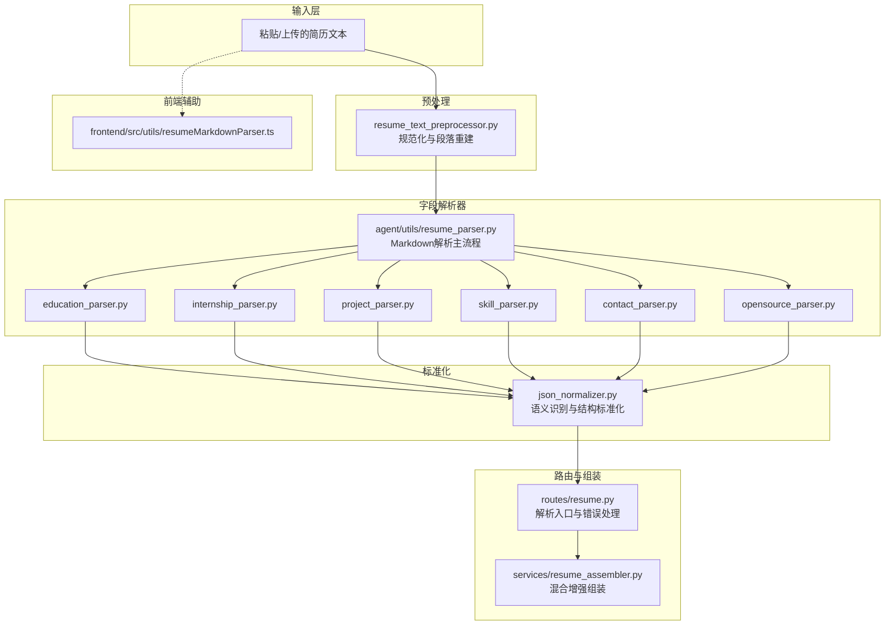
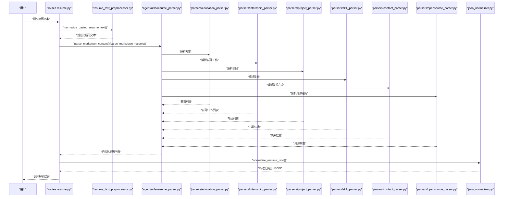
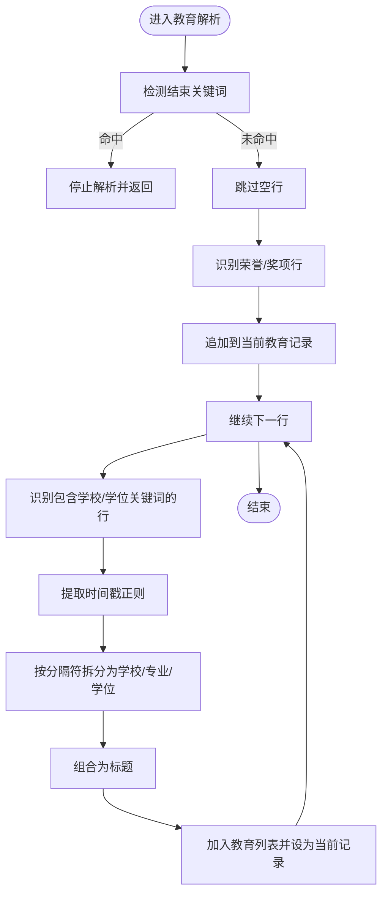
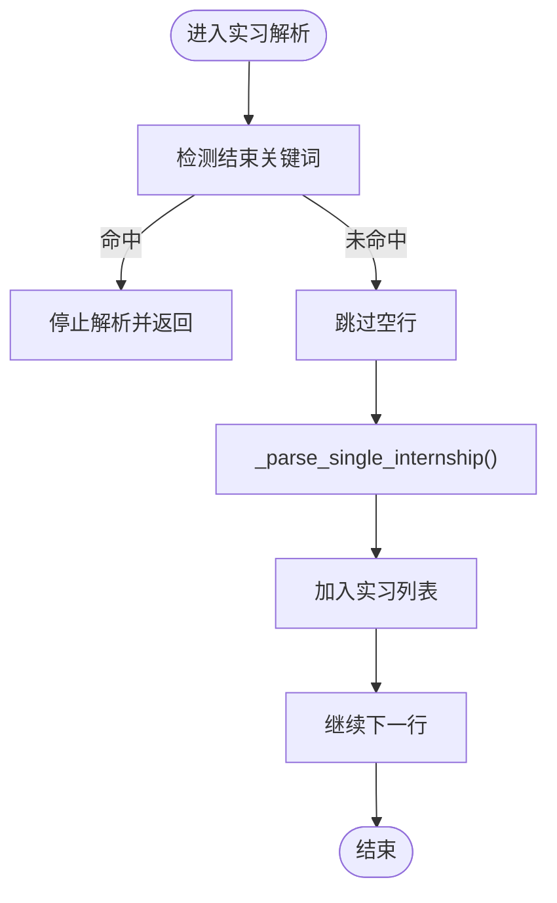
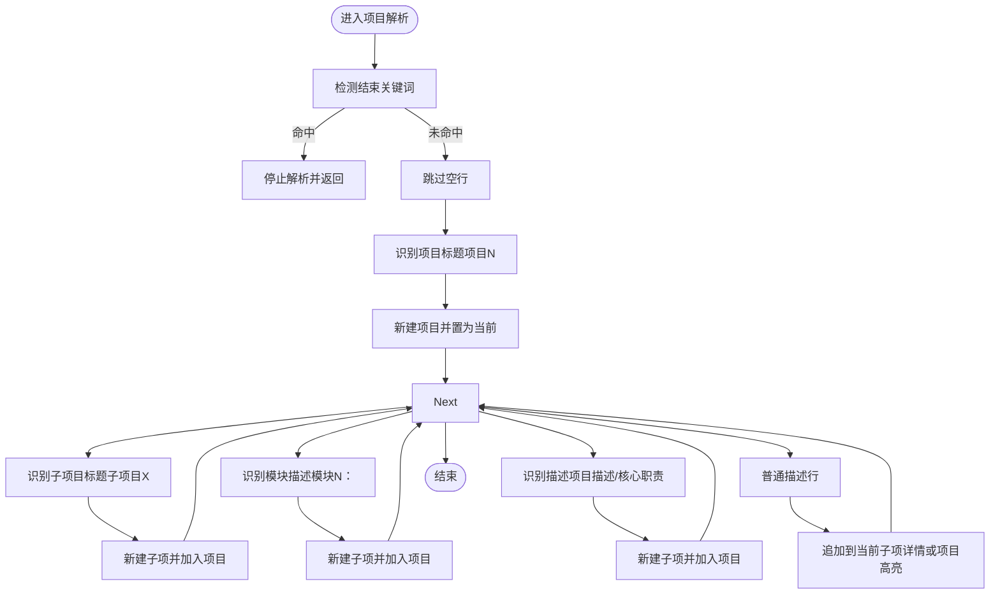
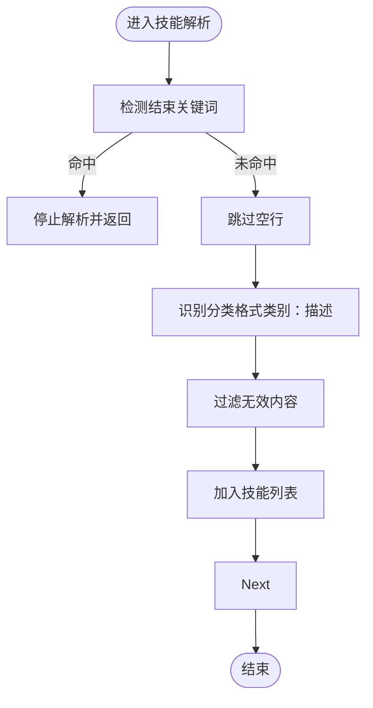
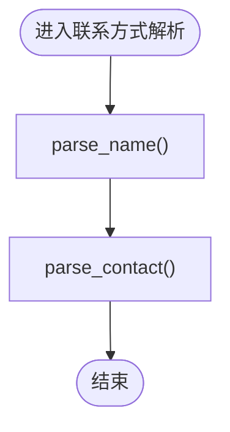
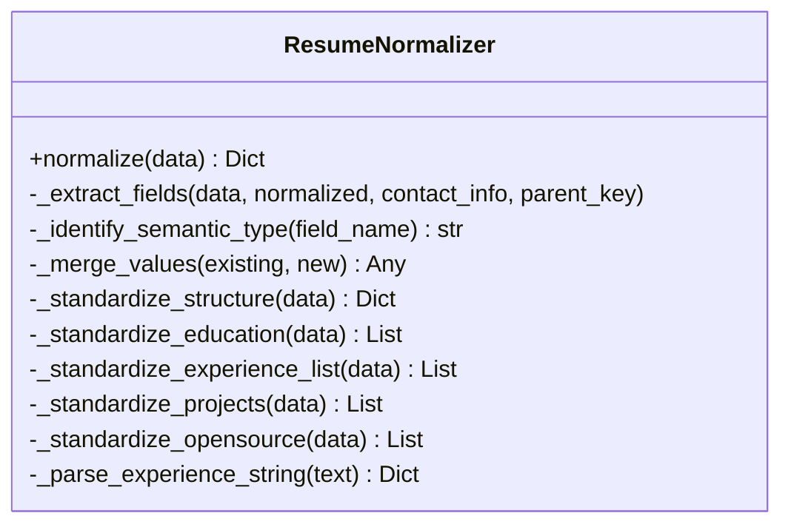
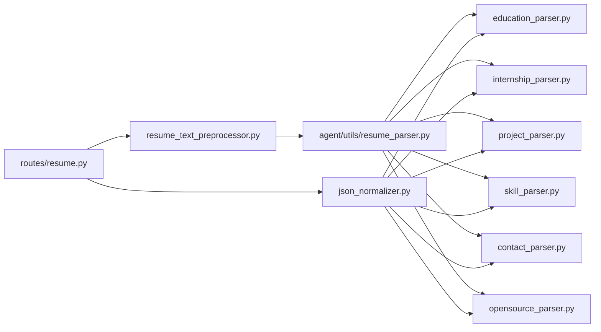

# 解析规则

<cite>
**本文引用的文件**
- [backend/resume_parse_rules.py](file://backend/resume_parse_rules.py)
- [backend/agent/utils/resume_parser.py](file://backend/agent/utils/resume_parser.py)
- [backend/parsers/education_parser.py](file://backend/parsers/education_parser.py)
- [backend/parsers/project_parser.py](file://backend/parsers/project_parser.py)
- [backend/parsers/skill_parser.py](file://backend/parsers/skill_parser.py)
- [backend/parsers/internship_parser.py](file://backend/parsers/internship_parser.py)
- [backend/parsers/contact_parser.py](file://backend/parsers/contact_parser.py)
- [backend/parsers/opensource_parser.py](file://backend/parsers/opensource_parser.py)
- [backend/resume_text_preprocessor.py](file://backend/resume_text_preprocessor.py)
- [backend/json_normalizer.py](file://backend/json_normalizer.py)
- [backend/routes/resume.py](file://backend/routes/resume.py)
- [backend/services/resume_assembler.py](file://backend/services/resume_assembler.py)
- [frontend/src/utils/resumeMarkdownParser.ts](file://frontend/src/utils/resumeMarkdownParser.ts)
</cite>

## 目录
1. [引言](#引言)
2. [项目结构](#项目结构)
3. [核心组件](#核心组件)
4. [架构总览](#架构总览)
5. [详细组件分析](#详细组件分析)
6. [依赖关系分析](#依赖关系分析)
7. [性能考量](#性能考量)
8. [故障排查指南](#故障排查指南)
9. [结论](#结论)
10. [附录](#附录)

## 引言
本文件系统性梳理“解析规则系统”的设计与实现，覆盖简历字段识别与提取规则，重点包括教育背景、工作/实习经历、项目经验、技能特长等模块的解析逻辑；解释正则表达式模式的设计原理、字段边界检测算法与数据结构识别机制；给出规则配置方式、优先级设置与自定义规则添加方法；并涵盖多语言支持、字段合并策略与解析错误处理机制。

## 项目结构
解析规则系统由“文本预处理”“字段解析器”“结构标准化”“路由与组装”等模块协同完成，前端提供 Markdown 结构识别辅助。

**图表来源**
- [backend/resume_text_preprocessor.py:1-56](file://backend/resume_text_preprocessor.py#L1-L56)
- [backend/agent/utils/resume_parser.py:1-478](file://backend/agent/utils/resume_parser.py#L1-L478)
- [backend/parsers/education_parser.py:1-79](file://backend/parsers/education_parser.py#L1-L79)
- [backend/parsers/internship_parser.py:1-95](file://backend/parsers/internship_parser.py#L1-L95)
- [backend/parsers/project_parser.py:1-109](file://backend/parsers/project_parser.py#L1-L109)
- [backend/parsers/skill_parser.py:1-83](file://backend/parsers/skill_parser.py#L1-L83)
- [backend/parsers/contact_parser.py:1-63](file://backend/parsers/contact_parser.py#L1-L63)
- [backend/parsers/opensource_parser.py:1-71](file://backend/parsers/opensource_parser.py#L1-L71)
- [backend/json_normalizer.py:1-536](file://backend/json_normalizer.py#L1-L536)
- [backend/routes/resume.py:968-1193](file://backend/routes/resume.py#L968-L1193)
- [backend/services/resume_assembler.py:259-294](file://backend/services/resume_assembler.py#L259-L294)
- [frontend/src/utils/resumeMarkdownParser.ts:175-220](file://frontend/src/utils/resumeMarkdownParser.ts#L175-L220)

**章节来源**
- [backend/resume_text_preprocessor.py:1-56](file://backend/resume_text_preprocessor.py#L1-L56)
- [backend/agent/utils/resume_parser.py:1-478](file://backend/agent/utils/resume_parser.py#L1-L478)
- [backend/json_normalizer.py:1-536](file://backend/json_normalizer.py#L1-L536)
- [backend/routes/resume.py:968-1193](file://backend/routes/resume.py#L968-L1193)
- [backend/services/resume_assembler.py:259-294](file://backend/services/resume_assembler.py#L259-L294)
- [frontend/src/utils/resumeMarkdownParser.ts:175-220](file://frontend/src/utils/resumeMarkdownParser.ts#L175-L220)

## 核心组件
- 文本预处理：将粘贴文本还原为带段落与 bullet 的结构，确保后续解析按模块分块。
- 字段解析器：针对教育、实习/工作、项目、技能、联系方式、开源经历等进行结构化解析。
- Markdown 主解析器：按章节标题驱动，调用各字段解析器，生成统一结构。
- JSON 标准化器：对任意结构的 JSON 进行语义识别与结构标准化，保证输出字段一致。
- 路由与组装：解析入口、错误处理、数据源优先级与混合增强组装。

**章节来源**
- [backend/resume_text_preprocessor.py:28-56](file://backend/resume_text_preprocessor.py#L28-L56)
- [backend/agent/utils/resume_parser.py:9-139](file://backend/agent/utils/resume_parser.py#L9-L139)
- [backend/json_normalizer.py:66-95](file://backend/json_normalizer.py#L66-L95)
- [backend/routes/resume.py:968-1193](file://backend/routes/resume.py#L968-L1193)
- [backend/services/resume_assembler.py:280-294](file://backend/services/resume_assembler.py#L280-L294)

## 架构总览
解析流程从“文本预处理”开始，进入“字段解析器”，随后由“Markdown 主解析器”整合，再通过“JSON 标准化器”统一结构，最终由“路由与组装”输出。

**图表来源**
- [backend/routes/resume.py:968-1193](file://backend/routes/resume.py#L968-L1193)
- [backend/resume_text_preprocessor.py:28-56](file://backend/resume_text_preprocessor.py#L28-L56)
- [backend/agent/utils/resume_parser.py:24-139](file://backend/agent/utils/resume_parser.py#L24-L139)
- [backend/parsers/education_parser.py:7-77](file://backend/parsers/education_parser.py#L7-L77)
- [backend/parsers/internship_parser.py:57-93](file://backend/parsers/internship_parser.py#L57-L93)
- [backend/parsers/project_parser.py:7-107](file://backend/parsers/project_parser.py#L7-L107)
- [backend/parsers/skill_parser.py:7-58](file://backend/parsers/skill_parser.py#L7-L58)
- [backend/parsers/contact_parser.py:23-61](file://backend/parsers/contact_parser.py#L23-L61)
- [backend/parsers/opensource_parser.py:7-69](file://backend/parsers/opensource_parser.py#L7-L69)
- [backend/json_normalizer.py:66-95](file://backend/json_normalizer.py#L66-L95)

## 详细组件分析

### 教育背景解析
- 边界检测：以“项目/工作/实习/技能/开源”等关键词作为结束边界，避免跨模块误判；支持“荣誉/奖项”特殊延续。
- 正则模式：时间戳识别采用多种格式（含年/月/日、横线/波浪/至、中文“至”等），并清理括号；学校/专业/学位使用分隔符拆分并组合为标题。
- 数据结构：输出包含时间、标题（学校-专业-学位组合）、荣誉等字段。

**图表来源**
- [backend/parsers/education_parser.py:7-77](file://backend/parsers/education_parser.py#L7-L77)

**章节来源**
- [backend/parsers/education_parser.py:7-77](file://backend/parsers/education_parser.py#L7-L77)

### 实习/工作经历解析
- 单条解析：支持“公司 - 职位（时间）”“公司 职位 时间”等格式，优先提取括号内时间，再清理多余符号，最后按多种分隔符拆分标题与副标题。
- 多条解析：以结束关键词为边界，逐行调用单条解析函数，合并为列表。
- 输出结构：包含公司/职位/时间/地点/工作内容等字段。

**图表来源**
- [backend/parsers/internship_parser.py:57-93](file://backend/parsers/internship_parser.py#L57-L93)
- [backend/parsers/internship_parser.py:7-54](file://backend/parsers/internship_parser.py#L7-L54)

**章节来源**
- [backend/parsers/internship_parser.py:57-93](file://backend/parsers/internship_parser.py#L57-L93)
- [backend/agent/utils/resume_parser.py:327-381](file://backend/agent/utils/resume_parser.py#L327-L381)

### 项目经验解析
- 层级结构：支持“项目一”“子项目甲”“模块一：描述”“项目描述：”等层级，自动归档到 items 或直接高亮。
- 边界检测：以“开源/技能/教育/荣誉/奖项”等关键词为结束边界。
- 输出结构：包含标题、子项（标题/详情）、高亮等。

**图表来源**
- [backend/parsers/project_parser.py:7-107](file://backend/parsers/project_parser.py#L7-L107)

**章节来源**
- [backend/parsers/project_parser.py:7-107](file://backend/parsers/project_parser.py#L7-L107)

### 技能特长解析
- 分类格式：支持“类别： 描述”，过滤掉类似仓库链接或不似技能的内容。
- 列表格式：支持“技能：Java, Go, Python”等，按多种分隔符拆分。
- 输出结构：字符串列表或分类对象列表。

**图表来源**
- [backend/parsers/skill_parser.py:7-58](file://backend/parsers/skill_parser.py#L7-L58)

**章节来源**
- [backend/parsers/skill_parser.py:7-58](file://backend/parsers/skill_parser.py#L7-L58)

### 联系方式与姓名解析
- 姓名：首个非关键词且非联系方式的非空行作为候选。
- 联系方式：支持电话、邮箱、求职方向等，使用多组正则匹配。

**图表来源**
- [backend/parsers/contact_parser.py:7-61](file://backend/parsers/contact_parser.py#L7-L61)

**章节来源**
- [backend/parsers/contact_parser.py:7-61](file://backend/parsers/contact_parser.py#L7-L61)

### 开源经历解析
- 标题识别：支持“社区贡献N”等标题，括号内作为副标题。
- 边界检测：以“技能/教育/荣誉/奖项/项目/工作”等关键词为结束边界。
- 输出结构：包含标题、副标题、贡献项列表等。

**章节来源**
- [backend/parsers/opensource_parser.py:7-69](file://backend/parsers/opensource_parser.py#L7-L69)

### Markdown 主解析器
- 章节驱动：依据“##/###”标题识别模块，调用对应解析器。
- 基本信息：解析“**键**: 值”或“键: 值”格式，标准化键名。
- 默认值与菜单：为缺失字段填充默认值，生成前端显示菜单。

**章节来源**
- [backend/agent/utils/resume_parser.py:24-139](file://backend/agent/utils/resume_parser.py#L24-L139)
- [backend/agent/utils/resume_parser.py:142-188](file://backend/agent/utils/resume_parser.py#L142-L188)
- [backend/agent/utils/resume_parser.py:210-324](file://backend/agent/utils/resume_parser.py#L210-L324)
- [backend/agent/utils/resume_parser.py:327-381](file://backend/agent/utils/resume_parser.py#L327-L381)
- [backend/agent/utils/resume_parser.py:384-432](file://backend/agent/utils/resume_parser.py#L384-L432)
- [backend/agent/utils/resume_parser.py:435-453](file://backend/agent/utils/resume_parser.py#L435-L453)
- [backend/agent/utils/resume_parser.py:456-477](file://backend/agent/utils/resume_parser.py#L456-L477)

### 文本预处理与规则补充
- 预处理：将粘贴文本还原为带段落与 bullet 的结构，修复模块标题与小标题位置。
- 规则补充：提供额外的解析规则说明，强调实习/项目/技能的边界与格式要求。

**章节来源**
- [backend/resume_text_preprocessor.py:28-56](file://backend/resume_text_preprocessor.py#L28-L56)
- [backend/resume_parse_rules.py:3-14](file://backend/resume_parse_rules.py#L3-L14)

### JSON 标准化器
- 语义识别：通过正则映射表识别字段语义（姓名、电话、邮箱、求职意向、教育、实习、项目、技能、工作、开源、荣誉等）。
- 合并策略：对同名字段进行列表拼接、字典合并或字符串拼接；类型冲突时保留新值。
- 结构标准化：对教育、实习/工作、项目、开源等字段进行统一结构，确保模板兼容。

**图表来源**
- [backend/json_normalizer.py:15-536](file://backend/json_normalizer.py#L15-L536)

**章节来源**
- [backend/json_normalizer.py:66-95](file://backend/json_normalizer.py#L66-L95)
- [backend/json_normalizer.py:191-207](file://backend/json_normalizer.py#L191-L207)
- [backend/json_normalizer.py:237-291](file://backend/json_normalizer.py#L237-L291)
- [backend/json_normalizer.py:352-410](file://backend/json_normalizer.py#L352-L410)
- [backend/json_normalizer.py:412-434](file://backend/json_normalizer.py#L412-L434)
- [backend/json_normalizer.py:436-474](file://backend/json_normalizer.py#L436-L474)
- [backend/json_normalizer.py:476-516](file://backend/json_normalizer.py#L476-L516)

### 路由与组装
- 并行与串行：长文本启用并行分块解析，短文本回退串行；失败时进行 JSON 标准化回退。
- 错误处理：捕获 LLM 调用异常并返回友好提示；翻译失败时按部分成功策略返回。
- 数据源优先级：OCR 文本（含结构信息）> MinerU Markdown > 分区文本。

**章节来源**
- [backend/routes/resume.py:968-1193](file://backend/routes/resume.py#L968-L1193)
- [backend/routes/resume.py:795-804](file://backend/routes/resume.py#L795-L804)
- [backend/services/resume_assembler.py:259-294](file://backend/services/resume_assembler.py#L259-L294)

### 前端辅助
- Markdown 结构识别：对“### 标题”“时间标签”“正文行”进行解析，辅助后端理解结构。

**章节来源**
- [frontend/src/utils/resumeMarkdownParser.ts:175-220](file://frontend/src/utils/resumeMarkdownParser.ts#L175-L220)

## 依赖关系分析
- 组件耦合：路由依赖预处理与标准化；主解析器依赖各字段解析器；标准化器依赖字段映射表。
- 外部依赖：正则表达式库、JSON 解析、并发信号量、线程池等。
- 循环依赖：未发现循环导入；模块间通过函数调用解耦。

**图表来源**
- [backend/routes/resume.py:968-1193](file://backend/routes/resume.py#L968-L1193)
- [backend/resume_text_preprocessor.py:28-56](file://backend/resume_text_preprocessor.py#L28-L56)
- [backend/agent/utils/resume_parser.py:24-139](file://backend/agent/utils/resume_parser.py#L24-L139)
- [backend/json_normalizer.py:66-95](file://backend/json_normalizer.py#L66-L95)

**章节来源**
- [backend/routes/resume.py:968-1193](file://backend/routes/resume.py#L968-L1193)
- [backend/agent/utils/resume_parser.py:24-139](file://backend/agent/utils/resume_parser.py#L24-L139)
- [backend/json_normalizer.py:66-95](file://backend/json_normalizer.py#L66-L95)

## 性能考量
- 正则复杂度：时间/日期识别采用多模式匹配，建议在规则稳定前提前编译正则以减少重复开销。
- 并发控制：路由层使用信号量限制并发字段翻译，避免单次响应过大。
- 数据流优化：预处理阶段一次性修复段落与标题，降低后续解析分支判断成本。
- 标准化代价：语义识别与结构标准化为 O(n) 遍历，注意大字段的内存占用。

## 故障排查指南
- 解析结果为空或字段缺失
  - 检查预处理是否正确识别模块标题与 bullet。
  - 确认字段边界关键词是否被误用或遗漏。
- 实习/项目被拆分过多
  - 遵循规则补充中的“实习/项目/技能”边界要求，避免将职责拆成独立记录。
- 技能被错误识别为项目/实习技术细节
  - 仅保留编程语言、框架、工具等技能列表，避免混入项目/实习细节。
- LLM 调用失败
  - 查看路由层异常捕获与错误返回；必要时回退串行解析。
- JSON 标准化失败
  - 标准化器会回退到原始数据，检查字段键名与结构是否符合预期。

**章节来源**
- [backend/resume_parse_rules.py:3-14](file://backend/resume_parse_rules.py#L3-L14)
- [backend/routes/resume.py:795-804](file://backend/routes/resume.py#L795-L804)
- [backend/routes/resume.py:1181-1183](file://backend/routes/resume.py#L1181-L1183)

## 结论
解析规则系统通过“文本预处理 + 字段解析器 + Markdown 主解析 + JSON 标准化 + 路由与组装”的分层设计，实现了对简历多模块的稳健解析。正则模式与边界检测保障了字段识别的准确性，语义映射与合并策略提升了跨结构兼容性，而多语言与错误处理机制增强了可用性与鲁棒性。建议在实际部署中结合业务场景持续优化正则与边界关键词，以进一步提升解析质量。

## 附录

### 配置与优先级
- 规则配置
  - 预处理：模块标题与小标题的正则替换规则集中于预处理器。
  - 字段边界：各解析器均内置结束关键词集合，可根据业务扩展。
  - 规则补充：通过共享规则文件提供额外约束与示例。
- 数据源优先级
  - OCR 文本（含结构信息）> MinerU Markdown > 分区文本。

**章节来源**
- [backend/resume_text_preprocessor.py:28-56](file://backend/resume_text_preprocessor.py#L28-L56)
- [backend/resume_parse_rules.py:3-14](file://backend/resume_parse_rules.py#L3-L14)
- [backend/services/resume_assembler.py:280-294](file://backend/services/resume_assembler.py#L280-L294)

### 自定义规则添加方法
- 新增字段解析器
  - 在 parsers 目录新增解析器文件，遵循现有接口（输入 lines/start_idx，返回列表与结束索引）。
  - 在 Markdown 主解析器中注册对应章节标题与解析函数。
- 扩展边界关键词
  - 在相应解析器的结束关键词集合中增加新关键词。
- 扩展正则模式
  - 在解析器内部的正则列表中增加新模式，注意避免误匹配。
- 扩展语义映射
  - 在 JSON 标准化器的语义映射表中增加新字段的匹配模式。

**章节来源**
- [backend/agent/utils/resume_parser.py:58-96](file://backend/agent/utils/resume_parser.py#L58-L96)
- [backend/parsers/education_parser.py:21](file://backend/parsers/education_parser.py#L21)
- [backend/parsers/project_parser.py:28](file://backend/parsers/project_parser.py#L28)
- [backend/parsers/skill_parser.py:28](file://backend/parsers/skill_parser.py#L28)
- [backend/parsers/internship_parser.py:72](file://backend/parsers/internship_parser.py#L72)
- [backend/parsers/opensource_parser.py:24](file://backend/parsers/opensource_parser.py#L24)
- [backend/json_normalizer.py:24-64](file://backend/json_normalizer.py#L24-L64)

### 多语言支持
- 前端展示语言：设置页面提供语言选项，影响界面文案与日期格式。
- 实时查询增强：工具层根据语言选择日期格式，避免歧义。

**章节来源**
- [frontend/src/pages/Settings/index.tsx:285-297](file://frontend/src/pages/Settings/index.tsx#L285-L297)
- [backend/agent/tool/web_search.py:226-249](file://backend/agent/tool/web_search.py#L226-L249)