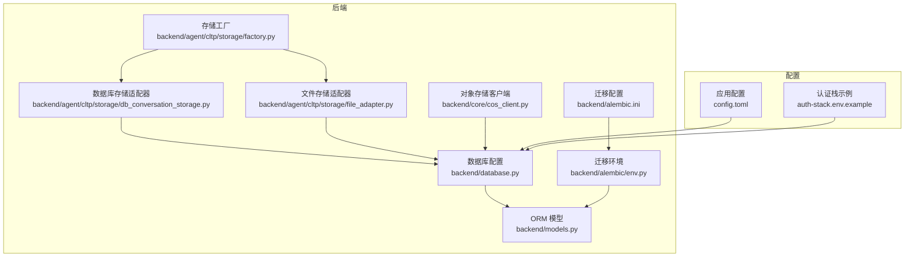
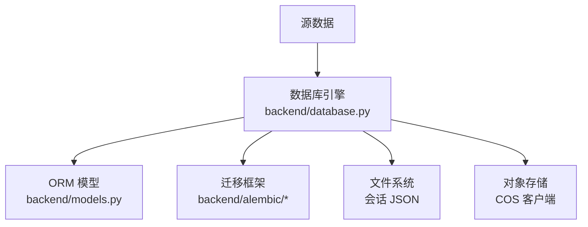
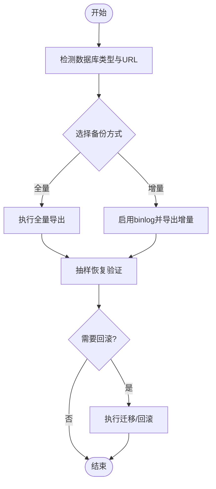
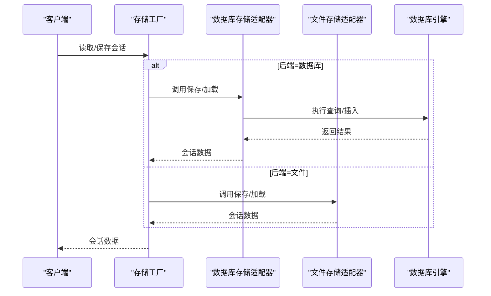
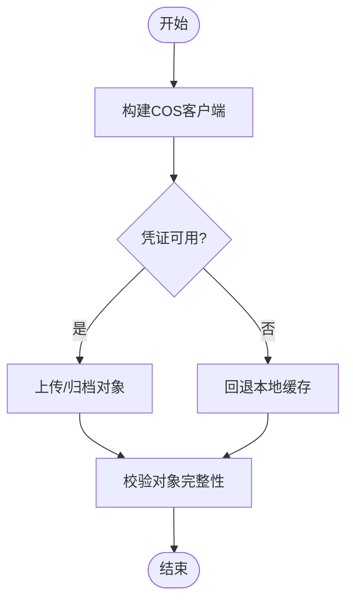
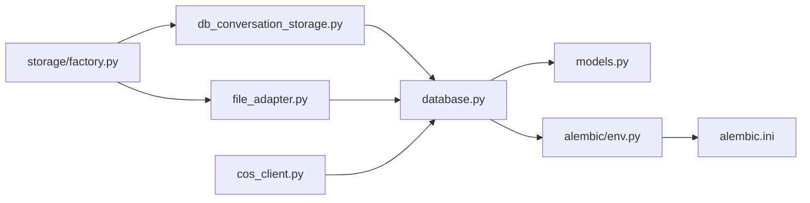

# 备份与恢复

<cite>
**本文引用的文件**
- [backend/database.py](file://backend/database.py)
- [backend/models.py](file://backend/models.py)
- [backend/alembic/env.py](file://backend/alembic/env.py)
- [backend/alembic.ini](file://backend/alembic.ini)
- [backend/migrate_agent_data.py](file://backend/migrate_agent_data.py)
- [backend/migrate_mysql_to_postgres.py](file://backend/migrate_mysql_to_postgres.py)
- [backend/agent/cltp/storage/factory.py](file://backend/agent/cltp/storage/factory.py)
- [backend/agent/cltp/storage/db_conversation_storage.py](file://backend/agent/cltp/storage/db_conversation_storage.py)
- [backend/agent/cltp/storage/file_adapter.py](file://backend/agent/cltp/storage/file_adapter.py)
- [backend/core/cos_client.py](file://backend/core/cos_client.py)
- [config.toml](file://config.toml)
- [auth-stack.env.example](file://auth-stack.env.example)
</cite>

## 目录
1. [简介](#简介)
2. [项目结构](#项目结构)
3. [核心组件](#核心组件)
4. [架构总览](#架构总览)
5. [详细组件分析](#详细组件分析)
6. [依赖分析](#依赖分析)
7. [性能考虑](#性能考虑)
8. [故障排查指南](#故障排查指南)
9. [结论](#结论)
10. [附录](#附录)

## 简介
本文件面向 ResumeAgent 项目的备份与恢复策略，覆盖数据库备份方案、文件存储备份与配置文件备份策略，以及自动备份任务配置、增量与全量备份设置建议、灾难恢复流程、数据迁移与系统回滚操作、备份验证方法、恢复测试流程与业务连续性保障措施。文档基于仓库现有实现进行梳理，并提供可落地的操作建议。

## 项目结构
围绕备份与恢复的关键目录与文件包括：
- 数据库层：数据库连接与引擎配置、ORM 模型定义、Alembic 迁移配置与运行入口
- 会话历史存储：文件与数据库双栈适配器，支持按环境切换
- 对象存储客户端：封装 COS 客户端，便于资产与日志的云端归档
- 配置与密钥：LLM 与第三方服务配置、认证栈环境变量示例

**图示来源**
- [backend/database.py:1-138](file://backend/database.py#L1-L138)
- [backend/models.py:1-372](file://backend/models.py#L1-L372)
- [backend/alembic/env.py:1-79](file://backend/alembic/env.py#L1-L79)
- [backend/alembic.ini:1-35](file://backend/alembic.ini#L1-L35)
- [backend/agent/cltp/storage/factory.py:1-41](file://backend/agent/cltp/storage/factory.py#L1-L41)
- [backend/agent/cltp/storage/db_conversation_storage.py:1-800](file://backend/agent/cltp/storage/db_conversation_storage.py#L1-L800)
- [backend/agent/cltp/storage/file_adapter.py:1-36](file://backend/agent/cltp/storage/file_adapter.py#L1-L36)
- [backend/core/cos_client.py:1-47](file://backend/core/cos_client.py#L1-L47)
- [config.toml:1-28](file://config.toml#L1-L28)
- [auth-stack.env.example:1-6](file://auth-stack.env.example#L1-L6)

**章节来源**
- [backend/database.py:1-138](file://backend/database.py#L1-L138)
- [backend/models.py:1-372](file://backend/models.py#L1-L372)
- [backend/alembic/env.py:1-79](file://backend/alembic/env.py#L1-L79)
- [backend/alembic.ini:1-35](file://backend/alembic.ini#L1-L35)
- [backend/agent/cltp/storage/factory.py:1-41](file://backend/agent/cltp/storage/factory.py#L1-L41)
- [backend/agent/cltp/storage/db_conversation_storage.py:1-800](file://backend/agent/cltp/storage/db_conversation_storage.py#L1-L800)
- [backend/agent/cltp/storage/file_adapter.py:1-36](file://backend/agent/cltp/storage/file_adapter.py#L1-L36)
- [backend/core/cos_client.py:1-47](file://backend/core/cos_client.py#L1-L47)
- [config.toml:1-28](file://config.toml#L1-L28)
- [auth-stack.env.example:1-6](file://auth-stack.env.example#L1-L6)

## 核心组件
- 数据库与迁移
  - 数据库连接与引擎：支持 SQLite、MySQL、PostgreSQL，连接池参数可调，开发默认 SQLite
  - ORM 模型：涵盖用户、会话、消息、日志等核心实体
  - Alembic 迁移：通过 env.py 注入数据库元数据，支持离线/在线迁移
- 会话历史存储
  - 存储工厂：根据环境变量选择文件或数据库后端
  - 数据库存储适配器：提供幂等保存、追加、加载能力，并兼容列演进
  - 文件存储适配器：会话状态持久化到本地 JSON 文件
- 对象存储
  - COS 客户端：封装 S3 兼容客户端，支持超时与代理控制，便于资产归档
- 配置与密钥
  - 应用配置：LLM 与视觉模型参数
  - 认证栈示例：BetterAuth 内部 URL 与共享密钥示例

**章节来源**
- [backend/database.py:1-138](file://backend/database.py#L1-L138)
- [backend/models.py:111-372](file://backend/models.py#L111-L372)
- [backend/alembic/env.py:30-79](file://backend/alembic/env.py#L30-L79)
- [backend/alembic.ini:1-35](file://backend/alembic.ini#L1-L35)
- [backend/agent/cltp/storage/factory.py:16-41](file://backend/agent/cltp/storage/factory.py#L16-L41)
- [backend/agent/cltp/storage/db_conversation_storage.py:33-800](file://backend/agent/cltp/storage/db_conversation_storage.py#L33-L800)
- [backend/agent/cltp/storage/file_adapter.py:10-36](file://backend/agent/cltp/storage/file_adapter.py#L10-L36)
- [backend/core/cos_client.py:19-47](file://backend/core/cos_client.py#L19-L47)
- [config.toml:1-28](file://config.toml#L1-L28)
- [auth-stack.env.example:1-6](file://auth-stack.env.example#L1-L6)

## 架构总览
备份与恢复涉及以下关键路径：
- 数据库备份：通过 Alembic 迁移与数据库引擎能力，结合外部备份工具执行全量/增量备份
- 会话历史备份：按存储后端（文件/数据库）分别备份；文件后端直接复制 JSON；数据库后端通过迁移与导出工具
- 对象存储备份：利用 COS 客户端能力，将静态资源与日志归档至云端
- 配置备份：应用配置与认证栈示例文件纳入版本控制或独立密管

**图示来源**
- [backend/database.py:1-138](file://backend/database.py#L1-L138)
- [backend/models.py:111-372](file://backend/models.py#L111-L372)
- [backend/alembic/env.py:30-79](file://backend/alembic/env.py#L30-L79)
- [backend/agent/cltp/storage/file_adapter.py:10-36](file://backend/agent/cltp/storage/file_adapter.py#L10-L36)
- [backend/core/cos_client.py:19-47](file://backend/core/cos_client.py#L19-L47)

## 详细组件分析

### 数据库备份与恢复策略
- 数据库类型与连接
  - 支持 SQLite（开发默认）、MySQL、PostgreSQL；连接池参数可调，生产建议开启 pre_ping 与合理回收时间
- 迁移与版本控制
  - Alembic 通过 env.py 注入元数据，支持离线/在线迁移；迁移配置位于 alembic.ini
- 备份建议
  - 全量备份：使用数据库原生命令导出（如 mysqldump/pg_dump），结合定时任务
  - 增量备份：启用数据库二进制日志（binlog），按时间点恢复
  - 验证：定期抽样恢复演练，核对表结构与关键数据一致性
- 回滚与迁移
  - 使用迁移脚本检查远端模式，必要时先升级再迁移
  - 数据迁移脚本提供重试与统计，支持干跑校验

**图示来源**
- [backend/database.py:26-112](file://backend/database.py#L26-L112)
- [backend/alembic/env.py:30-79](file://backend/alembic/env.py#L30-L79)
- [backend/alembic.ini:1-35](file://backend/alembic.ini#L1-L35)
- [backend/migrate_agent_data.py:100-122](file://backend/migrate_agent_data.py#L100-L122)

**章节来源**
- [backend/database.py:26-112](file://backend/database.py#L26-L112)
- [backend/alembic/env.py:30-79](file://backend/alembic/env.py#L30-L79)
- [backend/alembic.ini:1-35](file://backend/alembic.ini#L1-L35)
- [backend/migrate_agent_data.py:100-122](file://backend/migrate_agent_data.py#L100-L122)

### 会话历史备份与恢复
- 存储后端选择
  - 通过环境变量选择文件或数据库后端；数据库后端具备幂等保存与列演进兼容
- 文件后端
  - 会话状态以 JSON 文件形式存储于本地，便于直接复制与归档
- 数据库后端
  - 提供保存、追加、加载与冲突处理逻辑；当缺少特定列时自动降级到兼容路径
- 备份与恢复
  - 文件后端：直接复制 data/session_state 下的 JSON 文件
  - 数据库后端：导出 agent_conversations 与 agent_messages 表，配合 Alembic 迁移保证结构一致

**图示来源**
- [backend/agent/cltp/storage/factory.py:16-41](file://backend/agent/cltp/storage/factory.py#L16-L41)
- [backend/agent/cltp/storage/db_conversation_storage.py:317-406](file://backend/agent/cltp/storage/db_conversation_storage.py#L317-L406)
- [backend/agent/cltp/storage/file_adapter.py:19-30](file://backend/agent/cltp/storage/file_adapter.py#L19-L30)

**章节来源**
- [backend/agent/cltp/storage/factory.py:16-41](file://backend/agent/cltp/storage/factory.py#L16-L41)
- [backend/agent/cltp/storage/db_conversation_storage.py:33-800](file://backend/agent/cltp/storage/db_conversation_storage.py#L33-L800)
- [backend/agent/cltp/storage/file_adapter.py:10-36](file://backend/agent/cltp/storage/file_adapter.py#L10-L36)

### 对象存储与静态资源备份
- COS 客户端
  - 支持超时与代理配置，便于在受限网络环境下稳定访问
  - 提供本地优先策略，开发模式下可优先使用本地缓存资源
- 备份建议
  - 将静态资源与日志归档至 COS，定期比对与校验
  - 在跨区域部署时，建立多副本策略

**图示来源**
- [backend/core/cos_client.py:19-47](file://backend/core/cos_client.py#L19-L47)

**章节来源**
- [backend/core/cos_client.py:19-47](file://backend/core/cos_client.py#L19-L47)

### 配置文件备份与密钥管理
- 应用配置
  - LLM 与视觉模型参数集中于 config.toml，建议纳入版本控制或密管
- 认证栈
  - 认证栈示例文件包含 BetterAuth 内部 URL 与共享密钥，需妥善保管
- 备份建议
  - 将 config.toml 与认证栈示例文件纳入版本控制或独立密管
  - 对敏感密钥使用环境变量或密管系统

**章节来源**
- [config.toml:1-28](file://config.toml#L1-L28)
- [auth-stack.env.example:1-6](file://auth-stack.env.example#L1-L6)

### 自动化备份任务与验证
- 全量备份
  - 使用数据库原生工具执行全量导出，结合系统定时任务
- 增量备份
  - 启用数据库二进制日志，按时间点恢复
- 验证与测试
  - 定期抽样恢复演练，核对表结构与关键数据一致性
- 回滚
  - 使用迁移脚本检查远端模式，必要时先升级再迁移

**章节来源**
- [backend/migrate_agent_data.py:319-365](file://backend/migrate_agent_data.py#L319-L365)

### 灾难恢复流程
- 快速评估
  - 判断故障范围（数据库/文件系统/对象存储）
- 数据恢复
  - 数据库：从最近全量+增量恢复，核对迁移版本
  - 文件：恢复 data/session_state 下的 JSON 文件
  - 对象存储：从 COS 恢复静态资源与日志
- 业务验证
  - 核对会话历史、用户数据与日志完整性
- 回滚与迁移
  - 若新版本引入问题，回退到上一个稳定版本并重新迁移

**章节来源**
- [backend/agent/cltp/storage/file_adapter.py:19-30](file://backend/agent/cltp/storage/file_adapter.py#L19-L30)
- [backend/agent/cltp/storage/db_conversation_storage.py:317-406](file://backend/agent/cltp/storage/db_conversation_storage.py#L317-L406)
- [backend/migrate_agent_data.py:319-365](file://backend/migrate_agent_data.py#L319-L365)

### 数据迁移与系统回滚
- 数据迁移
  - 迁移脚本提供重试机制与统计，支持干跑校验
  - 迁移前检查远端模式，必要时先升级再迁移
- 系统回滚
  - 回滚到上一个稳定版本，重新执行迁移脚本
  - 对比源/目标表统计，确保迁移完整性

**章节来源**
- [backend/migrate_agent_data.py:69-88](file://backend/migrate_agent_data.py#L69-L88)
- [backend/migrate_agent_data.py:100-122](file://backend/migrate_agent_data.py#L100-L122)
- [backend/migrate_agent_data.py:319-365](file://backend/migrate_agent_data.py#L319-L365)

## 依赖分析
- 组件耦合
  - 数据库引擎与 ORM 模型强耦合，迁移依赖 Alembic 环境配置
  - 存储工厂解耦文件与数据库后端，便于按环境切换
  - 对象存储客户端与数据库无直接耦合，通过业务逻辑间接关联
- 外部依赖
  - 数据库驱动（MySQL/PostgreSQL/SQLite）
  - Alembic 迁移框架
  - 对象存储 SDK（COS）

**图示来源**
- [backend/database.py:1-138](file://backend/database.py#L1-L138)
- [backend/models.py:111-372](file://backend/models.py#L111-L372)
- [backend/alembic/env.py:30-79](file://backend/alembic/env.py#L30-L79)
- [backend/alembic.ini:1-35](file://backend/alembic.ini#L1-L35)
- [backend/agent/cltp/storage/factory.py:16-41](file://backend/agent/cltp/storage/factory.py#L16-L41)
- [backend/agent/cltp/storage/db_conversation_storage.py:33-800](file://backend/agent/cltp/storage/db_conversation_storage.py#L33-L800)
- [backend/agent/cltp/storage/file_adapter.py:10-36](file://backend/agent/cltp/storage/file_adapter.py#L10-L36)
- [backend/core/cos_client.py:19-47](file://backend/core/cos_client.py#L19-L47)

**章节来源**
- [backend/database.py:1-138](file://backend/database.py#L1-L138)
- [backend/models.py:111-372](file://backend/models.py#L111-L372)
- [backend/alembic/env.py:30-79](file://backend/alembic/env.py#L30-L79)
- [backend/alembic.ini:1-35](file://backend/alembic.ini#L1-L35)
- [backend/agent/cltp/storage/factory.py:16-41](file://backend/agent/cltp/storage/factory.py#L16-L41)
- [backend/agent/cltp/storage/db_conversation_storage.py:33-800](file://backend/agent/cltp/storage/db_conversation_storage.py#L33-L800)
- [backend/agent/cltp/storage/file_adapter.py:10-36](file://backend/agent/cltp/storage/file_adapter.py#L10-L36)
- [backend/core/cos_client.py:19-47](file://backend/core/cos_client.py#L19-L47)

## 性能考虑
- 连接池与超时
  - 生产环境建议开启 pre_ping，合理设置回收与超时参数
- 存储后端
  - 数据库后端具备幂等保存与列演进兼容，减少重复写入
  - 文件后端适合小规模与开发环境，大规模建议数据库后端
- 对象存储
  - 合理设置超时与代理，避免受限网络导致的性能问题

**章节来源**
- [backend/database.py:72-112](file://backend/database.py#L72-L112)
- [backend/agent/cltp/storage/db_conversation_storage.py:317-406](file://backend/agent/cltp/storage/db_conversation_storage.py#L317-L406)
- [backend/core/cos_client.py:11-16](file://backend/core/cos_client.py#L11-L16)

## 故障排查指南
- 数据库连接失败
  - 检查 DATABASE_URL/POSTGRESQL_URL 环境变量，确认驱动与格式正确
  - 开启连接超时与预检查参数，定位网络与权限问题
- 迁移失败
  - 使用迁移脚本检查远端模式，必要时先升级再迁移
  - 查看 Alembic 日志与错误码，定位缺失表/列问题
- 存储后端异常
  - 文件后端：检查 data/session_state 目录权限与磁盘空间
  - 数据库后端：确认 agent_conversations 与 agent_messages 表存在且列完整
- 对象存储异常
  - 检查 COS 凭证、区域与超时设置，确认代理配置

**章节来源**
- [backend/database.py:26-67](file://backend/database.py#L26-L67)
- [backend/migrate_agent_data.py:100-122](file://backend/migrate_agent_data.py#L100-L122)
- [backend/agent/cltp/storage/db_conversation_storage.py:37-68](file://backend/agent/cltp/storage/db_conversation_storage.py#L37-L68)
- [backend/core/cos_client.py:19-37](file://backend/core/cos_client.py#L19-L37)

## 结论
本项目提供了灵活的数据库与会话历史存储方案，并通过 Alembic 实现结构演进与迁移。结合对象存储与配置管理，可形成完整的备份与恢复体系。建议在生产环境中启用数据库全量/增量备份、定期恢复演练与迁移回滚流程，确保业务连续性与数据安全。

## 附录
- 关键文件清单
  - 数据库与模型：backend/database.py、backend/models.py
  - 迁移：backend/alembic/env.py、backend/alembic.ini
  - 存储：backend/agent/cltp/storage/factory.py、db_conversation_storage.py、file_adapter.py
  - 对象存储：backend/core/cos_client.py
  - 配置：config.toml、auth-stack.env.example
- 备份验证清单
  - 数据库：导出/导入一致性、迁移版本核对
  - 会话历史：文件 JSON 完整性、数据库表结构核对
  - 对象存储：静态资源与日志完整性校验
  - 配置：密钥与参数一致性核对