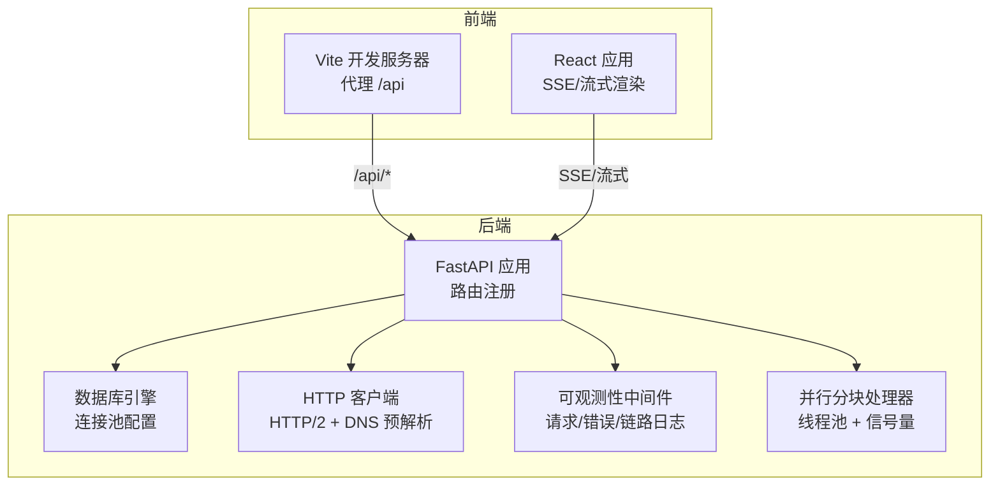
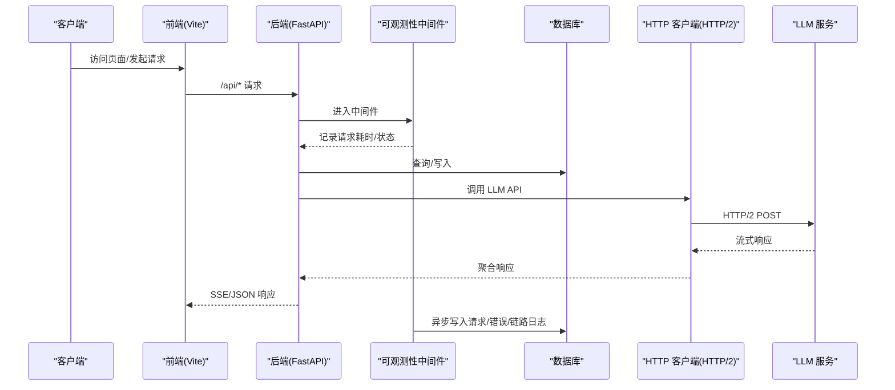
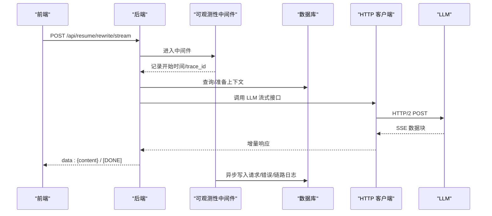
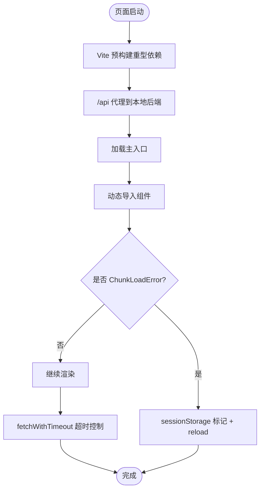
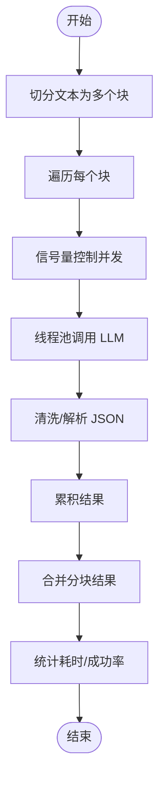
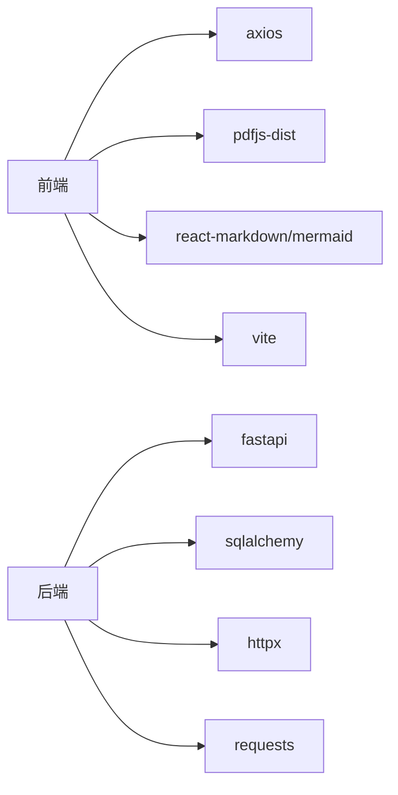

# 性能优化

<cite>
**本文引用的文件**   
- [backend/main.py](file://backend/main.py)
- [backend/database.py](file://backend/database.py)
- [backend/middleware/observability.py](file://backend/middleware/observability.py)
- [backend/http_client.py](file://backend/http_client.py)
- [backend/parallel_chunk_processor.py](file://backend/parallel_chunk_processor.py)
- [frontend/vite.config.ts](file://frontend/vite.config.ts)
- [frontend/src/lib/fetchWithTimeout.ts](file://frontend/src/lib/fetchWithTimeout.ts)
- [frontend/src/lib/lazyWithRetry.ts](file://frontend/src/lib/lazyWithRetry.ts)
- [knowledge-base/specs/2026-03-31-ai-polish-architecture.md](file://knowledge-base/specs/2026-03-31-ai-polish-architecture.md)
- [backend/models.py](file://backend/models.py)
- [backend/tests/test_resume_text_preprocessor.py](file://backend/tests/test_resume_text_preprocessor.py)
- [frontend/package.json](file://frontend/package.json)
</cite>

## 目录
1. [简介](#简介)
2. [项目结构](#项目结构)
3. [核心组件](#核心组件)
4. [架构总览](#架构总览)
5. [详细组件分析](#详细组件分析)
6. [依赖分析](#依赖分析)
7. [性能考量](#性能考量)
8. [故障排查指南](#故障排查指南)
9. [结论](#结论)
10. [附录](#附录)

## 简介
本指南聚焦 ResumeAgent 在简历生成与编辑场景下的性能优化实践，涵盖系统性能瓶颈识别、优化策略实施与性能监控方法。内容包括：
- 数据库查询优化与连接池配置
- API 响应时间优化（LLM 调用、SSE 流式传输、可观测性中间件）
- 前端加载性能提升（Vite 预构建、懒加载重试、超时控制）
- 并发处理优化（并行分块、线程池、信号量）
- 缓存与资源压缩（DNS 预解析、HTTP/2、压缩编码）
- 性能测试与持续监控流程

## 项目结构
后端采用 FastAPI，前端基于 Vite + React，可观测性通过中间件落地到数据库表，LLM 调用通过统一客户端封装，简历解析支持长文本并行分块。

**图表来源**
- [backend/main.py:92-138](file://backend/main.py#L92-L138)
- [backend/database.py:90-112](file://backend/database.py#L90-L112)
- [backend/http_client.py:76-130](file://backend/http_client.py#L76-L130)
- [backend/middleware/observability.py:170-191](file://backend/middleware/observability.py#L170-L191)
- [backend/parallel_chunk_processor.py:83-100](file://backend/parallel_chunk_processor.py#L83-L100)
- [frontend/vite.config.ts:128-139](file://frontend/vite.config.ts#L128-L139)

**章节来源**
- [backend/main.py:92-138](file://backend/main.py#L92-L138)
- [frontend/vite.config.ts:128-139](file://frontend/vite.config.ts#L128-L139)

## 核心组件
- 后端入口与路由：集中注册健康检查、认证、简历、PDF、搜索等路由，并支持可选 TTS 与 LeetCode 路由。
- 数据库引擎：统一连接池参数（大小、回收、超时、预检），适配 MySQL/PostgreSQL/SQLite。
- HTTP 客户端：优先 HTTP/2，支持 DNS 预解析、连接池复用与压缩编码；提供同步/异步/流式调用。
- 可观测性中间件：异步落库记录请求耗时、状态码、尺寸、链路 span，避免阻塞主请求。
- 并行分块处理器：将长文本切分为多个块，使用线程池与信号量并发调用 LLM，最后合并结果。
- 前端性能：Vite 预构建重型依赖、懒加载重试、请求超时控制、代理到本地后端。

**章节来源**
- [backend/main.py:106-138](file://backend/main.py#L106-L138)
- [backend/database.py:78-112](file://backend/database.py#L78-L112)
- [backend/http_client.py:76-130](file://backend/http_client.py#L76-L130)
- [backend/middleware/observability.py:19-61](file://backend/middleware/observability.py#L19-L61)
- [backend/parallel_chunk_processor.py:83-100](file://backend/parallel_chunk_processor.py#L83-L100)
- [frontend/vite.config.ts:140-153](file://frontend/vite.config.ts#L140-L153)

## 架构总览
后端通过中间件采集请求指标，数据库连接池保障并发稳定性，HTTP 客户端优化 LLM 调用链路，前端通过 Vite 与懒加载提升首屏与交互体验。

**图表来源**
- [backend/middleware/observability.py:19-61](file://backend/middleware/observability.py#L19-L61)
- [backend/database.py:90-112](file://backend/database.py#L90-L112)
- [backend/http_client.py:161-207](file://backend/http_client.py#L161-L207)
- [knowledge-base/specs/2026-03-31-ai-polish-architecture.md:29-38](file://knowledge-base/specs/2026-03-31-ai-polish-architecture.md#L29-L38)

## 详细组件分析

### 数据库连接池与查询优化
- 连接池参数
  - pool_size：连接池大小
  - max_overflow：溢出连接数
  - pool_recycle：连接回收周期
  - pool_timeout：获取连接超时
  - pool_pre_ping：每次取连接前校验（PostgreSQL 默认启用）
  - pool_use_lifo：后进先出复用，减少陈旧连接
  - pool_reset_on_return：归还时重置事务状态
  - connect_args：MySQL charset、读写超时；PostgreSQL connect_timeout
- 启动时预热数据库连接，避免首次访问延迟
- 建议
  - 根据并发峰值调整 pool_size 与 max_overflow
  - 对热点查询建立合适索引，避免全表扫描
  - 使用分页/限制返回字段，减少 IO 与序列化开销

**章节来源**
- [backend/database.py:78-112](file://backend/database.py#L78-L112)
- [backend/main.py:271-295](file://backend/main.py#L271-L295)

### API 响应时间优化
- HTTP/2 与连接复用
  - httpx 客户端开启 http2=True，limits 控制连接上限与 keepalive
  - Accept-Encoding 支持 br/gzip/deflate，减少传输体积
  - 预热连接与 DNS 预解析降低首包延迟
- SSE 流式传输
  - 后端通过流式接口返回增量内容，前端逐块渲染，显著降低首屏等待
  - 前端使用超时控制，避免长时间挂起
- 可观测性中间件
  - 异步写入请求/错误/链路日志，避免阻塞主请求
  - 为每个请求注入 trace_id/request_id，便于追踪

**图表来源**
- [knowledge-base/specs/2026-03-31-ai-polish-architecture.md:129-154](file://knowledge-base/specs/2026-03-31-ai-polish-architecture.md#L129-L154)
- [backend/middleware/observability.py:19-61](file://backend/middleware/observability.py#L19-L61)
- [backend/http_client.py:161-207](file://backend/http_client.py#L161-L207)
- [frontend/src/lib/fetchWithTimeout.ts:8-28](file://frontend/src/lib/fetchWithTimeout.ts#L8-L28)

**章节来源**
- [backend/http_client.py:76-130](file://backend/http_client.py#L76-L130)
- [knowledge-base/specs/2026-03-31-ai-polish-architecture.md:29-38](file://knowledge-base/specs/2026-03-31-ai-polish-architecture.md#L29-L38)
- [backend/middleware/observability.py:19-61](file://backend/middleware/observability.py#L19-L61)

### 前端加载性能提升
- Vite 预构建
  - 将重型依赖（markdown/图表/PDF）纳入 optimizeDeps.include，避免首次进入时即时优化导致整页 reload
  - 代理 /api 指向本地后端，防止误代理到远端
- 懒加载与重试
  - lazyWithRetry 捕获 ChunkLoadError，自动刷新一次以拉取最新 index.html，缓解 CDN 缓存导致的模块缺失
- 请求超时控制
  - fetchWithTimeout 提供统一超时中断，避免长时间挂起造成 UI 卡顿

**图表来源**
- [frontend/vite.config.ts:140-153](file://frontend/vite.config.ts#L140-L153)
- [frontend/src/lib/lazyWithRetry.ts:20-34](file://frontend/src/lib/lazyWithRetry.ts#L20-L34)
- [frontend/src/lib/fetchWithTimeout.ts:8-28](file://frontend/src/lib/fetchWithTimeout.ts#L8-L28)

**章节来源**
- [frontend/vite.config.ts:140-153](file://frontend/vite.config.ts#L140-L153)
- [frontend/src/lib/lazyWithRetry.ts:20-34](file://frontend/src/lib/lazyWithRetry.ts#L20-L34)
- [frontend/src/lib/fetchWithTimeout.ts:8-28](file://frontend/src/lib/fetchWithTimeout.ts#L8-L28)

### 并发处理优化
- 并行分块处理器
  - 将长文本切分为多个块，使用线程池与信号量控制并发数
  - 对每个块调用 LLM，清洗与解析 JSON，最后合并结果
  - 记录统计信息（总耗时、成功/失败数、平均/最慢/最快单块耗时、并行效率提升倍数）
- 建议
  - 根据 LLM 限流与网络 RTT 调整 max_concurrent
  - 对失败块进行重试或降级处理，保证结果完整性

**图表来源**
- [backend/parallel_chunk_processor.py:233-313](file://backend/parallel_chunk_processor.py#L233-L313)

**章节来源**
- [backend/parallel_chunk_processor.py:83-100](file://backend/parallel_chunk_processor.py#L83-L100)
- [backend/parallel_chunk_processor.py:233-313](file://backend/parallel_chunk_processor.py#L233-L313)

### 缓存策略与资源压缩
- DNS 预解析：提前解析常用 LLM 域名，减少首包 DNS 延迟
- HTTP/2：多路复用、头部压缩、可选服务器推送
- 压缩编码：br/gzip/deflate，降低传输体积
- 前端静态资源：Vite 构建产物由反向代理缓存，合理设置 Cache-Control

**章节来源**
- [backend/http_client.py:39-71](file://backend/http_client.py#L39-L71)
- [backend/http_client.py:76-130](file://backend/http_client.py#L76-L130)
- [frontend/vite.config.ts:128-139](file://frontend/vite.config.ts#L128-L139)

### 性能测试与基准测试
- 单元测试验证预处理与合并逻辑，确保解析稳定性
  - 归一化粘贴文本、实习条目合并、孤立亮点修复
- 建议
  - 使用 wrk/JMeter/Artillery 对 /api/resume/rewrite/stream 等关键接口做并发压测
  - 以 p50/p90/p99 延迟、吞吐量、错误率作为 KPI
  - 对比启用/关闭 HTTP/2、DNS 预解析、连接池参数的差异

**章节来源**
- [backend/tests/test_resume_text_preprocessor.py:17-55](file://backend/tests/test_resume_text_preprocessor.py#L17-L55)

## 依赖分析
- 后端依赖
  - FastAPI：路由与中间件
  - SQLAlchemy：ORM 与连接池
  - httpx（可选）：HTTP/2 客户端
  - requests：降级方案
- 前端依赖
  - React/Turbo：组件与渲染
  - Vite：开发与构建
  - axios/pdfjs 等：网络与 PDF 渲染

**图表来源**
- [frontend/package.json:12-53](file://frontend/package.json#L12-L53)
- [backend/http_client.py:18-34](file://backend/http_client.py#L18-L34)

**章节来源**
- [frontend/package.json:12-53](file://frontend/package.json#L12-L53)
- [backend/http_client.py:18-34](file://backend/http_client.py#L18-L34)

## 性能考量
- 数据库
  - 合理设置连接池参数，避免连接泄漏与饥饿
  - 对高频查询建立索引，必要时使用 EXPLAIN 分析
- API
  - 优先使用 HTTP/2，启用压缩编码
  - SSE 流式返回，前端及时消费，避免缓冲堆积
- 前端
  - 预构建重型依赖，减少首屏优化时间
  - 懒加载 + 重试，提升健壮性
  - 请求超时控制，改善用户体验
- 并发
  - 并行分块处理器需考虑 LLM 限流与网络抖动，设置合理的并发上限与失败重试

## 故障排查指南
- 观测性日志
  - 查看 APIRequestLog/APITraceSpan/APIErrorLog，定位慢请求与错误堆栈
  - 关注 latency_ms、status_code、request_size/response_size
- 数据库连接
  - 若出现连接超时/拒绝，检查 pool_size/max_overflow 与 pool_recycle
  - 启动预热失败时，确认数据库可达性与凭据
- LLM 调用
  - HTTP/2 未安装时自动降级为 requests，检查依赖安装
  - DNS 预解析失败不影响运行，但会增加首包延迟
- 前端
  - ChunkLoadError：启用 lazyWithRetry 自动刷新一次
  - 请求超时：检查代理配置与后端响应时间

**章节来源**
- [backend/middleware/observability.py:79-151](file://backend/middleware/observability.py#L79-L151)
- [backend/database.py:90-112](file://backend/database.py#L90-L112)
- [backend/http_client.py:28-34](file://backend/http_client.py#L28-L34)
- [frontend/src/lib/lazyWithRetry.ts:20-34](file://frontend/src/lib/lazyWithRetry.ts#L20-L34)
- [frontend/src/lib/fetchWithTimeout.ts:8-28](file://frontend/src/lib/fetchWithTimeout.ts#L8-L28)

## 结论
通过数据库连接池优化、HTTP/2 与 DNS 预解析、可观测性中间件、并行分块与前端懒加载重试等手段，ResumeAgent 在简历生成与编辑场景下实现了显著的性能提升。建议持续以 KPI 驱动优化，结合压测与监控闭环迭代。

## 附录
- 关键接口参考
  - POST /api/resume/rewrite/stream：整字段润色流式接口
  - POST /api/resume/rewrite-text/stream：划词改写流式接口
  - POST /api/resume/rewrite-text/intent：意图识别接口
- 相关模型
  - APIRequestLog/APITraceSpan/APIErrorLog：可观测性数据模型
  - Resume/ResumeEmbedding/User 等：业务数据模型

**章节来源**
- [knowledge-base/specs/2026-03-31-ai-polish-architecture.md:129-176](file://knowledge-base/specs/2026-03-31-ai-polish-architecture.md#L129-L176)
- [backend/models.py:200-251](file://backend/models.py#L200-L251)