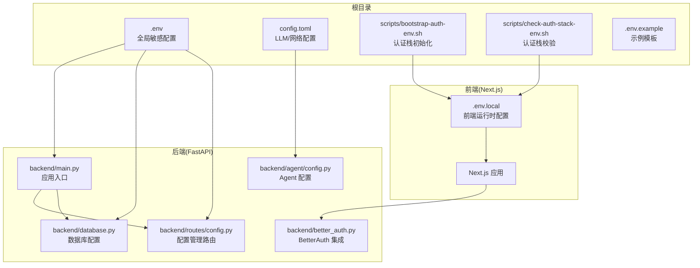
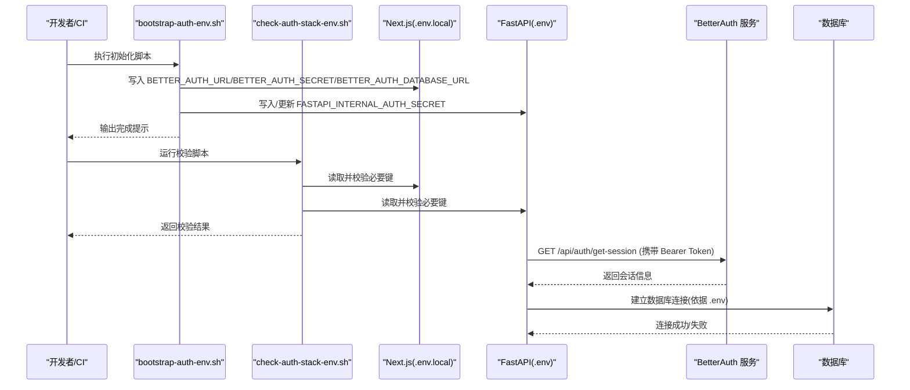
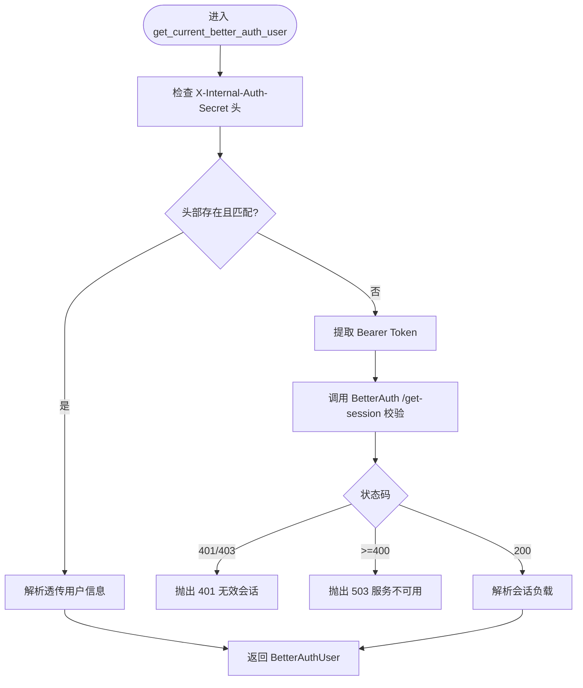
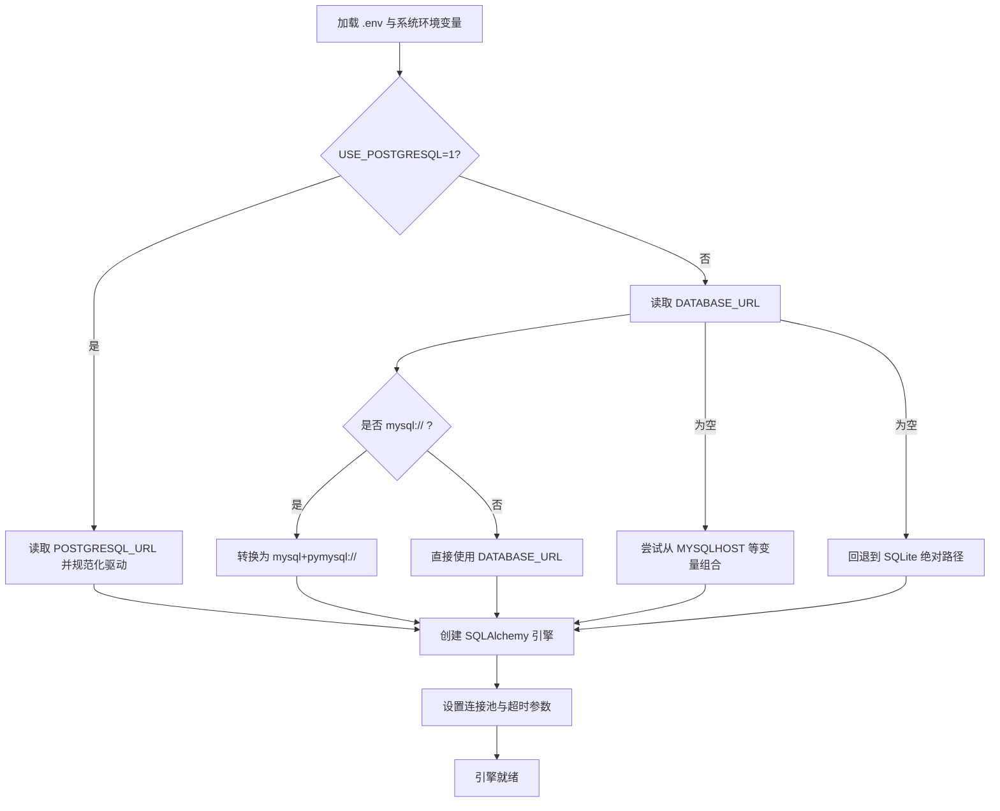
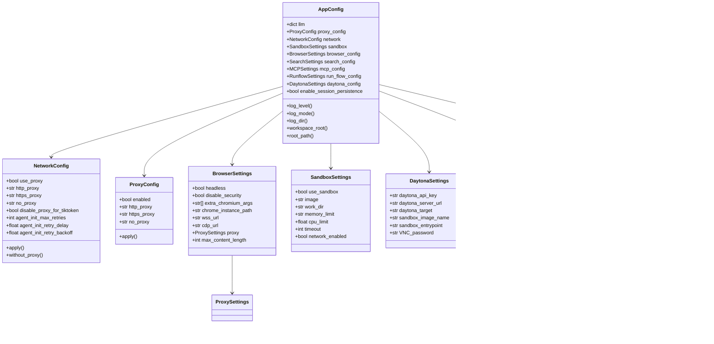
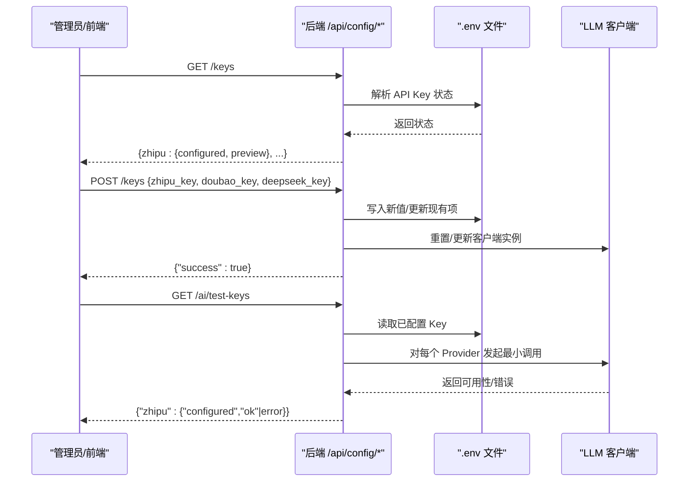
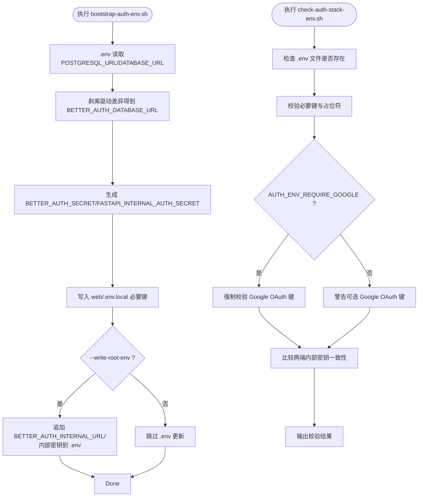
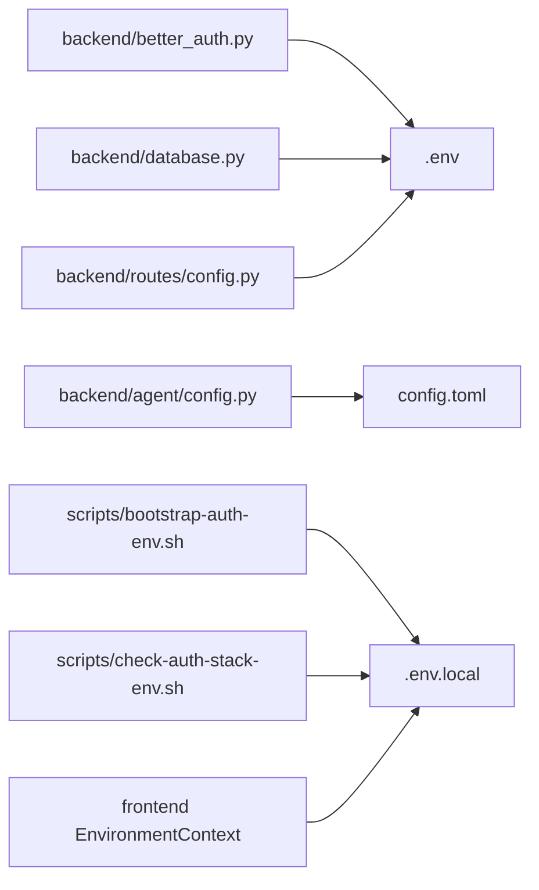

# 环境配置管理

<cite>
**本文档引用的文件**
- [backend/better_auth.py](file://backend/better_auth.py)
- [backend/database.py](file://backend/database.py)
- [scripts/bootstrap-auth-env.sh](file://scripts/bootstrap-auth-env.sh)
- [scripts/check-auth-stack-env.sh](file://scripts/check-auth-stack-env.sh)
- [backend/agent/config.py](file://backend/agent/config.py)
- [backend/routes/config.py](file://backend/routes/config.py)
- [config.toml](file://config.toml)
- [auth-stack.env.example](file://auth-stack.env.example)
- [backend/main.py](file://backend/main.py)
- [frontend/src/contexts/EnvironmentContext.tsx](file://frontend/src/contexts/EnvironmentContext.tsx)
</cite>

## 目录
1. [简介](#简介)
2. [项目结构](#项目结构)
3. [核心组件](#核心组件)
4. [架构总览](#架构总览)
5. [详细组件分析](#详细组件分析)
6. [依赖分析](#依赖分析)
7. [性能考虑](#性能考虑)
8. [故障排除指南](#故障排除指南)
9. [结论](#结论)
10. [附录](#附录)

## 简介
本指南聚焦于 ResumeAgent 项目的环境配置管理，涵盖环境变量管理、配置文件组织与敏感信息保护，以及本地开发、CI/CD 与生产环境的安全配置实践。文档特别解释了 BetterAuth 认证配置、数据库连接配置与第三方服务密钥管理，并提供配置验证脚本的使用方法与配置变更流程，帮助团队在不同环境中稳定、安全地运行系统。

## 项目结构
项目采用前后端分离与模块化设计，环境配置分布在多个层次：
- 根级 .env：存放数据库连接、第三方服务密钥等全局敏感配置
- Web 前端：Next.js 环境变量通过 .env.local 管理，区分开发与部署
- 后端 FastAPI：通过 .env 加载运行时配置；Agent 配置通过 config.toml 管理 LLM 与网络参数
- 验证脚本：bootstrap-auth-env.sh 与 check-auth-stack-env.sh 协助初始化与校验认证栈环境

**图表来源**
- [backend/main.py:28-36](file://backend/main.py#L28-L36)
- [backend/database.py:18-24](file://backend/database.py#L18-L24)
- [backend/routes/config.py:54-87](file://backend/routes/config.py#L54-L87)
- [backend/agent/config.py:15-26](file://backend/agent/config.py#L15-L26)
- [scripts/bootstrap-auth-env.sh:5,6:5-6](file://scripts/bootstrap-auth-env.sh#L5-L6)
- [scripts/check-auth-stack-env.sh:5,6:5-6](file://scripts/check-auth-stack-env.sh#L5-L6)

**章节来源**
- [backend/main.py:28-36](file://backend/main.py#L28-L36)
- [backend/database.py:18-24](file://backend/database.py#L18-L24)
- [backend/routes/config.py:54-87](file://backend/routes/config.py#L54-L87)
- [backend/agent/config.py:15-26](file://backend/agent/config.py#L15-L26)
- [scripts/bootstrap-auth-env.sh:5,6:5-6](file://scripts/bootstrap-auth-env.sh#L5-L6)
- [scripts/check-auth-stack-env.sh:5,6:5-6](file://scripts/check-auth-stack-env.sh#L5-L6)

## 核心组件
- BetterAuth 集成：负责 FastAPI 对 Next.js BetterAuth 的会话校验与令牌验证，支持内部密钥透传与外部 Bearer Token 校验
- 数据库配置：统一加载 .env 并根据 USE_POSTGRESQL/DATABASE_URL/POSTGRESQL_URL 等变量选择连接类型与驱动，支持 MySQL、PostgreSQL 与 SQLite
- Agent 配置：基于 config.toml 的 LLM 与网络配置，支持环境变量占位符展开与代理设置
- 配置管理路由：提供 API Key 状态查询与保存、提示词模板管理、AI Key 可用性测试等能力
- 认证栈初始化与校验脚本：自动化生成/更新前端 .env.local 与根 .env 中 BetterAuth 相关键值，并进行一致性与完整性检查

**章节来源**
- [backend/better_auth.py:22-113](file://backend/better_auth.py#L22-L113)
- [backend/database.py:26-112](file://backend/database.py#L26-L112)
- [backend/agent/config.py:337-545](file://backend/agent/config.py#L337-L545)
- [backend/routes/config.py:45-309](file://backend/routes/config.py#L45-L309)
- [scripts/bootstrap-auth-env.sh:109-204](file://scripts/bootstrap-auth-env.sh#L109-L204)
- [scripts/check-auth-stack-env.sh:44-116](file://scripts/check-auth-stack-env.sh#L44-L116)

## 架构总览
下图展示环境配置在系统中的流转与交互：

**图表来源**
- [scripts/bootstrap-auth-env.sh:109-204](file://scripts/bootstrap-auth-env.sh#L109-L204)
- [scripts/check-auth-stack-env.sh:44-116](file://scripts/check-auth-stack-env.sh#L44-L116)
- [backend/better_auth.py:65-113](file://backend/better_auth.py#L65-L113)
- [backend/database.py:26-112](file://backend/database.py#L26-L112)

## 详细组件分析

### BetterAuth 认证配置
- 基础地址解析：优先读取 BETTER_AUTH_INTERNAL_URL，其次 BETTER_AUTH_URL，再其次 NEXT_PUBLIC_AUTH_BASE_URL，最后回退至默认本地地址
- 内部密钥校验：支持通过 X-Internal-Auth-Secret 头透传用户信息，要求与 FASTAPI_INTERNAL_AUTH_SECRET 完全一致
- 外部令牌校验：从 Authorization 头提取 Bearer Token，调用 BetterAuth 的 /api/auth/get-session 接口验证
- 错误处理：针对 401/403 与 5xx 状态码给出明确错误信息，便于前端与运维定位问题

**图表来源**
- [backend/better_auth.py:90-113](file://backend/better_auth.py#L90-L113)
- [backend/better_auth.py:65-87](file://backend/better_auth.py#L65-L87)

**章节来源**
- [backend/better_auth.py:22-113](file://backend/better_auth.py#L22-L113)

### 数据库连接配置
- 环境变量加载：优先加载项目根 .env，随后加载系统环境变量，保证覆盖顺序
- 连接选择逻辑：
  - USE_POSTGRESQL=true 时强制使用 PostgreSQL，自动规范化驱动前缀
  - 否则使用 DATABASE_URL；如为 mysql:// 则转换为 mysql+pymysql://
  - 若未设置 DATABASE_URL，则尝试从 MYSQLHOST/MYSQLPORT/MYSQLUSER/MYSQLPASSWORD/MYSQLDATABASE 组合
  - 最终回退到 SQLite（绝对路径），便于本地开发
- 连接池与超时：根据数据库类型设置 pool_pre_ping、pool_recycle、pool_size、max_overflow、pool_timeout 等参数；PostgreSQL 支持连接超时控制
- 连接参数：MySQL 设置字符集与读写超时；PostgreSQL 设置连接超时

**图表来源**
- [backend/database.py:18-112](file://backend/database.py#L18-L112)

**章节来源**
- [backend/database.py:26-112](file://backend/database.py#L26-L112)

### Agent 配置与环境变量展开
- 配置来源：config.toml 作为主配置文件，支持环境变量占位符 ${VAR_NAME} 自动展开
- 支持的子系统：
  - LLM：定义默认模型与 API 类型，支持多模型覆盖
  - 网络：统一代理配置（HTTP/HTTPS/NO_PROXY），并提供 TikToken 下载时禁用代理的上下文管理器
  - 浏览器：无头模式、安全选项、代理、内容长度限制等
  - 沙箱：容器镜像、工作目录、内存/CPU 限制、超时与网络开关
  - Daytona：沙箱服务器与目标区域配置
  - MCP：MCP 服务器配置（从 JSON 文件加载）
  - 运行流：启用数据分析师代理等
- 日志与工作空间：提供日志级别、模式与目录等运行时参数

**图表来源**
- [backend/agent/config.py:53-545](file://backend/agent/config.py#L53-L545)

**章节来源**
- [backend/agent/config.py:337-545](file://backend/agent/config.py#L337-L545)
- [config.toml:1-28](file://config.toml#L1-L28)

### 配置管理路由（API Key 与提示词）
- API Key 状态查询：从 .env 文件解析 ZHIPU、DOUBAO、DASHSCOPE 的配置状态，仅返回“是否已配置”与简要预览
- 保存 API Key：将新值写入 .env，必要时重载 dotenv；并尝试重置/更新对应 LLM 客户端实例
- 提示词模板：提供注册表与模板的读取与保存接口，供后台管理使用
- AI Key 可用性测试：对已配置的 Provider 发起最小调用，返回可用性与错误详情

**图表来源**
- [backend/routes/config.py:51-175](file://backend/routes/config.py#L51-L175)
- [backend/routes/config.py:201-254](file://backend/routes/config.py#L201-L254)

**章节来源**
- [backend/routes/config.py:51-175](file://backend/routes/config.py#L51-L175)
- [backend/routes/config.py:201-254](file://backend/routes/config.py#L201-L254)

### 认证栈初始化与校验脚本
- 初始化脚本（bootstrap-auth-env.sh）：
  - 从根 .env 读取数据库 URL，剥离驱动差异，写入 web/.env.local 的 BETTER_AUTH_DATABASE_URL
  - 自动生成/填充 BETTER_AUTH_SECRET 与 FASTAPI_INTERNAL_AUTH_SECRET
  - 写入 BETTER_AUTH_URL、NEXT_PUBLIC_FASTAPI_BASE_URL、FASTAPI_INTERNAL_BASE_URL、AUTH_PROXY_ALLOWED_ORIGINS
  - 可选将内部 URL 与内部密钥追加到根 .env
- 校验脚本（check-auth-stack-env.sh）：
  - 检查 web/.env.local 与 .env 的必要键是否存在且非占位符
  - 可选强制 Google OAuth 键为必填
  - 校验两端内部密钥一致性，输出缺失/占位符/不一致等问题

**图表来源**
- [scripts/bootstrap-auth-env.sh:109-204](file://scripts/bootstrap-auth-env.sh#L109-L204)
- [scripts/check-auth-stack-env.sh:44-116](file://scripts/check-auth-stack-env.sh#L44-L116)

**章节来源**
- [scripts/bootstrap-auth-env.sh:109-204](file://scripts/bootstrap-auth-env.sh#L109-L204)
- [scripts/check-auth-stack-env.sh:44-116](file://scripts/check-auth-stack-env.sh#L44-L116)

### 前端环境上下文与运行时环境
- 前端通过 EnvironmentContext 管理运行时环境，结合 runtimeEnv 获取 API 基础地址与环境选项，支持切换运行环境并持久化

**章节来源**
- [frontend/src/contexts/EnvironmentContext.tsx:19-44](file://frontend/src/contexts/EnvironmentContext.tsx#L19-L44)

## 依赖分析
- BetterAuth 依赖环境变量 BETTER_AUTH_URL/BETTER_AUTH_INTERNAL_URL、FASTAPI_INTERNAL_AUTH_SECRET 与 BETTER_AUTH_SECRET
- 数据库依赖 DATABASE_URL/POSTGRESQL_URL/USE_POSTGRESQL 与 MySQL/Railway 环境变量
- Agent 配置依赖 config.toml 与环境变量占位符
- 配置管理路由依赖 .env 文件与 LLM 客户端实例
- 前端 Next.js 依赖 .env.local 与运行时环境上下文

**图表来源**
- [backend/better_auth.py:22-36](file://backend/better_auth.py#L22-L36)
- [backend/database.py:26-67](file://backend/database.py#L26-L67)
- [backend/agent/config.py:345-350](file://backend/agent/config.py#L345-L350)
- [backend/routes/config.py:54-87](file://backend/routes/config.py#L54-L87)
- [scripts/bootstrap-auth-env.sh:185-193](file://scripts/bootstrap-auth-env.sh#L185-L193)
- [scripts/check-auth-stack-env.sh:81-96](file://scripts/check-auth-stack-env.sh#L81-L96)

**章节来源**
- [backend/better_auth.py:22-36](file://backend/better_auth.py#L22-L36)
- [backend/database.py:26-67](file://backend/database.py#L26-L67)
- [backend/agent/config.py:345-350](file://backend/agent/config.py#L345-L350)
- [backend/routes/config.py:54-87](file://backend/routes/config.py#L54-L87)
- [scripts/bootstrap-auth-env.sh:185-193](file://scripts/bootstrap-auth-env.sh#L185-L193)
- [scripts/check-auth-stack-env.sh:81-96](file://scripts/check-auth-stack-env.sh#L81-L96)

## 性能考虑
- 数据库连接池：合理设置 pool_size、max_overflow、pool_timeout 与 pool_recycle，避免高并发下的连接争用与陈旧连接
- 连接超时：PostgreSQL 支持 PG_CONNECT_TIMEOUT，可在启动阶段快速回退到文件存储，减少长时间阻塞
- 网络代理：在需要直连的场景（如 tiktoken 下载）禁用代理，提升稳定性
- LLM 调用：通过 /api/ai/test-keys 对 Provider 进行最小调用测试，提前发现可用性问题

[本节为通用指导，无需列出具体文件来源]

## 故障排除指南
- BetterAuth 校验失败
  - 确认 Authorization 头格式为 Bearer Token
  - 检查 BETTER_AUTH_URL 与 BETTER_AUTH_INTERNAL_URL 是否可达
  - 确保 FASTAPI_INTERNAL_AUTH_SECRET 在两端一致
- 数据库连接异常
  - 检查 USE_POSTGRESQL 与 POSTGRESQL_URL/DATABASE_URL 的组合
  - 如为 Railway 环境，确认 MYSQLHOST/MYSQLPORT/MYSQLUSER/MYSQLPASSWORD/MYSQLDATABASE 设置正确
  - 观察连接超时与连接池参数，适当调整 pool_* 与 connect_args
- Agent 配置未生效
  - 确认 config.toml 存在且语法正确
  - 检查环境变量占位符 ${VAR_NAME} 是否已在 .env 中定义
- API Key 保存后未生效
  - 确认 .env 已被重新加载（dotenv 被重新加载）
  - 检查对应 LLM 客户端实例是否被重置/更新
- 认证栈环境问题
  - 使用 check-auth-stack-env.sh 校验必要键与占位符
  - 使用 bootstrap-auth-env.sh 生成/更新 .env.local 与 .env 中的 BetterAuth 相关键

**章节来源**
- [backend/better_auth.py:65-113](file://backend/better_auth.py#L65-L113)
- [backend/database.py:26-112](file://backend/database.py#L26-L112)
- [backend/agent/config.py:337-545](file://backend/agent/config.py#L337-L545)
- [backend/routes/config.py:104-175](file://backend/routes/config.py#L104-L175)
- [scripts/check-auth-stack-env.sh:44-116](file://scripts/check-auth-stack-env.sh#L44-L116)
- [scripts/bootstrap-auth-env.sh:109-204](file://scripts/bootstrap-auth-env.sh#L109-L204)

## 结论
本指南提供了 ResumeAgent 项目在环境配置管理方面的系统性方案：通过 .env/.env.local 与 config.toml 的分层配置、BetterAuth 认证集成、数据库连接抽象与脚本化的初始化/校验流程，实现了本地开发、CI/CD 与生产环境的统一与安全。建议在团队内建立严格的配置变更流程与定期校验机制，确保敏感信息不泄露、配置一致性与系统稳定性。

[本节为总结性内容，无需列出具体文件来源]

## 附录

### 本地开发环境配置步骤
- 初始化认证栈
  - 执行 bootstrap-auth-env.sh，生成/更新 web/.env.local 与 .env
  - 如需将内部 URL 与内部密钥写入根 .env，添加 --write-root-env 参数
- 校验认证栈
  - 执行 check-auth-stack-env.sh，修复缺失/占位符/不一致问题
- 启动后端
  - 确保 .env 已加载（backend/main.py 会加载根 .env）
  - 启动 FastAPI 应用（端口 9000）

**章节来源**
- [scripts/bootstrap-auth-env.sh:109-204](file://scripts/bootstrap-auth-env.sh#L109-L204)
- [scripts/check-auth-stack-env.sh:44-116](file://scripts/check-auth-stack-env.sh#L44-L116)
- [backend/main.py:28-36](file://backend/main.py#L28-L36)

### CI/CD 环境变量管理
- 机密变量
  - 在 CI 系统中设置以下机密：
    - BETTER_AUTH_SECRET
    - FASTAPI_INTERNAL_AUTH_SECRET
    - BETTER_AUTH_INTERNAL_URL
    - DATABASE_URL 或 POSTGRESQL_URL
    - 各 Provider 的 API Key（如 DASHSCOPE_API_KEY、ZHIPU_API_KEY、DOUBAO_API_KEY）
- 配置文件
  - 将 .env 示例文件 auth-stack.env.example 中的注释键写入 CI 的密文变量
  - 在部署脚本中生成 .env 文件并确保权限最小化

**章节来源**
- [auth-stack.env.example:1-6](file://auth-stack.env.example#L1-L6)

### 生产环境安全配置
- 禁止明文存储敏感信息
  - 使用 CI/CD 的密文管理与环境变量注入
  - 不将 .env/.env.local 提交到版本库
- 网络与访问控制
  - 严格限制 CORS 与代理设置，避免不必要的暴露
  - 使用只读数据库账号与最小权限原则
- 健康检查与监控
  - 通过 /api/health 与 /api/ai/test-keys 定期自检
  - 记录日志级别与目录，配合集中式日志平台

**章节来源**
- [backend/main.py:95-103](file://backend/main.py#L95-L103)
- [backend/routes/config.py:201-254](file://backend/routes/config.py#L201-L254)

### 配置验证脚本使用方法
- 初始化认证栈
  - bash scripts/bootstrap-auth-env.sh [--write-root-env] [--force]
- 校验认证栈
  - bash scripts/check-auth-stack-env.sh
  - 可设置 AUTH_ENV_REQUIRE_GOOGLE=true 使 Google OAuth 键变为必填

**章节来源**
- [scripts/bootstrap-auth-env.sh:10-42](file://scripts/bootstrap-auth-env.sh#L10-L42)
- [scripts/check-auth-stack-env.sh:1-16](file://scripts/check-auth-stack-env.sh#L1-L16)

### 配置变更流程
- 变更步骤
  - 在 .env 中更新敏感配置或在 config.toml 中更新非敏感配置
  - 使用 check-auth-stack-env.sh 校验认证栈
  - 重启后端服务使 .env 生效
  - 对 API Key 变更，通过 /api/config/keys 保存并触发客户端实例重置
- 回滚策略
  - 保留 .env 的备份副本
  - 通过 /api/ai/test-keys 快速验证 Provider 可用性

**章节来源**
- [backend/routes/config.py:104-175](file://backend/routes/config.py#L104-L175)
- [scripts/check-auth-stack-env.sh:44-116](file://scripts/check-auth-stack-env.sh#L44-L116)