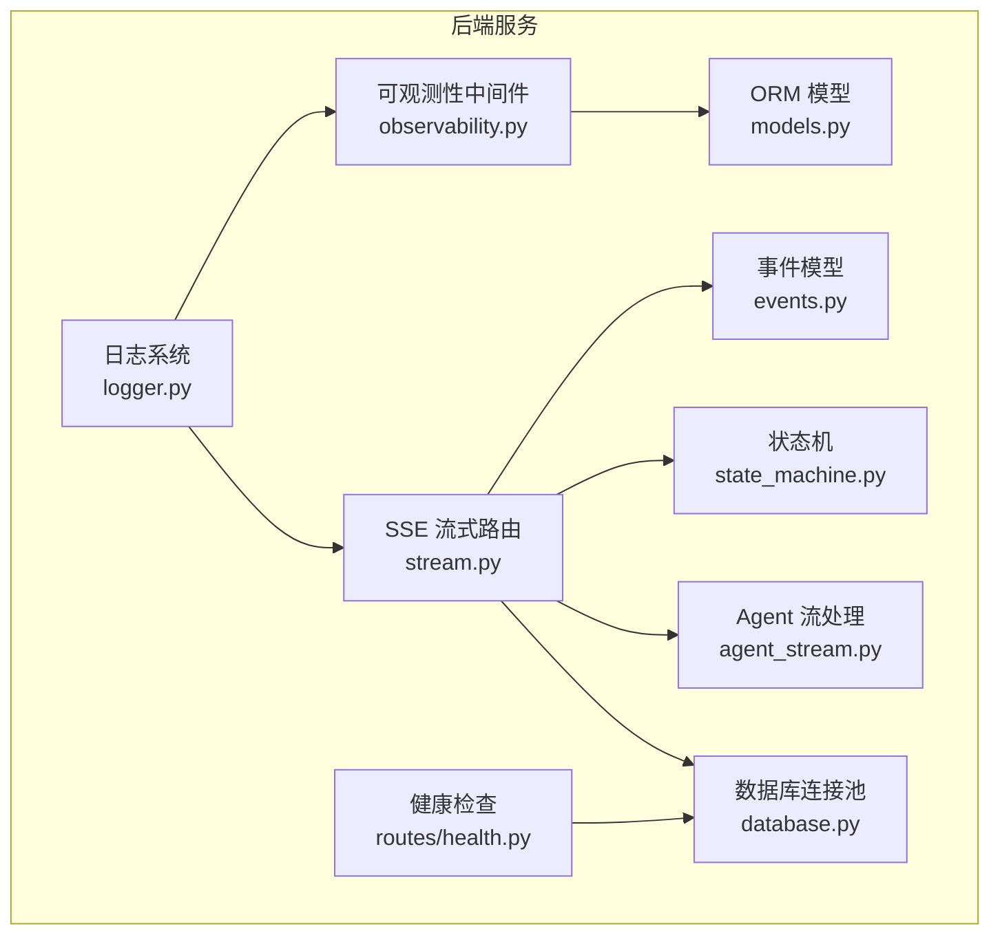
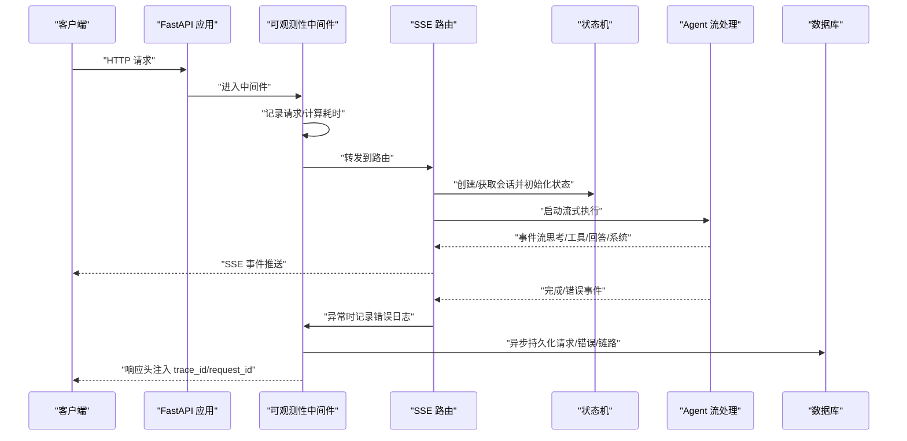
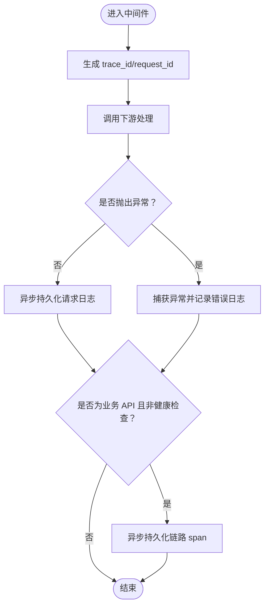
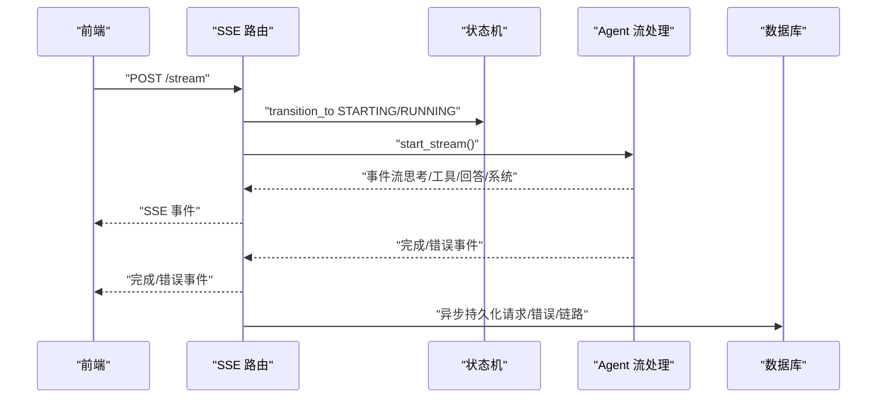
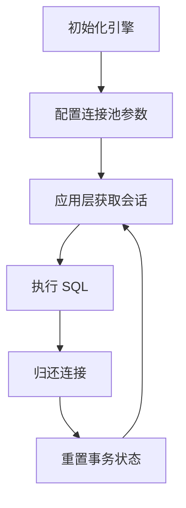
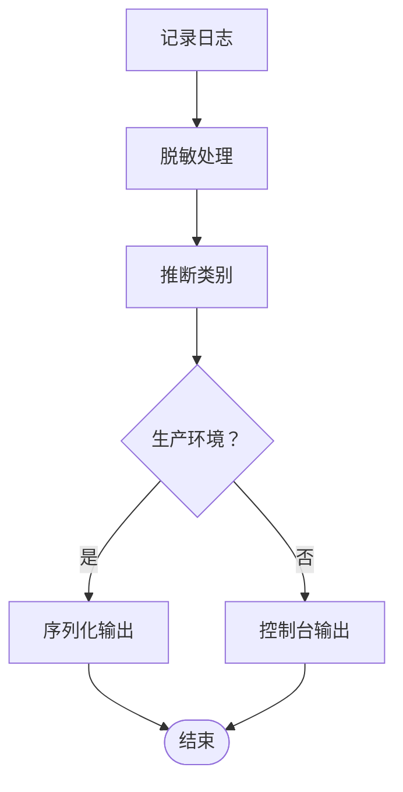
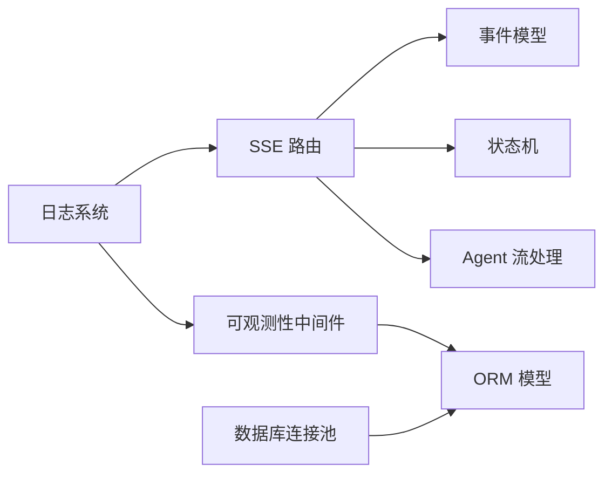

# 监控与告警

<cite>
**本文引用的文件**
- [observability.py](file://backend/middleware/observability.py)
- [stream.py](file://backend/agent/web/routes/stream.py)
- [events.py](file://backend/agent/web/streaming/events.py)
- [state_machine.py](file://backend/agent/web/streaming/state_machine.py)
- [agent_stream.py](file://backend/agent/web/streaming/agent_stream.py)
- [models.py](file://backend/models.py)
- [health.py](file://backend/routes/health.py)
- [database.py](file://backend/database.py)
- [logger.py](file://backend/core/logger.py)
</cite>

## 目录
1. [简介](#简介)
2. [项目结构](#项目结构)
3. [核心组件](#核心组件)
4. [架构总览](#架构总览)
5. [详细组件分析](#详细组件分析)
6. [依赖分析](#依赖分析)
7. [性能考量](#性能考量)
8. [故障排查指南](#故障排查指南)
9. [结论](#结论)
10. [附录](#附录)

## 简介
本文件面向监控与告警系统，围绕应用性能监控、错误追踪与健康检查机制进行系统化梳理，并结合仓库中的可观测性中间件、SSE 流式监控、数据库连接池监控以及日志采集策略，给出关键指标定义、告警规则配置建议、仪表板配置思路、通知渠道与故障排查流程。目标是帮助运维与开发团队建立稳定可靠的监控体系，保障服务可用性与用户体验。

## 项目结构
监控与告警相关的关键模块分布如下：
- 可观测性中间件：统一记录请求、错误与链路 span，落库异步化，避免阻塞主请求。
- SSE 流式监控：提供长连接事件流，包含心跳、状态事件与错误事件，便于前端实时感知。
- 数据库连接池：集中配置连接池参数，支持预检与回收策略，保障高并发稳定性。
- 日志系统：结构化日志、敏感信息脱敏、分类落盘与生产序列化输出。
- 健康检查：轻量级健康端点，便于探针与编排系统探测。

图表来源
- [observability.py:1-191](file://backend/middleware/observability.py#L1-L191)
- [stream.py:1-611](file://backend/agent/web/routes/stream.py#L1-L611)
- [events.py:1-415](file://backend/agent/web/streaming/events.py#L1-L415)
- [state_machine.py:1-247](file://backend/agent/web/streaming/state_machine.py#L1-L247)
- [agent_stream.py:1-800](file://backend/agent/web/streaming/agent_stream.py#L1-L800)
- [database.py:1-138](file://backend/database.py#L1-L138)
- [logger.py:1-252](file://backend/core/logger.py#L1-L252)
- [health.py:1-13](file://backend/routes/health.py#L1-L13)
- [models.py:200-251](file://backend/models.py#L200-L251)

章节来源
- [observability.py:1-191](file://backend/middleware/observability.py#L1-L191)
- [stream.py:1-611](file://backend/agent/web/routes/stream.py#L1-L611)
- [database.py:1-138](file://backend/database.py#L1-L138)
- [logger.py:1-252](file://backend/core/logger.py#L1-L252)
- [health.py:1-13](file://backend/routes/health.py#L1-L13)
- [models.py:200-251](file://backend/models.py#L200-L251)

## 核心组件
- 可观测性中间件：拦截请求，异步持久化请求日志、错误日志与链路 span，注入 trace_id/request_id 并在响应头透出。
- SSE 流式路由：提供 /stream 接口，支持心跳、状态事件、错误事件与完成事件，具备会话清理与并发保护。
- 事件模型：标准化事件类型（思考、工具调用、回答、系统事件等），便于前端渲染与后续分析。
- 状态机：管理 Agent 生命周期与状态转换，支持回调、错误处理与停止信号。
- 数据库连接池：集中配置 pool_size、max_overflow、pool_recycle、pool_pre_ping 等参数，提升稳定性。
- 日志系统：结构化输出、敏感信息脱敏、分类落盘与生产序列化，支持调试日志写入。
- 健康检查：/api/health 轻量端点，便于外部探针探测。

章节来源
- [observability.py:19-191](file://backend/middleware/observability.py#L19-L191)
- [stream.py:472-611](file://backend/agent/web/routes/stream.py#L472-L611)
- [events.py:15-53](file://backend/agent/web/streaming/events.py#L15-L53)
- [state_machine.py:26-247](file://backend/agent/web/streaming/state_machine.py#L26-L247)
- [database.py:72-112](file://backend/database.py#L72-L112)
- [logger.py:92-182](file://backend/core/logger.py#L92-L182)
- [health.py:9-12](file://backend/routes/health.py#L9-L12)

## 架构总览
下图展示从请求进入至落库与事件流输出的整体流程，包括可观测性中间件、SSE 事件生成、状态机与数据库交互。

图表来源
- [observability.py:19-191](file://backend/middleware/observability.py#L19-L191)
- [stream.py:231-470](file://backend/agent/web/routes/stream.py#L231-L470)
- [state_machine.py:102-151](file://backend/agent/web/streaming/state_machine.py#L102-L151)
- [agent_stream.py:476-791](file://backend/agent/web/streaming/agent_stream.py#L476-L791)
- [models.py:200-251](file://backend/models.py#L200-L251)

## 详细组件分析

### 可观测性中间件（请求日志、错误日志、链路 span）
- 功能要点
  - 在请求进入时生成 trace_id/request_id，注入到请求状态与响应头。
  - 记录方法、路径、状态码、延迟、用户信息、IP、UA、请求/响应大小。
  - 捕获异常并写入 APIErrorLog，必要时强制 flush 获取主键以建立关联。
  - 业务 API 生成 APITraceSpan，排除 /api/health。
  - 异步线程落库，避免阻塞主请求。
- 关键指标
  - QPS、P95/P99 延迟、错误率、错误类型分布、用户/来源地域分布。
  - 链路耗时与节点耗时（按路径聚合）。
- 告警规则建议
  - 延迟 P95 超过阈值持续 N 分钟。
  - 错误率超过阈值或错误类型占比异常上升。
  - 5xx/4xx 比例异常。
- 仪表板建议
  - 请求总量趋势、成功率、平均/分位延迟。
  - 错误类型 TopN、错误堆栈摘要。
  - 链路拓扑与时序热力图。

图表来源
- [observability.py:19-191](file://backend/middleware/observability.py#L19-L191)
- [models.py:200-251](file://backend/models.py#L200-L251)

章节来源
- [observability.py:19-191](file://backend/middleware/observability.py#L19-L191)
- [models.py:200-251](file://backend/models.py#L200-L251)

### SSE 流式监控（事件协议、心跳、状态与错误）
- 功能要点
  - /stream 提供 Server-Sent Events，包含初始状态、思考、工具调用、回答、完成与错误事件。
  - 支持心跳（HeartbeatEvent）保持连接活跃，避免代理/网关超时。
  - 会话管理：内存会话缓存、TTL 清理、并发冲突保护（同一会话先停止旧流）。
  - 错误事件：区分代理连接失败、配额不足等场景，前端友好提示。
- 关键指标
  - SSE 连接存活率、心跳间隔、事件吞吐、首字节延迟、完成率。
  - 会话生命周期（创建/清理）、内存占用（会话数与 TTL）。
- 告警规则建议
  - 心跳丢失（连续超时）。
  - 事件吞吐骤降或积压。
  - 会话数异常增长或清理失败。
- 仪表板建议
  - SSE 连接数、事件速率、错误事件占比。
  - 会话 TTL 触发次数、内存占用曲线。
  - 首字节延迟与完成时间分布。

图表来源
- [stream.py:231-470](file://backend/agent/web/routes/stream.py#L231-L470)
- [state_machine.py:102-151](file://backend/agent/web/streaming/state_machine.py#L102-L151)
- [agent_stream.py:476-791](file://backend/agent/web/streaming/agent_stream.py#L476-L791)
- [observability.py:79-151](file://backend/middleware/observability.py#L79-L151)

章节来源
- [stream.py:472-611](file://backend/agent/web/routes/stream.py#L472-L611)
- [events.py:15-53](file://backend/agent/web/streaming/events.py#L15-L53)
- [state_machine.py:26-247](file://backend/agent/web/streaming/state_machine.py#L26-L247)
- [agent_stream.py:476-800](file://backend/agent/web/streaming/agent_stream.py#L476-L800)

### 数据库连接池监控（参数与策略）
- 参数与策略
  - pool_size/max_overflow/pool_timeout：控制并发连接与等待超时。
  - pool_pre_ping：按需启用，避免陈旧连接导致的失败。
  - pool_recycle/reset_on_return：连接复用与归还时重置，降低脏连接风险。
  - connect_args：MySQL/PostgreSQL 超时参数，保障高延迟场景下的可用性。
- 关键指标
  - 连接池利用率、等待时间、连接回收次数、连接失败率。
- 告警规则建议
  - 连接池等待时间超阈值。
  - 连接回收频繁或连接失败率上升。
- 仪表板建议
  - 连接池使用率、等待队列长度、回收与失败统计。

图表来源
- [database.py:90-112](file://backend/database.py#L90-L112)

章节来源
- [database.py:72-112](file://backend/database.py#L72-L112)

### 日志收集策略（结构化、脱敏、分类与落盘）
- 结构化与脱敏
  - 自动注入 request_id/flow_id，敏感字段与文本内容脱敏。
  - 生产环境序列化输出，开发环境彩色格式与文件落盘。
- 分类与落盘
  - 按类别（backend/agent/latex/other）分目录滚动日志，保留 30 天。
- 调试日志
  - 提供专用调试日志写入接口（如 LaTeX/LLM 调试）。
- 告警与仪表板
  - 结合日志级别与关键词（如 ERROR/CRITICAL）进行告警。
  - 仪表板展示错误趋势、Top 错误类型与来源模块。

图表来源
- [logger.py:92-182](file://backend/core/logger.py#L92-L182)

章节来源
- [logger.py:92-252](file://backend/core/logger.py#L92-L252)

### 健康检查机制
- 轻量健康端点：/api/health 返回简单状态，便于探针探测。
- 建议
  - 结合数据库连接池健康状态与关键依赖（如外部 LLM 服务）进行复合健康检查。
  - 在编排系统中配置探针与自愈策略。

章节来源
- [health.py:9-12](file://backend/routes/health.py#L9-L12)

## 依赖分析
- 组件耦合
  - SSE 路由依赖事件模型、状态机与 Agent 流处理；可观测性中间件贯穿所有请求。
  - 数据库连接池为多模块共享，ORM 模型承载日志与链路数据。
- 外部依赖
  - 日志：loguru；数据库：SQLAlchemy；Web：FastAPI。
- 潜在风险
  - 落库异步化避免阻塞，但需关注队列积压与磁盘 IO。
  - SSE 心跳与状态机协作，需保证停止信号及时传播。

图表来源
- [stream.py:1-611](file://backend/agent/web/routes/stream.py#L1-L611)
- [events.py:1-415](file://backend/agent/web/streaming/events.py#L1-L415)
- [state_machine.py:1-247](file://backend/agent/web/streaming/state_machine.py#L1-L247)
- [agent_stream.py:1-800](file://backend/agent/web/streaming/agent_stream.py#L1-L800)
- [observability.py:1-191](file://backend/middleware/observability.py#L1-L191)
- [models.py:200-251](file://backend/models.py#L200-L251)
- [database.py:1-138](file://backend/database.py#L1-L138)
- [logger.py:1-252](file://backend/core/logger.py#L1-L252)

章节来源
- [stream.py:1-611](file://backend/agent/web/routes/stream.py#L1-L611)
- [observability.py:1-191](file://backend/middleware/observability.py#L1-L191)
- [models.py:200-251](file://backend/models.py#L200-L251)
- [database.py:1-138](file://backend/database.py#L1-L138)
- [logger.py:1-252](file://backend/core/logger.py#L1-L252)

## 性能考量
- 异步落库：可观测性中间件使用后台线程持久化日志，降低主请求延迟。
- 连接池优化：合理设置 pool_size 与 max_overflow，开启 pool_pre_ping 以减少陈旧连接。
- SSE 心跳：心跳间隔略小于代理/网关超时阈值，避免连接中断。
- 去重与幂等：Agent 流处理对重复内容进行去重，减少无效事件与存储压力。
- 资源限制：SSE 会话 TTL 控制内存增长，避免无界膨胀。

## 故障排查指南
- 请求异常与链路追踪
  - 通过 trace_id/request_id 定位请求全链路，核对 APIRequestLog 与 APITraceSpan。
  - 关注 APIErrorLog 中的错误类型与堆栈，定位根因。
- SSE 连接问题
  - 心跳缺失：检查代理/网关超时配置与网络质量。
  - 事件积压：查看会话数与 TTL 清理频率，评估并发负载。
  - 错误事件：根据错误事件内容判断是配额不足、代理失败还是其他异常。
- 数据库连接问题
  - 连接池等待时间过长：增大 pool_size 或 max_overflow，或优化慢查询。
  - 连接回收频繁：检查 pool_recycle 与 reset_on_return 配置。
- 日志与调试
  - 使用调试日志接口（如 LaTeX/LLM）定位特定模块问题。
  - 开启生产序列化输出以便于集中采集与分析。

章节来源
- [observability.py:79-151](file://backend/middleware/observability.py#L79-L151)
- [stream.py:231-470](file://backend/agent/web/routes/stream.py#L231-L470)
- [database.py:90-112](file://backend/database.py#L90-L112)
- [logger.py:225-251](file://backend/core/logger.py#L225-L251)

## 结论
本项目在可观测性、SSE 流式监控、数据库连接池与日志系统方面形成了较为完善的监控基础。建议在此基础上完善告警规则与仪表板，结合链路 span 与事件流数据，实现端到端的性能与可用性治理，持续优化连接池与 SSE 会话策略，保障高并发场景下的稳定性与用户体验。

## 附录
- 关键指标清单
  - 请求：QPS、P95/P99 延迟、错误率、错误类型分布。
  - SSE：连接存活率、心跳间隔、事件吞吐、首字节延迟、完成率。
  - 数据库：连接池利用率、等待时间、回收次数、失败率。
  - 日志：错误趋势、Top 错误类型、来源模块。
- 告警规则建议（示例）
  - 延迟 P95 超过阈值持续 N 分钟。
  - 错误率超过阈值或错误类型占比异常上升。
  - SSE 心跳丢失或事件吞吐骤降。
  - 连接池等待时间超阈值或连接失败率上升。
- 仪表板建议（示例）
  - 请求总量趋势、成功率、平均/分位延迟。
  - SSE 连接数、事件速率、错误事件占比。
  - 连接池使用率、等待队列长度、回收与失败统计。
  - 错误趋势、Top 错误类型与来源模块。