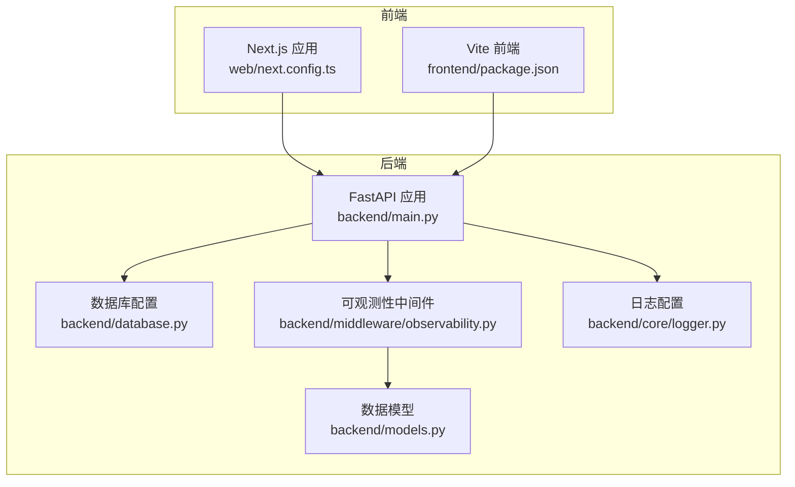
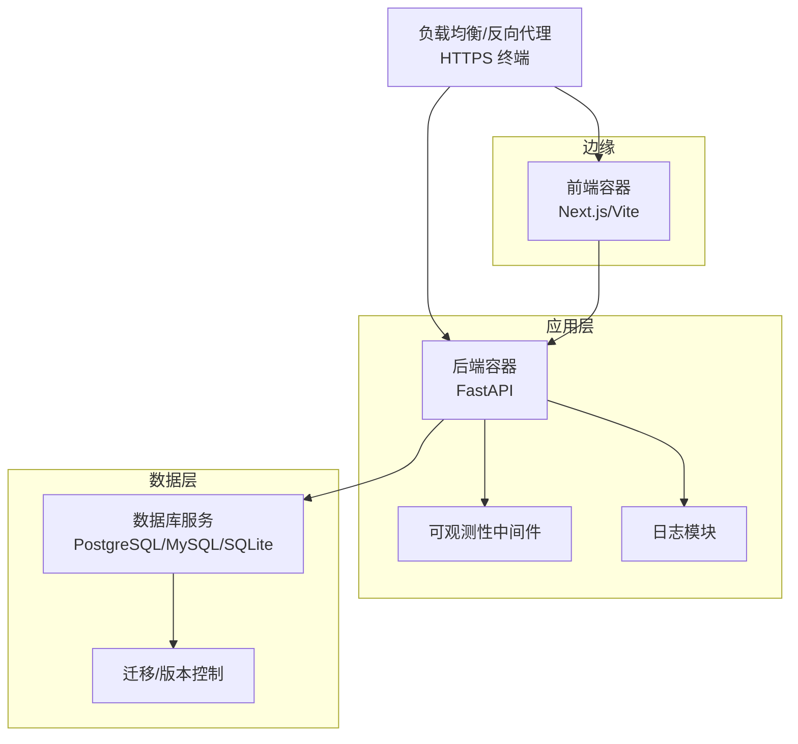
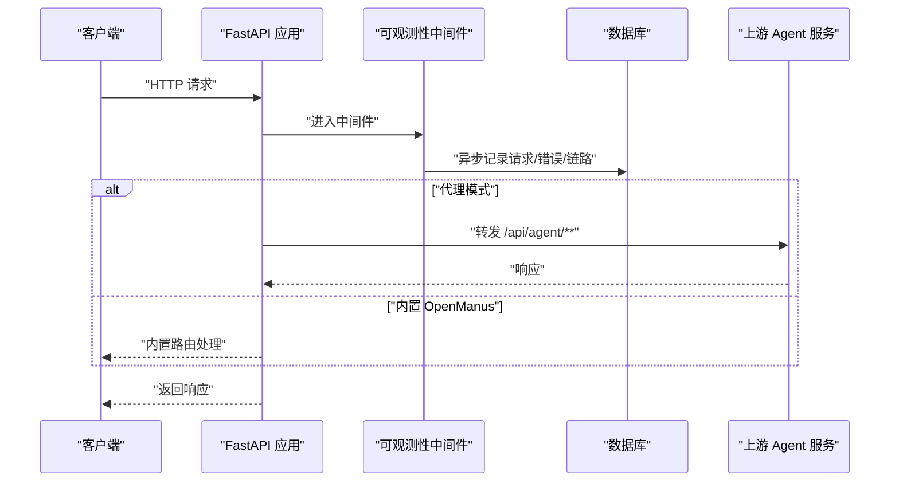
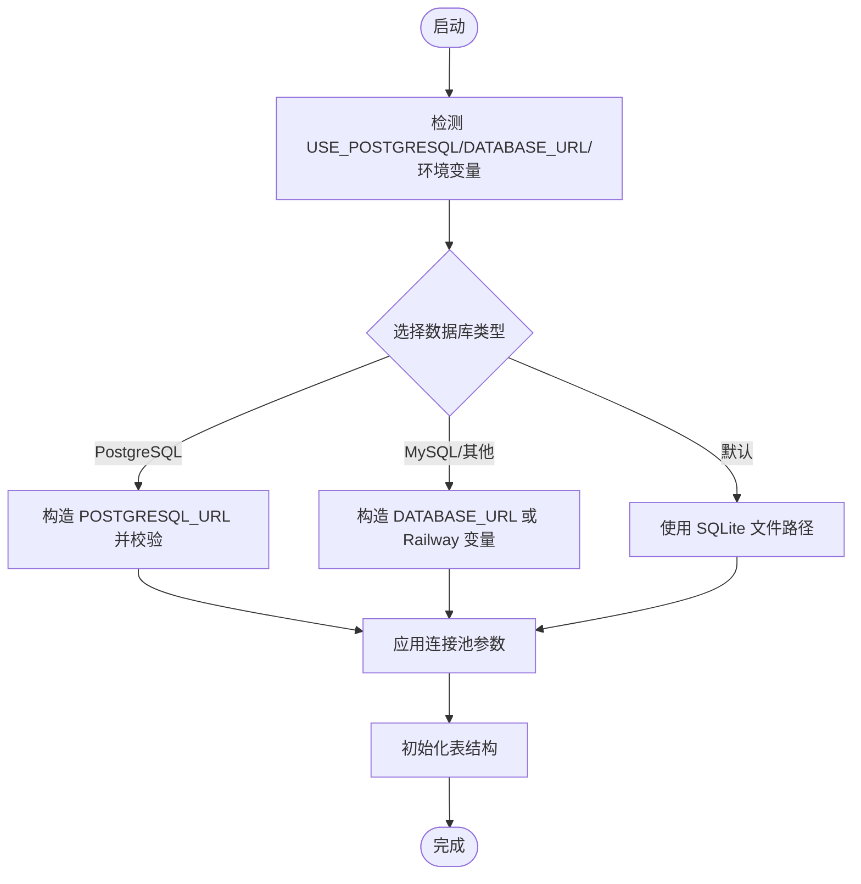
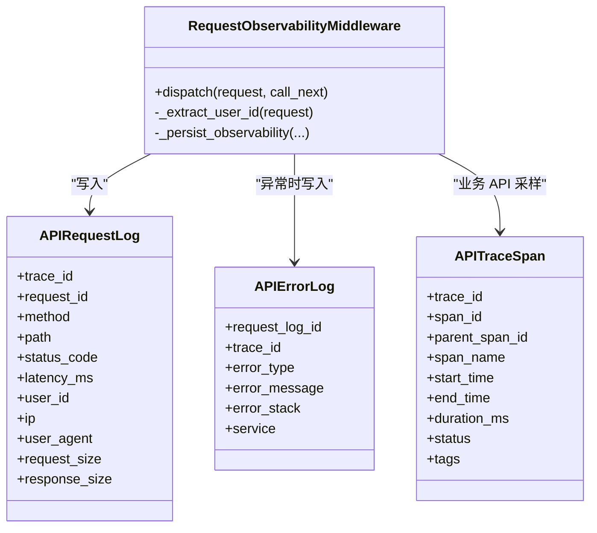
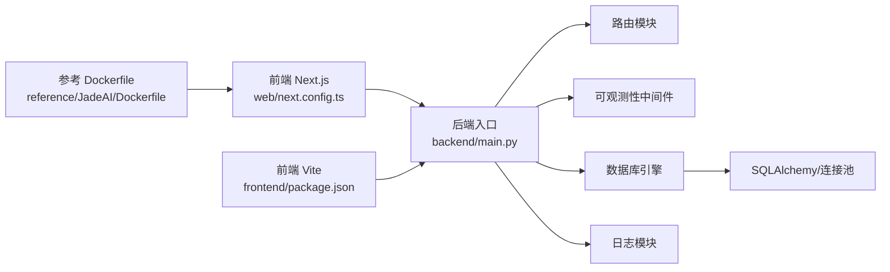

# 部署与运维

<cite>
**本文引用的文件**   
- [backend/main.py](file://backend/main.py)
- [backend/database.py](file://backend/database.py)
- [backend/middleware/observability.py](file://backend/middleware/observability.py)
- [backend/core/logger.py](file://backend/core/logger.py)
- [backend/models.py](file://backend/models.py)
- [requirements.txt](file://requirements.txt)
- [frontend/package.json](file://frontend/package.json)
- [web/next.config.ts](file://web/next.config.ts)
- [reference/JadeAI/Dockerfile](file://reference/JadeAI/Dockerfile)
- [auth-stack.env.example](file://auth-stack.env.example)
</cite>

## 目录
1. [简介](#简介)
2. [项目结构](#项目结构)
3. [核心组件](#核心组件)
4. [架构总览](#架构总览)
5. [详细组件分析](#详细组件分析)
6. [依赖分析](#依赖分析)
7. [性能考量](#性能考量)
8. [故障排查指南](#故障排查指南)
9. [结论](#结论)
10. [附录](#附录)

## 简介
本指南面向生产环境部署与运维，覆盖后端 FastAPI 服务、前端 Next.js 应用、数据库与可观测性、容器化与镜像构建、负载均衡与 SSL、CI/CD 与自动化部署、回滚与故障恢复、性能监控与日志、安全加固与合规建议。文档基于仓库中的实际代码与配置进行梳理，帮助团队建立稳定、可观测、可扩展的交付流水线。

## 项目结构
- 后端采用 FastAPI，入口位于 backend/main.py，集中注册路由与中间件，并支持可选的 TTS 路由与反向代理合并 OpenManus 能力。
- 数据库通过 backend/database.py 统一配置，支持 SQLite、MySQL 与 PostgreSQL，具备连接池参数与超时控制。
- 前端 Next.js 位于 web/ 目录，Vite 前端位于 frontend/ 目录；仓库提供参考 Dockerfile 用于 Next.js 生产镜像构建。
- 可观测性通过自定义中间件记录请求/错误/链路 Span，并持久化到数据库表。
- 日志通过 backend/core/logger.py 支持生产序列化输出与本地文件落盘，按类别分目录。

图表来源
- [backend/main.py:92-138](file://backend/main.py#L92-L138)
- [backend/database.py:25-112](file://backend/database.py#L25-L112)
- [backend/middleware/observability.py:170-191](file://backend/middleware/observability.py#L170-L191)
- [backend/core/logger.py:184-188](file://backend/core/logger.py#L184-L188)
- [backend/models.py:200-251](file://backend/models.py#L200-L251)

章节来源
- [backend/main.py:13-52](file://backend/main.py#L13-L52)
- [backend/database.py:18-67](file://backend/database.py#L18-L67)
- [backend/middleware/observability.py:19-76](file://backend/middleware/observability.py#L19-L76)
- [backend/core/logger.py:92-188](file://backend/core/logger.py#L92-L188)
- [backend/models.py:108-136](file://backend/models.py#L108-L136)

## 核心组件
- 应用入口与路由注册：后端入口集中注册健康检查、配置、简历、分享、认证、管理员、LeetCode、计费等路由，并支持可选 TTS 路由与 OpenManus 合并。
- 数据库适配：根据环境变量选择 PostgreSQL 或 MySQL/SQLite，统一连接池参数与超时，支持 Railway 环境变量兼容。
- 可观测性：中间件记录请求/错误/链路 Span，异步落库，避免阻塞主请求。
- 日志：支持生产序列化输出与本地文件落盘，按类别分目录，含敏感信息脱敏与清洗。
- 前端与镜像：Next.js 提供 web/ 目录，仓库提供参考 Dockerfile 用于生产镜像构建。

章节来源
- [backend/main.py:73-138](file://backend/main.py#L73-L138)
- [backend/database.py:25-112](file://backend/database.py#L25-L112)
- [backend/middleware/observability.py:170-191](file://backend/middleware/observability.py#L170-L191)
- [backend/core/logger.py:184-188](file://backend/core/logger.py#L184-L188)
- [web/next.config.ts:1-8](file://web/next.config.ts#L1-L8)
- [reference/JadeAI/Dockerfile:1-48](file://reference/JadeAI/Dockerfile#L1-L48)

## 架构总览
生产部署建议采用“前端容器 + 后端容器 + 数据库服务 + 反向代理/负载均衡 + SSL 终端”的模式。后端通过环境变量切换数据库类型与连接池参数，可观测性中间件与日志模块贯穿请求生命周期，确保可追踪与可诊断。

图表来源
- [backend/main.py:92-138](file://backend/main.py#L92-L138)
- [backend/database.py:25-112](file://backend/database.py#L25-L112)
- [backend/middleware/observability.py:170-191](file://backend/middleware/observability.py#L170-L191)
- [backend/core/logger.py:184-188](file://backend/core/logger.py#L184-L188)

## 详细组件分析

### 后端应用与路由
- 入口模块负责环境变量加载、CORS 配置、可观测性中间件注册与路由聚合。
- 支持可选 TTS 路由与 OpenManus 合并：当配置 AGENT_BACKEND_BASE_URL 时启用反向代理；否则加载内置 OpenManus 路由。
- 启动事件中执行连接预热（LLM SDK、数据库、Logo 同步、tiktoken 编码文件），降低首请求延迟。

图表来源
- [backend/main.py:141-225](file://backend/main.py#L141-L225)
- [backend/middleware/observability.py:19-76](file://backend/middleware/observability.py#L19-L76)

章节来源
- [backend/main.py:92-138](file://backend/main.py#L92-L138)
- [backend/main.py:228-316](file://backend/main.py#L228-L316)

### 数据库配置与连接池
- 支持 PostgreSQL/MySQL/SQLite 三种后端，自动转换连接串格式（如 Railway 的 MYSQL_URL）。
- 连接池参数可调：大小、溢出、超时、回收时间、pre_ping 等；PostgreSQL 支持连接超时。
- 提供初始化函数创建所有表，配合 Alembic 进行迁移。

图表来源
- [backend/database.py:25-112](file://backend/database.py#L25-L112)
- [backend/database.py:133-138](file://backend/database.py#L133-L138)

章节来源
- [backend/database.py:25-112](file://backend/database.py#L25-L112)
- [backend/database.py:133-138](file://backend/database.py#L133-L138)

### 可观测性中间件
- 记录请求/响应元数据、用户 ID、IP、UA、请求/响应体大小、耗时、状态码。
- 异常捕获并写入错误日志表，链路 Span 仅对业务 API 采样（排除健康检查）。
- 提供兜底异常处理器与 BrokenPipe 处理。

图表来源
- [backend/middleware/observability.py:19-191](file://backend/middleware/observability.py#L19-L191)
- [backend/models.py:200-251](file://backend/models.py#L200-L251)

章节来源
- [backend/middleware/observability.py:19-191](file://backend/middleware/observability.py#L19-L191)
- [backend/models.py:200-251](file://backend/models.py#L200-L251)

### 日志模块
- 生产模式使用序列化输出至 stdout，便于容器日志采集。
- 开发模式彩色终端输出，并可选写入按类别分目录的日志文件，保留 30 天并压缩。
- 内置敏感字段脱敏与消息清洗，避免泄露。

章节来源
- [backend/core/logger.py:92-188](file://backend/core/logger.py#L92-L188)

### 前端与镜像构建
- Next.js 位于 web/ 目录，提供基础配置模板。
- Vite 前端位于 frontend/ 目录，包含依赖与构建脚本。
- 参考 Dockerfile 用于 Next.js 生产镜像，包含 Chromium、字体与 PDF 导出依赖，暴露 3000 端口。

章节来源
- [web/next.config.ts:1-8](file://web/next.config.ts#L1-L8)
- [frontend/package.json:1-66](file://frontend/package.json#L1-L66)
- [reference/JadeAI/Dockerfile:1-48](file://reference/JadeAI/Dockerfile#L1-L48)

## 依赖分析
- 后端运行时依赖通过 requirements.txt 管理，涵盖 FastAPI、Uvicorn、SQLAlchemy、Alembic、认证与加密、浏览器自动化、搜索引擎、数据处理、LangChain、TTS 等。
- 前端依赖通过 package.json 管理，包含 React、PDF、Mermaid、Tailwind 等生态库。

图表来源
- [backend/main.py:73-138](file://backend/main.py#L73-L138)
- [backend/database.py:90-112](file://backend/database.py#L90-L112)
- [backend/middleware/observability.py:170-191](file://backend/middleware/observability.py#L170-L191)
- [backend/core/logger.py:184-188](file://backend/core/logger.py#L184-L188)
- [web/next.config.ts:1-8](file://web/next.config.ts#L1-L8)
- [frontend/package.json:1-66](file://frontend/package.json#L1-L66)
- [reference/JadeAI/Dockerfile:1-48](file://reference/JadeAI/Dockerfile#L1-L48)

章节来源
- [requirements.txt:1-90](file://requirements.txt#L1-L90)
- [frontend/package.json:1-66](file://frontend/package.json#L1-L66)

## 性能考量
- 启动预热：后端在启动阶段预热 LLM SDK 连接、数据库连接、Logo 同步与 tiktoken 编码文件，显著降低首请求延迟。
- 连接池：合理设置 pool_size、max_overflow、pool_timeout、pool_recycle 与 pre_ping，结合数据库类型选择最优参数。
- IO 与并发：可观测性中间件异步写日志，避免阻塞主请求；TTS 与外部服务调用建议使用异步客户端与超时控制。
- 前端渲染：PDF 导出依赖 Chromium 与字体，镜像构建已包含必要依赖，建议在容器内配置合适的 CPU/内存资源。

章节来源
- [backend/main.py:228-316](file://backend/main.py#L228-L316)
- [backend/database.py:78-112](file://backend/database.py#L78-L112)
- [reference/JadeAI/Dockerfile:24-30](file://reference/JadeAI/Dockerfile#L24-L30)

## 故障排查指南
- 健康检查：访问 /api/health 确认服务可用。
- 可观测性：通过 APIRequestLog、APIErrorLog、APITraceSpan 定位请求耗时、错误堆栈与链路状态。
- 数据库：检查 DATABASE_URL/USE_POSTGRESQL 配置与连接池参数；必要时开启 echo 查看 SQL。
- 日志：确认 LOG_MODE、LOG_LEVEL、LOG_DIR；生产模式输出序列化日志，开发模式输出彩色日志并落盘。
- 代理与合并：若启用 AGENT_BACKEND_BASE_URL，检查上游地址可达性与超时设置；否则确认内置 OpenManus 依赖是否齐全。

章节来源
- [backend/main.py:107-138](file://backend/main.py#L107-L138)
- [backend/middleware/observability.py:170-191](file://backend/middleware/observability.py#L170-L191)
- [backend/database.py:25-112](file://backend/database.py#L25-L112)
- [backend/core/logger.py:184-188](file://backend/core/logger.py#L184-L188)

## 结论
本指南基于仓库现有代码与配置，给出了生产部署的总体思路与落地要点：明确后端路由与可观测性、数据库适配与连接池、日志与容器镜像、以及可扩展的 CI/CD 与故障恢复策略。建议在实际环境中结合业务规模与合规要求，补充证书、密钥管理、备份与灾难恢复、WAF/防火墙与合规审计等环节。

## 附录

### 环境配置管理
- 后端环境变量示例：参考 BetterAuth 启用时的示例文件，包含内部 URL 与共享密钥。
- 数据库选择：通过 USE_POSTGRESQL 与 DATABASE_URL/POSTGRESQL_URL 控制；Railway 环境变量兼容。
- 日志与模式：LOG_MODE、LOG_LEVEL、LOG_DIR 控制输出与落盘行为。

章节来源
- [auth-stack.env.example:1-6](file://auth-stack.env.example#L1-L6)
- [backend/database.py:25-67](file://backend/database.py#L25-L67)
- [backend/core/logger.py:184-188](file://backend/core/logger.py#L184-L188)

### SSL 证书与 HTTPS 终端
- 在负载均衡/反向代理层配置 TLS 终止，建议使用 Let’s Encrypt 自动续期；后端容器暴露 HTTP 端口，代理负责加密传输。
- 证书与私钥管理建议通过密钥管理服务或编排平台注入，避免硬编码。

[本节为通用实践说明，无需源码引用]

### 数据库部署与缓存系统
- 数据库：优先使用托管 PostgreSQL/MySQL；如需 SQLite，请确保持久卷与备份策略。
- 缓存：可结合 Redis/内存缓存优化热点查询与会话状态；注意缓存一致性与失效策略。

[本节为通用实践说明，无需源码引用]

### CI/CD 流程与自动化部署
- 建议流水线步骤：代码检出 → 依赖安装 → 单元测试 → 镜像构建（后端/前端/Next.js） → 推送镜像 → 编排部署 → 健康检查 → 回滚策略。
- 回滚：采用蓝绿/滚动发布，保留上一版本镜像与配置，失败自动回滚。
- 故障恢复：结合可观测性指标与日志检索，快速定位异常并触发自动扩缩容或重启。

[本节为通用实践说明，无需源码引用]

### 性能监控、日志与告警
- 指标：QPS、P95/P99 延迟、错误率、数据库连接池使用率、CPU/内存占用。
- 日志：生产模式序列化输出，结合日志采集器集中存储；按类别分目录便于检索。
- 告警：基于阈值与趋势的告警策略，结合链路追踪与错误日志联动。

[本节为通用实践说明，无需源码引用]

### 安全加固与合规
- 密钥管理：使用密钥管理服务或编排平台注入，避免明文存储；定期轮换。
- 网络与访问控制：限制数据库与后端容器访问白名单；启用 WAF/防火墙。
- 合规：遵循数据最小化、数据留存期限、用户权利（访问/更正/删除）等要求；审计日志完整可追溯。

[本节为通用实践说明，无需源码引用]