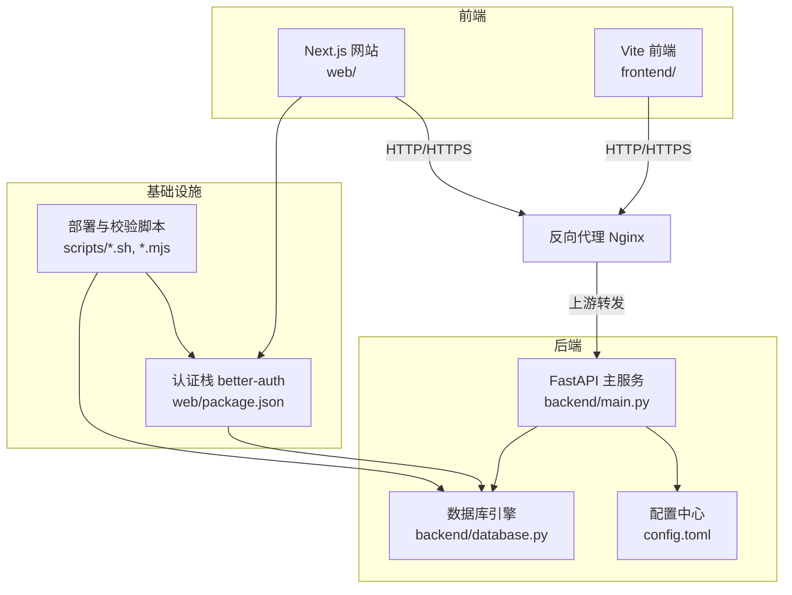
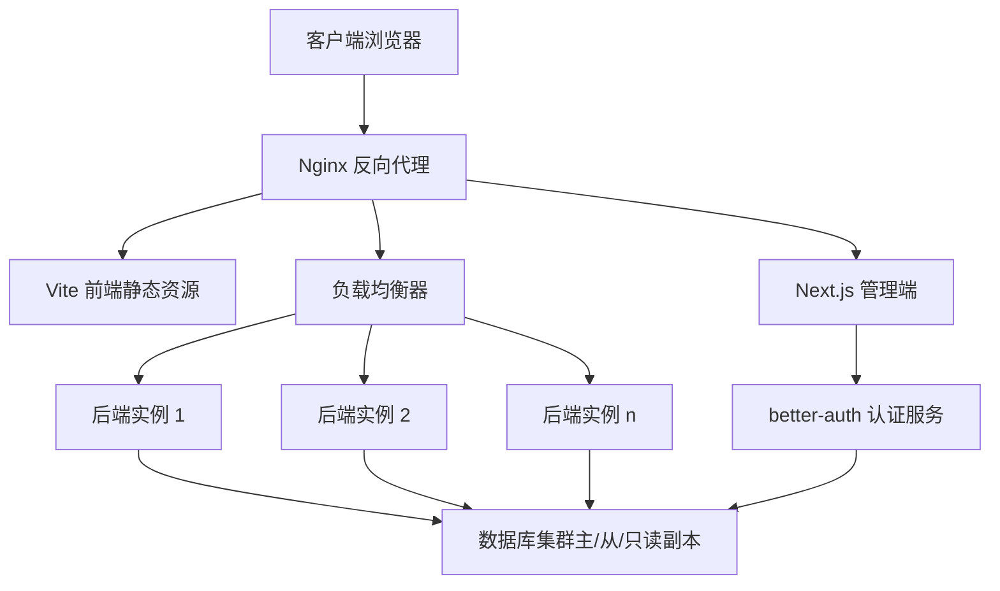
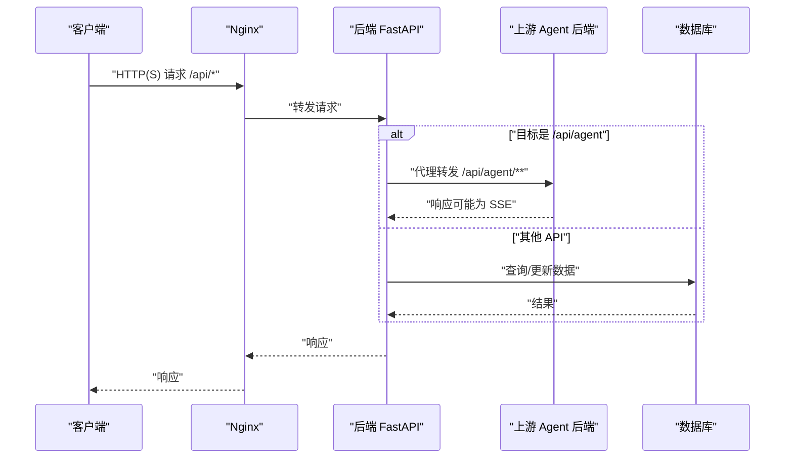
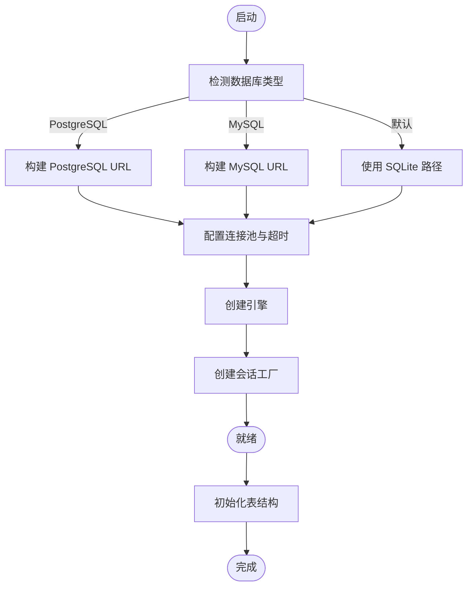
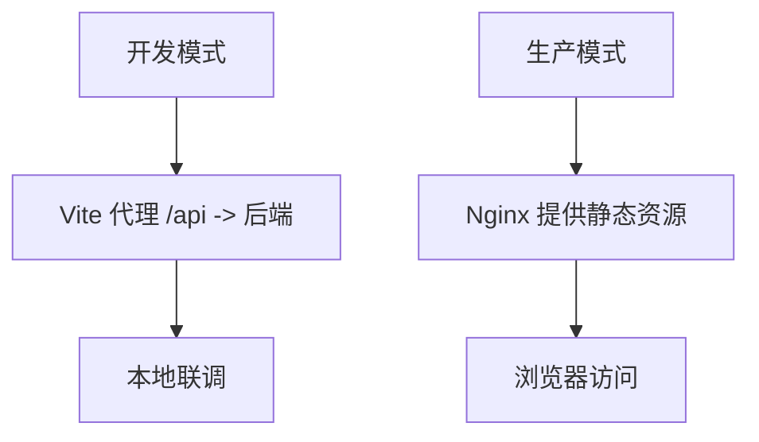
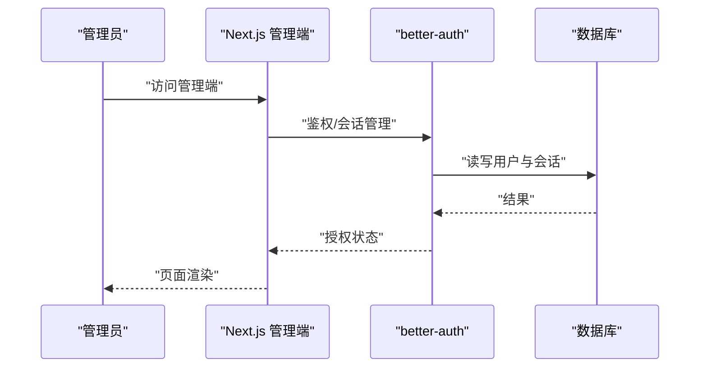
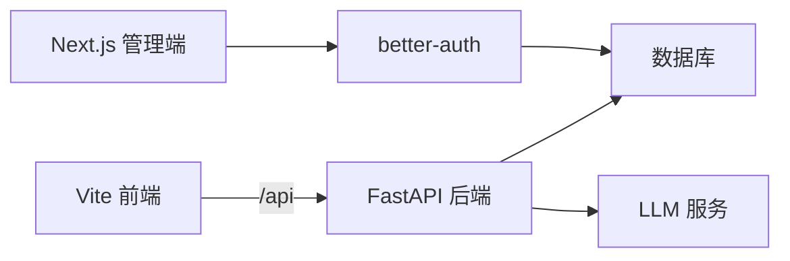

# 部署架构

<cite>
**本文引用的文件**
- [backend/main.py](file://backend/main.py)
- [backend/database.py](file://backend/database.py)
- [config.toml](file://config.toml)
- [requirements.txt](file://requirements.txt)
- [frontend/package.json](file://frontend/package.json)
- [frontend/vite.config.ts](file://frontend/vite.config.ts)
- [web/package.json](file://web/package.json)
- [web/next.config.ts](file://web/next.config.ts)
- [scripts/bootstrap-auth-env.sh](file://scripts/bootstrap-auth-env.sh)
- [scripts/check-auth-stack-env.sh](file://scripts/check-auth-stack-env.sh)
- [scripts/check-better-auth-db.mjs](file://scripts/check-better-auth-db.mjs)
- [scripts/migrate-better-auth-db.sh](file://scripts/migrate-better-auth-db.sh)
- [scripts/smoke-auth-stack.sh](file://scripts/smoke-auth-stack.sh)
- [knowledge-base/reviews/2026-06-23-production-deployment-runbook.md](file://knowledge-base/reviews/2026-06-23-production-deployment-runbook.md)
</cite>

## 目录
1. [引言](#引言)
2. [项目结构](#项目结构)
3. [核心组件](#核心组件)
4. [架构总览](#架构总览)
5. [详细组件分析](#详细组件分析)
6. [依赖关系分析](#依赖关系分析)
7. [性能考量](#性能考量)
8. [故障排查指南](#故障排查指南)
9. [结论](#结论)
10. [附录](#附录)

## 引言
本文件面向生产环境部署，系统性阐述 ResumeAgent 的部署拓扑、容器化编排、微服务架构、负载均衡、反向代理、数据库集群与认证体系、前后端分离策略、静态资源处理以及 SSL 证书配置。同时给出开发、测试、生产三类环境的差异与最佳实践，帮助团队安全、稳定、可扩展地交付系统。

## 项目结构
项目采用前后端分离与多子系统的工程组织方式：
- 后端（FastAPI）：提供 REST API、流式事件推送、健康检查、代理转发等能力，位于 backend 目录。
- 前端（Vite React）：简历编辑与展示界面，位于 frontend 目录。
- Web（Next.js）：认证与管理相关页面，位于 web 目录。
- 认证栈：基于 better-auth，配合数据库与环境脚本进行初始化与迁移。
- 配置与依赖：通过 requirements.txt、package.json、config.toml 等集中管理。

图表来源
- [backend/main.py:1-326](file://backend/main.py#L1-L326)
- [backend/database.py:1-138](file://backend/database.py#L1-L138)
- [config.toml:1-28](file://config.toml#L1-L28)
- [frontend/package.json:1-66](file://frontend/package.json#L1-L66)
- [frontend/vite.config.ts:1-159](file://frontend/vite.config.ts#L1-L159)
- [web/package.json:1-39](file://web/package.json#L1-L39)
- [web/next.config.ts:1-8](file://web/next.config.ts#L1-L8)

章节来源
- [backend/main.py:1-326](file://backend/main.py#L1-L326)
- [backend/database.py:1-138](file://backend/database.py#L1-L138)
- [config.toml:1-28](file://config.toml#L1-L28)
- [frontend/package.json:1-66](file://frontend/package.json#L1-L66)
- [frontend/vite.config.ts:1-159](file://frontend/vite.config.ts#L1-L159)
- [web/package.json:1-39](file://web/package.json#L1-L39)
- [web/next.config.ts:1-8](file://web/next.config.ts#L1-L8)

## 核心组件
- 后端 API 服务（FastAPI）
  - 提供健康检查、AI 测试、简历生成、PDF 渲染、鉴权、分享、图片、语义搜索、LeetCode、计费等路由。
  - 支持将 /api/agent 请求代理至独立 Agent 后端，或内嵌 OpenManus 路由。
  - 启动时进行连接预热（LLM、数据库、Logo 同步、编码器缓存）。
- 数据库层
  - 支持 PostgreSQL 与 MySQL（含 Railway 环境变量兼容），默认 SQLite 用于开发。
  - 提供连接池参数、超时、字符集等配置，适配高并发与长延迟网络。
- 前端与 Web
  - Vite React 前端通过代理将 /api 请求转发至后端；支持本地日志写入与开发代理目标切换。
  - Next.js 侧使用 better-auth 作为认证基础，提供数据库驱动与迁移脚本。
- 配置与依赖
  - config.toml 管理 LLM 与视觉模型参数；requirements.txt 管理 Python 依赖与版本约束。
  - 前端 package.json 定义构建与开发脚本；web/package.json 定义 Next.js 与 better-auth 依赖。

章节来源
- [backend/main.py:106-225](file://backend/main.py#L106-L225)
- [backend/database.py:25-112](file://backend/database.py#L25-L112)
- [frontend/vite.config.ts:46-159](file://frontend/vite.config.ts#L46-L159)
- [web/package.json:19-38](file://web/package.json#L19-L38)
- [config.toml:1-28](file://config.toml#L1-L28)
- [requirements.txt:1-90](file://requirements.txt#L1-L90)

## 架构总览
生产部署建议采用“反向代理 + 多实例 + 数据库集群 + 认证服务”的模式：
- 反向代理（Nginx）负责 TLS 终止、静态资源分发、上游转发与健康检查。
- 后端 API 服务以容器形式横向扩展，通过负载均衡对外提供服务。
- 数据库存储采用主从复制或托管集群，结合连接池与只读副本提升读扩展。
- 前端静态资源由 Nginx 提供，Next.js 与 Vite 前端分别部署于各自域名或路径。
- 认证服务（better-auth）与数据库配合，提供用户态与权限控制。

图表来源
- [backend/main.py:141-225](file://backend/main.py#L141-L225)
- [backend/database.py:79-112](file://backend/database.py#L79-L112)
- [web/package.json:19-38](file://web/package.json#L19-L38)

## 详细组件分析

### 后端 API 服务（FastAPI）
- 路由与功能
  - 健康检查、AI 测试、简历生成、PDF 渲染、鉴权、分享、图片、语义搜索、LeetCode、计费等。
  - /api/agent 路由支持代理到独立 Agent 后端或内嵌 OpenManus 路由。
- 启动优化
  - 预热 LLM 连接、数据库连接、Logo 同步、tiktoken 编码文件，降低首请求延迟。
- 安全与可观测
  - CORS 允许跨域；注册可观测性处理器；日志级别与输出可配置。

图表来源
- [backend/main.py:141-225](file://backend/main.py#L141-L225)
- [backend/main.py:228-316](file://backend/main.py#L228-L316)

章节来源
- [backend/main.py:106-225](file://backend/main.py#L106-L225)
- [backend/main.py:228-316](file://backend/main.py#L228-L316)

### 数据库层（SQLAlchemy）
- 连接选择
  - PostgreSQL：优先使用 psycopg3，支持统一连接字符串格式与超时配置。
  - MySQL：兼容 Railway 环境变量，自动转换连接协议。
  - 默认 SQLite：开发环境使用，路径固定。
- 连接池与超时
  - 可配置 pool_size、max_overflow、pool_timeout、pool_recycle、pool_pre_ping。
  - PostgreSQL 支持连接超时，失败时可快速回退。
- 初始化
  - 提供 init_db 方法创建所有表，配合 Alembic 进行迁移。

图表来源
- [backend/database.py:25-112](file://backend/database.py#L25-L112)
- [backend/database.py:133-138](file://backend/database.py#L133-L138)

章节来源
- [backend/database.py:25-112](file://backend/database.py#L25-L112)
- [backend/database.py:133-138](file://backend/database.py#L133-L138)

### 前端与静态资源（Vite + Nginx）
- 开发代理
  - 通过 /api 代理将请求转发至后端；支持切换本地/远程代理目标。
- 构建与部署
  - 生产环境由 Nginx 提供静态资源；前端通过 CDN 或对象存储可进一步优化。
- 日志与调试
  - 开发时将日志写入本地文件，便于定位问题。

图表来源
- [frontend/vite.config.ts:46-159](file://frontend/vite.config.ts#L46-L159)

章节来源
- [frontend/vite.config.ts:46-159](file://frontend/vite.config.ts#L46-L159)

### 认证与管理（Next.js + better-auth）
- 依赖与脚本
  - better-auth 作为认证核心；数据库驱动为 pg；提供环境校验、数据库检查、迁移等脚本。
- 部署要点
  - Next.js 与 Vite 前端可分别部署；认证服务独立维护，确保会话与权限稳定。

图表来源
- [web/package.json:19-38](file://web/package.json#L19-L38)

章节来源
- [web/package.json:19-38](file://web/package.json#L19-L38)
- [scripts/bootstrap-auth-env.sh](file://scripts/bootstrap-auth-env.sh)
- [scripts/check-auth-stack-env.sh](file://scripts/check-auth-stack-env.sh)
- [scripts/check-better-auth-db.mjs](file://scripts/check-better-auth-db.mjs)
- [scripts/migrate-better-auth-db.sh](file://scripts/migrate-better-auth-db.sh)
- [scripts/smoke-auth-stack.sh](file://scripts/smoke-auth-stack.sh)

### 配置与依赖
- LLM 与视觉模型
  - config.toml 中定义模型名称、基础地址、温度、最大令牌数、API 类型等。
- Python 依赖
  - requirements.txt 明确 FastAPI、Uvicorn、SQLAlchemy、Alembic、PostgreSQL 驱动、认证、浏览器自动化、搜索、数据处理、LangChain、TTS 等依赖版本。
- 前端依赖
  - frontend/package.json 定义 React、Vite、Tailwind、PDF、Mermaid、Markdown 等依赖。

章节来源
- [config.toml:1-28](file://config.toml#L1-L28)
- [requirements.txt:1-90](file://requirements.txt#L1-L90)
- [frontend/package.json:1-66](file://frontend/package.json#L1-L66)

## 依赖关系分析
- 组件耦合
  - 前端通过 /api 与后端交互；后端依赖数据库与 LLM 服务；认证服务独立但共享数据库。
- 外部依赖
  - PostgreSQL/MySQL 驱动、浏览器自动化、搜索引擎、PDF 处理、向量数据库扩展等。
- 潜在环路
  - 无直接循环依赖；认证与前端/后端通过接口解耦。

图表来源
- [backend/main.py:106-225](file://backend/main.py#L106-L225)
- [backend/database.py:79-112](file://backend/database.py#L79-L112)
- [web/package.json:19-38](file://web/package.json#L19-L38)

章节来源
- [backend/main.py:106-225](file://backend/main.py#L106-L225)
- [backend/database.py:79-112](file://backend/database.py#L79-L112)
- [web/package.json:19-38](file://web/package.json#L19-L38)

## 性能考量
- 连接池与超时
  - 合理设置 pool_size、max_overflow、pool_timeout、pool_recycle，避免连接争用与泄漏。
  - PostgreSQL 连接超时可快速失败，避免阻塞。
- 预热策略
  - 启动时预热数据库连接、LLM 连接、tiktoken 编码文件，降低首请求延迟。
- 代理与缓存
  - Nginx 提供静态资源缓存与压缩；对 /api 做健康检查与超时控制。
- 并发与伸缩
  - 后端以容器形式横向扩展，结合负载均衡实现弹性扩容。

## 故障排查指南
- 认证相关
  - 使用脚本进行环境校验、数据库检查与迁移，确保 better-auth 正常工作。
- 数据库连接
  - 检查连接字符串、驱动版本、连接池参数；关注 PostgreSQL 连接超时与回退逻辑。
- 代理与上游
  - 确认 /api/agent 代理目标可达；检查代理头与超时设置。
- 日志与可观测
  - 后端日志级别与输出路径；前端开发日志文件位置；Nginx 访问/错误日志。

章节来源
- [scripts/check-auth-stack-env.sh](file://scripts/check-auth-stack-env.sh)
- [scripts/check-better-auth-db.mjs](file://scripts/check-better-auth-db.mjs)
- [scripts/migrate-better-auth-db.sh](file://scripts/migrate-better-auth-db.sh)
- [backend/main.py:141-225](file://backend/main.py#L141-L225)
- [backend/database.py:79-112](file://backend/database.py#L79-L112)

## 结论
本部署架构以 Nginx 为边界，结合容器化与负载均衡实现高可用；后端通过连接池与启动预热保障性能；数据库支持 PostgreSQL/MySQL/SQLite；认证采用 better-auth 与 Next.js 管理端；前后端分离并由 Nginx 提供静态资源与代理。遵循本文的环境差异与最佳实践，可在开发、测试、生产环境中稳定落地。

## 附录

### 不同环境的部署差异与最佳实践
- 开发环境
  - 使用 SQLite 与本地 LLM；Vite 代理到本地后端；前端日志写入本地文件。
- 测试环境
  - 使用与生产相近的数据库驱动与连接池配置；启用健康检查与限流。
- 生产环境
  - 使用 PostgreSQL 集群；Nginx 终止 TLS 并做静态资源缓存；后端容器横向扩展；认证服务独立部署并定期迁移；监控与日志集中化。

章节来源
- [backend/database.py:64-67](file://backend/database.py#L64-L67)
- [frontend/vite.config.ts:46-159](file://frontend/vite.config.ts#L46-L159)
- [web/package.json:19-38](file://web/package.json#L19-L38)
- [knowledge-base/reviews/2026-06-23-production-deployment-runbook.md](file://knowledge-base/reviews/2026-06-23-production-deployment-runbook.md)