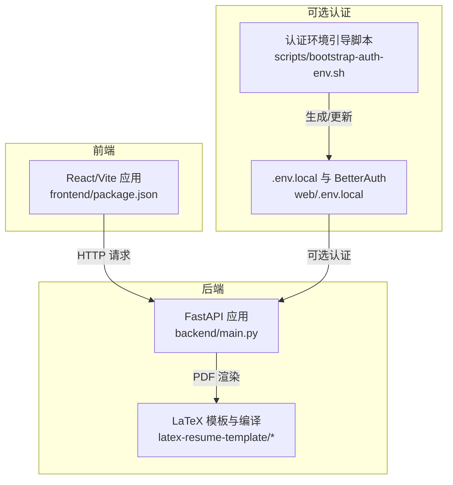
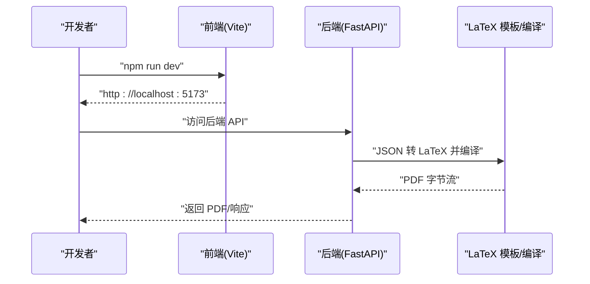
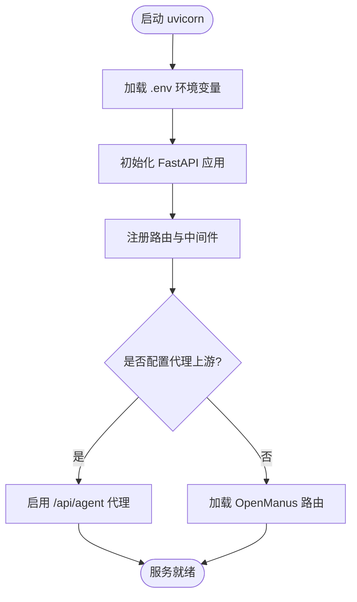
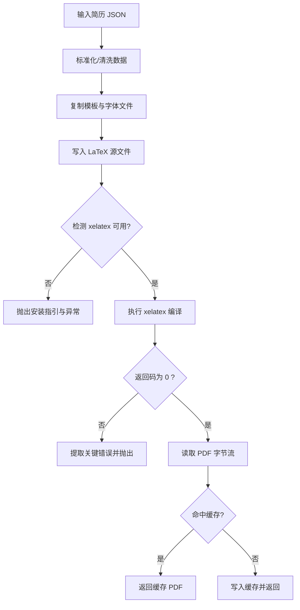
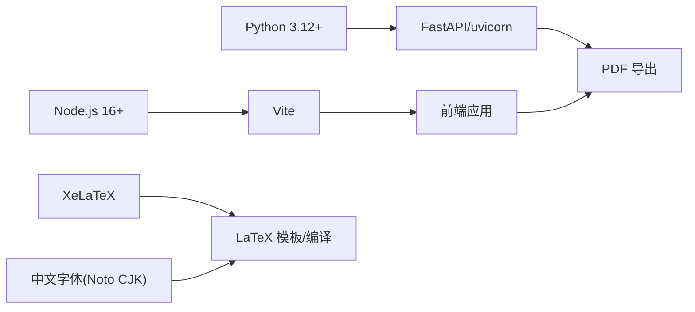

# 快速开始

<cite>
**本文引用的文件**   
- [README.md](file://README.md)
- [requirements.txt](file://requirements.txt)
- [backend/main.py](file://backend/main.py)
- [frontend/package.json](file://frontend/package.json)
- [latex-resume-template/Makefile](file://latex-resume-template/Makefile)
- [config.toml](file://config.toml)
- [auth-stack.env.example](file://auth-stack.env.example)
- [backend/latex_compiler.py](file://backend/latex_compiler.py)
- [backend/latex_generator.py](file://backend/latex_generator.py)
- [scripts/bootstrap-auth-env.sh](file://scripts/bootstrap-auth-env.sh)
- [scripts/dev-auth-web.sh](file://scripts/dev-auth-web.sh)
- [backend/check_and_setup.py](file://backend/check_and_setup.py)
- [reference/JadeAI/Dockerfile](file://reference/JadeAI/Dockerfile)
- [latex-resume-template/resume.cls](file://latex-resume-template/resume.cls)
</cite>

## 目录
1. [简介](#简介)
2. [项目结构](#项目结构)
3. [核心组件](#核心组件)
4. [架构概览](#架构概览)
5. [详细组件分析](#详细组件分析)
6. [依赖分析](#依赖分析)
7. [性能考虑](#性能考虑)
8. [故障排除指南](#故障排除指南)
9. [结论](#结论)
10. [附录](#附录)

## 简介
本指南面向新加入的开发者，帮助你在本地快速搭建并运行 Resume-Agent 项目。你将获得完整的环境要求、安装步骤、启动命令、访问地址、开发验证流程以及常见问题的解决方案。

## 项目结构
项目采用前后端分离架构：
- 后端：Python + FastAPI，提供 API 服务、PDF 渲染、数据库与认证集成等能力
- 前端：React + TypeScript + Vite，提供简历编辑、AI 对话、PDF 预览与导出等功能
- LaTeX 模板：用于高质量 PDF 导出，包含中文字体与样式配置
- 可选的 Next.js + BetterAuth 认证栈：通过脚本引导本地开发环境

**图示来源**
- [backend/main.py:1-326](file://backend/main.py#L1-L326)
- [frontend/package.json:1-66](file://frontend/package.json#L1-L66)
- [latex-resume-template/Makefile:1-26](file://latex-resume-template/Makefile#L1-L26)
- [scripts/bootstrap-auth-env.sh:1-204](file://scripts/bootstrap-auth-env.sh#L1-L204)

**章节来源**
- [README.md:52-86](file://README.md#L52-L86)
- [backend/main.py:92-139](file://backend/main.py#L92-L139)
- [frontend/package.json:6-11](file://frontend/package.json#L6-L11)

## 核心组件
- 后端服务入口与路由注册：FastAPI 应用启动、CORS、路由挂载与可观测性中间件
- LaTeX 渲染链路：JSON 转 LaTeX、模板复制、XeLaTeX 编译、PDF 输出与缓存
- 前端开发与构建：Vite 开发服务器、生产构建与预览
- 可选认证栈：Next.js + BetterAuth 的本地开发环境准备

**章节来源**
- [backend/main.py:92-139](file://backend/main.py#L92-L139)
- [backend/latex_generator.py:261-461](file://backend/latex_generator.py#L261-L461)
- [backend/latex_compiler.py:18-131](file://backend/latex_compiler.py#L18-L131)
- [frontend/package.json:6-11](file://frontend/package.json#L6-L11)

## 架构概览
下图展示了本地开发时的典型交互：前端通过 HTTP 访问后端 API，后端调用 LaTeX 渲染模块生成 PDF，可选地接入认证栈。

**图示来源**
- [backend/main.py:74-139](file://backend/main.py#L74-L139)
- [backend/latex_generator.py:463-676](file://backend/latex_generator.py#L463-L676)

## 详细组件分析

### 后端服务启动与路由
- 启动命令：使用 uvicorn 运行 backend.main:app，默认监听 127.0.0.1:9000
- 路由注册：健康检查、简历、PDF、分享、认证、LeetCode、计费等路由
- 可选代理：若配置 AGENT_BACKEND_BASE_URL，则将 /api/agent/** 代理至上游

**图示来源**
- [backend/main.py:28-52](file://backend/main.py#L28-L52)
- [backend/main.py:106-139](file://backend/main.py#L106-L139)
- [backend/main.py:141-225](file://backend/main.py#L141-L225)

**章节来源**
- [README.md:71-79](file://README.md#L71-L79)
- [backend/main.py:11-12](file://backend/main.py#L11-L12)
- [backend/main.py:141-225](file://backend/main.py#L141-L225)

### LaTeX 模板与编译
- 模板来源：latex-resume-template 目录包含 resume.cls、中文字体样式与字体资源
- 编译流程：复制模板文件与字体 → 写入 LaTeX 源 → 调用 xelatex → 产出 PDF
- 错误处理：捕获 xelatex 返回码与标准输出/错误，提取关键错误行并抛出异常
- 缓存机制：基于简历 JSON 与自定义顺序生成缓存键，内存缓存最多 50 份

**图示来源**
- [backend/latex_generator.py:261-461](file://backend/latex_generator.py#L261-L461)
- [backend/latex_compiler.py:18-131](file://backend/latex_compiler.py#L18-L131)
- [latex-resume-template/Makefile:1-26](file://latex-resume-template/Makefile#L1-L26)
- [latex-resume-template/resume.cls:1-125](file://latex-resume-template/resume.cls#L1-L125)

**章节来源**
- [backend/latex_generator.py:463-676](file://backend/latex_generator.py#L463-L676)
- [backend/latex_compiler.py:64-81](file://backend/latex_compiler.py#L64-L81)

### 前端开发与构建
- 开发：npm run dev 在本地启动 Vite 开发服务器，默认监听 5173 端口
- 构建：npm run build 生成静态资源
- 预览：npm run preview 在本地预览生产构建

**章节来源**
- [frontend/package.json:6-11](file://frontend/package.json#L6-L11)
- [README.md:87-91](file://README.md#L87-L91)

### 可选认证栈（Next.js + BetterAuth）
- 环境准备：脚本生成 web/.env.local，包含 BetterAuth URL、密钥、数据库 URL、代理允许来源等
- 启动：dev-auth-web.sh 启动 Next.js 认证壳（http://localhost:3000），同时后端保持运行（http://127.0.0.1:9000）

**章节来源**
- [scripts/bootstrap-auth-env.sh:172-200](file://scripts/bootstrap-auth-env.sh#L172-L200)
- [scripts/dev-auth-web.sh:6-14](file://scripts/dev-auth-web.sh#L6-L14)
- [auth-stack.env.example:1-6](file://auth-stack.env.example#L1-L6)

## 依赖分析
- Python 3.12+：后端运行时
- Node.js 16+：前端构建与开发
- XeLaTeX：LaTeX 模板 PDF 渲染
- 中文字体：Linux 建议安装 Noto CJK；模板内含中文字体样式与字体资源
- 后端依赖：通过 requirements.txt 管理，包含 FastAPI、uvicorn、报告生成、数据库驱动、浏览器自动化、搜索、LLM、LangChain、TTS 等
- 前端依赖：React、Vite、TailwindCSS、PDF 渲染与可视化相关库

**图示来源**
- [README.md:54-59](file://README.md#L54-L59)
- [requirements.txt:1-90](file://requirements.txt#L1-L90)
- [latex-resume-template/Makefile:1-26](file://latex-resume-template/Makefile#L1-L26)

**章节来源**
- [README.md:54-59](file://README.md#L54-L59)
- [requirements.txt:1-90](file://requirements.txt#L1-L90)

## 性能考虑
- 启动优化：后端启动时预热 HTTP 连接、数据库连接、tiktoken 编码文件，减少首次请求延迟
- PDF 缓存：基于简历内容与自定义顺序生成缓存键，内存缓存最多 50 份，命中后直接返回
- 编译超时：LaTeX 编译设置超时上限，避免长时间阻塞

**章节来源**
- [backend/main.py:228-316](file://backend/main.py#L228-L316)
- [backend/latex_generator.py:606-676](file://backend/latex_generator.py#L606-L676)
- [backend/latex_compiler.py:92-99](file://backend/latex_compiler.py#L92-L99)

## 故障排除指南
- XeLaTeX 未安装
  - 现象：LaTeX 编译时报错提示 xelatex 命令未找到
  - 处理：根据提示安装 BasicTeX 或 MacTeX，并重新启动终端使 PATH 生效
  - 参考：LaTeX 编译模块提供的安装指引

- 中文字体渲染异常
  - 现象：PDF 中文显示异常或缺字
  - 处理：确保系统已安装 Noto CJK；模板内包含中文字体样式与字体资源，确认字体路径与权限

- 数据库相关问题
  - 现象：数据库连接失败或迁移失败
  - 处理：使用 check_and_setup.py 脚本检查 MySQL 服务、数据库存在性与迁移状态；按提示创建数据库并执行迁移

- 认证环境未就绪
  - 现象：启动 Next.js 认证壳报错或无法登录
  - 处理：运行 bootstrap-auth-env.sh 生成/更新 web/.env.local；必要时使用 --write-root-env 将手过渡口密钥写入根 .env

- 端口冲突
  - 现象：启动失败或端口被占用
  - 处理：调整后端端口（默认 9000）或前端端口（默认 5173），确保未被占用

**章节来源**
- [backend/latex_compiler.py:64-81](file://backend/latex_compiler.py#L64-L81)
- [backend/latex_generator.py:543-560](file://backend/latex_generator.py#L543-L560)
- [backend/check_and_setup.py:21-82](file://backend/check_and_setup.py#L21-L82)
- [scripts/bootstrap-auth-env.sh:172-200](file://scripts/bootstrap-auth-env.sh#L172-L200)

## 结论
按照本指南完成环境准备、依赖安装与启动后，你可以在本地顺畅地进行前端开发与后端 API 调用，并通过 LaTeX 模板生成高质量 PDF。遇到问题时，可依据故障排除指南快速定位与解决。

## 附录

### 环境要求与安装步骤
- 环境要求
  - Python 3.12+
  - Node.js 16+
  - XeLaTeX
  - 中文字体（Linux 建议安装 Noto CJK）

- 安装步骤
  - 克隆仓库并进入项目目录
  - 安装后端依赖：pip 安装 requirements.txt
  - 安装前端依赖：cd frontend && npm install

- 启动服务
  - 后端：python -m uvicorn backend.main:app --host 127.0.0.1 --port 9000
  - 前端：cd frontend && npm run dev

- 访问地址
  - 前端：http://localhost:5173
  - 后端 API：http://127.0.0.1:9000
  - OpenAPI 文档：http://127.0.0.1:9000/docs

- 开发验证
  - 前端：cd frontend && npm run build
  - 后端：按需运行 pytest 或针对目标模块的测试

**章节来源**
- [README.md:52-91](file://README.md#L52-L91)

### 配置参考
- LLM 与智谱配置：config.toml 中包含 DeepSeek 与智谱模型的基础配置，API Key 从环境变量注入
- 认证栈示例：auth-stack.env.example 展示了 BetterAuth 相关的环境变量示例

**章节来源**
- [config.toml:1-28](file://config.toml#L1-L28)
- [auth-stack.env.example:1-6](file://auth-stack.env.example#L1-L6)

### 可选认证栈脚本
- 生成/更新 web/.env.local：scripts/bootstrap-auth-env.sh
- 启动 Next.js 认证壳：scripts/dev-auth-web.sh

**章节来源**
- [scripts/bootstrap-auth-env.sh:1-204](file://scripts/bootstrap-auth-env.sh#L1-L204)
- [scripts/dev-auth-web.sh:1-15](file://scripts/dev-auth-web.sh#L1-L15)

### Docker 参考
- 参考镜像：Dockerfile（Node 22 + Chromium + CJK 字体）展示了生产环境的依赖与字体配置思路

**章节来源**
- [reference/JadeAI/Dockerfile:1-48](file://reference/JadeAI/Dockerfile#L1-L48)