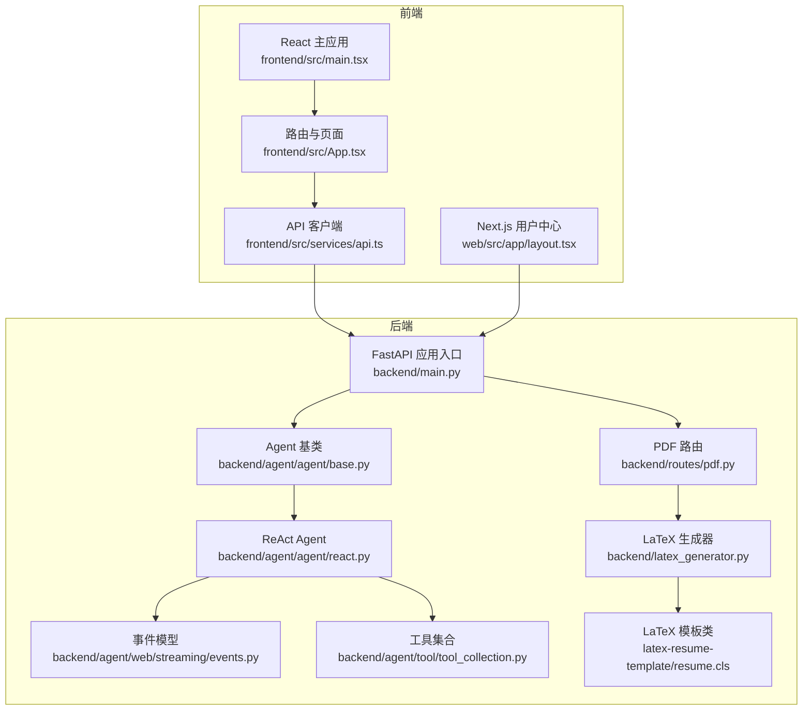
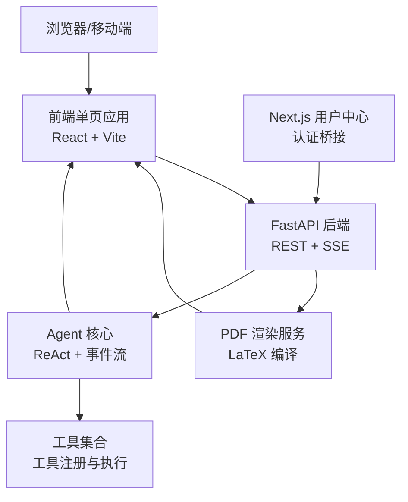
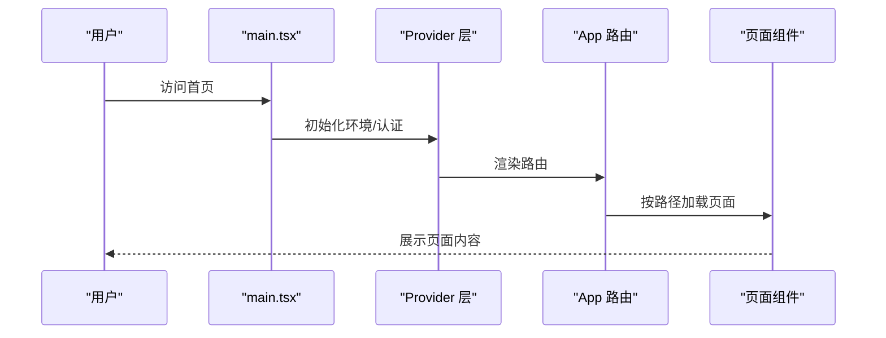
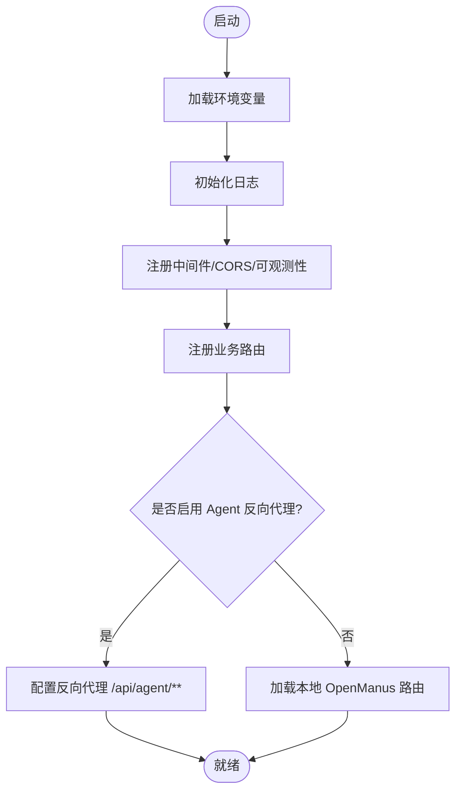
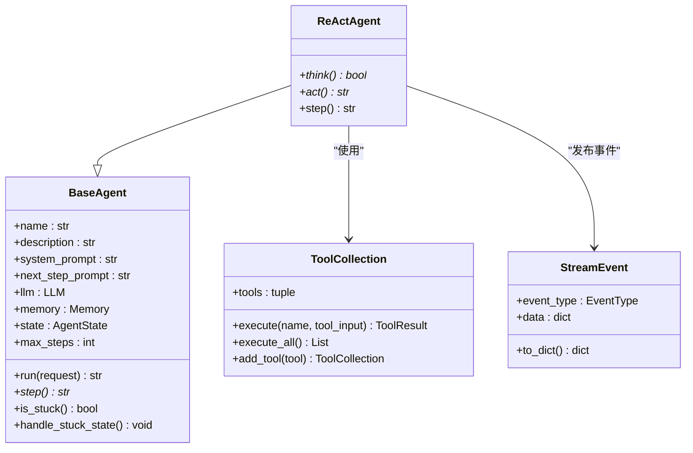
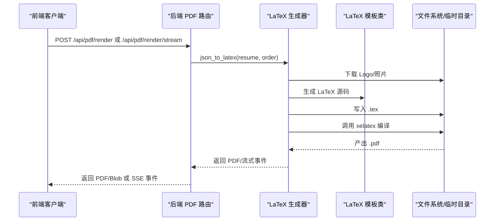
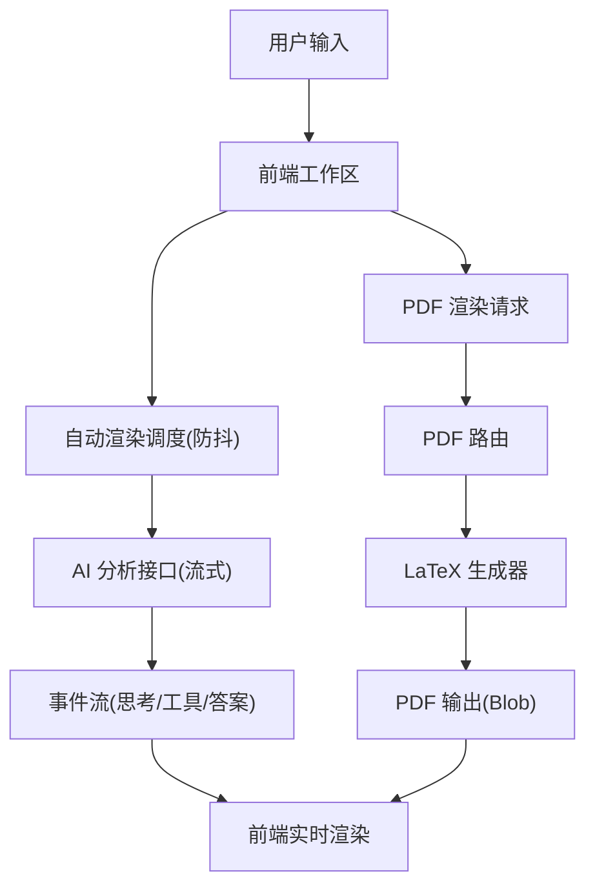
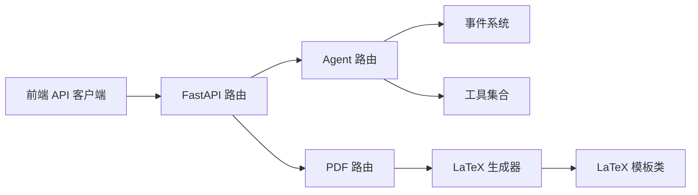

# 技术架构

<cite>
**本文引用的文件**
- [backend/main.py](file://backend/main.py)
- [frontend/src/main.tsx](file://frontend/src/main.tsx)
- [web/src/app/layout.tsx](file://web/src/app/layout.tsx)
- [backend/agent/agent/base.py](file://backend/agent/agent/base.py)
- [backend/agent/agent/react.py](file://backend/agent/agent/react.py)
- [backend/agent/web/streaming/events.py](file://backend/agent/web/streaming/events.py)
- [backend/agent/tool/tool_collection.py](file://backend/agent/tool/tool_collection.py)
- [frontend/src/App.tsx](file://frontend/src/App.tsx)
- [frontend/src/services/api.ts](file://frontend/src/services/api.ts)
- [backend/routes/pdf.py](file://backend/routes/pdf.py)
- [latex-resume-template/resume.cls](file://latex-resume-template/resume.cls)
- [backend/latex_generator.py](file://backend/latex_generator.py)
</cite>

## 目录
1. [引言](#引言)
2. [项目结构](#项目结构)
3. [核心组件](#核心组件)
4. [架构总览](#架构总览)
5. [详细组件分析](#详细组件分析)
6. [依赖分析](#依赖分析)
7. [性能考虑](#性能考虑)
8. [故障排查指南](#故障排查指南)
9. [结论](#结论)
10. [附录](#附录)

## 引言
本技术架构文档面向 Resume-Agent 项目的开发者与维护者，系统性阐述前后端分离架构、AI 代理系统（Agent）架构模式、工具调用机制与事件系统、以及 PDF 导出与 LaTeX 模板体系。文档旨在帮助读者快速理解整体数据流与组件关系，掌握关键实现要点与扩展路径。

## 项目结构
项目采用典型的前后端分离架构：
- 前端
  - React + TypeScript + Vite：负责用户界面、交互与 PDF 预览。
  - Next.js（web 子项目）：作为轻量的用户中心与认证桥接层。
- 后端
  - FastAPI：提供 REST API 与 SSE 流式接口，承载 AI 分析、简历处理与 PDF 渲染。
  - Agent 子系统：基于 ReAct 思维-行动范式的智能体框架，支持工具调用与事件流。
  - LaTeX 模板与编译：将简历 JSON 转换为 PDF，支持流式编译与进度反馈。

图表来源
- [backend/main.py:1-326](file://backend/main.py#L1-L326)
- [frontend/src/main.tsx:1-25](file://frontend/src/main.tsx#L1-L25)
- [web/src/app/layout.tsx:1-34](file://web/src/app/layout.tsx#L1-L34)
- [backend/routes/pdf.py:1-380](file://backend/routes/pdf.py#L1-L380)
- [backend/agent/agent/base.py:1-199](file://backend/agent/agent/base.py#L1-L199)
- [backend/agent/agent/react.py:1-39](file://backend/agent/agent/react.py#L1-L39)
- [backend/agent/web/streaming/events.py:1-415](file://backend/agent/web/streaming/events.py#L1-L415)
- [backend/agent/tool/tool_collection.py:1-74](file://backend/agent/tool/tool_collection.py#L1-L74)
- [backend/latex_generator.py:1-676](file://backend/latex_generator.py#L1-L676)
- [latex-resume-template/resume.cls:1-125](file://latex-resume-template/resume.cls#L1-L125)

章节来源
- [backend/main.py:1-326](file://backend/main.py#L1-L326)
- [frontend/src/main.tsx:1-25](file://frontend/src/main.tsx#L1-L25)
- [web/src/app/layout.tsx:1-34](file://web/src/app/layout.tsx#L1-L34)

## 核心组件
- 前端应用
  - React 主入口负责初始化主题、认证与根组件挂载。
  - App 组件集中管理路由、权限与页面懒加载。
  - API 客户端封装后端接口，支持流式渲染 PDF、记录配额、鉴权头注入等。
- 后端应用
  - FastAPI 入口集中注册路由、中间件与可观测性钩子，支持反向代理合并 Agent 后端。
  - PDF 路由提供非流式与流式渲染接口，支持 SSE 进度事件与配额控制。
- Agent 子系统
  - BaseAgent 提供状态机、记忆体与执行循环；ReActAgent 规范思维-行动步骤。
  - 事件系统定义了生命周期、思考、工具调用、答案与简历事件等类型。
  - 工具集合负责工具注册、参数序列化与执行结果封装。
- LaTeX 模板与编译
  - LaTeX 生成器将简历 JSON 转换为 LaTeX 源码，下载资源并编译为 PDF。
  - 模板类定义文档类、字体、版式与时间列等核心排版。

章节来源
- [frontend/src/App.tsx:1-111](file://frontend/src/App.tsx#L1-L111)
- [frontend/src/services/api.ts:1-800](file://frontend/src/services/api.ts#L1-L800)
- [backend/main.py:1-326](file://backend/main.py#L1-L326)
- [backend/routes/pdf.py:1-380](file://backend/routes/pdf.py#L1-L380)
- [backend/agent/agent/base.py:1-199](file://backend/agent/agent/base.py#L1-L199)
- [backend/agent/agent/react.py:1-39](file://backend/agent/agent/react.py#L1-L39)
- [backend/agent/web/streaming/events.py:1-415](file://backend/agent/web/streaming/events.py#L1-L415)
- [backend/agent/tool/tool_collection.py:1-74](file://backend/agent/tool/tool_collection.py#L1-L74)
- [backend/latex_generator.py:1-676](file://backend/latex_generator.py#L1-L676)
- [latex-resume-template/resume.cls:1-125](file://latex-resume-template/resume.cls#L1-L125)

## 架构总览
系统采用“前端单页应用 + 后端 API + LaTeX 编译”的组合方案：
- 前端通过 REST 与 SSE 与后端交互，实现简历生成、AI 改写与 PDF 渲染。
- 后端提供统一入口，聚合 PDF 渲染、配额控制、鉴权与可观测性。
- Agent 子系统通过事件流驱动前端 UI，实现“所见即所得”的智能体验。
- LaTeX 模板与编译器确保高质量 PDF 输出，支持流式进度反馈。

图表来源
- [backend/main.py:1-326](file://backend/main.py#L1-L326)
- [frontend/src/services/api.ts:1-800](file://frontend/src/services/api.ts#L1-L800)
- [backend/routes/pdf.py:1-380](file://backend/routes/pdf.py#L1-L380)
- [backend/agent/agent/react.py:1-39](file://backend/agent/agent/react.py#L1-L39)
- [backend/agent/tool/tool_collection.py:1-74](file://backend/agent/tool/tool_collection.py#L1-L74)

## 详细组件分析

### 前端应用与路由
- React 主入口负责环境与认证初始化，随后渲染顶层 Provider 与 App。
- App 组件集中管理路由表、权限校验与页面懒加载，支持工作区、聊天、账户、定价等页面。
- 路由切换与权限联动，确保管理员与登录态的可见性。

图表来源
- [frontend/src/main.tsx:1-25](file://frontend/src/main.tsx#L1-L25)
- [frontend/src/App.tsx:1-111](file://frontend/src/App.tsx#L1-L111)

章节来源
- [frontend/src/main.tsx:1-25](file://frontend/src/main.tsx#L1-L25)
- [frontend/src/App.tsx:1-111](file://frontend/src/App.tsx#L1-L111)

### 后端 FastAPI 入口与路由
- 入口模块集中加载环境变量、日志与中间件，注册健康检查、配置、简历、PDF、分享、认证、LeetCode、账单等路由。
- 支持可选的 TTS 路由与可观测性钩子。
- 提供 Agent 合并路由：可通过反向代理转发至独立 Agent 后端，或在本地加载 OpenManus 路由。

图表来源
- [backend/main.py:1-326](file://backend/main.py#L1-L326)

章节来源
- [backend/main.py:1-326](file://backend/main.py#L1-L326)

### AI 代理系统（Agent）架构
- BaseAgent
  - 提供状态机（IDLE/RUNNING/FINISHED/ERROR）、记忆体（Message 列表）与执行循环。
  - 支持重复检测与“卡住”处理，防止无效循环。
- ReActAgent
  - 规范化“思考-行动”两步法：think 决策下一步动作，act 执行动作。
- 事件系统
  - 定义生命周期、思考、工具调用、答案与简历事件等类型，便于前端实时渲染。
- 工具集合
  - 统一工具注册、参数序列化与执行结果封装，支持失败回退与批量执行。

图表来源
- [backend/agent/agent/base.py:1-199](file://backend/agent/agent/base.py#L1-L199)
- [backend/agent/agent/react.py:1-39](file://backend/agent/agent/react.py#L1-L39)
- [backend/agent/tool/tool_collection.py:1-74](file://backend/agent/tool/tool_collection.py#L1-L74)
- [backend/agent/web/streaming/events.py:1-415](file://backend/agent/web/streaming/events.py#L1-L415)

章节来源
- [backend/agent/agent/base.py:1-199](file://backend/agent/agent/base.py#L1-L199)
- [backend/agent/agent/react.py:1-39](file://backend/agent/agent/react.py#L1-L39)
- [backend/agent/web/streaming/events.py:1-415](file://backend/agent/web/streaming/events.py#L1-L415)
- [backend/agent/tool/tool_collection.py:1-74](file://backend/agent/tool/tool_collection.py#L1-L74)

### PDF 导出与 LaTeX 模板系统
- PDF 路由
  - 提供非流式与流式渲染接口，支持 SSE 进度事件与配额控制。
  - 支持直接编译 LaTeX 源码与流式编译，便于前端实时预览。
- LaTeX 生成器
  - 将简历 JSON 标准化后转换为 LaTeX 源码，下载公司/学校 Logo 与用户照片，编译为 PDF。
  - 支持缓存策略，避免重复编译。
- LaTeX 模板类
  - 定义文档类、字体、版式、时间列与联系信息等核心排版元素。

图表来源
- [backend/routes/pdf.py:1-380](file://backend/routes/pdf.py#L1-L380)
- [backend/latex_generator.py:1-676](file://backend/latex_generator.py#L1-L676)
- [latex-resume-template/resume.cls:1-125](file://latex-resume-template/resume.cls#L1-L125)

章节来源
- [backend/routes/pdf.py:1-380](file://backend/routes/pdf.py#L1-L380)
- [backend/latex_generator.py:1-676](file://backend/latex_generator.py#L1-L676)
- [latex-resume-template/resume.cls:1-125](file://latex-resume-template/resume.cls#L1-L125)

### 数据流架构
- 用户输入处理
  - 前端工作区收集简历数据，触发自动渲染（防抖）与配额记录。
- AI 分析流程
  - 前端通过 API 客户端调用后端 AI 接口，支持流式返回 Markdown 与 JSON。
  - Agent 子系统通过事件流驱动前端 UI，实时展示思考、工具调用与结果。
- PDF 渲染流程
  - 前端调用后端 PDF 路由，后端将简历 JSON 转 LaTeX 并编译为 PDF，支持 SSE 进度与配额统计。

图表来源
- [frontend/src/services/api.ts:1-800](file://frontend/src/services/api.ts#L1-L800)
- [backend/routes/pdf.py:1-380](file://backend/routes/pdf.py#L1-L380)
- [backend/agent/web/streaming/events.py:1-415](file://backend/agent/web/streaming/events.py#L1-L415)

章节来源
- [frontend/src/services/api.ts:1-800](file://frontend/src/services/api.ts#L1-L800)
- [backend/routes/pdf.py:1-380](file://backend/routes/pdf.py#L1-L380)
- [backend/agent/web/streaming/events.py:1-415](file://backend/agent/web/streaming/events.py#L1-L415)

## 依赖分析
- 前端
  - 依赖 axios、react-router、Suspense/Lazy 等实现网络请求、路由与性能优化。
  - API 客户端集中封装鉴权头、配额查询、流式渲染与错误解析。
- 后端
  - FastAPI 提供路由与中间件，PDF 路由依赖线程池与 SSEStarlette。
  - Agent 事件系统与工具集合解耦，便于扩展新工具与事件类型。
  - LaTeX 生成器依赖模板目录与外部 xelatex 编译器，具备缓存与资源降级能力。

图表来源
- [frontend/src/services/api.ts:1-800](file://frontend/src/services/api.ts#L1-L800)
- [backend/routes/pdf.py:1-380](file://backend/routes/pdf.py#L1-L380)
- [backend/agent/web/streaming/events.py:1-415](file://backend/agent/web/streaming/events.py#L1-L415)
- [backend/agent/tool/tool_collection.py:1-74](file://backend/agent/tool/tool_collection.py#L1-L74)
- [backend/latex_generator.py:1-676](file://backend/latex_generator.py#L1-L676)
- [latex-resume-template/resume.cls:1-125](file://latex-resume-template/resume.cls#L1-L125)

章节来源
- [frontend/src/services/api.ts:1-800](file://frontend/src/services/api.ts#L1-L800)
- [backend/routes/pdf.py:1-380](file://backend/routes/pdf.py#L1-L380)
- [backend/agent/web/streaming/events.py:1-415](file://backend/agent/web/streaming/events.py#L1-L415)
- [backend/agent/tool/tool_collection.py:1-74](file://backend/agent/tool/tool_collection.py#L1-L74)
- [backend/latex_generator.py:1-676](file://backend/latex_generator.py#L1-L676)
- [latex-resume-template/resume.cls:1-125](file://latex-resume-template/resume.cls#L1-L125)

## 性能考虑
- 启动优化
  - 后端在启动时预热 HTTP 连接、数据库连接、tiktoken 编码文件与 Logo 同步，降低首次请求延迟。
- 渲染优化
  - LaTeX 生成器内置内存缓存，命中时直接返回 PDF，减少重复编译。
  - PDF 路由支持线程池执行与 SSE 流式传输，提升并发与用户体验。
- 前端优化
  - 工作区采用自动渲染防抖策略，避免频繁触发 PDF 渲染。
  - 路由懒加载与 Suspense 提升首屏性能与错误边界稳定性。

章节来源
- [backend/main.py:227-316](file://backend/main.py#L227-L316)
- [backend/latex_generator.py:606-676](file://backend/latex_generator.py#L606-L676)
- [frontend/src/pages/Workspace/v2/index.tsx:174-220](file://frontend/src/pages/Workspace/v2/index.tsx#L174-L220)

## 故障排查指南
- PDF 渲染失败
  - 检查 xelatex 是否安装与 PATH 是否正确；关注 LaTeX 编译错误摘要与 SSE 错误事件。
  - 确认资源下载（Logo/照片）是否成功，必要时降级为无资源渲染。
- 配额与鉴权
  - 查询配额接口与记录接口，确认用户角色与剩余次数。
  - 鉴权头缺失会导致 401/403，需检查前端鉴权状态与请求头注入。
- Agent 事件异常
  - 关注事件类型与上下文字段（如 tool_call_id），定位工具调用与结果匹配问题。
  - 卡住状态会自动注入提示，检查重复响应阈值与记忆体内容。

章节来源
- [backend/routes/pdf.py:187-380](file://backend/routes/pdf.py#L187-L380)
- [backend/agent/web/streaming/events.py:1-415](file://backend/agent/web/streaming/events.py#L1-L415)
- [frontend/src/services/api.ts:61-120](file://frontend/src/services/api.ts#L61-L120)

## 结论
Resume-Agent 项目通过前后端分离与模块化设计，实现了从用户输入到 AI 分析再到 PDF 输出的完整闭环。Agent 子系统以 ReAct 为核心，结合事件流与工具集合，提供了可扩展的智能体能力；后端以 FastAPI 为基础，配合 LaTeX 模板与编译器，保障了高质量 PDF 输出与良好的用户体验。建议在后续迭代中持续完善事件类型与工具生态，强化可观测性与性能监控，进一步提升系统的稳定性与扩展性。

## 附录
- 关键实现路径参考
  - 前端入口与路由：[frontend/src/main.tsx:1-25](file://frontend/src/main.tsx#L1-L25)，[frontend/src/App.tsx:1-111](file://frontend/src/App.tsx#L1-L111)
  - 后端入口与路由：[backend/main.py:1-326](file://backend/main.py#L1-L326)，[backend/routes/pdf.py:1-380](file://backend/routes/pdf.py#L1-L380)
  - Agent 核心与事件：[backend/agent/agent/base.py:1-199](file://backend/agent/agent/base.py#L1-L199)，[backend/agent/agent/react.py:1-39](file://backend/agent/agent/react.py#L1-L39)，[backend/agent/web/streaming/events.py:1-415](file://backend/agent/web/streaming/events.py#L1-L415)
  - 工具集合：[backend/agent/tool/tool_collection.py:1-74](file://backend/agent/tool/tool_collection.py#L1-L74)
  - LaTeX 模板与生成器：[latex-resume-template/resume.cls:1-125](file://latex-resume-template/resume.cls#L1-L125)，[backend/latex_generator.py:1-676](file://backend/latex_generator.py#L1-L676)