# 核心能力

<cite>
**本文档引用的文件**
- [backend/main.py](file://backend/main.py)
- [backend/routes/resume.py](file://backend/routes/resume.py)
- [backend/agent/tool/generate_resume_tool.py](file://backend/agent/tool/generate_resume_tool.py)
- [backend/agent/tool/cv_reader_tool.py](file://backend/agent/tool/cv_reader_tool.py)
- [backend/agent/tool/cv_editor_agent_tool.py](file://backend/agent/tool/cv_editor_agent_tool.py)
- [backend/services/resume_assembler.py](file://backend/services/resume_assembler.py)
- [backend/routes/pdf.py](file://backend/routes/pdf.py)
- [backend/latex_generator.py](file://backend/latex_generator.py)
- [backend/prompts.py](file://backend/prompts.py)
- [frontend/src/pages/CreateNew/index.tsx](file://frontend/src/pages/CreateNew/index.tsx)
- [frontend/src/pages/Workspace/v2/EditPreviewLayout.tsx](file://frontend/src/pages/Workspace/v2/EditPreviewLayout.tsx)
- [frontend/src/pages/AgentChat/SophiaChat.tsx](file://frontend/src/pages/AgentChat/SophiaChat.tsx)
- [frontend/src/pages/ResumeDashboard/index.tsx](file://frontend/src/pages/ResumeDashboard/index.tsx)
- [frontend/src/components/PDFEditor/PDFViewer.tsx](file://frontend/src/components/PDFEditor/PDFViewer.tsx)
- [frontend/src/pages/Workspace/v2/SidePanel/index.tsx](file://frontend/src/pages/Workspace/v2/SidePanel/index.tsx)
- [frontend/src/pages/Workspace/v2/SidePanel/SmartOnePage.tsx](file://frontend/src/pages/Workspace/v2/SidePanel/SmartOnePage.tsx)
- [frontend/src/pages/Workspace/v2/shared/AIWriteDialog.tsx](file://frontend/src/pages/Workspace/v2/shared/AIWriteDialog.tsx)
- [backend/agent/tool/chart_visualization/src/chartVisualize.ts](file://backend/agent/tool/chart_visualization/src/chartVisualize.ts)
</cite>

## 目录
1. [简介](#简介)
2. [项目结构](#项目结构)
3. [核心组件](#核心组件)
4. [架构总览](#架构总览)
5. [详细组件分析](#详细组件分析)
6. [依赖分析](#依赖分析)
7. [性能考虑](#性能考虑)
8. [故障排查指南](#故障排查指南)
9. [结论](#结论)
10. [附录](#附录)

## 简介
本文件聚焦 Resume-Agent 项目的八大核心能力：AI 一键生成、对话式修改、智能上传、简历诊断、划词润色、可视化编辑、模板系统、高质量导出。围绕每个能力，我们将阐述技术实现原理、典型使用场景与效果，并给出前后端协作关系与整体工作流程图，辅以代码片段路径与可视化图表，帮助开发者快速理解与扩展。

## 项目结构
项目采用前后端分离架构：
- 前端（React + TypeScript）：负责用户交互、编辑体验、PDF 预览与导出控制、模板与排版参数配置。
- 后端（FastAPI + Python）：提供简历生成、解析、润色、诊断、PDF 渲染、模板编译等服务；集成 Agent 能力与工具链。

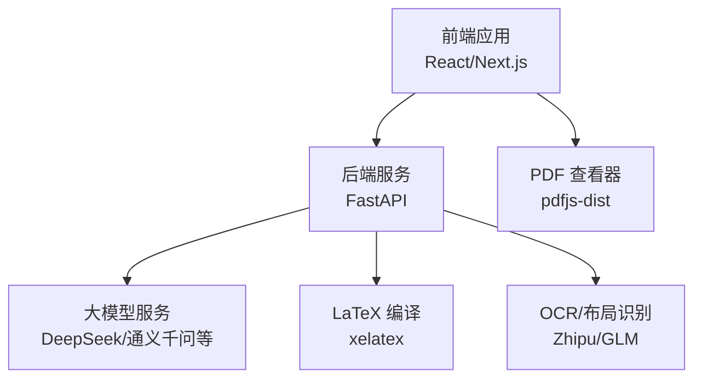

**图表来源**
- [backend/main.py:1-326](file://backend/main.py#L1-L326)
- [backend/routes/pdf.py:125-180](file://backend/routes/pdf.py#L125-L180)
- [backend/services/resume_assembler.py:280-388](file://backend/services/resume_assembler.py#L280-L388)

**章节来源**
- [backend/main.py:93-139](file://backend/main.py#L93-L139)
- [backend/routes/pdf.py:38-57](file://backend/routes/pdf.py#L38-L57)

## 核心组件
- AI 一键生成：后端提供“一句话生成简历 JSON”的接口，前端提供入口与引导。
- 对话式修改：Agent 工具链封装读取、编辑、持久化，支持路径化字段修改与富文本规范化。
- 智能上传：支持 PDF/图片上传，OCR + 结构化解析，融合 MinerU 文本生成结构化简历。
- 简历诊断：提供健康检查、语法/表达体检、JD 匹配度与关键词融入建议。
- 划词润色：基于意图检测与规则/LLM 双轨分类，支持加粗、列表转换、全文润色等。
- 可视化编辑：三列布局编辑器，支持点击/滚动/JSON 三种编辑模式，实时预览 PDF。
- 模板系统：LaTeX 模板与排版参数（字号、边距、行距等）可配置，支持一键优化。
- 高质量导出：LaTeX 渲染 PDF，支持流式编译与进度反馈，内置配额与追踪头。

**章节来源**
- [backend/routes/resume.py:795-800](file://backend/routes/resume.py#L795-L800)
- [backend/agent/tool/cv_editor_agent_tool.py:148-314](file://backend/agent/tool/cv_editor_agent_tool.py#L148-L314)
- [backend/services/resume_assembler.py:280-388](file://backend/services/resume_assembler.py#L280-L388)
- [backend/routes/resume.py:252-298](file://backend/routes/resume.py#L252-L298)
- [backend/routes/resume.py:362-420](file://backend/routes/resume.py#L362-L420)
- [frontend/src/pages/Workspace/v2/EditPreviewLayout.tsx:112-411](file://frontend/src/pages/Workspace/v2/EditPreviewLayout.tsx#L112-L411)
- [backend/routes/pdf.py:125-180](file://backend/routes/pdf.py#L125-L180)

## 架构总览
整体工作流从“用户输入/上传”开始，经“解析/生成/润色/诊断”，再到“模板渲染与导出”。Agent 工具链贯穿读取上下文、执行修改、持久化与事件上报。

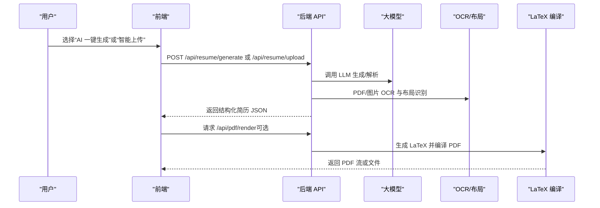

**图表来源**
- [backend/routes/resume.py:795-800](file://backend/routes/resume.py#L795-L800)
- [backend/services/resume_assembler.py:280-388](file://backend/services/resume_assembler.py#L280-L388)
- [backend/routes/pdf.py:125-180](file://backend/routes/pdf.py#L125-L180)

## 详细组件分析

### AI 一键生成
- 技术原理
  - 后端路由提供“简历生成”接口，基于提示词模板构建严格 JSON 输出的提示，调用 LLM 生成结构化简历。
  - 前端提供入口页面，引导用户选择 AI 导入或模板生成。
- 使用场景
  - 新用户无简历，输入一句话目标岗位/背景，快速生成结构化简历。
  - 与后续“智能上传”结合，形成“导入 + 生成”的闭环。
- 代码片段路径
  - [后端生成接口:795-800](file://backend/routes/resume.py#L795-L800)
  - [提示词模板构建:11-58](file://backend/prompts.py#L11-L58)
  - [前端入口页面:30-42](file://frontend/src/pages/CreateNew/index.tsx#L30-L42)

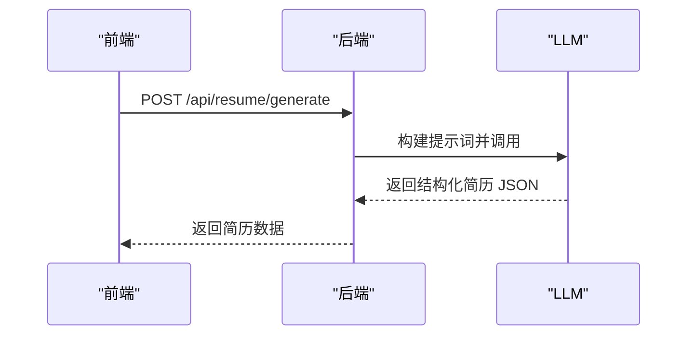

**图表来源**
- [backend/routes/resume.py:795-800](file://backend/routes/resume.py#L795-L800)
- [backend/prompts.py:11-58](file://backend/prompts.py#L11-L58)

**章节来源**
- [backend/routes/resume.py:795-800](file://backend/routes/resume.py#L795-L800)
- [backend/prompts.py:11-58](file://backend/prompts.py#L11-L58)
- [frontend/src/pages/CreateNew/index.tsx:30-42](file://frontend/src/pages/CreateNew/index.tsx#L30-L42)

### 对话式修改（Agent 工具链）
- 技术原理
  - 读取工具：将当前简历结构化为可读上下文，便于 Agent 定位字段路径。
  - 编辑工具：支持 update/add/delete，路径化字段修改，富文本规范化，补丁生成与持久化。
  - 与前端协作：编辑结果通过事件卡片与 Diff 展示，支持一键应用。
- 使用场景
  - 用户在聊天界面提出“把某段经历改得更有量化成果”，Agent 通过工具链精准修改并回显。
  - 支持批量字段修改与“自然语言”式指令。
- 代码片段路径
  - [读取上下文工具:68-206](file://backend/agent/tool/cv_reader_tool.py#L68-L206)
  - [编辑工具（执行修改/补丁/持久化）:148-314](file://backend/agent/tool/cv_editor_agent_tool.py#L148-L314)
  - [前端聊天与 Diff 展示:3240-3793](file://frontend/src/pages/AgentChat/SophiaChat.tsx#L3240-L3793)

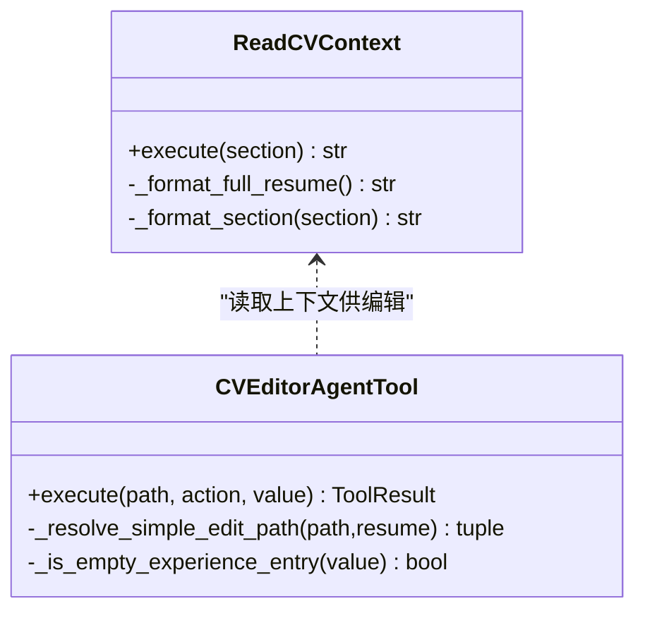

**图表来源**
- [backend/agent/tool/cv_reader_tool.py:68-206](file://backend/agent/tool/cv_reader_tool.py#L68-L206)
- [backend/agent/tool/cv_editor_agent_tool.py:148-314](file://backend/agent/tool/cv_editor_agent_tool.py#L148-L314)

**章节来源**
- [backend/agent/tool/cv_reader_tool.py:68-206](file://backend/agent/tool/cv_reader_tool.py#L68-L206)
- [backend/agent/tool/cv_editor_agent_tool.py:148-314](file://backend/agent/tool/cv_editor_agent_tool.py#L148-L314)
- [frontend/src/pages/AgentChat/SophiaChat.tsx:3240-3793](file://frontend/src/pages/AgentChat/SophiaChat.tsx#L3240-L3793)

### 智能上传（PDF/图片 → 结构化简历）
- 技术原理
  - 后端通过 OCR 与布局识别（Zhipu/GLM）抽取 PDF/图片结构化文本，结合 MinerU Markdown，使用 DeepSeek 融合生成结构化简历 JSON。
  - 前端提供上传入口，解析完成后自动跳转到工作区。
- 使用场景
  - 用户上传 PDF/图片简历，系统自动解析并生成可编辑结构。
- 代码片段路径
  - [简历组装服务（OCR+MinerU+DeepSeek）:280-388](file://backend/services/resume_assembler.py#L280-L388)
  - [前端上传后跳转工作区:69-106](file://frontend/src/pages/ResumeDashboard/index.tsx#L69-L106)

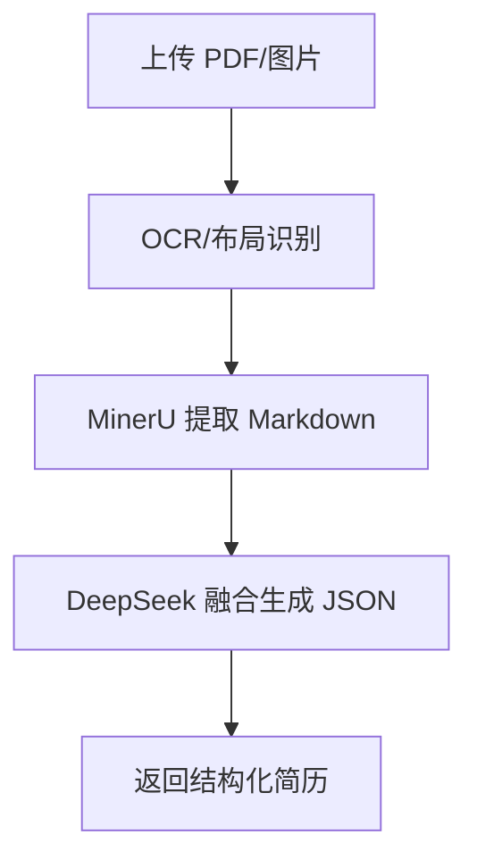

**图表来源**
- [backend/services/resume_assembler.py:280-388](file://backend/services/resume_assembler.py#L280-L388)

**章节来源**
- [backend/services/resume_assembler.py:280-388](file://backend/services/resume_assembler.py#L280-L388)
- [frontend/src/pages/ResumeDashboard/index.tsx:69-106](file://frontend/src/pages/ResumeDashboard/index.tsx#L69-L106)

### 简历诊断（健康检查/语法体检/JD 匹配）
- 技术原理
  - 健康检查：对多字段评分与建议，输出维度分数与可应用建议。
  - 语法/表达体检：识别语法、用词、模糊、量化不足等问题，返回可直接替换的片段与评分。
  - JD 匹配：计算匹配度与 ATS 兼容度，建议关键词融入与改写。
- 使用场景
  - 用户上传简历后，一键获得“通用体检”和“针对 JD 的优化建议”。
- 代码片段路径
  - [健康检查接口:726-792](file://backend/routes/resume.py#L726-L792)
  - [语法体检接口:362-420](file://backend/routes/resume.py#L362-L420)
  - [JD 优化接口:551-612](file://backend/routes/resume.py#L551-L612)
  - [前端诊断卡片展示:182-186](file://frontend/src/components/agent-chat/DiagnosisToolCards.tsx#L182-L186)

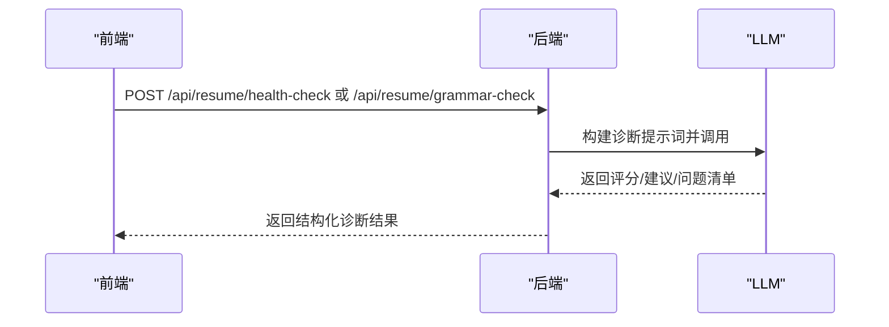

**图表来源**
- [backend/routes/resume.py:726-792](file://backend/routes/resume.py#L726-L792)
- [backend/routes/resume.py:362-420](file://backend/routes/resume.py#L362-L420)
- [backend/routes/resume.py:551-612](file://backend/routes/resume.py#L551-L612)

**章节来源**
- [backend/routes/resume.py:726-792](file://backend/routes/resume.py#L726-L792)
- [backend/routes/resume.py:362-420](file://backend/routes/resume.py#L362-L420)
- [backend/routes/resume.py:551-612](file://backend/routes/resume.py#L551-L612)
- [frontend/src/components/agent-chat/DiagnosisToolCards.tsx:182-186](file://frontend/src/components/agent-chat/DiagnosisToolCards.tsx#L182-L186)

### 划词润色（意图检测与改写）
- 技术原理
  - 双轨意图检测：规则优先 + LLM 置信度阈值，识别“加粗/选择性加粗/去除加粗/列表转换/润色”等意图。
  - 支持对纯文本或富文本字段进行改写，保留 HTML 结构。
- 使用场景
  - 用户在编辑器中选中一段文字，输入“更专业一点”或“加粗关键词”，系统自动识别意图并输出改写结果。
- 代码片段路径
  - [意图检测接口:252-298](file://backend/routes/resume.py#L252-L298)
  - [前端 AI 写入对话框:181-220](file://frontend/src/pages/Workspace/v2/shared/AIWriteDialog.tsx#L181-L220)

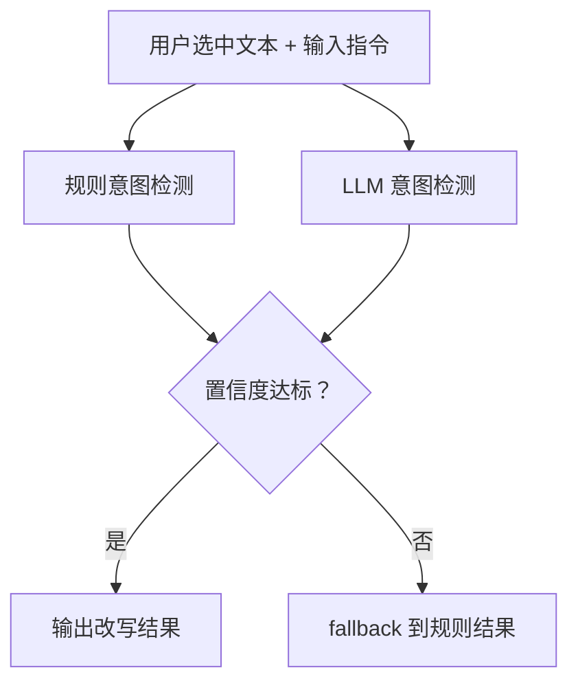

**图表来源**
- [backend/routes/resume.py:252-298](file://backend/routes/resume.py#L252-L298)

**章节来源**
- [backend/routes/resume.py:252-298](file://backend/routes/resume.py#L252-L298)
- [frontend/src/pages/Workspace/v2/shared/AIWriteDialog.tsx:181-220](file://frontend/src/pages/Workspace/v2/shared/AIWriteDialog.tsx#L181-L220)

### 可视化编辑（三列布局与预览）
- 技术原理
  - 三列布局：左侧模块选择、中间编辑面板、右侧 PDF 预览；支持拖拽调整编辑面板宽度。
  - 编辑模式：点击编辑、滚动编辑、JSON 编辑；支持富文本与字段路径化修改。
  - 预览：实时渲染 PDF，支持本地/远程渲染模式切换。
- 使用场景
  - 用户在编辑器中修改字段，预览即时更新，支持一键导出。
- 代码片段路径
  - [编辑预览布局:112-411](file://frontend/src/pages/Workspace/v2/EditPreviewLayout.tsx#L112-L411)
  - [PDF 查看器:14-177](file://frontend/src/components/PDFEditor/PDFViewer.tsx#L14-L177)
  - [模板排版参数（字号/边距/行距）:90-134](file://frontend/src/pages/Workspace/v2/SidePanel/index.tsx#L90-L134)
  - [智能单页优化（排版建议）:29-65](file://frontend/src/pages/Workspace/v2/SidePanel/SmartOnePage.tsx#L29-L65)

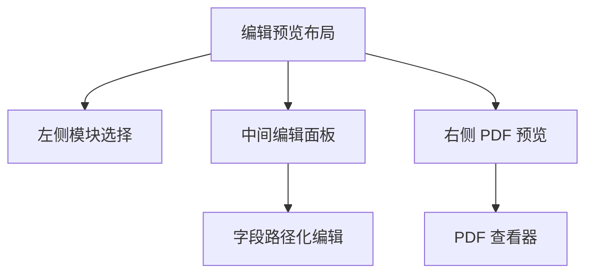

**图表来源**
- [frontend/src/pages/Workspace/v2/EditPreviewLayout.tsx:112-411](file://frontend/src/pages/Workspace/v2/EditPreviewLayout.tsx#L112-L411)
- [frontend/src/components/PDFEditor/PDFViewer.tsx:14-177](file://frontend/src/components/PDFEditor/PDFViewer.tsx#L14-L177)

**章节来源**
- [frontend/src/pages/Workspace/v2/EditPreviewLayout.tsx:112-411](file://frontend/src/pages/Workspace/v2/EditPreviewLayout.tsx#L112-L411)
- [frontend/src/components/PDFEditor/PDFViewer.tsx:14-177](file://frontend/src/components/PDFEditor/PDFViewer.tsx#L14-L177)
- [frontend/src/pages/Workspace/v2/SidePanel/index.tsx:90-134](file://frontend/src/pages/Workspace/v2/SidePanel/index.tsx#L90-L134)
- [frontend/src/pages/Workspace/v2/SidePanel/SmartOnePage.tsx:29-65](file://frontend/src/pages/Workspace/v2/SidePanel/SmartOnePage.tsx#L29-L65)

### 模板系统（LaTeX 与排版参数）
- 技术原理
  - 后端将简历 JSON 转换为 LaTeX，支持自定义字体大小、边距、行距等参数；编译为 PDF。
  - 前端提供排版参数面板，支持一键优化与预览。
- 使用场景
  - 用户调整排版参数，一键生成符合 ATS 与视觉审美的 PDF。
- 代码片段路径
  - [LaTeX 生成与排版参数:338-357](file://backend/latex_generator.py#L338-L357)
  - [PDF 渲染路由:125-180](file://backend/routes/pdf.py#L125-L180)
  - [前端排版参数选项:90-134](file://frontend/src/pages/Workspace/v2/SidePanel/index.tsx#L90-L134)

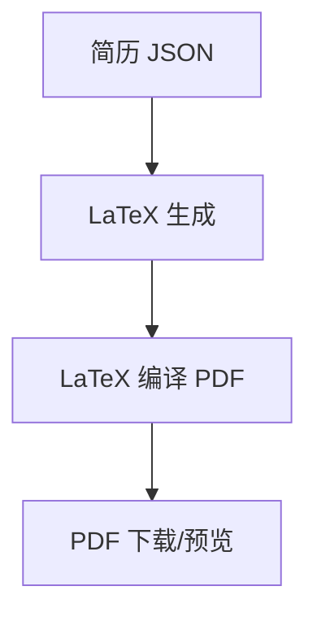

**图表来源**
- [backend/latex_generator.py:338-357](file://backend/latex_generator.py#L338-L357)
- [backend/routes/pdf.py:125-180](file://backend/routes/pdf.py#L125-L180)

**章节来源**
- [backend/latex_generator.py:338-357](file://backend/latex_generator.py#L338-L357)
- [backend/routes/pdf.py:125-180](file://backend/routes/pdf.py#L125-L180)
- [frontend/src/pages/Workspace/v2/SidePanel/index.tsx:90-134](file://frontend/src/pages/Workspace/v2/SidePanel/index.tsx#L90-L134)

### 高质量导出（PDF 渲染与流式编译）
- 技术原理
  - 支持一次性渲染与流式编译，提供进度事件与配额追踪头；可记录真实下载次数。
  - 前端通过 SSE 接收进度事件，实时更新 UI。
- 使用场景
  - 用户点击“导出 PDF”，后台流式编译并返回进度，最终下载或在线预览。
- 代码片段路径
  - [流式渲染 PDF:187-299](file://backend/routes/pdf.py#L187-L299)
  - [前端 PDF 查看器:14-177](file://frontend/src/components/PDFEditor/PDFViewer.tsx#L14-L177)

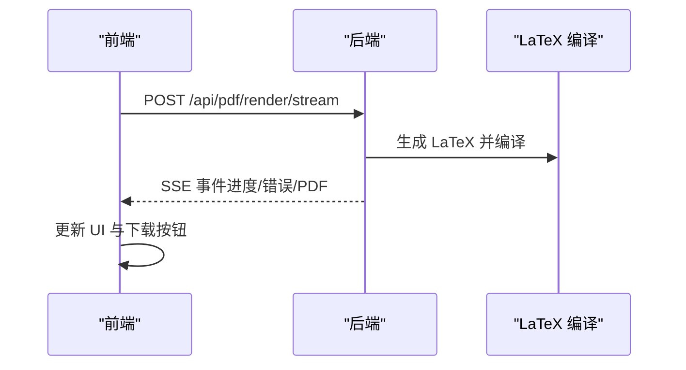

**图表来源**
- [backend/routes/pdf.py:187-299](file://backend/routes/pdf.py#L187-L299)

**章节来源**
- [backend/routes/pdf.py:187-299](file://backend/routes/pdf.py#L187-L299)
- [frontend/src/components/PDFEditor/PDFViewer.tsx:14-177](file://frontend/src/components/PDFEditor/PDFViewer.tsx#L14-L177)

### 可视化图表生成（可选能力）
- 技术原理
  - 通过 VMind 图表生成器，将数据集与用户提示转换为图表与洞察 Markdown，并保存为 PNG/HTML/JSON。
- 使用场景
  - 用户在简历中插入“项目成果图表”，系统自动生成并嵌入。
- 代码片段路径
  - [图表生成与洞察:172-372](file://backend/agent/tool/chart_visualization/src/chartVisualize.ts#L172-L372)

**章节来源**
- [backend/agent/tool/chart_visualization/src/chartVisualize.ts:172-372](file://backend/agent/tool/chart_visualization/src/chartVisualize.ts#L172-L372)

## 依赖分析
- 后端路由聚合与代理
  - 主入口聚合多路由模块，支持 Agent 后端反向代理与 SSE 透传。
- 前后端耦合点
  - 编辑器与 PDF 渲染：编辑器状态变更触发渲染，渲染结果通过 SSE 回传。
  - 诊断与润色：前端将字段内容与路径传递至后端，后端返回结构化建议与改写结果。

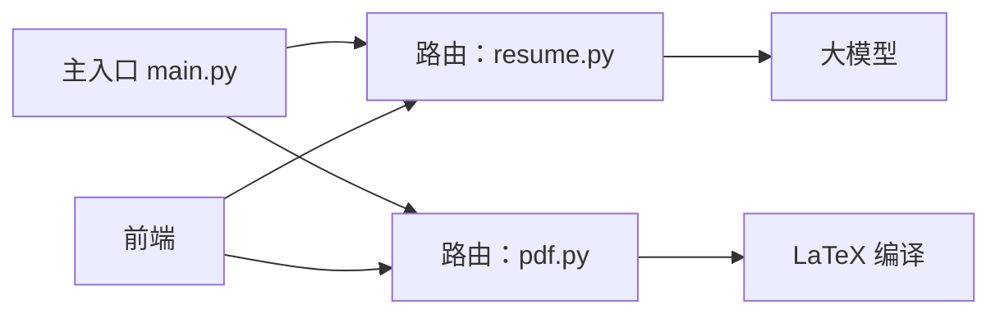

**图表来源**
- [backend/main.py:93-139](file://backend/main.py#L93-L139)
- [backend/routes/resume.py:92-92](file://backend/routes/resume.py#L92-L92)
- [backend/routes/pdf.py:34-35](file://backend/routes/pdf.py#L34-L35)

**章节来源**
- [backend/main.py:93-139](file://backend/main.py#L93-L139)
- [backend/routes/resume.py:92-92](file://backend/routes/resume.py#L92-L92)
- [backend/routes/pdf.py:34-35](file://backend/routes/pdf.py#L34-L35)

## 性能考虑
- 启动优化
  - 预热 HTTP 连接、数据库连接、tiktoken 编码文件，降低首次请求延迟。
- 渲染优化
  - 流式编译与 SSE 事件，避免长时间阻塞；前端按事件更新 UI。
- 编辑器优化
  - 拖拽宽度使用 RAF 节流与 GPU 合成，提升交互流畅度。
- OCR/解析
  - 多源数据融合（OCR + MinerU + 布局骨架）提升结构化准确率，减少人工修正成本。

[本节为通用指导，不直接分析具体文件]

## 故障排查指南
- PDF 渲染失败
  - 检查 LaTeX 编译日志与 SSE 错误事件；确认模板目录与编译环境。
  - 参考：[PDF 渲染路由错误处理:181-184](file://backend/routes/pdf.py#L181-L184)
- 诊断接口返回空建议
  - 确认字段内容非空且符合预期结构；检查 LLM 输出清洗与 JSON 解析逻辑。
  - 参考：[健康检查输出校验:747-791](file://backend/routes/resume.py#L747-L791)
- 编辑器无响应或抖动
  - 检查拖拽事件与 DOM 更新频率；确认节流与合成开启。
  - 参考：[编辑预览布局拖拽处理:168-210](file://frontend/src/pages/Workspace/v2/EditPreviewLayout.tsx#L168-L210)

**章节来源**
- [backend/routes/pdf.py:181-184](file://backend/routes/pdf.py#L181-L184)
- [backend/routes/resume.py:747-791](file://backend/routes/resume.py#L747-L791)
- [frontend/src/pages/Workspace/v2/EditPreviewLayout.tsx:168-210](file://frontend/src/pages/Workspace/v2/EditPreviewLayout.tsx#L168-L210)

## 结论
Resume-Agent 通过“生成—解析—润色—诊断—编辑—导出”的完整链路，结合 Agent 工具链与 LaTeX 模板系统，实现了从“自然语言”到“高质量 PDF”的端到端能力。前端提供直观的可视化编辑与预览，后端以模块化路由与服务支撑多场景需求。八大核心能力相互协作，既满足新手快速上手，也兼顾专业用户的深度定制。

## 附录
- 快速开始
  - 启动后端：uvicorn backend.main:app --reload --port 9000
  - 访问前端：Vite/Next.js 开发服务器（按项目配置）
- 常用接口
  - 生成简历：POST /api/resume/generate
  - 上传解析：POST /api/resume/upload（参考智能上传实现）
  - 健康检查：POST /api/resume/health-check
  - 语法体检：POST /api/resume/grammar-check
  - 润色改写：POST /api/resume/rewrite-text/intent
  - 渲染 PDF：POST /api/pdf/render 或 /api/pdf/render/stream