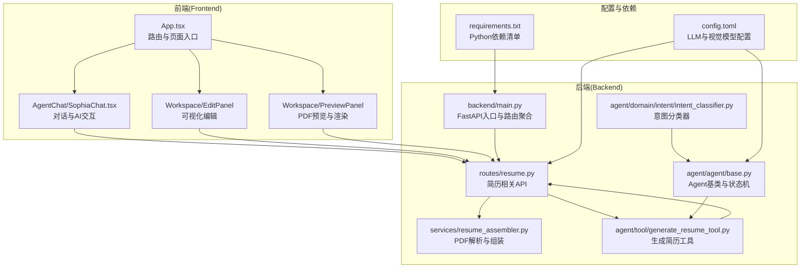
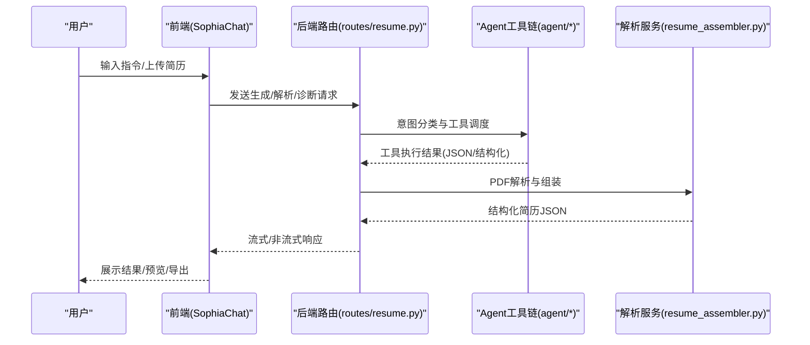
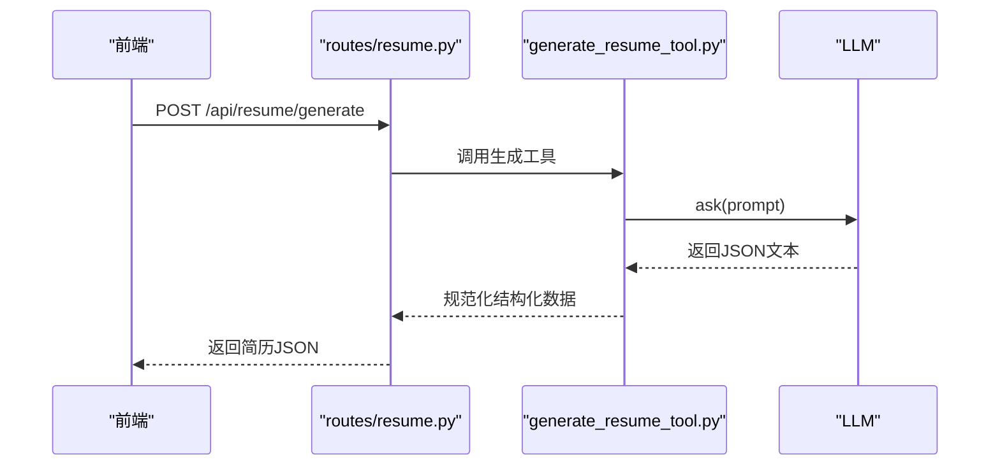
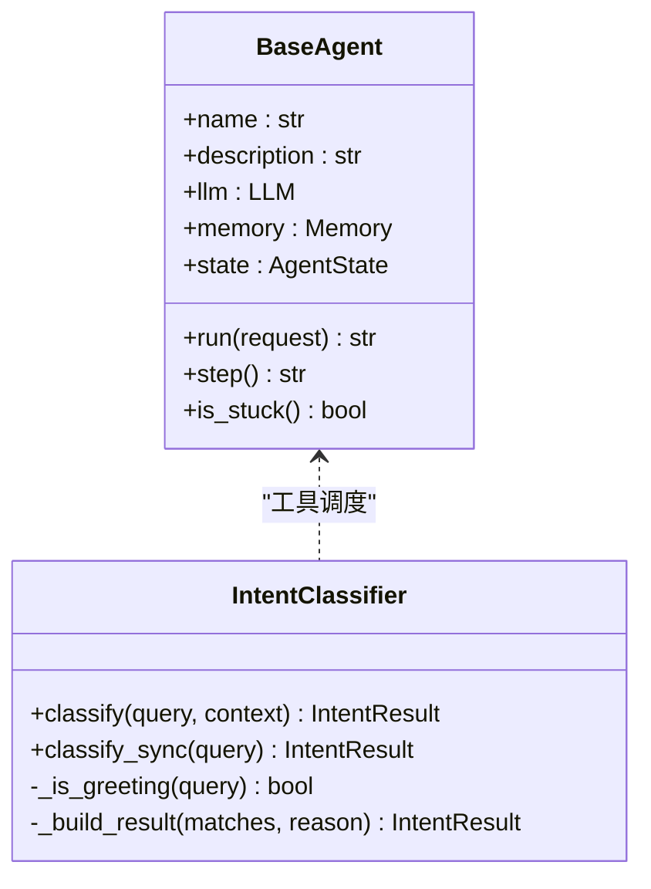
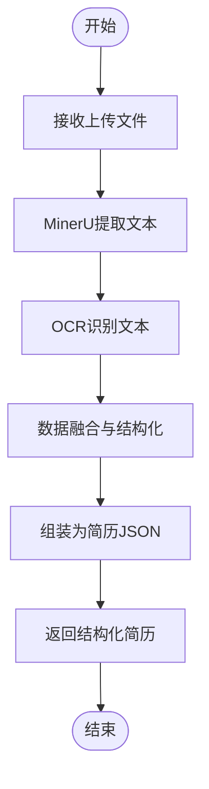
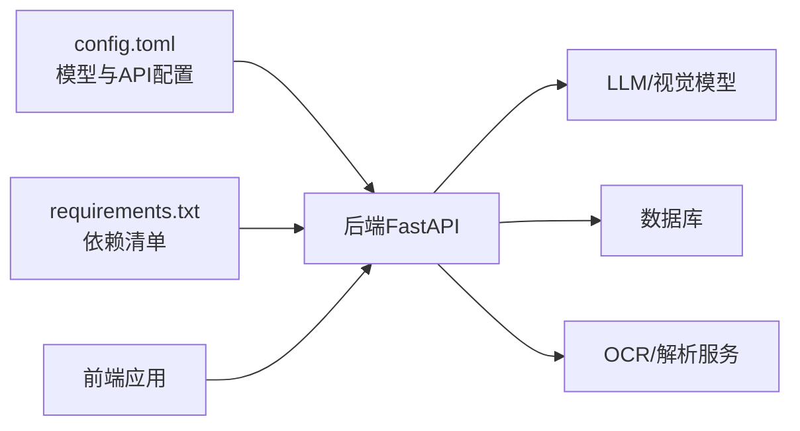

# 项目介绍

<cite>
**本文档引用的文件**
- [README.md](file://README.md)
- [backend/main.py](file://backend/main.py)
- [frontend/src/App.tsx](file://frontend/src/App.tsx)
- [backend/agent/agent/base.py](file://backend/agent/agent/base.py)
- [backend/agent/tool/generate_resume_tool.py](file://backend/agent/tool/generate_resume_tool.py)
- [backend/routes/resume.py](file://backend/routes/resume.py)
- [backend/agent/domain/intent/intent_classifier.py](file://backend/agent/domain/intent/intent_classifier.py)
- [frontend/src/pages/AgentChat/SophiaChat.tsx](file://frontend/src/pages/AgentChat/SophiaChat.tsx)
- [backend/services/resume_assembler.py](file://backend/services/resume_assembler.py)
- [frontend/src/pages/Workspace/v2/EditPanel/index.tsx](file://frontend/src/pages/Workspace/v2/EditPanel/index.tsx)
- [frontend/src/pages/Workspace/v2/PreviewPanel/index.tsx](file://frontend/src/pages/Workspace/v2/PreviewPanel/index.tsx)
- [requirements.txt](file://requirements.txt)
- [config.toml](file://config.toml)
</cite>

## 目录
1. [引言](#引言)
2. [项目结构](#项目结构)
3. [核心组件](#核心组件)
4. [架构总览](#架构总览)
5. [详细组件分析](#详细组件分析)
6. [依赖关系分析](#依赖关系分析)
7. [性能考量](#性能考量)
8. [故障排查指南](#故障排查指南)
9. [结论](#结论)
10. [附录](#附录)

## 引言
Resume-Agent 是一个面向中文求职场景的 AI 简历系统，提供从内容生成、结构化编辑到 PDF 导出的完整流程。项目以“一句话输入、生成可编辑、可导出的专业简历”为核心目标，结合对话式 AI 辅助、智能上传解析、简历诊断与润色等能力，帮助用户高效产出高质量简历。

在中文求职市场中，Resume-Agent 的定位是：
- 降低简历制作门槛：通过 AI 一键生成与智能上传，快速获得结构化简历。
- 提升简历质量：提供对话式修改、语法体检、JD 匹配诊断与润色建议。
- 保证交付质量：内置多模板与高质量 PDF 导出，满足中英文双语需求。

## 项目结构
项目采用前后端分离架构，前端使用 React + TypeScript，后端使用 FastAPI + Python，核心能力分布在简历生成、解析、编辑、导出与 AI 对话等多个模块中。

**图表来源**
- [frontend/src/App.tsx:1-111](file://frontend/src/App.tsx#L1-L111)
- [frontend/src/pages/AgentChat/SophiaChat.tsx:1-800](file://frontend/src/pages/AgentChat/SophiaChat.tsx#L1-L800)
- [frontend/src/pages/Workspace/v2/EditPanel/index.tsx:1-327](file://frontend/src/pages/Workspace/v2/EditPanel/index.tsx#L1-L327)
- [frontend/src/pages/Workspace/v2/PreviewPanel/index.tsx:124-151](file://frontend/src/pages/Workspace/v2/PreviewPanel/index.tsx#L124-L151)
- [backend/main.py:1-326](file://backend/main.py#L1-L326)
- [backend/routes/resume.py:1-800](file://backend/routes/resume.py#L1-L800)
- [backend/services/resume_assembler.py:1-388](file://backend/services/resume_assembler.py#L1-L388)
- [backend/agent/agent/base.py:1-199](file://backend/agent/agent/base.py#L1-L199)
- [backend/agent/tool/generate_resume_tool.py:1-87](file://backend/agent/tool/generate_resume_tool.py#L1-L87)
- [backend/agent/domain/intent/intent_classifier.py:1-332](file://backend/agent/domain/intent/intent_classifier.py#L1-L332)
- [config.toml:1-28](file://config.toml#L1-L28)
- [requirements.txt:1-90](file://requirements.txt#L1-L90)

**章节来源**
- [README.md:1-106](file://README.md#L1-L106)
- [backend/main.py:1-326](file://backend/main.py#L1-L326)
- [frontend/src/App.tsx:1-111](file://frontend/src/App.tsx#L1-L111)

## 核心组件
- AI 一键生成：通过生成工具根据岗位描述与背景信息，快速产出结构化简历 JSON。
- 对话式修改：前端提供对话式润色与修改界面，后端支持意图识别与工具调度。
- 智能上传：支持 PDF/图片简历上传，后端通过 OCR 与解析服务自动提取结构化数据。
- 简历诊断：提供语法体检、通用健康检查、JD 匹配诊断与关键词融入建议。
- 可视化编辑：左侧编辑、右侧预览，支持点击编辑与滚动联动。
- 模板系统：内置多套 LaTeX/HTML 模板，支持模板切换与方向模板快速创建。
- 高质量导出：基于 LaTeX 生成专业 PDF，支持中英文渲染与浏览器端导出。

**章节来源**
- [README.md:11-23](file://README.md#L11-L23)
- [backend/agent/tool/generate_resume_tool.py:25-87](file://backend/agent/tool/generate_resume_tool.py#L25-L87)
- [backend/routes/resume.py:795-800](file://backend/routes/resume.py#L795-L800)
- [frontend/src/pages/AgentChat/SophiaChat.tsx:1-800](file://frontend/src/pages/AgentChat/SophiaChat.tsx#L1-L800)
- [backend/services/resume_assembler.py:1-388](file://backend/services/resume_assembler.py#L1-L388)
- [frontend/src/pages/Workspace/v2/EditPanel/index.tsx:1-327](file://frontend/src/pages/Workspace/v2/EditPanel/index.tsx#L1-L327)
- [frontend/src/pages/Workspace/v2/PreviewPanel/index.tsx:124-151](file://frontend/src/pages/Workspace/v2/PreviewPanel/index.tsx#L124-L151)

## 架构总览
系统采用“前端路由 + SSE 事件流 + 后端 FastAPI + Agent 工具链”的组合架构。前端负责用户交互与状态管理，后端提供简历生成、解析、诊断与导出接口，Agent 子系统负责意图识别与工具调度，形成闭环的 AI 驱动简历工作流。

**图表来源**
- [frontend/src/pages/AgentChat/SophiaChat.tsx:1-800](file://frontend/src/pages/AgentChat/SophiaChat.tsx#L1-L800)
- [backend/routes/resume.py:1-800](file://backend/routes/resume.py#L1-L800)
- [backend/agent/domain/intent/intent_classifier.py:1-332](file://backend/agent/domain/intent/intent_classifier.py#L1-L332)
- [backend/agent/tool/generate_resume_tool.py:1-87](file://backend/agent/tool/generate_resume_tool.py#L1-L87)
- [backend/services/resume_assembler.py:1-388](file://backend/services/resume_assembler.py#L1-L388)

## 详细组件分析

### 组件A：AI 一键生成
- 功能概述：根据用户输入的岗位描述与背景信息，生成结构化简历 JSON。
- 关键实现：
  - 生成工具封装：定义工具参数与执行逻辑，调用 LLM 生成 JSON 并规范化数据。
  - 路由接口：提供生成接口，统一处理请求与响应。
- 复杂度与性能：生成过程涉及 LLM 调用与 JSON 解析，建议在生产环境配置合适的超时与重试策略。

**图表来源**
- [backend/agent/tool/generate_resume_tool.py:25-87](file://backend/agent/tool/generate_resume_tool.py#L25-L87)
- [backend/routes/resume.py:795-800](file://backend/routes/resume.py#L795-L800)

**章节来源**
- [backend/agent/tool/generate_resume_tool.py:1-87](file://backend/agent/tool/generate_resume_tool.py#L1-L87)
- [backend/routes/resume.py:795-800](file://backend/routes/resume.py#L795-L800)

### 组件B：对话式修改与意图识别
- 功能概述：前端提供对话式润色与修改界面，后端通过意图分类器识别用户意图并调度相应工具。
- 关键实现：
  - 意图分类器：两阶段策略（规则 + LLM），支持问候、通用对话与工具特定意图。
  - Agent 基类：提供状态机、内存管理与执行循环，保障 Agent 稳定运行。
  - 前端对话组件：支持多轮上下文、快捷标签与流式输出。
- 复杂度与性能：意图分类与工具调度涉及多轮对话与并发处理，需注意会话状态与资源释放。

**图表来源**
- [backend/agent/agent/base.py:15-199](file://backend/agent/agent/base.py#L15-L199)
- [backend/agent/domain/intent/intent_classifier.py:50-332](file://backend/agent/domain/intent/intent_classifier.py#L50-L332)

**章节来源**
- [backend/agent/domain/intent/intent_classifier.py:1-332](file://backend/agent/domain/intent/intent_classifier.py#L1-L332)
- [backend/agent/agent/base.py:1-199](file://backend/agent/agent/base.py#L1-L199)
- [frontend/src/pages/AgentChat/SophiaChat.tsx:1-800](file://frontend/src/pages/AgentChat/SophiaChat.tsx#L1-L800)

### 组件C：智能上传与简历解析
- 功能概述：支持 PDF/图片简历上传，后端通过 OCR 与解析服务自动提取结构化数据。
- 关键实现：
  - 解析服务：融合 MinerU 文本与 OCR 文本，使用 LLM 进行数据融合与结构化输出。
  - 路由接口：提供上传、解析与组装的统一入口。
- 复杂度与性能：解析过程涉及多源数据融合与 LLM 调用，建议对大文件进行分块处理与缓存。

**图表来源**
- [backend/services/resume_assembler.py:280-388](file://backend/services/resume_assembler.py#L280-L388)
- [backend/routes/resume.py:1-800](file://backend/routes/resume.py#L1-L800)

**章节来源**
- [backend/services/resume_assembler.py:1-388](file://backend/services/resume_assembler.py#L1-L388)
- [backend/routes/resume.py:1-800](file://backend/routes/resume.py#L1-L800)

### 组件D：可视化编辑与导出
- 功能概述：左侧编辑、右侧预览，支持点击编辑与滚动联动；提供 PDF 渲染与导出。
- 关键实现：
  - 编辑面板：按模块动态渲染，支持字段级 AI 导入与标题编辑。
  - 预览面板：提供 LaTeX/HTML 模板切换与 PDF 渲染按钮。
- 复杂度与性能：编辑与预览联动涉及 DOM 操作与状态同步，建议使用虚拟滚动与节流优化。

**章节来源**
- [frontend/src/pages/Workspace/v2/EditPanel/index.tsx:1-327](file://frontend/src/pages/Workspace/v2/EditPanel/index.tsx#L1-L327)
- [frontend/src/pages/Workspace/v2/PreviewPanel/index.tsx:124-151](file://frontend/src/pages/Workspace/v2/PreviewPanel/index.tsx#L124-L151)

## 依赖关系分析
- LLM 与视觉模型：通过配置文件集中管理模型与 API Key，支持 DeepSeek 与智谱视觉模型。
- 前后端通信：前端通过 SSE 与后端进行流式通信，后端提供 REST API 与代理转发。
- 第三方服务：集成搜索、OCR、PDF 解析、数据库与云存储等能力。

**图表来源**
- [config.toml:1-28](file://config.toml#L1-L28)
- [requirements.txt:1-90](file://requirements.txt#L1-L90)
- [backend/main.py:140-225](file://backend/main.py#L140-L225)

**章节来源**
- [config.toml:1-28](file://config.toml#L1-L28)
- [requirements.txt:1-90](file://requirements.txt#L1-L90)
- [backend/main.py:1-326](file://backend/main.py#L1-L326)

## 性能考量
- 启动优化：后端在启动时预热 HTTP 连接、数据库连接与编码文件，减少首次请求延迟。
- 并发与限流：前端对话组件支持并发请求与信号量限制，避免过度占用资源。
- 渲染与导出：PDF 渲染采用临时目录复制模板文件与字体，建议在容器环境中配置持久化缓存。

**章节来源**
- [backend/main.py:227-316](file://backend/main.py#L227-L316)
- [frontend/src/pages/AgentChat/SophiaChat.tsx:1-800](file://frontend/src/pages/AgentChat/SophiaChat.tsx#L1-L800)
- [backend/latex_generator.py:463-495](file://backend/latex_generator.py#L463-L495)

## 故障排查指南
- LLM 调用失败：检查 API Key 配置与网络连通性，确认模型与 base_url 设置正确。
- PDF 渲染异常：确认 XeLaTeX 环境与中文字体安装，检查模板文件与字体目录是否存在。
- 会话与历史：前端会话初始化失败时，检查认证状态与历史接口可用性。
- 依赖缺失：根据依赖清单安装缺失的 Python 包，特别是浏览器自动化与 OCR 相关组件。

**章节来源**
- [config.toml:1-28](file://config.toml#L1-L28)
- [requirements.txt:1-90](file://requirements.txt#L1-L90)
- [frontend/src/pages/AgentChat/SophiaChat.tsx:635-717](file://frontend/src/pages/AgentChat/SophiaChat.tsx#L635-L717)

## 结论
Resume-Agent 通过“AI 一键生成 + 对话式修改 + 智能上传 + 简历诊断 + 可视化编辑 + 高质量导出”的完整能力矩阵，为中文求职场景提供了高效、专业、可解释的简历制作体验。项目在架构设计上兼顾易用性与扩展性，既适合个人快速上手，也为团队协作与企业定制提供了坚实基础。

## 附录
- 快速开始：安装依赖、启动后端与前端服务，访问本地地址进行体验。
- 开发验证：前端构建与后端模块测试，建议按模块逐步验证核心功能。

**章节来源**
- [README.md:52-106](file://README.md#L52-L106)