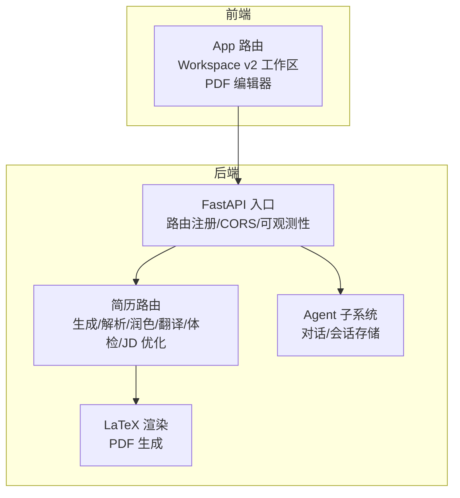
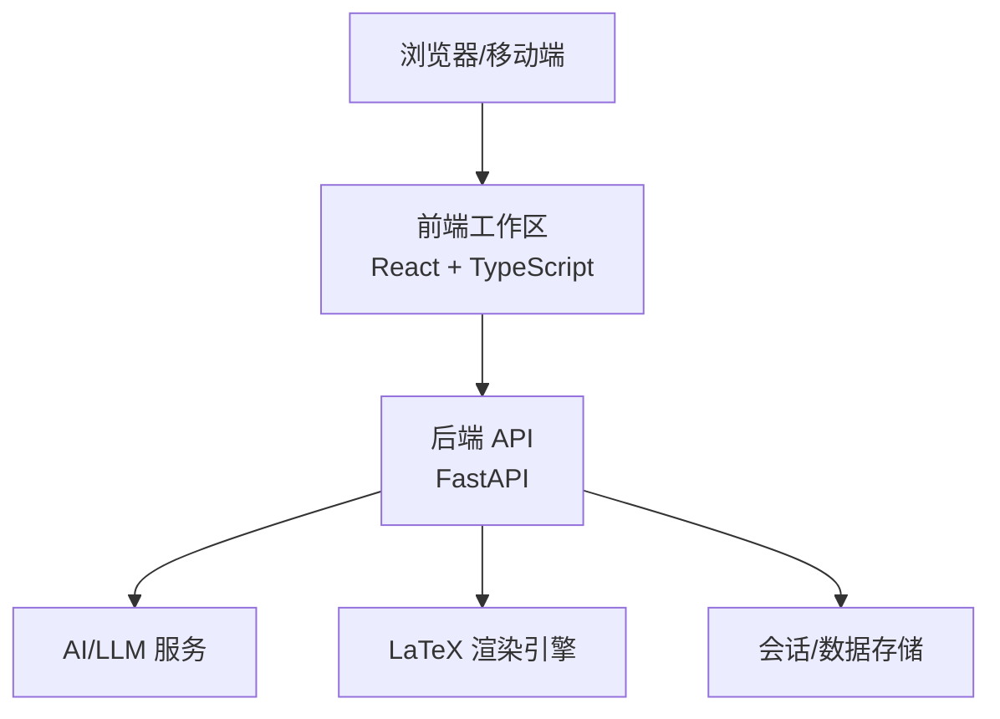
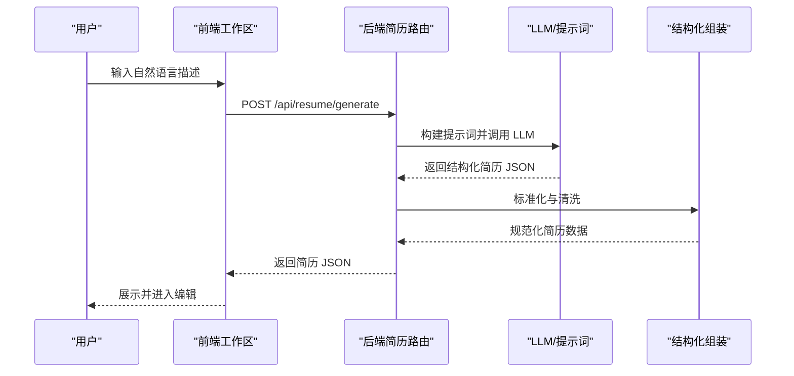
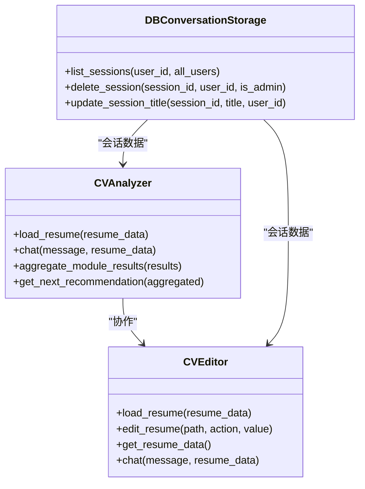
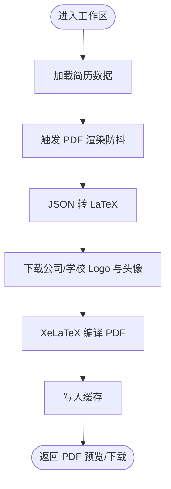
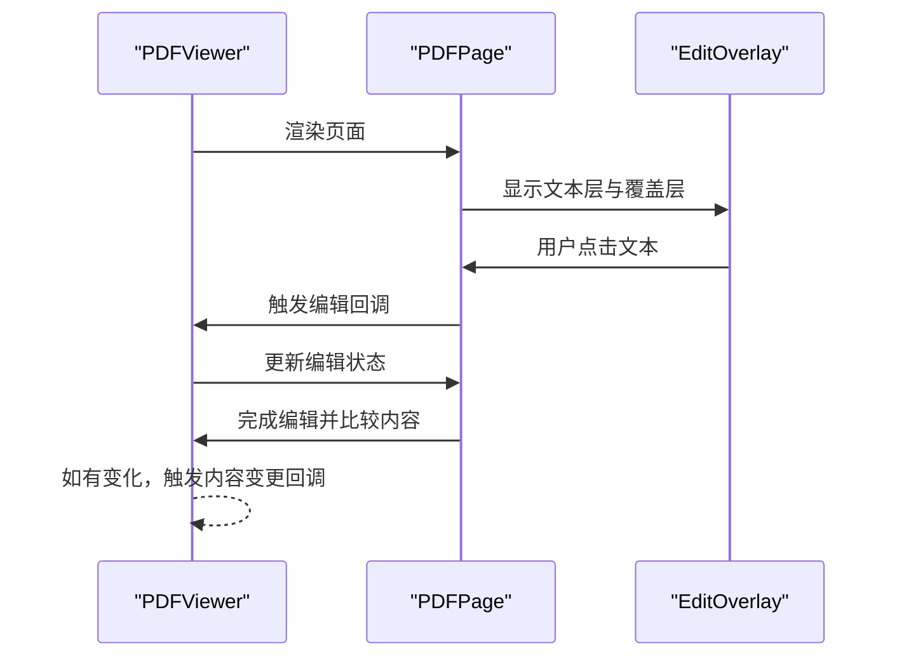
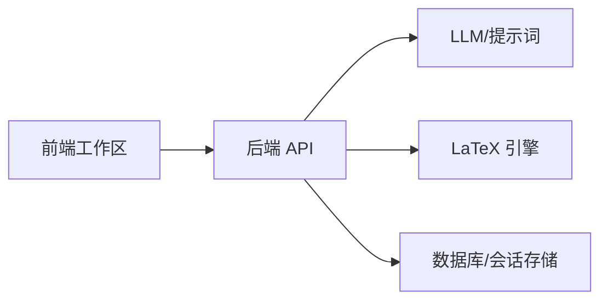

# 项目概述

<cite>
**本文档引用的文件**
- [README.md](file://README.md)
- [backend/main.py](file://backend/main.py)
- [frontend/src/App.tsx](file://frontend/src/App.tsx)
- [backend/routes/resume.py](file://backend/routes/resume.py)
- [backend/agent/agent/cv_analyzer.py](file://backend/agent/agent/cv_analyzer.py)
- [backend/agent/agent/cv_editor.py](file://backend/agent/agent/cv_editor.py)
- [backend/services/resume_assembler.py](file://backend/services/resume_assembler.py)
- [backend/latex_generator.py](file://backend/latex_generator.py)
- [frontend/src/pages/Workspace/v2/index.tsx](file://frontend/src/pages/Workspace/v2/index.tsx)
- [frontend/src/components/PDFEditor/PDFViewer.tsx](file://frontend/src/components/PDFEditor/PDFViewer.tsx)
- [frontend/src/components/PDFEditor/PDFPage.tsx](file://frontend/src/components/PDFEditor/PDFPage.tsx)
- [backend/agent/cltp/storage/db_conversation_storage.py](file://backend/agent/cltp/storage/db_conversation_storage.py)
- [backend/models.py](file://backend/models.py)
</cite>

## 目录
1. [引言](#引言)
2. [项目结构](#项目结构)
3. [核心组件](#核心组件)
4. [架构总览](#架构总览)
5. [详细组件分析](#详细组件分析)
6. [依赖关系分析](#依赖关系分析)
7. [性能考量](#性能考量)
8. [故障排查指南](#故障排查指南)
9. [结论](#结论)
10. [附录](#附录)

## 引言
Resume-Agent 是一个面向中文求职场景的 AI 简历系统，提供从内容生成、结构化编辑到 PDF 导出的完整流程。项目以“一句话输入、生成可编辑、可导出的专业简历”为核心目标，结合自然语言处理、模板系统与高质量 PDF 渲染，帮助用户高效产出符合招聘方期望的简历。

项目定位与价值主张：
- 面向中文求职市场，提供本土化的简历生成与优化能力
- 一站式工作流：从自然语言生成、结构化解析、可视化编辑，到 LaTeX/HTML 模板渲染与导出
- 丰富的 AI 能力：一键生成、对话式修改、智能上传、简历诊断、划词润色、模板切换与高质量导出

**章节来源**
- [README.md:11-23](file://README.md#L11-L23)

## 项目结构
项目采用前后端分离架构，前端使用 React + TypeScript，后端基于 FastAPI，核心能力分布在简历生成、解析、编辑、导出与对话系统等模块中。

- 前端
  - 工作区主入口：Workspace v2 提供可视化编辑、模板切换、JD 优化、翻译与健康检查等能力
  - PDF 编辑器：基于 pdfjs-dist 实现点击编辑、文本覆盖层与实时预览
  - 路由与页面：App 统一路由与权限控制，页面按功能模块拆分

- 后端
  - FastAPI 入口：集中注册路由、CORS、可观测性与代理转发
  - 简历路由：提供生成、解析、润色、翻译、体检、JD 优化等接口
  - 代理与对话：集成 Agent 子系统，支持会话存储与流式传输
  - 导出与渲染：LaTeX 渲染 PDF，HTML 模板渲染与导出

**图表来源**
- [backend/main.py:93-138](file://backend/main.py#L93-L138)
- [frontend/src/App.tsx:41-98](file://frontend/src/App.tsx#L41-L98)

**章节来源**
- [backend/main.py:93-138](file://backend/main.py#L93-L138)
- [frontend/src/App.tsx:41-98](file://frontend/src/App.tsx#L41-L98)

## 核心组件
- AI 一键生成：根据自然语言描述生成结构化简历 JSON
- 对话式修改：通过自然语言对话进行增量编辑、润色、翻译
- 智能上传：支持 PDF/图片简历上传，AI 自动解析为结构化数据
- 简历诊断：围绕 JD 匹配、内容完整性、表达质量输出评分与建议
- 划词润色：选中任意文本，一键润色、翻译、扩写或缩写
- 可视化编辑：左侧编辑、右侧实时预览，支持点击编辑与滚动编辑
- 模板系统：内置多套 LaTeX/HTML 模板，支持模板切换与方向模板快速创建
- 高质量导出：基于 LaTeX 生成专业 PDF，支持中英文渲染与浏览器端导出

**章节来源**
- [README.md:13-22](file://README.md#L13-L22)

## 架构总览
系统采用“前端工作区 + 后端 API + AI/LLM + 渲染引擎”的分层架构。前端负责交互与预览，后端提供统一 API 与会话能力，AI/LLM 负责内容生成与分析，LaTeX 引擎负责高质量 PDF 渲染。

**图表来源**
- [backend/main.py:93-138](file://backend/main.py#L93-L138)
- [backend/latex_generator.py:261-461](file://backend/latex_generator.py#L261-L461)

**章节来源**
- [backend/main.py:93-138](file://backend/main.py#L93-L138)
- [backend/latex_generator.py:261-461](file://backend/latex_generator.py#L261-L461)

## 详细组件分析

### 组件 A：简历生成与解析
- 生成流程：前端提交自然语言描述，后端调用 LLM 构建提示词，生成结构化简历 JSON
- 解析流程：支持 PDF/图片上传，结合 OCR 与文本模型融合解析为结构化数据
- 润色与翻译：提供语法/表达体检、JD 匹配优化、多字段翻译能力
- 体检与评分：通用简历体检与 JD 匹配评分，输出维度评分与可应用建议

**图表来源**
- [backend/routes/resume.py:795-800](file://backend/routes/resume.py#L795-L800)
- [backend/services/resume_assembler.py:280-388](file://backend/services/resume_assembler.py#L280-L388)

**章节来源**
- [backend/routes/resume.py:795-800](file://backend/routes/resume.py#L795-L800)
- [backend/services/resume_assembler.py:280-388](file://backend/services/resume_assembler.py#L280-L388)

### 组件 B：对话式编辑与分析
- CVAnalyzer：协调各模块分析器，聚合结果并输出结构化报告与下一步优化建议
- CVEditor：支持更新、添加、删除简历字段，提供安全的 JSON 路径操作
- 会话存储：基于数据库的会话与消息持久化，支持标题派生与列表查询

**图表来源**
- [backend/agent/agent/cv_analyzer.py:26-193](file://backend/agent/agent/cv_analyzer.py#L26-L193)
- [backend/agent/agent/cv_editor.py:45-265](file://backend/agent/agent/cv_editor.py#L45-L265)
- [backend/agent/cltp/storage/db_conversation_storage.py:854-929](file://backend/agent/cltp/storage/db_conversation_storage.py#L854-L929)

**章节来源**
- [backend/agent/agent/cv_analyzer.py:26-193](file://backend/agent/agent/cv_analyzer.py#L26-L193)
- [backend/agent/agent/cv_editor.py:45-265](file://backend/agent/agent/cv_editor.py#L45-L265)
- [backend/agent/cltp/storage/db_conversation_storage.py:854-929](file://backend/agent/cltp/storage/db_conversation_storage.py#L854-L929)

### 组件 C：可视化编辑与 PDF 渲染
- 工作区：左侧编辑、右侧实时预览，支持点击编辑与滚动编辑模式，自动触发 PDF 渲染
- PDF 编辑器：基于 pdfjs-dist 的点击编辑、文本覆盖层与编辑状态管理
- LaTeX 渲染：将简历 JSON 转换为 LaTeX，下载所需资源，编译生成 PDF，支持缓存与错误摘要

**图表来源**
- [frontend/src/pages/Workspace/v2/index.tsx:174-214](file://frontend/src/pages/Workspace/v2/index.tsx#L174-L214)
- [backend/latex_generator.py:463-676](file://backend/latex_generator.py#L463-L676)

**章节来源**
- [frontend/src/pages/Workspace/v2/index.tsx:174-214](file://frontend/src/pages/Workspace/v2/index.tsx#L174-L214)
- [backend/latex_generator.py:463-676](file://backend/latex_generator.py#L463-L676)

### 组件 D：PDF 编辑器交互
- PDFViewer：加载 PDF、分页渲染、滚动区域与加载/错误状态
- PDFPage：文本层与点击事件、编辑覆盖层、编辑状态管理
- 交互链路：点击文本触发编辑，完成编辑后回调父组件更新内容

**图表来源**
- [frontend/src/components/PDFEditor/PDFViewer.tsx:14-176](file://frontend/src/components/PDFEditor/PDFViewer.tsx#L14-L176)
- [frontend/src/components/PDFEditor/PDFPage.tsx:131-180](file://frontend/src/components/PDFEditor/PDFPage.tsx#L131-L180)

**章节来源**
- [frontend/src/components/PDFEditor/PDFViewer.tsx:14-176](file://frontend/src/components/PDFEditor/PDFViewer.tsx#L14-L176)
- [frontend/src/components/PDFEditor/PDFPage.tsx:131-180](file://frontend/src/components/PDFEditor/PDFPage.tsx#L131-L180)

## 依赖关系分析
- 前端依赖
  - React 生态：路由、Suspense、懒加载与主题初始化
  - 工作区：状态管理、JD 优化、翻译、健康检查与 AI 助手
  - PDF 编辑器：pdfjs-dist、文本层与覆盖层交互

- 后端依赖
  - FastAPI：路由注册、CORS、可观测性与代理转发
  - LLM/提示词：简历生成、润色、翻译、体检与 JD 优化
  - LaTeX：模板目录、字体与资源、编译与缓存
  - 数据库：会话与消息持久化，支持标题派生与权限校验

**图表来源**
- [backend/main.py:93-138](file://backend/main.py#L93-L138)
- [backend/latex_generator.py:261-461](file://backend/latex_generator.py#L261-L461)
- [backend/agent/cltp/storage/db_conversation_storage.py:854-929](file://backend/agent/cltp/storage/db_conversation_storage.py#L854-L929)

**章节来源**
- [backend/main.py:93-138](file://backend/main.py#L93-L138)
- [backend/latex_generator.py:261-461](file://backend/latex_generator.py#L261-L461)
- [backend/agent/cltp/storage/db_conversation_storage.py:854-929](file://backend/agent/cltp/storage/db_conversation_storage.py#L854-L929)

## 性能考量
- 启动优化
  - 预热 HTTP 连接与数据库连接，避免首次访问延迟
  - 预加载 tiktoken 编码文件，减少首次请求阻塞
- 渲染优化
  - LaTeX 编译缓存：基于内容哈希缓存 PDF，避免重复编译
  - 防抖渲染：编辑空闲一段时间后统一渲染，降低频繁编译
- 并发与稳定性
  - 会话存储支持列表查询与删除，保障大规模会话管理
  - PDF 编辑器采用异步加载与错误兜底，提升用户体验

**章节来源**
- [backend/main.py:228-316](file://backend/main.py#L228-L316)
- [backend/latex_generator.py:620-676](file://backend/latex_generator.py#L620-L676)
- [backend/agent/cltp/storage/db_conversation_storage.py:854-929](file://backend/agent/cltp/storage/db_conversation_storage.py#L854-L929)

## 故障排查指南
- LaTeX 编译失败
  - 现象：编译返回错误摘要或 PDF 未生成
  - 排查：确认 XeLaTeX 可用、模板目录存在、资源下载成功
  - 建议：查看错误摘要定位问题，按提示安装/配置 LaTeX 环境
- 会话存储异常
  - 现象：会话列表为空或删除失败
  - 排查：检查用户权限、会话 ID 与数据库连接
  - 建议：确认会话存在且归属当前用户，必要时重建索引
- PDF 编辑器加载失败
  - 现象：加载中状态长时间停留或报错
  - 排查：检查 PDF Blob 是否有效、pdfjs-lib 版本与资源路径
  - 建议：清理缓存、确认网络可达、重试加载

**章节来源**
- [backend/latex_generator.py:543-599](file://backend/latex_generator.py#L543-L599)
- [backend/agent/cltp/storage/db_conversation_storage.py:887-913](file://backend/agent/cltp/storage/db_conversation_storage.py#L887-L913)
- [frontend/src/components/PDFEditor/PDFViewer.tsx:70-128](file://frontend/src/components/PDFEditor/PDFViewer.tsx#L70-L128)

## 结论
Resume-Agent 通过“前端工作区 + 后端 API + AI/LLM + 渲染引擎”的架构，实现了中文求职场景下的简历生成、解析、编辑与导出闭环。项目在易用性与专业性之间取得平衡，既适合初学者快速上手，也为有经验的开发者提供了可扩展的模块化能力与完善的可观测性与性能优化策略。

## 附录
- 快速开始与环境要求
  - Python 3.12+、Node.js 16+、XeLaTeX、中文字体（Linux 建议安装 Noto CJK）
  - 后端：uvicorn 启动 FastAPI 应用
  - 前端：npm run dev 启动开发服务器
- 访问地址
  - 前端：http://localhost:5173
  - 后端 API：http://127.0.0.1:9000
  - OpenAPI 文档：http://127.0.0.1:9000/docs

**章节来源**
- [README.md:52-86](file://README.md#L52-L86)